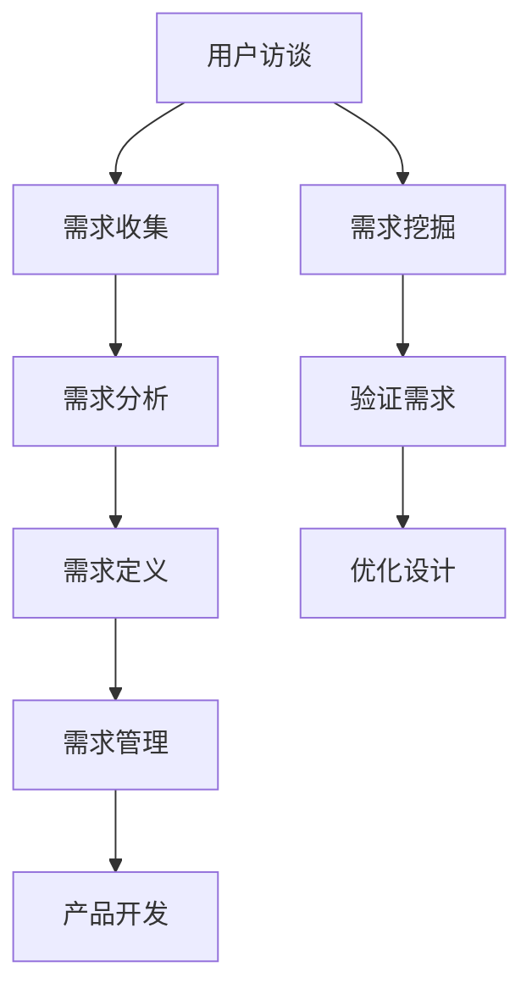
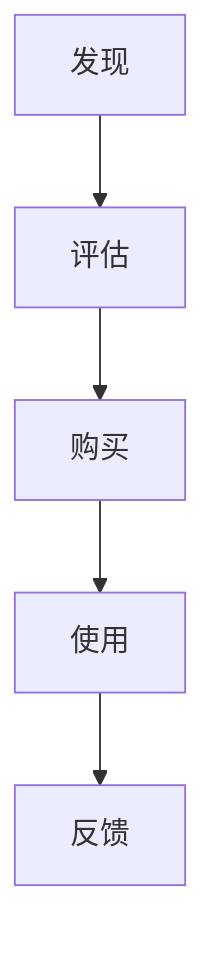

                 

# 技术人如何进行有效的用户访谈和需求挖掘

> **关键词**：用户访谈、需求挖掘、技术人、有效沟通、信息收集、用户研究

> **摘要**：本文旨在帮助技术人了解如何进行有效的用户访谈和需求挖掘。通过介绍访谈的目的、方法、技巧以及需求挖掘的关键步骤，本文将帮助读者掌握这一关键技能，从而更高效地满足用户需求，提升产品的质量和用户体验。

## 1. 背景介绍

### 1.1 目的和范围

本文的目的是向技术人介绍如何通过用户访谈和需求挖掘来获取关键的用户信息和需求。这不仅是产品开发过程中不可或缺的一环，也是确保技术解决方案与用户需求相匹配的关键步骤。本文将覆盖以下内容：

1. 用户访谈的目的和重要性
2. 用户访谈的方法和技巧
3. 需求挖掘的定义和关键步骤
4. 如何将访谈和需求挖掘结果转化为具体的技术解决方案

### 1.2 预期读者

本文预期读者为有一定技术背景的产品经理、软件工程师、数据分析师等，希望提高自己进行用户访谈和需求挖掘能力的专业人士。

### 1.3 文档结构概述

本文将分为以下几个部分：

1. 背景介绍：介绍文章的目的和预期读者。
2. 核心概念与联系：介绍用户访谈和需求挖掘的核心概念。
3. 核心算法原理 & 具体操作步骤：详细讲解用户访谈和需求挖掘的步骤和技巧。
4. 数学模型和公式 & 详细讲解 & 举例说明：介绍相关的数学模型和公式，并进行实例说明。
5. 项目实战：提供实际案例，展示用户访谈和需求挖掘的应用。
6. 实际应用场景：分析用户访谈和需求挖掘在不同领域的应用。
7. 工具和资源推荐：推荐相关工具和资源，帮助读者进一步学习和实践。
8. 总结：总结用户访谈和需求挖掘的重要性及未来发展趋势。
9. 附录：提供常见问题与解答。
10. 扩展阅读 & 参考资料：推荐进一步阅读的材料。

### 1.4 术语表

#### 1.4.1 核心术语定义

- 用户访谈：一种通过与用户直接交流获取用户需求、期望和反馈的方法。
- 需求挖掘：从用户访谈和其他信息源中提取、分析和理解用户需求的过程。
- 用户需求：用户期望从产品或服务中获得的解决方法或功能。
- 用户画像：对目标用户进行分类和描述的模型，用于指导用户访谈和需求挖掘。

#### 1.4.2 相关概念解释

- 用户体验（UX）：用户在使用产品或服务时的整体感受和满意度。
- 产品需求：描述产品应具备的功能和特性，用于指导产品设计。
- 用户研究：一系列旨在深入了解用户需求、行为和偏好的方法。

#### 1.4.3 缩略词列表

- UX：用户体验
- UI：用户界面
- SDK：软件开发工具包
- API：应用程序编程接口

## 2. 核心概念与联系

用户访谈和需求挖掘是产品开发过程中的关键环节，它们紧密相连，共同为产品的成功奠定基础。为了更好地理解这两个概念及其相互关系，我们首先需要了解一些核心概念和原理。

### 2.1 用户访谈

用户访谈是一种直接获取用户需求、反馈和偏好的方法。它通常包括以下步骤：

1. **访谈计划**：明确访谈的目的、访谈对象、访谈内容等。
2. **准备**：设计访谈问题、选择合适的访谈工具等。
3. **访谈过程**：进行面对面或在线访谈，收集用户反馈。
4. **记录和分析**：整理访谈记录，分析用户需求。

用户访谈的核心在于通过与用户的直接交流，深入了解用户的行为、需求和痛点。这有助于产品设计团队更好地理解用户，从而创造出更符合用户期望的产品。

### 2.2 需求挖掘

需求挖掘是从用户访谈和其他信息源中提取、分析和理解用户需求的过程。其核心步骤包括：

1. **需求收集**：通过用户访谈、问卷调查、观察等方法收集用户需求。
2. **需求分析**：对收集到的需求进行分类、排序和优先级划分。
3. **需求定义**：将分析后的需求转化为具体的产品需求。
4. **需求管理**：跟踪需求的变化和实现情况，确保需求得到有效落实。

需求挖掘的目的是确保产品设计团队能够准确地理解用户需求，并将这些需求转化为可实施的产品功能。

### 2.3 用户访谈与需求挖掘的联系

用户访谈和需求挖掘是相辅相成的。用户访谈提供了直接的用户反馈，为需求挖掘提供了丰富的素材。而需求挖掘则将这些反馈转化为具体的需求，指导产品设计。以下是用户访谈与需求挖掘之间的联系：

1. **用户访谈是需求挖掘的数据来源**：用户访谈可以收集到大量的用户需求和反馈，这些数据是需求挖掘的重要依据。
2. **需求挖掘是用户访谈的结果应用**：通过需求挖掘，可以将用户访谈中的反馈转化为具体的需求，指导产品设计。
3. **用户访谈与需求挖掘相互验证**：用户访谈和需求挖掘可以相互验证，确保需求的准确性和可行性。

为了更好地理解用户访谈和需求挖掘的关系，我们可以使用Mermaid流程图进行说明：



在这个流程图中，用户访谈（A）是需求挖掘（G）的数据来源，需求挖掘（G）则是用户访谈（A）的结果应用。两者相互验证（H），最终指导产品开发（F）。

## 3. 核心算法原理 & 具体操作步骤

在进行用户访谈和需求挖掘时，核心算法原理和具体操作步骤至关重要。以下将详细讲解用户访谈和需求挖掘的步骤，并提供伪代码来描述这些步骤。

### 3.1 用户访谈

#### 3.1.1 访谈计划

在进行用户访谈之前，需要制定一个详细的访谈计划，明确访谈的目的、访谈对象、访谈内容和访谈方式。

```python
# 访谈计划伪代码
interview_plan = {
    "目的": "收集用户对产品功能的需求",
    "对象": "目标用户",
    "内容": [
        "产品功能使用体验",
        "用户期望的新功能",
        "对现有功能的改进建议"
    ],
    "方式": "面对面访谈"
}
```

#### 3.1.2 准备

在访谈前，需要准备访谈所需的问题、访谈工具和访谈环境。

```python
# 访谈准备伪代码
interview_preparation = {
    "问题设计": [
        "您目前使用产品的哪些功能？",
        "您认为产品的哪些功能需要改进？",
        "您对即将推出的新功能有什么期望？"
    ],
    "工具选择": "录音设备",
    "环境设置": "安静、舒适的访谈房间"
}
```

#### 3.1.3 访谈过程

在访谈过程中，需要保持良好的沟通和引导技巧，确保用户能够充分表达自己的观点。

```python
# 访谈过程伪代码
interview_process = {
    "开场白": "感谢您参与我们的用户访谈，我们将询问一些关于您使用产品的问题。",
    "提问": [
        "您目前使用产品的哪些功能？",
        "您认为产品的哪些功能需要改进？",
        "您对即将推出的新功能有什么期望？"
    ],
    "倾听": "认真倾听用户的回答，并记录关键信息。",
    "引导": "在用户回答不清晰或偏离主题时，进行适当的引导。",
    "结束": "感谢用户的参与，并告知后续访谈结果的反馈方式。"
}
```

#### 3.1.4 记录和分析

访谈结束后，需要对访谈记录进行整理和分析，提取用户需求。

```python
# 访谈记录与分析伪代码
interview_analysis = {
    "记录整理": "将访谈过程中的关键信息整理成文档。",
    "需求提取": [
        "从用户的回答中提取具体的需求。",
        "对需求进行分类和优先级排序。"
    ],
    "需求验证": "与用户进行沟通，验证提取的需求是否准确。"
}
```

### 3.2 需求挖掘

#### 3.2.1 需求收集

需求收集是需求挖掘的第一步，通过多种方式获取用户需求。

```python
# 需求收集伪代码
demand_collection = {
    "用户访谈": "收集用户的直接反馈。",
    "问卷调查": "通过问卷收集用户的需求。",
    "用户观察": "观察用户在使用产品时的行为和反应。",
    "现有数据": "分析现有的用户数据，提取潜在需求。"
}
```

#### 3.2.2 需求分析

在需求收集后，需要对需求进行分类、排序和优先级划分。

```python
# 需求分析伪代码
demand_analysis = {
    "需求分类": "将需求按照功能、场景等分类。",
    "需求排序": "根据需求的紧急程度和重要性排序。",
    "优先级划分": "将需求划分为优先级不同的类别，如P0、P1、P2等。"
}
```

#### 3.2.3 需求定义

将分析后的需求转化为具体的产品需求。

```python
# 需求定义伪代码
demand_definition = {
    "功能需求": "描述产品应具备的功能。",
    "非功能需求": "描述产品的性能、安全性、易用性等。",
    "需求文档": "将需求整理成文档，供产品设计和开发团队参考。"
}
```

#### 3.2.4 需求管理

在需求定义后，需要对需求进行跟踪和管理。

```python
# 需求管理伪代码
demand_management = {
    "需求跟踪": "跟踪需求的实现进度。",
    "需求变更": "处理需求变更，确保需求得到有效落实。",
    "需求评审": "定期对需求进行评审，确保需求的可行性和合理性。"
}
```

通过上述用户访谈和需求挖掘的步骤，技术人可以系统地收集用户需求，并将这些需求转化为具体的产品功能，从而更好地满足用户需求。

## 4. 数学模型和公式 & 详细讲解 & 举例说明

在进行用户访谈和需求挖掘的过程中，数学模型和公式可以帮助我们更准确地理解和分析用户需求。以下将介绍一些常用的数学模型和公式，并进行详细讲解和举例说明。

### 4.1 用户需求满意度模型

用户需求满意度模型用于评估用户对产品功能或特性的满意度。一个常用的模型是Net Promoter Score（NPS），它通过以下公式计算：

$$
NPS = \frac{NPS_Q - D_Q}{100}
$$

其中，$NPS_Q$ 是净推荐值，$D_Q$ 是贬损值。

- **NPS_Q**：通过以下问题计算：
  $$
  NPS_Q = \frac{1}{N} \sum_{i=1}^{N} \text{评分} \times (\text{评分} - 7)
  $$

  其中，$N$ 是受访者的数量，评分范围为0-10分。

- **D_Q**：通过以下问题计算：
  $$
  D_Q = \frac{1}{N} \sum_{i=1}^{N} \text{评分} \times (\text{评分} - 0)
  $$

举例说明：

假设有10名受访者，其中7人评分8分，3人评分1分，则：

$$
NPS_Q = \frac{7 \times (8 - 7) + 3 \times (1 - 7)}{10 \times 100} = \frac{7 - 21}{1000} = -0.14
$$

$$
D_Q = \frac{7 \times (8 - 0) + 3 \times (1 - 0)}{10 \times 100} = \frac{56 + 3}{1000} = 0.59
$$

因此，NPS为-0.14，D_Q为0.59。

### 4.2 需求优先级排序模型

在需求分析阶段，我们需要对需求进行优先级排序。一种常用的模型是MoSCoW模型，它将需求分为以下四个类别：

- **Must have（必须要有）**：满足项目基本功能的最低要求。
- **Should have（应该有）**：满足项目主要功能的额外要求。
- **Could have（可以有）**：满足项目非核心功能的次要要求。
- **Would have（希望有）**：满足项目非必需功能的理想要求。

MoSCoW模型通过以下步骤进行需求优先级排序：

1. 将所有需求列出来。
2. 根据需求的紧急程度和重要性将其分类到MoSCoW模型中的四个类别。
3. 对每个类别中的需求进行排序。

举例说明：

假设有以下需求：

- 需求A：用户注册功能
- 需求B：用户登录功能
- 需求C：用户个人中心
- 需求D：用户反馈功能

根据需求的重要性和紧急程度，可以将它们分类如下：

- Must have：需求A、需求B
- Should have：需求C
- Could have：需求D

因此，需求A和需求B的优先级最高，需求C次之，需求D最低。

### 4.3 用户行为分析模型

用户行为分析模型用于分析用户在产品中的行为模式，从而了解用户需求。一种常用的模型是Customer Journey Map（客户旅程图），它通过以下步骤构建：

1. **定义客户旅程**：确定用户在使用产品或服务的整个过程中会经历的阶段，如发现、评估、购买、使用、反馈等。
2. **收集用户数据**：通过用户访谈、用户调研、数据分析等方法收集用户在不同阶段的行为数据。
3. **绘制客户旅程图**：根据收集的数据，绘制出用户在各个阶段的行为和反应。

举例说明：

假设我们分析一个在线购物平台，用户在平台上的客户旅程可以分为以下阶段：

- 发现：用户通过搜索引擎或社交媒体发现平台。
- 评估：用户浏览商品、比较价格和评论。
- 购买：用户添加商品到购物车，填写收货地址和支付信息。
- 使用：用户收到商品并使用。
- 反馈：用户对商品和购物体验进行评价。

根据用户数据，我们可以绘制出以下客户旅程图：



在这个客户旅程图中，我们可以看到用户在每个阶段的行为和反应，从而更深入地了解用户需求。

通过上述数学模型和公式的讲解，技术人可以更准确地分析和评估用户需求，从而更好地指导产品开发和优化。

## 5. 项目实战：代码实际案例和详细解释说明

为了更好地展示用户访谈和需求挖掘在实际项目中的应用，我们将以一个在线购物平台为例，介绍如何通过用户访谈和需求挖掘来开发一个用户评价系统。

### 5.1 开发环境搭建

在开始项目实战之前，我们需要搭建一个开发环境。以下是所需的工具和步骤：

1. **开发语言**：选择一种主流编程语言，如Python。
2. **数据库**：选择一个关系型数据库，如MySQL。
3. **Web框架**：选择一个流行的Web框架，如Django。
4. **版本控制**：使用Git进行版本控制。

安装上述工具和框架的具体步骤如下：

1. 安装Python环境：
   ```
   pip install python
   ```
2. 安装MySQL数据库：
   ```
   mysql -u root -p
   ```
3. 安装Django框架：
   ```
   pip install django
   ```
4. 配置Git：
   ```
   git config --global user.name "Your Name"
   git config --global user.email "your_email@example.com"
   ```

### 5.2 源代码详细实现和代码解读

在开发用户评价系统时，我们需要实现以下功能：

1. 用户可以对商品进行评价。
2. 系统可以展示商品的总体评分和用户评价。
3. 系统可以对用户评价进行过滤和排序。

以下是用户评价系统的源代码实现和详细解读：

#### 5.2.1 模型层

首先，我们需要在模型层定义评价实体和商品实体。

```python
# models.py

from django.db import models

class Product(models.Model):
    name = models.CharField(max_length=100)
    description = models.TextField()

class Review(models.Model):
    product = models.ForeignKey(Product, on_delete=models.CASCADE)
    user = models.ForeignKey('auth.User', on_delete=models.CASCADE)
    rating = models.IntegerField()
    comment = models.TextField()
    created_at = models.DateTimeField(auto_now_add=True)
```

- `Product` 类定义了商品的基本信息，包括商品名称和描述。
- `Review` 类定义了用户评价的基本信息，包括商品、用户、评分、评论和创建时间。

#### 5.2.2 视图层

接下来，我们需要在视图层实现用户评价的创建和展示。

```python
# views.py

from django.shortcuts import render
from .models import Product, Review

def product_detail(request, product_id):
    product = Product.objects.get(id=product_id)
    reviews = Review.objects.filter(product=product).order_by('-created_at')
    return render(request, 'product_detail.html', {'product': product, 'reviews': reviews})

def create_review(request, product_id):
    if request.method == 'POST':
        rating = int(request.POST['rating'])
        comment = request.POST['comment']
        Review.objects.create(product_id=product_id, user=request.user, rating=rating, comment=comment)
        return redirect('product_detail', product_id=product_id)
    return render(request, 'create_review.html', {'product_id': product_id})
```

- `product_detail` 视图函数用于展示商品的详细信息和用户评价。
- `create_review` 视图函数用于处理用户评价的创建。

#### 5.2.3 模板层

最后，我们需要在模板层实现用户评价的展示和输入表单。

```html
<!-- product_detail.html -->

<h2>{{ product.name }}</h2>
<p>{{ product.description }}</p>

<h3>用户评价</h3>
<ul>
    
        <li>
            <strong>评分：{{ review.rating }}</strong>
            <p>{{ review.comment }}</p>
        </li>
    
</ul>

<a href="">写评价</a>
```

```html
<!-- create_review.html -->

<h2>写评价</h2>
<form method="post">
    
    <p>
        <label for="rating">评分：</label>
        <select name="rating" id="rating">
            <option value="1">1</option>
            <option value="2">2</option>
            <option value="3">3</option>
            <option value="4">4</option>
            <option value="5">5</option>
        </select>
    </p>
    <p>
        <label for="comment">评论：</label>
        <textarea name="comment" id="comment" rows="4" cols="50"></textarea>
    </p>
    <button type="submit">提交</button>
</form>
```

### 5.3 代码解读与分析

通过上述代码实现，我们可以对用户评价系统的核心功能进行解读和分析：

1. **模型层**：定义了评价实体和商品实体，实现了评价信息的存储和管理。
2. **视图层**：通过 `product_detail` 视图函数展示商品信息和用户评价，通过 `create_review` 视图函数处理用户评价的创建。
3. **模板层**：实现了用户评价的展示和输入表单，为用户提供了友好的操作界面。

用户评价系统的关键点包括：

- **评价信息的存储和管理**：通过模型层定义的评价实体和商品实体，我们可以方便地存储和管理用户评价信息。
- **评价信息的展示**：通过视图层和模板层的配合，我们可以将用户评价信息展示给用户。
- **用户评价的创建**：通过视图层处理用户评价的创建，并将评价信息存储到数据库中。

通过这个项目实战，我们可以看到如何通过用户访谈和需求挖掘来开发一个实用的用户评价系统。在实际项目中，我们可以根据用户需求不断优化和改进系统功能，提高用户体验。

## 6. 实际应用场景

用户访谈和需求挖掘在多个领域中都有广泛的应用，下面将介绍几个典型的实际应用场景。

### 6.1 产品设计

在产品设计阶段，用户访谈和需求挖掘是不可或缺的。通过用户访谈，设计团队可以深入了解用户的需求、期望和痛点，从而创造出更符合用户期望的产品。需求挖掘则将这些用户需求转化为具体的功能和特性，指导产品设计。

### 6.2 市场营销

在市场营销领域，用户访谈和需求挖掘可以帮助企业了解目标客户的需求和偏好，从而制定更有效的市场营销策略。通过用户访谈，企业可以获取关于产品定位、市场推广和用户反馈的关键信息，为市场营销提供数据支持。

### 6.3 客户服务

在客户服务领域，用户访谈和需求挖掘可以帮助企业了解用户在使用产品或服务过程中遇到的问题和需求，从而优化客户服务流程，提高客户满意度。通过用户访谈，企业可以收集用户对产品或服务的评价和建议，为改进服务提供依据。

### 6.4 项目管理

在项目管理中，用户访谈和需求挖掘可以帮助项目团队了解项目的需求和目标，确保项目交付符合用户需求。通过用户访谈，项目团队可以及时了解用户需求的变化，调整项目计划和资源分配，提高项目成功率。

### 6.5 产品改进

在产品改进过程中，用户访谈和需求挖掘可以帮助企业了解用户对现有产品的评价和需求，从而制定改进计划。通过用户访谈，企业可以收集用户对产品功能和性能的反馈，为产品改进提供数据支持。

### 6.6 用户体验优化

在用户体验优化过程中，用户访谈和需求挖掘可以帮助企业了解用户在使用产品时的体验和感受，从而优化产品的用户体验。通过用户访谈，企业可以了解用户的操作行为、需求和痛点，为优化产品提供依据。

通过这些实际应用场景，我们可以看到用户访谈和需求挖掘在多个领域中的重要作用。技术人通过掌握用户访谈和需求挖掘的方法和技巧，可以更有效地满足用户需求，提升产品的质量和用户体验。

## 7. 工具和资源推荐

为了帮助读者更好地进行用户访谈和需求挖掘，以下推荐一些有用的工具和资源。

### 7.1 学习资源推荐

#### 7.1.1 书籍推荐

1. **《用户体验要素》**：作者：杰瑞·科林斯。本书详细介绍了用户体验设计的核心要素，包括战略、定义、范围、结构、界面和交互。
2. **《需求分析实战》**：作者：马克·多伊奇。本书通过实际案例，介绍了需求分析的方法和技巧，帮助读者更好地理解用户需求。

#### 7.1.2 在线课程

1. **Coursera - User Experience Design**：提供关于用户体验设计的全面课程，包括用户研究、需求分析、交互设计等。
2. **Udemy - Requirements Engineering: Mastering Requirements Elicitation**：介绍需求工程的基础知识，包括需求收集、分析和管理。

#### 7.1.3 技术博客和网站

1. **Smashing Magazine**：提供关于前端设计和用户体验的深入文章。
2. **UX Booth**：分享用户体验设计、研究和案例研究的博客。

### 7.2 开发工具框架推荐

#### 7.2.1 IDE和编辑器

1. **Visual Studio Code**：一款功能强大的开源代码编辑器，适用于多种编程语言。
2. **PyCharm**：一款适用于Python的集成开发环境，提供丰富的开发工具和调试功能。

#### 7.2.2 调试和性能分析工具

1. **Postman**：一款API调试工具，适用于Web和移动应用程序的调试。
2. **JMeter**：一款开源的性能测试工具，适用于Web和分布式应用程序的性能测试。

#### 7.2.3 相关框架和库

1. **Django**：一款流行的Python Web框架，适用于快速开发Web应用程序。
2. **React**：一款流行的JavaScript库，适用于构建用户界面。

通过以上工具和资源的推荐，读者可以更好地进行用户访谈和需求挖掘，提高自己的专业技能。

## 8. 总结：未来发展趋势与挑战

用户访谈和需求挖掘在技术人工作中起着至关重要的作用，它们不仅是产品开发和优化的重要环节，也是提升用户体验和市场竞争力的关键手段。然而，随着技术的不断发展和用户需求的日益多样化，用户访谈和需求挖掘面临着新的挑战和机遇。

### 8.1 未来发展趋势

1. **人工智能的融入**：随着人工智能技术的发展，自动化用户访谈和需求挖掘将成为可能。通过自然语言处理和机器学习算法，技术人可以更高效地分析用户反馈和数据，从而更准确地捕捉用户需求。
2. **数据分析的深化**：数据分析技术在用户访谈和需求挖掘中的应用将越来越广泛。通过大数据分析和数据挖掘技术，技术人可以更深入地了解用户行为和需求模式，从而优化产品设计。
3. **跨渠道的用户访谈**：随着移动互联网和物联网的发展，用户访谈的渠道将越来越多样化。技术人需要掌握多种用户访谈方法，以适应不同场景和用户需求。
4. **用户体验的个性化**：未来的产品设计和优化将更加注重个性化体验。通过用户访谈和需求挖掘，技术人可以了解用户个性化的需求，从而提供定制化的解决方案。

### 8.2 未来挑战

1. **数据隐私和保护**：在用户访谈和需求挖掘过程中，如何保护用户隐私和数据安全是一个重要挑战。技术人需要遵守相关的法律法规，确保用户数据的隐私和安全。
2. **用户需求的快速变化**：随着市场的快速变化和用户需求的不断升级，技术人需要及时调整和更新用户访谈和需求挖掘的方法和策略，以应对快速变化的需求。
3. **多语言和多文化的挑战**：全球化和国际化趋势使得用户访谈和需求挖掘面临着多语言和多文化的挑战。技术人需要具备跨文化的沟通能力和国际化的视野，以更好地理解和满足不同文化背景下的用户需求。
4. **持续学习和创新能力**：用户访谈和需求挖掘是一个不断发展的领域，技术人需要不断学习和创新，以应对新兴技术和用户需求的变化。

总之，用户访谈和需求挖掘在未来将继续发挥重要作用，同时也面临着新的挑战。技术人需要不断学习和提升自己的专业技能，以应对这些挑战，为用户提供更好的产品和服务。

## 9. 附录：常见问题与解答

### 9.1 如何确保用户访谈的准确性？

确保用户访谈的准确性需要以下几点：

1. **明确访谈目的**：在访谈前，明确访谈的目的和目标，以便有针对性地提问。
2. **准备充分**：在访谈前，充分准备访谈问题，并确保问题具有明确、简洁、具体的特点。
3. **倾听技巧**：在访谈过程中，认真倾听用户的回答，避免打断或引导用户。
4. **记录与分析**：在访谈结束后，及时记录访谈内容，并进行详细的分析，确保提取的需求准确无误。

### 9.2 需求挖掘中的常见问题有哪些？

需求挖掘中常见的几个问题包括：

1. **需求不明确**：需求描述不清晰，导致开发团队无法准确理解和实现。
2. **需求重复**：在需求收集过程中，可能会出现重复的需求，需要合并或删除。
3. **需求变更频繁**：在项目开发过程中，需求可能会频繁变更，导致项目进度和成本增加。
4. **需求优先级不明确**：需求没有明确的优先级，导致资源分配不合理。

### 9.3 如何提高用户访谈和需求挖掘的效率？

提高用户访谈和需求挖掘的效率可以从以下几个方面着手：

1. **自动化工具**：使用自动化工具进行用户访谈和需求收集，如问卷调查、在线访谈等。
2. **数据分析**：利用数据分析技术，快速提取用户需求，减少人工工作量。
3. **流程优化**：优化用户访谈和需求挖掘的流程，减少不必要的环节和重复工作。
4. **跨部门协作**：与产品、开发、测试等部门紧密协作，提高需求分析和实现效率。

## 10. 扩展阅读 & 参考资料

为了帮助读者进一步了解用户访谈和需求挖掘的相关知识，以下推荐一些扩展阅读和参考资料：

1. **书籍**：
   - 《用户体验设计实战》
   - 《需求工程：实践指南》
   - 《用户研究实战：方法论与案例解析》

2. **在线课程**：
   - "用户体验设计基础"（Coursera）
   - "需求工程：需求收集与需求分析"（Udemy）

3. **技术博客和网站**：
   - "UI中国的用户体验专栏"
   - "产品观察"公众号

4. **相关论文和著作**：
   - "用户研究方法论：设计与实践"
   - "需求工程：理论与方法"

通过这些扩展阅读和参考资料，读者可以更深入地了解用户访谈和需求挖掘的理论和实践，提高自己的专业技能。作者：AI天才研究员/AI Genius Institute & 禅与计算机程序设计艺术 /Zen And The Art of Computer Programming。

