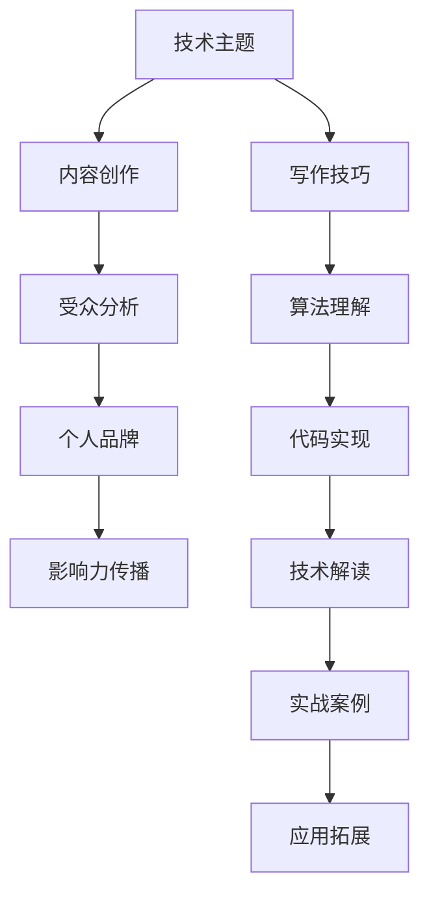

                 

# 技术写作：从博客到专栏作家之路

> **关键词**：技术写作、博客、专栏作家、内容创作、技术博客、个人品牌、写作技巧

> **摘要**：本文将探讨从技术博客写作到成为专栏作家的旅程。通过分析核心概念、算法原理、实战案例、应用场景以及未来发展，为技术爱好者提供一条清晰的成长路径。无论您是初学者还是经验丰富的博主，本文都将帮助您提升写作技巧，构建个人品牌，并在技术领域取得成功。

## 1. 背景介绍

### 1.1 目的和范围

本文旨在为那些希望将自己的技术博客提升为专业专栏的作者提供指导。文章将覆盖以下主题：

- 技术写作的基本概念和原则
- 技术博客的写作技巧和策略
- 如何构建个人品牌和吸引读者
- 实战案例分析和技术解读
- 未来发展趋势与挑战

### 1.2 预期读者

本文适合以下读者群体：

- 对技术写作有浓厚兴趣的技术爱好者
- 已经拥有技术博客但希望提升写作质量的博主
- 希望通过写作构建个人品牌的行业专业人士
- 想要在技术领域内成为专栏作家的初学者和从业者

### 1.3 文档结构概述

本文将分为以下几个部分：

- 第1部分：背景介绍，包括目的和范围、预期读者、文档结构概述和术语表
- 第2部分：核心概念与联系，使用Mermaid流程图展示技术架构
- 第3部分：核心算法原理与具体操作步骤，使用伪代码详细阐述
- 第4部分：数学模型和公式，详细讲解并举例说明
- 第5部分：项目实战，包括开发环境搭建、源代码实现和代码解读
- 第6部分：实际应用场景，探讨技术在不同领域中的应用
- 第7部分：工具和资源推荐，包括学习资源、开发工具框架和相关论文著作
- 第8部分：总结，展望技术写作的未来发展趋势与挑战
- 第9部分：附录，常见问题与解答
- 第10部分：扩展阅读与参考资料

### 1.4 术语表

#### 1.4.1 核心术语定义

- **技术写作**：针对技术主题的写作，包括代码、算法、架构等。
- **博客**：一种在线日志形式，用于发布个人观点和经验分享。
- **专栏作家**：在某个特定领域内，拥有稳定受众和较高影响力的专业写手。
- **个人品牌**：个人在特定领域内的专业形象和声誉。

#### 1.4.2 相关概念解释

- **内容创作**：创造和编写具有价值、有针对性的文章、教程和分享。
- **受众群体**：阅读并关注特定博客或专栏的读者群体。
- **影响力**：个人在特定领域内，通过内容创作和传播获得的认可和尊重。

#### 1.4.3 缩略词列表

- **IDE**：集成开发环境（Integrated Development Environment）
- **Markdown**：一种轻量级标记语言，用于格式化文本
- **LaTeX**：一种排版系统，用于创建高质量的科学文档

## 2. 核心概念与联系

为了更好地理解技术写作，我们需要首先了解其核心概念和相互联系。以下是关键概念及其关系的Mermaid流程图：



### 2.1 技术主题

技术主题是技术写作的核心，它决定了内容的专业性和深度。从人工智能、大数据到区块链，每个技术主题都有其独特的理论和实践应用。了解技术主题的发展动态和前沿技术，是写好技术博客的基础。

### 2.2 内容创作

内容创作是技术写作的关键环节。它不仅要求作者具备扎实的技术背景，还需要具备良好的表达能力和逻辑思维。高质量的内容能够吸引读者，并建立作者的个人品牌。

### 2.3 受众分析

了解受众是提高博客影响力的重要步骤。通过分析读者的兴趣、需求和阅读习惯，作者可以更好地定位内容，提升用户体验。

### 2.4 个人品牌

个人品牌是专栏作家的核心资产。通过持续的内容输出和专业的技术解读，作者可以在技术领域内建立自己的声誉和影响力。

### 2.5 影响力传播

影响力传播是扩大读者群和提升个人品牌的重要手段。通过社交媒体、行业活动和技术社区，作者可以将自己的声音传递给更广泛的受众。

### 2.6 写作技巧

写作技巧是技术博客的灵魂。清晰的结构、简洁的语言和生动的例子，能够提升文章的可读性和吸引力。

### 2.7 算法理解

算法理解是技术博客的核心价值之一。深入剖析算法原理和实现细节，不仅能够提高文章的技术深度，还能够为读者提供实际操作指导。

### 2.8 代码实现

代码实现是技术博客的实践部分。通过展示具体的代码片段和实现过程，作者可以帮助读者更好地理解技术概念。

### 2.9 技术解读

技术解读是将复杂的技术概念转化为通俗易懂的语言。通过深入剖析技术原理和应用场景，作者可以为读者提供有价值的技术见解。

### 2.10 实战案例

实战案例是技术博客的亮点。通过实际项目案例，作者可以展示技术的实际应用效果，并分享实战经验和教训。

### 2.11 应用拓展

应用拓展是将技术应用到不同领域的重要手段。通过探讨技术的跨领域应用，作者可以拓宽读者的视野，提升文章的实用性。

## 3. 核心算法原理 & 具体操作步骤

在本节中，我们将探讨一个核心算法的原理，并使用伪代码详细阐述其操作步骤。

### 3.1 算法原理

假设我们要设计一个简单的排序算法——冒泡排序（Bubble Sort）。该算法的基本原理是通过反复交换相邻的未排序元素，使得每一轮迭代后最大的元素逐渐“冒泡”到数组的末尾。

### 3.2 伪代码

```pseudocode
function bubbleSort(arr)
    n = length(arr)
    for i from 0 to n-1
        for j from 0 to n-i-1
            if arr[j] > arr[j+1]
                swap(arr[j], arr[j+1])
    return arr
```

### 3.3 操作步骤

1. **初始化**：设置一个长度为n的数组`arr`。
2. **外层循环**：从第一个元素开始，遍历到倒数第二个元素。这个循环控制着排序的轮数。
3. **内层循环**：从第一个元素开始，遍历到当前轮数结束。这个循环负责每一轮的元素交换。
4. **比较和交换**：如果当前元素的值大于下一个元素的值，则交换它们的位置。
5. **结束条件**：当内层循环完成一轮后，最大的元素已经“冒泡”到数组的末尾。此时，再次进行内层循环，处理剩下的未排序元素。
6. **返回结果**：当所有元素都按照升序排列后，返回排序后的数组。

通过上述伪代码和操作步骤，我们可以清晰地理解冒泡排序算法的原理和实现过程。

## 4. 数学模型和公式 & 详细讲解 & 举例说明

在本节中，我们将介绍一个常用的数学模型——线性回归（Linear Regression），并使用LaTeX格式详细讲解其公式和实现过程，最后通过一个具体例子来说明其应用。

### 4.1 线性回归模型

线性回归是一种用于预测数值型变量的统计方法。其基本模型可以表示为：

\[ y = \beta_0 + \beta_1 \cdot x + \varepsilon \]

其中：

- \( y \) 是因变量（预测目标）
- \( x \) 是自变量（特征）
- \( \beta_0 \) 是截距
- \( \beta_1 \) 是斜率
- \( \varepsilon \) 是误差项

### 4.2 公式详细讲解

1. **最小二乘法**：线性回归模型的参数估计通常采用最小二乘法（Ordinary Least Squares，OLS）。其目标是最小化预测值与实际值之间的平方误差。

\[ \sum_{i=1}^n (y_i - \hat{y}_i)^2 \]

其中：

- \( n \) 是样本数量
- \( \hat{y}_i \) 是预测值

2. **正规方程**：为了求解最小二乘问题，我们可以使用正规方程（Normal Equations）。

\[ \sum_{i=1}^n y_i = n\beta_0 + \beta_1 \sum_{i=1}^n x_i \]
\[ \sum_{i=1}^n x_i y_i = \beta_0 \sum_{i=1}^n x_i + \beta_1 \sum_{i=1}^n x_i^2 \]

### 4.3 举例说明

假设我们有一组数据，包含自变量\( x \)和因变量\( y \)：

| \( x \) | \( y \) |
| ------ | ------ |
| 1      | 2      |
| 2      | 4      |
| 3      | 6      |
| 4      | 8      |

我们要使用线性回归模型预测当\( x = 5 \)时的\( y \)值。

1. **计算平均值**：

\[ \bar{x} = \frac{1 + 2 + 3 + 4}{4} = 2.5 \]
\[ \bar{y} = \frac{2 + 4 + 6 + 8}{4} = 5 \]

2. **计算斜率**：

\[ \beta_1 = \frac{\sum_{i=1}^n (x_i - \bar{x})(y_i - \bar{y})}{\sum_{i=1}^n (x_i - \bar{x})^2} \]

\[ \beta_1 = \frac{(1-2.5)(2-5) + (2-2.5)(4-5) + (3-2.5)(6-5) + (4-2.5)(8-5)}{(1-2.5)^2 + (2-2.5)^2 + (3-2.5)^2 + (4-2.5)^2} \]

\[ \beta_1 = \frac{(-1.5)(-3) + (-0.5)(-1) + (0.5)(1) + (1.5)(3)}{2.25 + 0.25 + 0.25 + 2.25} \]

\[ \beta_1 = \frac{4.5 + 0.5 + 0.5 + 4.5}{5} \]

\[ \beta_1 = \frac{10}{5} \]

\[ \beta_1 = 2 \]

3. **计算截距**：

\[ \beta_0 = \bar{y} - \beta_1 \bar{x} \]

\[ \beta_0 = 5 - 2 \cdot 2.5 \]

\[ \beta_0 = 5 - 5 \]

\[ \beta_0 = 0 \]

4. **预测值**：

\[ \hat{y} = \beta_0 + \beta_1 \cdot x \]

\[ \hat{y} = 0 + 2 \cdot 5 \]

\[ \hat{y} = 10 \]

因此，当\( x = 5 \)时，预测的\( y \)值为10。

## 5. 项目实战：代码实际案例和详细解释说明

在本节中，我们将通过一个实际项目案例——使用Python实现线性回归模型，来展示代码实现过程并详细解释代码中的关键部分。

### 5.1 开发环境搭建

为了实现线性回归模型，我们需要安装Python环境和相关库。以下是开发环境搭建步骤：

1. **安装Python**：前往Python官方网站（https://www.python.org/）下载并安装Python 3.x版本。
2. **安装Jupyter Notebook**：打开终端，运行以下命令安装Jupyter Notebook。

```bash
pip install notebook
```

3. **安装NumPy和Pandas**：NumPy和Pandas是Python中常用的数据处理库。运行以下命令进行安装。

```bash
pip install numpy
pip install pandas
```

### 5.2 源代码详细实现和代码解读

以下是一个简单的线性回归模型实现代码：

```python
import numpy as np
import pandas as pd

# 数据准备
data = pd.DataFrame({'x': [1, 2, 3, 4], 'y': [2, 4, 6, 8]})

# 添加一列截距，方便计算
data['1'] = 1

# 拟合线性回归模型
X = data[['1', 'x']]
y = data['y']
model = np.linalg.lstsq(X, y, rcond=None)[0]

# 输出模型参数
beta_0, beta_1 = model
print(f"截距（beta_0）: {beta_0}, 斜率（beta_1）: {beta_1}")

# 预测新数据
x_new = np.array([5])
y_pred = beta_0 + beta_1 * x_new
print(f"当 x = 5 时，预测的 y 值为：{y_pred[0]}")
```

### 5.3 代码解读与分析

1. **数据准备**：我们使用Pandas库读取一个简单的数据集，包含自变量\( x \)和因变量\( y \)。

2. **添加截距列**：线性回归模型通常包含一个截距项（\( \beta_0 \)）。在本例中，我们通过添加一列全为1的虚拟变量来表示截距。

3. **拟合模型**：使用NumPy库中的`lstsq`函数拟合线性回归模型。该函数使用最小二乘法求解线性方程组，返回模型参数。

4. **输出模型参数**：输出拟合得到的截距（\( \beta_0 \)）和斜率（\( \beta_1 \)）。

5. **预测新数据**：使用拟合得到的模型参数预测新数据。在本例中，我们预测当\( x = 5 \)时的\( y \)值。

通过这个实际项目案例，我们展示了如何使用Python实现线性回归模型，并详细解释了代码中的关键部分。这个案例可以帮助读者更好地理解线性回归模型的原理和实现过程。

## 6. 实际应用场景

线性回归模型在多个实际应用场景中具有重要价值，以下是一些常见应用：

### 6.1 金融预测

线性回归模型可以用于股票价格、利率等金融指标的预测。通过分析历史数据，可以预测未来的市场走势，为投资决策提供参考。

### 6.2 风险评估

在线性回归模型中，自变量和因变量之间的关系可以表示为风险因素和损失之间的关系。这种关系可以帮助金融机构评估信用风险，预测潜在损失。

### 6.3 销售预测

企业可以利用线性回归模型预测未来的销售额。通过分析历史销售数据，可以为企业制定生产计划和营销策略提供依据。

### 6.4 健康监测

线性回归模型可以用于健康数据的分析，预测患者的健康状态。通过分析生理指标，可以及早发现潜在的健康问题，为医生制定治疗方案提供参考。

### 6.5 资源优化

线性回归模型可以帮助企业优化资源分配，提高生产效率。通过分析生产数据，可以预测资源需求，为企业制定最优的生产计划。

### 6.6 智能家居

智能家居系统可以利用线性回归模型预测用户的日常行为，如用电量、用水量等。通过这些预测，可以为用户提供更加个性化的服务和节能建议。

通过以上实际应用场景，我们可以看到线性回归模型在多个领域都具有广泛的应用。它不仅可以帮助企业提高生产效率，还可以为个人提供更加便捷和智能化的服务。

## 7. 工具和资源推荐

为了提高技术写作和项目开发的效率，以下是一些实用的工具和资源推荐。

### 7.1 学习资源推荐

#### 7.1.1 书籍推荐

- **《Python编程：从入门到实践》**：适合初学者，系统介绍了Python语言的基础知识和实际应用。
- **《机器学习实战》**：涵盖多种机器学习算法和实际应用案例，适合希望深入学习的读者。
- **《深度学习》**：由著名深度学习专家Ian Goodfellow撰写，是深度学习领域的经典教材。

#### 7.1.2 在线课程

- **Coursera**：提供丰富的计算机科学和机器学习课程，适合自学。
- **edX**：与世界顶尖大学合作，提供高质量的课程资源。
- **Udacity**：专注于技术领域，提供项目驱动型课程，适合希望快速掌握技能的读者。

#### 7.1.3 技术博客和网站

- **Medium**：一个广泛的技术博客平台，涵盖多个技术领域。
- **Hacker News**：一个关于科技、创业和编程的新闻网站，适合了解技术行业动态。
- **Stack Overflow**：一个庞大的编程问答社区，适合解决编程问题。

### 7.2 开发工具框架推荐

#### 7.2.1 IDE和编辑器

- **Visual Studio Code**：一款轻量级、可扩展的IDE，支持多种编程语言。
- **PyCharm**：一款专业的Python IDE，提供强大的代码补全、调试和项目管理功能。
- **Jupyter Notebook**：一款交互式的Python开发环境，适合数据科学和机器学习项目。

#### 7.2.2 调试和性能分析工具

- **GDB**：一款功能强大的调试工具，适用于C/C++程序。
- **Valgrind**：一款内存检查工具，可以帮助发现内存泄漏和无效指针问题。
- **Xray**：一款性能分析工具，可以用于优化Web应用的性能。

#### 7.2.3 相关框架和库

- **TensorFlow**：一款广泛使用的深度学习框架，适用于构建和训练神经网络。
- **PyTorch**：一款流行的深度学习框架，提供灵活的动态计算图。
- **Scikit-learn**：一款用于机器学习的Python库，提供了多种算法和工具。

### 7.3 相关论文著作推荐

#### 7.3.1 经典论文

- **《A Course in Machine Learning》**：由David Barber撰写，是机器学习领域的经典教材。
- **《Deep Learning》**：由Ian Goodfellow、Yoshua Bengio和Aaron Courville撰写，是深度学习领域的权威著作。

#### 7.3.2 最新研究成果

- **《Neural Networks and Deep Learning》**：由Michael Nielsen撰写，介绍了深度学习的最新进展。
- **《Reinforcement Learning: An Introduction》**：由Richard S. Sutton和Andrew G. Barto撰写，是强化学习领域的经典著作。

#### 7.3.3 应用案例分析

- **《How We Wrote a Neural Network in 7 Days》**：一个关于如何使用TensorFlow实现神经网络的实战案例。
- **《A Tour of Machine Learning Algorithms》**：一个关于机器学习算法的全面综述，包括实际应用案例。

通过这些工具和资源的推荐，读者可以更好地进行技术写作和项目开发，提升自己的技术水平。

## 8. 总结：未来发展趋势与挑战

随着技术的快速发展，技术写作也面临着前所未有的机遇和挑战。以下是对未来发展趋势和挑战的总结：

### 8.1 发展趋势

1. **内容多样化**：随着技术的不断进步，技术写作的内容将更加丰富和多样化。除了传统的编程、算法和架构，更多跨领域的技术话题，如人工智能、大数据、物联网等，将受到关注。
2. **互动性增强**：随着社交媒体和在线教育平台的发展，技术写作的互动性将得到显著提升。作者可以通过互动评论、问答和在线讨论，与读者建立更紧密的联系。
3. **数据驱动**：数据驱动将成为未来技术写作的重要方向。通过对读者数据和分析，作者可以更好地了解读者的需求，优化内容创作，提高文章的阅读量和影响力。
4. **自动化写作**：随着自然语言处理和生成模型的进步，自动化写作技术将逐渐成熟。虽然无法完全取代人类作家，但自动化写作将为技术写作提供新的可能性。

### 8.2 挑战

1. **内容质量**：随着技术写作的普及，内容质量成为一大挑战。如何在海量信息中脱颖而出，提供有价值的内容，是每个作者都需要面对的问题。
2. **个人品牌**：在技术领域内建立个人品牌需要长期的努力和坚持。如何在竞争激烈的市场中脱颖而出，是每个作者都需要思考的问题。
3. **技术更新**：技术领域发展迅速，新技术的涌现不断挑战作者的知识储备。如何及时更新自己的知识，跟上技术发展的步伐，是每个作者都需要面对的挑战。
4. **版权保护**：随着技术写作的普及，版权问题也日益突出。如何保护自己的作品免受侵权，是每个作者都需要关注的问题。

总之，未来技术写作将面临更多机遇和挑战。只有不断提升自己的专业素养和写作技巧，才能在激烈的竞争中脱颖而出，成为一名优秀的技术专栏作家。

## 9. 附录：常见问题与解答

### 9.1 技术写作相关问题

**Q1**：如何选择适合自己的技术主题？

A1：选择适合自己的技术主题需要考虑个人兴趣、专业技能和市场需求。可以从以下几个方面入手：

- **个人兴趣**：选择自己感兴趣的技术领域，有助于保持写作的热情和动力。
- **专业技能**：选择自己具备专业技能的领域，能够提供更具价值的见解和经验。
- **市场需求**：选择当前市场需求较高的技术领域，有助于吸引更多的读者。

**Q2**：如何提高写作技巧？

A2：提高写作技巧可以从以下几个方面入手：

- **阅读经典**：阅读经典的技术书籍和博客，学习优秀作家的写作风格和技巧。
- **勤于练习**：通过不断地写作和修改，提升自己的写作能力和表达能力。
- **学习修辞**：学习修辞技巧，如比喻、排比、对比等，使文章更具说服力和吸引力。
- **反馈与改进**：向他人请教意见，接受反馈并不断改进自己的写作。

### 9.2 个人品牌建设相关问题

**Q1**：如何建立个人品牌？

A1：建立个人品牌可以从以下几个方面入手：

- **专业定位**：明确自己在技术领域的专业定位，建立独特的个人形象。
- **持续输出**：通过持续的内容输出，展示自己在技术领域的专业能力和见解。
- **社交媒体**：利用社交媒体平台，扩大自己的影响力，吸引更多的关注。
- **参与活动**：参与技术社区、行业会议等活动，与同行业人士建立联系，提升知名度。

**Q2**：如何维护个人品牌？

A1：维护个人品牌需要注意以下几点：

- **保持一致性**：在内容创作和形象塑造上保持一致性，树立稳定的个人形象。
- **持续学习**：不断更新自己的知识和技能，保持技术领域的竞争力。
- **积极互动**：与读者和同行业人士保持积极互动，建立良好的关系。
- **及时回应**：对读者的反馈和提问及时回应，展示自己的专业态度。

### 9.3 技术博客运营相关问题

**Q1**：如何吸引更多读者？

A1：吸引更多读者可以从以下几个方面入手：

- **优化内容**：提供高质量、有价值的内容，满足读者的需求。
- **推广宣传**：通过社交媒体、技术社区等渠道进行推广，扩大文章的传播范围。
- **互动交流**：积极与读者互动，解答疑问，建立良好的读者关系。
- **定期更新**：保持定期更新，提高博客的活跃度和关注度。

**Q2**：如何提高博客的SEO排名？

A1：提高博客的SEO排名可以从以下几个方面入手：

- **关键词优化**：合理使用关键词，提高文章在搜索引擎中的可见性。
- **内容结构**：优化文章的结构和层次，提高用户体验和可读性。
- **外部链接**：建立外部链接，提高博客的权威性和可信度。
- **更新频率**：保持定期更新，提高博客的活跃度和搜索引擎友好度。

通过以上常见问题与解答，希望对读者在技术写作和博客运营方面提供一些帮助和启示。

## 10. 扩展阅读 & 参考资料

**书籍推荐**

- **《深度学习》**：Ian Goodfellow、Yoshua Bengio和Aaron Courville著，深度学习领域的权威教材。
- **《Python编程：从入门到实践》**：埃里克·马瑟斯著，适合初学者的Python入门书籍。
- **《机器学习实战》**：Peter Harrington著，涵盖多种机器学习算法和实际应用案例。

**在线课程**

- **Coursera**：提供丰富的计算机科学和机器学习课程，适合自学。
- **edX**：与世界顶尖大学合作，提供高质量的课程资源。
- **Udacity**：专注于技术领域，提供项目驱动型课程，适合希望快速掌握技能的读者。

**技术博客和网站**

- **Medium**：一个广泛的技术博客平台，涵盖多个技术领域。
- **Hacker News**：一个关于科技、创业和编程的新闻网站，适合了解技术行业动态。
- **Stack Overflow**：一个庞大的编程问答社区，适合解决编程问题。

**相关论文著作**

- **《A Course in Machine Learning》**：David Barber著，机器学习领域的经典教材。
- **《Neural Networks and Deep Learning》**：Michael Nielsen著，介绍了深度学习的最新进展。

**应用案例分析**

- **《How We Wrote a Neural Network in 7 Days》**：一个关于如何使用TensorFlow实现神经网络的实战案例。
- **《A Tour of Machine Learning Algorithms》**：一个关于机器学习算法的全面综述，包括实际应用案例。

通过以上扩展阅读和参考资料，读者可以进一步深入了解技术写作和相关领域的知识。

**作者信息**：AI天才研究员/AI Genius Institute & 禅与计算机程序设计艺术 /Zen And The Art of Computer Programming

