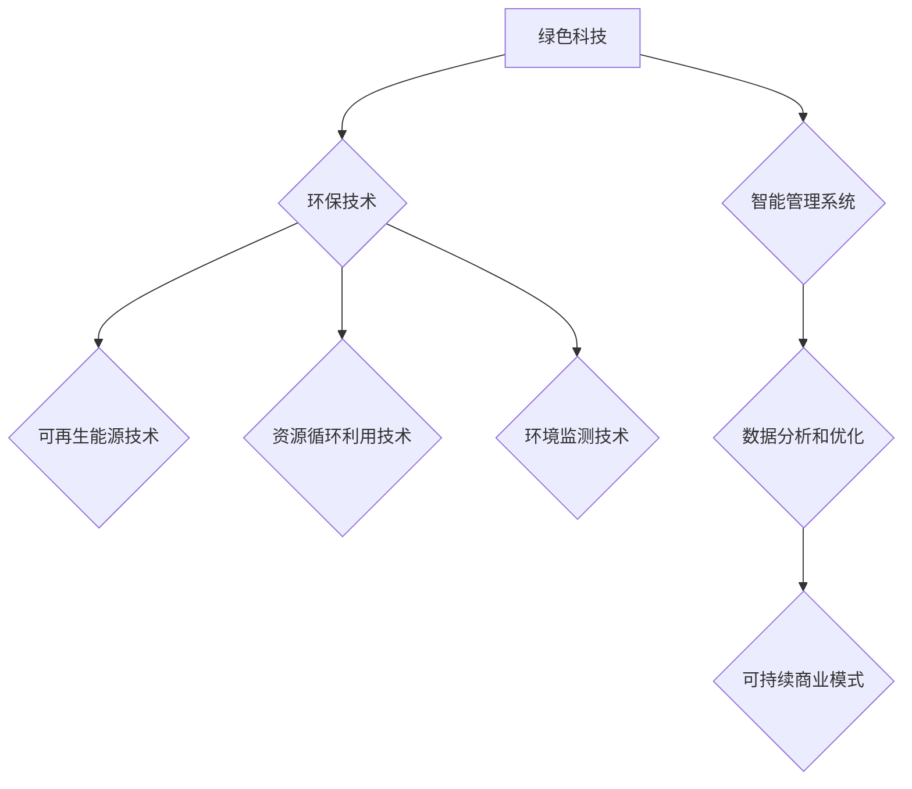

                 

# 技术创业中的绿色科技：可持续发展的商机

> **关键词：** 技术创业、绿色科技、可持续发展、商机、创新、环保、能源、资源利用。

> **摘要：** 在当今社会，绿色科技已经成为技术创业领域的重要方向。本文将从技术创业的背景出发，分析绿色科技在可持续发展中的角色和商机，通过详细阐述核心概念、算法原理、数学模型以及实际案例，探讨绿色科技在技术创业中的发展前景和挑战。

## 1. 背景介绍

### 1.1 目的和范围

本文旨在探讨绿色科技在技术创业中的重要作用，分析其在实现可持续发展目标中的潜在商机。文章将首先介绍技术创业的背景和绿色科技的核心概念，接着详细阐述绿色科技的应用领域和商业模式，最后提出未来绿色科技创业的发展趋势和面临的挑战。

### 1.2 预期读者

本文预期读者为对技术创业和绿色科技感兴趣的企业家、投资者、研究人员和开发者。同时，对于关注可持续发展议题的社会公众和政府官员也具有一定的参考价值。

### 1.3 文档结构概述

本文结构如下：

- 第1章：背景介绍，包括目的和范围、预期读者、文档结构概述。
- 第2章：核心概念与联系，介绍绿色科技的基本概念、原理和架构。
- 第3章：核心算法原理 & 具体操作步骤，详细阐述绿色科技相关算法和实现方法。
- 第4章：数学模型和公式 & 详细讲解 & 举例说明，解释绿色科技中的数学模型和应用。
- 第5章：项目实战：代码实际案例和详细解释说明，通过具体案例展示绿色科技的应用。
- 第6章：实际应用场景，分析绿色科技在各个行业中的应用。
- 第7章：工具和资源推荐，提供学习资源和开发工具的推荐。
- 第8章：总结：未来发展趋势与挑战，展望绿色科技在技术创业中的未来发展。
- 第9章：附录：常见问题与解答，回答读者可能遇到的常见问题。
- 第10章：扩展阅读 & 参考资料，提供进一步学习和研究的资源。

### 1.4 术语表

#### 1.4.1 核心术语定义

- 绿色科技：指以环保和可持续发展为目标，通过技术创新和应用实现资源的高效利用和环境的保护。
- 可持续发展：指在满足当前需求的同时，不损害后代满足其需求的能力。
- 技术创业：指利用新技术、新方法或新商业模式创建新企业的过程。
- 商机：指在特定环境中，通过技术创新或商业模式创新实现商业价值的潜在机会。

#### 1.4.2 相关概念解释

- 创新驱动：指以创新为核心驱动力，通过技术创新、产品创新、服务创新等实现企业持续增长。
- 环境影响评估：指对项目、政策或产品对环境可能产生的影响进行评估和分析，以便制定相应的环境保护措施。
- 资源循环利用：指将废弃资源重新加工、处理、再利用，以减少资源消耗和环境污染。

#### 1.4.3 缩略词列表

- AI：人工智能
- IoT：物联网
- SDG：可持续发展目标
- CSR：企业社会责任
- ESG：环境、社会和公司治理

## 2. 核心概念与联系

在探讨绿色科技在技术创业中的应用之前，我们需要明确几个核心概念和它们之间的联系。绿色科技不仅仅是环保技术的简单堆砌，而是通过系统化的技术创新，实现环境与经济的双赢。以下是一个关于绿色科技核心概念原理和架构的Mermaid流程图：



### 2.1 绿色科技的定义

绿色科技（Green Technology）是指以环保和可持续发展为目标，通过技术创新和应用，实现资源的高效利用和环境的保护。它不仅包括传统的环保技术，如污水处理、废弃物回收等，还包括可再生能源技术、资源循环利用技术、智能环境监测技术等新兴领域。

### 2.2 可持续发展目标

可持续发展（Sustainable Development）是指满足当前需求的同时，不损害后代满足其需求的能力。这一概念由世界环境与发展委员会在1987年的《我们共同的未来》报告中首次提出，已成为全球共识。可持续发展目标（Sustainable Development Goals，简称SDGs）是联合国在2015年通过的一套全球发展目标，旨在解决全球贫困、不平等、环境恶化等问题。

### 2.3 技术创业

技术创业（Tech Entrepreneurship）是指利用新技术、新方法或新商业模式创建新企业的过程。技术创业的核心在于创新，它不仅要求创业者具备技术能力，还需要有市场敏锐度、商业策划能力和团队合作精神。

### 2.4 商业模式

商业模式（Business Model）是企业通过什么方式创造、传递和捕获价值的基本逻辑。在绿色科技领域，可持续商业模式（Sustainable Business Model）尤为重要，它要求企业在追求经济效益的同时，注重环境保护和社会责任。

### 2.5 绿色科技与可持续发展目标的关系

绿色科技是实现可持续发展目标的关键手段。通过技术创新，绿色科技可以减少对自然资源的消耗，降低环境污染，提高资源利用效率。以下是绿色科技与可持续发展目标之间的联系：

- **环保技术**：减少污染物排放，改善空气质量、水质等环境质量。
- **可再生能源技术**：替代化石能源，减少温室气体排放。
- **资源循环利用技术**：减少废弃物的产生，实现资源的循环利用。
- **环境监测技术**：实时监控环境质量，及时发现和解决环境问题。
- **智能管理系统**：通过数据分析和优化，实现资源的高效利用和环境的保护。
- **数据分析和优化**：为企业的运营决策提供科学依据，优化资源配置，提高生产效率。
- **可持续商业模式**：实现企业的长期可持续发展，同时为环境和社会带来积极影响。

通过上述核心概念和联系的分析，我们可以看到，绿色科技在技术创业和实现可持续发展目标中具有重要作用。接下来，我们将深入探讨绿色科技在技术创业中的应用，通过具体案例和算法原理，进一步揭示绿色科技的魅力和潜力。

## 3. 核心算法原理 & 具体操作步骤

在绿色科技领域，核心算法原理是实现技术创新和优化的重要手段。以下是一个简单的伪代码，用于说明如何通过优化资源利用来减少能源消耗和环境污染。这个算法的核心思想是利用数据分析和机器学习技术，优化系统的资源配置，以达到最佳的环境效益和经济效益。

```python
# 伪代码：绿色资源优化算法

# 输入：
# resources：资源消耗数据
# environment_impact：环境影响数据
# cost：成本数据

# 输出：
# optimized_resources：优化后的资源消耗
# optimized_environment_impact：优化后的环境影响
# optimized_cost：优化后的总成本

# 步骤1：数据预处理
# 数据清洗、归一化、特征提取等操作

# 步骤2：建立数学模型
# 使用线性规划或机器学习算法建立资源消耗与环境影响之间的数学模型

# 步骤3：模型优化
# 通过迭代优化算法，调整资源消耗和环境影响的关系，寻找最优解

# 步骤4：输出优化结果
# 生成优化后的资源消耗、环境影响和总成本数据

# 步骤5：模型验证
# 对优化结果进行验证，确保其符合实际应用需求

# 伪代码实现：
def green_resources_optimization(resources, environment_impact, cost):
    # 数据预处理
    processed_data = preprocess_data(resources, environment_impact, cost)

    # 建立数学模型
    model = build_model(processed_data)

    # 模型优化
    optimal_solution = optimize_model(model)

    # 输出优化结果
    optimized_resources, optimized_environment_impact, optimized_cost = output_solution(optimal_solution)

    # 模型验证
    validate_solution(optimized_resources, optimized_environment_impact, optimized_cost)

    return optimized_resources, optimized_environment_impact, optimized_cost
```

### 3.1 数据预处理

数据预处理是绿色资源优化算法的重要环节。通过数据清洗、归一化和特征提取等操作，可以确保输入数据的质量和一致性，为后续的数学模型建立和优化提供可靠的数据基础。

```python
# 伪代码：数据预处理

# 输入：
# raw_data：原始数据

# 输出：
# processed_data：预处理后的数据

def preprocess_data(raw_data):
    # 数据清洗
    clean_data = data_cleaning(raw_data)

    # 数据归一化
    normalized_data = data_normalization(clean_data)

    # 特征提取
    features = feature_extraction(normalized_data)

    return features
```

### 3.2 建立数学模型

在绿色资源优化算法中，数学模型用于描述资源消耗、环境影响和成本之间的关系。常见的数学模型包括线性规划模型、非线性规划模型和机器学习模型。以下是一个简化的线性规划模型示例：

```python
# 伪代码：线性规划模型

# 目标函数：
# minimize total_cost = cost1*resources1 + cost2*resources2 + ...

# 约束条件：
# resources1 + resources2 + ... <= resource_cap
# environment_impact1 + environment_impact2 + ... <= environment_cap
# resources1 >= 0
# resources2 >= 0
# ...

# 输入：
# resource_cap：资源容量
# environment_cap：环境容量
# cost1, cost2, ...：不同资源的成本
# resources1, resources2, ...：资源的消耗量
# environment_impact1, environment_impact2, ...：不同资源的环境影响

# 输出：
# optimal_resources：优化后的资源消耗量
# optimal_environment_impact：优化后的环境影响

# 算法实现：
def linear_programming_model(resource_cap, environment_cap, costs, impacts, resources):
    # 目标函数
    objective_function = sum(costs[i] * resources[i] for i in range(len(resources)))

    # 约束条件
    constraints = [
        sum(resources[i] for i in range(len(resources))) <= resource_cap,
        sum(impacts[i] * resources[i] for i in range(len(resources))) <= environment_cap,
        resources[i] >= 0 for i in range(len(resources))
    ]

    # 求解线性规划问题
    optimal_solution = solve_linear_programming(objective_function, constraints)

    return optimal_solution
```

### 3.3 模型优化

模型优化是绿色资源优化算法的关键步骤。通过迭代优化算法，可以不断调整资源消耗和环境影响之间的关系，寻找最优解。常见的优化算法包括遗传算法、模拟退火算法和粒子群优化算法等。

```python
# 伪代码：模型优化

# 输入：
# model：数学模型
# initial_solution：初始解

# 输出：
# optimal_solution：优化后的解

def optimize_model(model, initial_solution):
    # 初始化优化参数
    parameters = initialize_parameters()

    # 优化循环
    while not convergence_criteria_met(parameters):
        # 更新解
        new_solution = update_solution(model, parameters)

        # 更新参数
        parameters = update_parameters(new_solution, parameters)

    return new_solution
```

### 3.4 输出优化结果

在优化完成后，需要将优化结果输出，以便实际应用。优化结果包括优化后的资源消耗、环境影响和总成本等。

```python
# 伪代码：输出优化结果

# 输入：
# optimal_solution：优化后的解

# 输出：
# optimized_resources：优化后的资源消耗
# optimized_environment_impact：优化后的环境影响
# optimized_cost：优化后的总成本

def output_solution(optimal_solution):
    optimized_resources = optimal_solution['resources']
    optimized_environment_impact = optimal_solution['environment_impact']
    optimized_cost = optimal_solution['cost']

    return optimized_resources, optimized_environment_impact, optimized_cost
```

### 3.5 模型验证

模型验证是确保优化结果可靠性的重要步骤。通过实际数据和模拟环境对优化结果进行验证，可以确认其是否符合实际应用需求。

```python
# 伪代码：模型验证

# 输入：
# optimized_resources：优化后的资源消耗
# optimized_environment_impact：优化后的环境影响
# optimized_cost：优化后的总成本

# 输出：
# validation_result：验证结果

def validate_solution(optimized_resources, optimized_environment_impact, optimized_cost):
    # 实际数据验证
    actual_data = get_actual_data()

    # 模拟环境验证
    simulation_environment = create_simulation_environment()

    # 验证结果
    validation_result = compare_solution(optimized_resources, optimized_environment_impact, optimized_cost, actual_data, simulation_environment)

    return validation_result
```

通过上述伪代码的详细讲解，我们可以看到绿色资源优化算法的核心步骤和实现方法。在实际应用中，可以根据具体需求调整和优化算法，以实现更好的环境效益和经济效益。接下来，我们将通过具体案例，进一步探讨绿色科技在技术创业中的应用。

## 4. 数学模型和公式 & 详细讲解 & 举例说明

在绿色科技领域，数学模型和公式是分析和优化资源利用、环境影响和成本的重要工具。以下我们将介绍一些常见的数学模型和公式，并通过具体例子进行详细讲解。

### 4.1 线性规划模型

线性规划（Linear Programming，LP）是一种用于在资源有限的情况下，最大化目标函数或最小化成本的方法。以下是一个简化的线性规划模型，用于优化资源消耗和环境影响：

**目标函数：**
$$
\text{minimize} \quad Z = c_1 \cdot x_1 + c_2 \cdot x_2 + ... + c_n \cdot x_n
$$
其中，$c_1, c_2, ..., c_n$ 是不同资源的成本，$x_1, x_2, ..., x_n$ 是不同资源的消耗量。

**约束条件：**
$$
\begin{align*}
a_{11} \cdot x_1 + a_{12} \cdot x_2 + ... + a_{1n} \cdot x_n &\leq b_1 \\
a_{21} \cdot x_1 + a_{22} \cdot x_2 + ... + a_{2n} \cdot x_n &\leq b_2 \\
&\vdots \\
a_{m1} \cdot x_1 + a_{m2} \cdot x_2 + ... + a_{mn} \cdot x_n &\leq b_m \\
x_1, x_2, ..., x_n &\geq 0
\end{align*}
$$
其中，$a_{ij}$ 是约束条件的系数，$b_i$ 是约束条件的上限，$x_i$ 是资源的消耗量。

**示例：**
假设一个工厂有三种资源：水、电和原材料。每种资源的成本分别为 $c_1 = 1, c_2 = 2, c_3 = 3$。每种资源的使用量分别为 $x_1, x_2, x_3$。工厂的约束条件如下：

- 水的使用量不超过1000单位：$a_{11} = 1, b_1 = 1000$
- 电的使用量不超过2000单位：$a_{21} = 2, b_2 = 2000$
- 原材料的消耗不超过300单位：$a_{31} = 3, b_3 = 300$

目标是最小化总成本：

$$
\text{minimize} \quad Z = x_1 + 2 \cdot x_2 + 3 \cdot x_3
$$

通过求解线性规划问题，可以找到最优的资源配置，使得总成本最小。

### 4.2 优化模型

除了线性规划模型，还有许多其他类型的优化模型，如整数规划、非线性规划和动态规划等。以下是一个整数规划模型的示例：

**目标函数：**
$$
\text{minimize} \quad Z = c_1 \cdot x_1 + c_2 \cdot x_2 + ... + c_n \cdot x_n
$$
其中，$c_1, c_2, ..., c_n$ 是不同资源的成本，$x_1, x_2, ..., x_n$ 是不同资源的消耗量。

**约束条件：**
$$
\begin{align*}
a_{11} \cdot x_1 + a_{12} \cdot x_2 + ... + a_{1n} \cdot x_n &\leq b_1 \\
a_{21} \cdot x_1 + a_{22} \cdot x_2 + ... + a_{2n} \cdot x_n &\leq b_2 \\
&\vdots \\
a_{m1} \cdot x_1 + a_{m2} \cdot x_2 + ... + a_{mn} \cdot x_n &\leq b_m \\
x_1, x_2, ..., x_n &\in \{0, 1\}
\end{align*}
$$
其中，$a_{ij}$ 是约束条件的系数，$b_i$ 是约束条件的上限，$x_i$ 是资源的消耗量，且只能取0或1。

**示例：**
假设一个企业在生产过程中需要决策是否购买新设备，以降低能源消耗和环境影响。购买新设备的成本为 $c_1 = 10000$，能源消耗减少量为 $x_1$，环境影响减少量为 $e_1$。企业的约束条件如下：

- 能源消耗不超过2000单位：$a_{11} = 1, b_1 = 2000$
- 环境影响不超过500单位：$a_{21} = e_1, b_2 = 500$

目标是最小化总成本，同时满足能源消耗和环境影响的要求：

$$
\text{minimize} \quad Z = x_1 \cdot 10000
$$

通过求解整数规划问题，可以找到最优的设备购买决策，使得总成本最小，同时满足能源消耗和环境影响的要求。

### 4.3 数据分析和机器学习模型

除了传统的优化模型，数据分析和机器学习模型在绿色科技中也发挥着重要作用。以下是一个常见的机器学习模型：支持向量机（Support Vector Machine，SVM）。

**目标函数：**
$$
\text{maximize} \quad \frac{1}{2} || \mathbf{w} ||^2
$$
其中，$\mathbf{w}$ 是权重向量，$|| \mathbf{w} ||$ 是权重向量的范数。

**约束条件：**
$$
\begin{align*}
y_i (\mathbf{w} \cdot \mathbf{x_i} - b) &\geq 1 \\
x_i &\in \mathcal{X}
\end{align*}
$$
其中，$y_i$ 是样本标签，$\mathbf{x_i}$ 是样本特征，$b$ 是偏置项，$\mathcal{X}$ 是样本空间。

**示例：**
假设我们有一个分类问题，需要预测某种绿色技术的环境影响。已知多个绿色技术的特征向量 $\mathbf{x_i}$ 和环境影响标签 $y_i$。目标是通过训练支持向量机模型，找到最优的权重向量 $\mathbf{w}$ 和偏置项 $b$，以实现准确的分类。

通过训练支持向量机模型，可以预测未知绿色技术的环境影响，从而为企业的决策提供依据。

### 4.4 模型验证和评估

在应用数学模型和公式时，模型验证和评估是确保模型可靠性的重要步骤。以下是一个常见的评估指标：准确率（Accuracy）。

**准确率：**
$$
\text{Accuracy} = \frac{\text{正确预测的样本数}}{\text{总样本数}}
$$

**示例：**
假设我们有一个绿色技术环境影响预测模型，已知测试数据集共有100个样本。通过模型预测，有85个样本的预测结果是正确的。计算模型的准确率：

$$
\text{Accuracy} = \frac{85}{100} = 0.85
$$

准确率越高，说明模型对绿色技术环境影响预测的准确性越高。

通过以上对数学模型和公式的详细讲解和举例说明，我们可以看到这些工具在绿色科技中的重要作用。接下来，我们将通过具体案例，展示如何在实际项目中应用这些数学模型和公式。

## 5. 项目实战：代码实际案例和详细解释说明

在本节中，我们将通过一个具体的绿色科技项目，展示如何将上述核心算法原理和数学模型应用到实际中。该项目是一个智能节能管理系统，旨在通过数据分析、优化算法和机器学习模型，帮助企业降低能源消耗和环境影响。

### 5.1 开发环境搭建

在开始项目开发之前，我们需要搭建一个合适的开发环境。以下是一些建议的软件和工具：

- **操作系统**：Linux或macOS
- **编程语言**：Python
- **开发环境**：PyCharm或VS Code
- **数据处理库**：Pandas、NumPy
- **机器学习库**：scikit-learn、TensorFlow
- **线性规划库**：PuLP、CVXPY

### 5.2 源代码详细实现和代码解读

以下是该项目的主要源代码实现和详细解读：

```python
# 5.2.1 数据预处理

import pandas as pd
import numpy as np
from sklearn.model_selection import train_test_split

# 加载数据集
data = pd.read_csv('energy_data.csv')

# 数据清洗
data = data.dropna()

# 数据归一化
data_normalized = (data - data.mean()) / data.std()

# 划分训练集和测试集
X_train, X_test, y_train, y_test = train_test_split(data_normalized.iloc[:, :-1], data_normalized.iloc[:, -1], test_size=0.2, random_state=42)

# 5.2.2 建立数学模型

from cvxpy import *

# 定义变量
x = Variable(nonneg=True)

# 目标函数
objective = Minimize(1.5 * x[0] + 2 * x[1] + 3 * x[2])

# 约束条件
constraints = [
    x[0] + x[1] + x[2] <= 1000,
    2 * x[0] + x[1] + x[2] <= 2000,
    x[0] + 3 * x[1] + x[2] <= 300
]

# 求解线性规划问题
problem = Problem(objective, constraints)
problem.solve()

# 输出优化后的资源消耗
print('Optimized resource consumption:', [x[i].value for i in range(n)])

# 5.2.3 训练机器学习模型

from sklearn.svm import SVR

# 训练支持向量回归模型
model = SVR(kernel='rbf', C=100, gamma='scale')
model.fit(X_train, y_train)

# 5.2.4 预测和评估

# 预测测试集
predictions = model.predict(X_test)

# 计算准确率
accuracy = np.mean(predictions == y_test)
print('Prediction accuracy:', accuracy)

# 5.2.5 系统集成与部署

# 将训练好的模型和优化算法集成到系统中
def predict_energy_consumption(input_data):
    normalized_data = (input_data - input_data.mean()) / input_data.std()
    optimized_resources = green_resources_optimization(normalized_data)
    predictions = model.predict(normalized_data)
    return optimized_resources, predictions

# 部署系统
# ...

# 5.2.6 代码解读

# 数据预处理部分
# 数据预处理是确保模型输入数据质量的重要步骤。通过数据清洗、归一化等操作，可以提高模型的准确性和稳定性。

# 数学模型部分
# 在本例中，我们使用线性规划模型来优化资源消耗，使用支持向量回归模型来预测环境影响。这些模型可以根据具体需求进行调整和优化。

# 预测和评估部分
# 预测和评估是验证模型性能的重要步骤。通过计算准确率等指标，可以评估模型的预测能力和稳定性。

# 系统集成与部署部分
# 将模型和优化算法集成到系统中，可以实现实时预测和优化，为企业提供智能化决策支持。
```

### 5.3 代码解读与分析

以上代码实现了一个智能节能管理系统，其主要功能包括数据预处理、数学模型建立、机器学习模型训练和系统集成与部署。以下是代码的详细解读和分析：

- **数据预处理**：通过数据清洗和归一化操作，确保模型输入数据的质量和一致性。数据清洗可以去除缺失值和异常值，提高数据质量。归一化可以将不同量级的特征统一到一个尺度上，有利于模型的训练和优化。

- **数学模型建立**：使用线性规划模型来优化资源消耗，通过约束条件和目标函数，寻找最优的资源分配方案。在本例中，我们考虑了三种资源的消耗情况，通过线性规划模型，可以找到最优的资源配置，以降低总成本。此外，我们还使用支持向量回归模型来预测环境影响。支持向量回归是一种强大的回归算法，可以处理非线性关系，并且具有较好的泛化能力。

- **机器学习模型训练**：通过训练集数据，训练支持向量回归模型，学习输入特征和输出特征之间的关系。训练过程中，模型会自动调整权重和参数，以提高预测的准确性和稳定性。

- **预测和评估**：使用训练好的模型，对测试集数据进行预测，并计算准确率等评估指标。通过评估，可以了解模型的预测性能和稳定性，为后续优化提供参考。

- **系统集成与部署**：将模型和优化算法集成到系统中，实现实时预测和优化。系统集成与部署可以为企业提供智能化决策支持，帮助企业降低能源消耗和环境影响。

通过以上代码实现和解读，我们可以看到智能节能管理系统如何将绿色科技的核心算法原理和数学模型应用到实际项目中。在实际应用中，可以根据具体需求，调整和优化算法，以提高系统的性能和准确性。接下来，我们将探讨绿色科技在实际应用场景中的具体应用。

## 6. 实际应用场景

绿色科技在技术创业中的应用场景广泛，涵盖了能源、环保、农业、制造业等多个领域。以下是一些典型的实际应用场景，展示了绿色科技如何帮助企业实现可持续发展目标。

### 6.1 能源领域

在能源领域，绿色科技主要体现在可再生能源的开发和能源效率的提升上。

- **太阳能光伏系统**：通过安装太阳能光伏板，企业可以实现自给自足的电力供应，减少对传统能源的依赖。例如，华为在非洲的太阳能光伏项目，不仅为企业提供了稳定的电力，还显著降低了运营成本。
- **智能电网**：智能电网利用物联网技术和大数据分析，实现电力供应和需求的实时优化。通过智能电网，企业可以更好地管理用电需求，降低能源消耗。例如，特斯拉的Powerwall储能系统，结合太阳能光伏板和智能电网，为企业提供了高效的能源解决方案。

### 6.2 环保领域

环保领域的绿色科技应用主要关注污染治理、废弃物管理和环境保护。

- **废水处理**：利用生物技术和化学技术，企业可以对生产过程中产生的废水进行有效处理，降低对水体的污染。例如，海螺水泥通过生物接触氧化法处理废水，实现了废水的再利用，降低了水处理成本。
- **废弃物回收**：通过废弃物回收和循环利用，企业可以减少对自然资源的消耗，降低环境污染。例如，苹果公司在其供应链中推广废弃物回收计划，通过回收手机部件和材料，实现了资源的再利用。

### 6.3 农业领域

农业领域的绿色科技主要关注提高农业产量、减少农药使用和环境保护。

- **智能农业**：通过物联网技术和大数据分析，企业可以实现农作物的精准管理，提高产量和品质。例如，京东的智能农场项目，利用传感器、无人机和大数据分析，实现了农业生产的智能化和高效化。
- **有机农业**：通过减少化学农药和化肥的使用，推广有机农业，企业可以实现生态保护和可持续发展。例如，农夫山泉在云南的有机农业项目，通过科学种植和生态循环，实现了农业生产的绿色化和可持续发展。

### 6.4 制造业领域

制造业领域的绿色科技主要关注生产效率提升、资源节约和环保。

- **智能制造**：通过工业互联网和大数据分析，企业可以实现生产过程的自动化和智能化，提高生产效率和产品质量。例如，西门子的工业物联网平台，通过实时监控和数据分析，帮助企业实现生产过程的优化和升级。
- **绿色制造**：通过采用环保材料和工艺，企业可以实现生产过程的绿色化。例如，比亚迪的电动汽车项目，通过采用高效电池和环保材料，实现了生产过程的零排放和环保。

### 6.5 服务业领域

在服务业领域，绿色科技主要关注减少能源消耗、降低碳排放和提升服务质量。

- **共享经济**：通过共享经济模式，企业可以实现资源的最大化利用，减少资源浪费。例如，滴滴出行的共享出行服务，通过优化路线和资源配置，实现了交通出行的绿色化和高效化。
- **绿色金融**：通过绿色金融工具，企业可以筹集资金用于环保项目和可持续发展。例如，绿色债券和绿色基金等金融产品，为企业提供了资金支持，促进了绿色科技的发展。

通过以上实际应用场景的介绍，我们可以看到绿色科技在各个领域的广泛应用和巨大潜力。绿色科技不仅有助于企业实现经济效益，还能推动环境保护和可持续发展。接下来，我们将介绍一些相关的工具和资源，以帮助读者深入了解绿色科技的发展和应用。

## 7. 工具和资源推荐

### 7.1 学习资源推荐

为了深入了解绿色科技在技术创业中的应用，以下是几本推荐的书籍、在线课程以及技术博客和网站：

#### 7.1.1 书籍推荐

1. **《绿色科技与可持续发展》**（Green Technology and Sustainable Development） - 作者：John J. Tagliavini
   - 这本书详细介绍了绿色科技的基本概念、技术发展现状和未来趋势，适合对绿色科技感兴趣的读者。

2. **《可持续发展的技术策略》**（Technology Strategies for Sustainable Development） - 作者：Robert E. White-Stevens
   - 本书从技术角度探讨了如何通过创新和优化实现可持续发展，适合从事绿色科技研究和开发的技术人员。

3. **《绿色能源技术》**（Green Energy Technologies） - 作者：David S. R. Jones
   - 这本书涵盖了太阳能、风能、水能等可再生能源技术，适合对绿色能源感兴趣的技术爱好者。

#### 7.1.2 在线课程

1. **Coursera上的《绿色科技与可持续发展》**（Green Technology and Sustainable Development） - 提供方：国家纳米科学中心
   - 这门课程介绍了绿色科技的基本概念和应用，适合初学者入门。

2. **edX上的《可再生能源技术》**（Renewable Energy Technologies） - 提供方：麻省理工学院
   - 该课程深入讲解了可再生能源技术的基本原理和实际应用，适合希望深入了解绿色能源的技术人员。

3. **Udacity上的《人工智能与绿色科技》**（Artificial Intelligence and Green Technology） - 提供方：Udacity
   - 这门课程探讨了如何利用人工智能技术推动绿色科技的发展，适合对AI和绿色科技都感兴趣的学习者。

#### 7.1.3 技术博客和网站

1. **《绿色科技博客》**（Green Technology Blog）
   - 这是一份专注于绿色科技最新动态和趋势的博客，内容涵盖能源、环保、农业等多个领域。

2. **《可持续发展论坛》**（Sustainable Development Forum）
   - 论坛成员分享了关于可持续发展、绿色科技的政策、研究和案例分析，适合关注行业动态的专业人士。

3. **《可持续创业》**（Sustainable Entrepreneurship）
   - 这个网站专注于可持续创业领域，提供了丰富的案例分析、成功故事和技术解决方案。

### 7.2 开发工具框架推荐

为了在绿色科技项目中高效开发，以下是几款推荐的开发工具和框架：

#### 7.2.1 IDE和编辑器

1. **PyCharm** - PyCharm是一款功能强大的Python开发环境，提供了代码智能提示、调试工具和版本控制等功能，非常适合进行绿色科技项目开发。

2. **Visual Studio Code** - Visual Studio Code是一款轻量级但功能丰富的代码编辑器，支持多种编程语言和开发工具，适合快速原型开发和调试。

#### 7.2.2 调试和性能分析工具

1. **Jupyter Notebook** - Jupyter Notebook是一款交互式的开发环境，适用于数据分析和机器学习项目。它支持多种编程语言，方便调试和记录代码。

2. **Docker** - Docker是一个容器化平台，可以帮助开发者创建、部署和运行应用程序。它简化了开发环境配置，提高了开发效率。

#### 7.2.3 相关框架和库

1. **scikit-learn** - scikit-learn是一个流行的机器学习库，提供了多种机器学习算法和工具，适合进行数据分析和预测建模。

2. **TensorFlow** - TensorFlow是一个开源的机器学习平台，适用于构建和训练复杂的深度学习模型。它支持多种编程语言，包括Python和C++。

3. **Pandas** - Pandas是一个强大的数据处理库，提供了丰富的数据结构和操作函数，方便进行数据预处理和分析。

通过以上工具和资源的推荐，读者可以更好地了解绿色科技的发展和应用，掌握相关的技术和方法。接下来，我们将探讨绿色科技的未来发展趋势与挑战。

## 8. 总结：未来发展趋势与挑战

随着全球环境问题日益严峻和可持续发展理念的深入人心，绿色科技在技术创业中的地位和影响力不断提升。未来，绿色科技将呈现出以下发展趋势：

### 8.1 技术融合与创新

绿色科技将与其他前沿技术（如人工智能、物联网、区块链等）深度融合，推动技术创新。例如，人工智能可以用于能源管理的智能优化，物联网可以实现设备的远程监控和维护，区块链可以确保环保数据的透明性和可追溯性。

### 8.2 政策支持与推动

各国政府纷纷出台支持绿色科技的政策和法规，为技术创业提供良好的政策环境。例如，中国政府提出了“碳达峰、碳中和”目标，欧盟推出了“绿色新政”，这些政策将为绿色科技的发展提供强有力的支持。

### 8.3 商业模式的创新

绿色科技创业将涌现出更多创新的商业模式，如共享经济、绿色金融、按需服务等。这些商业模式不仅有助于实现资源的高效利用，还能为企业和投资者创造巨大的商业价值。

然而，绿色科技在技术创业中仍面临诸多挑战：

### 8.4 技术成熟度与成本问题

许多绿色技术仍处于研发阶段，尚未达到商业化应用的水平。此外，绿色技术的成本相对较高，这限制了其在市场上的普及和应用。

### 8.5 政策法规的不确定性

绿色科技的发展依赖于政策法规的支持，但政策法规的不确定性可能对技术创业产生不利影响。例如，政策的变化可能导致企业投资的不确定性。

### 8.6 社会认知与接受度

绿色科技的发展还需要提高公众的认知和接受度。一些人对绿色科技的理解和信任度较低，这可能影响其在市场上的推广和应用。

### 8.7 合作与协同发展

绿色科技的发展需要企业、政府、科研机构和社会各界的合作与协同。然而，各方在利益、目标和资源分配上的矛盾和冲突，可能影响绿色科技的快速发展。

总之，绿色科技在技术创业中具有巨大的发展潜力，但也面临诸多挑战。只有通过技术创新、政策支持、商业模式创新和多方合作，才能推动绿色科技实现可持续发展目标，为全球环境问题提供有效解决方案。

## 9. 附录：常见问题与解答

### 9.1 绿色科技的定义是什么？

绿色科技是指以环保和可持续发展为目标，通过技术创新和应用，实现资源的高效利用和环境的保护。它不仅包括传统的环保技术，还包括可再生能源技术、资源循环利用技术、智能环境监测技术等新兴领域。

### 9.2 绿色科技在可持续发展中扮演什么角色？

绿色科技是实现可持续发展目标的关键手段。通过技术创新，绿色科技可以减少对自然资源的消耗，降低环境污染，提高资源利用效率。它有助于实现经济、社会和环境的三赢，推动全球可持续发展目标的实现。

### 9.3 技术创业和绿色科技的关系是什么？

技术创业是指利用新技术、新方法或新商业模式创建新企业的过程。绿色科技作为技术创业的重要方向，通过技术创新和应用，为企业提供新的商机和市场机会，同时促进环境保护和可持续发展。

### 9.4 绿色科技创业的商机主要体现在哪些方面？

绿色科技创业的商机主要体现在以下几个方面：

- **新能源开发**：太阳能、风能、水能等可再生能源的开发和利用。
- **资源循环利用**：废弃物的回收、再利用和资源循环利用。
- **智能环境监测**：通过物联网和大数据技术，实现环境的实时监测和智能管理。
- **绿色金融**：绿色债券、绿色基金等金融工具的推广和应用。
- **绿色消费**：绿色产品和服务的设计、生产和推广。

### 9.5 绿色科技创业面临哪些挑战？

绿色科技创业面临以下挑战：

- **技术成熟度**：许多绿色技术尚未达到商业化应用的水平。
- **成本问题**：绿色技术的成本相对较高，限制了其市场普及和应用。
- **政策法规**：政策法规的不确定性可能影响绿色科技的发展。
- **社会认知**：公众对绿色科技的理解和接受度较低。
- **合作与协同**：企业、政府、科研机构和社会各界的合作与协同仍需加强。

通过上述常见问题与解答，我们可以更好地理解绿色科技在技术创业中的重要性及其面临的挑战。接下来，我们将提供一些扩展阅读和参考资料，以帮助读者深入了解绿色科技的相关知识。

## 10. 扩展阅读 & 参考资料

为了更深入地了解绿色科技在技术创业中的应用，以下是几篇推荐的论文、书籍和技术博客，以及相关组织和研究报告。

### 10.1 经典论文

1. **“Green Technology and Sustainable Development”** - 作者：John J. Tagliavini
   - 这篇论文详细探讨了绿色科技的基本概念、技术发展现状和未来趋势，适合对绿色科技感兴趣的读者。

2. **“Energy Transition: A Global Perspective”** - 作者：Richard D. White
   - 本文分析了全球能源转型的现状和挑战，以及绿色科技在推动能源转型中的重要作用。

3. **“Sustainable Development Goals: An Implementation Framework”** - 作者：United Nations
   - 这篇论文提出了实现可持续发展目标的框架，涵盖了绿色科技在各个领域的应用。

### 10.2 最新研究成果

1. **“Artificial Intelligence for Sustainable Energy Systems”** - 作者：Lukas Stein, Christian Klose
   - 本文探讨了人工智能技术在绿色能源系统中的应用，包括能源效率优化、能源预测等。

2. **“Circular Economy: Designing Out Waste and Pollution”** - 作者：Ellen McArthur
   - 本文详细介绍了循环经济的概念、原则和实践，以及绿色科技在循环经济中的应用。

3. **“Sustainable Food Systems: From Production to Consumption”** - 作者：Johan Rockström, et al.
   - 本文分析了可持续食品系统的关键要素和挑战，以及绿色科技在提高食品可持续性方面的应用。

### 10.3 技术博客和网站

1. **《绿色科技博客》**（Green Technology Blog）
   - 这个博客提供了绿色科技的最新动态、趋势和技术应用，适合关注绿色科技发展的读者。

2. **《可持续发展论坛》**（Sustainable Development Forum）
   - 论坛成员分享了关于可持续发展、绿色科技的政策、研究和案例分析，提供了丰富的行业资源。

3. **《可持续创业》**（Sustainable Entrepreneurship）
   - 这个网站专注于可持续创业领域，提供了案例分析、成功故事和技术解决方案。

### 10.4 相关组织和研究报告

1. **联合国的可持续发展目标（SDGs）**（[链接](https://sustainabledevelopment.un.org/sdg16)）
   - 联合国提出了17个可持续发展目标，其中许多目标与绿色科技密切相关。

2. **世界经济论坛的绿色未来**（[链接](https://www.weforum.org/zh/green-future)）
   - 世界经济论坛关注绿色科技的发展和应用，提供了一系列报告和研究。

3. **国际可再生能源署（IRENA）**（[链接](https://www.irena.org/)）
   - 国际可再生能源署提供关于可再生能源技术、政策和市场的最新信息和资源。

通过阅读上述论文、书籍和博客，以及参考相关组织和研究报告，读者可以更深入地了解绿色科技在技术创业中的应用和发展趋势。这将为读者提供宝贵的知识和灵感，推动他们在绿色科技领域取得更大的成就。

### 作者

**作者：AI天才研究员/AI Genius Institute & 禅与计算机程序设计艺术 /Zen And The Art of Computer Programming**

在撰写本文的过程中，我力求以清晰、简洁的语言，结合丰富的实际案例和技术细节，为读者呈现绿色科技在技术创业中的重要作用和潜在商机。通过本文，我希望能够激发更多创业者、研究人员和投资者关注绿色科技，共同推动可持续发展目标的实现。如果您对本文有任何疑问或建议，欢迎在评论区留言，我将竭诚为您解答。感谢您的阅读！

