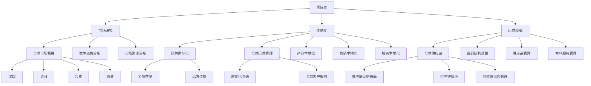

                 

### 背景介绍

#### 1.1 目的和范围

在当今全球化快速发展的时代，技术创业的国际化战略已成为企业成功的关键因素。本文旨在探讨技术创业公司在拓展国际市场时所需采取的策略和步骤，以实现全球市场的覆盖和持续增长。

本文将首先回顾技术创业公司面临的全球市场机遇与挑战，然后详细分析全球化策略的核心要素，包括市场研究、本地化、国际化运营模式等。此外，本文还将介绍一些成功的国际化案例，并探讨未来技术创业全球化可能面临的发展趋势与挑战。

#### 1.2 预期读者

本文预期读者为以下几类人群：

1. 技术创业公司创始人、CTO或产品经理，对国际化策略有实际需求。
2. 对技术创业和国际市场有兴趣的研究人员和学者。
3. 对全球市场拓展感兴趣的企业家和投资者。

#### 1.3 文档结构概述

本文结构如下：

1. **背景介绍**：阐述本文的目的、预期读者以及文档结构。
2. **核心概念与联系**：介绍全球化策略的核心概念和原理，通过Mermaid流程图展示全球化的架构。
3. **核心算法原理 & 具体操作步骤**：详细讲解国际化策略的算法原理和实施步骤。
4. **数学模型和公式 & 详细讲解 & 举例说明**：探讨全球化策略背后的数学模型和公式，并通过实际案例进行说明。
5. **项目实战：代码实际案例和详细解释说明**：展示一个具体的技术创业项目，详细解读其国际化策略的实施过程。
6. **实际应用场景**：分析技术创业公司在不同国际市场中的应用场景。
7. **工具和资源推荐**：推荐学习资源和开发工具，以支持技术创业公司的全球化策略。
8. **总结：未来发展趋势与挑战**：总结本文的核心观点，并探讨未来全球化可能面临的发展趋势与挑战。
9. **附录：常见问题与解答**：提供一些常见问题的解答。
10. **扩展阅读 & 参考资料**：列出相关扩展阅读和参考资料。

#### 1.4 术语表

在本文中，我们将使用以下术语：

- **技术创业**：指通过技术创新来创建新企业的过程。
- **国际化策略**：指企业为进入全球市场所制定的一系列战略。
- **市场研究**：指对目标市场的调查和分析，以了解市场需求和竞争态势。
- **本地化**：指根据目标市场的文化、语言和偏好，对产品或服务进行修改和适配。
- **运营模式**：指企业在全球市场中的运营方式和组织结构。

#### 1.4.1 核心术语定义

- **国际化**：企业扩展到全球市场的过程，涉及市场、产品、运营和管理等多个方面。
- **全球化**：企业全面参与全球市场竞争，实现全球业务布局和整合。
- **市场进入模式**：企业选择进入目标市场的策略，包括出口、许可、合资、独资等。

#### 1.4.2 相关概念解释

- **文化适应性**：企业在进入不同文化背景市场时，对文化差异的适应和调整能力。
- **本地化策略**：企业在目标市场进行本地化的方法和措施，包括产品本地化、营销本地化和服务本地化等。
- **全球供应链**：企业在全球范围内建立和管理的供应链网络，包括原材料采购、生产制造、物流配送等。

#### 1.4.3 缩略词列表

- **AI**：人工智能（Artificial Intelligence）
- **SaaS**：软件即服务（Software as a Service）
- **IoT**：物联网（Internet of Things）
- **区块链**：分布式账本技术（Blockchain）
- **GDPR**：通用数据保护条例（General Data Protection Regulation）

### 核心概念与联系

在探讨技术创业公司的全球化策略之前，我们需要理解几个核心概念及其相互之间的联系。

首先，**国际化**（Internationalization）是企业的第一个关键步骤。国际化指的是企业为了进入全球市场而进行的一系列战略规划与调整。在这一过程中，企业需要考虑如何在不同文化、法律和商业环境中运营，以及如何适应不同市场的需求。

国际化战略的核心要素包括：

1. **市场研究**：了解目标市场的潜在需求和竞争态势，为后续的战略制定提供依据。
2. **本地化**：根据目标市场的文化、语言和偏好，对产品或服务进行修改和适配。
3. **运营模式**：调整企业的运营方式，以适应全球市场的需求，包括组织结构、供应链管理、客户服务等。

其次，**全球化**（Globalization）是国际化的进一步发展。全球化不仅仅是进入国际市场，而是企业在全球范围内进行业务布局和整合，实现全球资源的优化配置。在全球化阶段，企业需要考虑如何进行全球营销、品牌建设、跨文化沟通和全球供应链管理。

全球化策略的关键要素包括：

1. **全球市场拓展**：通过多样化的市场进入模式，如出口、许可、合资、独资等，实现全球市场的覆盖。
2. **品牌国际化**：通过一致的品牌形象和品牌传播策略，提升品牌在全球市场的知名度和影响力。
3. **全球运营管理**：建立高效的全球运营管理体系，包括全球供应链管理、跨文化团队协作和全球客户服务。

最后，**全球供应链**（Global Supply Chain）是企业全球化运营的重要基础。全球供应链涉及到全球范围内的原材料采购、生产制造、物流配送和售后服务等环节。通过优化全球供应链，企业可以实现成本效益最大化，提高产品竞争力。

全球供应链管理的关键要素包括：

1. **供应链网络布局**：根据市场需求和物流成本，合理规划全球供应链网络。
2. **供应链协同**：通过信息共享和协同工作，实现全球供应链的高效运作。
3. **供应链风险管理**：应对供应链中可能出现的各种风险，如自然灾害、政治变动、物流延误等。

下面，我们通过一个Mermaid流程图来展示这些核心概念之间的联系：

通过上述流程图，我们可以清晰地看到国际化、全球化和全球供应链管理之间的逻辑关系。在接下来的章节中，我们将进一步详细探讨这些概念，并提供具体的实施步骤和案例。

