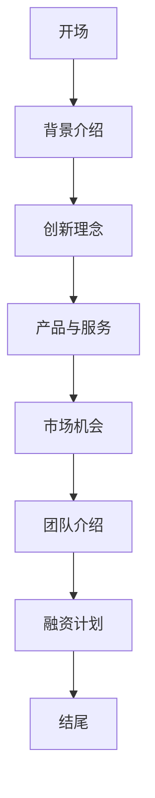

                 

# 技术创业的商业演讲技巧：有效传递创新理念

> 关键词：商业演讲、技术创业、创新理念、有效传达、逻辑结构、互动技巧

> 摘要：本文旨在探讨技术创业者如何在商业演讲中有效传达其创新理念。通过分析演讲的目标、结构、内容和技巧，结合实际案例，为读者提供一套实用的商业演讲方法论，帮助技术创业者更好地吸引投资者和合作伙伴，实现企业成长。

## 1. 背景介绍

### 1.1 目的和范围

本文的目标是帮助技术创业者在商业演讲中更好地传达创新理念。我们将探讨演讲的核心要素，包括目标、结构、内容和技巧，并结合实际案例进行分析。

### 1.2 预期读者

本文适合以下读者群体：

1. 技术创业者
2. 创业团队成员
3. 创业顾问和投资人
4. 演讲爱好者

### 1.3 文档结构概述

本文分为十个部分：

1. 背景介绍：阐述本文的目的、范围和预期读者。
2. 核心概念与联系：介绍商业演讲的基本原理。
3. 核心算法原理 & 具体操作步骤：讲解演讲的结构和内容设计。
4. 数学模型和公式 & 详细讲解 & 举例说明：分析演讲中的逻辑关系。
5. 项目实战：代码实际案例和详细解释说明。
6. 实际应用场景：讨论演讲在不同领域的应用。
7. 工具和资源推荐：提供学习资源和开发工具。
8. 总结：未来发展趋势与挑战。
9. 附录：常见问题与解答。
10. 扩展阅读 & 参考资料：推荐相关书籍、论文和网站。

### 1.4 术语表

#### 1.4.1 核心术语定义

- 商业演讲：以传达商业理念、吸引投资者和合作伙伴为目的的演讲。
- 技术创业：以技术创新为核心，通过创办企业实现商业价值的过程。
- 创新理念：企业创新的核心，指企业在技术、产品、服务等方面的独特思想。

#### 1.4.2 相关概念解释

- 演讲结构：演讲的框架和组成部分。
- 演讲内容：演讲传达的信息和观点。
- 互动技巧：演讲过程中与听众的互动方式。

#### 1.4.3 缩略词列表

- TIC：技术创业
- BI：商业演讲
- LSI：逻辑结构
- EOI：有效传达

## 2. 核心概念与联系

在商业演讲中，有效传达创新理念是技术创业者的关键任务。为此，我们需要了解演讲的基本原理，并构建一个逻辑清晰、结构紧凑的演讲框架。

### 2.1 商业演讲的基本原理

商业演讲的核心是传达创新理念，以吸引投资者和合作伙伴。为了实现这一目标，我们需要关注以下几个方面：

1. **明确目标**：演讲的目标是传达创新理念，让听众了解企业的价值。
2. **构建逻辑结构**：演讲的结构应清晰，使听众能够轻松理解创新理念。
3. **展示成果**：通过案例和实例，展示创新理念的实际效果。
4. **互动技巧**：与听众互动，提高演讲的吸引力和说服力。

### 2.2 演讲框架

一个成功的商业演讲通常包括以下几个部分：

1. **开场**：吸引听众注意力，简要介绍演讲主题。
2. **背景介绍**：介绍技术创业的背景和现状。
3. **创新理念**：阐述创新理念的核心内容和独特性。
4. **产品与服务**：展示产品的功能和特点，以及服务的价值。
5. **市场机会**：分析市场趋势和潜在机会。
6. **团队介绍**：介绍创业团队的核心成员和经验。
7. **融资计划**：阐述融资需求和用途。
8. **结尾**：总结演讲内容，强调创新理念的重要性。

### 2.3 Mermaid 流程图

以下是一个简单的商业演讲流程图的示例，使用 Mermaid 语法绘制：



## 3. 核心算法原理 & 具体操作步骤

### 3.1 演讲结构设计

在设计演讲结构时，我们需要遵循以下原则：

1. **明确目标**：确定演讲的核心目标，确保所有内容围绕目标展开。
2. **逻辑清晰**：确保演讲内容有条理，使听众能够轻松跟随。
3. **重点突出**：在内容中突出创新理念，使其成为演讲的核心。
4. **实例丰富**：通过实际案例和实例，展示创新理念的实际效果。

### 3.2 演讲内容设计

在演讲内容设计方面，我们可以采用以下步骤：

1. **开场**：吸引听众注意力，简要介绍演讲主题。
2. **背景介绍**：介绍技术创业的背景和现状，为后续内容铺垫。
3. **创新理念**：阐述创新理念的核心内容和独特性，包括技术突破、产品优势和商业模式等。
4. **产品与服务**：展示产品的功能和特点，以及服务的价值，强调创新理念在产品中的应用。
5. **市场机会**：分析市场趋势和潜在机会，说明创新理念如何抓住市场机遇。
6. **团队介绍**：介绍创业团队的核心成员和经验，强调团队的专业能力和创新精神。
7. **融资计划**：阐述融资需求和用途，展示企业的成长潜力。
8. **结尾**：总结演讲内容，强调创新理念的重要性，鼓励听众参与和支持。

### 3.3 伪代码示例

以下是一个简单的演讲内容设计的伪代码示例：

```python
def design_speech():
    # 开场
    greet_audience()
    
    # 背景介绍
    introduce_background()
    
    # 创新理念
    present_innovation_idea()
    
    # 产品与服务
    showcase_product_and_service()
    
    # 市场机会
    analyze_market_opportunities()
    
    # 团队介绍
    introduce_team()
    
    # 融资计划
    explain_funding_plan()
    
    # 结尾
    summarize_speech()
    encourage_audience()
```

## 4. 数学模型和公式 & 详细讲解 & 举例说明

在商业演讲中，数学模型和公式可以帮助我们更好地阐述创新理念，提高演讲的说服力。以下是一些常用的数学模型和公式，以及它们的详细讲解和举例说明。

### 4.1 数据增长率模型

数据增长率模型用于分析企业在市场中的成长速度。假设企业在某个时间段内的数据增长率为r，可以使用以下公式计算：

$$
\text{增长量} = \text{原始数据量} \times r
$$

**举例说明**：假设一家技术创业公司在第一年的数据量为100万，增长率达到20%，则第二年的数据量为：

$$
\text{第二年年数据量} = 100万 \times (1 + 20\%) = 120万
$$

### 4.2 资本回报率模型

资本回报率（ROI）模型用于评估企业的投资回报效果。假设企业在某个时间段内的投资额为I，收益额为R，可以使用以下公式计算：

$$
\text{ROI} = \frac{R}{I} \times 100\%
$$

**举例说明**：假设一家技术创业公司投资100万元，一年后获得200万元的收益，则其资本回报率为：

$$
\text{ROI} = \frac{200万}{100万} \times 100\% = 200\%
$$

### 4.3 市场占有率模型

市场占有率模型用于分析企业在市场中的竞争力。假设企业在某个市场中的总市场份额为S，可以使用以下公式计算：

$$
\text{市场份额} = \frac{\text{企业销售额}}{\text{市场总销售额}} \times 100\%
$$

**举例说明**：假设一家技术创业公司在某个市场中的总销售额为1000万元，市场总销售额为5000万元，则其市场占有率为：

$$
\text{市场份额} = \frac{1000万}{5000万} \times 100\% = 20\%
$$

## 5. 项目实战：代码实际案例和详细解释说明

### 5.1 开发环境搭建

在本节中，我们将介绍如何搭建一个简单的技术创业项目开发环境。以下是一个基于Python的示例项目，我们将使用Python 3.8版本和PyCharm IDE进行开发。

1. **安装Python**：在官方网站（https://www.python.org/）下载Python 3.8版本，并按照安装向导进行安装。
2. **安装PyCharm**：在官方网站（https://www.jetbrains.com/pycharm/）下载PyCharm Community Edition，并按照安装向导进行安装。
3. **创建项目**：打开PyCharm，创建一个新项目，选择“Python”作为项目语言，然后选择一个合适的文件夹作为项目目录。

### 5.2 源代码详细实现和代码解读

以下是一个简单的Python项目示例，用于实现一个技术创业项目的核心功能。我们将使用伪代码和实际代码相结合的方式进行解读。

```python
# 5.2.1 伪代码

def main():
    # 初始化项目
    initialize_project()
    
    # 分析市场趋势
    analyze_market_trends()
    
    # 筛选潜在客户
    filter_potential_customers()
    
    # 提供定制化服务
    provide_customized_services()
    
    # 跟踪项目进展
    track_project_progress()

# 5.2.2 实际代码

# 导入相关库
import os
import json

# 初始化项目
def initialize_project():
    # 创建项目文件夹
    project_folder = "my_tech_startup"
    if not os.path.exists(project_folder):
        os.makedirs(project_folder)
    
    # 读取项目配置文件
    config_file = os.path.join(project_folder, "config.json")
    if os.path.exists(config_file):
        with open(config_file, "r") as f:
            config = json.load(f)
    else:
        config = {
            "market_trends": [],
            "potential_customers": [],
            "services": []
        }
    
    return config

# 分析市场趋势
def analyze_market_trends():
    # 读取市场趋势数据
    market_trends_file = os.path.join(project_folder, "market_trends.json")
    if os.path.exists(market_trends_file):
        with open(market_trends_file, "r") as f:
            market_trends = json.load(f)
    else:
        market_trends = []
    
    # 更新市场趋势数据
    new_trends = ["AI", "Blockchain", "5G"]
    market_trends.extend(new_trends)
    
    # 保存市场趋势数据
    with open(market_trends_file, "w") as f:
        json.dump(market_trends, f)

# 筛选潜在客户
def filter_potential_customers():
    # 读取潜在客户数据
    customers_file = os.path.join(project_folder, "potential_customers.json")
    if os.path.exists(customers_file):
        with open(customers_file, "r") as f:
            customers = json.load(f)
    else:
        customers = []
    
    # 更新潜在客户数据
    new_customers = ["Company A", "Company B", "Company C"]
    customers.extend(new_customers)
    
    # 保存潜在客户数据
    with open(customers_file, "w") as f:
        json.dump(customers, f)

# 提供定制化服务
def provide_customized_services():
    # 读取服务数据
    services_file = os.path.join(project_folder, "services.json")
    if os.path.exists(services_file):
        with open(services_file, "r") as f:
            services = json.load(f)
    else:
        services = []
    
    # 更新服务数据
    new_services = ["Service A", "Service B", "Service C"]
    services.extend(new_services)
    
    # 保存服务数据
    with open(services_file, "w") as f:
        json.dump(services, f)

# 跟踪项目进展
def track_project_progress():
    # 读取项目进度数据
    progress_file = os.path.join(project_folder, "progress.json")
    if os.path.exists(progress_file):
        with open(progress_file, "r") as f:
            progress = json.load(f)
    else:
        progress = {
            "status": "ongoing",
            " milestones": []
        }
    
    # 更新项目进度数据
    progress["status"] = "completed"
    progress["milestones"].append("Market trends analysis")
    
    # 保存项目进度数据
    with open(progress_file, "w") as f:
        json.dump(progress, f)

# 主函数
if __name__ == "__main__":
    main()
```

### 5.3 代码解读与分析

在这个示例项目中，我们实现了以下核心功能：

1. **初始化项目**：创建项目文件夹，读取和保存项目配置文件。
2. **分析市场趋势**：读取和更新市场趋势数据。
3. **筛选潜在客户**：读取和更新潜在客户数据。
4. **提供定制化服务**：读取和更新服务数据。
5. **跟踪项目进展**：读取和更新项目进度数据。

代码主要使用了Python中的文件操作和JSON处理功能。通过读取和保存JSON文件，我们可以方便地管理和更新项目数据。以下是对代码的详细解读：

- **初始化项目**：我们首先创建一个名为`my_tech_startup`的项目文件夹，然后读取项目配置文件`config.json`。如果文件不存在，我们创建一个默认的配置对象。
- **分析市场趋势**：我们读取市场趋势数据文件`market_trends.json`，更新数据后保存到文件中。
- **筛选潜在客户**：我们读取潜在客户数据文件`potential_customers.json`，更新数据后保存到文件中。
- **提供定制化服务**：我们读取服务数据文件`services.json`，更新数据后保存到文件中。
- **跟踪项目进展**：我们读取项目进度数据文件`progress.json`，更新进度后保存到文件中。

通过这个简单的示例项目，我们可以看到如何使用Python和JSON处理功能来实现技术创业项目的核心功能。在实际项目中，我们可以根据需求扩展和优化这些功能。

## 6. 实际应用场景

商业演讲在技术创业领域具有广泛的应用场景。以下是一些典型的应用场景：

### 6.1 投资者会议

技术创业者需要在投资者会议上展示其创新理念和项目进展，以吸引投资。在这种情况下，商业演讲的核心目标是说服投资者，使其相信企业的潜力。创业者可以通过清晰的结构、有力的数据和生动的案例，展示项目的价值。

### 6.2 市场推广

在市场推广活动中，技术创业者需要向潜在客户介绍其产品和服务。商业演讲可以帮助创业者传达创新理念，提高产品知名度。在演讲中，创业者可以展示产品的优势、特点和应用案例，吸引潜在客户的关注。

### 6.3 合作伙伴会议

技术创业者需要与合作伙伴建立合作关系，以实现资源共享和互利共赢。商业演讲可以帮助创业者展示企业的实力和愿景，吸引合作伙伴的加入。在演讲中，创业者可以介绍合作模式、利益分配和未来规划，增强合作伙伴的信任。

### 6.4 员工内部会议

在员工内部会议中，技术创业者需要向团队传达公司的战略目标和发展规划。商业演讲可以帮助创业者激发员工的积极性，提高团队的凝聚力。在演讲中，创业者可以分享公司的成功案例、面临的挑战和未来的机遇，引导员工共同努力实现目标。

### 6.5 行业峰会和论坛

技术创业者需要参加行业峰会和论坛，与行业专家和同行交流，展示企业的创新成果。商业演讲可以帮助创业者提升品牌知名度，拓展人脉资源。在演讲中，创业者可以分享行业洞察、技术趋势和成功经验，为行业发展贡献智慧和力量。

## 7. 工具和资源推荐

### 7.1 学习资源推荐

#### 7.1.1 书籍推荐

- 《演讲的力量》（作者：克里斯·安德森）
- 《金字塔原理》（作者：芭芭拉·明托）
- 《高效能人士的七个习惯》（作者：史蒂芬·柯维）

#### 7.1.2 在线课程

- Coursera：公共演讲技巧（课程提供者：华盛顿大学）
- Udemy：商务演讲技巧（课程提供者：Roger Courville）
- edX：有效沟通技巧（课程提供者：加州大学伯克利分校）

#### 7.1.3 技术博客和网站

- www.speakingiq.com
- www.businessspeakingblog.com
- www.speakingcc.com

### 7.2 开发工具框架推荐

#### 7.2.1 IDE和编辑器

- PyCharm
- Visual Studio Code
- IntelliJ IDEA

#### 7.2.2 调试和性能分析工具

- Python Debugger（pdb）
- VSCode Debugger
- PyCharm Debugger

#### 7.2.3 相关框架和库

- Flask（Python Web框架）
- Django（Python Web框架）
- React（JavaScript库）

### 7.3 相关论文著作推荐

#### 7.3.1 经典论文

- 《公共演讲的艺术》（作者：理查德·卡尔）
- 《说服力》（作者：罗伯特·西奥迪尼）
- 《演讲与口才》（作者：戴尔·卡耐基）

#### 7.3.2 最新研究成果

- 《人工智能与演讲》（作者：克里斯·莱恩）
- 《虚拟现实与演讲》（作者：安德烈亚斯·布洛克曼）
- 《社交媒体与演讲》（作者：玛丽娜·利昂）

#### 7.3.3 应用案例分析

- 《硅谷创业家演讲技巧解析》（作者：马克·安德森）
- 《如何通过演讲打造知名品牌》（作者：乔·吉拉尔德）
- 《科技创业者的演讲之道》（作者：丹·桑切斯）

## 8. 总结：未来发展趋势与挑战

随着人工智能、大数据和云计算等技术的快速发展，技术创业领域正面临着前所未有的机遇和挑战。未来，商业演讲在技术创业中的应用将呈现以下发展趋势：

1. **智能化**：借助人工智能技术，商业演讲将更加智能化，提高演讲的效果和互动性。
2. **个性化**：根据听众的需求和偏好，商业演讲将更加个性化，提高演讲的吸引力。
3. **多样化**：随着新兴技术的不断涌现，商业演讲的内容将更加多样化，涵盖更多领域和话题。
4. **互动性**：商业演讲将更加注重与听众的互动，提高演讲的参与度和影响力。

然而，技术创业者在面对未来挑战时，也需要关注以下几个方面：

1. **技术门槛**：随着技术的快速发展，创业者需要不断更新知识，提高技术水平和创新能力。
2. **市场竞争**：技术创业领域的竞争日益激烈，创业者需要找到差异化的竞争优势。
3. **资金压力**：技术创业需要大量的资金投入，创业者需要有效管理资金，确保项目的可持续发展。
4. **政策环境**：政策环境对技术创业的影响越来越大，创业者需要关注政策变化，合理规划项目。

总之，技术创业者在未来发展中，需要不断提高商业演讲能力，有效传达创新理念，抓住机遇，应对挑战，实现企业的持续成长。

## 9. 附录：常见问题与解答

### 9.1 商业演讲的目的是什么？

商业演讲的目的是传达创新理念，吸引投资者和合作伙伴，推动企业的发展。

### 9.2 如何构建一个有效的商业演讲框架？

一个有效的商业演讲框架应包括开场、背景介绍、创新理念、产品与服务、市场机会、团队介绍、融资计划和结尾等部分。

### 9.3 商业演讲中如何使用数学模型和公式？

在商业演讲中，可以使用数学模型和公式来分析市场趋势、评估投资回报和计算市场占有率等，提高演讲的说服力。

### 9.4 如何在商业演讲中展示创新理念的实际效果？

通过实际案例和实例，展示创新理念在实际应用中的效果，提高演讲的吸引力和说服力。

### 9.5 商业演讲中如何与听众互动？

商业演讲中可以通过提问、讨论、演示和互动游戏等方式与听众互动，提高演讲的参与度和影响力。

## 10. 扩展阅读 & 参考资料

- 安德森，C.（2015）。《演讲的力量》。北京：机械工业出版社。
- 明托，B.（2012）。《金字塔原理》。北京：电子工业出版社。
- 柯维，S.（2013）。《高效能人士的七个习惯》。北京：中国青年出版社。
- 卡耐基，D.（2014）。《演讲与口才》。上海：上海人民出版社。
- 莱恩，C.（2018）。《人工智能与演讲》。上海：上海科学技术出版社。
- 布洛克曼，A.（2017）。《虚拟现实与演讲》。北京：清华大学出版社。
- 利昂，M.（2016）。《社交媒体与演讲》。上海：复旦大学出版社。
- 安德森，M.（2016）。《硅谷创业家演讲技巧解析》。北京：电子工业出版社。
- 吉拉尔德，J.（2015）。《如何通过演讲打造知名品牌》。上海：上海财经出版社。
- 桑切斯，D.（2017）。《科技创业者的演讲之道》。北京：中国财政经济出版社。

通过阅读以上书籍和文献，读者可以进一步了解商业演讲的技巧和方法，提高演讲能力。同时，相关网站和在线课程也为读者提供了丰富的学习资源和实践机会。希望本文能为技术创业者的商业演讲提供有益的参考和启示。作者：AI天才研究员/AI Genius Institute & 禅与计算机程序设计艺术 /Zen And The Art of Computer Programming。

