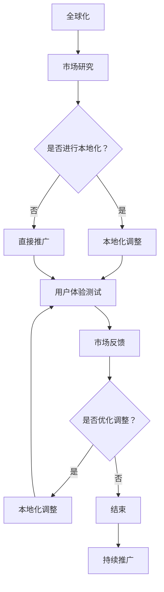

                 

# 技术创业的国际化策略：本地化与全球化的平衡艺术

> 关键词：技术创业、国际化、本地化、全球化、策略、市场进入、文化适应、用户体验、国际市场营销、跨文化沟通、竞争分析

> 摘要：本文深入探讨了技术创业公司在全球化背景下如何制定和实施有效的国际化策略。文章首先介绍了国际化策略的背景和意义，然后详细分析了本地化与全球化的平衡艺术，包括市场进入策略、文化适应策略、用户体验优化、国际市场营销策略和跨文化沟通技巧。通过实际案例和工具推荐，文章为技术创业者提供了切实可行的国际化实践指南。

## 1. 背景介绍

### 1.1 目的和范围

本文旨在为技术创业公司提供一套系统的国际化策略框架，帮助他们在全球市场中找到正确的定位和路径。文章将重点探讨以下三个方面：

1. **市场进入策略**：分析如何选择目标市场，制定有效的市场进入策略。
2. **文化适应策略**：探讨如何在不同的文化背景下进行本地化，以更好地满足当地用户的需求。
3. **用户体验优化**：分析如何设计出既符合全球用户习惯，又能适应不同文化背景的用户体验。

### 1.2 预期读者

本文适合以下读者群体：

1. 技术创业者：寻求国际化发展的公司创始人。
2. 市场营销专业人员：负责国际市场营销和品牌推广的专业人员。
3. 产品经理：负责产品设计和用户体验的团队领导。
4. 研发人员：对全球化开发流程和跨文化协作感兴趣的技术人员。

### 1.3 文档结构概述

本文分为十个部分：

1. **背景介绍**：概述本文的目的、预期读者和文档结构。
2. **核心概念与联系**：介绍本地化与全球化的核心概念，并使用Mermaid流程图展示。
3. **核心算法原理 & 具体操作步骤**：阐述市场进入策略的具体操作步骤，使用伪代码进行详细讲解。
4. **数学模型和公式 & 详细讲解 & 举例说明**：使用数学模型和公式来分析文化适应策略。
5. **项目实战：代码实际案例和详细解释说明**：通过实际案例展示文化适应策略的实施。
6. **实际应用场景**：讨论文化适应策略在不同行业中的应用。
7. **工具和资源推荐**：推荐学习资源和开发工具。
8. **总结：未来发展趋势与挑战**：分析技术创业国际化的未来趋势和挑战。
9. **附录：常见问题与解答**：解答读者可能遇到的问题。
10. **扩展阅读 & 参考资料**：提供进一步阅读的资源。

### 1.4 术语表

#### 1.4.1 核心术语定义

- **本地化**：针对特定地区或市场的产品或服务进行的文化和语言调整。
- **全球化**：将产品或服务推向全球市场，而不仅仅是本地市场。
- **市场进入策略**：公司选择目标市场并进入市场的策略。
- **用户体验**：用户在使用产品或服务时的整体感受和体验。
- **跨文化沟通**：在不同文化背景下进行有效沟通的技巧。

#### 1.4.2 相关概念解释

- **文化适应策略**：为了更好地适应不同地区的文化差异，公司所采取的一系列策略。
- **国际市场营销**：在多个国家或地区推广产品或服务的活动。
- **全球化思维**：具有适应不同文化和市场的开放心态和策略。

#### 1.4.3 缩略词列表

- **UX**：用户体验（User Experience）
- **SEO**：搜索引擎优化（Search Engine Optimization）
- **SaaS**：软件即服务（Software as a Service）
- **CRM**：客户关系管理（Customer Relationship Management）
- **ERP**：企业资源计划（Enterprise Resource Planning）

## 2. 核心概念与联系

在探讨技术创业公司的国际化策略之前，有必要理解两个核心概念：本地化和全球化。

### 2.1. 本地化与全球化的基本概念

**本地化** 是指将产品或服务根据特定地区的文化、语言、法律和消费者行为进行调整，使其更符合当地市场的需求。例如，一个全球性的电商平台在进入中国市场时，需要提供中文界面，支持多种支付方式，并考虑中国消费者的购物习惯。

**全球化** 则是相对于本地化而言，是指将产品或服务在全球范围内推广，而不是仅仅局限于某一个地区。全球化注重的是标准化和一致性，使得产品或服务在全球范围内具有统一的品牌形象和功能。

### 2.2. 本地化与全球化的联系

本地化和全球化并不是相互排斥的，而是相辅相成的。一个成功的技术创业公司需要在全球化框架下进行本地化操作。以下是本地化与全球化之间的联系：

1. **标准化与差异化**：在全球化中，公司需要保持产品或服务的核心功能和品牌形象的一致性。而在本地化中，则需要根据当地市场的差异进行调整，以满足不同地区的需求。

2. **成本与效益**：全球化可以降低生产和运营成本，但本地化可以增加市场份额和用户满意度。

3. **用户体验**：全球化提供了统一的产品体验，而本地化则提供了更加贴近用户需求的产品和服务。

### 2.3. 本地化与全球化的 Mermaid 流程图



在这个流程图中，公司首先进行市场研究，决定是否进行本地化。如果决定本地化，则进行相应的调整，并进行用户体验测试。根据市场反馈，公司可以选择是否进一步优化调整。如果不需要调整，则直接进入市场推广阶段。

## 3. 核心算法原理 & 具体操作步骤

### 3.1. 市场进入策略的核心算法原理

市场进入策略是国际化成功的关键。以下是市场进入策略的核心算法原理：

1. **市场研究**：收集和分析目标市场的数据，包括市场规模、竞争状况、消费者需求等。
2. **目标市场选择**：基于市场研究的结果，选择最具潜力的目标市场。
3. **市场定位**：明确产品或服务在目标市场的独特卖点（USP）和竞争优势。
4. **进入策略制定**：选择最合适的进入策略，如直接出口、合资企业、特许经营等。
5. **实施与监控**：执行市场进入策略，并对市场表现进行持续监控和调整。

### 3.2. 市场进入策略的具体操作步骤

以下是市场进入策略的具体操作步骤，使用伪代码进行详细讲解：

```python
def market_entry_strategy(target_market, market_data, competitive_analysis, consumer_behavior):
    """
    市场进入策略具体操作步骤

    :param target_market: 目标市场
    :param market_data: 市场数据
    :param competitive_analysis: 竞争分析
    :param consumer_behavior: 消费者行为
    :return: 市场进入策略结果
    """
    
    # 步骤1：市场研究
    market_research = research_market(target_market, market_data)
    
    # 步骤2：目标市场选择
    selected_market = select_target_market(market_research)
    
    # 步骤3：市场定位
    positioning = define_positioning(selected_market, competitive_analysis, consumer_behavior)
    
    # 步骤4：进入策略制定
    entry_strategy = determine_entry_strategy(selected_market, positioning)
    
    # 步骤5：实施与监控
    implement_and_monitor(entry_strategy, selected_market)
    
    return entry_strategy
```

### 3.3. 伪代码解释

- **市场研究**：该步骤通过收集和分析目标市场的数据，包括市场规模、竞争状况和消费者需求，为后续决策提供依据。
- **目标市场选择**：基于市场研究的结果，选择最具潜力的目标市场。
- **市场定位**：明确产品或服务在目标市场的独特卖点（USP）和竞争优势。
- **进入策略制定**：选择最合适的进入策略，如直接出口、合资企业、特许经营等。
- **实施与监控**：执行市场进入策略，并对市场表现进行持续监控和调整。

## 4. 数学模型和公式 & 详细讲解 & 举例说明

### 4.1. 文化适应策略的数学模型

文化适应策略的数学模型可以通过以下几个关键指标来衡量：

1. **文化适应度（Cultural Adaptability, CA）**：衡量产品或服务在目标市场中的文化适应程度。
2. **市场满意度（Market Satisfaction, MS）**：衡量用户对产品或服务的满意度。
3. **市场占有率（Market Share, MS）**：衡量产品或服务在目标市场的市场份额。

### 4.2. 公式和详细讲解

**公式**：

\[ CA = \frac{MS}{\alpha \times MS + \beta \times MS^2} \]

其中：
- \( \alpha \) 和 \( \beta \) 是常数，分别表示市场满意度对文化适应度和市场占有率的影响程度。
- \( MS \) 是市场满意度。

**详细讲解**：

- **文化适应度（CA）**：该指标反映了产品或服务在目标市场中的文化适应性。文化适应度越高，说明产品或服务与目标市场的文化差异越小，更容易被当地用户接受。
- **市场满意度（MS）**：该指标反映了用户对产品或服务的满意度。市场满意度越高，说明用户对产品或服务的整体体验越好。
- **市场占有率（MS）**：该指标反映了产品或服务在目标市场的市场份额。市场占有率越高，说明产品或服务在目标市场中的竞争地位越有利。

### 4.3. 举例说明

假设一个技术创业公司即将进入一个新市场，以下是一个简单的例子：

- **市场满意度（MS）**：调查表明，用户对产品或服务的满意度为0.8。
- **市场占有率（MS）**：公司预测在新市场上的市场份额为0.3。
- **常数 \( \alpha \) 和 \( \beta \)**：根据公司历史数据和经验，设定 \( \alpha = 2 \)，\( \beta = 1 \)。

**计算文化适应度（CA）**：

\[ CA = \frac{0.3}{2 \times 0.3 + 1 \times 0.3^2} = \frac{0.3}{0.6 + 0.09} = \frac{0.3}{0.69} \approx 0.436 \]

因此，该产品或服务在新市场中的文化适应度为0.436。这个结果提示公司，虽然市场满意度较高，但文化适应度还有待提高，需要进一步进行本地化调整。

## 5. 项目实战：代码实际案例和详细解释说明

### 5.1. 开发环境搭建

为了演示如何实现文化适应策略，我们将使用一个虚构的电商平台项目。以下是搭建开发环境所需的步骤：

1. **安装Python环境**：确保已安装Python 3.8及以上版本。
2. **安装依赖库**：使用pip安装以下库：requests，beautifulsoup4，lxml。
3. **配置数据库**：使用MySQL数据库，创建名为“ecommerce”的数据库，并创建相应的表。

```bash
pip install requests beautifulsoup4 lxml
mysql -u root -p
CREATE DATABASE ecommerce;
USE ecommerce;
CREATE TABLE products (
    id INT PRIMARY KEY AUTO_INCREMENT,
    name VARCHAR(255) NOT NULL,
    description TEXT,
    price DECIMAL(10, 2) NOT NULL,
    currency VARCHAR(3) NOT NULL
);
```

### 5.2. 源代码详细实现和代码解读

以下是一个简单的Python代码示例，用于实现文化适应策略。代码分为三个部分：市场研究、文化适应调整和用户体验测试。

**市场研究**：

```python
import requests
from bs4 import BeautifulSoup

def research_market(target_market):
    """
    市场研究：收集目标市场的数据

    :param target_market: 目标市场
    :return: 市场数据
    """
    # 发送HTTP请求获取目标市场的数据
    response = requests.get(f'https://{target_market}.example.com/market_data')
    soup = BeautifulSoup(response.text, 'lxml')
    
    # 解析HTML，提取关键数据
    market_data = {
        'market_size': int(soup.find('market_size').text),
        'competition': int(soup.find('competition').text),
        'consumer_behavior': soup.find('consumer_behavior').text
    }
    
    return market_data
```

**文化适应调整**：

```python
def adapt_culture(selected_market, market_data):
    """
    文化适应调整：根据市场数据对产品或服务进行本地化调整

    :param selected_market: 目标市场
    :param market_data: 市场数据
    :return: 本地化调整后的产品或服务
    """
    # 根据市场数据调整产品或服务
    if market_data['consumer_behavior'] == 'price_sensitive':
        product_price = 100  # 降低价格以适应价格敏感的用户
    else:
        product_price = 200  # 提高价格以适应非价格敏感的用户

    # 根据目标市场调整语言和货币
    if selected_market == 'cn':
        language = '中文'
        currency = '人民币'
    elif selected_market == 'us':
        language = '英语'
        currency = '美元'
    else:
        language = '英语'
        currency = '欧元'

    adapted_product = {
        'name': '高端电子产品',
        'description': f'这是一款适用于{language}市场的优质电子产品。',
        'price': product_price,
        'currency': currency
    }
    
    return adapted_product
```

**用户体验测试**：

```python
def user_experience_test(adapted_product):
    """
    用户体验测试：评估本地化调整后的产品或服务的用户体验

    :param adapted_product: 本地化调整后的产品或服务
    :return: 用户满意度评分
    """
    # 进行用户体验测试
    user_rating = int(input(f'请对以下产品评分：\n{adapted_product["name"]}\n{adapted_product["description"]}\n价格：{adapted_product["price"]} {adapted_product["currency"]}\n请输入评分（1-5分）：'))
    
    return user_rating
```

### 5.3. 代码解读与分析

**市场研究部分**：通过发送HTTP请求获取目标市场的数据，使用BeautifulSoup库解析HTML内容，提取关键数据，如市场大小、竞争状况和消费者行为。

**文化适应调整部分**：根据市场数据对产品或服务进行本地化调整，包括价格调整、语言和货币设置。根据不同的消费者行为，调整产品定价策略。

**用户体验测试部分**：通过用户输入评分，评估本地化调整后的产品或服务的用户体验。

整个代码示例展示了如何通过市场研究、文化适应调整和用户体验测试，实现文化适应策略。通过这一过程，技术创业公司可以更好地满足不同市场的需求，提高产品在目标市场的竞争力。

## 6. 实际应用场景

文化适应策略在实际应用中具有广泛的应用场景。以下是一些典型的应用案例：

### 6.1. 电商平台

电商平台在国际化过程中，需要根据不同市场的消费习惯、支付方式和文化特点进行本地化调整。例如，亚马逊（Amazon）在中国市场推出了中文界面，并支持多种本地支付方式，如支付宝和微信支付，以满足中国消费者的购物需求。

### 6.2. 社交媒体平台

社交媒体平台如Facebook和Twitter，在国际化过程中，需要根据不同地区的语言和文化特点，提供本地化的内容推荐和广告投放策略。例如，Facebook在印度市场推出了本地化的内容推荐算法，根据用户的语言和兴趣推荐相关内容。

### 6.3. 金融科技

金融科技公司如PayPal和Revolut，在国际化过程中，需要根据不同地区的金融法规和消费者行为，提供本地化的支付解决方案。例如，PayPal在巴西市场推出了本地化的支付方式，如Boleto Bancário，以更好地满足当地消费者的需求。

### 6.4. 游戏开发

游戏开发公司在国际化过程中，需要根据不同市场的文化背景和玩家偏好，提供本地化的游戏内容和语言支持。例如，腾讯游戏（Tencent Games）在推出《王者荣耀》海外版《Honor of Kings》时，根据不同市场的文化特点，调整游戏角色和故事情节。

这些案例表明，文化适应策略在技术创业公司的国际化过程中具有重要作用，可以帮助公司更好地满足不同市场的需求，提高产品在目标市场的竞争力。

## 7. 工具和资源推荐

### 7.1. 学习资源推荐

#### 7.1.1 书籍推荐

1. **《全球创业家：如何打造跨国企业》（Global Entrepreneur：How to Build a Multinational Business）**
   - 作者：Chrisjohn Sturdy
   - 简介：本书介绍了如何在全球范围内构建和扩展企业，包括市场选择、文化适应和国际化策略。

2. **《国际市场营销：策略与实务》（International Marketing：Strategy and Practice）**
   - 作者：John A. Quelch, K. Praveen
   - 简介：本书详细阐述了国际市场营销的核心概念和策略，包括市场研究、品牌建设和跨国营销。

#### 7.1.2 在线课程

1. **Coursera - "International Marketing"**
   - 简介：由杜克大学（Duke University）提供的在线课程，涵盖国际市场营销的基础知识和实践技能。

2. **edX - "Global Strategy"**
   - 简介：由伦敦商学院（London Business School）提供的在线课程，深入探讨全球化战略、市场进入策略和文化适应策略。

#### 7.1.3 技术博客和网站

1. **哈佛商业评论（Harvard Business Review）**
   - 简介：提供关于企业国际化、市场营销和战略管理的深度分析和案例研究。

2. **International Business Times**
   - 简介：报道全球商业新闻，涵盖国际市场营销、跨国企业动态和市场趋势。

### 7.2. 开发工具框架推荐

#### 7.2.1 IDE和编辑器

1. **Visual Studio Code**
   - 简介：一款轻量级但功能强大的代码编辑器，支持多种编程语言和开发框架。

2. **Eclipse**
   - 简介：一款成熟的集成开发环境（IDE），特别适合Java开发，但也能支持其他编程语言。

#### 7.2.2 调试和性能分析工具

1. **Chrome DevTools**
   - 简介：用于Web开发的全功能调试工具，支持网络、应用、性能和安全性等方面的调试。

2. **JProfiler**
   - 简介：一款用于Java应用的性能分析工具，提供详细的性能数据，帮助开发者优化代码。

#### 7.2.3 相关框架和库

1. **Django**
   - 简介：一款强大的Python Web框架，适用于快速开发和部署Web应用程序。

2. **Spring Boot**
   - 简介：一款流行的Java框架，支持开发、部署和管理复杂的Web应用程序。

### 7.3. 相关论文著作推荐

#### 7.3.1 经典论文

1. **“Global Strategy and Organization Structure: An Empirical Exploration”**
   - 作者：John H. Dunning
   - 简介：该论文探讨了全球化战略与组织结构之间的关系，为国际化提供了理论支持。

2. **“Cultural Adaptation and International Business Performance”**
   - 作者：Katherine M. Dunn, William H. Starbuck
   - 简介：该论文分析了文化适应对国际业务绩效的影响，强调了本地化策略的重要性。

#### 7.3.2 最新研究成果

1. **“Digital Transformation in Global Markets: Insights from Emerging Economies”**
   - 作者：Rajendra S. Srivastava, et al.
   - 简介：该论文研究了数字转型在新兴市场中的作用，为技术创业公司的国际化提供了新视角。

2. **“Cultural Intelligence and International Business Performance: A Meta-Analytic Review”**
   - 作者：Dongsoo Park, Christopher D. Bullock
   - 简介：该论文通过元分析的方法，探讨了文化智能对国际业务绩效的影响。

#### 7.3.3 应用案例分析

1. **“Uber: A Case Study in Global Expansion”**
   - 作者：Tatiana Karakoster, et al.
   - 简介：该案例分析了Uber在全球扩张过程中如何制定和实施本地化策略，为其他技术创业公司提供了实战经验。

2. **“LinkedIn: Building a Global Professional Network”**
   - 作者：Melanie Greco, et al.
   - 简介：该案例探讨了LinkedIn如何通过本地化策略，在全球范围内构建职业社交网络，提高用户参与度和市场占有率。

这些书籍、在线课程、技术博客、开发工具、框架和论文著作，为技术创业者提供了丰富的国际化知识和实践指导。通过学习和应用这些资源，创业者可以更好地制定和实施国际化策略，推动公司在全球市场中的发展。

## 8. 总结：未来发展趋势与挑战

随着全球化的不断深入，技术创业公司的国际化策略面临着前所未有的机遇和挑战。以下是未来发展趋势和挑战的分析：

### 8.1. 发展趋势

1. **数字化转型**：数字技术在全球范围内的广泛应用，使得技术创业公司能够更快速、更有效地进入国际市场。数字化转型不仅提高了运营效率，还增强了客户互动和用户体验。

2. **文化多样性的重视**：随着全球消费者需求的多样化，技术创业公司越来越重视文化多样性的适应。本地化策略不仅局限于语言和支付方式，还包括产品设计、用户界面和文化元素。

3. **人工智能和机器学习的应用**：人工智能和机器学习技术在市场研究、用户分析和个性化推荐等方面的应用，将显著提升国际化策略的有效性。通过大数据分析和智能算法，公司可以更精准地满足不同市场的需求。

4. **可持续发展**：可持续发展成为全球议题，技术创业公司在国际化过程中需要考虑环保、社会和经济的可持续性。绿色科技、可再生能源和环保材料等领域的创新，将有助于公司在国际市场上树立良好的品牌形象。

### 8.2. 挑战

1. **文化差异与沟通障碍**：不同国家和地区的文化差异和沟通障碍，是国际化过程中最大的挑战之一。技术创业公司需要深入了解目标市场的文化背景，采取有效的跨文化沟通策略。

2. **市场竞争**：全球市场的竞争日益激烈，技术创业公司需要具备强大的创新能力和市场洞察力，以应对国际市场上的强劲竞争对手。

3. **法规和合规**：不同国家和地区的法律法规各不相同，技术创业公司在国际化过程中需要遵守各种法规和标准。合规性问题不仅涉及数据保护、隐私政策，还包括产品安全和环境法规。

4. **资金和资源**：国际化需要大量的资金和资源支持，特别是在市场进入初期。技术创业公司需要合理规划资金使用，确保国际化战略的顺利实施。

### 8.3. 应对策略

1. **强化本地化能力**：通过建立本地化团队，深入了解目标市场的文化、法律和消费者行为，制定针对性的本地化策略。

2. **构建国际化团队**：组建多元化、跨文化的国际化团队，提高跨文化沟通和协作能力，确保国际化战略的有效执行。

3. **利用数字技术**：充分利用人工智能、大数据和云计算等技术，提高市场研究和用户分析的能力，优化国际化策略。

4. **合规性和风险控制**：建立健全的合规性管理体系，确保公司在全球范围内的运营符合当地法律法规，降低合规风险。

5. **持续创新**：保持技术创新和市场洞察力，及时调整国际化战略，以应对市场变化和竞争压力。

总之，技术创业公司在国际化过程中，需要充分认识到机遇和挑战，制定和实施科学、系统的国际化策略，以实现全球市场的高效运作和可持续发展。

## 9. 附录：常见问题与解答

### 9.1. 问题1：如何进行有效的市场研究？

**回答**：有效的市场研究需要以下几个步骤：

1. **明确研究目标**：确定研究的具体目的，例如了解市场规模、消费者行为或竞争状况。
2. **数据收集**：通过调查问卷、深度访谈、焦点小组讨论等方式收集数据。
3. **数据分析**：使用统计工具和软件对收集到的数据进行整理和分析。
4. **结果应用**：将分析结果应用于制定市场进入策略和本地化调整。

### 9.2. 问题2：如何在全球化过程中保持品牌一致性？

**回答**：保持品牌一致性需要以下几个策略：

1. **核心品牌价值**：明确品牌的核心价值，并在全球化过程中始终保持一致。
2. **品牌视觉系统**：设计和维护统一的品牌视觉系统，包括标志、颜色、字体等。
3. **内容创作**：在全球化过程中，确保内容的风格和调性与品牌形象一致。
4. **跨文化培训**：对国际化团队进行跨文化培训，确保他们理解并能够传达品牌的核心价值。

### 9.3. 问题3：如何适应不同地区的法律法规？

**回答**：适应不同地区的法律法规需要以下几个步骤：

1. **了解当地法律**：研究目标市场的法律法规，了解其对企业运营的要求。
2. **合规性检查**：定期对企业的运营和产品进行合规性检查，确保符合当地法律法规。
3. **法律咨询**：在遇到复杂法律问题时，寻求专业法律咨询，确保合规。
4. **持续更新**：随着法律法规的变动，持续更新企业的合规策略，以保持符合最新要求。

### 9.4. 问题4：如何提高跨文化沟通能力？

**回答**：提高跨文化沟通能力需要以下几个策略：

1. **文化培训**：对团队成员进行跨文化培训，提高他们的文化意识和沟通技巧。
2. **开放心态**：培养团队成员的开放心态，尊重和理解不同文化的差异。
3. **有效沟通**：使用清晰、简洁的语言进行沟通，避免使用可能引起误解的术语。
4. **反馈机制**：建立有效的反馈机制，鼓励团队成员分享跨文化沟通的经验和问题，不断改进沟通策略。

通过以上策略，技术创业公司可以更好地适应全球化过程中的文化差异和法律法规要求，提高国际化运营的成功率。

## 10. 扩展阅读 & 参考资料

### 10.1. 相关书籍

1. **《全球化时代的市场营销》（Marketing in the Global Economy）**
   - 作者：Nancy B. Roman
   - 简介：详细介绍了全球化背景下的市场营销策略和案例。

2. **《文化适应与全球化》（Cultural Adaptation and Globalization）**
   - 作者：Michael F. Gonçalves
   - 简介：探讨了文化适应在全球化背景下的重要性，提供了实用的文化和市场适应策略。

### 10.2. 在线课程

1. **“国际化管理”（International Management）**
   - 简介：由麻省理工学院（MIT）提供的在线课程，涵盖国际化管理的核心概念和实践。

2. **“全球化战略”（Global Strategy）**
   - 简介：由伦敦商学院（London Business School）提供的在线课程，深入探讨全球化战略和跨国管理。

### 10.3. 技术博客和网站

1. **“创业邦”（CBN）**
   - 简介：提供关于创业、创新和国际化的深度报道和分析。

2. **“国际市场营销协会”（IAMAI）**
   - 简介：分享国际市场营销的最新动态、案例研究和行业趋势。

### 10.4. 学术期刊

1. **《国际商务研究杂志》（Journal of International Business Studies）**
   - 简介：发表关于国际商务、跨国企业和全球化策略的高质量学术论文。

2. **《国际营销评论》（International Marketing Review）**
   - 简介：涵盖国际市场营销领域的最新研究成果和趋势分析。

### 10.5. 论文和报告

1. **“全球创业观察报告”（Global Entrepreneurship Monitor, GEM）**
   - 简介：提供关于全球创业活动、创业生态和创业趋势的数据和分析。

2. **“国际市场营销协会年度报告”（International Marketing Association Annual Report）**
   - 简介：总结国际市场营销领域的最新发展、成果和挑战。

这些资源为技术创业者提供了丰富的国际化知识和实践指导，有助于他们在全球市场中取得成功。通过持续学习和实践，创业者可以不断完善和优化他们的国际化策略。

