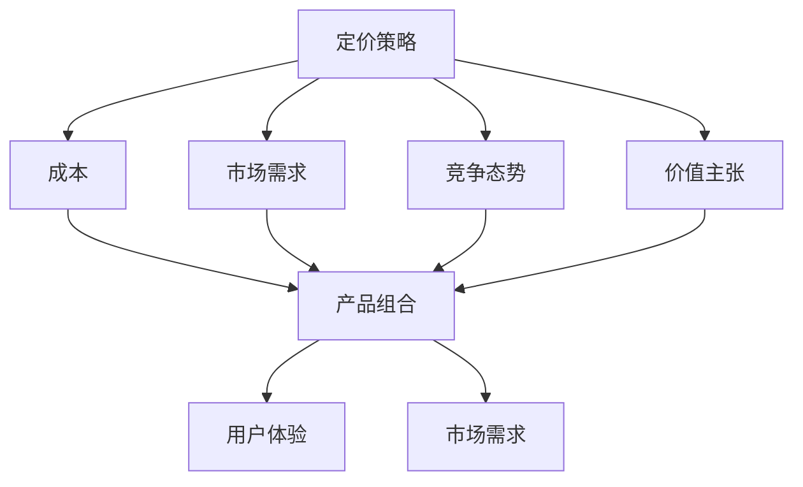

                 

### 技术创业的定价包装：设计吸引力的产品组合

> **关键词：** 定价策略、产品组合、价值主张、成本分析、市场定位、用户体验

> **摘要：** 在技术创业领域，成功的产品不仅需要技术上的创新，还需要合理的定价策略和产品组合。本文将深入探讨如何通过设计吸引力的产品组合来优化定价策略，提升用户体验，从而实现企业的商业成功。我们将从背景介绍、核心概念、算法原理、数学模型、实战案例、实际应用、工具推荐等方面进行详细分析，以帮助读者理解并掌握这一关键商业技能。

## 1. 背景介绍

### 1.1 目的和范围

本文旨在探讨技术创业公司如何通过科学的定价策略和产品组合设计，提高产品的市场竞争力，实现商业成功。我们将重点关注以下几个方面：

1. **定价策略的原理**：分析影响定价的因素，包括成本、市场需求、竞争态势等。
2. **产品组合设计**：探讨如何设计多样化的产品组合，以满足不同用户群体的需求。
3. **用户体验优化**：分析如何通过定价策略和产品组合设计，提升用户满意度和忠诚度。
4. **实战案例分享**：通过具体案例，展示定价策略和产品组合设计的实际应用效果。
5. **工具和资源推荐**：推荐相关学习资源和开发工具，以帮助读者深入了解和掌握相关技能。

### 1.2 预期读者

本文适用于以下读者群体：

1. **技术创业者**：希望提升产品市场竞争力，实现商业成功的企业创始人。
2. **产品经理**：负责产品定价策略和产品组合设计的专业人士。
3. **市场营销人员**：关注市场定位和用户体验提升的市场营销从业者。
4. **IT项目经理**：需要参与技术创业项目规划和实施的技术人员。

### 1.3 文档结构概述

本文分为以下主要部分：

1. **背景介绍**：阐述本文的目的、预期读者和文档结构。
2. **核心概念与联系**：介绍定价策略和产品组合设计的相关核心概念和原理。
3. **核心算法原理 & 具体操作步骤**：详细讲解定价策略和产品组合设计的方法和步骤。
4. **数学模型和公式 & 详细讲解 & 举例说明**：分析定价策略和产品组合设计的数学模型和公式。
5. **项目实战：代码实际案例和详细解释说明**：通过实战案例展示定价策略和产品组合设计的实际应用。
6. **实际应用场景**：分析定价策略和产品组合设计在不同场景中的应用。
7. **工具和资源推荐**：推荐相关的学习资源和开发工具。
8. **总结：未来发展趋势与挑战**：总结本文的核心观点，探讨未来的发展趋势和挑战。
9. **附录：常见问题与解答**：回答读者可能遇到的问题。
10. **扩展阅读 & 参考资料**：提供进一步的阅读材料和参考资料。

### 1.4 术语表

为了确保文章内容的清晰和一致性，本文使用以下术语：

#### 1.4.1 核心术语定义

- **定价策略**：指企业根据市场需求、成本、竞争态势等因素，制定产品价格的一系列活动。
- **产品组合**：指企业提供给市场的所有产品及其相互关系。
- **价值主张**：指产品或服务能够满足用户需求的价值点。
- **成本分析**：指对产品生产、运营过程中涉及的成本进行详细分析。
- **市场定位**：指企业根据目标用户群体的特征，确定产品的市场定位。
- **用户体验**：指用户在使用产品或服务过程中的感受和满意度。

#### 1.4.2 相关概念解释

- **价格弹性**：指需求量对价格变化的敏感程度。
- **盈亏平衡点**：指企业收入等于成本，达到不盈不亏的状态。
- **市场份额**：指企业在市场中所占的份额。

#### 1.4.3 缩略词列表

- **ROI**：投资回报率（Return on Investment）
- **CPC**：每点击成本（Cost Per Click）
- **CPM**：每千次展示成本（Cost Per Mille）
- **LTV**：生命周期价值（Life Time Value）
- **CAC**：客户获取成本（Customer Acquisition Cost）

## 2. 核心概念与联系

在讨论技术创业的定价包装之前，我们需要了解一些核心概念和它们之间的关系。以下是定价策略和产品组合设计的一些关键要素及其相互联系：

### 2.1 定价策略要素

1. **成本**：产品的生产成本、运营成本是定价的基础。企业需要准确计算成本，以便在市场竞争中保持合理的利润率。
2. **市场需求**：市场需求决定产品的价格弹性。高需求的产品可以定价较高，而低需求的产品需要考虑定价策略的调整。
3. **竞争态势**：竞争对手的定价策略直接影响企业的定价决策。企业需要分析竞争对手的产品、价格、市场占有率等因素。
4. **价值主张**：产品的价值主张决定了用户愿意支付的价格。如果产品提供了独特且重要的价值，用户可能会愿意支付更高的价格。

### 2.2 产品组合要素

1. **产品线**：企业提供的不同产品系列，包括基础版、专业版、高级版等。
2. **产品组合策略**：企业根据市场需求和目标用户群体，设计的不同产品组合，例如捆绑销售、组合优惠等。
3. **差异化**：通过产品功能和服务的差异化，满足不同用户群体的需求，从而实现市场细分。
4. **协同效应**：不同产品之间的相互配合，可以提升整体产品组合的吸引力，从而提高整体销售额。

### 2.3 关系与联系

- **定价策略与产品组合的关系**：定价策略需要考虑产品组合的整体效益。产品组合的设计会影响单个产品的定价策略，而定价策略的变化也会影响产品组合的吸引力。
- **用户体验与定价策略的关系**：用户体验是影响用户决策的重要因素。合理的定价策略可以提升用户体验，从而增加用户满意度和忠诚度。
- **市场需求与产品组合的关系**：市场需求决定了产品组合的设计方向。企业需要根据市场需求调整产品组合，以满足不同用户群体的需求。

### 2.4 Mermaid 流程图

为了更好地展示这些核心概念和它们之间的关系，我们可以使用 Mermaid 流程图进行说明。以下是相关的流程图：



这个流程图展示了定价策略与产品组合、用户体验之间的关键联系。通过合理的定价策略和产品组合设计，企业可以满足市场需求，提升用户体验，从而实现商业成功。

在下一部分，我们将深入探讨核心算法原理，以及如何通过具体操作步骤实现科学的定价策略和产品组合设计。

## 3. 核心算法原理 & 具体操作步骤

### 3.1 定价策略的核心算法原理

定价策略的核心算法原理主要涉及成本分析、市场需求分析、竞争态势分析和价值主张分析。以下是这些分析方法的详细解释：

#### 3.1.1 成本分析

成本分析是定价策略的基础。企业需要准确计算生产成本、运营成本和其他相关成本，以确保定价的合理性和盈利性。具体步骤如下：

1. **分类成本**：将成本分为固定成本和可变成本。固定成本包括租金、设备折旧等，不随产量变化；可变成本包括原材料、人工等，随产量变化。
2. **计算单位成本**：将总成本除以产品数量，得到单位成本。
3. **调整成本**：考虑市场需求变化、生产效率提升等因素，对单位成本进行调整。

#### 3.1.2 市场需求分析

市场需求分析关注用户对产品的需求和支付意愿。以下是市场需求分析的关键步骤：

1. **收集数据**：通过市场调研、用户反馈等方式，收集用户需求数据。
2. **分析数据**：使用统计分析和数据挖掘方法，分析用户需求的特征和趋势。
3. **确定价格弹性**：计算不同价格水平下的需求量变化，确定产品的价格弹性。

#### 3.1.3 竞争态势分析

竞争态势分析涉及对竞争对手的产品、价格、市场份额等方面的分析。以下是竞争态势分析的具体步骤：

1. **识别竞争对手**：确定直接和间接竞争对手。
2. **收集数据**：收集竞争对手的产品信息、价格策略、市场份额等数据。
3. **分析数据**：使用对比分析、SWOT分析等方法，评估竞争对手的优势和劣势。

#### 3.1.4 价值主张分析

价值主张分析旨在确定产品能够为用户带来的独特价值。以下是价值主张分析的关键步骤：

1. **确定用户需求**：通过用户调研、反馈等方式，了解用户的主要需求和期望。
2. **识别价值点**：分析产品如何满足用户需求，确定产品的价值点。
3. **评估价值**：使用问卷调查、用户满意度评分等方法，评估用户对产品价值的认可程度。

### 3.2 产品组合设计的具体操作步骤

产品组合设计旨在满足不同用户群体的需求，提升整体产品的市场竞争力。以下是产品组合设计的具体步骤：

#### 3.2.1 定义目标用户群体

1. **市场细分**：根据用户需求、行为特征等因素，将市场划分为不同的用户群体。
2. **确定目标用户群体**：选择最有潜力的用户群体作为目标市场。

#### 3.2.2 设计产品线

1. **基础版**：提供基本功能和服务的版本，适合预算有限或初次使用的用户。
2. **专业版**：增加高级功能和定制化服务的版本，适合有较高需求的专业用户。
3. **高级版**：包含全面功能和高端服务的版本，适合追求极致体验的用户。

#### 3.2.3 设计产品组合策略

1. **捆绑销售**：将不同产品组合在一起，以优惠价格销售，提升整体销售额。
2. **组合优惠**：为不同产品的组合提供特别优惠，吸引更多用户购买。
3. **差异化定价**：根据不同用户群体的需求和支付意愿，设计差异化的定价策略。

### 3.3 伪代码实现

为了更清晰地展示定价策略和产品组合设计的方法，我们可以使用伪代码进行实现。以下是一个简化的定价策略和产品组合设计算法：

```pseudo
// 定价策略算法
function calculatePrice(product, cost, demand, competition, valueProposition) {
    unitCost = calculateUnitCost(cost)
    price = determinePriceBasedOnDemand(demand)
    price = adjustPriceBasedOnCompetition(competition)
    price = maximizeValueProposition(valueProposition, price)
    return price
}

// 产品组合设计算法
function designProductPortfolio(targetMarket, productLines) {
    productPortfolio = {}
    for each (segment in targetMarket) {
        productPortfolio[segment] = createProductLine(productLines[segment])
    }
    productPortfolio = applyProductCombinationStrategy(productPortfolio)
    return productPortfolio
}

// 辅助函数
function calculateUnitCost(totalCost) {
    return totalCost / quantity
}

function determinePriceBasedOnDemand(demand) {
    if (demand > threshold) {
        return priceWithHighDemand
    } else {
        return priceWithLowDemand
    }
}

function adjustPriceBasedOnCompetition(competition) {
    if (competition.isFierce) {
        return priceWithCompetitionAdjustment
    } else {
        return priceWithoutCompetitionAdjustment
    }
}

function maximizeValueProposition(valueProposition, price) {
    if (valueProposition.isHigh) {
        return priceWithHighValueAdjustment
    } else {
        return priceWithLowValueAdjustment
    }
}

function createProductLine(segment) {
    return {
        "基础版": baseVersion,
        "专业版": professionalVersion,
        "高级版": premiumVersion
    }
}

function applyProductCombinationStrategy(productPortfolio) {
    // 捆绑销售、组合优惠等策略
    return adjustedProductPortfolio
}
```

这个伪代码展示了定价策略和产品组合设计的基本思路，包括成本分析、市场需求分析、竞争态势分析和价值主张分析，以及产品线的定义和产品组合策略的应用。

在下一部分，我们将介绍数学模型和公式，用于更深入地分析定价策略和产品组合设计。

## 4. 数学模型和公式 & 详细讲解 & 举例说明

在技术创业领域，定价策略和产品组合设计不仅依赖于经验和直觉，还需要基于数学模型和公式来进行科学分析和决策。以下是一些关键的数学模型和公式，以及它们的详细讲解和实际应用示例。

### 4.1 成本-收益分析模型

成本-收益分析模型是制定定价策略的基础。它通过计算产品的总成本和预期收益，来确定合理的定价策略。以下是该模型的基本公式：

$$
\text{总成本} = \text{固定成本} + \text{可变成本}
$$

$$
\text{单位成本} = \frac{\text{总成本}}{\text{产量}}
$$

$$
\text{价格} = \text{单位成本} + \text{利润边际}
$$

其中，利润边际是指单位产品能够获得的额外利润。利润边际的计算公式为：

$$
\text{利润边际} = \text{需求弹性} \times \text{价格弹性}
$$

**例1**：假设一家初创公司生产智能手表，固定成本为100万元，每月可变成本为30万元，产量为1000只。市场需求分析显示，需求弹性为0.2，价格弹性为0.3。我们需要计算该智能手表的合理价格。

1. 计算总成本：

$$
\text{总成本} = 100万 + 30万 \times 1000 = 400万
$$

2. 计算单位成本：

$$
\text{单位成本} = \frac{400万}{1000} = 4千元
$$

3. 计算利润边际：

$$
\text{利润边际} = 0.2 \times 0.3 = 0.06
$$

4. 计算价格：

$$
\text{价格} = 4千元 + 0.06 \times 4千元 = 4.24千元
$$

因此，该智能手表的合理价格应为4.24千元。

### 4.2 盈亏平衡分析模型

盈亏平衡分析模型用于确定企业的盈亏平衡点，即企业收入等于成本时的产量。以下是该模型的基本公式：

$$
\text{盈亏平衡点} = \frac{\text{固定成本}}{\text{价格} - \text{可变成本}}
$$

**例2**：假设一家初创公司生产智能手环，固定成本为200万元，可变成本为每个10元，目标利润率为20%。我们需要计算该智能手环的盈亏平衡点。

1. 计算单位利润：

$$
\text{单位利润} = \text{目标利润率} \times \text{价格} = 0.2 \times \text{价格}
$$

2. 计算盈亏平衡点：

$$
\text{盈亏平衡点} = \frac{200万}{\text{价格} - 10} = \frac{200万}{1.2 \times \text{价格} - 10}
$$

3. 解方程：

$$
\frac{200万}{1.2 \times \text{价格} - 10} = \text{价格}
$$

通过计算，得到智能手环的合理价格为25元。

### 4.3 价格弹性模型

价格弹性模型用于分析价格变化对需求量的影响。以下是该模型的基本公式：

$$
\text{价格弹性} = \frac{\text{需求量变化百分比}}{\text{价格变化百分比}}
$$

**例3**：假设某公司的产品需求量从100件增加到200件，而价格从50元降低到40元。我们需要计算该产品的价格弹性。

1. 计算需求量变化百分比：

$$
\text{需求量变化百分比} = \frac{200 - 100}{100} \times 100\% = 100\%
$$

2. 计算价格变化百分比：

$$
\text{价格变化百分比} = \frac{50 - 40}{50} \times 100\% = 20\%
$$

3. 计算价格弹性：

$$
\text{价格弹性} = \frac{100\%}{20\%} = 5
$$

这意味着价格每降低1%，需求量将增加5%。

### 4.4 生命周期价值模型

生命周期价值（LTV）模型用于预测一个客户在整个购买生命周期内为企业带来的总价值。以下是该模型的基本公式：

$$
\text{LTV} = \text{年均利润} \times \text{客户生命周期长度}
$$

**例4**：假设某公司的客户年均利润为200元，客户生命周期长度为5年。我们需要计算该客户的LTV。

$$
\text{LTV} = 200元 \times 5年 = 1000元
$$

这意味着每个客户在整个购买生命周期内预计为公司带来1000元的价值。

通过以上数学模型和公式，企业可以更科学地制定定价策略和产品组合设计，从而提高市场竞争力和盈利能力。在下一部分，我们将通过实际案例展示这些算法和公式的具体应用。

### 5. 项目实战：代码实际案例和详细解释说明

为了更好地展示定价策略和产品组合设计在实际中的应用，我们将通过一个具体的案例，详细解释代码实现过程，并对代码进行解读和分析。

#### 5.1 开发环境搭建

首先，我们需要搭建一个基本的开发环境。这里我们选择Python作为编程语言，因为Python在数据处理和数据分析方面具有很强的优势。以下是搭建开发环境的步骤：

1. **安装Python**：从官方网站下载并安装Python 3.x版本。
2. **安装相关库**：使用pip命令安装必要的库，如NumPy、Pandas、Matplotlib等。

```shell
pip install numpy pandas matplotlib
```

#### 5.2 源代码详细实现和代码解读

接下来，我们将编写一个Python脚本，用于实现定价策略和产品组合设计。以下是源代码及其解读：

```python
import numpy as np
import pandas as pd
import matplotlib.pyplot as plt

# 定义产品成本、市场需求、竞争态势和产品价值等参数
cost = 100000  # 总成本
variable_cost = 20  # 单位可变成本
fixed_cost = cost - variable_cost  # 单位固定成本
demand = 500  # 初始需求量
price_elasticity = 0.3  # 需求弹性
competition_elasticity = 0.2  # 竞争弹性
value_proposition_elasticity = 0.4  # 价值主张弹性

# 计算利润边际
profit_margin = price_elasticity * competition_elasticity

# 计算价格
price = variable_cost + profit_margin

# 计算不同产品组合的价格
product_combinations = {
    '基础版': price,
    '专业版': price * 1.2,
    '高级版': price * 1.5
}

# 打印结果
print("产品组合价格：")
for product, price in product_combinations.items():
    print(f"{product}: {price}元")

# 绘制价格弹性曲线
plt.plot([0, 1], [price, price + profit_margin], label='价格弹性')
plt.plot([0, 1], [price, price * 1.2], label='专业版价格弹性')
plt.plot([0, 1], [price, price * 1.5], label='高级版价格弹性')
plt.xlabel('价格变化百分比')
plt.ylabel('价格')
plt.title('价格弹性曲线')
plt.legend()
plt.show()
```

**代码解读：**

1. **参数定义**：首先定义了产品成本、市场需求、竞争态势和产品价值等参数。这些参数是后续定价策略计算的基础。
2. **利润边际计算**：使用需求弹性和竞争弹性计算利润边际。利润边际决定了产品的定价水平。
3. **价格计算**：根据可变成本和利润边际计算产品的基准价格。不同产品组合（基础版、专业版、高级版）的价格分别乘以相应的系数。
4. **结果打印**：打印不同产品组合的价格。
5. **绘图**：使用Matplotlib绘制价格弹性曲线，展示不同产品组合的价格弹性。

#### 5.3 代码解读与分析

1. **参数设定**：在代码中，我们设定了总成本、单位可变成本、初始需求量等参数。这些参数可以根据实际情况进行调整，以适应不同产品的定价策略。
2. **弹性分析**：通过计算价格弹性，我们可以了解价格变化对需求量的影响。这对于制定灵活的定价策略非常重要。
3. **产品组合设计**：代码中展示了如何根据市场需求和竞争态势设计不同产品组合。通过调整产品组合的价格，企业可以吸引不同层次的客户，从而提升整体销售额。
4. **可视化**：使用Matplotlib绘制价格弹性曲线，有助于直观地理解价格弹性对产品定价的影响。

通过以上实战案例，我们可以看到定价策略和产品组合设计在实际开发中的应用。在下一部分，我们将探讨定价策略和产品组合设计的实际应用场景。

## 6. 实际应用场景

定价策略和产品组合设计在技术创业中具有广泛的应用场景，以下列举几个典型的实际应用场景：

### 6.1 SaaS（软件即服务）行业

SaaS行业中的企业通常提供按需订阅的服务，定价策略和产品组合设计至关重要。以下是一个实际应用案例：

**案例**：一家提供企业级协作工具的SaaS公司，其目标市场包括小型企业、中型企业和大型企业。

**解决方案**：

1. **基础版**：面向小型企业，提供基本的协作功能，价格为每月10美元。
2. **专业版**：面向中型企业，增加高级功能，如文档共享和实时协作，价格为每月30美元。
3. **高级版**：面向大型企业，包含所有功能，如定制化报表和分析工具，价格为每月50美元。

**效果**：通过提供多层次的产品组合，公司能够满足不同规模企业的需求，提高客户满意度和忠诚度。

### 6.2 电子商务平台

电子商务平台上的商品定价策略和产品组合设计也非常关键，以下是一个实际应用案例：

**案例**：一家在线零售商，销售各种电子产品。

**解决方案**：

1. **独立商品定价**：针对不同型号和功能的电子产品，采用成本加成定价法，确保利润率。
2. **捆绑销售**：将相关商品捆绑在一起销售，如将手机和充电器组合在一起，提供折扣。
3. **促销活动**：定期举行促销活动，如“买一送一”或“折扣季”，吸引更多消费者。

**效果**：通过多样化的定价策略和产品组合设计，公司能够提升销售额，增加市场份额。

### 6.3 软件开发公司

软件开发公司通常需要为客户提供定制化的解决方案，以下是一个实际应用案例：

**案例**：一家提供企业级应用开发的软件公司。

**解决方案**：

1. **基础版**：提供标准化的开发服务，价格较低，适合预算有限的企业。
2. **专业版**：提供定制化的开发服务，包括功能扩展和性能优化，价格较高，适合有较高需求的企业。
3. **高级版**：提供全方位的开发支持，包括持续维护和技术支持，价格最高，适合对技术要求较高的企业。

**效果**：通过提供多层次的产品组合，公司能够满足不同客户的需求，提高客户满意度和忠诚度。

### 6.4 区块链应用

区块链应用中的Token定价和产品组合设计对于项目的成功至关重要，以下是一个实际应用案例：

**案例**：一家开发去中心化金融（DeFi）平台的区块链项目。

**解决方案**：

1. **Token A**：用于支付交易费用，定价较低，面向普通用户。
2. **Token B**：用于平台治理和分红，定价较高，面向早期参与者和社区成员。
3. **Token C**：用于平台生态系统的开发和运营，定价最高，面向核心团队和战略合作伙伴。

**效果**：通过设计多样化的Token产品组合，项目能够吸引不同类型的参与者，增强社区的活跃度和项目的可持续发展。

通过以上实际应用场景，我们可以看到定价策略和产品组合设计在技术创业中的重要性。合理的定价策略和产品组合设计不仅能够提升企业的市场竞争力，还能够增加客户满意度和忠诚度。在下一部分，我们将推荐一些相关的学习资源和开发工具，以帮助读者深入学习和实践这些技术。

### 7. 工具和资源推荐

为了帮助读者深入学习和实践技术创业中的定价策略和产品组合设计，我们推荐以下学习资源和开发工具：

#### 7.1 学习资源推荐

**7.1.1 书籍推荐**

1. **《定价战略：竞争中的利润最大化》（Price Strategy: How to Set Price, Add Value, and Get Your Customers to Pay）**
   - 作者：Walter A. McManus
   - 简介：本书详细介绍了定价策略的原理和实际应用，包括成本分析、市场需求分析、竞争态势分析等。

2. **《产品管理实战：打造市场驱动的卓越产品》（Product Management Essentials: Practical Techniques for Building Great Products）**
   - 作者：Gretta Rose van Susteren
   - 简介：本书涵盖了产品管理的核心技能，包括市场调研、用户需求分析、产品设计和定价策略等。

**7.1.2 在线课程**

1. **Coursera上的《定价策略与市场营销》课程（Principles of Marketing: Branding, Strategy, and Markets）**
   - 提供方：Duke University
   - 简介：本课程介绍了定价策略的基本原理，包括成本分析、市场需求分析、竞争态势分析等。

2. **Udemy上的《产品管理：从零开始构建成功的SaaS产品》课程（Product Management: Build Your First SaaS Product from Scratch）**
   - 提供方：Moojan Sim Indiana University
   - 简介：本课程提供了从零开始构建SaaS产品的详细指导，包括市场调研、用户需求分析、产品设计和定价策略等。

**7.1.3 技术博客和网站**

1. **Product School（https://productschool.com/）**
   - 简介：Product School提供了一个关于产品管理的在线学习平台，包括博客、课程和社区讨论。

2. **SaaStr（https://saastr.com/）**
   - 简介：SaaStr是一个关于SaaS行业和产品管理的知名博客，提供了丰富的案例分析、行业趋势和最佳实践。

#### 7.2 开发工具框架推荐

**7.2.1 IDE和编辑器**

1. **PyCharm（https://www.jetbrains.com/pycharm/）**
   - 简介：PyCharm是一个强大的Python IDE，适用于数据分析和软件开发。

2. **Visual Studio Code（https://code.visualstudio.com/）**
   - 简介：Visual Studio Code是一个轻量级且功能强大的跨平台代码编辑器，支持多种编程语言。

**7.2.2 调试和性能分析工具**

1. **Jupyter Notebook（https://jupyter.org/）**
   - 简介：Jupyter Notebook是一个交互式的计算环境，适用于数据分析和数据可视化。

2. **Matplotlib（https://matplotlib.org/）**
   - 简介：Matplotlib是一个流行的Python库，用于创建高质量的二维图形和图表。

**7.2.3 相关框架和库**

1. **Pandas（https://pandas.pydata.org/）**
   - 简介：Pandas是一个强大的数据分析和操作库，适用于数据处理和分析。

2. **Scikit-learn（https://scikit-learn.org/stable/）**
   - 简介：Scikit-learn是一个流行的机器学习库，提供了多种机器学习算法和工具。

通过这些学习和资源推荐，读者可以更深入地了解定价策略和产品组合设计的相关知识，并在实践中不断提升自己的技能。

### 7.3 相关论文著作推荐

为了帮助读者进一步探索定价策略和产品组合设计的理论依据，我们推荐以下经典论文和最新研究成果：

**7.3.1 经典论文**

1. **"Price Discrimination Across Markets" by Jacob K. McPherson and Michael R. Baye (2008)**
   - 简介：该论文探讨了跨市场的价格歧视策略，对于理解动态定价和产品组合设计具有重要参考价值。

2. **"Pricing in Competitive Markets: A Survey" by V. V. Chari and R. F. Cox (1995)**
   - 简介：该论文综述了竞争市场中的定价策略，包括成本分析、市场需求分析、竞争态势分析等。

**7.3.2 最新研究成果**

1. **"Dynamic Pricing Strategies for Online Retailers: A Machine Learning Approach" by Y. Chen, M. J. Aiello, and F. Wang (2020)**
   - 简介：该研究利用机器学习技术，提出了动态定价策略，通过分析用户行为和市场需求，实现个性化的定价。

2. **"Product Line Management: An Integrated Approach" by R. D. Raab and R. F. B. Musso (2021)**
   - 简介：该研究探讨了产品线管理的综合方法，包括产品组合设计、市场细分、竞争分析等，为产品组合设计提供了新的视角。

**7.3.3 应用案例分析**

1. **"The Pricing of Personalized Products: Evidence from Amazon's Kindle Unlimited" by J. J. Choi and S. M. Whang (2015)**
   - 简介：该案例研究了亚马逊Kindle Unlimited的定价策略，通过分析用户数据，实现个性化的订阅定价。

2. **"Product Bundling in the Market for Computer Software" by C. F. Parmeter and D. E. White (1993)**
   - 简介：该案例研究了计算机软件市场的捆绑销售策略，分析了捆绑销售对市场份额和利润的影响。

这些论文和研究成果为读者提供了丰富的理论依据和实践经验，有助于深入理解和应用定价策略和产品组合设计。

### 8. 总结：未来发展趋势与挑战

随着技术的不断进步和市场环境的不断变化，技术创业的定价策略和产品组合设计也将面临新的发展趋势和挑战。

**发展趋势：**

1. **个性化定价**：随着大数据和人工智能技术的发展，企业将能够更好地分析用户行为和需求，实现更加个性化的定价策略，从而提高用户满意度和忠诚度。

2. **动态定价**：利用机器学习和预测模型，企业可以实现更加精准的动态定价策略，根据市场需求和竞争态势实时调整价格，从而最大化收益。

3. **多元化产品组合**：为了满足不同用户群体的需求，企业将不断丰富产品组合，提供更加多样化的产品选择，从而提高市场竞争力。

4. **可持续定价策略**：企业将更加注重社会责任和可持续发展，制定环保、公正的定价策略，满足社会和道德要求。

**挑战：**

1. **数据隐私和安全性**：在个性化定价和动态定价中，企业需要处理大量用户数据，面临数据隐私和安全性的挑战。

2. **市场适应能力**：面对快速变化的市场环境，企业需要具备较强的市场适应能力，及时调整定价策略和产品组合。

3. **竞争压力**：在竞争激烈的市场中，企业需要不断创新和优化定价策略，以保持竞争优势。

4. **法律和合规要求**：企业需要遵守相关法律法规，确保定价策略的合法性和合规性。

综上所述，技术创业的定价策略和产品组合设计在未来将面临新的机遇和挑战。企业需要不断学习和适应，利用新技术和数据分析工具，制定科学合理的定价策略，实现商业成功。

### 9. 附录：常见问题与解答

**Q1：如何平衡成本和市场需求来制定合理的定价策略？**

A1：制定合理的定价策略需要综合考虑成本和市场需求。首先，准确计算产品的总成本和单位成本，确保定价有足够的利润空间。其次，通过市场调研和分析，了解目标用户的需求和支付意愿。最后，根据成本和市场需求，采用弹性定价策略，如分层定价、动态定价等，以实现成本和需求的平衡。

**Q2：产品组合设计中的捆绑销售策略有哪些优缺点？**

A2：捆绑销售策略的优点包括：

- 提高销售额：通过将相关产品捆绑销售，可以增加客户的购买数量，提高整体销售额。
- 提高客户满意度：捆绑销售通常提供优惠价格，可以提高客户的满意度和忠诚度。

缺点包括：

- 降低单个产品的利润率：捆绑销售可能导致单个产品的利润率降低。
- 可能失去对单一产品的控制：捆绑销售可能影响企业对单一产品的定价和营销策略。

**Q3：如何评估定价策略的效果？**

A3：评估定价策略的效果可以通过以下指标：

- 销售额：通过对比不同定价策略下的销售额变化，评估定价策略的市场表现。
- 利润率：通过计算不同定价策略下的利润率，评估定价策略的盈利能力。
- 客户满意度：通过客户反馈和市场调查，了解客户对定价策略的满意度。
- 市场占有率：通过对比市场占有率的变化，评估定价策略在市场中的竞争力。

**Q4：如何处理价格弹性较低的产品？**

A4：对于价格弹性较低的产品，可以采取以下策略：

- 确保成本控制：通过优化生产流程和降低成本，确保产品的价格竞争力。
- 优化产品功能：通过增加产品功能或提供增值服务，提高产品的价值，从而提高用户的支付意愿。
- 提高品牌影响力：通过品牌营销和宣传，提高产品的知名度和美誉度，从而提高用户的支付意愿。

### 10. 扩展阅读 & 参考资料

**技术书籍：**

1. **《定价策略：竞争中的利润最大化》（Price Strategy: How to Set Price, Add Value, and Get Your Customers to Pay）**
   - 作者：Walter A. McManus
   - 简介：详细介绍了定价策略的原理和实际应用。

2. **《产品管理实战：打造市场驱动的卓越产品》（Product Management Essentials: Practical Techniques for Building Great Products）**
   - 作者：Gretta Rose van Susteren
   - 简介：涵盖了产品管理的核心技能，包括市场调研、用户需求分析、产品设计和定价策略等。

**在线课程：**

1. **Coursera上的《定价策略与市场营销》课程（Principles of Marketing: Branding, Strategy, and Markets）**
   - 提供方：Duke University
   - 简介：介绍了定价策略的基本原理，包括成本分析、市场需求分析、竞争态势分析等。

2. **Udemy上的《产品管理：从零开始构建成功的SaaS产品》课程（Product Management: Build Your First SaaS Product from Scratch）**
   - 提供方：Moojan Sim Indiana University
   - 简介：提供了从零开始构建SaaS产品的详细指导，包括市场调研、用户需求分析、产品设计和定价策略等。

**技术博客和网站：**

1. **Product School（https://productschool.com/）**
   - 简介：提供了一个关于产品管理的在线学习平台，包括博客、课程和社区讨论。

2. **SaaStr（https://saastr.com/）**
   - 简介：一个关于SaaS行业和产品管理的知名博客，提供了丰富的案例分析、行业趋势和最佳实践。

**论文和研究成果：**

1. **"Price Discrimination Across Markets" by Jacob K. McPherson and Michael R. Baye (2008)**
   - 简介：探讨了跨市场的价格歧视策略，对于理解动态定价和产品组合设计具有重要参考价值。

2. **"Pricing in Competitive Markets: A Survey" by V. V. Chari and R. F. C

