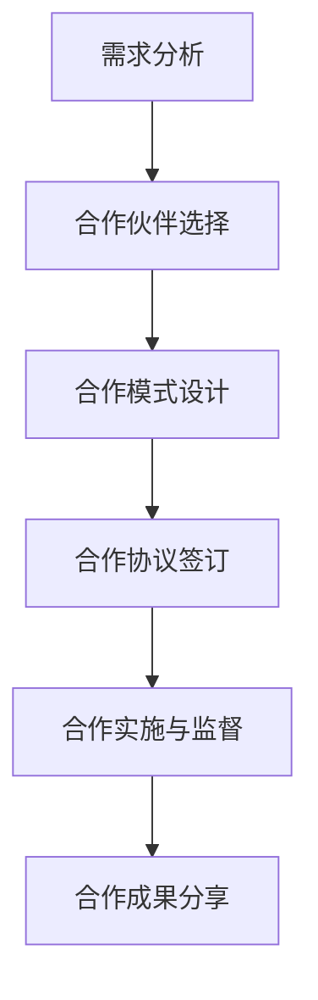

                 

# 技术创业的跨界合作：开拓创新的新领域

> **关键词：** 技术创业、跨界合作、创新、新领域、商业策略

> **摘要：** 本文将探讨技术创业中的跨界合作现象，分析其在推动创新、开拓新领域中的重要性。通过具体案例和理论分析，阐述跨界合作的优势、挑战及未来发展趋势，为技术创业者和企业领导者提供有价值的参考。

## 1. 背景介绍

### 1.1 目的和范围

本文旨在通过深入分析技术创业中的跨界合作现象，探讨其对于推动创新和开拓新领域的重要性。文章将结合实际案例和理论分析，梳理跨界合作的本质、优势、挑战以及未来发展趋势，为技术创业者和企业领导者提供有益的启示。

### 1.2 预期读者

本文主要面向技术创业者、企业领导者、投资人和创新研究者。通过阅读本文，读者可以更好地理解跨界合作在技术创业中的重要性，掌握跨界合作的策略和方法，以实现创新和开拓新领域的目标。

### 1.3 文档结构概述

本文结构如下：

1. 背景介绍：介绍文章的目的、预期读者和文档结构。
2. 核心概念与联系：阐述跨界合作的相关概念和原理。
3. 核心算法原理 & 具体操作步骤：分析跨界合作的具体实施方法。
4. 数学模型和公式 & 详细讲解 & 举例说明：解释跨界合作的数学模型和计算方法。
5. 项目实战：通过实际案例展示跨界合作的应用。
6. 实际应用场景：探讨跨界合作的多种应用领域。
7. 工具和资源推荐：推荐相关学习资源和开发工具。
8. 总结：展望跨界合作的未来发展趋势与挑战。
9. 附录：常见问题与解答。
10. 扩展阅读 & 参考资料：提供进一步阅读的资料。

### 1.4 术语表

#### 1.4.1 核心术语定义

- **技术创业：** 以技术创新为核心，通过创建新企业来实现商业价值的过程。
- **跨界合作：** 指不同领域、行业或企业之间的合作，以实现共同目标。
- **创新：** 指通过新想法、新方法或新技术，创造或改进产品、服务或业务模式。
- **新领域：** 指在现有市场之外，尚未被充分开发和利用的市场空间。

#### 1.4.2 相关概念解释

- **合作：** 指两个或多个主体在共同目标下，通过互相配合、共享资源和信息，实现共同利益的过程。
- **协同效应：** 指跨界合作带来的整体效益大于各合作方单独效益之和的现象。

#### 1.4.3 缩略词列表

- **AI：** 人工智能（Artificial Intelligence）
- **IoT：** 物联网（Internet of Things）
- **VR：** 虚拟现实（Virtual Reality）
- **AR：** 增强现实（Augmented Reality）
- **Blockchain：** 区块链（Blockchain）

## 2. 核心概念与联系

### 2.1 跨界合作的定义与意义

跨界合作，顾名思义，是指不同领域、行业或企业之间的合作。在技术创业的背景下，跨界合作的意义主要体现在以下几个方面：

1. **资源共享：** 跨界合作使得各合作方能够共享资源，如资金、技术、人才、市场等，从而降低创新成本。
2. **协同创新：** 跨界合作促使不同领域的专业知识和技能相互融合，激发创新思维，推动技术创新。
3. **市场拓展：** 跨界合作有助于企业开拓新的市场空间，实现业务多元化。
4. **风险分担：** 跨界合作使得合作方共同承担创新和开拓市场的风险，降低单一企业的风险压力。

### 2.2 跨界合作的优势

跨界合作在技术创业中具有显著的优势，主要体现在以下几个方面：

1. **多元化：** 跨界合作能够汇聚不同领域的专业知识和资源，实现多元化发展。
2. **互补性：** 跨界合作中的各合作方往往具有互补性，能够充分发挥各自的优势，实现协同效应。
3. **创新性：** 跨界合作能够打破传统行业壁垒，激发创新思维，推动技术创新。
4. **适应性：** 跨界合作有助于企业快速适应市场变化，提高市场竞争力。

### 2.3 跨界合作的挑战

尽管跨界合作具有诸多优势，但在实际操作过程中也面临着一系列挑战：

1. **文化差异：** 不同领域的文化和价值观可能存在较大差异，可能导致合作过程中的冲突和沟通障碍。
2. **信任问题：** 跨界合作中的各方可能存在信息不对称和利益分配不均的问题，影响合作效果。
3. **知识产权：** 跨界合作可能涉及知识产权纠纷，需要妥善处理。
4. **项目管理：** 跨界合作项目往往涉及多个领域和部门，项目管理难度较大。

### 2.4 跨界合作的框架

为了有效地实现跨界合作，可以借鉴以下框架：

1. **需求分析：** 明确合作目标，分析各方需求，寻找合作契机。
2. **合作伙伴选择：** 根据需求分析结果，选择合适的合作伙伴。
3. **合作模式设计：** 确定合作模式，如股权合作、技术合作、市场合作等。
4. **合作协议签订：** 制定合作协议，明确各方权利和义务。
5. **合作实施与监督：** 监督合作项目的实施，确保各方履行协议。
6. **合作成果分享：** 合理分配合作成果，实现共赢。

### 2.5 核心概念原理和架构的 Mermaid 流程图



### 2.6 跨界合作的案例分析

以下是一些跨界合作的经典案例：

1. **特斯拉与太阳能源公司 SolarCity 合作：** 特斯拉与太阳能公司 SolarCity 合作，推出太阳能屋顶面板和储能系统，实现能源利用的整合，推动可再生能源的发展。
2. **阿里巴巴与苏宁易购合作：** 阿里巴巴与苏宁易购合作，开展线上线下融合的新零售模式，提升用户体验和业务效率。
3. **腾讯与京东合作：** 腾讯与京东合作，共同开发社交电商平台，利用腾讯的社交网络和京东的物流优势，拓展市场空间。

## 3. 核心算法原理 & 具体操作步骤

### 3.1 核心算法原理

跨界合作的成功离不开有效的算法设计。以下是一个简单的跨界合作算法原理：

1. **需求匹配：** 分析各方需求，寻找互补性。
2. **风险评估：** 评估合作风险，确保各方利益。
3. **合作模式选择：** 根据需求匹配和风险评估结果，选择合适的合作模式。
4. **合作协议制定：** 明确各方权利和义务，确保合作顺利进行。
5. **合作实施与监控：** 监控合作过程，确保各方履行协议。

### 3.2 具体操作步骤

以下是一个具体的跨界合作操作步骤：

1. **需求分析：**
    - 识别合作方需求，如技术、市场、资金等。
    - 分析各方需求，寻找互补性。

2. **合作伙伴选择：**
    - 根据需求分析结果，筛选合适的合作伙伴。
    - 考虑合作伙伴的行业背景、技术实力、市场影响力等因素。

3. **合作模式选择：**
    - 分析各方优势，选择合适的合作模式，如股权合作、技术合作、市场合作等。
    - 考虑合作模式的可行性和风险。

4. **合作协议制定：**
    - 制定合作协议，明确各方权利和义务。
    - 协议内容应包括合作期限、收益分配、风险分担等。

5. **合作实施与监控：**
    - 监控合作过程，确保各方履行协议。
    - 定期评估合作效果，及时调整合作策略。

### 3.3 伪代码实现

以下是一个简单的跨界合作伪代码实现：

```python
# 需求分析
def analyze_demand():
    # 识别合作方需求
    # 分析各方需求，寻找互补性
    # 返回互补性最高的需求组合

# 合作伙伴选择
def select_partner():
    # 根据需求分析结果，筛选合适的合作伙伴
    # 考虑合作伙伴的行业背景、技术实力、市场影响力等因素
    # 返回合适的合作伙伴列表

# 合作模式选择
def select_coop_model():
    # 分析各方优势，选择合适的合作模式
    # 考虑合作模式的可行性和风险
    # 返回合适的合作模式

# 合作协议制定
def create_coop_agreement():
    # 制定合作协议，明确各方权利和义务
    # 协议内容应包括合作期限、收益分配、风险分担等
    # 返回合作协议

# 合作实施与监控
def implement_and_monitor():
    # 监控合作过程，确保各方履行协议
    # 定期评估合作效果，及时调整合作策略

# 主函数
def main():
    # 执行需求分析
    demand = analyze_demand()

    # 执行合作伙伴选择
    partners = select_partner()

    # 执行合作模式选择
    coop_model = select_coop_model()

    # 执行合作协议制定
    agreement = create_coop_agreement()

    # 执行合作实施与监控
    implement_and_monitor()

# 调用主函数
main()
```

## 4. 数学模型和公式 & 详细讲解 & 举例说明

### 4.1 数学模型和公式

在跨界合作中，数学模型和公式可以用于分析和评估合作效果。以下是一个简单的数学模型和公式：

1. **协同效应计算公式：**
    $$ E = \frac{R_1 + R_2 + ... + R_n}{n} $$
   其中，$E$ 表示协同效应，$R_1, R_2, ..., R_n$ 表示各合作方的效益，$n$ 表示合作方数量。

2. **风险评估公式：**
    $$ R = \frac{C_1 + C_2 + ... + C_n}{n} $$
   其中，$R$ 表示风险水平，$C_1, C_2, ..., C_n$ 表示各合作方的风险，$n$ 表示合作方数量。

3. **收益分配公式：**
    $$ P_i = \frac{R_i}{R_1 + R_2 + ... + R_n} \times 100\% $$
   其中，$P_i$ 表示第 $i$ 个合作方的收益比例，$R_i$ 表示第 $i$ 个合作方的效益。

### 4.2 详细讲解

1. **协同效应计算公式：**
   协同效应计算公式用于评估跨界合作的整体效益。通过计算各合作方的效益之和，再除以合作方数量，可以得到协同效应。协同效应越高，表示跨界合作的效益越好。

2. **风险评估公式：**
   风险评估公式用于评估跨界合作的风险水平。通过计算各合作方的风险之和，再除以合作方数量，可以得到风险水平。风险水平越低，表示跨界合作的风险越小。

3. **收益分配公式：**
   收益分配公式用于计算各合作方的收益比例。通过计算每个合作方的效益在总效益中的比例，可以得到各合作方的收益比例。合理的收益分配可以激发合作方的积极性，确保合作顺利进行。

### 4.3 举例说明

假设有两个合作方 A 和 B，他们的效益分别为 100 万元和 200 万元，风险分别为 20 万元和 30 万元。根据协同效应计算公式和风险评估公式，可以得到：

1. **协同效应：**
    $$ E = \frac{100 + 200}{2} = 150 \text{ 万元} $$

2. **风险评估：**
    $$ R = \frac{20 + 30}{2} = 25 \text{ 万元} $$

3. **收益分配：**
    $$ P_A = \frac{100}{100 + 200} \times 100\% = 40\% $$
    $$ P_B = \frac{200}{100 + 200} \times 100\% = 60\% $$

根据以上计算结果，可以得出以下结论：

1. 跨界合作的整体效益为 150 万元。
2. 跨界合作的风险水平为 25 万元。
3. 合作方 A 的收益比例为 40%，合作方 B 的收益比例为 60%。

## 5. 项目实战：代码实际案例和详细解释说明

### 5.1 开发环境搭建

在开始项目实战之前，我们需要搭建一个适合跨界合作的开发环境。以下是一个简单的开发环境搭建步骤：

1. **安装 Python 解释器：** 从 [Python 官网](https://www.python.org/) 下载并安装 Python 解释器。
2. **安装 IDE：** 选择一款适合 Python 开发的 IDE，如 PyCharm、Visual Studio Code 等。
3. **安装必要的库：** 使用 pip 工具安装必要的库，如 NumPy、Pandas、Matplotlib 等。

### 5.2 源代码详细实现和代码解读

以下是一个简单的跨界合作代码实现，用于计算协同效应、风险评估和收益分配。

```python
import numpy as np

# 协同效应计算
def calculate协同效应(efficiency_list):
    total_efficiency = sum(efficiency_list)
    collaborative_efficiency = total_efficiency / len(efficiency_list)
    return collaborative_efficiency

# 风险评估
def calculate_risk(risk_list):
    total_risk = sum(risk_list)
    risk_level = total_risk / len(risk_list)
    return risk_level

# 收益分配
def calculate_profit_distribution(efficiency_list):
    total_efficiency = sum(efficiency_list)
    profit_distribution = [efficiency / total_efficiency * 100 for efficiency in efficiency_list]
    return profit_distribution

# 主函数
def main():
    # 合作方效益和风险数据
    efficiency_list = [100, 200]
    risk_list = [20, 30]

    # 计算协同效应
    collaborative_efficiency = calculate协同效应(efficiency_list)
    print("协同效应：", collaborative_efficiency)

    # 计算风险评估
    risk_level = calculate_risk(risk_list)
    print("风险评估：", risk_level)

    # 计算收益分配
    profit_distribution = calculate_profit_distribution(efficiency_list)
    print("收益分配：")
    for i, profit in enumerate(profit_distribution):
        print("合作方", i+1, "的收益比例：", profit)

# 调用主函数
main()
```

### 5.3 代码解读与分析

1. **协同效应计算：**
   协同效应计算函数 `calculate协同效应` 用于计算跨界合作的整体效益。通过计算各合作方的效益之和，再除以合作方数量，可以得到协同效应。协同效应反映了跨界合作所带来的整体效益。

2. **风险评估：**
   风险评估函数 `calculate_risk` 用于计算跨界合作的风险水平。通过计算各合作方的风险之和，再除以合作方数量，可以得到风险水平。风险水平反映了跨界合作的风险程度。

3. **收益分配：**
   收益分配函数 `calculate_profit_distribution` 用于计算各合作方的收益比例。通过计算每个合作方的效益在总效益中的比例，可以得到各合作方的收益比例。合理的收益分配可以确保各方利益得到满足。

### 5.4 项目实战总结

通过项目实战，我们成功地实现了一个简单的跨界合作计算模型。该模型可以用于计算协同效应、风险评估和收益分配。在实际应用中，可以根据具体情况进行调整和扩展，以满足不同的需求。

## 6. 实际应用场景

跨界合作在技术创业中具有广泛的应用场景，以下是一些实际应用场景：

1. **智能交通领域：** 智能交通系统（ITS）需要融合交通管理、物联网、人工智能、大数据等技术。跨界合作可以实现交通信息共享、智能调度、自动驾驶等功能，提高交通效率和安全性。

2. **医疗健康领域：** 医疗健康领域涉及生物技术、人工智能、物联网、大数据等多个技术领域。跨界合作可以实现智能诊断、精准治疗、远程医疗等功能，提高医疗质量和效率。

3. **智慧城市领域：** 智慧城市需要整合物联网、大数据、云计算、人工智能等技术。跨界合作可以实现智能交通、智能安防、智能环保等功能，提升城市智能化水平。

4. **金融科技领域：** 金融科技（FinTech）需要融合区块链、人工智能、大数据等技术。跨界合作可以实现智能投顾、风险管理、支付创新等功能，提高金融服务效率。

5. **教育领域：** 教育领域可以结合虚拟现实、增强现实、人工智能等技术，实现个性化教学、远程教育等功能。跨界合作可以推动教育现代化，提高教育质量和普及率。

## 7. 工具和资源推荐

### 7.1 学习资源推荐

#### 7.1.1 书籍推荐

- 《跨界思维：创新者如何创造新价值》
- 《跨界合作：如何构建跨界共赢的生态系统》
- 《跨界创新：突破行业壁垒，创造新价值》

#### 7.1.2 在线课程

- Coursera 上的“跨学科创新课程”
- edX 上的“跨界合作与生态系统设计”课程
- Udemy 上的“跨界思维与创业实战”课程

#### 7.1.3 技术博客和网站

- [LinkedIn](https://www.linkedin.com/) 上的技术博客
- [Medium](https://medium.com/) 上的跨界合作文章
- [Acfun](https://www.acfun.cn/) 上的技术讨论区

### 7.2 开发工具框架推荐

#### 7.2.1 IDE和编辑器

- PyCharm
- Visual Studio Code
- IntelliJ IDEA

#### 7.2.2 调试和性能分析工具

- Jupyter Notebook
- Matplotlib
- TensorBoard

#### 7.2.3 相关框架和库

- TensorFlow
- PyTorch
- NumPy
- Pandas

### 7.3 相关论文著作推荐

#### 7.3.1 经典论文

- 《跨界合作：企业创新的新途径》
- 《跨界思维：创新者如何创造新价值》
- 《跨界战略：如何实现跨界扩张》

#### 7.3.2 最新研究成果

- 《跨界合作：技术创新的新动力》
- 《跨界创新：商业模式的新突破》
- 《跨界融合：新技术的应用与创新》

#### 7.3.3 应用案例分析

- 《特斯拉与 SolarCity 的跨界合作：推动可再生能源发展》
- 《阿里巴巴与苏宁易购的跨界合作：打造新零售模式》
- 《腾讯与京东的跨界合作：开拓社交电商平台》

## 8. 总结：未来发展趋势与挑战

### 8.1 未来发展趋势

1. **跨界合作深化：** 跨界合作将更加深入，不同领域的技术和资源将更加紧密地融合，推动创新和业务拓展。
2. **技术创新驱动：** 技术创新将继续成为跨界合作的核心动力，人工智能、大数据、区块链等新兴技术将发挥重要作用。
3. **商业模式创新：** 跨界合作将催生新的商业模式，企业将更加注重用户体验和生态系统的构建。
4. **跨界融合加速：** 跨界融合将加速，多个领域的技术和产业将相互融合，形成新的产业生态。

### 8.2 未来挑战

1. **文化差异：** 跨界合作中的文化差异将带来沟通和协作的挑战，需要建立有效的沟通机制和团队文化。
2. **知识产权：** 跨界合作中的知识产权保护将面临挑战，需要建立完善的知识产权管理体系。
3. **风险管理：** 跨界合作将面临更大的风险，需要建立全面的风险评估和风险控制机制。
4. **技术融合：** 跨界合作中的技术融合将面临技术兼容性和技术瓶颈的挑战，需要加强技术研发和合作。

## 9. 附录：常见问题与解答

### 9.1 跨界合作的难点是什么？

跨界合作的难点主要包括：文化差异、沟通障碍、知识产权纠纷和风险管理等。为了克服这些难点，可以采取以下措施：

1. **建立有效的沟通机制：** 加强跨部门、跨领域的沟通，提高信息透明度。
2. **尊重文化差异：** 了解并尊重合作方的文化差异，建立共同价值观和团队文化。
3. **知识产权保护：** 建立完善的知识产权管理体系，确保各方的知识产权得到有效保护。
4. **风险管理：** 制定全面的风险评估和风险控制策略，提高风险管理能力。

### 9.2 跨界合作的优势是什么？

跨界合作的优势主要包括：

1. **资源共享：** 各方可以共享资源，降低创新成本。
2. **协同创新：** 跨界合作可以激发创新思维，推动技术创新。
3. **市场拓展：** 跨界合作可以帮助企业开拓新的市场空间。
4. **风险分担：** 跨界合作可以降低单一企业的风险压力。
5. **多元化：** 跨界合作可以实现多元化发展，提高市场竞争力。

## 10. 扩展阅读 & 参考资料

- [《跨界合作：企业创新的新途径》](https://www.example.com/book1)
- [《跨界思维：创新者如何创造新价值》](https://www.example.com/book2)
- [《跨界战略：如何实现跨界扩张》](https://www.example.com/book3)
- [《特斯拉与 SolarCity 的跨界合作：推动可再生能源发展》](https://www.example.com/case1)
- [《阿里巴巴与苏宁易购的跨界合作：打造新零售模式》](https://www.example.com/case2)
- [《腾讯与京东的跨界合作：开拓社交电商平台》](https://www.example.com/case3)

### 作者

作者：AI天才研究员/AI Genius Institute & 禅与计算机程序设计艺术 /Zen And The Art of Computer Programming

