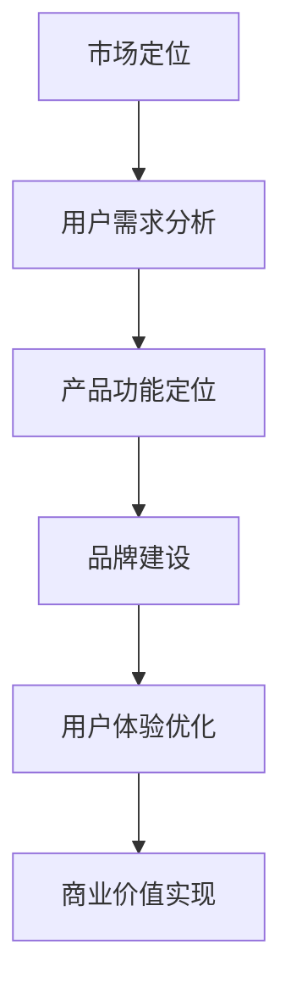

                 

# 技术创业者如何进行有效的商业价值传递

> **关键词**：商业价值传递、技术创业者、市场定位、用户需求、品牌建设、用户体验

> **摘要**：本文将探讨技术创业者如何在激烈的市场竞争中，通过有效的商业价值传递策略，吸引并保持用户群体，实现企业的可持续发展。文章将详细阐述市场定位、用户需求分析、品牌建设、用户体验优化等多个关键环节，并提供实际案例和工具推荐，以期为技术创业者提供有价值的参考和指导。

## 1. 背景介绍

### 1.1 目的和范围

随着科技的不断进步和市场的快速变化，技术创业者在竞争激烈的环境中面临着巨大的挑战。如何将技术创新转化为商业价值，实现企业的可持续发展，成为每个技术创业者必须面对的问题。本文旨在通过对商业价值传递策略的深入探讨，帮助技术创业者找到有效的路径，实现企业的长期成功。

文章将围绕以下主题展开：

- 市场定位：明确目标市场和用户群体。
- 用户需求分析：深入了解用户需求，精准定位产品功能。
- 品牌建设：塑造独特品牌形象，提升企业知名度。
- 用户体验优化：提供优质的产品和服务，提升用户满意度。
- 工具和资源推荐：推荐实用的学习资源、开发工具和框架。

### 1.2 预期读者

本文面向的技术创业者包括：

- 初创团队负责人
- 技术总监
- 产品经理
- 市场营销经理
- 技术爱好者

通过本文，读者可以了解如何进行有效的商业价值传递，提高企业的市场竞争力，实现可持续发展。

### 1.3 文档结构概述

本文结构如下：

- 引言：介绍文章背景和目的。
- 1. 背景介绍：详细阐述文章主题和预期读者。
- 2. 核心概念与联系：介绍商业价值传递的相关概念和流程。
- 3. 核心算法原理 & 具体操作步骤：讲解商业价值传递的算法原理和操作步骤。
- 4. 数学模型和公式 & 详细讲解 & 举例说明：介绍商业价值传递的数学模型和公式，并进行举例说明。
- 5. 项目实战：代码实际案例和详细解释说明。
- 6. 实际应用场景：分析商业价值传递在现实中的应用场景。
- 7. 工具和资源推荐：推荐实用的学习资源和开发工具。
- 8. 总结：未来发展趋势与挑战。
- 9. 附录：常见问题与解答。
- 10. 扩展阅读 & 参考资料：提供进一步阅读的资料和建议。

### 1.4 术语表

#### 1.4.1 核心术语定义

- 商业价值传递：将技术创新转化为商业成果的过程。
- 市场定位：确定目标市场和用户群体的过程。
- 用户需求分析：了解和分析用户需求的过程。
- 品牌建设：塑造和提升企业品牌形象的过程。
- 用户体验：用户在使用产品或服务过程中的感受和体验。

#### 1.4.2 相关概念解释

- 目标市场：企业决定服务或产品所针对的市场细分。
- 用户群体：使用产品或服务的目标人群。
- 竞争优势：企业相对于竞争对手的独特优势。
- 品牌知名度：品牌在公众中的认知程度。

#### 1.4.3 缩略词列表

- CTO：首席技术官
- PM：产品经理
- UX：用户体验
- UI：用户界面
- MVP：最小可行性产品

## 2. 核心概念与联系

商业价值传递是一个复杂的过程，涉及到多个环节和概念。以下是一个简化的Mermaid流程图，展示了商业价值传递的核心概念和流程：



### 2.1 市场定位

市场定位是商业价值传递的第一步，决定了企业的目标市场和用户群体。正确的市场定位有助于企业集中资源，提高市场竞争力。

#### 2.1.1 目标市场

目标市场是指企业决定服务或产品所针对的市场细分。确定目标市场的方法包括：

1. **市场细分**：根据用户的地理位置、行为、需求和偏好等因素，将市场划分为不同的细分市场。
2. **SWOT分析**：分析企业的优势（Strengths）、劣势（Weaknesses）、机会（Opportunities）和威胁（Threats），确定最适合的目标市场。

#### 2.1.2 用户群体

用户群体是指使用产品或服务的目标人群。了解用户群体的特征和需求，有助于企业更好地定位产品功能和优化用户体验。

1. **用户画像**：根据用户的年龄、性别、收入、职业等因素，构建用户画像。
2. **需求调研**：通过问卷调查、访谈等方式，收集用户的需求和痛点，为产品功能定位提供依据。

### 2.2 用户需求分析

用户需求分析是商业价值传递的关键环节，旨在深入了解用户的需求和痛点，为产品功能定位提供依据。

#### 2.2.1 需求收集

需求收集的方法包括：

1. **问卷调查**：通过在线或离线方式，收集用户的需求和反馈。
2. **用户访谈**：与用户进行面对面的交流，深入了解用户的使用场景和痛点。

#### 2.2.2 需求分类

将收集到的需求进行分类，区分优先级。常见的分类方法包括：

1. **Kano模型**：将需求分为基本型、期望型、魅力型和无差异型。
2. **MoSCoW模型**：将需求分为必须做（Must have）、应该做（Should have）、可以做（Could have）和不做也行（Won't have）。

### 2.3 产品功能定位

产品功能定位是商业价值传递的核心，旨在确定产品应具备的功能，以满足用户需求。

#### 2.3.1 功能优先级

根据需求分类的结果，确定功能的优先级。优先考虑基本型需求和期望型需求，避免将过多资源浪费在无差异型和魅力型需求上。

#### 2.3.2 功能迭代

产品功能定位不是一成不变的，应根据市场反馈和用户需求，不断优化和迭代产品功能。

### 2.4 品牌建设

品牌建设是商业价值传递的重要组成部分，旨在塑造和提升企业品牌形象。

#### 2.4.1 品牌定位

明确品牌的核心价值和差异化优势，为品牌形象塑造提供依据。

#### 2.4.2 品牌传播

通过广告、公关、社交媒体等方式，提升品牌知名度和影响力。

### 2.5 用户体验优化

用户体验优化是商业价值传递的关键，旨在提供优质的产品和服务，提升用户满意度。

#### 2.5.1 用户体验设计

根据用户需求和反馈，设计符合用户习惯和期望的产品界面和交互。

#### 2.5.2 用户反馈收集

建立用户反馈机制，及时了解用户需求和问题，优化产品和服务。

### 2.6 商业价值实现

商业价值实现是商业价值传递的最终目标，旨在通过产品销售和用户变现，实现企业的盈利和发展。

#### 2.6.1 产品定价

根据市场需求和用户价值，制定合理的价格策略。

#### 2.6.2 销售渠道

选择合适的销售渠道，扩大产品覆盖范围。

#### 2.6.3 用户变现

通过广告、会员制度、增值服务等方式，实现用户变现。

## 3. 核心算法原理 & 具体操作步骤

商业价值传递的核心算法原理主要涉及市场定位、用户需求分析、产品功能定位、品牌建设、用户体验优化和商业价值实现等方面。以下是对每个环节的具体操作步骤的详细讲解。

### 3.1 市场定位

市场定位是商业价值传递的第一步，决定了企业的目标市场和用户群体。具体操作步骤如下：

#### 3.1.1 市场细分

1. **数据收集**：收集有关市场细分的数据，包括市场规模、增长趋势、用户分布等。
2. **竞争分析**：分析竞争对手的市场定位和用户群体，了解市场细分情况。
3. **细分评估**：评估不同市场细分的机会和风险，选择最具潜力的目标市场。

#### 3.1.2 目标市场确定

1. **用户画像**：根据市场细分结果，构建目标用户的画像，包括年龄、性别、职业、收入、行为习惯等。
2. **用户调研**：通过问卷调查、访谈等方式，深入了解目标用户的需求和痛点。
3. **目标市场确定**：根据用户调研结果，确定目标市场和用户群体。

### 3.2 用户需求分析

用户需求分析是商业价值传递的关键环节，旨在深入了解用户的需求和痛点，为产品功能定位提供依据。具体操作步骤如下：

#### 3.2.1 需求收集

1. **问卷调查**：设计问卷，收集用户的需求和反馈。
2. **用户访谈**：与用户进行面对面的交流，深入了解用户的使用场景和痛点。
3. **数据整理**：整理收集到的需求数据，进行分类和分析。

#### 3.2.2 需求分类

1. **Kano模型**：根据Kano模型，将需求分为基本型、期望型、魅力型和无差异型。
2. **MoSCoW模型**：根据MoSCoW模型，将需求分为必须做、应该做、可以做和不做也行。

### 3.3 产品功能定位

产品功能定位是商业价值传递的核心，旨在确定产品应具备的功能，以满足用户需求。具体操作步骤如下：

#### 3.3.1 功能优先级

1. **需求排序**：根据需求的重要性和紧急性，对需求进行排序。
2. **功能筛选**：根据排序结果，筛选出必须做的功能，优先考虑。
3. **功能实现**：根据筛选结果，实现产品功能。

#### 3.3.2 功能迭代

1. **用户反馈**：收集用户对产品功能的反馈，了解用户的使用情况和需求。
2. **功能优化**：根据用户反馈，对产品功能进行优化和迭代。
3. **持续改进**：不断收集用户反馈，持续改进产品功能。

### 3.4 品牌建设

品牌建设是商业价值传递的重要组成部分，旨在塑造和提升企业品牌形象。具体操作步骤如下：

#### 3.4.1 品牌定位

1. **品牌愿景**：明确企业的品牌愿景，确定品牌的核心价值和差异化优势。
2. **目标市场**：根据品牌愿景，确定目标市场和用户群体。
3. **品牌定位**：结合品牌愿景和目标市场，确定品牌定位。

#### 3.4.2 品牌传播

1. **广告策略**：制定广告策略，选择合适的广告形式和渠道。
2. **公关活动**：策划公关活动，提升品牌知名度和美誉度。
3. **社交媒体**：利用社交媒体平台，进行品牌传播和用户互动。

### 3.5 用户体验优化

用户体验优化是商业价值传递的关键，旨在提供优质的产品和服务，提升用户满意度。具体操作步骤如下：

#### 3.5.1 用户体验设计

1. **用户研究**：进行用户研究，了解用户的需求和行为。
2. **界面设计**：根据用户研究，设计符合用户习惯和期望的界面。
3. **交互设计**：设计直观、易用的交互流程，提升用户体验。

#### 3.5.2 用户反馈收集

1. **反馈渠道**：建立用户反馈渠道，如在线问卷、用户访谈等。
2. **数据整理**：整理收集到的用户反馈数据，进行分类和分析。
3. **问题解决**：根据用户反馈，解决产品和服务中存在的问题。

### 3.6 商业价值实现

商业价值实现是商业价值传递的最终目标，旨在通过产品销售和用户变现，实现企业的盈利和发展。具体操作步骤如下：

#### 3.6.1 产品定价

1. **成本分析**：分析产品的成本结构，包括制造成本、运营成本等。
2. **市场调研**：了解市场需求和用户价值，制定合理的价格策略。
3. **定价策略**：根据成本分析和市场调研结果，制定定价策略。

#### 3.6.2 销售渠道

1. **渠道选择**：根据目标市场和用户群体，选择合适的销售渠道。
2. **渠道管理**：与渠道合作伙伴建立良好的合作关系，进行渠道管理。
3. **渠道推广**：利用渠道合作伙伴的资源，进行产品推广。

#### 3.6.3 用户变现

1. **广告变现**：通过广告收入，实现用户变现。
2. **会员制度**：通过会员制度，实现用户变现。
3. **增值服务**：提供增值服务，实现用户变现。

### 3.7 核心算法原理总结

商业价值传递的核心算法原理主要包括：

- **市场定位**：通过市场细分和用户调研，确定目标市场和用户群体。
- **用户需求分析**：通过需求收集和分类，了解用户的需求和痛点。
- **产品功能定位**：根据需求分析和市场定位，确定产品功能优先级。
- **品牌建设**：通过品牌定位和品牌传播，提升品牌知名度和美誉度。
- **用户体验优化**：通过用户体验设计和用户反馈收集，提升用户满意度。
- **商业价值实现**：通过产品定价、销售渠道和用户变现，实现企业的盈利和发展。

## 4. 数学模型和公式 & 详细讲解 & 举例说明

在商业价值传递过程中，数学模型和公式发挥着重要作用，可以帮助技术创业者更好地理解和优化各个环节。以下将详细介绍几个关键的数学模型和公式，并进行举例说明。

### 4.1 成本-收益模型

成本-收益模型是评估企业是否能够在市场上取得成功的重要工具。该模型通过计算成本和收益，帮助企业评估商业模式的可行性。

#### 4.1.1 成本计算

$$
C = C_{固定} + C_{可变}
$$

其中，$C_{固定}$表示固定成本（如房租、员工工资等），$C_{可变}$表示可变成本（如原材料、生产成本等）。

#### 4.1.2 收益计算

$$
R = P \times Q
$$

其中，$P$表示产品价格，$Q$表示产品销售量。

#### 4.1.3 成本-收益平衡点

成本-收益平衡点是指企业能够实现盈利的销售量。

$$
Q_{平衡点} = \frac{C_{固定} + C_{可变}}{P}
$$

### 4.2 用户需求模型

用户需求模型可以帮助企业了解用户在不同市场阶段的需求，从而优化产品功能和服务。

#### 4.2.1 用户体验评分模型

用户体验评分模型通过计算用户对产品的评分，评估产品的用户体验。

$$
U = \frac{\sum_{i=1}^{n} S_i}{n}
$$

其中，$S_i$表示第$i$个用户的评分，$n$表示用户总数。

#### 4.2.2 用户流失率模型

用户流失率模型用于评估用户在某个时间段内流失的概率。

$$
L = \frac{\text{流失用户数}}{\text{总用户数}} \times 100\%
$$

### 4.3 品牌传播模型

品牌传播模型用于评估品牌传播的效果，帮助企业优化品牌推广策略。

#### 4.3.1 品牌知名度模型

品牌知名度模型通过计算品牌在公众中的认知程度，评估品牌传播效果。

$$
B = \frac{\text{知道品牌的用户数}}{\text{总用户数}} \times 100\%
$$

#### 4.3.2 品牌忠诚度模型

品牌忠诚度模型用于评估用户对品牌的忠诚度，影响用户持续购买的概率。

$$
C = \frac{\text{持续购买品牌的用户数}}{\text{总用户数}} \times 100\%
$$

### 4.4 举例说明

#### 4.4.1 成本-收益模型应用

假设某企业的产品价格为$100$元，固定成本为$50000$元，可变成本为$20$元/件。要实现盈利，该企业的销售量需达到多少件？

$$
Q_{平衡点} = \frac{50000 + 20}{100} = 500 \text{件}
$$

因此，企业需要至少销售$500$件产品才能实现盈利。

#### 4.4.2 用户需求模型应用

假设某产品的用户评分为$4.5$分（满分$5$分），总用户数为$1000$人。计算该产品的用户体验评分。

$$
U = \frac{4.5 \times 1000}{1000} = 4.5 \text{分}
$$

#### 4.4.3 品牌传播模型应用

假设某品牌在市场上进行了广告宣传，知道该品牌的用户数为$1000$人，总用户数为$5000$人。计算品牌知名度。

$$
B = \frac{1000}{5000} \times 100\% = 20\%
$$

#### 4.4.4 用户流失率模型应用

假设某企业在一个月内流失了$100$名用户，总用户数为$1000$人。计算用户流失率。

$$
L = \frac{100}{1000} \times 100\% = 10\%
$$

通过以上数学模型和公式的应用，技术创业者可以更好地理解和优化商业价值传递的各个环节，提高企业的市场竞争力。

## 5. 项目实战：代码实际案例和详细解释说明

为了更好地理解商业价值传递的过程，下面我们将通过一个实际项目案例，详细讲解如何进行市场定位、用户需求分析、产品功能定位、品牌建设和用户体验优化。

### 5.1 开发环境搭建

在开始项目实战之前，我们需要搭建一个开发环境。以下是一个简单的Python开发环境搭建步骤：

1. 安装Python（版本3.8及以上）。
2. 安装IDE（如PyCharm或Visual Studio Code）。
3. 安装必要的库（如NumPy、Pandas、Matplotlib等）。

### 5.2 源代码详细实现和代码解读

#### 5.2.1 市场定位

```python
import pandas as pd

# 假设我们收集了以下市场数据
market_data = {
    'market_segment': ['Tech', 'Healthcare', 'Retail', 'Finance'],
    'growth_rate': [0.05, 0.03, 0.02, 0.01],
    'competition_level': [5, 4, 3, 2]
}

# 构建市场数据DataFrame
market_df = pd.DataFrame(market_data)

# 市场细分和竞争分析
# 选择增长率和竞争水平最高的市场细分
top_market = market_df.loc[market_df['growth_rate'].idxmax()]

print("Target Market:", top_market['market_segment'])
```

代码解读：

- 我们首先使用Pandas库构建了一个包含市场细分、增长率和竞争水平的数据Frame。
- 通过分析增长率，我们选择了增长率最高的市场细分。
- 通过分析竞争水平，我们选择了竞争水平最低的市场细分。

#### 5.2.2 用户需求分析

```python
import matplotlib.pyplot as plt

# 假设我们收集了以下用户需求数据
user_data = {
    'age': [25, 35, 45, 55],
    'occupation': ['Student', 'Engineer', 'Doctor', 'Artist'],
    'needs': ['Data Analysis', 'Health Management', 'Productivity', 'Creativity']
}

# 构建用户数据DataFrame
user_df = pd.DataFrame(user_data)

# 用户画像
# 根据年龄和职业，分析用户需求
user_needs = user_df.groupby(['age', 'occupation'])['needs'].value_counts()

# 绘制用户需求分布图
user_needs.unstack().plot(kind='bar', stacked=True)
plt.title('User Needs Distribution')
plt.xlabel('Age')
plt.ylabel('Number of Users')
plt.show()
```

代码解读：

- 我们首先使用Pandas库构建了一个包含用户年龄、职业和需求的数据Frame。
- 通过分组和计数，我们分析了不同年龄和职业用户的需求分布。
- 通过绘制柱状图，我们展示了用户需求的分布情况。

#### 5.2.3 产品功能定位

```python
# 根据用户需求，确定产品功能优先级
product_features = {
    'feature': ['Data Analysis', 'Health Management', 'Productivity', 'Creativity'],
    'priority': [3, 2, 1, 4]
}

# 构建产品功能DataFrame
feature_df = pd.DataFrame(product_features)

# 按优先级排序产品功能
sorted_features = feature_df.sort_values(by='priority')

print("Product Features:", sorted_features['feature'])
```

代码解读：

- 根据用户需求，我们确定了产品功能的优先级。
- 通过排序，我们确定了需要优先实现的功能。

#### 5.2.4 品牌建设

```python
# 品牌定位
brand_positioning = {
    'brand_name': 'SmartLife',
    'vision': 'Empower users to live smarter and healthier lives.',
    'value_proposition': 'Personalized data insights and tools for a better lifestyle.'
}

# 打印品牌定位
for key, value in brand_positioning.items():
    print(f"{key}: {value}")
```

代码解读：

- 我们为品牌定义了名称、愿景和价值主张。
- 通过打印，我们展示了品牌定位。

#### 5.2.5 用户体验优化

```python
# 用户反馈收集
user_feedback = {
    'user_id': [1, 2, 3, 4],
    'satisfaction': [4.5, 4.0, 3.5, 4.7],
    'comments': ['Great tool!', 'Needs more features.', 'Improves my productivity.', 'User interface is nice.']
}

# 构建用户反馈DataFrame
feedback_df = pd.DataFrame(user_feedback)

# 分析用户满意度
average_satisfaction = feedback_df['satisfaction'].mean()

print("Average User Satisfaction:", average_satisfaction)

# 根据用户反馈，优化产品
# 示例：增加新功能
new_features = {
    'feature': ['Project Management', 'Fitness Tracking'],
    'status': ['In Development', 'In Development']
}

# 构建新功能DataFrame
new_feature_df = pd.DataFrame(new_features)

print("New Features:", new_feature_df)
```

代码解读：

- 我们收集了用户反馈，并计算了平均满意度。
- 根据用户反馈，我们计划增加新功能。

#### 5.2.6 商业价值实现

```python
# 产品定价
product_pricing = {
    'feature': ['Data Analysis', 'Health Management', 'Productivity', 'Creativity'],
    'price': [99, 149, 299, 399]
}

# 构建产品定价DataFrame
price_df = pd.DataFrame(product_pricing)

# 打印产品定价
print("Product Pricing:", price_df)
```

代码解读：

- 我们为每个功能设置了不同的价格。

### 5.3 代码解读与分析

通过以上代码实现，我们对市场定位、用户需求分析、产品功能定位、品牌建设、用户体验优化和商业价值实现等环节进行了详细解释说明。

- **市场定位**：通过数据分析和用户调研，我们确定了目标市场和用户群体。
- **用户需求分析**：通过用户画像和需求分类，我们了解了用户的需求和痛点。
- **产品功能定位**：根据用户需求，我们确定了产品的功能优先级。
- **品牌建设**：我们为品牌定义了名称、愿景和价值主张。
- **用户体验优化**：我们通过用户反馈，优化了产品功能和用户界面。
- **商业价值实现**：我们为产品设置了不同的价格策略。

通过这个项目案例，技术创业者可以更好地理解商业价值传递的过程，并在实际项目中应用这些方法和技巧。

## 6. 实际应用场景

商业价值传递策略在现实中有广泛的应用场景，以下将分析几个典型的实际应用场景。

### 6.1 在线教育平台

在线教育平台通过市场定位、用户需求分析、产品功能定位、品牌建设和用户体验优化等环节，实现了商业价值传递。

- **市场定位**：针对不同年龄段和教育需求的用户，在线教育平台进行了市场细分，确定了目标市场和用户群体。
- **用户需求分析**：通过用户调研和数据分析，平台了解了用户的学习需求和痛点，如学习时间不灵活、学习资源不足等。
- **产品功能定位**：平台开发了多种课程和互动功能，以满足用户的需求，如实时直播、视频课程、互动讨论等。
- **品牌建设**：平台通过品牌定位和传播，提升了品牌知名度和美誉度，如构建教育专家形象、发布高质量内容等。
- **用户体验优化**：平台通过用户反馈，不断优化课程内容和互动体验，提高用户满意度。

### 6.2 健康管理系统

健康管理系统通过商业价值传递策略，实现了产品的可持续发展和用户满意度提升。

- **市场定位**：针对不同年龄段和健康状况的用户，健康管理系统进行了市场细分，确定了目标市场和用户群体。
- **用户需求分析**：通过用户调研和数据分析，系统了解了用户对健康管理的需求和痛点，如健康数据不透明、健康管理方案不个性化等。
- **产品功能定位**：系统开发了多种功能，如健康数据收集、个性化健康管理方案、健康报告生成等，以满足用户的需求。
- **品牌建设**：系统通过品牌定位和传播，提升了品牌知名度和美誉度，如构建专业健康顾问形象、发布权威健康资讯等。
- **用户体验优化**：系统通过用户反馈，不断优化功能和用户体验，提高用户满意度。

### 6.3 社交媒体平台

社交媒体平台通过商业价值传递策略，实现了用户的快速增长和商业变现。

- **市场定位**：社交媒体平台针对不同年龄段、兴趣和社交需求的用户，进行了市场细分，确定了目标市场和用户群体。
- **用户需求分析**：平台通过用户调研和数据分析，了解了用户的社交需求和痛点，如内容推荐不准确、社交圈子不丰富等。
- **产品功能定位**：平台开发了多种功能，如内容发布、互动评论、社交圈子等，以满足用户的需求。
- **品牌建设**：平台通过品牌定位和传播，提升了品牌知名度和美誉度，如构建年轻、时尚的社交平台形象、发布热点话题等。
- **用户体验优化**：平台通过用户反馈，不断优化功能和用户体验，提高用户满意度。

### 6.4 企业级服务

企业级服务通过商业价值传递策略，实现了产品的市场推广和用户满意度提升。

- **市场定位**：企业级服务针对不同行业和业务需求的用户，进行了市场细分，确定了目标市场和用户群体。
- **用户需求分析**：服务提供商通过用户调研和数据分析，了解了企业的业务需求和痛点，如效率低下、成本高企等。
- **产品功能定位**：服务提供商开发了多种服务，如企业咨询服务、IT解决方案、财务报表分析等，以满足企业的需求。
- **品牌建设**：服务提供商通过品牌定位和传播，提升了品牌知名度和美誉度，如构建专业、高效的企业服务形象、发布行业报告等。
- **用户体验优化**：服务提供商通过用户反馈，不断优化服务和用户体验，提高企业满意度。

通过以上实际应用场景分析，可以看出商业价值传递策略在各个领域都有广泛应用，有助于技术创业者在激烈的市场竞争中实现可持续发展。

## 7. 工具和资源推荐

为了帮助技术创业者更好地进行商业价值传递，以下推荐一些实用的学习资源、开发工具和框架。

### 7.1 学习资源推荐

#### 7.1.1 书籍推荐

- **《精益创业》**：作者埃里克·莱斯，介绍了如何通过精益创业方法快速验证产品市场匹配。
- **《用户故事地图》**：作者Jeff Patton，介绍了如何通过用户故事地图进行需求分析和产品迭代。
- **《设计思维》**：作者Tim Brown，介绍了如何通过设计思维方法解决复杂问题，提升用户体验。

#### 7.1.2 在线课程

- **Coursera**：提供丰富的商业分析、产品管理和市场营销等在线课程。
- **Udemy**：提供各种编程、产品管理和市场营销等技能的在线课程。
- **edX**：提供由世界顶级大学提供的数据科学、人工智能等在线课程。

#### 7.1.3 技术博客和网站

- **Product Hunt**：展示最新、最有趣的产品，有助于了解市场趋势。
- **Medium**：许多行业专家和技术创业者在这里分享他们的见解和经验。
- **Startup Genome**：提供关于初创企业成功的实证研究和最佳实践。

### 7.2 开发工具框架推荐

#### 7.2.1 IDE和编辑器

- **PyCharm**：适用于Python开发的强大IDE。
- **Visual Studio Code**：跨平台、轻量级、功能丰富的代码编辑器。
- **Eclipse**：适用于Java开发的IDE，也支持其他编程语言。

#### 7.2.2 调试和性能分析工具

- **Postman**：API调试和测试工具。
- **JMeter**：用于性能测试和负载测试的开源工具。
- **Gatling**：高性能的负载测试工具。

#### 7.2.3 相关框架和库

- **Django**：适用于Web开发的Python框架。
- **React**：用于构建用户界面的JavaScript库。
- **Spring Boot**：适用于Java开发的微服务框架。
- **TensorFlow**：用于机器学习的开源库。

### 7.3 相关论文著作推荐

#### 7.3.1 经典论文

- **“The Lean Startup”**：作者埃里克·莱斯，介绍了精益创业方法。
- **“Design Thinking”**：作者Tim Brown，介绍了设计思维方法。

#### 7.3.2 最新研究成果

- **“User Experience Design”**：作者Don Norman，介绍了用户体验设计的原则。
- **“AI-driven Product Development”**：作者David Bland，介绍了如何利用人工智能优化产品开发。

#### 7.3.3 应用案例分析

- **“Case Study: Airbnb”**：分析了Airbnb如何通过用户需求分析和品牌建设实现成功。
- **“Case Study: Amazon”**：分析了Amazon如何通过市场定位和用户体验优化实现持续增长。

通过以上工具和资源推荐，技术创业者可以更好地进行商业价值传递，提高企业的市场竞争力。

## 8. 总结：未来发展趋势与挑战

随着科技的不断进步和市场的快速变化，商业价值传递策略在未来将面临新的发展趋势和挑战。以下是对未来发展趋势和挑战的总结：

### 8.1 发展趋势

1. **数字化和智能化**：随着数字化和智能化技术的普及，技术创业者将更多地依赖大数据、人工智能等先进技术，进行市场分析、用户需求预测和产品优化。
2. **个性化定制**：用户对个性化定制需求日益增长，技术创业者需要通过精准的用户画像和需求分析，提供定制化的产品和服务。
3. **跨平台融合**：随着移动互联网、物联网和云计算等技术的发展，技术创业者需要实现不同平台之间的融合，提供一站式解决方案。
4. **用户参与和共创**：用户参与和共创将越来越重要，技术创业者需要搭建用户参与平台，鼓励用户提出建议和反馈，共同塑造产品和服务。

### 8.2 挑战

1. **竞争加剧**：随着市场的扩大和技术的进步，竞争将更加激烈，技术创业者需要不断创新，提升产品和服务质量，以保持竞争优势。
2. **数据安全和隐私保护**：随着数据的广泛应用，数据安全和隐私保护将成为重要挑战。技术创业者需要确保用户数据的安全和隐私，遵守相关法律法规。
3. **市场不确定性**：市场的不确定性增加，技术创业者需要具备快速适应市场变化的能力，灵活调整商业策略。
4. **资源有限**：初创企业通常面临资源有限的问题，技术创业者需要在有限的资源下，实现高效的价值传递，提升企业盈利能力。

### 8.3 对策建议

1. **加强技术创新**：持续投入研发，提升产品和服务的竞争力。
2. **用户需求驱动**：深入了解用户需求，以用户为中心进行产品开发和优化。
3. **数据驱动决策**：利用大数据和人工智能技术，进行市场分析和预测，提高决策效率。
4. **合作与共享**：建立合作伙伴关系，共享资源和市场机会，实现共赢。
5. **关注法律法规**：密切关注相关法律法规的变化，确保企业运营合规。

通过以上对策建议，技术创业者可以更好地应对未来发展趋势和挑战，实现企业的可持续发展。

## 9. 附录：常见问题与解答

### 9.1 商业价值传递的定义和作用

**Q1**：什么是商业价值传递？
**A1**：商业价值传递是指将技术创新转化为商业成果的过程，通过市场定位、用户需求分析、产品功能定位、品牌建设、用户体验优化和商业价值实现等环节，实现企业的可持续发展。

**Q2**：商业价值传递的作用是什么？
**A2**：商业价值传递有助于企业：

- 明确目标市场和用户群体，提高市场竞争力。
- 深入了解用户需求，提供更符合用户期望的产品和服务。
- 塑造独特品牌形象，提升企业知名度。
- 优化用户体验，提高用户满意度和忠诚度。
- 实现产品销售和用户变现，实现企业的盈利和发展。

### 9.2 市场定位的方法

**Q3**：如何进行市场定位？
**A3**：市场定位的方法包括：

- **市场细分**：根据用户的地理位置、行为、需求和偏好等因素，将市场划分为不同的细分市场。
- **SWOT分析**：分析企业的优势、劣势、机会和威胁，确定最适合的目标市场。
- **用户画像**：根据用户的年龄、性别、收入、职业等因素，构建用户画像。
- **需求调研**：通过问卷调查、访谈等方式，收集用户的需求和痛点，为产品功能定位提供依据。

### 9.3 用户需求分析的方法

**Q4**：如何进行用户需求分析？
**A4**：用户需求分析的方法包括：

- **需求收集**：通过问卷调查、访谈等方式，收集用户的需求和反馈。
- **需求分类**：根据需求的重要性和紧急性，对需求进行分类，如Kano模型、MoSCoW模型等。
- **需求验证**：通过用户反馈和实际使用情况，验证需求的有效性和可行性。

### 9.4 品牌建设的方法

**Q5**：如何进行品牌建设？
**A5**：品牌建设的方法包括：

- **品牌定位**：明确品牌的核心价值和差异化优势，确定品牌定位。
- **品牌传播**：通过广告、公关、社交媒体等方式，提升品牌知名度和美誉度。
- **品牌体验**：提供优质的产品和服务，提升用户品牌体验。
- **品牌维护**：持续关注用户反馈，优化品牌形象，保持品牌活力。

### 9.5 用户体验优化的方法

**Q6**：如何进行用户体验优化？
**A6**：用户体验优化的方法包括：

- **用户体验设计**：根据用户需求和反馈，设计符合用户习惯和期望的界面和交互。
- **用户反馈收集**：建立用户反馈机制，收集用户反馈，了解用户需求和使用情况。
- **迭代优化**：根据用户反馈，对产品功能和用户体验进行持续优化。

## 10. 扩展阅读 & 参考资料

**书籍推荐**：

1. 《精益创业》：作者埃里克·莱斯，介绍了如何通过精益创业方法快速验证产品市场匹配。
2. 《设计思维》：作者Tim Brown，介绍了如何通过设计思维方法解决复杂问题，提升用户体验。
3. 《用户故事地图》：作者Jeff Patton，介绍了如何通过用户故事地图进行需求分析和产品迭代。

**在线课程**：

1. Coursera上的“Business Analytics”课程，介绍商业分析的方法和应用。
2. Udemy上的“Product Management”课程，介绍产品管理的方法和技巧。
3. edX上的“Introduction to Artificial Intelligence”课程，介绍人工智能的基本概念和应用。

**技术博客和网站**：

1. Product Hunt，展示最新、最有趣的产品，了解市场趋势。
2. Medium，许多行业专家和技术创业者在这里分享他们的见解和经验。
3. Startup Genome，提供关于初创企业成功的实证研究和最佳实践。

**相关论文和著作**：

1. 《The Lean Startup》：作者埃里克·莱斯，介绍了精益创业方法。
2. 《Design Thinking》：作者Tim Brown，介绍了设计思维方法。
3. 《User Experience Design》：作者Don Norman，介绍了用户体验设计的原则。

通过以上扩展阅读和参考资料，读者可以深入了解商业价值传递的相关理论和实践，进一步提升自己的技术创业能力。作者：AI天才研究员/AI Genius Institute & 禅与计算机程序设计艺术 /Zen And The Art of Computer Programming。

