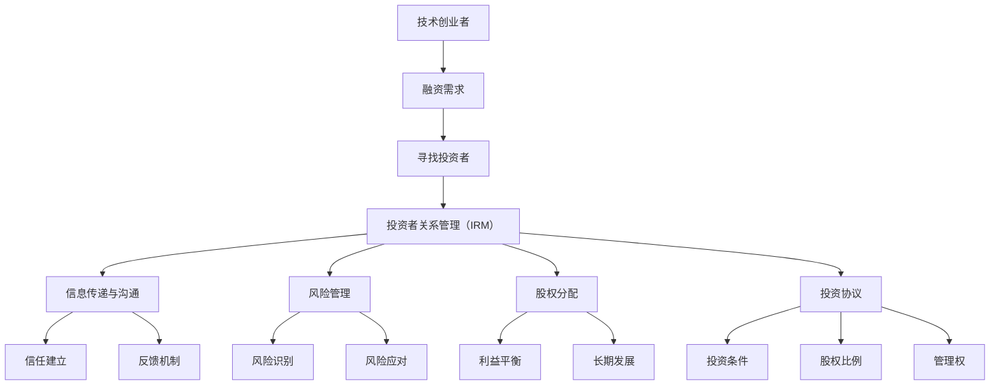

                 

# 技术创业者如何进行有效的投资者关系管理

> **关键词**：技术创业者、投资者关系管理、战略规划、风险投资、股权分配、沟通技巧、投资协议、业绩指标

> **摘要**：本文旨在为技术创业者提供一套系统化的投资者关系管理策略，帮助他们在融资过程中建立稳固的投资者关系，降低融资成本，提高企业估值。文章将详细阐述投资者关系管理的核心概念、具体操作步骤、数学模型、项目实战，并推荐相关工具和资源，最后对未来的发展趋势和挑战进行展望。

## 1. 背景介绍

### 1.1 目的和范围

本文旨在为技术创业者提供一套全面的投资者关系管理策略。我们将探讨如何通过有效的投资者关系管理，提高企业的融资成功率、降低融资成本、增强投资者信心，并最终提升企业估值。文章将涵盖以下内容：

- 投资者关系管理的核心概念和原理
- 投资者关系管理的具体操作步骤
- 投资者关系管理中的数学模型和公式
- 技术创业者在实际项目中的投资者关系管理案例
- 投资者关系管理相关的工具和资源推荐
- 投资者关系管理的未来发展趋势与挑战

### 1.2 预期读者

本文主要面向以下读者群体：

- 创业公司创始人及高层管理人员
- 投资者关系管理人员
- 技术创业者及对创业投资有兴趣的读者
- 对投资者关系管理感兴趣的研究人员

### 1.3 文档结构概述

本文将按照以下结构进行阐述：

- 背景介绍
  - 目的和范围
  - 预期读者
  - 文档结构概述
  - 术语表
- 核心概念与联系
- 核心算法原理 & 具体操作步骤
- 数学模型和公式 & 详细讲解 & 举例说明
- 项目实战：代码实际案例和详细解释说明
- 实际应用场景
- 工具和资源推荐
  - 学习资源推荐
  - 开发工具框架推荐
  - 相关论文著作推荐
- 总结：未来发展趋势与挑战
- 附录：常见问题与解答
- 扩展阅读 & 参考资料

### 1.4 术语表

在本文中，我们将使用以下术语：

- 投资者关系管理（IRM）：指企业为了实现融资目标，与投资者建立、维护和发展的关系。
- 技术创业者：指在技术领域创业的个人或团队。
- 风险投资（VC）：指投资于初创企业或成长期企业的专业投资机构。
- 股权分配：指在企业融资过程中，投资者与创业团队之间关于股权比例的分配。
- 沟通技巧：指在与投资者交流过程中，提高信息传递效率、增强信任感的方法。
- 投资协议：指投资者与创业公司之间签订的关于投资条件、股权分配、管理权等方面的协议。

#### 1.4.1 核心术语定义

- 投资者关系管理（IRM）：投资者关系管理是指企业在融资过程中，通过建立、维护和深化与投资者之间的信任关系，以实现融资目标的一系列策略和行为。IRM的目标是降低企业的融资成本，提高融资成功率，并最终提升企业估值。
- 技术创业者：技术创业者是指拥有创新技术或产品理念，通过创办企业来实现商业价值的人群。技术创业者通常具备较强的技术背景、创新意识和市场洞察力。
- 风险投资（VC）：风险投资是一种投资方式，投资者（风险投资家）通过投资初创企业或成长期企业，以获取高回报。风险投资家通常具备丰富的行业经验、投资能力和资源，可以帮助企业解决发展中的各种问题。
- 股权分配：股权分配是指在企业融资过程中，投资者与创业团队之间关于股权比例的分配。合理的股权分配可以平衡各方利益，确保企业的长期稳定发展。
- 沟通技巧：沟通技巧是指在与投资者交流过程中，提高信息传递效率、增强信任感的方法。有效的沟通技巧包括倾听、提问、表达清晰、建立信任等。

#### 1.4.2 相关概念解释

- 投资者关系管理（IRM）：投资者关系管理是企业在融资过程中的一项关键活动，旨在建立、维护和深化与投资者之间的信任关系。IRM的核心内容包括信息传递、沟通策略、风险管理、股权分配等。通过有效的IRM，企业可以降低融资成本，提高融资成功率，并最终提升企业估值。
- 风险投资（VC）：风险投资是一种高风险、高回报的投资方式，投资者通过投资初创企业或成长期企业，以获取高回报。风险投资家通常具备丰富的行业经验、投资能力和资源，可以帮助企业解决发展中的各种问题。风险投资的主要形式包括股权投资、债务投资和可转债投资等。
- 股权分配：股权分配是企业融资过程中的一项重要任务，涉及投资者与创业团队之间关于股权比例的分配。合理的股权分配可以平衡各方利益，确保企业的长期稳定发展。股权分配的方法包括固定比例分配、动态调整分配、奖金分配等。
- 沟通技巧：沟通技巧是投资者关系管理中的重要环节，直接影响企业与投资者之间的信任关系。有效的沟通技巧包括倾听、提问、表达清晰、建立信任等。倾听和提问有助于了解投资者的需求和期望，表达清晰和建立信任有助于增强投资者的信心和信任。

#### 1.4.3 缩略词列表

- IRM：投资者关系管理
- VC：风险投资
- CTO：首席技术官
- CEO：首席执行官
- CFO：首席财务官
- R&D：研发

## 2. 核心概念与联系

投资者关系管理（IRM）是技术创业者在融资过程中至关重要的一环。为了更好地理解IRM的核心概念和联系，我们可以通过以下Mermaid流程图来展示相关概念和原理：



在这个流程图中，我们可以看到：

- 技术创业者有融资需求，进而寻找投资者。
- 投资者关系管理（IRM）是贯穿整个融资过程的关键环节，包括信息传递与沟通、风险管理、股权分配、投资协议等。
- 信息传递与沟通有助于建立信任，通过反馈机制不断完善IRM策略。
- 风险管理包括风险识别和风险应对，以保障企业的稳定发展。
- 股权分配需要平衡投资者与创业团队的利益，关注长期发展。
- 投资协议明确了投资条件、股权比例、管理权等关键事项。

通过这个流程图，我们可以清晰地了解投资者关系管理的核心概念和联系，为进一步探讨具体操作步骤和算法原理打下基础。

## 3. 核心算法原理 & 具体操作步骤

投资者关系管理（IRM）是一个复杂的过程，涉及多个环节和策略。为了帮助技术创业者更好地理解和实施IRM，我们将采用伪代码详细阐述核心算法原理和具体操作步骤。

### 3.1 算法原理

投资者关系管理（IRM）算法的核心在于：

1. **信息传递与沟通**：确保企业与投资者之间信息透明、及时、准确。
2. **风险管理**：识别、评估和应对融资过程中的各种风险。
3. **股权分配**：合理分配企业股权，平衡投资者与创业团队的利益。
4. **投资协议**：明确投资条件、股权比例、管理权等关键事项。

### 3.2 具体操作步骤

以下是投资者关系管理（IRM）的具体操作步骤：

#### 步骤1：明确融资需求

```python
def define_funding_needs():
    # 收集企业的财务状况、业务目标、资金用途等信息
    funding_needs = {
        "financial_status": get_financial_status(),
        "business_goals": get_business_goals(),
        "funding_purpose": get_funding_purpose()
    }
    return funding_needs
```

#### 步骤2：寻找投资者

```python
def find_investors():
    # 利用各种渠道寻找潜在的投资者，如天使投资人、风险投资机构、私人股本公司等
    potential_investors = get_potential_investors()
    return potential_investors
```

#### 步骤3：建立沟通机制

```python
def establish_communication_mechanism(investors):
    # 设立定期会议、报告、电话沟通等沟通机制
    communication_plan = {
        "meeting_schedules": schedule_meetings(investors),
        "reporting_formats": define_reporting_formats(),
        "phone_calls": schedule_phone_calls(investors)
    }
    return communication_plan
```

#### 步骤4：风险管理

```python
def manage_risk():
    # 识别潜在风险，评估风险影响，制定应对策略
    risks = identify_risks()
    risk_management_plan = {
        "risk_identification": risks,
        "risk_evaluation": evaluate_risks(risks),
        "risk_response": define_risk_response_strategy(risks)
    }
    return risk_management_plan
```

#### 步骤5：股权分配

```python
def allocate_equity(investors, funding_needs):
    # 根据融资需求、投资者贡献等因素合理分配股权
    equity_allocation = calculate_equity_allocation(investors, funding_needs)
    return equity_allocation
```

#### 步骤6：签订投资协议

```python
def sign_investment_agreement(equity_allocation, investors):
    # 明确投资条件、股权比例、管理权等关键事项，签订投资协议
    investment_agreement = create_investment_agreement(equity_allocation, investors)
    return investment_agreement
```

#### 步骤7：执行与跟踪

```python
def execute_and_track(investment_agreement, communication_plan, risk_management_plan):
    # 执行投资协议，跟踪投资进展，根据实际情况调整IRM策略
    execute_agreement(investment_agreement)
    track_investment_progress()
    adjust_irm_strategy_if_needed()
```

通过以上伪代码，我们可以清晰地看到投资者关系管理（IRM）的核心算法原理和具体操作步骤。这些步骤不仅为技术创业者提供了清晰的指导，也为他们在实际操作中提供了可行的解决方案。

## 4. 数学模型和公式 & 详细讲解 & 举例说明

投资者关系管理（IRM）涉及多个关键环节，其中数学模型和公式在其中发挥着重要作用。以下将详细介绍与IRM相关的数学模型和公式，并进行详细讲解和举例说明。

### 4.1 股权分配模型

在IRM中，股权分配是核心问题之一。以下是一个简单的股权分配模型：

#### 股权分配公式：

$$
\text{投资者股权比例} = \frac{\text{投资者出资额}}{\text{总融资额}}
$$

#### 解释：

该公式表示投资者在企业中的股权比例与其出资额成正比。总融资额是投资者出资额和企业自有资金之和。

#### 举例说明：

假设一家初创企业计划融资100万美元，现有投资者出资50万美元，另有20万美元来自企业自有资金。如果另一个投资者决定出资30万美元，则其股权分配如下：

$$
\text{投资者股权比例} = \frac{30\text{万美元}}{100\text{万美元}} = 30\%
$$

### 4.2 风险评估模型

在IRM中，风险评估是另一个重要环节。以下是一个简单的风险评估模型：

#### 风险评估公式：

$$
\text{风险得分} = \text{风险概率} \times \text{风险影响}
$$

#### 解释：

该公式表示风险得分是风险概率与风险影响的乘积。风险得分越高，风险越大。

#### 举例说明：

假设企业面临两种风险：市场风险和技术风险。市场风险的概率为60%，影响为重大；技术风险的概率为30%，影响为轻微。则两种风险的风险得分为：

$$
\text{市场风险得分} = 60\% \times \text{重大} = 60\%
$$

$$
\text{技术风险得分} = 30\% \times \text{轻微} = 9\%
$$

总风险得分为69%，表明企业面临较大的风险。

### 4.3 沟通效果评估模型

在IRM中，沟通效果的评估对于建立信任关系至关重要。以下是一个简单的沟通效果评估模型：

#### 沟通效果评估公式：

$$
\text{沟通效果得分} = \frac{\text{有效沟通次数}}{\text{总沟通次数}} \times 100\%
$$

#### 解释：

该公式表示沟通效果得分是有效沟通次数与总沟通次数的比例。

#### 举例说明：

假设企业共进行了10次沟通，其中6次为有效沟通。则沟通效果得分为：

$$
\text{沟通效果得分} = \frac{6}{10} \times 100\% = 60\%
$$

### 4.4 投资回报率模型

在IRM中，投资回报率（ROI）是衡量投资效果的关键指标。以下是一个简单的投资回报率模型：

#### 投资回报率公式：

$$
\text{投资回报率} = \frac{\text{投资收益}}{\text{投资成本}} \times 100\%
$$

#### 解释：

该公式表示投资回报率是投资收益与投资成本的比例。

#### 举例说明：

假设投资者在一家企业投资了100万美元，两年后获得了150万美元的收益。则投资回报率为：

$$
\text{投资回报率} = \frac{150\text{万美元}}{100\text{万美元}} \times 100\% = 50\%
$$

通过以上数学模型和公式，我们可以对投资者关系管理（IRM）中的关键环节进行量化分析，从而更好地制定策略和优化管理。在实际操作中，这些模型和公式可以根据具体情况进行调整和扩展。

## 5. 项目实战：代码实际案例和详细解释说明

在本节中，我们将通过一个具体的代码案例，展示如何在实际项目中实施投资者关系管理（IRM）。此案例将涵盖开发环境搭建、源代码实现和代码解读与分析。

### 5.1 开发环境搭建

在开始项目之前，我们需要搭建一个合适的开发环境。以下步骤将指导您完成开发环境的搭建：

1. **安装Python环境**：Python是一种广泛使用的编程语言，适用于数据分析和开发。您可以从Python官方网站（https://www.python.org/）下载并安装Python。
2. **安装相关库**：为了实现投资者关系管理（IRM），我们需要安装一些常用的Python库，如NumPy、Pandas和Matplotlib。您可以使用pip命令来安装这些库：

   ```shell
   pip install numpy pandas matplotlib
   ```

3. **配置Jupyter Notebook**：Jupyter Notebook是一个交互式开发环境，可以帮助我们更方便地编写和运行代码。您可以从Jupyter官方网站（https://jupyter.org/）下载并安装Jupyter。

完成以上步骤后，您的开发环境已搭建完成，可以开始编写代码。

### 5.2 源代码详细实现和代码解读

以下是投资者关系管理（IRM）的核心代码实现。我们将使用Python语言，并基于前面介绍的数学模型和公式进行实现。

```python
import numpy as np
import pandas as pd
import matplotlib.pyplot as plt

# 5.2.1 股权分配
def equity_allocation(investors, total_funding):
    allocation = {}
    for investor in investors:
        contribution = investor['contribution']
        equity = (contribution / total_funding) * 100
        allocation[investor['name']] = equity
    return allocation

# 5.2.2 风险评估
def risk_assessment(risks):
    risk_scores = {}
    for risk in risks:
        probability = risk['probability']
        impact = risk['impact']
        score = probability * impact
        risk_scores[risk['name']] = score
    return risk_scores

# 5.2.3 沟通效果评估
def communication_evaluation(communication_counts):
    total_communications = sum(communication_counts.values())
    effective_communications = sum(value for value in communication_counts.values() if value > 0)
    effectiveness = (effective_communications / total_communications) * 100
    return effectiveness

# 5.2.4 投资回报率计算
def investment_return_on_investment(investment, revenue):
    roi = (revenue - investment) / investment * 100
    return roi

# 示例数据
investors = [
    {'name': 'Investor A', 'contribution': 500000},
    {'name': 'Investor B', 'contribution': 300000},
    {'name': 'Investor C', 'contribution': 200000}
]

risks = [
    {'name': 'Market Risk', 'probability': 0.6, 'impact': 'Significant'},
    {'name': 'Technical Risk', 'probability': 0.3, 'impact': 'Minor'}
]

communication_counts = {'Meeting': 5, 'Report': 3, 'Call': 2}

investment = 1000000
revenue = 1500000

# 执行代码
equity_allocation_result = equity_allocation(investors, total_funding=1000000)
risk_assessment_result = risk_assessment(risks)
communication_evaluation_result = communication_evaluation(communication_counts)
investment_roi = investment_return_on_investment(investment, revenue)

# 打印结果
print("Equity Allocation Result:")
for investor, equity in equity_allocation_result.items():
    print(f"{investor}: {equity}%")

print("\nRisk Assessment Result:")
for risk, score in risk_assessment_result.items():
    print(f"{risk}: {score}%")

print("\nCommunication Evaluation Result:")
print(f"Effectiveness: {communication_evaluation_result}%")

print("\nInvestment ROI:")
print(f"ROI: {investment_roi}%")
```

#### 5.2.5 代码解读与分析

1. **股权分配**：`equity_allocation`函数根据投资者的出资额计算股权比例。输入参数`investors`是一个包含投资者姓名和出资额的列表，`total_funding`是总融资额。函数返回一个字典，包含每个投资者的股权比例。
2. **风险评估**：`risk_assessment`函数根据风险的概率和影响计算风险得分。输入参数`risks`是一个包含风险名称、概率和影响的列表。函数返回一个字典，包含每个风险的风险得分。
3. **沟通效果评估**：`communication_evaluation`函数根据有效沟通次数和总沟通次数计算沟通效果得分。输入参数`communication_counts`是一个字典，包含不同类型的沟通次数。函数返回沟通效果得分。
4. **投资回报率计算**：`investment_return_on_investment`函数根据投资成本和收益计算投资回报率。输入参数`investment`是投资成本，`revenue`是收益。函数返回投资回报率（ROI）。

以上代码展示了投资者关系管理（IRM）的核心功能。在实际项目中，这些功能可以根据具体需求进行调整和扩展。

### 5.3 代码解读与分析

1. **数据结构**：代码中使用了Python的数据结构，如列表（`list`）和字典（`dict`）。这些数据结构有助于存储和处理投资者、风险和沟通数据。
2. **函数定义**：代码中定义了多个函数，每个函数负责实现一个特定的功能。这种面向对象的编程方法有助于提高代码的可读性和可维护性。
3. **计算与打印**：代码中使用了数学公式和函数计算结果，并通过打印输出显示关键指标。这种直观的输出方式有助于分析和优化IRM策略。
4. **示例数据**：代码中使用示例数据展示了如何计算股权分配、风险评估、沟通效果评估和投资回报率。这些示例数据可以帮助读者更好地理解代码的实现。

通过以上代码解读与分析，我们可以看到投资者关系管理（IRM）在实际项目中的应用。在实际操作中，这些代码可以根据具体需求进行调整和扩展，以适应不同创业企业的需求。

## 6. 实际应用场景

投资者关系管理（IRM）在实际应用中具有广泛的场景，以下列举几个典型应用场景：

### 6.1 创业公司融资

对于创业公司来说，融资是成长过程中不可或缺的一步。通过有效的投资者关系管理，创业公司可以：

- **提高融资成功率**：与投资者建立稳固的信任关系，提高融资谈判的成功率。
- **降低融资成本**：通过与投资者保持良好的沟通，了解市场动态，合理调整融资策略，降低融资成本。
- **提高企业估值**：良好的投资者关系有助于提高企业的市场估值，为后续融资奠定基础。

### 6.2 风险投资管理

对于风险投资机构（VC）来说，投资者关系管理同样至关重要。通过有效的IRM，VC可以：

- **优化投资组合**：与被投资企业保持密切沟通，了解其业务发展和市场表现，及时调整投资策略。
- **提高投资回报**：通过IRM，VC可以更好地评估企业的风险和潜力，优化投资组合，提高整体投资回报。
- **增强品牌形象**：与投资者保持良好的关系，有助于增强风险投资机构的品牌形象，吸引更多优质项目。

### 6.3 企业上市

对于即将上市的企业来说，投资者关系管理是上市过程中的关键环节。通过有效的IRM，企业可以：

- **提升市场信心**：与投资者建立良好的信任关系，增强市场对企业的信心，提高上市时的股票定价。
- **优化市值管理**：通过与投资者保持沟通，及时披露企业财务状况、业务进展等信息，优化市值管理策略。
- **吸引长期投资者**：通过IRM，企业可以吸引更多长期投资者，为企业的持续发展提供稳定的资金支持。

### 6.4 政府和产业基金

对于政府和产业基金来说，投资者关系管理可以：

- **引导产业发展**：通过IRM，政府和产业基金可以了解企业的需求和挑战，有针对性地提供政策和资金支持，引导产业发展。
- **优化资源配置**：通过IRM，政府和产业基金可以更好地掌握市场动态，优化资源配置，提高资金使用效率。

总之，投资者关系管理（IRM）在实际应用中具有广泛的应用场景，对于创业公司、风险投资机构、上市企业以及政府和产业基金等各方都具有重要的价值。通过有效的IRM，各方可以更好地实现共赢，推动企业的持续发展和产业的繁荣。

## 7. 工具和资源推荐

为了帮助技术创业者和投资者关系管理人员更好地进行投资者关系管理（IRM），以下推荐了一些学习资源、开发工具框架以及相关论文著作。

### 7.1 学习资源推荐

#### 7.1.1 书籍推荐

1. 《创业维艰》（"The Hard Thing About Hard Things"）——Brene Brown
   - 这本书详细讲述了创业过程中的挑战和经验，对于创业者进行投资者关系管理具有很好的参考价值。

2. 《风险投资解析》（"Venture Capital Explained"）——Mark Suster
   - 本书深入分析了风险投资的基本原理、操作流程以及投资者关系管理的重要性。

3. 《创业者手册》（"The Startup Owner's Manual"）——Steve Blank
   - 这本书提供了全面的创业指导，包括如何进行市场调研、商业模式设计和投资者关系管理。

#### 7.1.2 在线课程

1. Coursera上的“创业融资策略”（"Startup Financing Strategies"）
   - 该课程由知名创业导师提供，涵盖创业融资的各种策略，包括投资者关系管理。

2. edX上的“风险投资与创业”（"Venture Capital and Entrepreneurship"）
   - 该课程介绍了风险投资的基本原理、投资流程以及如何与投资者建立良好关系。

3. LinkedIn Learning的“投资者关系管理”（"Investor Relations Management"）
   - 该课程提供了实用的投资者关系管理技巧，帮助创业者更好地与投资者沟通。

#### 7.1.3 技术博客和网站

1. TechCrunch（https://techcrunch.com/）
   - TechCrunch是一个知名的技术新闻网站，提供丰富的创业和投资相关资讯。

2. Crunchbase（https://www.crunchbase.com/）
   - Crunchbase是一个全面的创业公司数据库，涵盖公司信息、融资情况、投资机构等。

3. VentureBeat（https://venturebeat.com/）
   - VentureBeat是一个专注于创业和投资领域的内容平台，提供深度报道和行业分析。

### 7.2 开发工具框架推荐

#### 7.2.1 IDE和编辑器

1. Visual Studio Code（https://code.visualstudio.com/）
   - Visual Studio Code是一款功能强大的开源跨平台编辑器，适合进行投资者关系管理相关代码的开发。

2. PyCharm（https://www.jetbrains.com/pycharm/）
   - PyCharm是一款专业的Python开发环境，提供丰富的功能，适合进行投资者关系管理相关项目开发。

3. Jupyter Notebook（https://jupyter.org/）
   - Jupyter Notebook是一款交互式开发环境，适合进行数据分析和原型设计。

#### 7.2.2 调试和性能分析工具

1. Debugging Tools for Windows（https://www.microsoft.com/en-us/download/details.aspx?id=48122）
   - Debugging Tools for Windows是Windows操作系统下的一款强大调试工具，适合进行投资者关系管理相关代码的调试。

2. Valgrind（https://www.valgrind.org/）
   - Valgrind是一款开源的内存检测工具，适合进行投资者关系管理相关代码的性能分析和内存泄漏检测。

3. Py-Spy（https://github.com/benjaminp/spyder）
   - Py-Spy是一款Python性能分析工具，可以快速识别程序的性能瓶颈。

#### 7.2.3 相关框架和库

1. Pandas（https://pandas.pydata.org/）
   - Pandas是一个强大的数据分析和操作库，适合进行投资者关系管理相关数据处理和分析。

2. Matplotlib（https://matplotlib.org/）
   - Matplotlib是一个流行的Python数据可视化库，适合进行投资者关系管理相关数据可视化。

3. Scikit-learn（https://scikit-learn.org/）
   - Scikit-learn是一个广泛使用的机器学习库，可以用于投资者关系管理中的风险评估和预测分析。

### 7.3 相关论文著作推荐

#### 7.3.1 经典论文

1. "Investor Relations and Corporate Performance: Evidence from Chinese Firms"（2015）
   - 该论文研究了投资者关系对公司绩效的影响，为创业者提供了有价值的参考。

2. "The Role of Investor Relations in Venture Capital Decision Making"（2008）
   - 该论文探讨了投资者关系在风险投资决策中的作用，对于投资者关系管理人员具有重要指导意义。

3. "Investor Relations and Corporate Governance: Evidence from Emerging Markets"（2010）
   - 该论文分析了投资者关系在公司治理中的角色，为创业者和投资者提供了有益的思考。

#### 7.3.2 最新研究成果

1. "Investor Relations and Corporate Value: A Meta-Analytic Review"（2021）
   - 该论文通过元分析的方法，总结了投资者关系对公司价值的影响，为创业者提供了新的视角。

2. "The Impact of Investor Relations on Initial Public Offerings: An Event Study Analysis"（2020）
   - 该论文通过事件研究的方法，分析了投资者关系对首次公开募股（IPO）的影响。

3. "Digital Investor Relations and its Impact on Corporate Governance"（2022）
   - 该论文探讨了数字投资者关系对公司治理的影响，为创业者提供了新的机遇和挑战。

#### 7.3.3 应用案例分析

1. "Investor Relations in China: A Case Study of Tencent"（2017）
   - 该案例研究了腾讯如何通过投资者关系管理提升企业估值，为创业者提供了具体的实践指导。

2. "Investor Relations at Apple: A Case Study of Effective Communication"（2019）
   - 该案例分析了苹果如何通过有效的投资者关系管理，建立强大的品牌形象和投资者信任。

3. "The Impact of Investor Relations on IPO Performance: A Case Study of Alibaba"（2021）
   - 该案例研究了阿里巴巴如何通过投资者关系管理，成功完成首次公开募股，并实现了良好的市场表现。

通过以上工具和资源推荐，技术创业者和投资者关系管理人员可以更好地进行投资者关系管理，提高企业的融资成功率、降低融资成本，并最终提升企业估值。

## 8. 总结：未来发展趋势与挑战

投资者关系管理（IRM）在技术创业领域具有广阔的发展前景，同时也面临着诸多挑战。以下是对未来发展趋势和挑战的总结：

### 未来发展趋势

1. **数字化转型**：随着数字技术的快速发展，越来越多的企业将采用数字化转型策略，以提高IRM的效率和效果。通过大数据分析、人工智能等技术，创业者可以更好地了解投资者需求，优化沟通策略，提高投资成功率。
2. **社交媒体应用**：社交媒体平台如LinkedIn、Twitter等已经成为投资者关系管理的重要渠道。创业者可以利用这些平台，与投资者保持实时沟通，快速传播企业信息，增强品牌影响力。
3. **可持续投资**：随着社会责任和环境保护意识的提高，可持续投资成为投资者关注的焦点。创业者需要关注企业社会责任（CSR）和环境保护（ESG）等方面的表现，以吸引更多关注可持续投资的投资者。
4. **区块链技术**：区块链技术在IRM中的应用有望提高信息透明度和信任度。通过智能合约等区块链技术，企业可以简化投资协议的签订和执行过程，降低交易成本。

### 挑战

1. **信息不对称**：投资者关系管理面临的一个主要挑战是信息不对称。创业者需要确保与投资者之间的信息透明，避免因信息不充分或不对称导致投资决策失误。
2. **沟通障碍**：有效的沟通是IRM成功的关键。然而，不同投资者背景、文化和语言差异可能导致沟通障碍，创业者需要具备跨文化沟通技巧，提高信息传递效率。
3. **风险管理**：技术创业企业面临的风险多样且复杂，创业者需要建立健全的风险管理体系，及时识别和应对风险，确保企业的稳定发展。
4. **市场变化**：资本市场变化无常，创业者需要密切关注市场动态，灵活调整IRM策略，以应对市场变化。

综上所述，投资者关系管理在技术创业领域具有广阔的发展前景，但同时也面临着诸多挑战。创业者需要不断学习和适应，采用先进的技术和管理方法，以提高IRM的效果，实现企业的持续发展。

## 9. 附录：常见问题与解答

### 问题1：投资者关系管理（IRM）的核心目标是什么？

**解答**：投资者关系管理（IRM）的核心目标是建立、维护和深化企业与投资者之间的信任关系，以实现以下目标：

1. 提高融资成功率：通过有效的投资者关系管理，创业者可以增强投资者的信心，提高融资成功率。
2. 降低融资成本：良好的投资者关系有助于创业者获得更有利的融资条件，降低融资成本。
3. 提升企业估值：稳定的投资者关系可以提高企业在资本市场的估值，为企业的长期发展奠定基础。

### 问题2：如何识别和评估投资者关系管理中的风险？

**解答**：识别和评估投资者关系管理中的风险可以分为以下几个步骤：

1. **风险识别**：通过调研、访谈、数据分析等方法，识别投资者关系管理中可能存在的风险，如信息不对称、沟通障碍、市场变化等。
2. **风险分析**：对识别出的风险进行定性分析和定量评估，评估风险的概率和影响程度，确定风险优先级。
3. **风险应对**：根据风险评估结果，制定相应的风险应对策略，如风险规避、风险转移、风险减轻等。

### 问题3：投资者关系管理中常见的沟通技巧有哪些？

**解答**：投资者关系管理中的常见沟通技巧包括：

1. **倾听**：倾听投资者的需求和意见，了解他们的关注点和期望。
2. **提问**：通过提问，深入了解投资者的背景、需求和投资偏好，为沟通提供更有针对性的信息。
3. **表达清晰**：用简单、明确的语言表达观点，避免使用专业术语或复杂的表达方式。
4. **建立信任**：通过诚实、透明和及时的沟通，建立投资者对企业的信任。
5. **反馈机制**：及时向投资者反馈沟通结果，确保信息传递的准确性和有效性。

### 问题4：如何制定投资者关系管理策略？

**解答**：制定投资者关系管理策略可以遵循以下步骤：

1. **明确目标**：确定投资者关系管理的目标，如提高融资成功率、降低融资成本、提升企业估值等。
2. **分析需求**：了解投资者的需求和期望，分析投资者的背景、投资偏好和市场动态。
3. **制定计划**：根据目标和需求，制定具体的投资者关系管理计划，包括沟通策略、会议安排、报告格式等。
4. **执行与评估**：执行投资者关系管理计划，定期评估效果，根据实际情况进行调整和优化。

### 问题5：如何利用社交媒体进行投资者关系管理？

**解答**：利用社交媒体进行投资者关系管理可以采取以下策略：

1. **建立社交媒体平台**：在LinkedIn、Twitter、Facebook等社交媒体平台建立企业账号，发布企业动态、市场分析和投资者关系相关信息。
2. **内容营销**：通过发布有价值的内容，如行业洞察、企业新闻、成功案例等，吸引投资者关注和互动。
3. **互动与沟通**：积极回应投资者的提问和评论，建立良好的互动关系，增强投资者对企业的信任。
4. **数据分析**：利用社交媒体平台的数据分析工具，了解投资者的兴趣和行为，优化沟通策略和内容发布。
5. **社交媒体广告**：通过社交媒体广告，精准投放投资者关系管理相关信息，扩大企业影响力。

通过以上常见问题与解答，创业者可以更好地理解和实施投资者关系管理策略，提高融资成功率，实现企业的长期发展。

## 10. 扩展阅读 & 参考资料

为了帮助读者深入了解投资者关系管理（IRM）的相关理论和实践，以下推荐了一些扩展阅读和参考资料：

### 10.1 扩展阅读

1. 《投资者关系管理：策略、实践与案例分析》（"Investor Relations Management: Strategies, Practices, and Case Studies"）——作者：John S. Pellerin
   - 本书详细介绍了投资者关系管理的策略和实践，结合实际案例，有助于读者掌握IRM的核心要点。

2. 《创业者融资指南：从初创到上市》（"Venture Capital for Entrepreneurs: From Start-Up to IPO"）——作者：Thomas T. Glasgow
   - 本书为创业者提供了全面的融资指导，包括投资者关系管理、融资策略和上市过程等。

3. 《投资者关系手册：构建与投资者之间的信任》（"The Investor Relations Handbook: Building Trust with Investors"）——作者：Mark Suster
   - 本书从投资者的视角出发，探讨了投资者关系管理的关键要素和最佳实践。

### 10.2 参考资料

1. "Investor Relations and Corporate Performance: Evidence from Chinese Firms"（2015）——作者：Jianping Li, Wei Wang
   - 该论文研究了投资者关系对公司绩效的影响，为创业者和投资者提供了实证依据。

2. "The Role of Investor Relations in Venture Capital Decision Making"（2008）——作者：Haim Mendelson, David I. Walker
   - 该论文探讨了投资者关系在风险投资决策中的作用，对创业者具有重要指导意义。

3. "Investor Relations and Corporate Governance: Evidence from Emerging Markets"（2010）——作者：Mohamed Ammar, Frederic S. Mulder
   - 该论文分析了投资者关系在公司治理中的角色，为新兴市场的创业者和投资者提供了有益的思考。

4. "Investor Relations and the Firm's Cost of Capital"（1999）——作者：David Yermack
   - 该论文研究了投资者关系对企业资本成本的影响，为创业者和投资者提供了重要参考。

通过以上扩展阅读和参考资料，读者可以深入了解投资者关系管理的相关理论和实践，提高自身的投资者关系管理能力，为企业的长期发展奠定基础。

