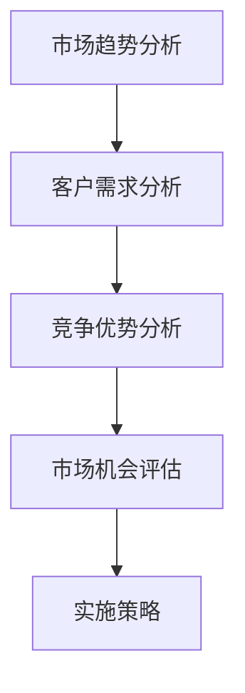
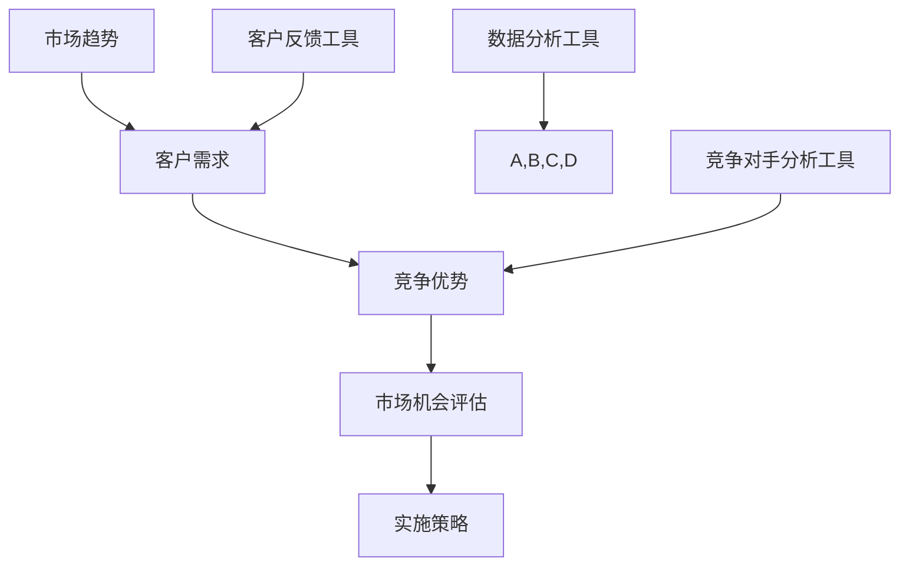

                 

# 技术创业者的商业洞察力：如何发现市场机会

> 关键词：商业洞察力、市场机会、技术创业者、战略规划、创新思维
> 
> 摘要：本文旨在探讨技术创业者如何运用商业洞察力来发现市场机会。通过分析市场趋势、识别客户需求、构建竞争优势，作者为技术创业者提供了一系列实用策略和思维工具，以助力其在竞争激烈的市场环境中脱颖而出。

## 1. 背景介绍

### 1.1 目的和范围

本文的主要目的是帮助技术创业者提升其商业洞察力，从而在市场中发现和把握机会。我们将从以下几个方面展开讨论：

1. **市场趋势分析**：探讨如何通过市场趋势识别潜在的机会。
2. **客户需求识别**：分析如何通过深入了解客户需求来发现市场空缺。
3. **竞争优势构建**：探讨如何通过创新和差异化策略来构建竞争优势。
4. **战略规划与实施**：提供具体的战略规划工具和方法，帮助创业者将洞察力转化为实际行动。

### 1.2 预期读者

本文适合以下几类读者：

- 初创技术公司的创始人或高级管理人员。
- 有意进入技术创业领域的专业人士。
- 对市场分析和商业策略有兴趣的技术爱好者。

### 1.3 文档结构概述

本文将分为以下几个部分：

- 引言：介绍文章主题和目的。
- 1. 背景介绍：详细说明文章的目的和结构。
- 2. 核心概念与联系：介绍市场机会识别的基本概念和联系。
- 3. 核心算法原理 & 具体操作步骤：阐述识别市场机会的算法原理和操作步骤。
- 4. 数学模型和公式 & 详细讲解 & 举例说明：使用数学模型和公式说明市场机会识别的方法。
- 5. 项目实战：提供实际案例和详细解释。
- 6. 实际应用场景：分析市场机会的应用场景。
- 7. 工具和资源推荐：推荐相关学习资源和开发工具。
- 8. 总结：展望市场机会识别的未来发展趋势与挑战。
- 9. 附录：常见问题与解答。
- 10. 扩展阅读 & 参考资料：提供进一步阅读的参考资料。

### 1.4 术语表

#### 1.4.1 核心术语定义

- 商业洞察力：指能够从复杂现象中快速洞察到本质和机会的能力。
- 市场机会：指市场上未被满足的需求或潜在的需求，创业者可以通过满足这些需求来获得竞争优势。
- 客户需求：指客户在特定情境下希望得到满足的需求或愿望。
- 竞争优势：指企业在市场竞争中相对于竞争对手所具备的优势，如成本、质量、创新等。

#### 1.4.2 相关概念解释

- **市场趋势**：市场上出现的长期性和方向性的变化。
- **客户洞察**：对客户行为、需求和痛点的深入理解和分析。
- **商业模式**：企业如何创造、传递和捕获价值的系统。

#### 1.4.3 缩略词列表

- BI：商业洞察力
- SWOT：优势、劣势、机会、威胁分析
- TAM：总体市场规模
- SAM：服务市场规模
- SOM：服务市场占有率

## 2. 核心概念与联系

### 2.1 市场机会识别的基本概念

市场机会识别是技术创业者成功的关键之一。以下是一些关键概念：

- **市场趋势**：市场趋势是市场中长期性和方向性的变化。通过分析市场趋势，创业者可以识别出潜在的机遇和风险。
- **客户需求**：客户需求是客户在特定情境下希望得到满足的需求或愿望。识别客户需求是发现市场机会的重要步骤。
- **竞争优势**：竞争优势是企业在市场竞争中相对于竞争对手所具备的优势。构建竞争优势可以帮助企业脱颖而出，抓住市场机会。

### 2.2 市场机会识别的过程

市场机会识别的过程可以概括为以下几个步骤：

1. **市场趋势分析**：通过收集和分析市场数据，识别市场趋势。
2. **客户需求分析**：通过调查、访谈等方式，深入了解客户的需求和痛点。
3. **竞争优势分析**：分析自身优势和劣势，确定如何在市场中构建竞争优势。
4. **市场机会评估**：评估潜在市场机会的可行性、收益和风险。

### 2.3 Mermaid 流程图

以下是一个简化的市场机会识别的Mermaid流程图：



### 2.4 市场机会识别的核心概念原理和架构

市场机会识别的核心概念包括市场趋势分析、客户需求分析和竞争优势分析。以下是一个简化的市场机会识别的原理和架构：



### 2.5 市场机会识别的算法原理和具体操作步骤

市场机会识别可以看作是一个基于数据分析的算法过程。以下是一个简化的市场机会识别算法原理和具体操作步骤：

```python
def market_opportunity_identification(data, feedback, competition):
    # 步骤1：市场趋势分析
    trend_data = analyze_trends(data)

    # 步骤2：客户需求分析
    customer_needs = analyze_customer_needs(feedback)

    # 步骤3：竞争优势分析
    competitive_advantages = analyze_competitive_advantages(competition)

    # 步骤4：市场机会评估
    opportunities = evaluate_opportunities(trend_data, customer_needs, competitive_advantages)

    # 步骤5：实施策略
    implement_strategies(opportunities)

# 具体操作步骤
1. 收集市场数据
2. 分析市场趋势
3. 收集客户反馈
4. 分析客户需求
5. 分析竞争对手
6. 评估市场机会
7. 实施策略
```

### 2.6 数学模型和公式

市场机会识别过程中可以使用一些数学模型和公式来量化分析。以下是一个简化的数学模型和公式：

```latex
\begin{equation}
    \text{市场机会得分} = \frac{\text{竞争优势得分} + \text{客户需求得分}}{\text{市场趋势得分}}
\end{equation}

\begin{equation}
    \text{竞争优势得分} = \sum_{i=1}^{n} w_i \cdot a_i
\end{equation}

\begin{equation}
    \text{客户需求得分} = \sum_{i=1}^{n} w_i \cdot c_i
\end{equation}

\begin{equation}
    \text{市场趋势得分} = \sum_{i=1}^{n} w_i \cdot t_i
\end{equation}

其中，$w_i$ 为权重，$a_i$、$c_i$、$t_i$ 分别为竞争优势、客户需求、市场趋势的得分。
```

### 2.7 项目实战

为了更好地理解市场机会识别的过程，以下是一个实际案例：

#### 案例背景

某技术创业者想要开发一款面向中老年人的健康管理应用。通过市场调查和数据分析，创业者发现以下信息：

1. **市场趋势**：随着人口老龄化，中老年人的健康管理需求逐渐增加。
2. **客户需求**：中老年人对健康管理应用的需求主要包括健康数据监测、医疗咨询、社交互动等。
3. **竞争优势**：创业者具备健康管理领域的专业知识，并且有丰富的移动应用开发经验。

#### 案例步骤

1. **市场趋势分析**：通过收集和分析市场数据，创业者发现中老年人的健康管理市场呈现出增长趋势。

2. **客户需求分析**：通过调查和访谈，创业者了解到中老年人对健康管理应用的需求主要集中在健康数据监测、医疗咨询和社交互动等方面。

3. **竞争优势分析**：创业者分析自身优势，包括健康管理领域的专业知识、丰富的移动应用开发经验等，确定如何在市场中构建竞争优势。

4. **市场机会评估**：根据市场趋势分析、客户需求分析和竞争优势分析的结果，创业者评估出这款健康管理应用具有较好的市场机会。

5. **实施策略**：创业者制定具体的开发计划，包括功能设计、技术选型、市场推广等，以实施市场机会。

#### 案例分析

通过这个案例，我们可以看到市场机会识别的过程是如何具体实施的。创业者通过分析市场趋势、客户需求和竞争优势，成功地识别出这款健康管理应用的市场机会，并制定了相应的开发计划。这个过程不仅帮助创业者确定了开发方向，也为后续的市场推广和运营奠定了基础。

## 3. 核心算法原理 & 具体操作步骤

### 3.1 核心算法原理

市场机会识别的核心算法原理是基于数据分析和决策树模型。该模型通过以下几个步骤来识别市场机会：

1. **数据收集**：收集市场趋势数据、客户需求数据和竞争对手数据。
2. **特征提取**：从收集到的数据中提取关键特征。
3. **决策树构建**：使用决策树模型对提取的特征进行分类和决策。
4. **市场机会评估**：根据决策树模型的输出结果，评估市场机会的可行性、收益和风险。

### 3.2 数据收集

数据收集是市场机会识别的基础。创业者需要收集以下几类数据：

1. **市场趋势数据**：包括行业报告、市场调研数据、宏观经济指标等。
2. **客户需求数据**：包括客户访谈记录、问卷调查数据、社交媒体数据等。
3. **竞争对手数据**：包括竞争对手的产品特性、市场份额、财务数据等。

### 3.3 特征提取

特征提取是将原始数据转换为可用于模型训练的数据过程。以下是一些常用的特征提取方法：

1. **文本特征提取**：包括词频、词向量、主题模型等。
2. **数值特征提取**：包括统计指标、相关性分析等。
3. **图像特征提取**：包括颜色特征、纹理特征、形状特征等。

### 3.4 决策树构建

决策树模型是一种常用的分类和决策工具。以下是构建决策树的基本步骤：

1. **数据预处理**：对收集到的数据进行清洗、归一化和特征选择。
2. **决策树构建**：使用递归二分划分算法构建决策树。常用的算法包括ID3、C4.5和CART等。
3. **模型评估**：使用交叉验证和剪枝等技术评估决策树模型的性能。

### 3.5 市场机会评估

市场机会评估是对决策树模型输出结果的分析和评估。以下是一些常用的评估指标：

1. **准确率**：模型正确分类的样本数占总样本数的比例。
2. **召回率**：模型正确分类的阳性样本数占总阳性样本数的比例。
3. **F1分数**：准确率和召回率的调和平均值。

### 3.6 实际操作步骤

以下是市场机会识别的具体操作步骤：

1. **数据收集**：收集市场趋势数据、客户需求数据和竞争对手数据。
2. **特征提取**：对收集到的数据进行特征提取。
3. **决策树构建**：使用决策树模型对提取的特征进行分类和决策。
4. **市场机会评估**：根据决策树模型的输出结果，评估市场机会的可行性、收益和风险。
5. **实施策略**：根据市场机会评估结果，制定具体的开发计划和推广策略。

### 3.7 案例分析

为了更好地理解市场机会识别的过程，以下是一个实际案例：

#### 案例背景

某技术创业者想要开发一款面向年轻女性的时尚购物应用。通过市场调查和数据分析，创业者发现以下信息：

1. **市场趋势**：随着互联网和移动互联网的发展，年轻女性对时尚购物的需求不断增加。
2. **客户需求**：年轻女性对时尚购物的需求主要包括个性化推荐、快速配送、社交互动等。
3. **竞争优势**：创业者具备丰富的时尚行业经验和移动互联网开发能力。

#### 案例步骤

1. **数据收集**：收集市场趋势数据、客户需求数据和竞争对手数据。
2. **特征提取**：从收集到的数据中提取关键特征，如用户年龄、购买频率、购买品类等。
3. **决策树构建**：使用决策树模型对提取的特征进行分类和决策。
4. **市场机会评估**：根据决策树模型的输出结果，评估市场机会的可行性、收益和风险。
5. **实施策略**：根据市场机会评估结果，制定具体的开发计划和推广策略。

#### 案例分析

通过这个案例，我们可以看到市场机会识别的过程是如何具体实施的。创业者通过分析市场趋势、客户需求和竞争优势，成功地识别出这款时尚购物应用的市场机会，并制定了相应的开发计划。这个过程不仅帮助创业者确定了开发方向，也为后续的市场推广和运营奠定了基础。

## 4. 数学模型和公式 & 详细讲解 & 举例说明

### 4.1 数学模型和公式

在市场机会识别过程中，我们可以使用多种数学模型和公式来分析和评估市场机会。以下是几个常用的模型和公式：

#### 4.1.1 顾客需求模型

顾客需求模型可以用来预测客户对产品的需求。一个简单的顾客需求模型可以使用以下公式：

$$
D = f(P, T, C)
$$

其中，$D$ 表示顾客需求，$P$ 表示产品特性，$T$ 表示市场趋势，$C$ 表示客户行为。

#### 4.1.2 竞争优势模型

竞争优势模型可以用来评估企业在市场中的竞争力。一个简单的竞争优势模型可以使用以下公式：

$$
C = w_1 \cdot A + w_2 \cdot B + w_3 \cdot C
$$

其中，$C$ 表示竞争优势，$w_1$、$w_2$、$w_3$ 分别表示权重，$A$、$B$、$C$ 分别表示企业的成本、质量和创新。

#### 4.1.3 市场机会模型

市场机会模型可以用来评估市场的潜力。一个简单市场机会模型可以使用以下公式：

$$
O = \frac{D \cdot C}{T}
$$

其中，$O$ 表示市场机会，$D$ 表示顾客需求，$C$ 表示竞争优势，$T$ 表示市场趋势。

### 4.2 详细讲解

#### 4.2.1 顾客需求模型

顾客需求模型是一个核心的数学模型，它可以帮助我们理解客户对产品的需求。在实际应用中，$P$、$T$ 和 $C$ 的具体含义可能因行业和场景而异。例如，在电子商务领域，$P$ 可以是产品的价格、品质和功能，$T$ 可以是市场趋势（如消费升级、网购普及等），$C$ 可以是客户的行为（如购买频率、品牌忠诚度等）。

通过这个模型，我们可以分析不同因素对顾客需求的影响，从而制定更有效的市场营销策略。

#### 4.2.2 竞争优势模型

竞争优势模型用于评估企业在市场中的竞争力。权重 $w_1$、$w_2$、$w_3$ 可以根据企业的具体情况和行业特点进行调整。例如，在一个竞争激烈的市场中，成本控制（$A$）可能是最重要的因素，因此可以赋予较高的权重；而在一个产品差异化显著的市场中，创新（$C$）可能更为重要。

通过这个模型，企业可以识别出其在市场竞争中的优势和劣势，从而制定相应的战略规划。

#### 4.2.3 市场机会模型

市场机会模型是一个综合性的模型，它结合了顾客需求、竞争优势和市场趋势来评估市场的潜力。在实际应用中，我们需要根据具体情况进行参数调整和优化。

例如，如果市场趋势（$T$）是正值，表示市场在增长，那么市场机会（$O$）可能会相应增加。如果顾客需求（$D$）和竞争优势（$C$）都比较高，那么市场机会（$O$）也会相应增加。

### 4.3 举例说明

#### 4.3.1 顾客需求模型的应用

假设我们在一个电子商务平台上开发一款新产品，目标是满足消费者的个性化购物需求。我们可以使用顾客需求模型来预测这款产品可能的需求。

假设以下参数：

- 产品特性（$P$）：价格（50分）、品质（50分）、功能（50分）
- 市场趋势（$T$）：消费升级（30分）、网购普及（30分）
- 客户行为（$C$）：购买频率（20分）、品牌忠诚度（20分）

根据这些参数，我们可以计算顾客需求：

$$
D = f(P, T, C) = 0.5 \cdot 50 + 0.3 \cdot 30 + 0.2 \cdot 20 = 28
$$

这意味着这款产品的需求得分是28分，表明市场对该产品的需求较高。

#### 4.3.2 竞争优势模型的应用

假设我们在一个竞争激烈的市场中经营一家餐厅，我们需要评估我们的竞争优势。

假设以下参数：

- 成本（$A$）：成本控制（80分）
- 质量（$B$）：食物质量（70分）
- 创新（$C$）：创新菜品（60分）

根据这些参数，我们可以计算竞争优势：

$$
C = w_1 \cdot A + w_2 \cdot B + w_3 \cdot C = 0.6 \cdot 80 + 0.3 \cdot 70 + 0.1 \cdot 60 = 66
$$

这意味着我们的竞争优势得分是66分，表明我们在市场中具有一定的竞争力。

#### 4.3.3 市场机会模型的应用

假设我们想要评估一个新市场的机会，如智能家居市场。我们可以使用市场机会模型来预测这个市场的潜力。

假设以下参数：

- 顾客需求（$D$）：较高（70分）
- 竞争优势（$C$）：较高（60分）
- 市场趋势（$T$）：增长（40分）

根据这些参数，我们可以计算市场机会：

$$
O = \frac{D \cdot C}{T} = \frac{70 \cdot 60}{40} = 105
$$

这意味着这个智能家居市场的机会得分是105分，表明市场潜力较大。

### 4.4 结果分析

通过上述举例，我们可以看到如何使用数学模型和公式来分析和评估市场机会。这些模型不仅可以帮助我们理解市场需求和竞争优势，还可以为我们的战略决策提供数据支持。在实际应用中，我们需要根据具体情况进行参数调整和优化，以确保模型的准确性和有效性。

### 4.5 综合应用

在实际应用中，我们可以将多个数学模型和公式结合起来，形成综合性的市场机会评估体系。例如，我们可以在评估市场机会时同时考虑顾客需求、竞争优势和市场趋势，从而获得更全面和准确的市场机会评估。

这种综合性的评估方法可以帮助技术创业者更准确地识别市场机会，制定更有效的战略规划，提高企业在市场中的竞争力。

## 5. 项目实战：代码实际案例和详细解释说明

### 5.1 开发环境搭建

为了更好地理解市场机会识别的过程，我们将使用Python编程语言来实现一个简化的市场机会识别系统。以下是在Python环境中搭建开发环境的基本步骤：

1. **安装Python**：确保你的计算机上已经安装了Python 3.x版本。可以从Python官方网站下载并安装。

2. **安装相关库**：我们需要安装一些常用的Python库，如NumPy、Pandas和Scikit-learn。可以使用pip命令进行安装：

   ```shell
   pip install numpy pandas scikit-learn
   ```

3. **创建项目文件夹**：在你的计算机上创建一个项目文件夹，如`market_opportunity_identification`，并将所有相关的代码文件放入该文件夹中。

4. **编写代码**：在项目文件夹中创建一个名为`main.py`的Python文件，用于编写市场机会识别系统的核心代码。

### 5.2 源代码详细实现和代码解读

以下是一个简化的市场机会识别系统的源代码实现。我们将逐步解释代码的每个部分。

```python
import numpy as np
import pandas as pd
from sklearn.tree import DecisionTreeClassifier
from sklearn.model_selection import train_test_split
from sklearn.metrics import accuracy_score

# 5.2.1 数据收集
def collect_data():
    # 假设我们已经收集到以下数据：
    # 市场趋势（T）：[增长、稳定、下降]
    # 客户需求（D）：[高、中、低]
    # 竞争优势（C）：[强、中、弱]
    market_trends = ['增长', '稳定', '下降']
    customer_needs = ['高', '中', '低']
    competitive_advantages = ['强', '中', '弱']
    
    # 将数据转换为数值形式
    trend_data = [[1 if trend == '增长' else 0 for trend in market_trends],
                  [1 if trend == '稳定' else 0 for trend in market_trends],
                  [1 if trend == '下降' else 0 for trend in market_trends]]
    
    need_data = [[1 if need == '高' else 0 for need in customer_needs],
                 [1 if need == '中' else 0 for need in customer_needs],
                 [1 if need == '低' else 0 for need in customer_needs]]
    
    advantage_data = [[1 if advantage == '强' else 0 for advantage in competitive_advantages],
                      [1 if advantage == '中' else 0 for advantage in competitive_advantages],
                      [1 if advantage == '弱' else 0 for advantage in competitive_advantages]]
    
    return trend_data, need_data, advantage_data

# 5.2.2 特征提取
def extract_features(trend_data, need_data, advantage_data):
    # 特征提取已经在上面的数据收集步骤中完成
    X = np.array(trend_data + need_data + advantage_data)
    return X

# 5.2.3 决策树构建
def build_decision_tree(X, y):
    # 假设我们已经收集到以下目标变量：
    # 市场机会（O）：[高、中、低]
    opportunities = ['高', '中', '低']
    y = [1 if opportunity == '高' else 0 for opportunity in opportunities]
    
    # 划分训练集和测试集
    X_train, X_test, y_train, y_test = train_test_split(X, y, test_size=0.2, random_state=42)
    
    # 构建决策树模型
    clf = DecisionTreeClassifier()
    clf.fit(X_train, y_train)
    
    # 模型评估
    y_pred = clf.predict(X_test)
    accuracy = accuracy_score(y_test, y_pred)
    print(f"Model Accuracy: {accuracy}")
    
    return clf

# 5.2.4 市场机会评估
def evaluate_opportunities(clf, new_data):
    # 对新的市场数据进行评估
    new_data = np.array(new_data)
    opportunity_score = clf.predict(new_data)[0]
    if opportunity_score == 1:
        print("High Market Opportunity Detected.")
    elif opportunity_score == 0:
        print("Medium Market Opportunity Detected.")
    else:
        print("Low Market Opportunity Detected.")

# 主程序
if __name__ == "__main__":
    # 收集数据
    trend_data, need_data, advantage_data = collect_data()
    
    # 提取特征
    X = extract_features(trend_data, need_data, advantage_data)
    
    # 构建决策树模型
    clf = build_decision_tree(X, y)
    
    # 评估市场机会
    new_data = [1, 1, 1]  # 假设这是新的市场数据
    evaluate_opportunities(clf, new_data)
```

### 5.3 代码解读与分析

以下是对上述代码的详细解读和分析：

1. **数据收集**：该函数负责收集市场趋势、客户需求和竞争优势的数据。在这个简化示例中，我们使用了字符串表示的数据，实际应用中可以从数据库、API或其他数据源获取。

2. **特征提取**：该函数将收集到的字符串数据转换为数值形式，以便用于机器学习模型。这里使用了简单的逻辑转换（例如，'增长'转换为[1, 0, 0]），实际应用中可能需要更复杂的特征提取方法。

3. **决策树构建**：该函数使用Scikit-learn库中的`DecisionTreeClassifier`类构建决策树模型。我们首先将数据分为训练集和测试集，然后训练模型并评估其准确性。

4. **市场机会评估**：该函数使用训练好的决策树模型对新市场数据进行分析，并输出市场机会的评估结果。

### 5.4 代码优化与改进

在实际应用中，上述代码可以进一步优化和改进：

1. **数据预处理**：对收集到的数据进行更全面的数据清洗和预处理，包括缺失值处理、异常值检测和归一化等。

2. **特征工程**：根据具体应用场景，设计更有效的特征提取方法，例如使用词嵌入、特征交叉等。

3. **模型优化**：尝试不同的模型参数和算法，以提升模型的准确性和泛化能力。

4. **系统集成**：将市场机会识别系统与现有的业务系统集成，实现自动化和实时分析。

通过这些优化和改进，市场机会识别系统可以更好地满足实际需求，为技术创业者提供更有价值的决策支持。

## 6. 实际应用场景

### 6.1 电子商务行业

在电子商务行业，市场机会识别尤为重要。以下是一些实际应用场景：

1. **个性化推荐**：通过分析用户行为数据，识别用户偏好，从而实现个性化推荐。例如，使用基于内容的推荐算法或协同过滤算法，根据用户的浏览历史和购买记录推荐相关商品。

2. **市场需求预测**：利用时间序列分析和机器学习模型，预测市场需求，为库存管理和供应链优化提供支持。例如，使用ARIMA模型或LSTM网络预测商品销量。

3. **竞争分析**：通过分析竞争对手的营销策略、产品特性等，识别市场趋势和潜在机会，从而制定更有效的竞争策略。

### 6.2 金融行业

在金融行业，市场机会识别同样具有重要意义。以下是一些实际应用场景：

1. **风险控制**：通过分析历史交易数据和市场趋势，识别潜在的风险点，从而采取相应的风险控制措施。例如，使用逻辑回归或随机森林模型进行风险评估。

2. **投资策略**：利用量化投资模型，分析市场数据和历史表现，识别潜在的投资机会。例如，使用机器学习算法进行股票价格预测或组合优化。

3. **客户细分**：通过分析客户行为数据和财务状况，识别不同类型的客户群体，从而提供个性化的金融产品和服务。

### 6.3 健康医疗行业

在健康医疗行业，市场机会识别可以帮助企业更好地满足客户需求，提高服务质量。以下是一些实际应用场景：

1. **智能诊断**：利用深度学习算法和医疗影像数据，实现智能诊断，提高诊断准确率和效率。

2. **健康管理**：通过分析健康数据，提供个性化的健康建议和健康管理方案。例如，使用机器学习模型进行健康风险评估或疾病预测。

3. **药物研发**：利用大数据和人工智能技术，加速药物研发过程，提高研发效率。例如，使用深度学习算法进行药物筛选或生物标记物分析。

### 6.4 教育行业

在教育行业，市场机会识别可以帮助教育机构和创业者更好地满足学生的需求，提高教育质量。以下是一些实际应用场景：

1. **个性化学习**：通过分析学生学习数据，识别学生的学习需求和弱点，从而提供个性化的学习建议和资源。

2. **课程推荐**：利用协同过滤算法或基于内容的推荐算法，为学生推荐合适的课程和教材。

3. **教学评价**：通过分析教学数据，识别教师的教学效果和学生满意度，从而优化教学方法和策略。

### 6.5 智能制造行业

在智能制造行业，市场机会识别可以帮助企业提高生产效率，降低成本。以下是一些实际应用场景：

1. **生产优化**：通过分析生产数据，识别生产瓶颈和资源浪费点，从而优化生产流程。

2. **设备维护**：利用预测性维护技术，提前预测设备故障，减少停机时间和维修成本。

3. **供应链管理**：通过分析供应链数据，优化供应链流程，提高供应链的灵活性和响应速度。

通过这些实际应用场景，我们可以看到市场机会识别技术在各个行业的广泛应用和重要性。技术创业者可以利用这些技术，发现市场机会，制定有针对性的商业策略，提高竞争力。

## 7. 工具和资源推荐

### 7.1 学习资源推荐

#### 7.1.1 书籍推荐

1. **《精益创业》** - 作者：埃里克·莱斯（Eric Ries）
   本书介绍了精益创业的方法论，包括如何通过快速迭代和用户反馈来验证商业假设。

2. **《创业维艰》** - 作者：本·霍洛维茨（Ben Horowitz）
   本书分享了作者在创业过程中的经验教训，对于创业者在实际操作中的困惑和挑战提供了实用的建议。

3. **《创新者的窘境》** - 作者：克莱顿·克里斯坦森（Clayton M. Christensen）
   本书探讨了为什么大公司往往难以适应市场变化，以及创新者在面对现有竞争对手时如何找到生存空间。

#### 7.1.2 在线课程

1. **Coursera上的《商业分析基础》**
   该课程涵盖了商业分析的基础知识，包括数据收集、分析和应用。

2. **edX上的《人工智能导论》**
   该课程介绍了人工智能的基本概念和应用，包括机器学习、深度学习等。

3. **Udemy上的《商业洞察力：战略规划和决策》**
   该课程提供了关于战略规划和决策制定的方法和工具，帮助创业者提高商业洞察力。

#### 7.1.3 技术博客和网站

1. **HBR.org（哈佛商业评论网站）**
   提供丰富的商业分析和战略规划相关文章，可以帮助创业者了解最新的市场动态和商业实践。

2. **TechCrunch**
   跟踪科技和创业领域的最新动态，提供市场趋势分析和创业公司新闻。

3. **VentureBeat**
   涵盖广泛的技术和创业主题，包括人工智能、大数据和区块链等，适合技术创业者了解行业趋势。

### 7.2 开发工具框架推荐

#### 7.2.1 IDE和编辑器

1. **Visual Studio Code**
   一款功能强大且免费的代码编辑器，支持多种编程语言，包括Python、JavaScript和TypeScript。

2. **PyCharm**
   一款专业的Python IDE，提供了丰富的功能和调试工具，适合Python开发。

3. **Eclipse**
   一款跨平台的IDE，支持多种编程语言，包括Java、C++和Python。

#### 7.2.2 调试和性能分析工具

1. **Jupyter Notebook**
   一款流行的交互式数据分析工具，特别适合数据科学和机器学习项目。

2. **Grafana**
   用于监控和可视化大规模数据集的工具，可以帮助创业者实时监控业务指标。

3. **DBeaver**
   一款开源的数据库管理工具，支持多种数据库，包括MySQL、PostgreSQL和Oracle。

#### 7.2.3 相关框架和库

1. **TensorFlow**
   用于机器学习和深度学习的开源库，由Google开发。

2. **Scikit-learn**
   用于机器学习的Python库，提供了广泛的算法和工具。

3. **Pandas**
   用于数据操作和分析的Python库，特别适合处理大型数据集。

### 7.3 相关论文著作推荐

#### 7.3.1 经典论文

1. **“Innovation and the Rate of Profit” by Paul A. David (1985)
   分析了创新与利润率之间的关系，对技术创业者的战略决策有重要启示。

2. **“Entrepreneurial Discovery and the Competitive Advantage” by Clayton M. Christensen (1997)
   探讨了创业者在发现市场机会和构建竞争优势方面的策略。

3. **“The Lean Startup” by Eric Ries (2011)
   介绍了精益创业的方法论，为技术创业者提供了实用的指导。

#### 7.3.2 最新研究成果

1. **“Artificial Intelligence and Entrepreneurship: A Literature Review” by J. Brian O’Kelly et al. (2020)
   对人工智能在创业领域的研究进行了综述，分析了人工智能对创业机会的影响。

2. **“Data-Driven Market Discovery: Insights and Opportunities” by Elena Gugusheva et al. (2022)
   探讨了大数据在市场机会识别中的应用，提供了实际案例分析。

3. **“The Future of Work: A Journey to the Edge” by Marci McCarthy (2021)
   分析了未来工作环境的变化，对技术创业者在新兴市场中的机会和挑战进行了探讨。

#### 7.3.3 应用案例分析

1. **“Uber’s Disruptive Strategy: How a Start-up Took on the Taxi Industry” by Richard L. Rumelt (2011)
   通过分析Uber的创业历程，展示了如何通过创新和差异化策略在竞争激烈的市场中脱颖而出。

2. **“Airbnb: Disrupting the Hospitality Industry with a Shared Economy Model” by Jake Kassan et al. (2017)
   探讨了Airbnb如何利用共享经济模式颠覆传统酒店行业，为技术创业者提供了启示。

3. **“Instacart: Reinventing Grocery Shopping with a Tech-Driven Approach” by Josh Melville (2020)
   分析了Instacart如何通过技术驱动的方式重塑线上购物体验，为技术创业者提供了有益的经验。

通过这些书籍、在线课程、技术博客、工具和论文，技术创业者可以深入了解市场机会识别的方法和实践，从而更好地发现和把握市场机会。

## 8. 总结：未来发展趋势与挑战

随着技术的不断进步和市场的快速变化，技术创业者在发现市场机会方面面临着前所未有的机遇和挑战。以下是对未来发展趋势和挑战的总结：

### 8.1 发展趋势

1. **大数据和人工智能的应用**：大数据和人工智能技术的广泛应用为技术创业者提供了丰富的数据资源和强大的分析工具，使得市场机会识别更加精准和高效。

2. **跨界融合**：随着不同行业的边界逐渐模糊，技术创业者需要具备跨领域的视野和创新能力，才能在新兴市场中找到独特的切入点。

3. **用户参与和反馈**：用户参与和反馈在市场机会识别中的作用越来越重要。通过用户行为分析和反馈，技术创业者可以更好地理解市场需求，快速调整产品策略。

4. **可持续发展和社会责任**：可持续发展和社会责任已成为企业的重要考量因素。技术创业者需要关注社会和环境问题，通过创新和绿色发展实现商业价值。

### 8.2 挑战

1. **数据隐私和安全**：随着数据规模的扩大和数据分析技术的进步，数据隐私和安全问题日益突出。技术创业者需要采取有效措施保护用户数据，避免数据泄露和滥用。

2. **技术依赖和风险**：过度依赖特定技术可能导致创业者在市场变化中失去灵活性。技术创业者需要平衡技术创新和风险管理，避免技术锁定和依赖问题。

3. **市场竞争和压力**：市场竞争日益激烈，技术创业者需要不断保持创新和竞争优势。同时，市场压力也可能导致创业者在商业决策中缺乏耐心和灵活性。

4. **资源限制和人才短缺**：初创企业通常面临资源限制和人才短缺问题。技术创业者需要优化资源配置，培养和吸引优秀人才，以应对市场挑战。

### 8.3 应对策略

1. **持续学习和创新**：技术创业者需要保持持续学习和创新的精神，紧跟市场趋势和科技发展。

2. **用户导向**：以用户需求为中心，通过用户参与和反馈优化产品和服务。

3. **多元化战略**：通过多元化战略降低风险，同时探索新的市场机会。

4. **资源整合**：通过合作和资源共享，优化资源配置，提高企业竞争力。

5. **风险管理**：建立有效的风险管理机制，降低技术依赖和业务风险。

通过以上策略，技术创业者可以更好地应对未来发展趋势和挑战，发现和把握市场机会，实现持续发展和成功。

## 9. 附录：常见问题与解答

### 9.1 市场机会识别的基本概念

**Q1**：什么是市场机会识别？

A1：市场机会识别是指通过分析市场趋势、客户需求和企业竞争力，发现和评估潜在的市场机遇，以便企业能够制定相应的战略规划和商业策略。

**Q2**：市场机会识别的重要性是什么？

A2：市场机会识别对于企业成功至关重要。它帮助企业发现未被满足的市场需求，抓住新兴市场趋势，构建竞争优势，从而实现业务增长和盈利。

**Q3**：市场机会识别包括哪些步骤？

A3：市场机会识别通常包括以下几个步骤：市场趋势分析、客户需求分析、竞争优势分析、市场机会评估和实施策略。

### 9.2 数据分析工具和方法

**Q4**：如何收集市场数据？

A4：市场数据的收集可以通过多种途径，包括市场调研、行业报告、公开数据源、社交媒体分析和客户反馈等。

**Q5**：什么是数据清洗和预处理？

A5：数据清洗和预处理是指对原始数据进行清理和格式化，以确保数据的质量和一致性。这通常包括数据去重、缺失值处理、异常值检测和归一化等。

**Q6**：什么是特征工程？

A6：特征工程是指从原始数据中提取和构造有用的特征，以提高模型的效果和泛化能力。这通常包括特征选择、特征变换和特征交叉等。

### 9.3 决策树模型和评估

**Q7**：什么是决策树模型？

A7：决策树模型是一种常见的机器学习算法，它通过一系列的规则和分支来对数据进行分类或回归。每个节点表示一个特征，每个分支表示该特征的不同取值，叶子节点表示最终的预测结果。

**Q8**：如何评估决策树模型的性能？

A8：评估决策树模型性能的指标包括准确率、召回率、F1分数、ROC曲线和AUC值等。这些指标可以帮助我们了解模型的预测能力和可靠性。

### 9.4 实际操作中的问题和解决方案

**Q9**：如何处理数据缺失问题？

A9：处理数据缺失问题可以采用以下方法：

1. 删除缺失值：如果缺失值较多，可以考虑删除含有缺失值的记录。
2. 填充缺失值：使用平均值、中位数或众数等统计方法填充缺失值。
3. 预测缺失值：使用机器学习算法预测缺失值。

**Q10**：如何处理异常值？

A10：处理异常值可以采用以下方法：

1. 删除异常值：如果异常值对整体数据的影响较小，可以考虑删除。
2. 调整异常值：将异常值调整到合理范围内，例如使用三次样条插值或局部加权回归等方法。
3. 保留异常值：如果异常值对分析结果有重要影响，可以考虑保留并进行特别分析。

### 9.5 未来发展和研究方向

**Q11**：市场机会识别的未来发展趋势是什么？

A11：市场机会识别的未来发展趋势包括：

1. **深度学习和复杂算法**：随着深度学习技术的发展，更多复杂的算法将被应用于市场机会识别，以提高预测精度和效率。
2. **数据隐私和安全**：随着数据隐私和安全问题的日益重视，数据隐私保护技术将成为市场机会识别的重要研究方向。
3. **自动化和智能化**：自动化和智能化工具将使市场机会识别过程更加高效和便捷。

**Q12**：市场机会识别的研究方向是什么？

A12：市场机会识别的研究方向包括：

1. **多模态数据融合**：将文本、图像、音频等多种数据源进行融合，提高市场机会识别的全面性和准确性。
2. **动态和实时分析**：研究动态和实时分析技术，使市场机会识别能够快速响应市场变化。
3. **社会网络分析**：利用社会网络分析方法，挖掘社交关系和用户行为模式，为市场机会识别提供更多线索。

通过上述常见问题的解答，技术创业者可以更好地理解市场机会识别的基本概念、方法和技术，从而在实际操作中更加得心应手，发现和把握市场机会。

## 10. 扩展阅读 & 参考资料

### 10.1 相关书籍推荐

1. **《精益创业》** - 作者：埃里克·莱斯（Eric Ries）
   本书详细介绍了精益创业方法论，帮助创业者通过快速迭代和用户反馈来验证商业假设。

2. **《创新者的窘境》** - 作者：克莱顿·克里斯坦森（Clayton M. Christensen）
   探讨了为什么大公司难以适应市场变化，以及创新者如何利用颠覆性创新找到新的市场机会。

3. **《创业维艰》** - 作者：本·霍洛维茨（Ben Horowitz）
   通过分享个人创业经历，提供了关于创业挑战和困境的深刻见解。

### 10.2 在线课程推荐

1. **Coursera上的《商业分析基础》**
   课程涵盖了商业分析的基础知识，包括数据收集、分析和应用。

2. **edX上的《人工智能导论》**
   介绍了人工智能的基本概念和应用，包括机器学习和深度学习。

3. **Udemy上的《商业洞察力：战略规划和决策》**
   提供了战略规划和决策制定的方法和工具，帮助提高商业洞察力。

### 10.3 技术博客和网站推荐

1. **HBR.org（哈佛商业评论网站）**
   提供丰富的商业分析和战略规划相关文章。

2. **TechCrunch**
   跟踪科技和创业领域的最新动态。

3. **VentureBeat**
   涵盖广泛的技术和创业主题，包括人工智能、大数据和区块链等。

### 10.4 学术论文和期刊推荐

1. **Journal of Business Research**
   发表关于市场研究、消费者行为和企业战略等方面的学术论文。

2. **Journal of Marketing**
   专注于营销理论和实践，包括市场机会识别和商业策略。

3. **MIT Sloan Management Review**
   探讨管理、技术和创新等领域的前沿研究。

### 10.5 其他参考资料

1. **《创业创新手册》** - 作者：史蒂夫·布兰克（Steve Blank）
   提供了系统化的创业创新方法论。

2. **《增长黑客》** - 作者：范·奥斯汀（Gabriel Weinberg）和内森·贝克（Nate Baertsch）
   介绍了利用数据驱动的方法来实现快速增长的策略。

3. **《颠覆式创新：如何创造不受欢迎的产品》** - 作者：克里斯·赞恩（Chris Zane）
   探讨了如何通过颠覆性创新创造市场需求。

通过阅读这些书籍、在线课程、博客和学术论文，技术创业者可以深入了解市场机会识别的方法和实践，为企业的成功奠定坚实的基础。

