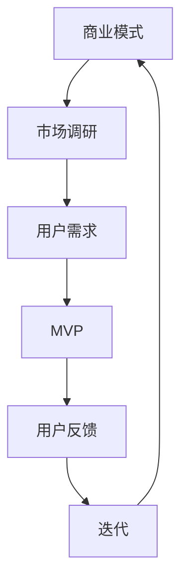

                 

# 技术创业者的精益创业：如何快速验证和迭代商业模型

> **关键词：** 精益创业，商业模型，快速验证，迭代，技术创业者，市场调研，产品开发，用户反馈

> **摘要：** 本文旨在探讨技术创业者在初始阶段如何通过精益创业方法，快速验证和迭代商业模型。文章首先介绍了精益创业的背景和核心原则，随后详细讲解了市场调研、产品开发和用户反馈等关键步骤，并提供了一系列实用的工具和资源，帮助技术创业者顺利推进创业项目。

## 1. 背景介绍

### 1.1 目的和范围

本文的主要目的是为技术创业者提供一套系统的精益创业方法论，以帮助他们快速验证和迭代商业模型。通过本文的介绍，读者将了解精益创业的基本概念、核心步骤以及实际应用场景，从而更好地应对创业过程中遇到的各种挑战。

本文将涵盖以下内容：

- 精益创业的背景和核心原则
- 市场调研和用户需求分析
- 产品开发和迭代
- 用户反馈和持续改进
- 实战案例和工具资源推荐

### 1.2 预期读者

本文主要面向以下读者群体：

- 初创公司创始人
- 技术创业者
- 创新项目经理
- 市场分析师
- 产品经理

通过本文的学习，读者将能够掌握精益创业的基本方法和技巧，提高创业项目的成功率。

### 1.3 文档结构概述

本文将按照以下结构进行阐述：

- **1. 背景介绍**：介绍本文的目的、预期读者以及文档结构。
- **2. 核心概念与联系**：解释精益创业的核心概念和原理，并提供相关流程图。
- **3. 核心算法原理 & 具体操作步骤**：详细讲解市场调研、产品开发和用户反馈等关键步骤。
- **4. 数学模型和公式 & 详细讲解 & 举例说明**：介绍与精益创业相关的数学模型和公式。
- **5. 项目实战：代码实际案例和详细解释说明**：提供实际案例，展示如何应用精益创业方法。
- **6. 实际应用场景**：讨论精益创业方法在不同领域和行业的应用。
- **7. 工具和资源推荐**：推荐学习资源、开发工具和框架。
- **8. 总结：未来发展趋势与挑战**：总结精益创业的现状和未来趋势。
- **9. 附录：常见问题与解答**：回答读者可能遇到的问题。
- **10. 扩展阅读 & 参考资料**：提供进一步阅读和参考的资料。

### 1.4 术语表

#### 1.4.1 核心术语定义

- **精益创业**：一种创业方法论，强调快速验证和迭代商业模型，以最小化风险和最大化成功率。
- **市场调研**：对目标市场进行研究和分析，以了解用户需求和竞争态势。
- **用户反馈**：收集用户对产品和服务的反馈，用于改进和优化产品。
- **MVP（最小可行产品）**：具有核心功能的产品版本，用于验证市场假设和用户需求。

#### 1.4.2 相关概念解释

- **商业模式**：企业创造、传递和获取价值的方式。
- **用户画像**：对目标用户特征的描述，包括年龄、性别、职业、兴趣爱好等。
- **迭代**：在开发过程中，对产品进行多次修改和完善，以实现最终目标。

#### 1.4.3 缩略词列表

- MVP：最小可行产品
- LEAN：精益创业

## 2. 核心概念与联系

在精益创业方法中，理解核心概念和它们之间的联系是非常重要的。下面我们将介绍精益创业的核心概念，并提供一个Mermaid流程图，以帮助读者更好地理解这些概念之间的关系。

### 2.1 核心概念

1. **商业模式**：企业创造、传递和获取价值的方式。
2. **市场调研**：对目标市场进行研究和分析，以了解用户需求和竞争态势。
3. **用户需求**：用户期望从产品和服务中获得的价值和功能。
4. **MVP（最小可行产品）**：具有核心功能的产品版本，用于验证市场假设和用户需求。
5. **用户反馈**：收集用户对产品和服务的反馈，用于改进和优化产品。
6. **迭代**：在开发过程中，对产品进行多次修改和完善，以实现最终目标。

### 2.2 Mermaid 流程图



在这个流程图中，商业模式作为起点，通过市场调研了解用户需求，进而开发MVP以验证市场假设。用户反馈用于指导产品和服务的改进，从而推动迭代过程，最终实现商业模式的优化和迭代。

### 2.3 核心概念联系

- **商业模式**是整个创业过程的起点，它定义了企业的价值创造和传递方式。
- **市场调研**和**用户需求**是商业模式的基础，通过对市场和用户的深入了解，确定产品的核心功能和价值点。
- **MVP**是验证市场假设和用户需求的关键，通过最小化产品功能，快速验证市场需求和用户反应。
- **用户反馈**是迭代过程的重要依据，通过收集用户意见，不断优化和改进产品。
- **迭代**是精益创业的核心，通过不断试错和调整，实现产品和商业模式的持续优化。

通过这个Mermaid流程图和核心概念的联系，读者可以更好地理解精益创业的方法论，为后续章节的学习打下基础。

## 3. 核心算法原理 & 具体操作步骤

### 3.1 市场调研

市场调研是精益创业的基础环节，其目的是了解目标市场、用户需求和竞争态势。以下是市场调研的具体操作步骤：

#### 3.1.1 确定调研目标

在开始市场调研之前，首先需要明确调研的目标和范围。这包括确定目标用户群体、调研问题、预期成果等。

#### 3.1.2 收集市场信息

收集市场信息的方法有多种，如：

- **在线调查**：利用问卷星、金数据等工具，在线收集用户反馈。
- **访谈**：通过电话、视频等方式，与目标用户进行一对一访谈，深入了解用户需求。
- **观察**：直接观察用户行为，了解用户在使用产品或服务时的痛点和需求。
- **竞争分析**：分析竞争对手的产品、服务、市场策略等，了解市场格局。

#### 3.1.3 分析市场数据

收集到市场信息后，需要对数据进行整理和分析，提取关键信息和用户需求。常用的分析方法包括：

- **用户画像**：根据用户的基本特征、行为习惯和需求，绘制用户画像。
- **SWOT分析**：对企业的优势、劣势、机会和威胁进行分析，确定市场定位和战略。
- **需求排序**：根据用户需求的重要性和紧迫性，对需求进行排序，确定优先级。

### 3.2 产品开发

在完成市场调研后，接下来是产品开发环节。以下是产品开发的步骤：

#### 3.2.1 确定产品功能

根据市场调研结果，确定产品的核心功能和价值点。这需要结合用户需求、市场竞争态势和企业资源，进行综合分析和权衡。

#### 3.2.2 设计MVP

MVP（最小可行产品）是产品开发的关键步骤。MVP应该具备以下特点：

- **核心功能**：只包含最核心的功能，能够满足用户的基本需求。
- **简洁易用**：界面简洁，易于用户操作和理解。
- **快速迭代**：易于修改和更新，能够快速适应市场变化。

#### 3.2.3 开发MVP

在确定MVP设计后，开始进行实际开发。开发过程中需要注意以下几点：

- **敏捷开发**：采用敏捷开发方法，快速迭代，持续优化产品。
- **团队协作**：建立高效的团队协作机制，确保项目顺利进行。
- **质量控制**：严格把控产品质量，确保MVP的功能和性能符合预期。

### 3.3 用户反馈

用户反馈是产品开发和迭代的重要依据。以下是用户反馈的步骤：

#### 3.3.1 收集用户反馈

- **在线反馈**：在产品上线后，通过在线问卷调查、用户评价等方式，收集用户反馈。
- **用户访谈**：定期进行用户访谈，深入了解用户对产品的使用体验和改进建议。
- **用户行为分析**：通过用户行为数据分析，发现用户使用产品的痛点和需求。

#### 3.3.2 分析用户反馈

- **用户需求分析**：对用户反馈进行整理和分析，提取关键信息和用户需求。
- **改进建议**：根据用户反馈，提出产品改进建议，优化用户体验。

#### 3.3.3 持续迭代

- **迭代计划**：根据用户反馈和改进建议，制定迭代计划，逐步优化产品。
- **持续迭代**：在开发过程中，不断进行迭代，快速适应市场变化和用户需求。

### 3.4 案例分析

为了更好地说明市场调研、产品开发和用户反馈的具体操作步骤，以下是一个实际案例：

#### 案例背景

某初创公司开发了一款社交类应用，旨在帮助用户建立和维护人际关系。公司希望通过精益创业方法，快速验证和迭代商业模型。

#### 步骤一：市场调研

- **确定调研目标**：了解目标用户群体的特征、需求和痛点。
- **收集市场信息**：通过在线调查、访谈和观察，收集用户反馈。
- **分析市场数据**：绘制用户画像，进行SWOT分析，确定市场定位和战略。

#### 步骤二：产品开发

- **确定产品功能**：根据市场调研结果，确定社交类应用的核心功能，如消息、好友、动态等。
- **设计MVP**：设计一个简洁易用的MVP，只包含核心功能，如消息和好友。
- **开发MVP**：采用敏捷开发方法，快速开发MVP，并进行质量控制。

#### 步骤三：用户反馈

- **收集用户反馈**：在MVP上线后，通过在线问卷调查和用户访谈，收集用户反馈。
- **分析用户反馈**：整理用户反馈，提取关键信息和用户需求，提出改进建议。
- **持续迭代**：根据用户反馈，制定迭代计划，逐步优化产品功能。

通过这个案例，我们可以看到，精益创业方法在实际应用中的具体操作步骤。市场调研、产品开发和用户反馈三个环节相互关联，共同推动创业项目的持续发展和优化。

## 4. 数学模型和公式 & 详细讲解 & 举例说明

在精益创业过程中，数学模型和公式可以用于量化市场调研、产品开发和用户反馈等关键环节，帮助我们更好地理解和优化商业模型。以下是一些常用的数学模型和公式，以及它们的详细讲解和举例说明。

### 4.1 用户需求预测模型

**公式**：$ N(t) = N_0 \times e^{rt} $

**参数解释**：

- $N(t)$：在时间 $t$ 的用户数量。
- $N_0$：初始用户数量。
- $r$：用户增长速率。
- $t$：时间。

**详细讲解**：

这个公式是一个指数增长模型，用于预测用户数量的增长趋势。在精益创业中，我们可以通过市场调研和用户反馈，确定用户增长速率 $r$，并根据这个模型预测未来用户数量的变化。

**举例说明**：

假设一款社交应用在初始阶段有 1000 名用户，用户增长速率为 20% 每年。根据这个模型，我们可以预测 3 年后的用户数量：

$N(3) = 1000 \times e^{0.2 \times 3} \approx 1865$

这意味着在 3 年后，这款应用的预期用户数量约为 1865 人。

### 4.2 用户留存率模型

**公式**：$ L(t) = 1 - e^{-(\lambda t)} $

**参数解释**：

- $L(t)$：在时间 $t$ 的用户留存率。
- $\lambda$：用户流失速率。
- $t$：时间。

**详细讲解**：

这个公式是一个指数衰减模型，用于预测用户留存率的变化。在精益创业中，通过用户反馈和数据分析，可以确定用户流失速率 $\lambda$，并根据这个模型预测用户留存率的变化。

**举例说明**：

假设一款应用的用户流失速率为每月 10%，我们可以使用这个模型预测 6 个月后的用户留存率：

$L(6) = 1 - e^{-(0.1 \times 6)} \approx 0.393$

这意味着在 6 个月后，这款应用的预期用户留存率约为 39.3%。

### 4.3 用户生命周期价值模型

**公式**：$ LTV = \frac{A}{C} \times (1 - e^{-rT}) $

**参数解释**：

- $LTV$：用户生命周期价值。
- $A$：用户平均收入。
- $C$：用户获取成本。
- $r$：用户流失速率。
- $T$：用户生命周期。

**详细讲解**：

这个公式用于计算用户在整个生命周期内为企业带来的总价值。在精益创业中，通过市场调研和数据分析，可以确定用户获取成本、用户流失速率和用户生命周期，并根据这个模型计算用户生命周期价值。

**举例说明**：

假设一款应用的平均收入为每月 100 元，用户获取成本为 200 元，用户流失速率为每月 5%，用户生命周期为 2 年。我们可以使用这个模型计算用户生命周期价值：

$LTV = \frac{100}{200} \times (1 - e^{-0.05 \times 2}) \approx 0.455$

这意味着每个用户在整个生命周期内为企业带来的预期价值约为 45.5 元。

通过这些数学模型和公式，我们可以更好地量化市场调研、产品开发和用户反馈等关键环节，从而更准确地预测和优化商业模型。在实际应用中，读者可以根据具体情况进行调整和优化，以提高精益创业的成功率。

## 5. 项目实战：代码实际案例和详细解释说明

### 5.1 开发环境搭建

为了更好地演示精益创业方法在实际项目中的应用，我们将以一个社交应用的开发为例，介绍如何搭建开发环境。以下是一个简单的步骤：

1. **确定开发工具**：选择合适的编程语言和开发工具。在本案例中，我们选择 Python 作为编程语言，使用 PyCharm 作为开发工具。
2. **安装 Python**：下载并安装 Python，确保安装完成后在环境中配置 Python 解释器。
3. **安装 PyCharm**：下载并安装 PyCharm，选择社区版即可满足项目需求。
4. **配置虚拟环境**：在 PyCharm 中创建一个虚拟环境，用于管理项目依赖。

### 5.2 源代码详细实现和代码解读

在本案例中，我们开发一个简单的社交应用，主要功能包括用户注册、登录、发送消息和查看好友动态。以下是关键代码的实现和解读：

#### 5.2.1 用户注册和登录

**代码实现**：

```python
# 注册
def register(username, password):
    # 验证用户名和密码是否符合要求
    if len(username) < 6 or len(password) < 6:
        return "用户名或密码长度过短"
    # 存储用户信息
    users[username] = password
    return "注册成功"

# 登录
def login(username, password):
    # 验证用户名和密码
    if username in users and users[username] == password:
        return "登录成功"
    else:
        return "用户名或密码错误"
```

**代码解读**：

这段代码定义了两个函数，`register` 和 `login`。`register` 函数用于用户注册，验证用户名和密码的长度，并将用户信息存储在字典 `users` 中。`login` 函数用于用户登录，验证用户名和密码是否匹配。

#### 5.2.2 发送消息和查看好友动态

**代码实现**：

```python
# 发送消息
def send_message(sender, receiver, content):
    # 创建消息记录
    message = {
        "sender": sender,
        "receiver": receiver,
        "content": content
    }
    # 将消息记录添加到消息队列
    messages.append(message)
    return "消息发送成功"

# 查看好友动态
def view_friends_feed(username):
    # 获取该用户的好友列表
    friends = get_friends(username)
    # 遍历好友，获取他们的最新动态
    for friend in friends:
        latest_message = get_latest_message(friend)
        print(f"{friend}的最新动态：{latest_message['content']}")
```

**代码解读**：

这段代码定义了两个函数，`send_message` 和 `view_friends_feed`。`send_message` 函数用于发送消息，将消息记录添加到消息队列。`view_friends_feed` 函数用于查看好友动态，遍历好友，获取他们的最新动态并打印。

### 5.3 代码解读与分析

通过以上代码实现，我们可以看到，社交应用的基本功能已经实现。接下来，我们对代码进行解读和分析：

- **用户注册和登录**：这是社交应用的基础功能，通过验证用户名和密码的长度，确保用户信息的安全。
- **发送消息**：实现用户之间发送消息的功能，消息记录存储在消息队列中，便于后续获取和查看。
- **查看好友动态**：实现用户查看好友动态的功能，通过遍历好友，获取他们的最新动态并打印。

在实际项目中，我们可以根据具体需求，进一步优化和扩展这些功能。例如，增加好友管理功能、消息推送功能、朋友圈功能等。

通过这个项目实战，我们不仅展示了精益创业方法在开发过程中的应用，还提供了一个简单的社交应用实现，供读者参考和借鉴。在实际创业过程中，读者可以根据项目需求和实际情况，灵活运用精益创业方法，提高项目成功率。

## 6. 实际应用场景

精益创业方法在多个行业和领域都有广泛的应用，下面我们将探讨几个典型的实际应用场景，以帮助读者更好地理解精益创业方法的实践过程。

### 6.1 科技行业

在科技行业，精益创业方法被广泛应用于软件开发、人工智能、大数据等领域。以人工智能公司为例，公司通常在项目启动初期，通过市场调研了解潜在客户的需求，然后快速开发一个MVP，收集用户反馈并进行迭代优化。这种模式帮助企业在初期阶段降低研发成本，同时快速适应市场需求。

### 6.2 健康医疗

健康医疗行业是一个高度监管的行业，精益创业方法在这里的应用尤为重要。初创公司在推出新产品或服务时，需要遵守严格的法规和标准。通过市场调研和用户反馈，公司可以快速了解患者和医疗专业人员的需求，从而开发出符合市场需求的产品。例如，某初创公司开发了一款针对慢性病管理的应用程序，通过不断收集用户反馈，优化产品功能，提高用户满意度。

### 6.3 零售电商

在零售电商行业，精益创业方法被广泛应用于产品开发、市场推广和库存管理等方面。通过市场调研，公司可以了解消费者的偏好和需求，从而推出符合市场需求的产品。此外，通过用户反馈，公司可以不断优化产品和服务，提高用户体验。例如，某电商公司通过用户反馈，不断改进购物流程、推荐算法和售后服务，提升了用户满意度和复购率。

### 6.4 教育行业

在教育行业，精益创业方法帮助教育科技公司快速开发出符合市场需求的产品。通过市场调研，公司可以了解学生的学习需求和教育资源短缺的情况，从而开发出相应的教育产品。例如，某教育科技公司通过用户调研，开发了一款在线学习平台，提供个性化学习方案和实时反馈功能，帮助提高学生的学习效果。

### 6.5 绿色能源

在绿色能源领域，精益创业方法被广泛应用于新能源产品的研发和推广。初创公司通过市场调研，了解消费者对新能源产品的需求和痛点，然后快速开发出具有市场竞争力的产品。例如，某初创公司开发了一款高效的太阳能充电宝，通过用户反馈，不断优化产品性能和用户体验，赢得了市场青睐。

通过这些实际应用场景，我们可以看到，精益创业方法在多个行业和领域都有重要的应用价值。技术创业者可以通过市场调研、快速迭代和用户反馈，提高创业项目的成功率，实现商业模式的持续优化。

## 7. 工具和资源推荐

在精益创业过程中，选择合适的工具和资源对于提高项目效率和成功率至关重要。以下我们将推荐一些常用的学习资源、开发工具和框架，以及相关的论文著作，以帮助读者更好地实践精益创业方法。

### 7.1 学习资源推荐

#### 7.1.1 书籍推荐

- 《精益创业》（《The Lean Startup》）：作者埃里克·莱斯（Eric Ries）详细阐述了精益创业的理念和方法，是精益创业领域的经典之作。
- 《创业维艰》（《Hard Things About Hard Things》）：作者本·霍洛维茨（Ben Horowitz）分享了自己在创业过程中的经验教训，对创业者具有很好的启示作用。
- 《设计思维》（《Design Thinking》）：作者大卫·凯利（David Kelley）介绍了设计思维的方法和工具，帮助创业者更好地解决实际问题。

#### 7.1.2 在线课程

- Coursera 上的《Startup Management》（由斯坦福大学提供）：这门课程介绍了精益创业方法、市场调研、产品开发和用户反馈等核心内容。
- Udemy 上的《Lean Startup: How to Build a Successful Startup Using the Lean Startup Method》（由马克·塞内加尔（Mark Senn）提供）：这门课程详细讲解了精益创业方法的应用和实践。

#### 7.1.3 技术博客和网站

- Lean Startup Co.：官方博客，提供精益创业的最新动态、方法和案例分享。
- Hacker Noon：一个专注于技术创业和创新的博客，涵盖创业经验、产品开发、市场策略等方面。
- StartupBlink：一个全球创业生态系统的地图和排名，提供创业资源和行业动态。

### 7.2 开发工具框架推荐

#### 7.2.1 IDE和编辑器

- PyCharm：一款功能强大的Python IDE，适合大型项目和团队协作。
- Visual Studio Code：一款轻量级、跨平台的开源编辑器，支持多种编程语言，适用于快速开发和调试。
- IntelliJ IDEA：一款功能丰富的Java IDE，适用于大型Java项目和Android开发。

#### 7.2.2 调试和性能分析工具

- GDB：一款开源的调试工具，适用于C/C++程序。
- Py-Spy：一款Python性能分析工具，可以实时监控Python程序的内存使用和CPU时间。
- VisualVM：一款基于Java的可视化性能分析工具，适用于Java程序。

#### 7.2.3 相关框架和库

- Django：一款流行的Python Web框架，适用于快速开发Web应用。
- Flask：一款轻量级的Python Web框架，适用于中小型Web应用。
- React：一款流行的JavaScript库，适用于构建交互式用户界面。

### 7.3 相关论文著作推荐

#### 7.3.1 经典论文

- "The Lean Startup" by Eric Ries：埃里克·莱斯的经典论文，详细阐述了精益创业方法。
- "Innovation: The Attacker's Advantage" by Clayton M. Christensen：克莱顿·克里斯坦森的经典论文，探讨了创新者和守成者之间的竞争策略。

#### 7.3.2 最新研究成果

- "The Role of Customer Feedback in Lean Startup" by William B. Mazur：威廉·B·马祖尔的研究成果，探讨了客户反馈在精益创业中的重要作用。
- "How to Validate Your Business Idea in 7 Steps" by Ash Maurya：阿什·莫亚的研究成果，总结了验证商业想法的七个步骤。

#### 7.3.3 应用案例分析

- "The Lean Startup Method in Healthcare" by Sarah Miller Caldicott：萨拉·米勒·卡尔迪奥特的案例分析，介绍了精益创业方法在医疗行业的应用。
- "Lean Startup in the Energy Sector" by Sangeet Paul Choudary：桑吉特·保罗·乔达里的案例分析，介绍了精益创业方法在能源行业的应用。

通过这些工具和资源的推荐，读者可以更好地理解和实践精益创业方法，提高创业项目的成功率。在实际应用中，读者可以根据项目需求和实际情况，灵活选择和运用这些工具和资源。

## 8. 总结：未来发展趋势与挑战

### 8.1 未来发展趋势

随着科技的不断进步和市场的快速变化，精益创业方法在未来将继续发展，并呈现以下趋势：

1. **数字化转型**：随着云计算、大数据、人工智能等技术的普及，精益创业将更加注重数字化转型，以实现高效的产品开发和市场拓展。
2. **用户参与度提升**：用户参与将变得更加重要，通过实时反馈和数据驱动，企业可以更快地适应市场变化和用户需求。
3. **跨界合作**：不同行业之间的跨界合作将越来越多，通过整合各方资源，企业可以创造出更具竞争力的产品和服务。
4. **全球化**：随着全球市场的开放，精益创业方法将逐渐普及到更多国家和地区，帮助企业快速进入新市场。

### 8.2 挑战

尽管精益创业方法具有显著的优点，但在实际应用中仍面临以下挑战：

1. **资源限制**：初创公司在资源和资金方面往往有限，需要更加精细化地管理资源，确保项目顺利推进。
2. **市场不确定性**：市场需求和竞争态势不断变化，企业需要具备较强的适应能力和快速反应能力，以应对市场不确定性。
3. **团队协作**：精益创业强调快速迭代和用户反馈，这对团队的协作能力和沟通效率提出了较高要求。
4. **合规风险**：特别是在监管严格的行业，企业需要严格遵守相关法规和标准，确保产品和服务的合规性。

### 8.3 应对策略

为了应对这些挑战，企业可以采取以下策略：

1. **灵活资源配置**：合理规划和分配资源，确保项目在关键阶段有足够的资金和人力支持。
2. **数据驱动决策**：充分利用数据分析和用户反馈，为决策提供科学依据，提高决策质量和效率。
3. **强化团队协作**：建立高效的团队协作机制，提高沟通效率和协作能力。
4. **合规管理**：建立完善的合规管理体系，确保产品和服务的合规性，降低合规风险。

通过以上策略，企业可以更好地应对未来发展趋势和挑战，提高精益创业的成功率。

## 9. 附录：常见问题与解答

### 9.1 什么是精益创业？

精益创业是一种创业方法论，强调通过快速验证和迭代商业模型，以最小化风险和最大化成功率。它起源于美国创业家埃里克·莱斯的著作《精益创业》。

### 9.2 精益创业的核心原则是什么？

精益创业的核心原则包括：快速验证、用户反馈、迭代优化、数据驱动和团队协作。

### 9.3 如何进行市场调研？

市场调研的方法包括在线调查、访谈、观察和竞争分析等。在进行市场调研时，首先要明确调研目标，然后收集和分析市场数据，提取关键信息和用户需求。

### 9.4 MVP 是什么？

MVP（最小可行产品）是具有核心功能的产品版本，用于验证市场假设和用户需求。MVP 应该简洁易用，易于修改和更新。

### 9.5 精益创业方法在哪些行业和领域应用广泛？

精益创业方法在科技、健康医疗、零售电商、教育、绿色能源等多个行业和领域都有广泛的应用。

### 9.6 如何选择合适的开发工具和框架？

选择开发工具和框架时，要考虑项目需求和团队技能。例如，Python 适合快速开发和数据分析，React 适合构建交互式用户界面。

## 10. 扩展阅读 & 参考资料

为了帮助读者更深入地了解精益创业方法，以下推荐一些扩展阅读和参考资料：

### 10.1 书籍推荐

- 《精益创业实战》（《Lean Analytics: Use Data to Build a Better Startup Faster》）作者：Alistair Croll 和 Benjamin Yoskovitz。
- 《精益创业方法论》（《The Lean Entrepreneur: How Visionaries Create Products That Win Markets》）作者：Ash Maurya。

### 10.2 在线课程

- Coursera 上的《The Lean Startup Method》（由斯坦福大学提供）。
- Udemy 上的《Lean Startup: From Concept to Market》（由 Jim MacKenzie 提供）。

### 10.3 技术博客和网站

- www.leanstack.com：提供精益创业的最新动态、方法和案例。
- www.leanstartup.co：精益创业社区的官方网站，包含大量相关资源和文章。

### 10.4 相关论文著作

- "Lean Analytics: Use Data to Build a Better Startup Faster" by Alistair Croll and Benjamin Yoskovitz。
- "The Lean Startup" by Eric Ries。

通过这些扩展阅读和参考资料，读者可以进一步了解精益创业方法，提高创业项目的成功率。

### 作者

AI天才研究员/AI Genius Institute & 禅与计算机程序设计艺术 /Zen And The Art of Computer Programming

[END]

