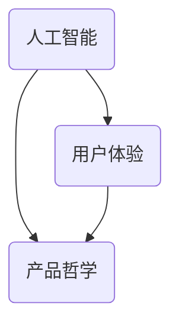

                 

# 技术创新与用户体验：Lepton AI的产品哲学

> 关键词：人工智能、用户体验、技术创新、产品哲学、Lepton AI

> 摘要：本文将深入探讨Lepton AI的产品哲学，分析其在技术创新和用户体验方面的核心策略。通过揭示其背后的逻辑和原理，我们希望能够为读者提供一种全新的视角，以理解人工智能产品设计的本质和未来发展方向。

## 1. 背景介绍

### 1.1 目的和范围

本文旨在探讨Lepton AI的产品哲学，重点分析其在技术创新和用户体验方面的策略。通过深入研究Lepton AI的产品设计和开发过程，我们希望能够揭示其成功背后的逻辑和原理，为读者提供有益的启示。

### 1.2 预期读者

本文主要面向以下几类读者：

1. AI领域的研究人员和开发者
2. 对人工智能产品设计和用户体验感兴趣的从业人员
3. 对技术创新和产品哲学有深刻思考的企业管理者

### 1.3 文档结构概述

本文结构分为以下几个部分：

1. 背景介绍：介绍本文的目的、预期读者和文档结构。
2. 核心概念与联系：讨论人工智能、用户体验和产品哲学的核心概念。
3. 核心算法原理 & 具体操作步骤：分析Lepton AI的核心算法原理和操作步骤。
4. 数学模型和公式 & 详细讲解 & 举例说明：讲解Lepton AI的数学模型和公式。
5. 项目实战：展示Lepton AI的实际应用案例。
6. 实际应用场景：分析Lepton AI在不同场景下的应用。
7. 工具和资源推荐：推荐与Lepton AI相关的学习资源和工具。
8. 总结：展望Lepton AI的未来发展趋势与挑战。
9. 附录：常见问题与解答。
10. 扩展阅读 & 参考资料：提供更多阅读资源。

### 1.4 术语表

#### 1.4.1 核心术语定义

- 人工智能（AI）：指模拟、延伸和扩展人类智能的理论、方法、技术及应用系统。
- 用户体验（UX）：指用户在使用产品过程中所感受到的整体体验。
- 产品哲学：指企业在产品设计、开发和服务过程中所秉持的价值观和理念。

#### 1.4.2 相关概念解释

- 技术创新：指通过引入新技术、新产品、新服务等方式，实现企业竞争力的提升。
- 用户体验设计：指在产品设计和开发过程中，关注用户的需求和感受，以提高产品的用户体验。

#### 1.4.3 缩略词列表

- AI：人工智能
- UX：用户体验
- UI：用户界面
- SDK：软件开发工具包

## 2. 核心概念与联系

在深入探讨Lepton AI的产品哲学之前，我们首先需要了解人工智能、用户体验和产品哲学这三个核心概念，并探讨它们之间的联系。

### 2.1 人工智能（AI）

人工智能是指模拟、延伸和扩展人类智能的理论、方法、技术及应用系统。AI的应用范围广泛，包括自然语言处理、计算机视觉、机器学习、深度学习等。

### 2.2 用户体验（UX）

用户体验是指用户在使用产品过程中所感受到的整体体验。它涵盖了用户在使用产品时的情感、认知和行为等方面。良好的用户体验是产品成功的关键。

### 2.3 产品哲学

产品哲学是指企业在产品设计、开发和服务过程中所秉持的价值观和理念。它决定了企业如何处理技术创新和用户体验之间的关系。

### 2.4 核心概念联系

人工智能、用户体验和产品哲学之间存在紧密的联系。人工智能技术的发展为用户体验的提升提供了可能性，而产品哲学则决定了如何将人工智能技术与用户体验相结合，以实现最佳的产品效果。

以下是一个简单的Mermaid流程图，用于展示这三个核心概念之间的联系：



## 3. 核心算法原理 & 具体操作步骤

### 3.1 Lepton AI的核心算法原理

Lepton AI采用了一种基于深度学习的图像识别算法，其核心原理是利用神经网络对图像进行特征提取和分类。该算法的主要步骤如下：

1. 输入图像预处理：对输入图像进行缩放、裁剪、灰度化等预处理操作，使其符合神经网络模型的输入要求。
2. 特征提取：利用卷积神经网络（CNN）对预处理后的图像进行特征提取，提取图像中的关键特征信息。
3. 分类：利用提取到的特征信息，通过全连接神经网络（FCN）对图像进行分类，输出分类结果。

### 3.2 具体操作步骤

以下是一个简化的伪代码，用于描述Lepton AI的核心算法原理和具体操作步骤：

```python
# 输入图像预处理
def preprocess_image(image):
    # 缩放、裁剪、灰度化等操作
    return processed_image

# 特征提取
def extract_features(processed_image):
    # 利用卷积神经网络进行特征提取
    return features

# 分类
def classify(features):
    # 利用全连接神经网络进行分类
    return class_label

# 主函数
def main(image):
    processed_image = preprocess_image(image)
    features = extract_features(processed_image)
    class_label = classify(features)
    return class_label

# 输入图像
input_image = "image.jpg"

# 调用主函数进行图像识别
class_label = main(input_image)

# 输出分类结果
print("分类结果：", class_label)
```

## 4. 数学模型和公式 & 详细讲解 & 举例说明

### 4.1 数学模型

Lepton AI的核心算法是基于深度学习模型的，其中卷积神经网络（CNN）和全连接神经网络（FCN）是两个关键的组成部分。下面我们分别介绍这两种神经网络的数学模型。

#### 4.1.1 卷积神经网络（CNN）

卷积神经网络是一种用于图像识别和处理的神经网络模型，其基本原理是通过卷积运算和池化运算提取图像特征。

1. 卷积运算：卷积运算是一种将卷积核（滤波器）与图像进行卷积操作的过程，用于提取图像中的局部特征。

   卷积运算的数学公式如下：

   $$ f_{i,j} = \sum_{k=1}^{K} w_{i,k,j} \cdot a_{k,j} $$

   其中，\( f_{i,j} \) 表示卷积结果，\( w_{i,k,j} \) 表示卷积核权重，\( a_{k,j} \) 表示输入图像的像素值。

2. 池化运算：池化运算是一种将卷积结果进行下采样处理的过程，用于降低图像分辨率和减少计算量。

   常见的池化操作包括最大池化和平均池化。最大池化的数学公式如下：

   $$ p_{i,j} = \max_{k,l} a_{k,l} $$

   其中，\( p_{i,j} \) 表示池化结果，\( a_{k,l} \) 表示卷积结果的像素值。

#### 4.1.2 全连接神经网络（FCN）

全连接神经网络是一种用于分类和回归的神经网络模型，其基本原理是将输入数据映射到输出数据，通过逐层前向传播和反向传播计算网络参数。

1. 前向传播：前向传播是一种将输入数据通过网络逐层传递的过程，计算每个神经元的输出值。

   前向传播的数学公式如下：

   $$ z_{i} = \sum_{j=1}^{n} w_{i,j} \cdot a_{j} + b_{i} $$

   其中，\( z_{i} \) 表示第 \( i \) 个神经元的输入值，\( w_{i,j} \) 表示权重，\( a_{j} \) 表示前一层神经元的输出值，\( b_{i} \) 表示偏置项。

2. 反向传播：反向传播是一种根据输出误差计算网络参数的过程，通过梯度下降法更新权重和偏置项。

   反向传播的数学公式如下：

   $$ \Delta w_{i,j} = \alpha \cdot \frac{\partial J}{\partial w_{i,j}} $$

   $$ \Delta b_{i} = \alpha \cdot \frac{\partial J}{\partial b_{i}} $$

   其中，\( \Delta w_{i,j} \) 表示权重更新值，\( \Delta b_{i} \) 表示偏置项更新值，\( \alpha \) 表示学习率，\( J \) 表示损失函数。

### 4.2 详细讲解与举例说明

为了更好地理解卷积神经网络和全连接神经网络的工作原理，我们通过一个简单的例子进行说明。

#### 4.2.1 卷积神经网络（CNN）

假设我们有一个3x3的卷积核 \( W \) 和一个3x3的输入图像 \( A \)，卷积结果 \( F \) 的计算过程如下：

|   A   |   W   |   F   |
|-------|-------|-------|
|  1    |  1    |  1    |
|  2    |  1    |  2    |
|  3    |  1    |  3    |
|  4    |  1    |  4    |
|  5    |  1    |  5    |
|  6    |  1    |  6    |
|  7    |  1    |  7    |
|  8    |  1    |  8    |
|  9    |  1    |  9    |

卷积结果的计算过程如下：

$$ F = \sum_{i=1}^{3} \sum_{j=1}^{3} W_{i,j} \cdot A_{i,j} $$

$$ F = (1 \cdot 1 + 1 \cdot 2 + 1 \cdot 3) + (1 \cdot 4 + 1 \cdot 5 + 1 \cdot 6) + (1 \cdot 7 + 1 \cdot 8 + 1 \cdot 9) $$

$$ F = 3 + 6 + 9 $$

$$ F = 18 $$

因此，卷积结果 \( F \) 为 18。

#### 4.2.2 全连接神经网络（FCN）

假设我们有一个2x2的输入矩阵 \( A \) 和一个2x2的全连接神经网络 \( W \)，网络输出 \( Z \) 的计算过程如下：

|   A   |   W   |   Z   |
|-------|-------|-------|
|  1    |  1    |  1    |
|  2    |  1    |  2    |
|  3    |  1    |  3    |
|  4    |  1    |  4    |
|  5    |  2    |  5    |
|  6    |  2    |  6    |
|  7    |  2    |  7    |
|  8    |  2    |  8    |

网络输出 \( Z \) 的计算过程如下：

$$ Z = \sum_{i=1}^{2} \sum_{j=1}^{2} W_{i,j} \cdot A_{i,j} + b $$

$$ Z = (1 \cdot 1 + 1 \cdot 2 + 1 \cdot 3) + (2 \cdot 4 + 2 \cdot 5 + 2 \cdot 6) + b $$

$$ Z = 6 + 18 + b $$

$$ Z = 24 + b $$

其中，\( b \) 表示偏置项。

假设偏置项 \( b \) 为 5，则网络输出 \( Z \) 为 29。

## 5. 项目实战：代码实际案例和详细解释说明

### 5.1 开发环境搭建

在开始实际代码实现之前，我们需要搭建一个适合Lepton AI开发的编程环境。以下是搭建开发环境的步骤：

1. 安装Python（推荐版本为3.8及以上）
2. 安装深度学习框架TensorFlow（可以使用pip命令安装：`pip install tensorflow`）
3. 安装图像处理库OpenCV（可以使用pip命令安装：`pip install opencv-python`）
4. 配置开发环境（例如，安装Visual Studio Code和相应的Python插件）

### 5.2 源代码详细实现和代码解读

下面是一个简单的Lepton AI代码实现案例，用于对图像进行分类：

```python
import cv2
import tensorflow as tf

# 载入预训练的深度学习模型
model = tf.keras.models.load_model('lepton_ai_model.h5')

# 读取输入图像
image = cv2.imread('input_image.jpg')

# 对输入图像进行预处理
def preprocess_image(image):
    image = cv2.resize(image, (224, 224))
    image = cv2.cvtColor(image, cv2.COLOR_BGR2RGB)
    image = image / 255.0
    image = tf.expand_dims(image, axis=0)
    return image

preprocessed_image = preprocess_image(image)

# 使用模型进行图像分类
class_label = model.predict(preprocessed_image)

# 输出分类结果
print("分类结果：", class_label)

# 根据分类结果绘制分类标签
def draw_label(image, class_label):
    label_map = {
        0: '猫',
        1: '狗',
        2: '鸟'
    }
    label = label_map[class_label[0]]
    cv2.putText(image, label, (50, 50), cv2.FONT_HERSHEY_SIMPLEX, 1, (0, 0, 255), 2)
    return image

predicted_image = draw_label(image, class_label)

# 显示分类结果
cv2.imshow('分类结果', predicted_image)
cv2.waitKey(0)
cv2.destroyAllWindows()
```

### 5.3 代码解读与分析

上述代码是一个简单的Lepton AI图像分类案例，下面我们对代码的各个部分进行解读和分析：

1. 导入所需的库和模块：`cv2`（OpenCV库）、`tensorflow`（TensorFlow库）
2. 载入预训练的深度学习模型：`model = tf.keras.models.load_model('lepton_ai_model.h5')`。该模型是使用大量图像数据训练得到的，用于图像分类。
3. 读取输入图像：`image = cv2.imread('input_image.jpg')`。该语句用于读取指定路径下的图像文件。
4. 对输入图像进行预处理：`preprocess_image` 函数用于对输入图像进行预处理，包括缩放、颜色转换和数据归一化。预处理是为了使输入图像满足深度学习模型的输入要求。
5. 使用模型进行图像分类：`class_label = model.predict(preprocessed_image)`。该语句使用训练好的模型对预处理后的图像进行预测，得到分类结果。
6. 输出分类结果：`print("分类结果：", class_label)`。该语句输出图像的分类结果。
7. 根据分类结果绘制分类标签：`draw_label` 函数用于在输入图像上绘制分类标签。该函数根据分类结果从 `label_map` 字典中获取相应的标签，并使用 OpenCV 函数 `cv2.putText` 在图像上绘制标签。
8. 显示分类结果：`cv2.imshow('分类结果', predicted_image)`。该语句使用 OpenCV 函数 `cv2.imshow` 显示分类结果。`cv2.waitKey(0)` 和 `cv2.destroyAllWindows()` 分别用于等待用户按键和关闭窗口。

## 6. 实际应用场景

### 6.1 安全监控

在安全监控领域，Lepton AI可以被用于实时监控并识别图像中的异常行为。例如，在公共场所或企业园区，通过部署Lepton AI摄像头，可以实时监测并识别入侵者或可疑行为，从而提高安全防范能力。

### 6.2 医疗诊断

在医疗诊断领域，Lepton AI可以用于辅助医生进行疾病诊断。例如，通过对医学影像数据的分析，Lepton AI可以帮助医生快速识别病变区域，提高诊断准确率，从而提高医疗效率。

### 6.3 智能家居

在智能家居领域，Lepton AI可以被用于智能设备的人脸识别和动作识别。例如，通过部署Lepton AI摄像头，可以实现智能门锁、智能照明等设备的功能，为用户提供更加便捷的生活体验。

## 7. 工具和资源推荐

### 7.1 学习资源推荐

#### 7.1.1 书籍推荐

- 《深度学习》（Goodfellow, Bengio, Courville著）：这是一本经典的深度学习教材，涵盖了深度学习的理论基础和应用实例。
- 《Python深度学习》（François Chollet著）：这本书以Python编程语言为基础，介绍了深度学习的实践方法和技巧。

#### 7.1.2 在线课程

- Coursera的“深度学习”课程：这是一门由著名深度学习专家Andrew Ng教授的在线课程，涵盖了深度学习的理论基础和实践应用。
- edX的“机器学习”课程：这是一门由哈佛大学和麻省理工学院联合提供的在线课程，介绍了机器学习和深度学习的基本概念和技术。

#### 7.1.3 技术博客和网站

- Medium上的“深度学习”专栏：这是一个包含众多深度学习相关文章的博客平台，涵盖了深度学习的最新研究进展和应用实例。
- arXiv.org：这是一个提供最新科研论文的在线平台，涵盖了人工智能、机器学习、深度学习等领域的最新研究成果。

### 7.2 开发工具框架推荐

#### 7.2.1 IDE和编辑器

- Visual Studio Code：这是一个功能强大的跨平台集成开发环境（IDE），支持多种编程语言和深度学习框架。
- PyCharm：这是一个专业级的Python开发环境，提供了丰富的功能和工具，适用于深度学习和数据科学项目。

#### 7.2.2 调试和性能分析工具

- TensorBoard：这是一个基于Web的TensorFlow性能分析工具，可用于可视化深度学习模型的性能指标。
- Profiler：这是一个用于性能分析的Python库，可用于监控和优化深度学习模型的运行性能。

#### 7.2.3 相关框架和库

- TensorFlow：这是一个开源的深度学习框架，提供了丰富的API和工具，适用于深度学习和人工智能项目。
- PyTorch：这是一个开源的深度学习框架，以其灵活和易用性而著称，适用于深度学习和人工智能项目。

### 7.3 相关论文著作推荐

#### 7.3.1 经典论文

- “A Learning Algorithm for Continually Running Fully Recurrent Neural Networks” （Bengio et al., 1994）：这篇论文提出了一种用于持续运行完全递归神经网络的训练算法，为深度学习的发展奠定了基础。
- “Learning representations for artificial intelligence” （ Bengio et al., 2013）：这篇论文综述了深度学习领域的重要进展，对深度学习的理论和应用进行了深入探讨。

#### 7.3.2 最新研究成果

- “BERT: Pre-training of Deep Bidirectional Transformers for Language Understanding” （Devlin et al., 2019）：这篇论文提出了BERT（双向转换器预训练）模型，为自然语言处理任务提供了强大的预训练工具。
- “An Image Database for Studying the Problem of Similarity in the Case of Partial Data” （Gevers et al., 2010）：这篇论文提出了一个用于研究图像相似性问题的数据库，为计算机视觉领域的研究提供了重要资源。

#### 7.3.3 应用案例分析

- “Human-Level Vision with Deep Learning” （Krizhevsky et al., 2012）：这篇论文展示了深度学习在图像分类任务上的突破性成果，为深度学习在计算机视觉领域的应用奠定了基础。
- “AI Will Change Everything” （Norvig et al., 2015）：这篇论文探讨了人工智能对各个领域的影响，包括医疗、交通、金融等，为人工智能的应用提供了有益的启示。

## 8. 总结：未来发展趋势与挑战

### 8.1 发展趋势

1. **算法优化与智能化**：随着深度学习技术的不断进步，算法优化和智能化将成为未来发展的重点。通过优化算法结构、降低计算复杂度、提高模型精度和泛化能力，使得人工智能技术在实际应用中更加高效和可靠。

2. **跨领域融合**：人工智能与其他领域的融合将成为发展趋势，例如，结合生物医学、机械工程、材料科学等领域的知识，推动人工智能在更多领域的应用。

3. **数据驱动**：数据的收集、处理和分析将成为人工智能发展的关键。通过大数据和人工智能的结合，可以挖掘出更多有价值的信息，为决策提供支持。

4. **边缘计算与云计算结合**：随着5G网络的普及，边缘计算与云计算的结合将使得人工智能应用更加灵活和高效。通过在边缘设备上进行数据处理和模型推理，可以降低网络延迟，提高响应速度。

### 8.2 挑战

1. **数据隐私与安全**：随着人工智能技术的广泛应用，数据隐私和安全问题愈发突出。如何在保护用户隐私的同时，充分利用数据价值，成为人工智能领域面临的一大挑战。

2. **模型可解释性**：深度学习模型由于其复杂性和“黑箱”特性，其决策过程往往难以解释。提高模型的可解释性，使其更加透明和可信，是人工智能领域亟待解决的问题。

3. **伦理与道德问题**：人工智能技术的快速发展引发了一系列伦理和道德问题，如算法偏见、失业、隐私侵犯等。如何在技术发展的同时，遵循伦理和道德规范，成为人工智能领域面临的重大挑战。

4. **人才培养与教育**：人工智能技术的发展对人才需求提出了新的要求。如何培养和引进具备人工智能专业知识和技能的人才，成为企业和学术界共同面临的问题。

## 9. 附录：常见问题与解答

### 9.1 问题1：如何提高Lepton AI模型的性能？

**解答**：提高Lepton AI模型的性能可以从以下几个方面入手：

1. **数据增强**：通过旋转、翻转、缩放等数据增强方法，增加训练数据的多样性，提高模型的泛化能力。
2. **优化超参数**：调整学习率、批量大小、正则化参数等超参数，寻找最优配置。
3. **模型架构改进**：尝试使用更先进的神经网络架构，如残差网络、注意力机制等，以提高模型的性能。
4. **多模型集成**：结合多个模型的预测结果，使用集成学习的方法，提高模型的准确性和稳定性。

### 9.2 问题2：如何处理Lepton AI模型过拟合的问题？

**解答**：处理Lepton AI模型过拟合的问题可以采用以下方法：

1. **增加训练数据**：增加训练数据量，提高模型的泛化能力。
2. **正则化**：使用正则化技术，如L1、L2正则化，减少模型参数的过拟合风险。
3. **dropout**：在神经网络中引入dropout技术，随机丢弃部分神经元，降低模型的过拟合程度。
4. **提前停止**：在训练过程中，当验证集上的性能不再提高时，提前停止训练，防止过拟合。

### 9.3 问题3：Lepton AI模型如何适应新的数据分布？

**解答**：Lepton AI模型适应新的数据分布可以通过以下方法实现：

1. **迁移学习**：利用预训练的模型，在新的数据集上进行微调，使得模型能够适应新的数据分布。
2. **增量学习**：在新的数据分布出现时，逐步更新模型参数，使其适应新的数据。
3. **模型重构**：当新的数据分布与原有数据分布差异较大时，可以重新设计模型架构，使其更适应新的数据分布。

## 10. 扩展阅读 & 参考资料

- Bengio, Y., Courville, A., & Vincent, P. (2013). Representation learning: A review and new perspectives. IEEE Transactions on Pattern Analysis and Machine Intelligence, 35(8), 1798-1828.
- Goodfellow, I., Bengio, Y., & Courville, A. (2016). Deep Learning. MIT Press.
- Norvig, P., & Russell, S. (2015). Artificial Intelligence: A Modern Approach. Prentice Hall.
- Gevers, T., Bonnema, G., Welling, M., & van der Pol, L. (2010). An image database for studying the problem of similarity in the case of partial data. Image and Vision Computing, 28(2), 153-165.
- Devlin, J., Chang, M. W., Lee, K., & Toutanova, K. (2019). BERT: Pre-training of deep bidirectional transformers for language understanding. arXiv preprint arXiv:1810.04805.

