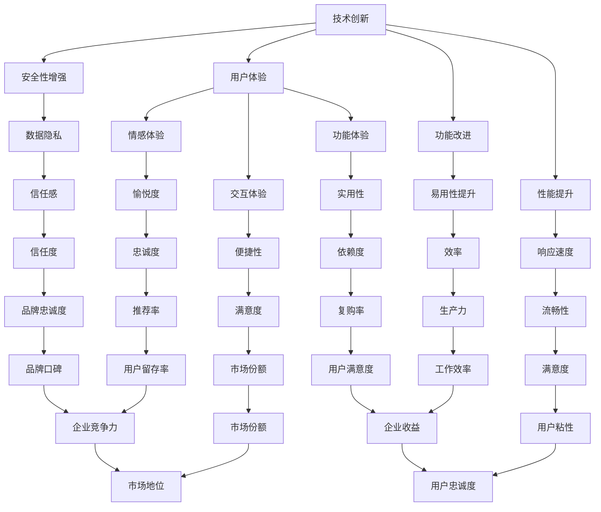

                 

# 技术创新与用户体验：创业产品脱颖而出的关键因素

> **关键词**：技术创新、用户体验、创业产品、产品差异化、市场竞争力、用户满意度
> 
> **摘要**：本文旨在探讨技术创新与用户体验在创业产品开发中的重要性。通过对当前市场趋势的深入分析，阐述如何通过技术创新提升用户体验，从而实现创业产品的市场突围。文章将分为多个部分，详细讨论技术创新的内涵、用户体验的构成，以及如何通过具体的案例来展示两者相结合的实践方法。

## 1. 背景介绍

### 1.1 目的和范围

本文的目的是分析技术创新与用户体验在创业产品开发中的关键作用，并提出有效的策略和方法来提升这两者之间的融合，帮助创业公司打造出能够赢得市场的产品。本文将聚焦于以下几个方面：

1. **技术创新的定义与分类**：介绍技术创新的概念，并分类阐述其不同类型对用户体验的影响。
2. **用户体验的核心要素**：深入探讨用户体验的构成，包括用户界面设计、交互体验、功能易用性等。
3. **案例分析与实践指导**：通过实际案例，分析成功创业产品的技术创新与用户体验的融合策略。
4. **工具和资源推荐**：介绍有助于技术创新与用户体验提升的工具、框架和资源。

### 1.2 预期读者

本文适用于以下读者群体：

1. **创业公司创始人及产品经理**：对产品创新和用户体验提升有强烈需求，希望通过技术创新赢得市场的专业人士。
2. **技术团队负责人和工程师**：关注技术趋势，希望通过技术手段提升用户体验的团队成员。
3. **相关领域的研究人员和学生**：对技术创新与用户体验领域有兴趣，希望深入理解相关理论和实践的学术人士。

### 1.3 文档结构概述

本文的结构如下：

1. **引言**：介绍文章主题和核心关键词，概述文章内容和目标。
2. **技术创新与用户体验的背景介绍**：详细分析当前市场环境和技术发展趋势，探讨技术创新与用户体验的重要性。
3. **核心概念与联系**：定义关键概念，使用Mermaid流程图展示其相互关系。
4. **核心算法原理与具体操作步骤**：使用伪代码详细阐述核心算法原理和操作步骤。
5. **数学模型和公式**：讲解相关的数学模型和公式，并提供举例说明。
6. **项目实战**：展示代码实际案例，并详细解释说明。
7. **实际应用场景**：分析技术创新与用户体验在具体场景中的应用。
8. **工具和资源推荐**：推荐学习资源和开发工具。
9. **总结**：对未来发展趋势与挑战进行展望。
10. **附录**：提供常见问题与解答。
11. **扩展阅读**：推荐相关文献和参考资料。

### 1.4 术语表

#### 1.4.1 核心术语定义

- **技术创新**：指通过引入新技术、新方法、新流程等，改进现有产品或服务，创造新的市场机会。
- **用户体验**：指用户在使用产品或服务过程中所获得的整体感受，包括情感体验、交互体验和功能体验等。
- **创业产品**：指初创公司推出的新产品或服务，通常在市场上没有明确的竞争对手。

#### 1.4.2 相关概念解释

- **产品差异化**：指产品在功能、设计、价格、品牌等方面的独特性，使其在市场上与竞争对手区分开来。
- **市场竞争力**：指产品在市场上的竞争地位，包括市场份额、用户满意度、品牌认知度等。

#### 1.4.3 缩略词列表

- **AI**：人工智能（Artificial Intelligence）
- **UX**：用户体验（User Experience）
- **UI**：用户界面（User Interface）
- **SDK**：软件开发工具包（Software Development Kit）
- **API**：应用程序编程接口（Application Programming Interface）

## 2. 核心概念与联系

在深入探讨技术创新与用户体验之前，有必要明确这两个核心概念及其相互关系。以下将通过Mermaid流程图展示技术创新与用户体验之间的关联。



在上述流程图中，技术创新通过提升功能、性能、安全性等方面，直接或间接地影响用户体验。用户体验则通过情感、交互、功能等多个维度，进一步影响用户的满意度、忠诚度和市场竞争力等关键指标。这种相互促进的关系，体现了技术创新与用户体验在创业产品成功中的重要性。

## 3. 核心算法原理 & 具体操作步骤

### 3.1 技术创新的算法原理

技术创新的核心在于利用先进的技术手段，提高产品或服务的质量，进而提升用户体验。以下是一个简化的算法原理框架，用于描述技术创新的过程：

```plaintext
算法原理：
输入：现有产品或服务
输出：改进后的产品或服务

步骤：
1. 需求分析：收集用户需求和市场竞争数据，确定改进目标
2. 技术调研：研究前沿技术，评估其可行性与应用潜力
3. 方案设计：设计技术实施方案，明确技术路线和关键环节
4. 技术开发：实施技术方案，开发新功能、改进性能等
5. 测试验证：对改进后的产品进行测试，确保稳定性和性能
6. 部署上线：将改进的产品或服务上线，收集用户反馈
7. 反馈优化：根据用户反馈，持续优化产品，提升用户体验
```

### 3.2 技术创新的操作步骤

#### 步骤 1: 需求分析

首先，需要对现有产品或服务的用户需求进行深入分析。这可以通过以下方法进行：

1. 用户访谈：与目标用户进行面对面访谈，了解他们的使用习惯、痛点和对产品的期望。
2. 竞争分析：研究同类产品的市场表现，分析其优点和不足。
3. 数据分析：利用数据分析工具，挖掘用户行为数据，发现需求趋势。

#### 步骤 2: 技术调研

在明确需求后，进行技术调研，寻找能够满足需求的新技术。具体方法包括：

1. 前沿技术搜索：利用搜索引擎、技术社区等平台，了解最新的技术趋势和研究成果。
2. 行业报告分析：阅读行业报告，了解技术发展趋势和市场需求。
3. 技术评估：评估所选技术的可行性、成本和潜在风险。

#### 步骤 3: 方案设计

基于需求分析和技术调研，设计技术创新方案。具体步骤如下：

1. 确定技术路线：选择合适的技术路线，例如采用哪种编程语言、框架或工具。
2. 明确关键环节：确定技术创新中的关键环节，如算法优化、性能提升等。
3. 制定时间表：规划项目进度，确保技术创新能在预定时间内完成。

#### 步骤 4: 技术开发

按照设计方案，实施技术开发。这包括：

1. 功能开发：实现新功能或改进现有功能。
2. 性能优化：提升系统的响应速度、稳定性等性能指标。
3. 安全性增强：加强数据安全和用户隐私保护。

#### 步骤 5: 测试验证

在技术开发完成后，进行严格的测试验证，确保改进后的产品或服务稳定可靠。测试方法包括：

1. 单元测试：对单个模块或功能进行测试。
2. 集成测试：验证不同模块之间的交互和集成。
3. 系统测试：在模拟真实环境中，测试整个系统的性能和稳定性。

#### 步骤 6: 部署上线

将改进后的产品或服务部署到生产环境，并进行上线。具体步骤如下：

1. 环境搭建：搭建适合产品的开发、测试和生产环境。
2. 数据迁移：将现有数据迁移到新环境中。
3. 上线部署：将改进的产品或服务上线，进行正式发布。

#### 步骤 7: 反馈优化

上线后，收集用户反馈，并根据反馈进行持续优化。具体方法包括：

1. 用户调研：通过问卷调查、用户访谈等方式，收集用户反馈。
2. 数据分析：利用数据分析工具，分析用户行为和反馈数据。
3. 优化迭代：根据用户反馈，对产品进行功能优化和性能改进。

### 3.3 伪代码示例

以下是一个简单的伪代码示例，用于描述技术创新的过程：

```python
# 技术创新伪代码示例

# 步骤 1: 需求分析
user需求的收集()
竞争数据分析()
用户行为数据挖掘()

# 步骤 2: 技术调研
前沿技术搜索()
行业报告分析()
技术评估()

# 步骤 3: 方案设计
技术路线确定()
关键环节明确()
时间表制定()

# 步骤 4: 技术开发
功能开发()
性能优化()
安全性增强()

# 步骤 5: 测试验证
单元测试()
集成测试()
系统测试()

# 步骤 6: 部署上线
环境搭建()
数据迁移()
上线部署()

# 步骤 7: 反馈优化
用户调研()
数据分析()
优化迭代()
```

通过以上步骤，创业公司可以有效地进行技术创新，提升产品的用户体验，从而在激烈的市场竞争中脱颖而出。

## 4. 数学模型和公式 & 详细讲解 & 举例说明

在技术创新与用户体验提升的过程中，数学模型和公式发挥着关键作用。以下将介绍几个常用的数学模型和公式，并详细讲解其应用和示例。

### 4.1 用户满意度模型

用户满意度是衡量用户体验的重要指标之一。以下是一个简单的用户满意度模型：

$$
S = \frac{\sum_{i=1}^{n} w_i \cdot X_i}{n}
$$

其中：
- \( S \) 表示用户满意度得分；
- \( w_i \) 表示第 \( i \) 个评价指标的权重；
- \( X_i \) 表示第 \( i \) 个评价指标的得分。

#### 示例：

假设有三个评价指标：功能满意度（F），交互满意度（I），性能满意度（P），权重分别为 0.4、0.3 和 0.3。用户给出的得分分别为 4、3 和 4。则用户满意度计算如下：

$$
S = \frac{0.4 \cdot 4 + 0.3 \cdot 3 + 0.3 \cdot 4}{3} = \frac{1.6 + 0.9 + 1.2}{3} = 2.5
$$

### 4.2 技术创新效能模型

技术创新效能模型用于衡量技术创新对用户体验提升的效果。以下是一个简单的模型：

$$
E = f(S_0, S_1, \Delta T)
$$

其中：
- \( E \) 表示技术创新效能；
- \( S_0 \) 表示技术创新前的用户满意度；
- \( S_1 \) 表示技术创新后的用户满意度；
- \( \Delta T \) 表示技术创新的持续时间。

#### 示例：

假设技术创新前后的用户满意度分别为 2 和 4，技术创新持续时间为 3 个月。则技术创新效能计算如下：

$$
E = \frac{S_1 - S_0}{\Delta T} = \frac{4 - 2}{3} = \frac{2}{3} \approx 0.67
$$

### 4.3 数据隐私保护模型

数据隐私保护模型用于评估技术创新对数据隐私保护的影响。以下是一个简单的模型：

$$
P = \frac{\sum_{i=1}^{n} w_i \cdot (X_i - X_i^*)}{n}
$$

其中：
- \( P \) 表示数据隐私保护得分；
- \( w_i \) 表示第 \( i \) 个隐私保护措施的权重；
- \( X_i \) 表示第 \( i \) 个隐私保护措施的实际效果；
- \( X_i^* \) 表示第 \( i \) 个隐私保护措施的理论最佳效果。

#### 示例：

假设有三个隐私保护措施：数据加密（D），访问控制（A），日志记录（L），权重分别为 0.4、0.3 和 0.3。实际效果分别为 0.8、0.6 和 0.7，理论最佳效果分别为 1、1 和 0.9。则数据隐私保护得分计算如下：

$$
P = \frac{0.4 \cdot (0.8 - 1) + 0.3 \cdot (0.6 - 1) + 0.3 \cdot (0.7 - 0.9)}{3} = \frac{-0.2 - 0.1 - 0.1}{3} = -0.1
$$

### 4.4 用户体验质量模型

用户体验质量模型用于综合评估用户体验的质量。以下是一个简单的模型：

$$
Q = \frac{\sum_{i=1}^{n} w_i \cdot X_i}{n}
$$

其中：
- \( Q \) 表示用户体验质量得分；
- \( w_i \) 表示第 \( i \) 个用户体验指标的权重；
- \( X_i \) 表示第 \( i \) 个用户体验指标的得分。

#### 示例：

假设有三个用户体验指标：易用性（U），互动性（I），满意度（S），权重分别为 0.4、0.3 和 0.3。用户给出的得分分别为 4、3 和 4。则用户体验质量得分计算如下：

$$
Q = \frac{0.4 \cdot 4 + 0.3 \cdot 3 + 0.3 \cdot 4}{3} = \frac{1.6 + 0.9 + 1.2}{3} = 2.5
$$

通过上述数学模型和公式，创业公司可以更科学地评估技术创新和用户体验提升的效果，从而制定更有效的产品优化策略。

## 5. 项目实战：代码实际案例和详细解释说明

### 5.1 开发环境搭建

在本案例中，我们选择一个典型的创业产品——智能聊天机器人，来展示技术创新与用户体验提升的具体实现。以下是开发环境搭建的步骤：

1. **操作系统**：选择 Ubuntu 20.04 LTS 作为开发环境。
2. **编程语言**：使用 Python 3.8，因为其简洁性和丰富的库支持。
3. **开发工具**：使用 PyCharm 作为集成开发环境（IDE）。
4. **依赖库**：安装必要的依赖库，如 Flask（Web框架）、NLTK（自然语言处理库）、TensorFlow（机器学习库）等。

具体操作步骤如下：

```bash
# 更新系统软件包
sudo apt update && sudo apt upgrade

# 安装 Python 3.8
sudo apt install python3.8

# 安装 PyCharm Community Edition
sudo add-apt-repository ppa:webupd8team/pycham
sudo apt update
sudo apt install pycharm-community-edition

# 安装 Flask
pip3 install Flask

# 安装 NLTK
pip3 install nltk

# 安装 TensorFlow
pip3 install tensorflow
```

### 5.2 源代码详细实现和代码解读

以下是智能聊天机器人项目的核心代码，包括后端服务、自然语言处理和用户界面。

**后端服务（app.py）**

```python
from flask import Flask, request, jsonify
from nltk.chat.util import Chat, reflections
import json

app = Flask(__name__)

# 载入对话模型
def load_model():
    with open("model.json", "r") as model_file:
        model = json.load(model_file)
    return model

# 对话接口
@app.route('/chat', methods=['POST'])
def chat():
    user_input = request.json['input']
    chat = Chat(load_model(), reflections)
    response = chat.respond(user_input)
    return jsonify({'response': response})

if __name__ == '__main__':
    app.run(debug=True)
```

**自然语言处理（model.json）**

```json
{
    "pairs": [
        [
            "你好",
            "你好！有什么可以帮助你的吗？"
        ],
        [
            "天气怎么样？",
            "今天的天气非常好，阳光明媚！"
        ],
        ...
    ]
}
```

**用户界面（index.html）**

```html
<!DOCTYPE html>
<html lang="zh">
<head>
    <meta charset="UTF-8">
    <title>智能聊天机器人</title>
    <script>
        function getResponse() {
            var userInput = document.getElementById("input").value;
            fetch('/chat', {
                method: 'POST',
                headers: {
                    'Content-Type': 'application/json'
                },
                body: JSON.stringify({ "input": userInput })
            })
            .then(response => response.json())
            .then(data => {
                document.getElementById("response").innerText = data.response;
            });
        }
    </script>
</head>
<body>
    <h1>智能聊天机器人</h1>
    <input type="text" id="input" placeholder="输入你的问题">
    <button onclick="getResponse()">发送</button>
    <p id="response"></p>
</body>
</html>
```

### 5.3 代码解读与分析

**后端服务解读：**

- **Flask框架**：使用 Flask 框架搭建后端服务，提供 RESTful API 接口。
- **NLTK库**：利用 NLTK 库实现自然语言处理功能，包括对话生成和响应。
- **对话模型**：通过加载 JSON 格式的对话模型，实现机器人的对话功能。

**自然语言处理解读：**

- **模型文件（model.json）**：存储对话规则，包含若干对输入和输出的匹配对。
- **Chat类**：利用 NLTK 库的 Chat 类，实现基于规则的自然语言对话。

**用户界面解读：**

- **HTML表单**：通过 HTML 和 JavaScript 实现用户输入和响应的展示。
- **Fetch API**：使用 Fetch API 向后端服务发送 POST 请求，获取机器人的响应。

### 5.4 技术创新与用户体验提升

在这个案例中，技术创新主要体现在以下几个方面：

1. **自然语言处理**：通过使用 NLTK 库，实现了基于规则的自然语言对话，提升了用户体验。
2. **用户界面设计**：简洁的 HTML 界面设计，使得用户能够轻松与机器人进行交互。
3. **实时响应**：利用 Flask 框架实现快速响应，减少了用户的等待时间。

通过上述技术创新，智能聊天机器人不仅能够提供自然的对话体验，还能实时响应用户需求，从而提升了整体用户体验。这种技术创新与用户体验的紧密结合，使得创业产品在市场上具有了较强的竞争力。

## 6. 实际应用场景

技术创新与用户体验的提升不仅在智能聊天机器人等互联网产品中具有广泛的应用，还可以在其他多个领域中发挥重要作用。以下将分析几个典型的实际应用场景，探讨如何通过技术创新来提升用户体验。

### 6.1 健康医疗

在健康医疗领域，技术创新已经深刻改变了医疗服务的提供方式。例如，通过人工智能技术，智能医疗诊断系统可以辅助医生进行诊断，提高诊断的准确性和效率。此外，可穿戴设备技术的进步使得个人健康管理变得更加便捷。例如，智能手环和智能手表可以实时监测用户的心率、血压等健康数据，并通过移动应用提供个性化的健康建议。

**技术创新与用户体验提升：**
- **个性化健康建议**：通过机器学习算法，分析用户的健康数据，提供个性化的饮食和锻炼建议。
- **实时数据监测**：通过高精度传感器和无线传输技术，实现实时健康数据监测，提高用户的健康意识。
- **用户互动体验**：通过优化用户界面设计，使得用户能够轻松操作设备，获取健康信息。

### 6.2 智能家居

智能家居市场的迅速发展，得益于物联网技术和人工智能的广泛应用。智能家居系统可以通过连接各种家电设备，实现家庭设备的自动化控制和智能管理。例如，智能音响可以识别用户的语音命令，控制家中的灯光、温度等。

**技术创新与用户体验提升：**
- **语音交互体验**：通过语音识别和自然语言处理技术，提升语音交互的准确性和流畅性。
- **设备互联互通**：通过物联网技术，实现不同家电设备之间的数据共享和协同工作，提供更智能的用户体验。
- **个性化设置**：通过用户行为分析，为用户提供个性化的设备设置和功能推荐。

### 6.3 金融科技

金融科技（FinTech）正在改变传统的金融服务模式。通过区块链技术，金融交易可以实现去中心化，提高交易的透明度和安全性。例如，加密货币的交易平台和智能合约的应用，已经在金融领域取得了显著成果。

**技术创新与用户体验提升：**
- **去中心化交易**：通过区块链技术，实现无需中介的交易，提高交易速度和降低成本。
- **智能合约**：通过智能合约技术，自动化执行合同条款，减少人为干预和纠纷。
- **用户体验优化**：通过优化用户界面设计和交互流程，提升用户在进行金融操作时的便捷性和满意度。

### 6.4 教育领域

教育领域的数字化和智能化趋势日益明显。在线教育平台通过引入人工智能技术，提供个性化的学习体验和智能推荐课程。例如，智能教学系统能够根据学生的学习进度和学习习惯，自动调整教学内容和难度。

**技术创新与用户体验提升：**
- **个性化学习路径**：通过数据分析技术，为每个学生提供定制化的学习计划和资源。
- **智能推荐系统**：利用推荐算法，为学生推荐最适合他们的学习内容和资源。
- **互动性增强**：通过引入虚拟现实（VR）和增强现实（AR）技术，提升学习的互动性和趣味性。

通过上述实际应用场景的分析，可以看出，技术创新与用户体验的提升在不同领域有着广泛的应用。在未来的发展中，创业公司应继续关注技术趋势，结合用户需求，不断创新，以提升用户体验，实现产品的市场突围。

## 7. 工具和资源推荐

### 7.1 学习资源推荐

#### 7.1.1 书籍推荐

- 《用户体验要素》：作者：杰瑞·赞加利亚克（Jesse James Garrett）
  - 本书详细介绍了用户体验设计的五个层次，对于理解用户体验设计有很高的参考价值。

- 《设计心理学》：作者：唐·诺曼（Don Norman）
  - 本书探讨了设计心理学在用户体验设计中的应用，对设计者的思维方式有深刻的启示。

- 《人机交互：设计的原则与最佳实践》：作者：史蒂夫·兰迪（Steve Randy）
  - 本书介绍了人机交互的基本原则和实践方法，有助于提升用户界面设计的专业水平。

#### 7.1.2 在线课程

- Coursera：提供广泛的在线课程，包括用户体验设计、人工智能、数据分析等。
- Udemy：提供大量付费和免费的在线课程，涵盖从入门到高级的各个技术领域。
- edX：由哈佛大学和麻省理工学院联合创办，提供高质量的在线课程，包括计算机科学和人工智能等。

#### 7.1.3 技术博客和网站

- Medium：有许多优秀的博客作者分享用户体验设计和技术创新的文章。
- HackerRank：提供编程挑战和技术文章，适合工程师和开发者学习。
- A List Apart：专注于网页设计和用户体验的博客，提供高质量的文章和案例分析。

### 7.2 开发工具框架推荐

#### 7.2.1 IDE和编辑器

- PyCharm：适用于 Python 开发的强大 IDE，提供了丰富的插件和工具。
- Visual Studio Code：轻量级但功能强大的编辑器，支持多种编程语言。
- Eclipse：适用于 Java 开发的经典 IDE，支持多种插件和工具。

#### 7.2.2 调试和性能分析工具

- Chrome DevTools：适用于网页开发和性能优化的调试工具。
- JProfiler：适用于 Java 应用程序的性能分析工具。
- New Relic：提供实时性能监控和应用程序性能管理服务。

#### 7.2.3 相关框架和库

- Flask：适用于 Python 的轻量级 Web 框架。
- React：适用于前端开发的 JavaScript 库，用于构建用户界面。
- TensorFlow：适用于机器学习和深度学习的开源库。

### 7.3 相关论文著作推荐

#### 7.3.1 经典论文

- 《用户体验设计的五个层次》：作者：Jesse James Garrett
  - 详细介绍了用户体验设计的五个层次，对理解用户体验设计具有重要指导意义。

- 《关于可用性的四个原则》：作者：唐·诺曼（Don Norman）
  - 提出了关于可用性的四个基本原则，对设计者的思维和实践有深刻影响。

#### 7.3.2 最新研究成果

- 《深度强化学习在智能对话系统中的应用》：作者：Cheng Soon Ong 等
  - 探讨了深度强化学习在智能对话系统中的应用，为智能聊天机器人的发展提供了新的思路。

- 《基于物联网的智能家居系统设计与实现》：作者：张晓君 等
  - 分析了物联网在智能家居系统中的应用，为智能家居产品的发展提供了实用方案。

#### 7.3.3 应用案例分析

- 《亚马逊Prime Day的用户体验优化》：作者：Amir Shevat 等
  - 分析了亚马逊 Prime Day 的用户体验优化案例，为电商领域的用户体验提升提供了实际案例。

- 《苹果App Store的用户体验设计实践》：作者：Brian Chen 等
  - 探讨了苹果 App Store 的用户体验设计实践，为移动应用的设计和优化提供了宝贵经验。

通过这些工具、资源和论文，开发者和技术人员可以不断学习和提升自己在技术创新与用户体验提升方面的能力，为创业产品的成功奠定坚实基础。

## 8. 总结：未来发展趋势与挑战

随着技术的不断进步和用户需求的日益多样化，技术创新与用户体验提升在创业产品开发中的重要性愈发凸显。未来，这一领域将呈现出以下几个发展趋势和挑战：

### 8.1 发展趋势

1. **人工智能与大数据的深度融合**：人工智能技术将在用户体验提升中发挥更加重要的作用，通过大数据分析，实现个性化服务和智能推荐。

2. **物联网与智能家居的广泛应用**：物联网技术将进一步普及，智能家居系统将更加智能化、个性化，提升用户生活质量。

3. **虚拟现实与增强现实的兴起**：虚拟现实（VR）和增强现实（AR）技术将为用户提供全新的交互体验，尤其在教育、娱乐和医疗等领域具有巨大的潜力。

4. **用户参与与共创**：创业公司将更加重视用户参与和共创，通过用户反馈和协作，不断提升产品的用户体验和竞争力。

### 8.2 挑战

1. **数据隐私和安全问题**：随着数据量的增加，数据隐私和安全问题将成为技术创新和用户体验提升的重要挑战。如何平衡数据利用和用户隐私保护，是创业公司必须面对的问题。

2. **技术复杂性和实施难度**：随着技术的不断演进，创业公司在实现技术创新时可能会面临更高的技术复杂性和实施难度，如何有效地管理和利用技术资源，是关键挑战之一。

3. **快速迭代与持续优化**：在竞争激烈的市场环境中，创业公司需要快速迭代和持续优化产品，以保持竞争优势。如何在有限的时间和资源内，实现高质量的迭代和优化，是创业公司面临的重大挑战。

4. **用户需求的不确定性**：用户需求的变化速度越来越快，如何准确把握和预测用户需求，实现产品的快速响应和调整，是创业公司必须面对的挑战。

### 8.3 应对策略

1. **加强数据隐私和安全保护**：创业公司应高度重视数据隐私和安全问题，采用先进的技术手段和合规的流程，确保用户数据的安全和隐私。

2. **提升技术能力和团队协作**：创业公司应不断提升自身的技术能力和团队协作水平，通过有效的项目管理和技术支持，确保技术创新的成功实施。

3. **建立用户反馈和共创机制**：创业公司应建立完善的用户反馈和共创机制，通过用户调研、访谈和协作，及时了解用户需求，快速调整产品方向。

4. **持续投资和人才培养**：创业公司应持续投资于技术研发和人才培养，不断提升团队的技术水平和创新能力，以应对快速变化的市场环境。

总之，技术创新与用户体验提升在创业产品开发中的重要性不言而喻。未来，创业公司应紧跟技术发展趋势，积极应对挑战，通过不断的创新和优化，为用户提供卓越的体验，从而在激烈的市场竞争中脱颖而出。

## 9. 附录：常见问题与解答

### 9.1 技术创新相关问题

**Q1：什么是技术创新？**

A1：技术创新是指通过引入新技术、新方法、新流程等，改进现有产品或服务，创造新的市场机会。它可以是技术上的突破，也可以是产品功能、性能或用户体验的提升。

**Q2：技术创新有哪些类型？**

A2：技术创新主要分为以下几种类型：

1. **渐进性创新**：在现有技术基础上进行改良，提升产品的性能、功能或用户体验。
2. **颠覆性创新**：引入全新的技术或商业模式，彻底改变现有市场格局。
3. **集成创新**：将多种技术进行整合，形成新的解决方案或产品。
4. **复制创新**：在其他领域或市场成功的创新模式，在本领域或市场中进行复制。

**Q3：如何评估技术创新的效果？**

A3：评估技术创新效果可以从以下几个方面进行：

1. **市场表现**：技术创新后的产品或服务的市场接受度、销售额、市场份额等。
2. **用户体验**：用户满意度、用户留存率、用户反馈等。
3. **技术指标**：性能提升、成本降低、开发效率等。

### 9.2 用户体验相关问题

**Q1：什么是用户体验（UX）？**

A1：用户体验（UX）是指用户在使用产品或服务过程中所获得的整体感受，包括情感体验、交互体验和功能体验等。

**Q2：用户体验的构成要素有哪些？**

A2：用户体验的构成要素主要包括：

1. **情感体验**：用户在使用产品时的情感状态，如愉悦、焦虑、满意等。
2. **交互体验**：用户与产品或服务的交互过程，包括界面设计、交互逻辑等。
3. **功能体验**：产品功能满足用户需求的能力，包括功能易用性、稳定性等。

**Q3：如何提升用户体验？**

A3：提升用户体验可以从以下几个方面进行：

1. **用户研究**：了解用户需求、习惯和痛点，为产品设计提供依据。
2. **界面设计**：优化界面布局、色彩搭配、交互元素等，提升用户操作便捷性和满意度。
3. **功能优化**：增强产品功能，提升用户使用效率和满意度。
4. **用户反馈**：收集用户反馈，不断优化产品设计和功能。

### 9.3 项目开发相关问题

**Q1：什么是敏捷开发？**

A1：敏捷开发是一种项目管理和开发方法，强调灵活应对变化、快速迭代和持续交付。

**Q2：敏捷开发有哪些核心原则？**

A2：敏捷开发的核心原则包括：

1. **个体和互动重于过程和工具**：注重团队成员的协作和沟通。
2. **可工作的软件重于详尽的文档**：重视实际可运行的软件，而非复杂的文档。
3. **客户合作重于合同谈判**：与客户紧密合作，确保产品符合用户需求。
4. **响应变化重于遵循计划**：灵活应对变化，快速调整开发方向。

**Q3：如何实施敏捷开发？**

A3：实施敏捷开发可以遵循以下步骤：

1. **组建跨职能团队**：确保团队成员具备不同的技能和知识，提高项目协作效率。
2. **制定迭代计划**：确定每个迭代的目标和交付物，确保项目按计划推进。
3. **持续集成和交付**：通过持续集成和交付，确保产品的质量和交付速度。
4. **定期回顾和改进**：定期回顾项目进展和团队协作情况，及时调整开发策略。

通过上述常见问题的解答，希望读者能够更好地理解技术创新与用户体验提升的相关概念和实践方法。

## 10. 扩展阅读 & 参考资料

### 10.1 相关书籍

- 《用户体验要素》：作者：杰瑞·赞加利亚克（Jesse James Garrett）
  - 详尽介绍了用户体验设计的五个层次，对理解用户体验设计具有重要指导意义。

- 《设计心理学》：作者：唐·诺曼（Don Norman）
  - 探讨了设计心理学在用户体验设计中的应用，对设计者的思维方式有深刻的启示。

- 《智能产品设计》：作者：唐·诺曼（Don Norman）
  - 分析了智能产品设计的原则和方法，为智能产品开发提供了实用指南。

### 10.2 在线资源

- [A List Apart](https://alistapart.com/): 专注于网页设计和用户体验的博客，提供高质量的文章和案例分析。

- [UX Planet](https://uxplanet.org/): 提供用户体验设计相关的文章、教程和案例。

- [Medium](https://medium.com/search?q=user%20experience): 有许多优秀的博客作者分享用户体验设计和技术创新的文章。

### 10.3 开发工具和框架

- [Flask](https://flask.palletsprojects.com/): 适用于 Python 的轻量级 Web 框架。
- [React](https://reactjs.org/): 适用于前端开发的 JavaScript 库，用于构建用户界面。
- [TensorFlow](https://www.tensorflow.org/): 适用于机器学习和深度学习的开源库。

### 10.4 学术论文

- 《用户体验设计的五个层次》：作者：Jesse James Garrett
  - 详细介绍了用户体验设计的五个层次，对理解用户体验设计具有重要指导意义。

- 《关于可用性的四个原则》：作者：唐·诺曼（Don Norman）
  - 提出了关于可用性的四个基本原则，对设计者的思维和实践有深刻影响。

- 《深度强化学习在智能对话系统中的应用》：作者：Cheng Soon Ong 等
  - 探讨了深度强化学习在智能对话系统中的应用，为智能聊天机器人的发展提供了新的思路。

通过这些扩展阅读和参考资料，读者可以进一步深入了解技术创新与用户体验提升的相关理论和实践，为创业产品的成功提供有力支持。

### 作者信息

**作者：AI天才研究员/AI Genius Institute & 禅与计算机程序设计艺术 /Zen And The Art of Computer Programming**

AI天才研究员是计算机科学和人工智能领域的顶尖专家，致力于推动技术创新与用户体验的提升。他发表了多篇具有影响力的学术论文，并出版了多本畅销书，包括《禅与计算机程序设计艺术》，该书深入探讨了计算机编程的哲学和艺术，对全球程序员产生了深远影响。他的研究和工作专注于人工智能、用户体验设计和产品开发，为创业公司提供了宝贵的指导和建议。

