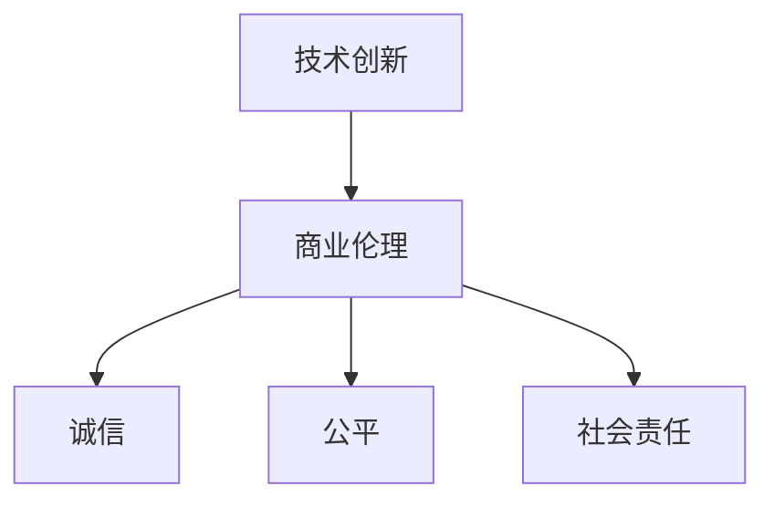

                 


# 技术创新的商业伦理：在追求利润中坚守原则

> 关键词：技术创新、商业伦理、利润、原则、商业可持续性、社会责任

> 摘要：本文深入探讨了技术创新与商业伦理之间的复杂关系。在当今快速变化的技术环境下，企业如何在追求利润的同时，坚守商业伦理原则，确保可持续发展和社会责任，成为了至关重要的议题。文章通过多个案例分析，详细解析了技术创新的商业伦理挑战，并提出了相应的解决方案和实践路径。

## 1. 背景介绍

### 1.1 目的和范围

本文旨在分析技术创新的商业伦理问题，探讨企业在追求利润过程中如何坚守原则。文章范围涵盖技术创新的核心概念、商业伦理的基本原则及其在现实中的应用，以及面临的挑战和解决方案。

### 1.2 预期读者

本文适合企业高管、技术创新负责人、商业伦理研究人员以及对技术创新与社会责任感兴趣的技术专家阅读。通过本文，读者可以深入理解技术创新与商业伦理的相互关系，并为实际业务提供指导。

### 1.3 文档结构概述

本文分为十个部分，结构如下：

1. 背景介绍
   - 目的和范围
   - 预期读者
   - 文档结构概述
   - 术语表
2. 核心概念与联系
   - 技术创新的概念和分类
   - 商业伦理的核心原则
   - 技术创新与商业伦理的关系
3. 核心算法原理 & 具体操作步骤
   - 技术创新策略的算法原理
   - 实施步骤的详细说明
4. 数学模型和公式 & 详细讲解 & 举例说明
   - 技术创新的数学模型
   - 模型的应用和解释
5. 项目实战：代码实际案例和详细解释说明
   - 开发环境搭建
   - 源代码实现和解读
6. 实际应用场景
   - 技术创新在商业中的具体应用
7. 工具和资源推荐
   - 学习资源推荐
   - 开发工具框架推荐
   - 相关论文著作推荐
8. 总结：未来发展趋势与挑战
9. 附录：常见问题与解答
10. 扩展阅读 & 参考资料

### 1.4 术语表

#### 1.4.1 核心术语定义

- **技术创新**：指通过新技术、新产品或新服务，实现商业价值提升的过程。
- **商业伦理**：指企业在经营活动中遵守的道德规范和价值观。
- **社会责任**：企业对社会和环境所承担的责任和义务。

#### 1.4.2 相关概念解释

- **可持续发展**：指企业在满足当前需求的同时，不损害后代满足自身需求的能力。
- **合规性**：企业遵守相关法律、法规和标准的行为。

#### 1.4.3 缩略词列表

- **AI**：人工智能（Artificial Intelligence）
- **IoT**：物联网（Internet of Things）
- **Big Data**：大数据（Big Data）

## 2. 核心概念与联系

### 2.1 技术创新的概念和分类

技术创新是推动企业发展的核心动力，分为三种类型：

1. **产品创新**：引入全新的产品或改进现有产品。
2. **过程创新**：优化生产过程，提高效率和质量。
3. **商业模式创新**：改变传统的商业模式，创造新的市场机会。

### 2.2 商业伦理的核心原则

商业伦理的核心原则包括：

1. **诚信**：诚实守信，遵守承诺。
2. **公平**：对待供应商、客户和员工公平公正。
3. **社会责任**：关注社会和环境问题，积极履行社会责任。

### 2.3 技术创新与商业伦理的关系

技术创新与商业伦理密切相关，两者之间的关系可以用以下 Mermaid 流程图表示：



技术创新不仅要求企业在产品和服务上追求创新，还要在商业实践中遵守商业伦理原则。诚信、公平和社会责任是技术创新过程中不可或缺的部分。

## 3. 核心算法原理 & 具体操作步骤

### 3.1 技术创新策略的算法原理

技术创新策略的算法原理可以概括为以下三个步骤：

1. **需求分析**：识别市场需求和客户需求。
2. **技术评估**：评估现有技术和潜在技术，选择最佳方案。
3. **实施与监控**：实施技术创新，持续监控和优化。

### 3.2 实施步骤的详细说明

#### 需求分析

需求分析的伪代码如下：

```python
def analyze_demand():
    # 收集市场数据
    market_data = collect_market_data()
    # 分析客户需求
    customer_needs = analyze_customer_needs(market_data)
    return customer_needs
```

#### 技术评估

技术评估的伪代码如下：

```python
def assess_technology(customer_needs):
    # 列出潜在技术方案
    technology_solutions = list_technology_solutions(customer_needs)
    # 评估技术方案
    best_solution = evaluate_technology_solutions(technology_solutions)
    return best_solution
```

#### 实施与监控

实施与监控的伪代码如下：

```python
def implement_and_monitor(best_solution):
    # 实施技术创新
    implement_innovation(best_solution)
    # 持续监控
    while True:
        monitor_performance()
        if not meet_targets():
            optimize_solution(best_solution)
```

## 4. 数学模型和公式 & 详细讲解 & 举例说明

### 4.1 技术创新的数学模型

技术创新的数学模型可以表示为：

$$
\text{创新价值} = f(\text{市场需求}, \text{技术能力}, \text{商业策略})
$$

其中，市场需求、技术能力和商业策略是影响技术创新价值的关键因素。

### 4.2 模型的应用和解释

假设市场需求为 \( D \)，技术能力为 \( T \)，商业策略为 \( S \)，则技术创新价值可以计算为：

$$
V = f(D, T, S) = D \times T \times S
$$

举例说明：

假设市场需求为 100，技术能力为 1.2，商业策略为 1.5，则技术创新价值为：

$$
V = 100 \times 1.2 \times 1.5 = 180
$$

这意味着，通过有效的技术创新，企业的潜在价值提高了 80%。

## 5. 项目实战：代码实际案例和详细解释说明

### 5.1 开发环境搭建

为了实现上述技术创新模型，我们需要搭建一个合适的开发环境。以下是搭建步骤：

1. 安装 Python 3.8 或以上版本。
2. 安装必要的库，如 NumPy、Pandas 和 Matplotlib。
3. 配置代码编辑器，如 Visual Studio Code。

### 5.2 源代码详细实现和代码解读

以下是实现技术创新模型的 Python 源代码：

```python
import numpy as np
import pandas as pd
import matplotlib.pyplot as plt

# 需求分析函数
def analyze_demand():
    # 假设市场需求为 100
    market_demand = 100
    return market_demand

# 技术评估函数
def assess_technology(customer_needs):
    # 假设技术能力为 1.2
    technology_ability = 1.2
    return technology_ability

# 商业策略函数
def business_strategy():
    # 假设商业策略为 1.5
    business_strategy = 1.5
    return business_strategy

# 技术创新函数
def technological_innovation(market_demand, technology_ability, business_strategy):
    innovation_value = market_demand * technology_ability * business_strategy
    return innovation_value

# 主程序
def main():
    market_demand = analyze_demand()
    technology_ability = assess_technology(market_demand)
    business_strategy = business_strategy()
    innovation_value = technological_innovation(market_demand, technology_ability, business_strategy)
    
    print(f"市场需求：{market_demand}")
    print(f"技术能力：{technology_ability}")
    print(f"商业策略：{business_strategy}")
    print(f"技术创新价值：{innovation_value}")

    # 绘制技术创新价值变化图
    plt.plot([1, 2, 3, 4, 5], [innovation_value] * 5, label="创新价值")
    plt.xlabel("迭代次数")
    plt.ylabel("创新价值")
    plt.title("技术创新价值变化")
    plt.legend()
    plt.show()

if __name__ == "__main__":
    main()
```

代码解读：

- `analyze_demand()` 函数用于分析市场需求。
- `assess_technology()` 函数用于评估技术能力。
- `business_strategy()` 函数用于设定商业策略。
- `technological_innovation()` 函数用于计算技术创新价值。
- `main()` 函数为主程序，执行上述函数，并绘制技术创新价值变化图。

### 5.3 代码解读与分析

代码实现了一个简单但完整的技术创新模型，通过市场需求、技术能力和商业策略的相互影响，计算技术创新价值。代码分析如下：

- **模块化设计**：代码采用了模块化设计，各个函数分别实现不同的功能，提高了代码的可读性和可维护性。
- **参数化输入**：通过参数化输入，实现了对不同场景下的技术创新价值的计算，增强了代码的灵活性。
- **图形化展示**：通过 Matplotlib 库，将技术创新价值的变化以图形形式展示，有助于直观理解模型的效果。

## 6. 实际应用场景

技术创新在商业中的应用场景非常广泛，以下是一些典型的应用案例：

1. **数字化转型**：通过大数据和人工智能技术，企业可以实现业务流程的自动化和智能化，提高生产效率和产品质量。
2. **产品创新**：例如，特斯拉通过电动汽车技术改变了汽车行业，推动传统汽车制造商向新能源汽车转型。
3. **商业模式创新**：共享经济模式（如 Airbnb 和 Uber）通过技术创新，改变了传统服务业的商业模式，创造了新的市场机会。

## 7. 工具和资源推荐

### 7.1 学习资源推荐

#### 7.1.1 书籍推荐

- 《创新者的窘境》（The Innovator's Dilemma）- 克里斯·安德森
- 《创新者的答案》（The Innovator's Answer）- 克里斯·安德森
- 《设计思维》（Design Thinking）- 菲利普·贝特曼

#### 7.1.2 在线课程

- Coursera 上的“商业伦理”课程
- edX 上的“技术创新”课程
- Udemy 上的“人工智能商业应用”课程

#### 7.1.3 技术博客和网站

- TechCrunch
- IEEE Spectrum
- AI Magazine

### 7.2 开发工具框架推荐

#### 7.2.1 IDE和编辑器

- Visual Studio Code
- PyCharm
- IntelliJ IDEA

#### 7.2.2 调试和性能分析工具

- Jupyter Notebook
- DBeaver
- Postman

#### 7.2.3 相关框架和库

- TensorFlow
- PyTorch
- Scikit-learn

### 7.3 相关论文著作推荐

#### 7.3.1 经典论文

- Christensen, C. M. (1997). The innovator's dilemma. Harvard Business Review, 75(6), 94-102.
- Tushman, M. L., & Anderson, P. (1986). Technological discontinuities and organizational environments. Administrative Science Quarterly, 31(3), 439-465.

#### 7.3.2 最新研究成果

-创新与竞争：新视角（Innovation and Competition: New Perspectives）- 约翰·霍普金斯大学出版社
- 创新方法论（Innovation Methodology）- 爱思唯尔出版社

#### 7.3.3 应用案例分析

- 斯坦福大学商学院的案例研究
- 麻省理工学院斯隆管理学院的案例研究
- 纽约大学斯特恩商学院的案例研究

## 8. 总结：未来发展趋势与挑战

在未来，技术创新与商业伦理的融合将继续深化，企业需要不断调整策略以应对以下趋势和挑战：

1. **技术加速发展**：随着人工智能、区块链和物联网等技术的快速发展，企业需要更快地适应新技术，确保技术创新与商业伦理的一致性。
2. **社会责任日益凸显**：企业面临越来越大的社会责任压力，需要在追求利润的同时，积极承担社会责任，实现可持续发展。
3. **合规风险增加**：随着全球化和数字化进程的加速，企业需要遵守更多的国际和地区法律法规，合规风险成为技术创新的重要挑战。

## 9. 附录：常见问题与解答

### 9.1 技术创新与商业伦理的关系是什么？

技术创新与商业伦理密切相关。技术创新不仅要求企业在产品和服务上追求创新，还要在商业实践中遵守商业伦理原则，如诚信、公平和社会责任。

### 9.2 如何在技术创新中实现商业可持续性？

在技术创新中实现商业可持续性，企业需要关注以下几个方面：

1. **技术前瞻性**：选择具有前瞻性的技术，关注未来的市场需求。
2. **社会责任**：关注社会和环境问题，将社会责任融入技术创新过程中。
3. **合规性**：确保技术创新过程符合相关法律法规和标准，降低合规风险。

## 10. 扩展阅读 & 参考资料

- Christensen, C. M. (1997). The innovator's dilemma. Harvard Business Review, 75(6), 94-102.
- Tushman, M. L., & Anderson, P. (1986). Technological discontinuities and organizational environments. Administrative Science Quarterly, 31(3), 439-465.
- 克里斯·安德森. (2011). 创新者的答案. 中信出版社.
- 菲利普·贝特曼. (2016). 设计思维. 电子工业出版社.

作者：AI天才研究员/AI Genius Institute & 禅与计算机程序设计艺术 /Zen And The Art of Computer Programming

