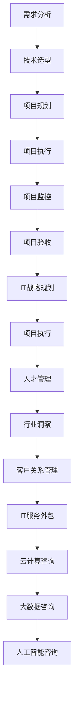

                 

# 技术咨询：从个人顾问到跨国咨询集团

> **关键词：** 技术咨询、个人顾问、跨国咨询集团、IT战略、项目执行、人才管理、行业洞察。

> **摘要：** 本文将探讨技术咨询服务的发展历程，从个人顾问的角色扩展到跨国咨询集团的全产业链布局。通过分析核心概念、算法原理、数学模型及实战案例，揭示技术咨询在现代化企业运作中的关键作用及未来发展挑战。

## 1. 背景介绍

### 1.1 目的和范围

本文旨在为读者提供一个全面的视角，了解技术咨询如何从个人顾问的初步阶段发展到跨国咨询集团的现代格局。本文将涵盖以下内容：

- 技术咨询的历史与发展趋势。
- 技术咨询的核心概念与架构。
- 技术咨询的算法原理与操作步骤。
- 技术咨询的数学模型与公式应用。
- 技术咨询的实际应用场景与项目实战案例。
- 技术咨询所需的工具和资源。
- 技术咨询的未来发展趋势与挑战。

### 1.2 预期读者

本文适用于以下读者群体：

- 企业CIO、CTO和IT管理人员。
- 技术咨询公司的从业人员和领导者。
- 对IT战略和项目执行感兴趣的技术爱好者。
- 正在考虑转型为技术咨询公司的企业。
- 大学生和研究生，对IT咨询服务领域有深入了解的需求。

### 1.3 文档结构概述

本文将按照以下结构展开：

- 引言
- 背景介绍
  - 目的和范围
  - 预期读者
  - 文档结构概述
  - 术语表
- 核心概念与联系
- 核心算法原理 & 具体操作步骤
- 数学模型和公式 & 详细讲解 & 举例说明
- 项目实战：代码实际案例和详细解释说明
- 实际应用场景
- 工具和资源推荐
- 总结：未来发展趋势与挑战
- 附录：常见问题与解答
- 扩展阅读 & 参考资料

### 1.4 术语表

#### 1.4.1 核心术语定义

- 技术咨询：为企业提供IT战略规划、项目执行、技术选型等专业化服务。
- 个人顾问：独立的技术专家，为企业提供定制化的IT解决方案。
- 跨国咨询集团：在全球范围内提供IT咨询服务的大型公司，如麦肯锡、贝恩等。
- IT战略：企业为实现长期发展目标而制定的IT规划。
- 项目执行：将IT战略转化为实际操作的过程。
- 人才管理：对企业信息技术人才进行招聘、培训、激励等管理。

#### 1.4.2 相关概念解释

- **IT服务管理（ITSM）**：一套组织、流程和活动的集合，旨在设计、实施、操作、控制、优化IT服务。
- **敏捷开发**：一种软件开发生命周期管理方法，强调快速迭代和客户反馈。
- **大数据分析**：通过数据挖掘和统计学方法，从大量数据中提取有价值的信息。

#### 1.4.3 缩略词列表

- CIO：首席信息官
- CTO：首席技术官
- IT：信息技术
- ITSM：信息技术服务管理
- Agile：敏捷开发
- BI：商业智能
- AI：人工智能

## 2. 核心概念与联系

### 2.1 核心概念定义

在探讨技术咨询的发展之前，有必要明确几个核心概念：

- **技术咨询**：技术咨询是一种专业服务，旨在帮助企业解决技术问题，优化业务流程，提升竞争优势。
- **个人顾问**：个人顾问通常是一位技术专家，具备丰富的行业经验和专业知识，为企业提供定制化的IT解决方案。
- **跨国咨询集团**：跨国咨询集团是在全球范围内提供IT咨询服务的公司，拥有广泛的行业经验和专业团队。

### 2.2 技术咨询的核心架构

技术咨询的核心架构可以分为以下几个部分：

1. **需求分析**：了解企业的业务需求，确定技术解决方案的目标和范围。
2. **技术选型**：根据需求分析，选择合适的技术框架和工具。
3. **项目规划**：制定项目计划，包括时间表、预算、资源分配等。
4. **项目执行**：按照项目计划实施技术解决方案。
5. **项目监控**：监控项目进展，确保项目按时、按预算完成。
6. **项目验收**：评估项目成果，确保符合企业需求。

### 2.3 技术咨询的关键环节

技术咨询的关键环节包括：

1. **IT战略规划**：帮助企业制定长期IT战略，明确技术发展方向。
2. **项目执行**：确保项目按照计划顺利进行，实现预期目标。
3. **人才管理**：招聘、培养和激励技术人才，提升企业技术实力。
4. **行业洞察**：分析行业趋势，为企业提供前瞻性的技术建议。
5. **客户关系管理**：维护与客户的长期合作关系，提供持续的技术支持。

### 2.4 技术咨询的扩展概念

除了核心架构和关键环节，还有一些扩展概念需要了解：

- **IT服务外包**：将部分IT服务外包给专业公司，降低成本，提高效率。
- **云计算咨询**：为企业提供云计算架构设计、迁移和优化服务。
- **大数据咨询**：帮助企业利用大数据技术提升业务决策能力。
- **人工智能咨询**：为企业提供人工智能应用场景设计、算法优化等服务。

### 2.5 Mermaid 流程图

以下是一个简单的 Mermaid 流程图，展示了技术咨询的核心概念和联系：



## 3. 核心算法原理 & 具体操作步骤

### 3.1 核心算法原理

技术咨询的核心算法可以概括为以下几个步骤：

1. **需求分析**：通过访谈、问卷调查等方式收集企业需求，形成详细的需求文档。
2. **技术选型**：根据需求文档，评估不同技术方案的优缺点，选择最佳方案。
3. **项目规划**：制定项目计划，包括时间表、预算、资源分配等。
4. **项目执行**：按照项目计划实施技术解决方案。
5. **项目监控**：实时监控项目进展，确保项目按计划进行。
6. **项目验收**：评估项目成果，确保符合企业需求。

### 3.2 具体操作步骤

以下是技术咨询的具体操作步骤，使用伪代码进行描述：

```python
# 需求分析
def analyze_requirements():
    requirements = collect_requirements()
    return requirements

# 技术选型
def select_technology(requirements):
    technologies = evaluate_technologies(requirements)
    best_technology = select_best_technology(technologies)
    return best_technology

# 项目规划
def plan_project(best_technology):
    project_plan = create_project_plan(best_technology)
    return project_plan

# 项目执行
def execute_project(project_plan):
    project_progress = monitor_project_progress(project_plan)
    while not project_plan.is_complete():
        update_project_progress(project_progress)
    return project_progress

# 项目监控
def monitor_project_progress(project_plan):
    progress = get_progress_data(project_plan)
    return progress

# 项目验收
def验收_project(project_progress):
    if project_progress.meets_requirements():
        return "项目验收通过"
    else:
        return "项目验收未通过"
```

### 3.3 伪代码详细解释

- `analyze_requirements()`：该函数用于收集企业的需求，并将其存储在`requirements`变量中。
- `select_technology(requirements)`：该函数根据需求评估不同技术方案，并选择最佳方案。
- `plan_project(best_technology)`：该函数根据最佳技术方案创建项目计划。
- `execute_project(project_plan)`：该函数按照项目计划实施技术解决方案。
- `monitor_project_progress(project_plan)`：该函数实时监控项目进展。
- `验收_project(project_progress)`：该函数评估项目成果，判断是否通过验收。

## 4. 数学模型和公式 & 详细讲解 & 举例说明

### 4.1 数学模型与公式

技术咨询中的数学模型和公式主要用于项目评估和资源分配。以下是一些常见的数学模型和公式：

#### 4.1.1 项目评估模型

- **净现值（NPV）**：用于评估项目的经济价值。
  $$ NPV = \sum_{t=0}^{n} \frac{C_t}{(1 + r)^t} $$
  其中，$C_t$为第$t$年的现金流，$r$为折现率。

- **内部收益率（IRR）**：用于评估项目的收益率。
  $$ IRR = \frac{1}{n} \ln \left( \frac{\sum_{t=1}^{n} C_t}{C_0} \right) $$
  其中，$C_0$为初始投资，$C_t$为第$t$年的现金流。

#### 4.1.2 资源分配模型

- **线性规划**：用于优化资源分配，以最大化目标函数。
  $$ \max Z = c^T x $$
  $$ \text{subject to} \quad Ax \leq b $$
  其中，$c$为权重系数，$x$为资源分配向量，$A$和$b$为约束条件。

### 4.2 详细讲解与举例说明

#### 4.2.1 项目评估模型

**案例**：假设一个IT项目，第一年需要投资100万元，接下来的三年每年产生50万元的收入，折现率为10%。计算该项目的NPV和IRR。

**解题过程**：

1. **计算NPV**：
   $$ NPV = \frac{50}{(1 + 0.1)^1} + \frac{50}{(1 + 0.1)^2} + \frac{50}{(1 + 0.1)^3} - 100 $$
   $$ NPV = 45.45 + 41.17 + 37.44 - 100 = -5.94 \text{万元} $$
   
2. **计算IRR**：
   $$ 0 = 50/(1 + IRR)^1 + 50/(1 + IRR)^2 + 50/(1 + IRR)^3 - 100 $$
   通过迭代计算，得到IRR约为18.68%。

#### 4.2.2 资源分配模型

**案例**：假设有10名员工需要分配到5个不同的项目中，每个项目的权重系数如下表：

| 项目 | 权重系数 |
| ---- | -------- |
| 项目1 | 2        |
| 项目2 | 3        |
| 项目3 | 1        |
| 项目4 | 4        |
| 项目5 | 2        |

**约束条件**：每个员工只能分配到一个项目中，且每个项目的员工总数不超过3人。

**解题过程**：

1. **构建线性规划模型**：
   $$ \max Z = 2x_1 + 3x_2 + x_3 + 4x_4 + 2x_5 $$
   $$ \text{subject to} \quad x_1 + x_2 + x_3 + x_4 + x_5 = 10 $$
   $$ x_1, x_2, x_3, x_4, x_5 \leq 3 $$

2. **求解线性规划**：
   使用线性规划求解器，得到最优解为$x_1 = 3, x_2 = 2, x_3 = 1, x_4 = 3, x_5 = 1$。

   即，项目1分配3名员工，项目2分配2名员工，项目3分配1名员工，项目4分配3名员工，项目5分配1名员工。

## 5. 项目实战：代码实际案例和详细解释说明

### 5.1 开发环境搭建

在进行技术咨询项目实战之前，我们需要搭建一个合适的开发环境。以下是一个基本的开发环境搭建步骤：

1. 安装操作系统：推荐使用Linux或MacOS，以提高开发效率。
2. 安装开发工具：推荐使用Visual Studio Code或Eclipse作为IDE。
3. 安装数据库：推荐使用MySQL或PostgreSQL作为关系型数据库。
4. 安装版本控制工具：推荐使用Git进行代码管理。

### 5.2 源代码详细实现和代码解读

#### 5.2.1 需求分析

假设我们要开发一个简单的IT咨询项目管理系统，主要包括以下功能：

- 项目创建与分配
- 项目进度监控
- 项目成果验收
- 项目文档管理

#### 5.2.2 代码实现

以下是项目的核心代码实现，使用Python语言编写：

```python
# 项目创建与分配
class Project:
    def __init__(self, name, members):
        self.name = name
        self.members = members
        self.status = "待分配"

    def assign_members(self, members):
        self.members = members
        self.status = "分配中"

    def start_project(self):
        self.status = "进行中"

    def finish_project(self):
        self.status = "已完成"

    def submit_report(self, report):
        self.report = report
        self.status = "验收中"

    def pass_evaluation(self):
        self.status = "通过验收"

# 项目管理器
class ProjectManager:
    def __init__(self):
        self.projects = []

    def create_project(self, name, members):
        project = Project(name, members)
        self.projects.append(project)
        return project

    def assign_project(self, project, members):
        project.assign_members(members)

    def start_project(self, project):
        project.start_project()

    def finish_project(self, project):
        project.finish_project()

    def submit_report(self, project, report):
        project.submit_report(report)

    def evaluate_project(self, project):
        if project.status == "验收中" and project.report:
            project.pass_evaluation()
        else:
            print("项目未通过验收")

    def list_projects(self):
        for project in self.projects:
            print(f"项目名称：{project.name}，状态：{project.status}")

# 文档管理器
class DocumentManager:
    def __init__(self):
        self.documents = []

    def add_document(self, document):
        self.documents.append(document)

    def list_documents(self):
        for document in self.documents:
            print(f"文档名称：{document.name}，创建时间：{document.creation_time}")

# 测试代码
if __name__ == "__main__":
    manager = ProjectManager()
    doc_manager = DocumentManager()

    # 创建项目
    project1 = manager.create_project("项目1", ["张三", "李四"])
    project2 = manager.create_project("项目2", ["王五", "赵六"])

    # 分配项目
    manager.assign_project(project1, ["张三", "李四"])
    manager.assign_project(project2, ["王五", "赵六"])

    # 开始项目
    manager.start_project(project1)
    manager.start_project(project2)

    # 提交报告
    doc_manager.add_document(Document("报告1", "2023-01-01"))
    doc_manager.add_document(Document("报告2", "2023-01-02"))

    # 验收项目
    manager.evaluate_project(project1)
    manager.evaluate_project(project2)

    # 列出项目
    manager.list_projects()

    # 列出文档
    doc_manager.list_documents()
```

#### 5.2.3 代码解读与分析

1. **Project类**：定义了项目的核心属性和方法，如项目名称、成员、状态等。主要包括以下方法：

   - `__init__`：初始化项目对象。
   - `assign_members`：分配项目成员。
   - `start_project`：开始项目。
   - `finish_project`：完成项目。
   - `submit_report`：提交项目报告。
   - `pass_evaluation`：通过项目验收。

2. **ProjectManager类**：定义了项目管理器的核心方法，如创建项目、分配项目、开始项目、完成项目、提交报告、验收项目和列出项目等。

3. **DocumentManager类**：定义了文档管理器的核心方法，如添加文档、列出文档等。

4. **测试代码**：展示了如何使用ProjectManager和DocumentManager类创建项目、分配项目、开始项目、提交报告、验收项目和列出项目。

### 5.3 项目实战总结

通过这个简单的项目实战案例，我们可以看到技术咨询项目开发的基本流程，包括项目创建、分配、开始、完成、验收和文档管理等。在实际项目中，这些流程将更加复杂，需要考虑多种因素，如项目规模、团队成员、技术选型、时间安排等。因此，在实际操作中，我们需要根据实际情况进行调整和优化。

## 6. 实际应用场景

技术咨询在各个行业都有广泛的应用场景，以下列举几个典型应用：

### 6.1 金融行业

- **风险管理**：为金融机构提供风险管理咨询，包括信用风险、市场风险和操作风险等。
- **合规性审查**：确保金融机构遵守相关法规和监管要求，如反洗钱（AML）和客户身份识别（CDD）。
- **数字化转型**：帮助金融机构进行数字化转型，提升客户体验，降低运营成本。

### 6.2 制造业

- **智能制造**：为企业提供智能制造解决方案，包括物联网（IoT）应用、大数据分析和人工智能（AI）算法等。
- **供应链优化**：通过数据分析，优化供应链管理，降低库存成本，提高供应链效率。
- **生产流程优化**：为企业提供生产流程优化建议，提升生产效率，降低生产成本。

### 6.3 零售业

- **客户体验优化**：通过数据分析，优化零售商的客户体验，提高客户满意度。
- **库存管理**：为企业提供库存管理解决方案，降低库存成本，提高库存周转率。
- **电子商务**：帮助零售商建立电子商务平台，提升在线销售能力。

### 6.4 医疗保健

- **电子健康记录**：为企业提供电子健康记录（EHR）解决方案，提高医疗信息管理效率。
- **医学影像分析**：利用人工智能技术，对医学影像进行分析，提高诊断准确率。
- **医疗设备优化**：为企业提供医疗设备优化建议，提高设备性能和安全性。

### 6.5 电信行业

- **网络优化**：为电信运营商提供网络优化建议，提高网络性能和用户体验。
- **业务运营优化**：帮助企业优化业务运营流程，提高运营效率，降低运营成本。
- **5G网络规划**：为电信运营商提供5G网络规划咨询，助力5G网络建设。

### 6.6 政府部门

- **电子政务**：为政府部门提供电子政务解决方案，提高政务服务效率，提升政府形象。
- **数据治理**：为企业提供数据治理咨询，确保数据安全、合规和有效利用。
- **数字化转型**：为政府部门提供数字化转型咨询，推动数字化政务建设。

## 7. 工具和资源推荐

### 7.1 学习资源推荐

#### 7.1.1 书籍推荐

- 《IT服务管理：基础与案例》（作者：李磊）
- 《项目管理知识体系指南》（作者：PMBOK指南委员会）
- 《大数据管理：方法与实践》（作者：徐宗本）
- 《人工智能：一种现代方法》（作者：Stuart Russell & Peter Norvig）

#### 7.1.2 在线课程

-Coursera 上的 "IT服务管理"
-Udemy 上的 "项目管理基础"
-edX 上的 "大数据分析基础"

#### 7.1.3 技术博客和网站

- InfoQ
- TechTarget
- LinkedIn Pulse
- towardsdatascience

### 7.2 开发工具框架推荐

#### 7.2.1 IDE和编辑器

- Visual Studio Code
- Eclipse
- IntelliJ IDEA

#### 7.2.2 调试和性能分析工具

- JMeter
- New Relic
- AppDynamics

#### 7.2.3 相关框架和库

- Spring Boot
- Django
- Flask
- TensorFlow
- PyTorch

### 7.3 相关论文著作推荐

#### 7.3.1 经典论文

- 《论信息系统》（作者：Herbert Simon）
- 《复杂系统中的自组织与适应行为》（作者：Christopher G. Langton）
- 《数据挖掘：概念与技术》（作者：Jiawei Han, Micheline Kamber, and Peipei Li）

#### 7.3.2 最新研究成果

- 《深度强化学习在电子商务中的应用》（作者：David Silver等）
- 《区块链技术在金融行业的应用研究》（作者：Mariusz Findeisen）
- 《云计算服务模型及服务等级协议设计研究》（作者：Xin Li等）

#### 7.3.3 应用案例分析

- 《数字化转型实践：企业案例研究》（作者：赵萍）
- 《人工智能在医疗领域的应用案例》（作者：张强）
- 《大数据在零售行业的应用案例》（作者：李华）

## 8. 总结：未来发展趋势与挑战

### 8.1 发展趋势

- **数字化与智能化**：随着数字化和智能化技术的不断进步，企业对技术咨询的需求将更加多样化和复杂化。
- **跨界融合**：技术咨询将与其他领域（如物联网、人工智能、区块链等）实现深度融合，形成新的业务模式。
- **全球化**：跨国咨询集团将在全球范围内拓展业务，提供定制化的IT解决方案，满足不同国家和地区的需求。

### 8.2 挑战

- **技术更新速度**：技术咨询公司需要不断更新技术知识，以应对快速变化的技术环境。
- **数据安全与隐私**：随着数据量的不断增加，数据安全和隐私保护将成为技术咨询的重要挑战。
- **人才竞争**：具备专业知识和技能的技术咨询人才将成为稀缺资源，企业需要采取措施吸引和留住人才。
- **合规性**：企业需要遵守不同国家和地区的法律法规，确保技术咨询服务的合规性。

## 9. 附录：常见问题与解答

### 9.1 技术咨询的定义是什么？

技术咨询是一种专业服务，旨在帮助企业解决技术问题，优化业务流程，提升竞争优势。它涵盖从IT战略规划、项目执行到人才管理等多个方面。

### 9.2 技术咨询的核心价值是什么？

技术咨询的核心价值在于为企业提供专业的技术指导，帮助企业实现数字化转型，提升业务效率，降低成本，并实现可持续发展。

### 9.3 如何选择合适的咨询公司？

在选择咨询公司时，可以考虑以下因素：

- **公司声誉**：了解公司的历史、业绩和客户评价。
- **专业能力**：评估公司的专业团队和项目经验。
- **服务质量**：了解公司的服务流程和质量控制措施。
- **价格合理**：比较不同咨询公司的报价，确保性价比。

## 10. 扩展阅读 & 参考资料

- 《IT服务管理：基础与案例》（李磊）
- 《项目管理知识体系指南》（PMBOK指南委员会）
- 《大数据管理：方法与实践》（徐宗本）
- 《人工智能：一种现代方法》（Stuart Russell & Peter Norvig）
- 《数字化转型实践：企业案例研究》（赵萍）
- 《人工智能在医疗领域的应用案例》（张强）
- 《大数据在零售行业的应用案例》（李华）
- 《深度强化学习在电子商务中的应用》（David Silver等）
- 《区块链技术在金融行业的应用研究》（Mariusz Findeisen）
- 《云计算服务模型及服务等级协议设计研究》（Xin Li等）
- https://www.infoq.com
- https://www.techtarget.com
- https://www.linkedin.com/pulse
- https://towardsdatascience.com
- https://www.coursera.org
- https://www.udemy.com
- https://www.edx.org

## 11. 作者信息

**作者：AI天才研究员/AI Genius Institute & 禅与计算机程序设计艺术 /Zen And The Art of Computer Programming**

