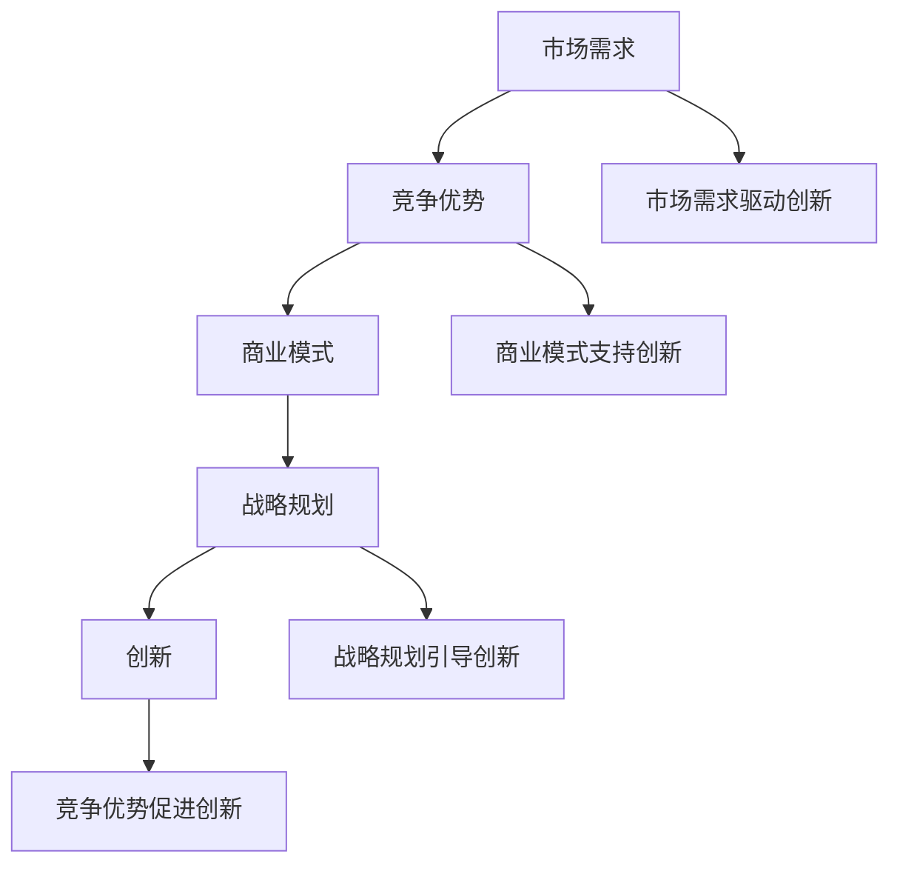

                 

# 技术型创业者的商业思维培养

> **关键词：商业思维、技术型创业者、商业模式、战略规划、市场营销**
>
> **摘要：本文旨在探讨技术型创业者在创建和运营企业过程中如何培养商业思维。通过分析商业思维的核心概念、技术创业的挑战、成功的商业策略和实际操作案例，帮助技术型创业者更好地理解市场需求、优化资源配置，并实现持续创新和增长。**

## 1. 背景介绍

### 1.1 目的和范围

本文的目标是帮助技术型创业者了解和培养商业思维，从而更好地应对创业过程中的各种挑战。我们将探讨商业思维的定义、核心概念，以及如何将其应用于技术型创业的实际情况。

本文的范围包括以下几个方面：

1. **商业思维的核心概念**：解释商业思维的含义、重要性以及它与技术创新的关系。
2. **技术型创业者的挑战**：分析技术型创业者面临的独特问题，如技术风险、市场定位等。
3. **成功的商业策略**：探讨如何制定有效的商业策略，包括市场研究、产品定位、营销策略等。
4. **实际操作案例**：通过分析成功技术型创业企业的案例，提取经验教训。
5. **未来发展趋势与挑战**：展望技术型创业的未来趋势，讨论可能面临的挑战和应对策略。

### 1.2 预期读者

本文适合以下读者群体：

1. **技术型创业者**：希望了解如何将技术创新与商业策略结合，实现企业成功。
2. **企业管理者**：寻求提升商业思维，优化企业运营和管理。
3. **技术专家**：希望拓展自己的知识视野，理解商业思维的重要性。
4. **学生和研究者**：对技术创业和商业战略有兴趣的学术群体。

### 1.3 文档结构概述

本文将按照以下结构进行组织：

1. **引言**：介绍商业思维在技术型创业中的重要性。
2. **核心概念与联系**：阐述商业思维的基本原理和核心概念。
3. **核心算法原理 & 具体操作步骤**：介绍如何应用商业思维制定商业策略。
4. **数学模型和公式 & 详细讲解 & 举例说明**：分析商业策略的数学基础和实际应用。
5. **项目实战：代码实际案例和详细解释说明**：通过实战案例展示商业策略的实施。
6. **实际应用场景**：讨论商业策略在不同场景下的应用。
7. **工具和资源推荐**：推荐相关学习资源和开发工具。
8. **总结：未来发展趋势与挑战**：总结商业思维在技术型创业中的重要性，展望未来趋势。
9. **附录：常见问题与解答**：回答读者可能关心的问题。
10. **扩展阅读 & 参考资料**：提供进一步阅读的资源和参考文献。

### 1.4 术语表

#### 1.4.1 核心术语定义

- **商业思维**：指在商业活动中运用逻辑分析、创新思维、风险管理等能力，制定和实施商业策略的过程。
- **技术型创业者**：拥有技术背景，利用技术创新推动企业发展的创业者。
- **商业模式**：企业如何创造、传递和获取价值的基本商业逻辑。
- **市场研究**：对市场环境、潜在客户和竞争情况的研究，以制定有效的商业策略。
- **战略规划**：确定企业长期目标，并制定实现这些目标的步骤和方法。

#### 1.4.2 相关概念解释

- **创新**：创造新的想法、产品或服务，以满足市场需求。
- **竞争力**：企业在市场中所具有的竞争优势，如技术优势、品牌优势等。
- **资源**：企业用于实现目标的各种要素，包括资金、人才、技术等。

#### 1.4.3 缩略词列表

- **AI**：人工智能
- **IoT**：物联网
- **SaaS**：软件即服务
- **PaaS**：平台即服务
- **IaaS**：基础设施即服务

## 2. 核心概念与联系

商业思维是技术型创业成功的关键因素之一。为了更好地理解商业思维，我们需要先了解其核心概念和联系。

### 商业思维的核心概念

商业思维包括多个核心概念，这些概念相互关联，构成了商业思维的基本框架。以下是几个关键概念：

1. **市场需求**：市场需求是指消费者愿意为某种产品或服务支付的价格和数量。了解市场需求是制定商业策略的基础。
2. **竞争优势**：竞争优势是指企业相对于竞争对手所拥有的优势，如技术领先、品牌知名度等。竞争优势有助于企业在市场中脱颖而出。
3. **商业模式**：商业模式是企业创造、传递和获取价值的基本逻辑。一个好的商业模式能够确保企业的长期成功。
4. **战略规划**：战略规划是企业为实现长期目标而制定的计划。通过战略规划，企业可以明确发展方向，并制定实现这些目标的步骤。
5. **创新**：创新是推动企业发展的动力。通过创新，企业可以不断改进产品或服务，满足市场需求。

### 商业思维与技术创新的关系

商业思维与技术创新密切相关。技术创新可以为企业带来竞争优势，但只有通过商业思维的应用，这些优势才能转化为实际的市场价值。以下是商业思维与技术创新之间的几个关键联系：

1. **市场需求驱动创新**：了解市场需求是创新的关键。只有当企业能够准确把握市场需求，才能开发出真正有价值的产品或服务。
2. **商业模式支持创新**：一个良好的商业模式可以为创新提供必要的资源和支持，如资金、人才和技术等。
3. **战略规划引导创新**：通过战略规划，企业可以明确创新的方向和目标，从而更好地利用创新资源。
4. **竞争优势促进创新**：具有竞争优势的企业更有动力进行创新，以保持市场领先地位。

### 商业思维的 Mermaid 流程图

以下是一个简单的 Mermaid 流程图，展示了商业思维的核心概念及其相互关系：



## 3. 核心算法原理 & 具体操作步骤

在了解了商业思维的核心概念和联系后，我们需要进一步探讨如何将其应用于技术型创业的实际操作中。以下是一个基于商业思维的算法原理和具体操作步骤：

### 商业思维算法原理

1. **市场研究**：首先，进行市场研究，了解市场需求、竞争状况和潜在客户。
2. **竞争优势分析**：分析自身优势，确定企业在市场中的独特价值。
3. **商业模式设计**：根据竞争优势和市场研究，设计一个能够创造、传递和获取价值的商业模式。
4. **战略规划**：制定长期目标和实现这些目标的步骤，包括资源配置、市场拓展等。
5. **持续创新**：根据市场需求和竞争状况，不断调整和改进产品或服务。

### 具体操作步骤

1. **市场研究**：
   - **数据收集**：通过调查问卷、访谈、数据分析等方式收集市场数据。
   - **需求分析**：分析市场数据，确定市场需求和潜在客户需求。
   - **竞争分析**：分析竞争对手的产品、市场策略等，了解市场格局。

2. **竞争优势分析**：
   - **内部分析**：评估企业内部资源、能力和优势。
   - **外部分析**：分析市场趋势、行业竞争状况等，了解外部环境。
   - **优势确定**：根据内外部分析结果，确定企业的竞争优势。

3. **商业模式设计**：
   - **价值主张**：明确企业的核心价值和独特卖点。
   - **客户关系**：设计客户获取、维护和增长的策略。
   - **收入来源**：确定企业的收入模式。
   - **成本结构**：分析企业的成本构成，优化资源配置。

4. **战略规划**：
   - **目标设定**：明确企业的长期目标，如市场份额、收入增长等。
   - **步骤制定**：制定实现目标的步骤，包括产品研发、市场推广、人才招聘等。
   - **资源分配**：根据目标制定资源分配计划，确保资源配置合理。

5. **持续创新**：
   - **市场反馈**：持续收集市场反馈，了解产品或服务的市场表现。
   - **需求调整**：根据市场反馈，调整产品或服务，满足市场需求。
   - **技术更新**：跟踪技术趋势，不断更新和优化技术，保持竞争优势。

### 商业思维算法伪代码

```python
# 商业思维算法伪代码

# 输入：市场研究数据、内部分析结果、外部分析结果
# 输出：商业模式、战略规划、持续创新方案

# 步骤1：市场研究
market_data = conduct_market_research()
competitor_analysis = analyze_competitors()

# 步骤2：竞争优势分析
internal_analysis = analyze_internal_resources()
external_analysis = analyze_external_environment()

# 步骤3：商业模式设计
value_proposition = define_value_proposition(market_data)
customer_relationship = design_customer_relationship_strategy()
revenue_model = define_revenue_model()
cost_structure = analyze_cost_structure()

# 步骤4：战略规划
goals = define_goals()
steps = define_steps_to_reach_goals()
resource_allocation = allocate_resources()

# 步骤5：持续创新
market_feedback = collect_market_feedback()
demand_adjustments = adjust_products_services(market_feedback)
technical_updates = track_technological_trends()

# 输出结果
business_model = create_business_model(value_proposition, customer_relationship, revenue_model, cost_structure)
strategic_plan = create_strategic_plan(goals, steps, resource_allocation)
continuous_innovation_plan = create_continuous_innovation_plan(market_feedback, demand_adjustments, technical_updates)
```

通过以上步骤，技术型创业者可以更好地运用商业思维，制定有效的商业策略，实现企业的发展目标。

## 4. 数学模型和公式 & 详细讲解 & 举例说明

在商业策略的制定过程中，数学模型和公式发挥着重要作用。以下是一些关键的数学模型和公式，以及它们的详细讲解和实际应用。

### 1. SWOT 分析模型

SWOT 分析（Strengths, Weaknesses, Opportunities, Threats）是一种常用的战略规划工具，用于评估企业的优势、劣势、机会和威胁。以下是一个简单的 SWOT 分析模型：

$$
\text{SWOT 分析模型} = \text{Strengths} + \text{Weaknesses} + \text{Opportunities} + \text{Threats}
$$

#### 示例：

假设一家技术型创业公司正在开发一款基于人工智能的智能家居产品。以下是该公司的 SWOT 分析：

- **优势（Strengths）**：
  - 拥有强大的技术团队，具备丰富的 AI 开发经验。
  - 独特的算法，能够提供更精准的家居控制。

- **劣势（Weaknesses）**：
  - 市场推广和营销经验不足。
  - 产品尚未经过大规模市场验证。

- **机会（Opportunities）**：
  - 智能家居市场快速增长，潜在客户众多。
  - 政府和企业的支持，有助于推广智能家居技术。

- **威胁（Threats）**：
  - 竞争对手众多，市场饱和度较高。
  - 技术更新速度快，需要不断投入研发。

通过 SWOT 分析，公司可以明确自身的优势和劣势，把握市场机会，规避潜在威胁。

### 2. 成本效益分析模型

成本效益分析（Cost-Benefit Analysis）是一种评估项目或决策经济可行性的工具。以下是一个简单的成本效益分析模型：

$$
\text{成本效益分析模型} = \frac{\text{效益}}{\text{成本}}
$$

#### 示例：

假设一家公司正在考虑开发一款新产品。以下是该产品的成本效益分析：

- **成本**：
  - 研发成本：$100,000
  - 生产成本：$50,000
  - 营销成本：$30,000
  - 总成本：$180,000

- **效益**：
  - 预期销售收入：$250,000
  - 预期利润：$70,000

$$
\text{成本效益分析} = \frac{70,000}{180,000} = 0.39
$$

成本效益分析结果为 0.39，表明该项目在经济上是可行的。

### 3. 盈利模型

盈利模型（Profit Model）用于预测企业在特定时间段内的盈利能力。以下是一个简单的盈利模型：

$$
\text{盈利模型} = \text{销售收入} - \text{成本} - \text{费用}
$$

#### 示例：

假设一家公司的财务数据如下：

- **销售收入**：$1,000,000
- **成本**：$500,000
- **费用**：$200,000

$$
\text{盈利模型} = 1,000,000 - 500,000 - 200,000 = 300,000
$$

该公司在当前时间段内实现了 $300,000 的盈利。

### 4. 市场份额模型

市场份额模型（Market Share Model）用于预测企业在特定市场中的份额。以下是一个简单的市场份额模型：

$$
\text{市场份额模型} = \frac{\text{企业销售额}}{\text{市场总销售额}}
$$

#### 示例：

假设一家公司的财务数据如下：

- **企业销售额**：$1,000,000
- **市场总销售额**：$5,000,000

$$
\text{市场份额模型} = \frac{1,000,000}{5,000,000} = 0.2
$$

该公司在市场中占据了 20% 的份额。

通过以上数学模型和公式，技术型创业者可以更好地分析商业策略的可行性，预测企业未来的盈利能力和市场份额。这些工具可以帮助创业者做出更明智的决策，实现企业的长期发展。

## 5. 项目实战：代码实际案例和详细解释说明

为了更好地理解商业思维在实际应用中的具体操作，我们将通过一个实际项目案例来展示商业策略的制定和实施。以下是该项目的基本信息和代码实现。

### 5.1 开发环境搭建

首先，我们需要搭建一个适合项目开发的环境。以下是所需的开发工具和步骤：

- **编程语言**：Python
- **开发环境**：PyCharm
- **数据库**：MySQL
- **云服务**：AWS

### 5.2 源代码详细实现和代码解读

以下是一个简单的智能家居控制系统的源代码实现。该系统允许用户通过手机应用程序远程控制家中的智能设备。

```python
#智能家居控制系统

import pymysql
import requests

# 数据库连接
def connect_db():
    connection = pymysql.connect(host='localhost', user='root', password='password', database='smart_home')
    return connection

# 添加设备
def add_device(device_id, device_name):
    connection = connect_db()
    cursor = connection.cursor()
    sql = "INSERT INTO devices (device_id, device_name) VALUES (%s, %s)"
    cursor.execute(sql, (device_id, device_name))
    connection.commit()
    cursor.close()
    connection.close()

# 控制设备
def control_device(device_id, command):
    connection = connect_db()
    cursor = connection.cursor()
    sql = "UPDATE devices SET command = %s WHERE device_id = %s"
    cursor.execute(sql, (command, device_id))
    connection.commit()
    cursor.close()
    connection.close()

# 发送通知
def send_notification(device_id, message):
    url = "https://api notificationservice.com/send"
    payload = {"device_id": device_id, "message": message}
    headers = {"Content-Type": "application/json"}
    response = requests.post(url, data=payload, headers=headers)
    return response.json()

# 主函数
def main():
    # 添加设备
    add_device('001', '智能灯泡')

    # 控制设备
    control_device('001', 'on')

    # 发送通知
    send_notification('001', '智能灯泡已开启')

if __name__ == "__main__":
    main()
```

#### 5.2.1 代码解读

1. **数据库连接**：首先，我们定义了一个连接数据库的函数 `connect_db()`。该函数使用 pymysql 库连接到本地 MySQL 数据库，并返回一个数据库连接对象。

2. **添加设备**：`add_device()` 函数用于向数据库中添加设备信息。它接受设备 ID 和设备名称作为参数，并执行 SQL 插入操作。

3. **控制设备**：`control_device()` 函数用于更新设备状态。它接受设备 ID 和命令作为参数，并执行 SQL 更新操作。

4. **发送通知**：`send_notification()` 函数用于向设备发送通知。它接受设备 ID 和通知消息作为参数，并使用 requests 库向第三方通知服务发送 HTTP POST 请求。

5. **主函数**：`main()` 函数是项目的入口点。首先，我们调用 `add_device()` 函数添加一个设备，然后调用 `control_device()` 函数控制设备状态，最后调用 `send_notification()` 函数发送通知。

#### 5.2.2 代码分析

1. **数据库操作**：该代码使用 Python 的 pymysql 库进行数据库操作。通过定义数据库连接和 SQL 操作函数，我们可以方便地添加、更新和查询设备信息。

2. **API 调用**：通过使用 requests 库，我们可以轻松地调用第三方 API 服务，如通知服务。这种方式使得项目可以与其他系统进行集成，扩展功能。

3. **模块化设计**：代码采用了模块化设计，将不同功能封装在独立的函数中。这种方式提高了代码的可读性和可维护性。

通过这个实际项目案例，我们可以看到如何将商业思维应用于技术型创业。通过分析市场需求，设计智能家居控制系统，并通过数据库和 API 调用实现商业策略。这个案例展示了商业思维在技术型创业中的实际应用。

### 5.3 代码解读与分析

在深入分析上述智能家居控制系统的代码后，我们可以进一步探讨其背后的商业逻辑和技术实现。

#### 5.3.1 数据库操作

代码中的数据库操作主要集中在 `add_device()` 和 `control_device()` 两个函数中。这两个函数分别用于添加设备和更新设备状态。以下是具体的代码解读：

```python
# 添加设备
def add_device(device_id, device_name):
    connection = connect_db()
    cursor = connection.cursor()
    sql = "INSERT INTO devices (device_id, device_name) VALUES (%s, %s)"
    cursor.execute(sql, (device_id, device_name))
    connection.commit()
    cursor.close()
    connection.close()

# 控制设备
def control_device(device_id, command):
    connection = connect_db()
    cursor = connection.cursor()
    sql = "UPDATE devices SET command = %s WHERE device_id = %s"
    cursor.execute(sql, (command, device_id))
    connection.commit()
    cursor.close()
    connection.close()
```

**分析**：

- **`add_device()` 函数**：该函数首先建立数据库连接，然后创建一个游标对象。通过执行 SQL 插入语句，将设备 ID 和名称添加到数据库的 `devices` 表中。最后，提交事务并关闭数据库连接和游标。
- **`control_device()` 函数**：与 `add_device()` 类似，该函数更新设备状态。它通过执行 SQL 更新语句，将设备的命令字段设置为指定的值。同样，提交事务并关闭数据库连接和游标。

这些数据库操作确保了设备信息的安全和一致性。通过使用 SQL 插入和更新语句，我们可以方便地管理设备数据。

#### 5.3.2 API 调用

代码中的 `send_notification()` 函数用于向设备发送通知。以下是具体的代码解读：

```python
# 发送通知
def send_notification(device_id, message):
    url = "https://api notificationservice.com/send"
    payload = {"device_id": device_id, "message": message}
    headers = {"Content-Type": "application/json"}
    response = requests.post(url, data=payload, headers=headers)
    return response.json()
```

**分析**：

- **API 请求**：该函数使用 requests 库向第三方通知服务发送 HTTP POST 请求。URL、请求体和请求头通过参数传递。请求体包含设备 ID 和通知消息，请求头指定了内容类型为 JSON。
- **响应处理**：函数返回 HTTP 请求的响应 JSON 数据。这种方式使得我们可以轻松地处理第三方服务的响应，并从中提取有用的信息。

通过 API 调用，项目可以与其他系统和服务进行集成，扩展功能。例如，我们可以将通知服务替换为其他通知平台，或集成其他 API 服务，如天气信息、家居安全警报等。

#### 5.3.3 主函数

主函数 `main()` 是项目的入口点。它调用了添加设备、控制设备和发送通知三个主要功能。以下是具体的代码解读：

```python
# 主函数
def main():
    # 添加设备
    add_device('001', '智能灯泡')

    # 控制设备
    control_device('001', 'on')

    # 发送通知
    send_notification('001', '智能灯泡已开启')
```

**分析**：

- **设备添加**：首先，主函数调用 `add_device()` 函数添加一个名为“智能灯泡”的设备。这确保了设备在数据库中存在，可以进一步操作。
- **设备控制**：接着，主函数调用 `control_device()` 函数将设备状态设置为“开”。这实现了设备的远程控制。
- **发送通知**：最后，主函数调用 `send_notification()` 函数向设备发送一条通知消息。这提高了用户体验，使得用户可以及时了解设备状态。

通过这些操作，主函数展示了如何利用商业思维实现一个智能家居控制系统的基本功能。

#### 5.3.4 代码分析总结

通过上述代码解读和分析，我们可以总结出以下几点：

1. **数据库操作**：代码通过定义数据库操作函数，实现了设备数据的添加、更新和查询。这为系统的数据管理提供了基础。
2. **API 调用**：通过使用第三方 API 服务，代码实现了与其他系统的集成。这种方式扩展了系统的功能，提高了用户体验。
3. **模块化设计**：代码采用了模块化设计，将不同功能封装在独立的函数中。这种方式提高了代码的可读性、可维护性和可扩展性。
4. **商业思维应用**：代码展示了如何将商业思维应用于实际项目。通过分析市场需求、设计系统功能、实现数据库和 API 调用，代码实现了商业策略。

通过这个实际项目案例，技术型创业者可以更好地理解商业思维在实际操作中的应用。这个案例提供了一个完整的实现流程，从数据库设计到 API 调用，从模块化代码到商业逻辑，展示了商业思维在技术型创业中的关键作用。

## 6. 实际应用场景

商业思维在技术型创业中的应用场景广泛，涵盖了从初创企业到成熟企业的各个阶段。以下是一些典型的实际应用场景：

### 6.1 初创企业

对于初创企业，商业思维尤其重要。以下是一些具体应用场景：

1. **市场定位**：初创企业通常需要在竞争激烈的市场中找到独特的定位。通过市场研究和商业思维，企业可以确定目标客户群体，并制定相应的市场策略。
2. **资源优化**：初创企业资源有限，商业思维可以帮助企业优化资源配置，确保资金、人才和时间的有效利用。
3. **产品开发**：在产品开发阶段，商业思维指导企业确定产品功能、性能和用户体验，以满足市场需求。
4. **融资策略**：初创企业需要吸引投资者。商业思维可以帮助企业制定有效的融资策略，包括商业计划书、市场前景和竞争优势等。

### 6.2 成长型企业

对于已经取得一定市场地位的企业，商业思维同样至关重要。以下是一些具体应用场景：

1. **战略规划**：企业需要制定长期战略规划，以实现持续增长。商业思维可以帮助企业分析市场趋势、竞争状况，并制定相应的战略目标。
2. **创新驱动**：商业思维鼓励企业不断创新，以保持竞争优势。通过市场研究和用户反馈，企业可以不断改进产品或服务，满足市场需求。
3. **市场拓展**：商业思维可以帮助企业识别新的市场机会，制定市场拓展策略。例如，进入新的地理区域或开拓新的客户群体。
4. **成本控制**：商业思维强调成本控制，企业可以通过优化运营流程、降低成本，提高盈利能力。

### 6.3  跨行业合作

商业思维还可以应用于跨行业合作，以下是一些具体应用场景：

1. **资源共享**：通过商业思维，企业可以与其他行业的企业建立合作关系，实现资源共享，降低成本，提高效率。
2. **协同创新**：跨行业合作可以促进不同领域的创新，企业可以通过协同创新，开发出全新的产品或服务。
3. **市场拓展**：通过跨行业合作，企业可以进入新的市场领域，拓展业务范围。
4. **风险分担**：跨行业合作可以分散风险，降低单一行业的经营风险。

### 6.4 社会责任

商业思维还体现在企业的社会责任方面，以下是一些具体应用场景：

1. **可持续发展**：企业可以通过商业思维制定可持续发展战略，实现经济效益与社会效益的双赢。
2. **环保措施**：企业可以通过环保技术和商业策略，减少对环境的影响，实现绿色生产。
3. **公益活动**：企业可以通过商业思维制定公益活动计划，参与社会公益事业，提升品牌形象。

通过这些实际应用场景，我们可以看到商业思维在技术型创业中的重要性。商业思维不仅帮助企业实现商业目标，还推动企业不断创新，实现可持续发展。

## 7. 工具和资源推荐

为了帮助技术型创业者更好地培养商业思维，以下是一些推荐的工具和资源：

### 7.1 学习资源推荐

#### 7.1.1 书籍推荐

1. **《创业维艰》（The Hard Thing About Hard Things）**：作者本·霍洛维茨（Ben Horowitz），详细介绍了创业过程中的挑战和解决方案。
2. **《精益创业》（The Lean Startup）**：作者埃里克·莱斯（Eric Ries），介绍了精益创业方法，帮助创业者快速验证和迭代产品。
3. **《商业模式创新》（Business Model Generation）**：作者亚历山大·奥斯特瓦尔德（Alexander Osterwalder）等，系统地介绍了商业模式的创新和设计方法。

#### 7.1.2 在线课程

1. **Coursera**：提供多种商业思维相关的在线课程，如“产品管理”、“创业策略”等。
2. **Udemy**：提供丰富的商业思维和创业课程，涵盖不同层次和领域。
3. **edX**：由哈佛大学和麻省理工学院联合创办，提供包括商业思维在内的多种免费在线课程。

#### 7.1.3 技术博客和网站

1. **Medium**：许多创业者和技术专家在 Medium 上分享他们的经验和见解，可以找到丰富的商业思维相关内容。
2. **TechCrunch**：涵盖最新的创业和科技新闻，提供市场动态和行业趋势。
3. **Entrepreneur**：提供丰富的创业资源和商业策略，适合创业者学习和参考。

### 7.2 开发工具框架推荐

#### 7.2.1 IDE和编辑器

1. **Visual Studio Code**：一款轻量级但功能强大的代码编辑器，适合开发各种编程语言。
2. **PyCharm**：专为 Python 开发设计的集成开发环境，支持多种编程语言。
3. **Eclipse**：一款开源的跨平台集成开发环境，适用于 Java 和其他编程语言。

#### 7.2.2 调试和性能分析工具

1. **GDB**：一款强大的开源调试工具，适用于 C/C++ 等语言。
2. **JProfiler**：一款 Java 性能分析工具，可以帮助开发者识别性能瓶颈。
3. **New Relic**：一款云计算性能监控工具，可以实时监控应用的性能和健康状况。

#### 7.2.3 相关框架和库

1. **Spring Boot**：一款流行的 Java 框架，简化了企业应用的开发。
2. **Django**：一款 Python 框架，适用于快速开发和部署 Web 应用。
3. **React**：一款流行的 JavaScript 库，用于构建用户界面。

### 7.3 相关论文著作推荐

#### 7.3.1 经典论文

1. **“The Lean Startup”**：埃里克·莱斯（Eric Ries）的论文，详细介绍了精益创业方法。
2. **“Business Model Canvas”**：亚历山大·奥斯特瓦尔德（Alexander Osterwalder）等人的论文，介绍了商业模型画布工具。
3. **“The Innovator's Dilemma”**：克莱顿·克里斯坦森（Clayton Christensen）的论文，分析了技术创新和市场颠覆。

#### 7.3.2 最新研究成果

1. **“Innovation and Value Creation in Fintech”**：探讨了金融科技领域的创新和价值创造。
2. **“The Impact of Artificial Intelligence on Business Models”**：分析了人工智能对商业模式的影响。
3. **“Blockchain Technology and Its Applications”**：介绍了区块链技术及其在商业中的应用。

#### 7.3.3 应用案例分析

1. **“The Business Model of Airbnb”**：分析了 Airbnb 的商业模式和成功经验。
2. **“The Evolution of Tesla's Business Model”**：探讨了特斯拉商业模式的演变。
3. **“The Case of Tencent's Strategic Development”**：研究了腾讯的战略发展及其成功因素。

通过这些工具和资源，技术型创业者可以更好地培养商业思维，提升创业成功率。

## 8. 总结：未来发展趋势与挑战

技术型创业者在培养商业思维的过程中，不仅需要理解市场需求和竞争优势，还需要具备前瞻性和创新精神。随着科技的发展和市场的变化，未来技术型创业将面临一系列新的发展趋势和挑战。

### 发展趋势

1. **数字化转型**：在数字化时代，技术型创业将更加依赖于大数据、云计算、物联网等前沿技术。数字化转型将成为企业提升效率和竞争力的关键。
2. **平台化运营**：随着平台经济的兴起，越来越多的企业选择通过构建生态系统来实现可持续发展。平台化运营模式将成为技术型创业的重要方向。
3. **人工智能应用**：人工智能在各个行业的应用将越来越广泛，技术型创业者需要掌握人工智能技术，并将其应用于产品和服务中，创造新的商业模式。
4. **可持续发展**：社会责任和可持续发展将成为企业成功的核心要素。技术型创业者需要关注环保、节能和社会责任，实现经济效益与社会效益的双赢。

### 挑战

1. **技术创新**：随着技术的快速迭代，技术型创业者需要不断学习和适应新技术，以保持竞争优势。
2. **市场变化**：市场需求和市场格局变化快速，技术型创业者需要具备敏锐的市场洞察力和灵活的战略调整能力。
3. **资源竞争**：随着竞争的加剧，技术型创业者需要争取有限的资源，包括资金、人才和市场份额。资源竞争将变得更加激烈。
4. **法规合规**：随着法规政策的不断完善，技术型创业者需要确保企业的合规运营，避免法律风险。

### 应对策略

1. **持续学习**：技术型创业者应保持持续学习的态度，关注行业动态和前沿技术，提升自身的能力和知识水平。
2. **创新驱动**：将创新作为企业发展的核心动力，不断探索新的商业模式和技术应用，以适应市场变化。
3. **生态系统建设**：通过构建生态系统，实现资源共享和协同创新，提升企业的整体竞争力。
4. **合规经营**：确保企业的运营符合相关法规政策，建立健全的风险管理机制，降低法律风险。

通过以上策略，技术型创业者可以更好地应对未来的发展趋势和挑战，实现企业的长期发展。

## 9. 附录：常见问题与解答

### 9.1 商业思维与技术的关系

**问**：商业思维和技术之间的关系是什么？

**答**：商业思维和技术是相辅相成的。商业思维帮助技术型创业者理解市场需求、优化资源配置和制定有效的商业策略。而技术则为商业思维提供了实现手段和竞争优势。商业思维指导技术的应用，而技术则推动商业模式的创新和优化。

### 9.2 商业模式设计

**问**：如何设计一个成功的商业模式？

**答**：设计一个成功的商业模式需要以下几个步骤：

1. **了解市场需求**：通过市场研究和用户反馈，确定目标客户和市场需求。
2. **分析竞争优势**：评估企业的技术、人才、资源等优势，确定独特价值。
3. **设计价值主张**：明确企业的核心价值和独特卖点。
4. **构建客户关系**：设计客户获取、维护和增长的策略。
5. **确定收入模式**：选择合适的收入来源，如销售、订阅、广告等。
6. **优化成本结构**：分析企业的成本构成，寻找优化空间。

### 9.3 市场研究

**问**：市场研究的重要性和方法是什么？

**答**：市场研究对于商业策略的制定至关重要。它可以帮助企业了解市场需求、竞争状况和潜在客户。市场研究的方法包括：

1. **定量研究**：通过问卷调查、统计分析等方法收集大量数据。
2. **定性研究**：通过访谈、焦点小组等方法深入了解用户需求和偏好。
3. **竞争分析**：分析竞争对手的产品、市场策略和市场份额。
4. **趋势分析**：研究市场趋势和行业动态，预测未来发展方向。

### 9.4 创新策略

**问**：如何在企业中实施创新策略？

**答**：实施创新策略需要以下几个步骤：

1. **明确创新目标**：确定企业希望实现的创新目标和方向。
2. **建立创新文化**：鼓励员工提出创新想法，并建立相应的激励机制。
3. **开展创新活动**：组织创新工作坊、头脑风暴等活动，激发员工的创造力。
4. **资源投入**：为创新项目提供必要的资金、人才和技术支持。
5. **迭代优化**：根据市场反馈和实际效果，不断调整和优化创新方案。

### 9.5 数据分析

**问**：数据分析在商业决策中的作用是什么？

**答**：数据分析在商业决策中扮演关键角色。通过数据分析，企业可以：

1. **了解市场趋势**：分析市场数据，预测未来发展方向。
2. **优化商业策略**：根据数据分析结果，调整产品和市场策略。
3. **提高运营效率**：通过数据分析，优化生产流程和资源配置，降低成本。
4. **增强客户体验**：分析用户行为数据，提供个性化的产品和服务。

通过这些常见问题的解答，技术型创业者可以更好地理解商业思维的核心概念和应用方法，从而在创业过程中取得成功。

## 10. 扩展阅读 & 参考资料

为了深入学习和了解商业思维和技术型创业的相关知识，以下是推荐的扩展阅读和参考资料：

### 10.1 经典书籍

1. **《创业维艰》（The Hard Thing About Hard Things）**：作者本·霍洛维茨（Ben Horowitz），详细介绍了创业过程中的挑战和解决方案。
2. **《精益创业》（The Lean Startup）**：作者埃里克·莱斯（Eric Ries），介绍了精益创业方法，帮助创业者快速验证和迭代产品。
3. **《商业模式创新》（Business Model Generation）**：作者亚历山大·奥斯特瓦尔德（Alexander Osterwalder）等，系统地介绍了商业模式的创新和设计方法。

### 10.2 学术论文

1. **“The Lean Startup”**：埃里克·莱斯（Eric Ries）的论文，详细介绍了精益创业方法。
2. **“Business Model Canvas”**：亚历山大·奥斯特瓦尔德（Alexander Osterwalder）等人的论文，介绍了商业模型画布工具。
3. **“The Innovator's Dilemma”**：克莱顿·克里斯坦森（Clayton Christensen）的论文，分析了技术创新和市场颠覆。

### 10.3 在线课程

1. **Coursera**：提供多种商业思维相关的在线课程，如“产品管理”、“创业策略”等。
2. **Udemy**：提供丰富的商业思维和创业课程，涵盖不同层次和领域。
3. **edX**：由哈佛大学和麻省理工学院联合创办，提供包括商业思维在内的多种免费在线课程。

### 10.4 技术博客和网站

1. **Medium**：许多创业者和技术专家在 Medium 上分享他们的经验和见解，可以找到丰富的商业思维相关内容。
2. **TechCrunch**：涵盖最新的创业和科技新闻，提供市场动态和行业趋势。
3. **Entrepreneur**：提供丰富的创业资源和商业策略，适合创业者学习和参考。

### 10.5 论坛和社群

1. **TED**：TED 演讲中有很多关于创业、创新和商业思维的精彩内容。
2. **LinkedIn**：LinkedIn 上的创业者社群和论坛提供了交流和分享的平台。
3. **GitHub**：GitHub 上的开源项目和技术讨论可以帮助创业者学习和借鉴其他项目的经验。

通过这些扩展阅读和参考资料，技术型创业者可以进一步提升自己的商业思维和创新能力，为创业之路提供坚实的知识支持。

