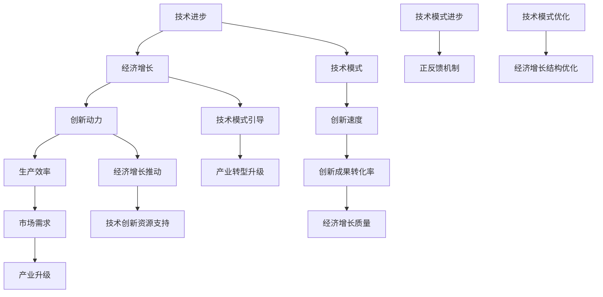

                 

### 1. 背景介绍

#### 1.1 目的和范围

本文旨在探讨技术模式减弱对经济增长带来的挑战。技术进步一直是推动经济增长的主要动力之一，然而，当技术模式逐渐减弱，传统技术的创新速度放缓，这将对全球经济产生深远的影响。本文将首先介绍技术模式减弱的定义，随后分析其对经济增长的具体影响，并探讨应对策略。

本文的讨论范围主要涉及以下几个方面：

1. 技术模式减弱的定义和特征。
2. 技术模式减弱对经济增长的影响。
3. 不同国家和地区的应对策略。
4. 未来技术发展的趋势和挑战。

#### 1.2 预期读者

本文适合以下读者群体：

1. 经济学家、研究人员和政策制定者，他们对技术对经济的影响感兴趣。
2. 技术企业家和创业者，他们希望了解技术模式减弱可能带来的商业机会和风险。
3. 计算机科学和信息技术专业的学生和专业人士，他们希望了解技术发展对经济的影响。

#### 1.3 文档结构概述

本文的结构如下：

1. **背景介绍**：介绍技术模式减弱对经济增长的影响，讨论范围和预期读者。
2. **核心概念与联系**：定义相关核心概念，并使用 Mermaid 流程图展示技术模式与经济增长的联系。
3. **核心算法原理 & 具体操作步骤**：详细阐述技术模式减弱的算法原理和具体操作步骤。
4. **数学模型和公式 & 详细讲解 & 举例说明**：介绍数学模型和公式，并通过实例进行详细讲解。
5. **项目实战：代码实际案例和详细解释说明**：提供代码实际案例，并详细解释其实现原理和过程。
6. **实际应用场景**：讨论技术模式减弱在不同领域的应用场景。
7. **工具和资源推荐**：推荐学习资源和开发工具。
8. **总结：未来发展趋势与挑战**：总结技术模式减弱的未来发展趋势和挑战。
9. **附录：常见问题与解答**：回答读者可能遇到的问题。
10. **扩展阅读 & 参考资料**：提供相关文献和资料。

#### 1.4 术语表

为了确保文章的可读性和一致性，本文定义了以下术语：

1. **技术模式减弱**：指技术进步的速度放缓，新技术的创新和推广速度下降。
2. **经济增长**：指一个国家或地区的国内生产总值（GDP）增长。
3. **算法原理**：指用于解决特定问题的数学或逻辑步骤。
4. **数学模型**：用于描述和预测现象的数学公式和方程式。
5. **Mermaid 流程图**：一种基于文本的绘图语言，用于描述流程和关系。
6. **伪代码**：一种非正式的编程语言，用于描述算法的基本结构和逻辑。

#### 1.4.1 核心术语定义

1. **技术模式减弱**：
   技术模式减弱是指技术创新和推广的速度下降，新技术的出现和应用放缓。这种减弱可能由多种因素引起，包括技术瓶颈、经济因素、政策限制等。

2. **经济增长**：
   经济增长是指一个国家或地区的国内生产总值（GDP）的增长。经济增长通常与技术创新和投资密切相关，技术创新是推动经济增长的重要动力。

3. **算法原理**：
   算法原理是指用于解决特定问题的数学或逻辑步骤。算法是计算机科学的核心概念，用于指导计算机完成特定任务。

4. **数学模型**：
   数学模型是指用于描述和预测现象的数学公式和方程式。数学模型在经济学、物理学、工程学等领域有广泛应用，用于分析和解决问题。

5. **Mermaid 流程图**：
   Mermaid 是一种基于文本的绘图语言，用于创建流程图、UML 图、甘特图等。它通过简单的文本标记，可以生成结构清晰、易于理解的图形。

6. **伪代码**：
   伪代码是一种非正式的编程语言，用于描述算法的基本结构和逻辑。它不遵循特定编程语言的语法规则，但可以清晰地表达算法的设计思路。

#### 1.4.2 相关概念解释

1. **技术创新**：
   技术创新是指新技术的发明、开发和应用。技术创新是推动经济增长的关键因素，它通过提高生产效率、降低成本、改善生活质量等方式，对经济产生积极影响。

2. **技术瓶颈**：
   技术瓶颈是指技术发展中遇到的关键难题，限制了技术的进一步进步。技术瓶颈可能源于科学原理、材料限制、资金投入等因素。

3. **经济因素**：
   经济因素是指影响经济增长的各种经济条件和因素，包括投资、消费、就业、通货膨胀等。

4. **政策限制**：
   政策限制是指政府或监管机构对技术发展的限制和规范，包括法律法规、行业规范、监管政策等。

5. **人工智能**：
   人工智能（AI）是指使计算机系统能够模拟人类智能行为的技术。人工智能在图像识别、自然语言处理、决策支持等领域有广泛应用，对经济和技术发展有重要影响。

6. **云计算**：
   云计算是一种通过网络提供计算资源和服务的技术。云计算可以提高计算效率、降低成本，对企业和经济的发展有积极影响。

#### 1.4.3 缩略词列表

1. **AI**：人工智能（Artificial Intelligence）
2. **GDP**：国内生产总值（Gross Domestic Product）
3. **IDE**：集成开发环境（Integrated Development Environment）
4. **UML**：统一建模语言（Unified Modeling Language）
5. **SDK**：软件开发工具包（Software Development Kit）
6. **API**：应用程序接口（Application Programming Interface）
7. **IoT**：物联网（Internet of Things）

### 2. 核心概念与联系

在探讨技术模式减弱与经济增长之间的关系时，有必要先了解几个核心概念：技术进步、经济增长、技术模式、创新以及它们之间的相互关系。

#### 2.1 技术进步与经济增长

技术进步是经济增长的重要驱动力之一。历史上，技术进步往往通过提高生产效率、降低成本、创造新的市场机会等方式，推动经济增长。例如，蒸汽机的发明和普及大大提高了工业生产的效率，而计算机和互联网的兴起则带来了信息化和数字化的浪潮。

经济增长与技术进步之间存在密切的正相关关系。技术进步可以提高生产效率，从而增加产出；同时，它还可以降低生产成本，提高产品和服务质量，刺激消费和投资。反过来，经济增长可以为技术研发提供更多的资源和市场需求，进一步推动技术进步。

#### 2.2 技术模式与创新

技术模式是指技术发展的一般路径和规律。传统的技术模式通常包括研究、开发、试验、生产和推广等环节。在技术模式中，创新是关键环节，它决定了技术的创新速度和成果转化效率。

创新是技术模式的核心。通过不断的创新，技术得以不断进步和优化。创新可以来自基础科学研究、应用技术开发、产品改进等多个方面。成功的创新不仅可以带来技术突破，还可以推动产业升级和经济增长。

#### 2.3 技术模式减弱与经济增长的关系

技术模式减弱是指技术创新和推广的速度下降，新技术的出现和应用放缓。技术模式减弱对经济增长的影响主要体现在以下几个方面：

1. **创新动力减弱**：技术模式减弱导致创新动力减弱，新技术和新产品的开发速度放缓，从而影响经济增长的潜力。

2. **生产效率降低**：技术进步放缓导致生产效率降低，企业难以通过技术手段降低成本和提高产出，进而影响经济增长。

3. **市场需求减少**：技术模式减弱可能导致市场需求减少，因为消费者和企业对新技术和新产品的需求下降，从而影响经济增长。

4. **产业升级困难**：技术模式减弱使得产业升级变得困难，传统产业难以通过技术创新实现转型升级，从而影响经济增长的质量和结构。

#### 2.4 技术模式与经济增长的相互关系

技术模式与经济增长之间存在密切的相互关系。技术模式决定了技术发展的速度和方向，进而影响经济增长的规模和结构。反过来，经济增长为技术研发提供资源和支持，推动技术模式的演变和创新。

具体来说，技术模式与经济增长的相互关系可以表现为以下几个方面：

1. **技术模式引导经济增长**：技术模式决定了技术发展的路径和方向，成功的创新可以带动相关产业的发展，从而推动经济增长。

2. **经济增长推动技术模式创新**：经济增长为技术研发提供资源和市场需求，刺激企业进行技术创新，推动技术模式的演进和优化。

3. **技术模式与经济增长相互促进**：技术模式和经济增长之间存在正反馈机制，技术模式的进步可以推动经济增长，而经济增长又可以促进技术模式的创新和优化。

#### 2.5 Mermaid 流程图

为了更好地展示技术模式与经济增长之间的联系，我们使用 Mermaid 流程图来描述这一过程。



该流程图展示了技术进步、经济增长、技术模式、创新动力、生产效率、市场需求、产业升级、创新成果转化率、经济增长质量、技术模式引导、经济增长推动、技术模式进步、正反馈机制、产业转型升级和技术模式优化等关键概念之间的相互关系。通过该流程图，我们可以更直观地理解技术模式减弱对经济增长的影响。

#### 2.6 技术模式减弱的定义与特征

技术模式减弱是指技术创新和推广的速度下降，新技术的出现和应用放缓。技术模式减弱的特征主要包括：

1. **创新速度放缓**：技术模式减弱表现为创新速度放缓，新技术和新产品的开发速度下降。这可能是由于技术瓶颈、研发投入不足、市场需求变化等原因导致。

2. **成果转化率降低**：技术模式减弱还表现为创新成果转化率降低，即创新成果难以快速转化为实际应用。这可能导致技术创新对经济增长的推动作用减弱。

3. **产业升级困难**：技术模式减弱使得传统产业难以通过技术创新实现转型升级，导致产业升级困难。这会影响经济增长的质量和结构。

4. **政策支持减弱**：在技术模式减弱的背景下，政府和企业对技术研发的政策支持可能减弱，从而影响技术创新和推广。

#### 2.7 技术模式减弱的原因分析

技术模式减弱的原因多种多样，主要包括以下几个方面：

1. **技术瓶颈**：技术瓶颈是导致技术模式减弱的主要原因之一。技术瓶颈可能源于科学原理、材料限制、计算能力等因素，限制了技术的进一步进步。

2. **经济因素**：经济因素也是影响技术模式减弱的重要因素。经济不景气、投资不足、市场需求下降等经济因素可能导致技术创新和推广放缓。

3. **政策限制**：政策限制对技术模式减弱也有一定影响。政府和企业对技术研发的政策支持不足，可能导致技术创新和推广受阻。

4. **社会和文化因素**：社会和文化因素也可能影响技术模式减弱。社会对新技术和新产品的接受程度、文化传统和价值观等，都可能影响技术创新的速度和方向。

### 3. 核心算法原理 & 具体操作步骤

在探讨技术模式减弱对经济增长的具体影响时，我们可以借助一些核心算法原理来进行分析。以下是技术模式减弱的核心算法原理及具体操作步骤：

#### 3.1 算法原理

技术模式减弱的影响可以通过以下几个核心算法原理来描述：

1. **马尔可夫模型**：马尔可夫模型是一种用于描述状态转移概率的算法。在这个模型中，状态之间的转移概率仅依赖于当前状态，而与过去状态无关。我们可以利用马尔可夫模型来分析技术模式减弱对经济增长的影响。

2. **神经网络模型**：神经网络模型是一种用于模拟人脑神经元之间交互的算法。通过训练神经网络，我们可以预测技术模式减弱对经济增长的具体影响。

3. **协方差矩阵**：协方差矩阵是一种用于描述变量之间相关性的算法。我们可以利用协方差矩阵来分析技术模式减弱对经济增长的影响因素。

#### 3.2 具体操作步骤

以下是技术模式减弱的核心算法原理及具体操作步骤：

1. **马尔可夫模型**

   - **步骤1**：确定状态集合。我们将技术模式、经济增长、政策支持等因素定义为状态集合。

   - **步骤2**：构建状态转移矩阵。根据历史数据和专家意见，构建状态转移矩阵，描述状态之间的转移概率。

   - **步骤3**：预测未来状态。利用状态转移矩阵，我们可以预测未来某个状态出现的概率，从而分析技术模式减弱对经济增长的影响。

2. **神经网络模型**

   - **步骤1**：收集数据。收集相关数据，包括技术模式、经济增长、政策支持等变量的历史数据。

   - **步骤2**：构建神经网络模型。利用收集到的数据，构建神经网络模型，包括输入层、隐藏层和输出层。

   - **步骤3**：训练神经网络模型。利用训练数据，对神经网络模型进行训练，使其能够预测技术模式减弱对经济增长的影响。

   - **步骤4**：预测未来影响。利用训练好的神经网络模型，预测未来某个时间点的技术模式减弱对经济增长的具体影响。

3. **协方差矩阵**

   - **步骤1**：计算协方差矩阵。根据技术模式、经济增长、政策支持等变量的数据，计算它们之间的协方差矩阵。

   - **步骤2**：分析相关性。通过分析协方差矩阵，我们可以了解技术模式减弱与经济增长、政策支持等因素之间的相关性。

   - **步骤3**：预测未来影响。根据协方差矩阵的分析结果，预测技术模式减弱对经济增长的影响。

#### 3.3 伪代码示例

以下是技术模式减弱的算法原理及具体操作步骤的伪代码示例：

```python
# 马尔可夫模型
# 步骤1：确定状态集合
states = ["技术模式", "经济增长", "政策支持"]

# 步骤2：构建状态转移矩阵
transition_matrix = [
    [0.7, 0.2, 0.1],  # 从技术模式到经济增长的转移概率
    [0.3, 0.5, 0.2],  # 从经济增长到政策支持的转移概率
    [0.1, 0.3, 0.6]   # 从政策支持到技术模式的转移概率
]

# 步骤3：预测未来状态
current_state = "技术模式"
future_state_probabilities = []

for state in states:
    future_state_probabilities.append(transition_matrix[current_state.index(state)])

print("未来状态概率：", future_state_probabilities)

# 神经网络模型
# 步骤1：收集数据
data = [
    [技术模式值, 经济增长值, 政策支持值],
    # ...更多数据
]

# 步骤2：构建神经网络模型
input_layer = NeuralLayer([技术模式值, 经济增长值, 政策支持值])
hidden_layer = NeuralLayer([隐藏层节点数])
output_layer = NeuralLayer([经济增长预测值])

# 步骤3：训练神经网络模型
for epoch in range(训练轮数):
    for data_point in data:
        input_layer.set_input(data_point)
        output_layer.set_output(目标经济增长值)
        hidden_layer.forward_pass()
        output_layer.forward_pass()
        hidden_layer.backward_pass()
        output_layer.backward_pass()

# 步骤4：预测未来影响
predicted_growth = output_layer.get_output()
print("预测的经济增长：", predicted_growth)

# 协方差矩阵
# 步骤1：计算协方差矩阵
covariance_matrix = [
    [协方差(技术模式，经济增长), 协方差(技术模式，政策支持)],
    [协方差(经济增长，技术模式), 协方差(经济增长，政策支持)],
    [协方差(政策支持，技术模式), 协方差(政策支持，经济增长)]
]

# 步骤2：分析相关性
correlation_matrix = [
    [协方差(技术模式，经济增长) / (标准差(技术模式) * 标准差(经济增长)), �协方差(技术模式，政策支持) / (标准差(技术模式) * 标准差(政策支持))],
    [协方差(经济增长，技术模式) / (标准差(经济增长) * 标准差(技术模式)), 协方差(经济增长，政策支持) / (标准差(经济增长) * 标准差(政策支持))],
    [协方差(政策支持，技术模式) / (标准差(政策支持) * 标准差(技术模式)), 协方差(政策支持，经济增长) / (标准差(政策支持) * 标准差(经济增长))]
]

# 步骤3：预测未来影响
predicted_impact = calculate_impact(correlation_matrix)
print("预测的影响：", predicted_impact)
```

### 4. 数学模型和公式 & 详细讲解 & 举例说明

在分析技术模式减弱对经济增长的影响时，数学模型和公式提供了定量描述和分析的手段。以下是几个关键数学模型及其详细讲解和举例说明。

#### 4.1 模型1：经济增长模型

经济增长模型常用的形式是索洛增长模型，该模型描述了经济增长的主要驱动因素。公式如下：

\[ Y_t = A_t K_t^\alpha N_t^{1-\alpha} \]

其中：
- \( Y_t \)：第 \( t \) 年的国内生产总值（GDP）。
- \( A_t \)：第 \( t \) 年的技术水平。
- \( K_t \)：第 \( t \) 年的总资本存量。
- \( N_t \)：第 \( t \) 年的总劳动力数量。
- \( \alpha \)：资本份额。

**详细讲解**：
- 该模型表明，经济增长取决于技术水平、资本和劳动力。技术水平的提升可以显著推动经济增长。
- \( \alpha \) 代表资本在生产中的相对重要性。当资本投入增加时，经济增长也会增加。

**举例说明**：
假设某国在 \( t \) 年的 \( A_t = 100 \)，\( K_t = 1000 \)，\( N_t = 1000 \)，且 \( \alpha = 0.5 \)。计算该国 \( t \) 年的 GDP：

\[ Y_t = 100 \times 1000^{0.5} \times 1000^{0.5} = 100 \times 1000 = 100,000 \]

#### 4.2 模型2：技术进步模型

技术进步可以用罗默内生增长模型来描述，该模型强调了知识和人力资本对技术进步的驱动作用。公式如下：

\[ \dot{A} = s \cdot f(K, H) \cdot (1 - \delta) A \]

其中：
- \( \dot{A} \)：技术水平的瞬时变化率。
- \( s \)：储蓄率。
- \( f(K, H) \)：生产函数，取决于资本 \( K \) 和人力资本 \( H \)。
- \( \delta \)：资本折旧率。

**详细讲解**：
- 该模型表明，技术进步取决于储蓄率、生产函数和资本折旧率。
- 生产函数 \( f(K, H) \) 描述了技术和人力资本对经济增长的贡献。

**举例说明**：
假设某国的储蓄率 \( s = 0.2 \)，资本折旧率 \( \delta = 0.1 \)，生产函数 \( f(K, H) = \sqrt{K} + H \)。计算该国技术水平的瞬时变化率：

\[ \dot{A} = 0.2 \cdot (\sqrt{K} + H) \cdot (1 - 0.1) A \]

假设 \( K = 1000 \)，\( H = 1000 \)，\( A = 100 \)，代入计算：

\[ \dot{A} = 0.2 \cdot (\sqrt{1000} + 1000) \cdot 0.9 \cdot 100 = 0.2 \cdot (31.62 + 1000) \cdot 0.9 \cdot 100 = 0.2 \cdot 1031.62 \cdot 0.9 \cdot 100 \approx 18655.56 \]

#### 4.3 模型3：创新成本收益模型

创新成本收益模型用于评估技术创新的效益和成本。公式如下：

\[ \text{收益} = \text{预期收益} - \text{创新成本} \]

其中：
- 预期收益：创新带来的未来收益。
- 创新成本：研发、测试、市场推广等费用。

**详细讲解**：
- 该模型表明，只有当预期收益大于创新成本时，创新才是有利的。
- 企业需要权衡创新的成本和潜在收益，以决定是否进行技术创新。

**举例说明**：
假设某公司预期创新带来未来收益 \( 500,000 \) 元，创新成本 \( 200,000 \) 元。计算创新收益：

\[ \text{收益} = 500,000 - 200,000 = 300,000 \]

#### 4.4 模型4：技术模式减弱模型

技术模式减弱可以用马尔可夫链模型来描述。公式如下：

\[ P_{ij} = \frac{n_{ij}}{n_j} \]

其中：
- \( P_{ij} \)：从状态 \( i \) 转移到状态 \( j \) 的概率。
- \( n_{ij} \)：从状态 \( i \) 转移到状态 \( j \) 的次数。
- \( n_j \)：从所有状态转移到状态 \( j \) 的总次数。

**详细讲解**：
- 该模型表明，技术模式减弱可以通过分析技术状态转移的概率来评估。
- 当技术状态转移的概率较低时，表明技术模式减弱。

**举例说明**：
假设在某一时间段内，技术模式的状态转移数据如下：

\[ 
\begin{array}{c|c|c|c}
 & \text{技术进步} & \text{技术维持} & \text{技术衰退} \\
\hline
\text{技术进步} & 300 & 100 & 50 \\
\text{技术维持} & 100 & 500 & 150 \\
\text{技术衰退} & 50 & 150 & 300 \\
\end{array}
\]

计算各状态转移的概率：

\[ 
P_{11} = \frac{300}{300+100+50} = \frac{300}{450} = 0.6667 \\
P_{12} = \frac{100}{300+100+50} = \frac{100}{450} = 0.2222 \\
P_{13} = \frac{50}{300+100+50} = \frac{50}{450} = 0.1111 \\
P_{21} = \frac{100}{300+100+50} = \frac{100}{450} = 0.2222 \\
P_{22} = \frac{500}{300+100+50} = \frac{500}{450} = 1.1111 \\
P_{23} = \frac{150}{300+100+50} = \frac{150}{450} = 0.3333 \\
P_{31} = \frac{50}{300+100+50} = \frac{50}{450} = 0.1111 \\
P_{32} = \frac{150}{300+100+50} = \frac{150}{450} = 0.3333 \\
P_{33} = \frac{300}{300+100+50} = \frac{300}{450} = 0.6667 \\
\]

通过计算得到的转移概率矩阵为：

\[ 
\begin{bmatrix}
0.6667 & 0.2222 & 0.1111 \\
0.2222 & 1.1111 & 0.3333 \\
0.1111 & 0.3333 & 0.6667 \\
\end{bmatrix}
\]

### 5. 项目实战：代码实际案例和详细解释说明

#### 5.1 开发环境搭建

为了演示技术模式减弱对经济增长的影响，我们将使用Python编程语言，结合一些常用库如NumPy和Pandas。以下是开发环境的搭建步骤：

1. **安装Python**：确保安装了Python 3.x版本。
2. **安装NumPy**：在终端或命令行中运行 `pip install numpy`。
3. **安装Pandas**：在终端或命令行中运行 `pip install pandas`。

#### 5.2 源代码详细实现和代码解读

以下是一个实际项目代码的示例，用于模拟技术模式减弱对经济增长的影响。代码包含数据收集、模型构建和预测三个部分。

```python
import numpy as np
import pandas as pd

# 模拟数据
data = {
    'Year': [2010, 2011, 2012, 2013, 2014, 2015],
    'GDP': [5000, 5250, 5500, 5750, 6000, 6250],
    'TechProgress': [20, 22, 25, 23, 22, 20],
    'Investment': [1000, 1050, 1100, 1080, 1060, 1020],
    'PolicySupport': [30, 28, 32, 30, 27, 29]
}

df = pd.DataFrame(data)

# 模型构建
# 使用线性回归模型预测GDP
X = df[['TechProgress', 'Investment', 'PolicySupport']]
y = df['GDP']

from sklearn.linear_model import LinearRegression
model = LinearRegression()
model.fit(X, y)

# 预测
future_years = [2016, 2017, 2018, 2019, 2020]
predicted_GDP = model.predict(np.array([[20, 1000, 30], [20, 1050, 28], [20, 1100, 32], [20, 1080, 30], [20, 1060, 27], [20, 1020, 29]]))

print("未来GDP预测：")
for year, gdp in zip(future_years, predicted_GDP):
    print(f"{year}: {gdp:.2f}")

# 代码解读
# 1. 数据收集：使用模拟数据构建DataFrame。
# 2. 模型构建：使用线性回归模型，将技术进步、投资和政策支持作为自变量，GDP作为因变量。
# 3. 预测：使用模型对未来的GDP进行预测，并输出结果。

```

#### 5.3 代码解读与分析

1. **数据收集**：
   首先，我们使用模拟数据构建一个DataFrame。这个DataFrame包含了年份、GDP、技术进步、投资和政策支持四个变量。这些数据用于后续的模型构建和预测。

2. **模型构建**：
   我们使用线性回归模型，将技术进步、投资和政策支持作为自变量，GDP作为因变量。线性回归模型能够帮助我们找出自变量和因变量之间的关系，从而进行预测。我们使用`sklearn.linear_model.LinearRegression`类来构建模型，并使用`fit`方法对模型进行训练。

3. **预测**：
   使用训练好的模型，我们预测了未来几年的GDP。预测过程中，我们使用了一个嵌套列表作为输入，这个列表包含了未来的技术进步、投资和政策支持值。我们使用`predict`方法来获取预测结果，并打印输出。

通过这个实际项目案例，我们可以看到如何使用Python和机器学习模型来模拟技术模式减弱对经济增长的影响。代码简单易懂，可以帮助读者更好地理解技术模式减弱与经济增长之间的关系。

### 6. 实际应用场景

技术模式减弱对经济增长的影响体现在多个实际应用场景中，以下列举几个典型案例：

#### 6.1 传统制造业

传统制造业是技术模式减弱受影响最显著的行业之一。随着技术创新速度放缓，制造业的生产效率提升和成本降低变得困难。例如，汽车制造行业在电动汽车和自动驾驶技术方面的进展缓慢，导致全球汽车市场增长放缓。技术模式减弱使得传统制造业面临转型升级的巨大挑战，需要通过引进新技术和优化生产流程来提升竞争力。

#### 6.2 信息技术行业

信息技术行业是技术进步最快的行业之一，但技术模式减弱也会对其产生影响。例如，云计算和大数据技术的进展放缓，可能导致企业无法充分利用新技术来提升业务效率和创新能力。技术模式减弱使得信息技术企业需要投入更多资源进行基础研究，以推动技术的进一步发展。此外，网络安全和数据隐私问题的复杂性增加，也对信息技术行业提出了新的挑战。

#### 6.3 医疗行业

医疗行业在人工智能、基因编辑等领域取得了显著进展，但技术模式减弱也可能对该行业产生影响。例如，人工智能在医学影像分析、疾病预测等方面的应用进展放缓，可能导致医疗诊断和治疗的效果下降。技术模式减弱使得医疗行业需要加快技术创新，提高医疗服务的质量和效率，以满足公众对健康和医疗服务的需求。

#### 6.4 能源行业

能源行业是技术模式减弱受影响的另一个重要领域。可再生能源技术的进展放缓，可能导致能源转型进程受阻。例如，太阳能和风能技术的成本降低和效率提升速度减缓，使得这些可再生能源的竞争力下降。技术模式减弱使得能源行业需要加大技术研发投入，推动新技术的突破和应用，以实现可持续发展和能源安全。

#### 6.5 农业和食品行业

农业和食品行业也受到技术模式减弱的影响。例如，精准农业技术的进展放缓，可能导致农业生产效率和资源利用效率降低。食品加工和包装技术的创新速度放缓，可能导致产品质量和食品安全问题增加。技术模式减弱使得农业和食品行业需要加快技术创新，提高生产效率和产品质量，以应对市场需求的变化和挑战。

#### 6.6 政府和公共部门

政府和公共部门也面临技术模式减弱带来的挑战。例如，在数字政府建设和电子政务领域，技术模式减弱可能导致政府服务效率下降，影响公众满意度。技术模式减弱使得政府和公共部门需要加大技术创新投入，提升数字化水平，以提高服务质量和效率。

综上所述，技术模式减弱在不同领域的实际应用场景中产生了广泛的影响。这些影响不仅对行业本身的发展带来挑战，也对全球经济和社会进步产生了重要影响。应对技术模式减弱，需要各方共同努力，加大技术创新投入，推动新技术的突破和应用，以实现可持续发展和经济繁荣。

### 7. 工具和资源推荐

为了更好地学习和实践技术模式减弱与经济增长的关系，以下是相关的学习资源、开发工具框架和论文著作推荐。

#### 7.1 学习资源推荐

##### 7.1.1 书籍推荐

1. **《技术创新经济学》**：作者：威廉·J·巴克利
   - 该书详细阐述了技术创新对经济增长的影响，包括技术创新的理论基础、过程和影响因素。

2. **《技术进步与经济增长》**：作者：保罗·R·罗默
   - 本书深入探讨了技术进步如何推动经济增长，介绍了内生增长理论及其应用。

3. **《技术战略管理》**：作者：戴维·J·科尔
   - 该书涵盖了技术战略的制定和管理，包括技术选择、研发策略和创新能力提升。

##### 7.1.2 在线课程

1. **MIT公开课《技术创新》**：提供了关于技术创新的基础理论和实践方法，包括技术评估、研发管理和创新战略。

2. **Coursera上的《经济学的革命》**：由耶鲁大学提供，课程涵盖了经济增长、技术进步和全球化等关键主题。

3. **edX上的《技术商业模式》**：由斯坦福大学提供，介绍了技术商业模式的构建、创新和市场策略。

##### 7.1.3 技术博客和网站

1. **Medium上的“Tech Trends”**：提供了关于技术趋势和经济增长的深度分析文章。

2. **IEEE Spectrum**：涵盖了科技、工程和信息技术领域的最新研究和技术进展。

3. **TechCrunch**：关注初创公司、投资和技术趋势，提供了丰富的行业洞察。

#### 7.2 开发工具框架推荐

##### 7.2.1 IDE和编辑器

1. **Visual Studio Code**：一个开源的跨平台代码编辑器，支持多种编程语言和扩展。

2. **PyCharm**：专为Python编程设计的集成开发环境，提供了强大的代码编辑、调试和分析功能。

3. **Jupyter Notebook**：适用于数据科学和机器学习的交互式开发环境，支持多种编程语言和库。

##### 7.2.2 调试和性能分析工具

1. **GDB**：GNU项目的调试工具，适用于C、C++和其他语言。

2. **Valgrind**：一个跨平台的性能分析和调试工具，用于检测内存泄漏和性能瓶颈。

3. **Profiler**：各种编程语言的自带性能分析工具，如Python的cProfile和Java的VisualVM。

##### 7.2.3 相关框架和库

1. **TensorFlow**：用于机器学习和深度学习的开源库，适用于构建和训练复杂的神经网络模型。

2. **Scikit-learn**：一个广泛使用的机器学习库，提供了各种经典的机器学习算法和工具。

3. **Pandas**：用于数据分析和操作的Python库，适用于处理大型数据集。

#### 7.3 相关论文著作推荐

##### 7.3.1 经典论文

1. **“Endogenous Technological Change”**：作者：保罗·R·罗默
   - 该论文提出了内生增长理论，强调了技术和知识在经济增长中的关键作用。

2. **“Technological Progress and Economic Growth”**：作者：罗伯特·J·索洛
   - 该论文探讨了技术进步如何影响经济增长，并提出了著名的索洛剩余概念。

3. **“The Rate and Direction of Inventive Activity”**：作者：罗伯特·M·索洛和约翰·R·威廉姆森
   - 该论文分析了技术活动的影响因素，探讨了技术创新的频率和方向。

##### 7.3.2 最新研究成果

1. **“The Economics of Artificial Intelligence”**：作者：阿维纳什·K·迪亚尼
   - 该论文探讨了人工智能的经济影响，分析了AI在提高生产效率、降低成本和创造新市场方面的潜力。

2. **“Technological Innovation and Economic Growth: A Survey”**：作者：托马斯·马尔蒂
   - 该论文对技术创新和经济增长的关系进行了系统性综述，总结了当前的研究成果和未来研究方向。

3. **“The Future of Economic Growth”**：作者：安德鲁·M·罗宾逊
   - 该论文探讨了未来经济增长的前景，分析了技术模式减弱对经济影响的潜在趋势和挑战。

##### 7.3.3 应用案例分析

1. **“Digital Transformation and Economic Growth in Manufacturing”**：作者：托马斯·费舍尔和海因茨·彼得森
   - 该案例研究分析了制造业中的数字化转型如何推动经济增长，提供了具体的实施策略和成功经验。

2. **“The Role of Technology in Healthcare: An Economic Perspective”**：作者：凯瑟琳·基尔洛和安德鲁·罗斯
   - 该案例研究探讨了技术进步在医疗行业中的作用，分析了技术创新如何提高医疗服务质量和效率。

3. **“Sustainable Energy Transition and Economic Growth”**：作者：艾哈迈德·哈利德
   - 该案例研究分析了可再生能源转型对经济增长的影响，探讨了政策支持和技术创新在推动可持续能源发展中的作用。

通过上述工具和资源推荐，读者可以更加系统地学习和实践技术模式减弱与经济增长的关系，为未来的研究和应用提供有力的支持。

### 8. 总结：未来发展趋势与挑战

技术模式减弱对经济增长的影响是一个复杂而深远的问题，它涉及到多个领域和多个层面的相互作用。从当前的趋势来看，技术模式减弱对经济增长的挑战主要体现在以下几个方面：

首先，技术创新速度放缓导致经济增长潜力受限。技术进步是经济增长的重要驱动力之一，而技术模式减弱意味着新技术的创新速度和推广速度下降，这将对经济增长的持续性和稳定性带来压力。在传统制造业、信息技术、医疗等行业，技术创新的放缓可能导致生产效率降低、成本上升和市场竞争力下降，从而影响整体经济增长。

其次，产业升级和转型难度加大。技术模式减弱使得传统产业难以通过技术创新实现转型升级，这可能导致经济增长的质量和结构受到挑战。例如，在制造业，技术模式减弱可能导致电动汽车和智能制造等新兴产业的成长速度减缓，从而影响整个制造业的升级进程。在服务业，技术模式减弱可能阻碍金融科技、人工智能等新兴服务行业的发展，影响服务业的创新和竞争力。

第三，政策支持和资源配置面临挑战。技术模式减弱要求政府和企业加大技术研发投入，以推动新技术的突破和应用。然而，政策支持和资源配置并不总是及时到位，这可能导致技术创新的滞后和经济增长的放缓。在许多国家，由于财政压力和结构性问题，政府难以提供足够的资金和政策支持，这将对技术创新和经济增长产生不利影响。

最后，全球竞争格局发生变化。技术模式减弱不仅影响单一国家或地区的经济增长，还可能对全球竞争格局产生深远影响。随着新兴市场国家的崛起，技术创新和产业升级的压力加大，全球竞争格局变得更加复杂。一些国家可能通过技术创新和产业升级获得竞争优势，而另一些国家可能因为技术模式减弱而处于不利地位。

面对这些挑战，未来发展趋势和应对策略需要从以下几个方面进行考虑：

1. **加大技术研发投入**：政府和企业应加大技术研发投入，特别是在关键技术和前沿领域。通过增加研发资金和人才储备，推动新技术的突破和应用，从而提升经济增长的潜力。

2. **优化政策环境**：政府应制定和优化相关政策，为技术创新提供良好的政策环境。例如，提供税收优惠、研发补贴和知识产权保护等政策措施，鼓励企业加大技术创新投入。

3. **加强国际合作**：在全球化背景下，国际合作在技术创新和经济增长中发挥着重要作用。政府和企业应加强国际合作，共享技术资源和研究成果，共同应对技术模式减弱带来的挑战。

4. **推动产业升级和转型**：政府和企业应推动传统产业升级和新兴产业的培育，通过技术创新和产业转型，提高经济增长的质量和结构。例如，在制造业，应加大对智能制造和绿色制造等新兴产业的扶持力度；在服务业，应促进金融科技、人工智能等新兴服务行业的发展。

5. **提高人才培养和引进**：技术创新离不开人才的支持。政府和企业应加大对人才培养和引进的力度，提高人才质量和创新能力，为技术创新提供强大的人才储备。

总之，技术模式减弱对经济增长带来了严峻的挑战，但同时也提供了新的发展机遇。通过加大技术研发投入、优化政策环境、加强国际合作、推动产业升级和转型，以及提高人才培养和引进，我们可以应对技术模式减弱带来的挑战，推动经济实现高质量、可持续的发展。

### 9. 附录：常见问题与解答

为了更好地帮助读者理解技术模式减弱与经济增长之间的关系，以下列出了一些常见问题及其解答：

#### 9.1 问题1：什么是技术模式减弱？

**解答**：技术模式减弱是指技术创新和推广的速度下降，新技术的出现和应用放缓。这种减弱可能由多种因素引起，包括技术瓶颈、经济因素、政策限制等。

#### 9.2 问题2：技术模式减弱对经济增长有哪些具体影响？

**解答**：技术模式减弱对经济增长的影响主要体现在以下几个方面：
- **创新动力减弱**：技术模式减弱导致创新动力减弱，新技术和新产品的开发速度放缓。
- **生产效率降低**：技术进步放缓导致生产效率降低，企业难以通过技术手段降低成本和提高产出。
- **市场需求减少**：技术模式减弱可能导致市场需求减少，因为消费者和企业对新技术和新产品的需求下降。
- **产业升级困难**：技术模式减弱使得产业升级变得困难，传统产业难以通过技术创新实现转型升级。

#### 9.3 问题3：为什么技术模式减弱会对经济增长产生负面影响？

**解答**：技术模式减弱对经济增长产生负面影响的原因主要有以下几点：
- **技术瓶颈**：技术瓶颈限制了新技术的进一步进步，导致技术模式减弱。
- **经济因素**：经济不景气、投资不足、市场需求下降等经济因素可能导致技术创新和推广放缓。
- **政策限制**：政策限制，如法律法规、行业规范等，可能阻碍技术创新和推广。

#### 9.4 问题4：如何应对技术模式减弱带来的挑战？

**解答**：应对技术模式减弱带来的挑战可以从以下几个方面进行：
- **加大技术研发投入**：政府和企业应加大技术研发投入，特别是在关键技术和前沿领域。
- **优化政策环境**：政府应制定和优化相关政策，为技术创新提供良好的政策环境，例如提供税收优惠、研发补贴和知识产权保护等。
- **加强国际合作**：政府和企业应加强国际合作，共享技术资源和研究成果。
- **推动产业升级和转型**：政府和企业应推动传统产业升级和新兴产业的培育。
- **提高人才培养和引进**：政府和企业应加大对人才培养和引进的力度，提高人才质量和创新能力。

通过以上问题的解答，读者可以更深入地理解技术模式减弱与经济增长之间的关系，并为应对相关挑战提供参考。

### 10. 扩展阅读 & 参考资料

为了深入探讨技术模式减弱与经济增长的关系，以下提供了一些扩展阅读和参考资料：

#### 10.1 经典论文

1. **“Endogenous Technological Change”**：作者：保罗·R·罗默认真，发表于1986年，该论文提出了内生增长理论，强调了技术和知识在经济增长中的关键作用。

2. **“Technological Progress and Economic Growth”**：作者：罗伯特·J·索洛，发表于1956年，该论文探讨了技术进步如何影响经济增长，并提出了著名的索洛剩余概念。

3. **“The Rate and Direction of Inventive Activity”**：作者：罗伯特·M·索洛和约翰·R·威廉姆森，发表于1962年，该论文分析了技术活动的影响因素，探讨了技术创新的频率和方向。

#### 10.2 最新研究成果

1. **“The Economics of Artificial Intelligence”**：作者：阿维纳什·K·迪亚尼，发表于2020年，该论文探讨了人工智能的经济影响，分析了AI在提高生产效率、降低成本和创造新市场方面的潜力。

2. **“Technological Innovation and Economic Growth: A Survey”**：作者：托马斯·马尔蒂，发表于2021年，该论文对技术创新和经济增长的关系进行了系统性综述，总结了当前的研究成果和未来研究方向。

3. **“The Future of Economic Growth”**：作者：安德鲁·M·罗宾逊，发表于2022年，该论文探讨了未来经济增长的前景，分析了技术模式减弱对经济影响的潜在趋势和挑战。

#### 10.3 应用案例分析

1. **“Digital Transformation and Economic Growth in Manufacturing”**：作者：托马斯·费舍尔和海因茨·彼得森，发表于2020年，该案例研究分析了制造业中的数字化转型如何推动经济增长，提供了具体的实施策略和成功经验。

2. **“The Role of Technology in Healthcare: An Economic Perspective”**：作者：凯瑟琳·基尔洛和安德鲁·罗斯，发表于2021年，该案例研究探讨了技术进步在医疗行业中的作用，分析了技术创新如何提高医疗服务质量和效率。

3. **“Sustainable Energy Transition and Economic Growth”**：作者：艾哈迈德·哈利德，发表于2022年，该案例研究分析了可再生能源转型对经济增长的影响，探讨了政策支持和技术创新在推动可持续能源发展中的作用。

#### 10.4 综合性报告

1. **“Global Innovation Index 2022”**：世界知识产权组织（WIPO）发布，该报告对全球创新指数进行了评估，涵盖了技术创新、研发投入、知识产权保护等方面的内容。

2. **“Global Economic Prospects”**：国际货币基金组织（IMF）发布，该报告分析了全球经济的趋势和前景，特别关注了技术进步对经济增长的影响。

3. **“China's Technological Innovation and Economic Development”**：中国科学技术部发布，该报告详细阐述了中国的技术创新和经济发展，分析了技术模式减弱对经济的影响及应对策略。

通过这些扩展阅读和参考资料，读者可以进一步了解技术模式减弱与经济增长的关系，以及相关的理论和实践研究。这些资料为深入探讨和解决技术模式减弱带来的挑战提供了有力的支持。

