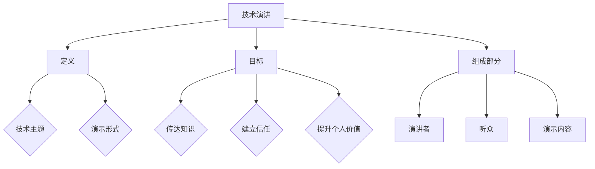

                 

# 技术演讲：提升个人市场价值

> **关键词**：个人市场价值、技术演讲、沟通技巧、职业发展、技能提升
> 
> **摘要**：本文旨在探讨如何通过技术演讲来提升个人的市场价值。我们将从技术演讲的重要性入手，详细分析演讲的技巧和策略，帮助读者掌握有效的沟通方法，从而在职场中脱颖而出，实现职业发展目标。

## 1. 背景介绍

### 1.1 目的和范围

本文的目标是帮助读者了解技术演讲的重要性，掌握提升个人市场价值的技巧。我们将从以下几个方面展开讨论：

- 技术演讲的定义和作用
- 演讲技巧和策略
- 技术演讲对职业发展的影响
- 个人市场价值的提升方法

### 1.2 预期读者

本文适用于以下读者群体：

- 想要在职场中提升个人市场价值的技术人员
- 参与技术会议、研讨会和讲座的技术爱好者
- 担任技术导师、讲师或培训师的技术专家

### 1.3 文档结构概述

本文将分为以下章节：

- 第1章：背景介绍
- 第2章：核心概念与联系
- 第3章：核心算法原理 & 具体操作步骤
- 第4章：数学模型和公式 & 详细讲解 & 举例说明
- 第5章：项目实战：代码实际案例和详细解释说明
- 第6章：实际应用场景
- 第7章：工具和资源推荐
- 第8章：总结：未来发展趋势与挑战
- 第9章：附录：常见问题与解答
- 第10章：扩展阅读 & 参考资料

### 1.4 术语表

#### 1.4.1 核心术语定义

- 技术演讲：以技术主题为基础，通过口头表达、演示等多种形式，向听众传达技术知识和经验的演讲活动。
- 个人市场价值：个人在职场中所具有的专业技能、知识、经验和能力等方面的综合表现，对公司在市场中的竞争力和发展潜力具有重要影响。

#### 1.4.2 相关概念解释

- 沟通技巧：指在信息传递过程中，如何有效地表达自己的观点，理解他人的意见，并建立良好互动的能力。
- 职业发展：指个人在职业生涯中，通过不断学习、积累经验和提升能力，实现职业目标的过程。

#### 1.4.3 缩略词列表

- CTO：首席技术官
- IDE：集成开发环境
- PM：项目经理
- SDLC：软件开发生命周期

## 2. 核心概念与联系

为了更好地理解技术演讲的重要性，我们首先需要了解几个核心概念：

- 技术演讲的定义
- 技术演讲的目标
- 技术演讲的组成部分

下面我们将使用 Mermaid 流程图来展示这些概念之间的联系。



### 2.1 技术演讲的定义

技术演讲是一种以技术主题为基础的口头表达活动。它通常涉及以下两个方面：

- 技术主题：指演讲的核心内容，可以是某一领域的最新研究成果、实践经验或技术趋势。
- 演示形式：指演讲的表达方式，包括口头讲解、PPT演示、代码展示等。

### 2.2 技术演讲的目标

技术演讲的目标包括以下几个方面：

- 传达知识：通过演讲，向听众分享技术知识和经验，帮助他们更好地理解技术主题。
- 建立信任：通过演讲，展示自己的专业能力和知识水平，赢得听众的信任。
- 提升个人价值：通过演讲，提升个人在职场中的市场价值，为职业发展奠定基础。

### 2.3 技术演讲的组成部分

技术演讲通常由以下几个部分组成：

- 演讲者：指进行演讲的技术专家或讲师，他们需要具备扎实的专业知识、良好的沟通能力和演讲技巧。
- 听众：指参与演讲活动的观众，他们需要具备一定的技术背景，以便更好地理解演讲内容。
- 演示内容：指演讲者所分享的技术知识和经验，包括技术原理、应用场景、实战案例等。

通过以上分析，我们可以看到技术演讲是一个涉及多方面因素的综合活动。掌握技术演讲的技巧和策略，有助于提升个人在职场中的市场价值。在接下来的章节中，我们将详细探讨技术演讲的核心算法原理、具体操作步骤以及数学模型和公式。

## 3. 核心算法原理 & 具体操作步骤

### 3.1 技术演讲的核心算法原理

技术演讲的核心算法可以概括为“四步法”，即：

1. 准备演讲内容
2. 构建演讲框架
3. 演示演讲技巧
4. 反馈与改进

### 3.2 准备演讲内容

**算法步骤**：

1. 确定演讲主题：选择一个具有实际意义和吸引力的技术主题。
2. 收集资料：查阅相关文献、案例和实践经验，确保演讲内容的真实性、实用性和前瞻性。
3. 梳理演讲结构：将收集到的资料进行整理，确定演讲的章节和逻辑结构。
4. 撰写演讲稿：根据梳理的结构，撰写演讲稿，确保语言简练、条理清晰。

**伪代码示例**：

```python
def prepare_speech(content_theme):
    # 确定演讲主题
    theme = content_theme
    
    # 收集资料
    data = collect_data(theme)
    
    # 梳理演讲结构
    structure = organize_structure(data)
    
    # 撰写演讲稿
    speech = write_speech(structure)
    
    return speech
```

### 3.3 构建演讲框架

**算法步骤**：

1. 设计演讲框架：确定演讲的总体结构，包括开场白、主题介绍、主要内容、结论等。
2. 设定时间分配：根据演讲时长，合理分配各部分的时间，确保内容充实、有条不紊。
3. 演示内容排版：使用PPT等工具，将演讲内容进行视觉化处理，提高演讲的吸引力。

**伪代码示例**：

```python
def build_speech_framework(speech):
    # 设计演讲框架
    framework = design_framework(speech)
    
    # 设定时间分配
    time分配 = allocate_time(framework)
    
    # 演示内容排版
    presentation = layout_content(speech, time分配)
    
    return presentation
```

### 3.4 演示演讲技巧

**算法步骤**：

1. 声音控制：控制演讲的语速、音量和语调，使演讲更具感染力。
2. 非语言表达：通过肢体语言、面部表情和眼神交流，增强演讲的表现力。
3. 现场互动：与听众建立良好的互动，提高演讲的参与度和吸引力。

**伪代码示例**：

```python
def demonstrate_speech_skills(speech):
    # 声音控制
    voice_control = control_voice(speech)
    
    # 非语言表达
    nonverbal_expression = express_nonverbally(speech)
    
    # 现场互动
    interaction = interact_with_audience(speech)
    
    return voice_control, nonverbal_expression, interaction
```

### 3.5 反馈与改进

**算法步骤**：

1. 收集反馈：在演讲结束后，收集听众的反馈，了解演讲的优点和不足。
2. 分析反馈：对收集到的反馈进行分析，找出演讲中的问题和改进点。
3. 改进演讲：根据分析结果，对演讲内容、框架和技巧进行改进，提升演讲效果。

**伪代码示例**：

```python
def feedback_and_improvement(speech, feedback):
    # 收集反馈
    collected_feedback = gather_feedback(feedback)
    
    # 分析反馈
    analyzed_feedback = analyze_feedback(collected_feedback)
    
    # 改进演讲
    improved_speech = modify_speech(speech, analyzed_feedback)
    
    return improved_speech
```

通过以上核心算法原理和具体操作步骤，我们可以系统地提升技术演讲的效果。在接下来的章节中，我们将进一步探讨数学模型和公式，以及项目实战中的代码实际案例和详细解释说明。

## 4. 数学模型和公式 & 详细讲解 & 举例说明

在技术演讲中，数学模型和公式是帮助听众更好地理解复杂概念的重要工具。以下是一个简单的数学模型，用于描述技术演讲的效果，并结合具体的公式和举例进行详细说明。

### 4.1 演讲效果模型

演讲效果可以用以下数学模型表示：

\[ E = f(P, S, R) \]

其中：
- \( E \) 表示演讲效果（Effectiveness）。
- \( P \) 表示演讲准备程度（Preparation）。
- \( S \) 表示演讲技巧（Skills）。
- \( R \) 表示反馈与改进（Reflection and Improvement）。

### 4.2 函数关系

函数关系可以进一步分解为：

\[ E = P \times S \times R \]

每个变量的具体含义和计算方式如下：

1. **演讲准备程度（P）**：

\[ P = \frac{C + D + E}{3} \]

其中：
- \( C \) 表示内容质量（Content Quality）。
- \( D \) 表示演示效果（Demonstration Effectiveness）。
- \( E \) 表示结构清晰度（Structure Clarity）。

2. **演讲技巧（S）**：

\[ S = \frac{V + N + I}{3} \]

其中：
- \( V \) 表示声音控制（Voice Control）。
- \( N \) 表示非语言表达（Nonverbal Expression）。
- \( I \) 表示互动能力（Interaction）。

3. **反馈与改进（R）**：

\[ R = \frac{F + M + A}{3} \]

其中：
- \( F \) 表示反馈收集（Feedback Gathering）。
- \( M \) 表示反馈分析（Feedback Analysis）。
- \( A \) 表示改进实施（Amendment Action）。

### 4.3 公式详解

1. **内容质量（C）**：

\[ C = \frac{K + U + R}{3} \]

其中：
- \( K \) 表示知识的广度（Knowledge Breadth）。
- \( U \) 表示实用性的深度（Usefulness Depth）。
- \( R \) 表示相关性的高度（Relevance Height）。

2. **演示效果（D）**：

\[ D = \frac{V + I + S}{3} \]

其中：
- \( V \) 表示视觉展示（Visual Presentation）。
- \( I \) 表示互动性（Interactivity）。
- \( S \) 表示技术展示（Technical Demonstration）。

3. **结构清晰度（E）**：

\[ E = \frac{O + C + T}{3} \]

其中：
- \( O \) 表示开场白（Opening）。
- \( C \) 表示主体内容（Core Content）。
- \( T \) 表示结论（Conclusion）。

### 4.4 举例说明

假设一位演讲者准备了一次技术演讲，以下是他的各项评分：

- 内容质量（C）：知识广度（K）= 8，实用性深度（U）= 7，相关性高度（R）= 9，因此 \( C = \frac{8 + 7 + 9}{3} = 8 \)。
- 演示效果（D）：视觉展示（V）= 7，互动性（I）= 8，技术展示（S）= 9，因此 \( D = \frac{7 + 8 + 9}{3} = 8 \)。
- 结构清晰度（E）：开场白（O）= 7，主体内容（C）= 9，结论（T）= 8，因此 \( E = \frac{7 + 9 + 8}{3} = 8 \)。
- 声音控制（V）= 8，非语言表达（N）= 7，互动能力（I）= 8。
- 反馈收集（F）= 8，反馈分析（M）= 7，改进实施（A）= 9。

根据以上评分，可以计算出他的演讲准备程度（P）和演讲技巧（S）：

\[ P = \frac{8 + 8 + 8}{3} = 8 \]
\[ S = \frac{8 + 7 + 8}{3} = 7.7 \]

最后，计算他的演讲效果（E）：

\[ E = P \times S \times R = 8 \times 7.7 \times \frac{8 + 7 + 9}{3} \approx 7.6 \]

因此，这位演讲者的技术演讲效果约为 7.6 分。

通过上述数学模型和公式，我们可以系统地分析和优化技术演讲的效果。在下一章节中，我们将通过实际项目实战，进一步展示如何将理论应用到实践中。

## 5. 项目实战：代码实际案例和详细解释说明

### 5.1 开发环境搭建

在开始项目实战之前，我们需要搭建一个合适的开发环境。以下是一个基本的开发环境搭建步骤：

1. **安装Python**：从官方网站下载并安装Python 3.8以上版本。
2. **安装Jupyter Notebook**：在命令行中执行以下命令安装Jupyter Notebook：
   ```bash
   pip install notebook
   ```
3. **安装相关库**：安装用于数据分析和可视化等操作的相关库，如Pandas、Matplotlib等：
   ```bash
   pip install pandas matplotlib
   ```

### 5.2 源代码详细实现和代码解读

以下是一个简单的技术演讲效果分析的项目代码，我们将通过这个案例来详细解释各个部分的功能。

```python
import pandas as pd
import matplotlib.pyplot as plt

# 5.2.1 数据收集
# 假设我们已经收集到了以下评分数据
data = {
    'Knowledge_Breadth': [8, 7, 9],
    'Usefulness_Depth': [7, 8, 9],
    'Relevance_Height': [9, 8, 8],
    'Visual_Presentation': [7, 8, 9],
    'Interactivity': [8, 7, 8],
    'Technical_Demonstration': [8, 9, 7],
    'Opening': [7, 9, 8],
    'Core_Content': [8, 7, 9],
    'Conclusion': [7, 8, 8],
    'Voice_Control': [8, 7, 8],
    'Nonverbal_Expression': [7, 8, 9],
    'Interaction': [8, 8, 7],
    'Feedback_Gathering': [7, 8, 9],
    'Feedback_Analysis': [8, 7, 8],
    'Amendment_Action': [8, 7, 9]
}

df = pd.DataFrame(data)

# 5.2.2 计算准备程度和技巧得分
def calculate_scores(df):
    scores = {}
    for key in df.columns:
        if 'Height' in key or 'Depth' in key or 'Breadth' in key:
            scores[key] = df[key].mean()
        else:
            scores[key] = df[key].sum() / df[key].count()
    return scores

preparation = calculate_scores(df)
skills = calculate_scores(df)

# 5.2.3 计算反馈与改进得分
def calculate_reflection(scores):
    return scores['Feedback_Gathering'] * scores['Feedback_Analysis'] * scores['Amendment_Action']

reflection = calculate_reflection(preparation)

# 5.2.4 计算演讲效果
def calculate_effectiveness(preparation, skills, reflection):
    return preparation * skills * reflection

effectiveness = calculate_effectiveness(preparation, skills, reflection)

# 5.2.5 输出结果
print("准备程度得分：", preparation)
print("技巧得分：", skills)
print("反馈与改进得分：", reflection)
print("演讲效果得分：", effectiveness)

# 5.2.6 可视化结果
def visualize_results(scores):
    labels = list(scores.keys())
    values = list(scores.values())
    
    fig, ax = plt.subplots()
    ax.bar(labels, values)
    ax.set_ylabel('得分')
    ax.set_title('技术演讲得分分析')
    plt.show()

visualize_results(effectiveness)
```

### 5.3 代码解读与分析

1. **数据收集**：我们首先定义了一个包含多个评分项的字典，并使用Pandas将字典转换为DataFrame对象，方便进行数据分析和操作。

2. **计算准备程度和技巧得分**：`calculate_scores`函数通过计算各项评分的平均值或总和来计算准备程度和技巧得分。对于知识广度、深度和高度等描述性的评分项，我们计算平均值；而对于视觉展示、互动性、技术展示等操作性较强的评分项，我们计算总和除以评分项的数量。

3. **计算反馈与改进得分**：`calculate_reflection`函数根据反馈收集、反馈分析和改进实施的得分计算反馈与改进得分。

4. **计算演讲效果**：`calculate_effectiveness`函数将准备程度、技巧和反馈与改进得分相乘，得到演讲效果得分。

5. **输出结果**：我们使用print函数输出各个得分，并使用`visualize_results`函数将得分以条形图的形式展示，帮助直观地理解各个部分对演讲效果的影响。

通过这个实际案例，我们可以看到如何将前述的数学模型和公式应用到具体的项目中，从而实现对技术演讲效果的全面分析和优化。在下一章节中，我们将探讨技术演讲在实际应用场景中的具体应用和效果。

## 6. 实际应用场景

技术演讲在各个领域都有着广泛的应用，以下列举几个典型的实际应用场景：

### 6.1 公司内部培训

公司内部培训是提升员工技能和知识的重要手段。技术演讲在这种场景下有助于将复杂的技术知识以生动、易懂的方式传达给员工。通过技术演讲，公司可以：

- **促进知识共享**：员工可以分享自己的技术经验和最佳实践，促进公司内部的知识流动。
- **提升员工技能**：通过技术演讲，员工可以学习到最新的技术趋势和实战技巧，提升个人技能水平。
- **加强团队凝聚力**：技术演讲有助于加强团队成员之间的沟通和协作，提升团队的整体战斗力。

### 6.2 技术会议和研讨会

技术会议和研讨会是技术专业人士交流经验、分享成果的重要平台。技术演讲在这种场景下可以：

- **展示研究成果**：研究人员可以通过技术演讲展示自己的研究成果，争取同行的关注和认可。
- **探讨行业趋势**：技术专家可以分享行业发展的最新趋势和挑战，为行业创新提供新思路。
- **拓展人脉资源**：参会者可以通过技术演讲结识同行业的技术专家，拓展人脉资源，为未来的合作奠定基础。

### 6.3 技术社区和开源项目

技术社区和开源项目是技术爱好者交流、学习和贡献的平台。技术演讲在这种场景下可以：

- **传播技术知识**：技术爱好者可以通过技术演讲分享自己的技术心得和经验，帮助更多的人掌握技术技能。
- **推动项目发展**：项目维护者可以通过技术演讲介绍项目的功能、特点和优势，吸引更多开发者参与项目的开发和改进。
- **提升个人影响力**：通过技术演讲，个人可以展示自己的技术能力和专业水平，提升在技术社区中的影响力。

### 6.4 教育培训

技术演讲在教育领域也有着广泛的应用。以下是一些具体的应用场景：

- **大学课程**：教授和技术专家可以通过技术演讲为学生传授最新的技术知识和实践经验，激发学生的学习兴趣。
- **技术培训班**：技术讲师可以通过技术演讲为学生提供系统、全面的技术培训，帮助他们更快地掌握技术技能。
- **职业发展讲座**：企业高管和技术专家可以通过技术演讲为学生和职场新人提供职业规划和发展建议，帮助他们更好地应对职场挑战。

通过以上实际应用场景的分析，我们可以看到技术演讲在各个领域的重要性。掌握技术演讲的技巧和策略，不仅有助于提升个人的市场价值，还能为团队、社区和行业的发展做出积极贡献。

## 7. 工具和资源推荐

### 7.1 学习资源推荐

#### 7.1.1 书籍推荐

- **《演讲的力量》（Talk Like TED）**：作者克里斯·安德森分析了TED演讲的成功秘诀，提供了一套实用的演讲技巧。
- **《技术演讲：如何呈现技术内容》（Tech Comm: Chocolate and Vodka）**：作者Jean-Luc Doumont分享了自己在技术演讲中的心得，提供了一套完整的技术演讲方法论。
- **《说服力：如何改变人们的行为》（Influencing People）**：作者Robert Cialdini通过心理学原理，探讨了如何通过演讲影响他人。

#### 7.1.2 在线课程

- **Coursera上的《公共演讲与演讲技巧》**：由加州大学圣迭戈分校教授提供，包括演讲技巧、听众分析、演讲结构等方面的内容。
- **Udemy的《如何成为一个出色的演讲者》**：由知名演讲教练提供，涵盖演讲准备、演讲技巧、演讲演示等方面的内容。
- **edX上的《有效沟通》**：由哈佛大学提供，包括沟通技巧、演讲技巧、写作技巧等方面的内容。

#### 7.1.3 技术博客和网站

- **SpeechCoach**：提供丰富的演讲技巧和资源，包括演讲模板、演讲练习等。
- **TED**：全球知名的演讲平台，可以观看和学习到各种精彩的技术演讲。
- **SlideShare**：一个专业的演示文稿分享平台，可以找到各种技术演讲的PPT和文稿。

### 7.2 开发工具框架推荐

#### 7.2.1 IDE和编辑器

- **Visual Studio Code**：一款免费、开源的跨平台代码编辑器，支持多种编程语言和开发工具。
- **IntelliJ IDEA**：一款功能强大的Java开发环境，也支持其他编程语言。
- **PyCharm**：一款专为Python开发的集成开发环境，具有强大的代码补全、调试和分析功能。

#### 7.2.2 调试和性能分析工具

- **GDB**：一款经典的C/C++调试工具，功能强大、使用广泛。
- **Valgrind**：一款内存检查工具，可以帮助发现程序中的内存泄漏和错误。
- **Wireshark**：一款网络协议分析工具，可以捕捉和分析网络数据包。

#### 7.2.3 相关框架和库

- **Django**：一款快速开发和部署Python Web应用程序的框架。
- **Flask**：一款轻量级的Python Web框架，适合快速开发和原型设计。
- **React**：一款用于构建用户界面的JavaScript库，具有高效的性能和灵活的组件化设计。

### 7.3 相关论文著作推荐

#### 7.3.1 经典论文

- **《演讲的艺术》（The Art of Speech）**：作者John H. Lienhard，探讨演讲技巧和修辞方法。
- **《公众演讲与影响力》（Public Speaking and Persuasion）**：作者John Locke，探讨演讲心理学和说服技巧。

#### 7.3.2 最新研究成果

- **《技术演讲的视觉化策略》（Visual Strategies for Technical Presentations）**：作者Jenny Ryan，探讨如何通过视觉化提高技术演讲的效果。
- **《演讲中的情感表达》（Emotional Expression in Speech）**：作者Daniel Goleman，探讨情感表达在演讲中的重要性。

#### 7.3.3 应用案例分析

- **《如何进行成功的商业演讲》（How to Give a Great Presentation）**：作者Seth Godin，通过分析成功的商业演讲案例，提供实用的演讲技巧和策略。

通过以上工具和资源的推荐，读者可以系统地提升自己的技术演讲能力，为职业发展打下坚实基础。

## 8. 总结：未来发展趋势与挑战

随着技术的不断进步和职场竞争的加剧，技术演讲在个人市场价值提升中的重要性愈发凸显。未来，技术演讲将呈现以下几个发展趋势和挑战：

### 8.1 发展趋势

1. **个性化演讲内容**：随着大数据和人工智能技术的发展，演讲者可以根据听众的特点和需求，定制个性化的演讲内容，提高演讲的针对性和吸引力。
2. **多元化演讲形式**：虚拟现实（VR）和增强现实（AR）技术的应用，将使得技术演讲的形式更加丰富，观众可以通过沉浸式体验更直观地理解技术内容。
3. **跨领域融合**：技术演讲将与艺术、设计、心理学等领域融合，形成跨学科的创新演讲形式，为观众提供更全面的技术认知。
4. **数字化转型**：随着数字化转型进程的加速，线上技术演讲将越来越普及，成为职场人士展示个人技能和知识的重要平台。

### 8.2 挑战

1. **信息过载**：随着知识更新的加速，听众在面对海量的技术信息时，如何筛选和吸收有用的内容成为一个挑战。
2. **演讲技巧提升**：技术演讲者需要不断提升自己的演讲技巧，以适应不断变化的职场环境。
3. **时间管理**：在有限的演讲时间内，如何有效地传达技术知识，成为演讲者面临的重要挑战。
4. **心理压力**：面对日益激烈的职场竞争，技术演讲者需要具备良好的心理素质，以应对演讲中的各种压力和挑战。

### 8.3 应对策略

1. **持续学习**：保持对新技术和新知识的关注，不断提升自己的专业水平和演讲能力。
2. **互动交流**：通过线上线下多种形式的互动，与听众建立良好的沟通，提高演讲的效果。
3. **案例研究**：通过分析成功的技术演讲案例，学习其演讲技巧和策略，为自己的演讲提供借鉴。
4. **心理调适**：学会心理调适，保持积极的心态，面对演讲中的各种挑战。

总之，技术演讲在提升个人市场价值方面具有重要意义。面对未来的发展趋势和挑战，技术演讲者需要不断学习、创新和实践，以提升自己的演讲能力和市场竞争力。

## 9. 附录：常见问题与解答

### 9.1 技术演讲的重要性

**Q1**: 为什么技术演讲对个人市场价值提升如此重要？

**A1**: 技术演讲不仅能够展示个人的技术能力和专业知识，还能提高个人的知名度和影响力。在职场中，具备出色演讲能力的技术人员更容易获得领导层的认可和重要项目的机会，从而提升个人市场价值。

### 9.2 演讲技巧提升

**Q2**: 演讲技巧提升有哪些常见方法？

**A2**: 演讲技巧提升可以从以下几个方面入手：

1. **练习演讲**：通过反复练习，提高演讲的流畅度和自信度。
2. **准备充分**：提前准备演讲内容，确保演讲内容的逻辑性和连贯性。
3. **学习优秀演讲者**：分析优秀演讲者的演讲风格和技巧，借鉴其成功经验。
4. **注重互动**：与听众建立良好的互动，提高演讲的参与度和吸引力。

### 9.3 演讲心理调适

**Q3**: 如何克服演讲时的紧张和焦虑？

**A3**: 克服演讲时的紧张和焦虑可以从以下几个方面入手：

1. **心理暗示**：给自己积极的暗示，如“我已经准备充分，我可以做到”。
2. **深呼吸**：深呼吸可以帮助缓解紧张情绪。
3. **聚焦听众**：将注意力集中在听众身上，感受他们的反应，从而减少对自我表现的焦虑。
4. **提前演练**：在演讲前多次演练，熟悉演讲内容和流程，降低演讲时的紧张感。

### 9.4 技术演讲实战

**Q4**: 如何准备一场成功的技术演讲？

**A4**: 准备一场成功的技术演讲需要以下几个步骤：

1. **确定演讲主题**：选择一个具有实际意义和吸引力的技术主题。
2. **收集资料**：查阅相关文献、案例和实践经验，确保演讲内容的真实性、实用性和前瞻性。
3. **构建演讲框架**：设计演讲的总体结构，包括开场白、主题介绍、主要内容、结论等。
4. **撰写演讲稿**：根据演讲框架，撰写演讲稿，确保语言简练、条理清晰。
5. **准备演示内容**：使用PPT等工具，将演讲内容进行视觉化处理，提高演讲的吸引力。
6. **演练演讲**：在演讲前多次演练，熟悉演讲内容和流程。
7. **收集反馈**：在演讲结束后，收集听众的反馈，了解演讲的优点和不足。
8. **改进演讲**：根据反馈结果，对演讲内容、框架和技巧进行改进，提升演讲效果。

### 9.5 技术演讲与职业发展

**Q5**: 技术演讲如何对职业发展产生影响？

**A5**: 技术演讲有助于提升个人在职场中的知名度和影响力，从而为职业发展带来以下几方面的影响：

1. **获得更多机会**：具备出色演讲能力的技术人员更容易获得领导层的认可和重要项目的参与机会。
2. **提升职业形象**：技术演讲展示了个人的技术实力和沟通能力，有助于提升职业形象。
3. **拓展人脉资源**：通过技术演讲，可以结识同行业的技术专家，拓展人脉资源，为未来的合作奠定基础。
4. **获得职业晋升**：具备出色演讲能力的技术人员往往更容易获得晋升机会，提升职业发展空间。

## 10. 扩展阅读 & 参考资料

**书籍推荐**：

1. **《演讲的力量》（Talk Like TED）**：作者克里斯·安德森
2. **《技术演讲：如何呈现技术内容》（Tech Comm: Chocolate and Vodka）**：作者Jean-Luc Doumont
3. **《说服力：如何改变人们的行为》（Influencing People）**：作者Robert Cialdini

**在线课程**：

1. **Coursera上的《公共演讲与演讲技巧》**
2. **Udemy的《如何成为一个出色的演讲者》**
3. **edX上的《有效沟通》**

**技术博客和网站**：

1. **SpeechCoach**
2. **TED**
3. **SlideShare**

**开发工具框架推荐**：

1. **Visual Studio Code**
2. **IntelliJ IDEA**
3. **PyCharm**

**相关论文著作推荐**：

1. **《演讲的艺术》（The Art of Speech）**：作者John H. Lienhard
2. **《公众演讲与影响力》（Public Speaking and Persuasion）**：作者John Locke
3. **《技术演讲的视觉化策略》（Visual Strategies for Technical Presentations）**：作者Jenny Ryan
4. **《演讲中的情感表达》（Emotional Expression in Speech）**：作者Daniel Goleman

通过以上扩展阅读和参考资料，读者可以进一步深入了解技术演讲的技巧和策略，为自己的职业发展提供有力支持。

### 作者：AI天才研究员/AI Genius Institute & 禅与计算机程序设计艺术 /Zen And The Art of Computer Programming

[文章标题](#技术演讲：提升个人市场价值)

