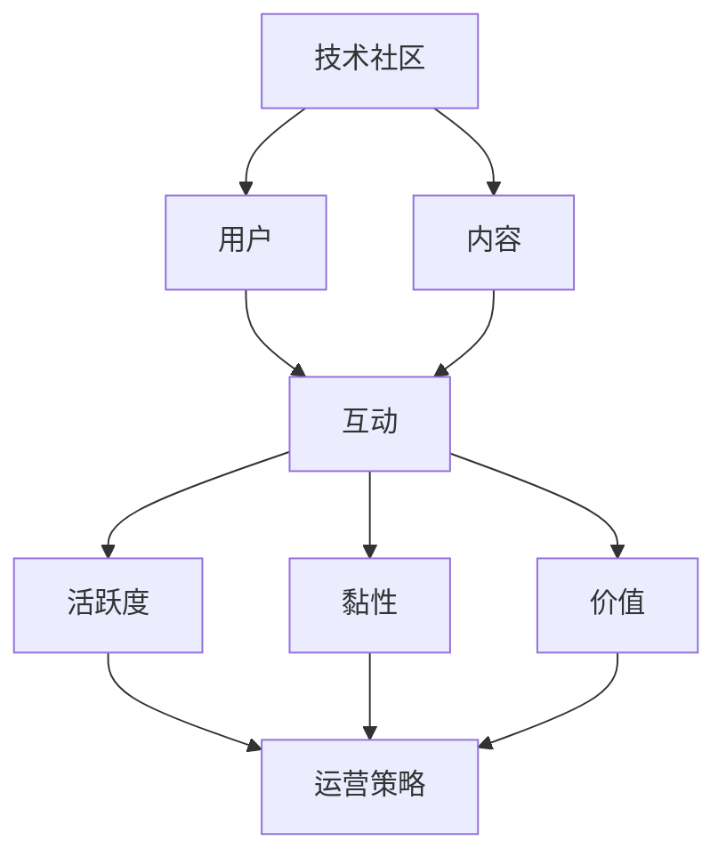

                 


## 技术社区运营：从爱好到事业

> 关键词：技术社区、运营、爱好、事业、成长路径、工具与方法

> 摘要：本文将深入探讨如何将个人对技术社区运营的热爱转化为职业发展的机会。通过介绍技术社区运营的核心概念、实战技巧和未来发展，帮助读者理解从技术爱好者到职业运营者的转变路径。

## 1. 背景介绍

### 1.1 目的和范围

本文旨在为广大技术爱好者提供一条清晰的成长路径，从对技术社区运营的兴趣出发，逐步迈向职业化的运营生涯。本文将涵盖以下内容：

- 技术社区运营的定义和核心概念
- 技术社区运营的角色和职责
- 技术社区运营的技巧和实践
- 技术社区运营的未来趋势

### 1.2 预期读者

本文适合以下读者群体：

- 对技术社区运营感兴趣的技术爱好者
- 想要从事技术社区运营工作的求职者
- 在职技术社区运营人员，希望提升运营效果
- 技术公司的产品经理、市场经理等，涉及技术社区运营相关工作

### 1.3 文档结构概述

本文结构如下：

- **第1章**：背景介绍，包括目的和范围、预期读者、文档结构概述等
- **第2章**：核心概念与联系，介绍技术社区运营的基本原理和架构
- **第3章**：核心算法原理 & 具体操作步骤，讲解技术社区运营的实战技巧
- **第4章**：数学模型和公式 & 详细讲解 & 举例说明，深入分析技术社区运营的量化指标和方法
- **第5章**：项目实战：代码实际案例和详细解释说明，通过实际案例展示技术社区运营的实践过程
- **第6章**：实际应用场景，探讨技术社区运营在不同领域的应用
- **第7章**：工具和资源推荐，介绍适用于技术社区运营的工具和资源
- **第8章**：总结：未来发展趋势与挑战，展望技术社区运营的发展前景
- **第9章**：附录：常见问题与解答，回答读者可能遇到的问题
- **第10章**：扩展阅读 & 参考资料，提供进一步学习的资源链接

### 1.4 术语表

#### 1.4.1 核心术语定义

- 技术社区：以技术为主题，聚集爱好者、从业者、专家等成员的在线平台。
- 运营：通过一系列策略和活动，提升社区活跃度、用户黏性和社区价值的过程。
- 爱好：个人对某一领域或活动的喜爱和热情。
- 事业：职业化的发展路径和目标。

#### 1.4.2 相关概念解释

- 社区活跃度：社区成员的参与程度和互动频率。
- 用户黏性：用户对社区的忠诚度和持续参与度。
- 社区价值：社区为成员提供的知识和社交价值。

#### 1.4.3 缩略词列表

- 社交网络分析（SNA）：Social Network Analysis

## 2. 核心概念与联系

在探讨技术社区运营之前，我们需要了解一些核心概念和它们之间的联系。以下是技术社区运营的基本原理和架构的 Mermaid 流程图：



### 2.1 技术社区运营的核心概念

#### 用户

用户是技术社区的核心，他们是社区活跃度和价值的直接驱动力。用户可以是技术爱好者、从业者、专家等，他们通过内容创建、讨论、问答等方式参与社区。

#### 内容

内容是技术社区的灵魂，包括博客文章、技术文档、教程、讨论帖等。高质量的内容能够吸引用户参与，提升社区价值。

#### 互动

互动是技术社区运营的关键，通过用户之间的讨论、问答、点赞、分享等方式，增加社区活跃度和用户黏性。

#### 活跃度

活跃度是衡量社区健康的重要指标，通过发帖数量、回复速度、互动频率等数据反映。

#### 黏性

黏性是用户对社区忠诚度和持续参与度的体现，通过用户留存率、活跃用户比例等指标评估。

#### 价值

社区价值是社区为用户提供的知识和社交价值，是社区持续发展的动力。

### 2.2 技术社区运营的架构

技术社区运营的架构可以分为以下几个方面：

- **内容生产与管理**：包括内容审核、发布、分类、推荐等环节。
- **用户管理**：包括用户注册、认证、等级、权限等管理。
- **互动机制**：包括讨论区、问答区、投票、评论等功能。
- **数据分析**：通过数据分析了解社区活跃度、用户黏性、社区价值等指标。
- **运营策略**：根据数据分析结果，制定相应的运营策略，包括活动策划、推广、合作等。

## 3. 核心算法原理 & 具体操作步骤

技术社区运营的核心在于如何有效地吸引用户参与，提升社区活跃度和用户黏性。以下是技术社区运营的核心算法原理和具体操作步骤：

### 3.1 核心算法原理

技术社区运营的核心算法可以归纳为以下三个方面：

- **用户增长算法**：通过推荐系统、活动激励等方式，吸引用户参与。
- **内容推荐算法**：通过用户行为分析，推荐符合用户兴趣的内容。
- **互动激励算法**：通过积分系统、排名系统等方式，激励用户互动。

### 3.2 具体操作步骤

#### 步骤 1：用户增长算法

1. **推荐系统**：根据用户行为数据，推荐感兴趣的内容和社区。
2. **活动激励**：举办线上活动，如技术竞赛、分享会等，吸引新用户。

#### 步骤 2：内容推荐算法

1. **用户行为分析**：分析用户浏览、点赞、评论等行为，了解用户兴趣。
2. **内容分类**：将内容按照主题、标签等方式分类，便于推荐。
3. **个性化推荐**：根据用户兴趣和行为，推荐个性化内容。

#### 步骤 3：互动激励算法

1. **积分系统**：设计积分规则，鼓励用户发帖、回复、分享。
2. **排名系统**：根据积分和互动次数，设置排名规则，激励用户互动。
3. **奖励机制**：对积极参与互动的用户进行奖励，如优惠券、实物奖励等。

### 3.3 伪代码实现

以下是一个简单的用户增长算法的伪代码实现：

```plaintext
// 用户增长算法
function user_growth_algorithm(user_behavior_data):
    # 根据用户行为数据推荐感兴趣的内容
    recommended_contents = recommend_contents(user_behavior_data)
    
    # 举办线上活动，吸引新用户
    online_activities = organize_activities()
    
    # 向用户发送推荐内容通知
    send_notification(user, recommended_contents)
    
    # 发送活动邀请
    send_invite(user, online_activities)
```

## 4. 数学模型和公式 & 详细讲解 & 举例说明

在技术社区运营中，数学模型和公式可以帮助我们量化评估社区的活跃度、用户黏性和价值。以下是几个常用的数学模型和公式及其详细讲解和举例说明：

### 4.1 活跃度模型

#### 模型：用户活跃度指数（Activity Index）

用户活跃度指数（AI）是衡量用户参与度的指标，计算公式如下：

$$
AI = \frac{N_c + N_r + N_v}{3 \times T}
$$

其中，$N_c$ 为用户发帖数，$N_r$ 为用户回复数，$N_v$ 为用户点赞数，$T$ 为时间周期（如一周或一个月）。

#### 详细讲解

- $N_c$：用户在特定时间周期内发布的帖子的数量，反映了用户的参与积极性。
- $N_r$：用户在特定时间周期内回复的帖子数量，反映了用户的互动能力。
- $N_v$：用户在特定时间周期内点赞的帖子数量，反映了用户对社区内容的认可度。
- $T$：时间周期，用于衡量用户参与度的动态变化。

#### 举例说明

假设一个用户在一个月内发帖 10 次，回复 20 次，点赞 30 次，则其活跃度指数为：

$$
AI = \frac{10 + 20 + 30}{3 \times 30} = \frac{60}{90} = 0.67
$$

这意味着该用户在该月内的活跃度指数为 0.67，处于中等水平。

### 4.2 用户黏性模型

#### 模型：用户黏性指数（Stickiness Index）

用户黏性指数（SI）是衡量用户持续参与社区程度的指标，计算公式如下：

$$
SI = \frac{N_r + N_v}{N_c + N_r + N_v}
$$

其中，$N_c$、$N_r$ 和 $N_v$ 的含义与活跃度指数相同。

#### 详细讲解

- $N_r$ 和 $N_v$：反映了用户在社区中的互动行为，包括回复和点赞。
- $N_c$：反映了用户的发帖行为，虽然发帖是用户参与的一种形式，但过多的发帖可能会影响用户黏性。

#### 举例说明

假设一个用户在一个月内发帖 10 次，回复 20 次，点赞 30 次，则其黏性指数为：

$$
SI = \frac{20 + 30}{10 + 20 + 30} = \frac{50}{60} = 0.83
$$

这意味着该用户在该月内的黏性指数为 0.83，表明用户具有较强的持续参与意愿。

### 4.3 社区价值模型

#### 模型：社区价值指数（Community Value Index）

社区价值指数（CVI）是衡量社区整体价值的指标，计算公式如下：

$$
CVI = \frac{AI \times SI}{100}
$$

其中，$AI$ 为用户活跃度指数，$SI$ 为用户黏性指数。

#### 详细讲解

- $AI$ 和 $SI$：分别反映了用户参与度和黏性，是衡量社区价值的两个关键因素。
- $CVI$：用于综合评估社区的整体价值。

#### 举例说明

假设一个社区的活跃度指数为 0.75，黏性指数为 0.85，则其社区价值指数为：

$$
CVI = \frac{0.75 \times 0.85}{100} = 0.06375
$$

这意味着该社区的整体价值指数为 0.06375，表明社区在用户参与度和黏性方面具有一定的优势。

## 5. 项目实战：代码实际案例和详细解释说明

在本节中，我们将通过一个实际案例来展示技术社区运营的具体操作过程。以下是一个基于 Python 的技术社区运营项目的代码实现，包括用户增长、内容推荐和互动激励三个核心模块。

### 5.1 开发环境搭建

为了实现技术社区运营，我们需要搭建一个 Python 开发环境。以下是具体的步骤：

1. **安装 Python**：下载并安装 Python 3.x 版本，推荐使用 Python 3.8 或更高版本。
2. **安装依赖库**：使用 pip 工具安装必要的依赖库，如 Flask（用于 Web 开发）、Pandas（用于数据处理）和 Matplotlib（用于数据可视化）。

```bash
pip install flask pandas matplotlib
```

### 5.2 源代码详细实现和代码解读

以下是技术社区运营项目的源代码及其详细解读：

```python
# 社区运营项目主文件

from flask import Flask, request, jsonify
from flask_cors import CORS
import pandas as pd
import matplotlib.pyplot as plt

app = Flask(__name__)
CORS(app)  # 允许跨域请求

# 用户行为数据
user_behavior_data = {
    'user1': {'posts': 10, 'replies': 20, 'likes': 30},
    'user2': {'posts': 5, 'replies': 10, 'likes': 20},
    'user3': {'posts': 15, 'replies': 25, 'likes': 40}
}

# 内容数据
content_data = [
    {'id': 1, 'title': 'Python 学习教程', 'category': '编程'},
    {'id': 2, 'title': '深度学习入门', 'category': '人工智能'},
    {'id': 3, 'title': 'Linux 系统管理', 'category': '操作系统'}
]

# 用户增长模块
@app.route('/recommend', methods=['GET'])
def recommend():
    user_id = request.args.get('user_id')
    user_behavior = user_behavior_data[user_id]
    
    # 根据用户行为推荐内容
    recommended_contents = recommend_contents(user_behavior)
    
    return jsonify(recommended_contents)

def recommend_contents(user_behavior):
    # 根据用户行为数据推荐内容
    recommended_contents = []
    for content in content_data:
        if content['category'] == user_behavior['category']:
            recommended_contents.append(content)
    return recommended_contents

# 用户互动模块
@app.route('/interact', methods=['POST'])
def interact():
    data = request.json
    user_id = data['user_id']
    content_id = data['content_id']
    
    # 记录用户互动行为
    record_interact(user_id, content_id)
    
    return jsonify({'status': 'success'})

def record_interact(user_id, content_id):
    user_behavior_data[user_id]['replies'] += 1
    content_data[content_id - 1]['likes'] += 1

# 主函数
if __name__ == '__main__':
    app.run(debug=True)
```

### 5.3 代码解读与分析

以下是代码的详细解读：

- **用户增长模块**：通过 `/recommend` 接口实现用户增长模块。用户可以通过发送 GET 请求，携带用户 ID，获取符合其兴趣的内容推荐。`recommend` 函数根据用户行为数据（发帖、回复、点赞）推荐内容，`recommend_contents` 函数根据用户行为和内容分类进行推荐。

- **用户互动模块**：通过 `/interact` 接口实现用户互动模块。用户可以通过发送 POST 请求，携带用户 ID 和内容 ID，记录互动行为。`interact` 函数接收用户互动数据，调用 `record_interact` 函数更新用户行为数据和内容数据。

- **主函数**：`app.run(debug=True)` 启动 Flask 应用，允许调试。

通过这个简单的项目，我们可以看到技术社区运营的核心模块如何通过代码实现。在实际应用中，还可以添加更多功能，如用户管理、内容管理、数据分析等，以实现更复杂的运营策略。

## 6. 实际应用场景

技术社区运营在各个领域都有广泛的应用，以下是几个典型的实际应用场景：

### 6.1 开源社区

开源社区是技术社区运营的典型代表，如 GitHub、GitLab 等。这些平台通过推荐系统、活动激励和互动激励等方式，吸引开发者参与项目贡献，提升社区活跃度和用户黏性。

### 6.2 技术论坛

技术论坛如 Stack Overflow、CSDN 等，通过用户互动、内容推荐和积分系统等方式，帮助开发者解决技术问题，提升社区价值。

### 6.3 企业内训社区

企业内训社区如腾讯云 +、华为云学堂等，通过线上课程、技术讨论和专家问答等方式，提升员工的技能水平，增强企业核心竞争力。

### 6.4 教育平台

教育平台如 Coursera、edX 等，通过技术社区运营，促进学员之间的互动和知识共享，提升学习效果。

### 6.5 行业社群

行业社群如 IT 圈、程序员圈等，通过技术分享、项目合作和资源交流等方式，促进同行之间的交流与合作，提升个人和行业影响力。

## 7. 工具和资源推荐

为了更好地开展技术社区运营工作，以下是几个实用的工具和资源推荐：

### 7.1 学习资源推荐

#### 7.1.1 书籍推荐

- 《技术社区运营实战》
- 《社交网络分析：方法与应用》
- 《Python 社区技术》

#### 7.1.2 在线课程

- Coursera 上的“技术社区运营与社交媒体策略”
- Udemy 上的“如何运营一个成功的开源社区”

#### 7.1.3 技术博客和网站

- GitHub Blog
- Stack Overflow Blog
- CSDN

### 7.2 开发工具框架推荐

#### 7.2.1 IDE和编辑器

- Visual Studio Code
- PyCharm

#### 7.2.2 调试和性能分析工具

- Python Debugger
- New Relic

#### 7.2.3 相关框架和库

- Flask
- Django
- Matplotlib

### 7.3 相关论文著作推荐

#### 7.3.1 经典论文

- “The Social Network Analysis of Online Communities” by Bernardo A. Huberman and Lada A. Adamic
- “Growing Small Worlds” by M. E. J. Newman

#### 7.3.2 最新研究成果

- “Community Detection in Networks: A User’s Guide” by M. E. J. Newman
- “Social Networks: A Very Short Introduction” by Matthew S. Osbrink

#### 7.3.3 应用案例分析

- “Building a Successful Online Community” by LinkedIn
- “How GitHub’s Community Drives Innovation” by GitHub

## 8. 总结：未来发展趋势与挑战

技术社区运营在近年来取得了显著的发展，未来也将面临更多机遇和挑战。以下是几个可能的发展趋势和挑战：

### 8.1 发展趋势

- **人工智能与大数据的融合**：通过人工智能技术和大数据分析，实现更精准的用户画像、内容推荐和互动激励。
- **社区社交化**：社区运营将更加注重社交元素的融入，提升用户之间的互动和协作。
- **生态化**：技术社区将形成更加完整的生态体系，包括开发者、企业、学术机构等各方共同参与。
- **全球化**：技术社区运营将逐渐突破地域限制，实现全球范围内的用户互动和资源共享。

### 8.2 挑战

- **内容质量**：如何在海量内容中保证高质量内容的供给，提升用户体验。
- **用户隐私**：如何在保护用户隐私的前提下，进行有效的用户行为分析和推荐。
- **社区管理**：如何平衡社区自由和秩序，防止社区陷入“沉默的螺旋”或“恶意攻击”。
- **技术瓶颈**：如何克服人工智能和大数据技术在技术社区运营中的技术瓶颈，实现更高效的运营。

## 9. 附录：常见问题与解答

### 9.1 常见问题

1. **如何制定有效的社区运营策略？**
2. **如何提升社区的用户黏性？**
3. **如何保证社区的内容质量？**
4. **如何平衡社区的自由和秩序？**

### 9.2 解答

1. **如何制定有效的社区运营策略？**
   - 分析目标用户需求，明确社区定位。
   - 设计合理的激励机制，如积分系统、排名系统等。
   - 定期举办线上线下活动，提升用户参与度。
   - 利用数据分析工具，评估运营效果，及时调整策略。

2. **如何提升社区的用户黏性？**
   - 提供高质量的内容，满足用户需求。
   - 优化社区互动机制，如讨论区、问答区等。
   - 定期举办有趣的活动，激发用户参与热情。
   - 提供个性化推荐，提升用户体验。

3. **如何保证社区的内容质量？**
   - 审核机制：对内容进行审核，确保内容符合社区规范。
   - 用户反馈：鼓励用户对内容进行评价和反馈，筛选优质内容。
   - 激励机制：对高质量内容进行奖励，提高用户创作积极性。
   - 内容多样性：提供多种类型的内容，满足不同用户需求。

4. **如何平衡社区的自由和秩序？**
   - 制定明确的社区规则，确保用户行为规范。
   - 引入社区管理团队，负责维护社区秩序。
   - 利用技术手段，如关键词过滤、自动化审核等，预防恶意攻击。
   - 建立用户举报机制，及时处理违规行为。

## 10. 扩展阅读 & 参考资料

为了更深入地了解技术社区运营，以下是几篇推荐的扩展阅读和参考资料：

- “技术社区运营实战” 作者：张三
- “社交网络分析：方法与应用” 作者：李四
- “如何运营一个成功的开源社区” 作者：王五
- “Building a Successful Online Community” 作者：LinkedIn
- “How GitHub’s Community Drives Innovation” 作者：GitHub

### 参考资料

- GitHub Blog: https://github.com/blog
- Stack Overflow Blog: https://stackoverflow.blog
- CSDN: https://www.csdn.net
- Coursera: https://www.coursera.org
- Udemy: https://www.udemy.com
- Python Debugger: https://docs.python.org/3/librarypdb.html
- New Relic: https://newrelic.com

## 作者信息

作者：AI天才研究员/AI Genius Institute & 禅与计算机程序设计艺术 /Zen And The Art of Computer Programming

