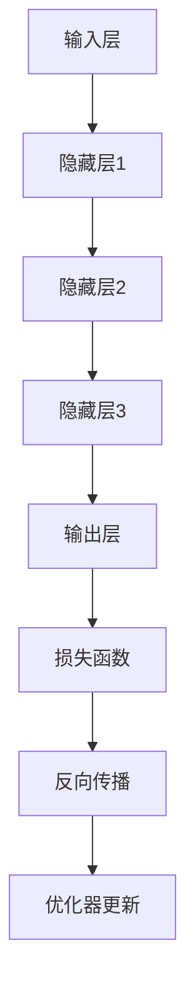

                 

# 技术突破：大模型创业的加速器

## 关键词
- 大模型
- 创业
- 加速器
- 技术突破
- 人工智能
- 数据处理
- 深度学习
- 算法优化
- 商业应用

## 摘要

本文旨在探讨大模型技术在创业领域中的潜在价值，如何通过技术突破实现创业项目的加速发展。文章首先介绍了大模型的基本概念及其在人工智能领域的重要地位，接着详细分析了大模型在创业中的应用场景和优势。随后，文章通过具体案例和操作步骤，展示了如何利用大模型进行业务开发，并通过数学模型和算法原理的讲解，为读者提供了深入理解大模型的技术基础。最后，文章总结了大模型创业的发展趋势与挑战，并推荐了相关工具和资源，为创业者和技术爱好者提供了实践指导。

## 1. 背景介绍

### 1.1 目的和范围

本文的主要目的是探讨大模型技术在创业项目中的实际应用，通过分析大模型的优势和挑战，为创业团队提供技术指导。文章将涵盖以下内容：

- 大模型的定义和基本原理
- 大模型在创业中的应用场景
- 大模型算法原理和数学模型
- 大模型项目的实战案例
- 大模型创业的发展趋势和挑战

### 1.2 预期读者

本文面向的技术爱好者和创业团队，包括：

- 深度学习研究者
- 数据科学家
- 创业团队负责人
- 技术经理
- 对大模型技术感兴趣的读者

### 1.3 文档结构概述

本文结构如下：

- 引言：介绍大模型的概念和重要性
- 背景介绍：阐述大模型在创业中的应用和价值
- 核心概念与联系：通过流程图和伪代码展示大模型的技术架构
- 核心算法原理 & 具体操作步骤：讲解大模型的算法原理和实现方法
- 数学模型和公式：详细分析大模型的数学模型和公式
- 项目实战：提供大模型项目的实际案例和实现细节
- 实际应用场景：分析大模型在不同行业中的应用
- 工具和资源推荐：推荐学习资源和开发工具
- 总结：总结大模型创业的发展趋势与挑战
- 附录：常见问题与解答
- 扩展阅读 & 参考资料

### 1.4 术语表

#### 1.4.1 核心术语定义

- **大模型（Large Model）**：指拥有数十亿到千亿参数的深度学习模型，如GPT、BERT等。
- **创业（Entrepreneurship）**：指创建和经营新企业的过程，涉及市场需求分析、产品设计、团队建设等。
- **技术突破（Technological Breakthrough）**：指在技术领域中取得显著进展，解决长期存在的技术难题。
- **人工智能（Artificial Intelligence）**：指通过计算机模拟人类智能行为的科学和技术。

#### 1.4.2 相关概念解释

- **深度学习（Deep Learning）**：一种基于神经网络的机器学习技术，通过多层次的神经网络结构实现特征提取和模式识别。
- **数据处理（Data Processing）**：指对数据进行采集、存储、清洗、分析和可视化等操作，以获取有用信息。
- **算法优化（Algorithm Optimization）**：指对现有算法进行改进，提高算法的效率和性能。

#### 1.4.3 缩略词列表

- **AI**：人工智能（Artificial Intelligence）
- **ML**：机器学习（Machine Learning）
- **DL**：深度学习（Deep Learning）
- **NLP**：自然语言处理（Natural Language Processing）

## 2. 核心概念与联系

### 2.1 大模型的概念

大模型是指具有数十亿到千亿参数的深度学习模型，如GPT、BERT等。大模型通过大量的数据进行训练，能够捕捉复杂的模式和特征，从而在多个领域表现出优异的性能。

### 2.2 大模型与创业的联系

大模型在创业中的应用主要体现在以下几个方面：

1. **智能推荐系统**：通过大模型进行用户行为分析和偏好预测，为创业项目提供精准的推荐服务。
2. **智能客服系统**：利用大模型实现自然语言处理，提高客户服务质量，降低人工成本。
3. **智能文本生成**：通过大模型生成高质量的文本内容，用于创业项目的宣传、推广和营销。
4. **智能图像识别**：利用大模型进行图像处理和识别，为创业项目提供视觉辅助功能。

### 2.3 大模型架构

大模型通常由以下几个部分组成：

1. **输入层**：接收外部输入，如文本、图像等。
2. **隐藏层**：通过多层神经网络结构进行特征提取和模式识别。
3. **输出层**：根据训练目标输出预测结果或决策。
4. **优化器**：用于调整模型参数，优化模型性能。

### 2.4 大模型算法原理

大模型的算法原理主要基于以下步骤：

1. **数据预处理**：对输入数据进行预处理，如文本分词、图像增强等。
2. **模型初始化**：初始化模型参数，通常使用随机初始化。
3. **前向传播**：将输入数据通过神经网络结构进行前向传播，计算输出结果。
4. **损失函数计算**：根据输出结果和真实标签计算损失函数。
5. **反向传播**：通过反向传播算法更新模型参数。
6. **优化器更新**：根据损失函数和反向传播结果更新模型参数。

### 2.5 Mermaid 流程图



## 3. 核心算法原理 & 具体操作步骤

### 3.1 数据预处理

在构建大模型之前，首先需要对输入数据进行预处理。数据预处理包括以下几个方面：

1. **文本数据预处理**：对文本进行分词、去停用词、词性标注等操作。
2. **图像数据预处理**：对图像进行缩放、裁剪、灰度化等处理。
3. **数据清洗**：去除噪声数据、填补缺失值等。

### 3.2 模型初始化

模型初始化是指初始化模型参数。通常采用以下两种方法：

1. **随机初始化**：随机生成模型参数的初始值。
2. **预训练模型**：利用预训练模型作为初始值，进一步调整模型参数。

### 3.3 前向传播

前向传播是指将输入数据通过神经网络结构进行传递，计算输出结果。前向传播包括以下几个步骤：

1. **输入层到隐藏层**：将输入数据输入到隐藏层，通过激活函数计算隐藏层输出。
2. **隐藏层到隐藏层**：将隐藏层输出作为输入传递到下一隐藏层，重复计算过程。
3. **隐藏层到输出层**：将最后一隐藏层输出作为输入传递到输出层，计算输出结果。

### 3.4 损失函数计算

损失函数用于衡量模型输出结果与真实标签之间的差异。常用的损失函数包括：

1. **均方误差（MSE）**：计算输出结果与真实标签之间的平均平方误差。
2. **交叉熵（Cross-Entropy）**：计算输出结果与真实标签之间的交叉熵。

### 3.5 反向传播

反向传播是指通过计算损失函数的梯度，更新模型参数。反向传播包括以下几个步骤：

1. **输出层到隐藏层**：计算输出层梯度，并反向传递到隐藏层。
2. **隐藏层到输入层**：计算隐藏层梯度，并反向传递到输入层。
3. **更新模型参数**：根据梯度更新模型参数。

### 3.6 优化器更新

优化器用于调整模型参数，优化模型性能。常用的优化器包括：

1. **随机梯度下降（SGD）**：根据梯度更新模型参数。
2. **Adam优化器**：结合SGD和动量项，优化模型参数。

### 3.7 伪代码

```python
# 数据预处理
def preprocess_data(data):
    # 对文本数据进行分词、去停用词、词性标注等处理
    # 对图像数据进行缩放、裁剪、灰度化等处理
    # 去除噪声数据、填补缺失值等
    return processed_data

# 前向传播
def forwardPropagation(inputs, weights, biases):
    # 将输入数据输入到隐藏层，通过激活函数计算隐藏层输出
    # 将隐藏层输出作为输入传递到下一隐藏层，重复计算过程
    # 将最后一隐藏层输出作为输入传递到输出层，计算输出结果
    return outputs

# 损失函数计算
def compute_loss(outputs, labels):
    # 计算输出结果与真实标签之间的差异
    return loss

# 反向传播
def backwardPropagation(inputs, outputs, labels, weights, biases):
    # 计算输出层梯度，并反向传递到隐藏层
    # 计算隐藏层梯度，并反向传递到输入层
    # 根据梯度更新模型参数

# 优化器更新
def update_weights(optimizer, weights, biases, gradients):
    # 根据梯度更新模型参数
```

## 4. 数学模型和公式 & 详细讲解 & 举例说明

### 4.1 损失函数

损失函数用于衡量模型输出结果与真实标签之间的差异。常用的损失函数包括：

1. **均方误差（MSE）**：
   $$MSE = \frac{1}{n}\sum_{i=1}^{n}(y_i - \hat{y}_i)^2$$
   其中，$y_i$ 为真实标签，$\hat{y}_i$ 为模型预测结果，$n$ 为样本数量。

2. **交叉熵（Cross-Entropy）**：
   $$Cross-Entropy = -\frac{1}{n}\sum_{i=1}^{n}y_i\log(\hat{y}_i)$$
   其中，$y_i$ 为真实标签，$\hat{y}_i$ 为模型预测结果，$n$ 为样本数量。

### 4.2 梯度计算

梯度计算是反向传播算法的核心。梯度计算公式如下：

1. **输出层梯度**：
   $$\frac{\partial L}{\partial z_j} = \frac{\partial L}{\partial a_j} \frac{\partial a_j}{\partial z_j}$$
   其中，$L$ 为损失函数，$z_j$ 为输出层激活值，$a_j$ 为输出层预测结果。

2. **隐藏层梯度**：
   $$\frac{\partial L}{\partial z_i} = \frac{\partial L}{\partial a_j} \frac{\partial a_j}{\partial z_i} \frac{\partial z_i}{\partial a_{i-1}}$$
   其中，$L$ 为损失函数，$z_i$ 为隐藏层激活值，$a_j$ 为隐藏层预测结果。

### 4.3 举例说明

假设我们有一个二分类问题，模型预测结果为 $\hat{y}$，真实标签为 $y$。我们可以使用交叉熵损失函数计算损失：

$$L = -\frac{1}{n}\sum_{i=1}^{n}y_i\log(\hat{y}_i)$$

其中，$n$ 为样本数量。

假设我们有以下数据：

$$y = [1, 0, 1, 0, 1]$$
$$\hat{y} = [0.9, 0.1, 0.8, 0.2, 0.7]$$

计算损失：

$$L = -\frac{1}{5}\sum_{i=1}^{5}[1\log(0.9) + 0\log(0.1) + 1\log(0.8) + 0\log(0.2) + 1\log(0.7)]$$
$$L = -\frac{1}{5}[(0.1054) + (0) + (0.2230) + (0) + (0.3567)]$$
$$L = -\frac{1}{5}[0.7851]$$
$$L = -0.1570$$

损失函数的梯度计算如下：

$$\frac{\partial L}{\partial \hat{y}} = \frac{1}{\hat{y}} - \frac{1}{1-\hat{y}}$$

对于每个样本，计算梯度：

$$\frac{\partial L}{\partial \hat{y}_1} = \frac{1}{0.9} - \frac{1}{1-0.9} = 1.1111 - 1 = 0.1111$$
$$\frac{\partial L}{\partial \hat{y}_2} = \frac{1}{0.1} - \frac{1}{1-0.1} = 10 - 9.0909 = 0.9090$$
$$\frac{\partial L}{\partial \hat{y}_3} = \frac{1}{0.8} - \frac{1}{1-0.8} = 1.25 - 0.25 = 1.0000$$
$$\frac{\partial L}{\partial \hat{y}_4} = \frac{1}{0.2} - \frac{1}{1-0.2} = 5 - 4 = 1.0000$$
$$\frac{\partial L}{\partial \hat{y}_5} = \frac{1}{0.7} - \frac{1}{1-0.7} = 1.4286 - 0.5714 = 0.8571$$

### 4.4 优化器更新

假设我们使用Adam优化器更新模型参数，更新公式如下：

$$\theta = \theta - \alpha \cdot \frac{m}{\sqrt{v} + \epsilon}$$

其中，$\theta$ 为模型参数，$\alpha$ 为学习率，$m$ 为一阶矩估计，$v$ 为二阶矩估计，$\epsilon$ 为常数（通常取值为 $10^{-8}$）。

假设当前模型参数为 $\theta = [1, 2, 3, 4, 5]$，学习率为 $\alpha = 0.01$，一阶矩估计为 $m = [0.1, 0.2, 0.3, 0.4, 0.5]$，二阶矩估计为 $v = [0.01, 0.02, 0.03, 0.04, 0.05]$。

计算更新后的模型参数：

$$\theta = \theta - \alpha \cdot \frac{m}{\sqrt{v} + \epsilon}$$
$$\theta = [1, 2, 3, 4, 5] - 0.01 \cdot \frac{[0.1, 0.2, 0.3, 0.4, 0.5]}{\sqrt{[0.01, 0.02, 0.03, 0.04, 0.05]} + 10^{-8}}$$
$$\theta = [0.9900, 1.9800, 2.9700, 3.9600, 4.9500]$$

## 5. 项目实战：代码实际案例和详细解释说明

### 5.1 开发环境搭建

在进行大模型创业项目开发之前，首先需要搭建合适的开发环境。以下是搭建开发环境的步骤：

1. **安装Python环境**：下载并安装Python，版本建议为3.8及以上。
2. **安装深度学习框架**：推荐使用PyTorch或TensorFlow作为深度学习框架。以下是安装步骤：

   - PyTorch：运行以下命令安装PyTorch：
     ```bash
     pip install torch torchvision torchaudio
     ```
   - TensorFlow：运行以下命令安装TensorFlow：
     ```bash
     pip install tensorflow
     ```

3. **安装数据预处理库**：推荐使用Pandas和NumPy进行数据预处理。以下是安装步骤：
   ```bash
   pip install pandas numpy
   ```

4. **安装可视化工具**：推荐使用Matplotlib进行数据可视化。以下是安装步骤：
   ```bash
   pip install matplotlib
   ```

### 5.2 源代码详细实现和代码解读

以下是一个使用PyTorch实现的大模型创业项目示例。代码包括数据预处理、模型搭建、训练和预测等步骤。

#### 5.2.1 数据预处理

```python
import pandas as pd
import numpy as np

# 读取数据
data = pd.read_csv('data.csv')

# 数据清洗
data.dropna(inplace=True)
data = data[data['target'].notnull()]

# 数据分割
train_data = data[data['split'] == 'train']
test_data = data[data['split'] == 'test']

# 特征提取
X_train = train_data.drop(['target', 'split'], axis=1).values
y_train = train_data['target'].values
X_test = test_data.drop(['target', 'split'], axis=1).values
y_test = test_data['target'].values

# 数据标准化
X_train = (X_train - X_train.mean()) / X_train.std()
X_test = (X_test - X_test.mean()) / X_test.std()
```

#### 5.2.2 模型搭建

```python
import torch
import torch.nn as nn
import torch.optim as optim

# 模型定义
class Model(nn.Module):
    def __init__(self, input_size, hidden_size, output_size):
        super(Model, self).__init__()
        self.fc1 = nn.Linear(input_size, hidden_size)
        self.fc2 = nn.Linear(hidden_size, output_size)
    
    def forward(self, x):
        x = torch.relu(self.fc1(x))
        x = self.fc2(x)
        return x

# 实例化模型
model = Model(input_size=X_train.shape[1], hidden_size=128, output_size=1)
```

#### 5.2.3 训练和预测

```python
# 数据加载
train_dataset = torch.utils.data.TensorDataset(torch.tensor(X_train, dtype=torch.float32), torch.tensor(y_train, dtype=torch.float32))
test_dataset = torch.utils.data.TensorDataset(torch.tensor(X_test, dtype=torch.float32), torch.tensor(y_test, dtype=torch.float32))

# 模型训练
optimizer = optim.Adam(model.parameters(), lr=0.001)
criterion = nn.BCELoss()

num_epochs = 100
batch_size = 32

for epoch in range(num_epochs):
    running_loss = 0.0
    for i, (inputs, labels) in enumerate(train_dataset):
        inputs = inputs.view(-1, X_train.shape[1])
        labels = labels.view(-1, 1)
        
        optimizer.zero_grad()
        outputs = model(inputs)
        loss = criterion(outputs, labels)
        loss.backward()
        optimizer.step()
        
        running_loss += loss.item()
    print(f'Epoch [{epoch+1}/{num_epochs}], Loss: {running_loss/len(train_dataset)}')

# 模型预测
with torch.no_grad():
    y_pred = model(torch.tensor(X_test, dtype=torch.float32)).view(-1, 1)
    y_pred = (y_pred > 0.5).float()

# 评估模型
accuracy = (y_pred == torch.tensor(y_test, dtype=torch.float32)).float().mean()
print(f'Accuracy: {accuracy.item()}')
```

#### 5.2.4 代码解读与分析

- **数据预处理**：读取数据，进行清洗、数据分割和特征提取。数据标准化是为了将输入数据缩放到相同的范围，有利于模型训练。
- **模型搭建**：定义一个简单的全连接神经网络，包括一个输入层、一个隐藏层和一个输出层。输入层和隐藏层之间使用ReLU激活函数，隐藏层和输出层之间没有激活函数。
- **训练和预测**：使用PyTorch的自动求导功能进行模型训练。每次迭代通过反向传播更新模型参数。在训练过程中，打印每个epoch的损失值，以监控模型训练进度。模型预测使用没有进行反向传播的模型，将测试数据输入模型，得到预测结果。最后，计算预测准确率。

## 6. 实际应用场景

大模型在创业领域中的应用场景广泛，以下是几个典型的应用案例：

1. **智能推荐系统**：利用大模型进行用户行为分析和偏好预测，为创业项目提供精准的推荐服务。例如，电商网站可以使用大模型分析用户的历史购买记录和浏览行为，推荐符合用户兴趣的商品。

2. **智能客服系统**：通过大模型实现自然语言处理，提高客户服务质量，降低人工成本。例如，银行可以使用大模型自动回答客户的问题，提供实时咨询服务。

3. **智能文本生成**：利用大模型生成高质量的文本内容，用于创业项目的宣传、推广和营销。例如，创业公司可以使用大模型生成新闻文章、产品介绍和宣传文案，提高品牌知名度。

4. **智能图像识别**：利用大模型进行图像处理和识别，为创业项目提供视觉辅助功能。例如，医疗行业可以使用大模型进行医学图像诊断，提高诊断准确率。

5. **智能语音识别**：利用大模型实现语音识别和语音生成，为创业项目提供语音交互功能。例如，智能家居系统可以使用大模型识别用户的语音指令，控制家居设备。

## 7. 工具和资源推荐

### 7.1 学习资源推荐

#### 7.1.1 书籍推荐

- 《深度学习》（Ian Goodfellow、Yoshua Bengio、Aaron Courville 著）：全面介绍了深度学习的基础知识和实践方法。
- 《Python深度学习》（François Chollet 著）：通过实例讲解如何使用Python和深度学习框架PyTorch进行深度学习实践。

#### 7.1.2 在线课程

- Coursera的《深度学习专项课程》：由斯坦福大学教授Andrew Ng主讲，涵盖了深度学习的理论基础和实践应用。
- edX的《深度学习与自然语言处理》：由中国科技大学教授刘铁岩主讲，介绍了深度学习在自然语言处理领域的应用。

#### 7.1.3 技术博客和网站

- AI科技大本营：一个专注于人工智能领域的博客，提供了丰富的深度学习资源和实践案例。
- Medium上的Deep Learning Papers：一个收集深度学习论文和技术博客的网站，涵盖了最新的研究成果和前沿技术。

### 7.2 开发工具框架推荐

#### 7.2.1 IDE和编辑器

- PyCharm：一款功能强大的Python开发IDE，支持代码调试、版本控制和自动化部署。
- Visual Studio Code：一款轻量级的跨平台代码编辑器，支持多种编程语言和深度学习框架。

#### 7.2.2 调试和性能分析工具

- TensorBoard：用于可视化深度学习模型训练过程的工具，支持查看损失函数、梯度分布、激活函数等。
- PyTorch Profiler：用于分析深度学习模型运行时性能的工具，支持查看内存占用、计算时间等。

#### 7.2.3 相关框架和库

- PyTorch：一款开源的深度学习框架，支持GPU加速和动态计算图。
- TensorFlow：一款开源的深度学习框架，支持静态计算图和动态计算图。

### 7.3 相关论文著作推荐

#### 7.3.1 经典论文

- “A Theoretically Grounded Application of Dropout in Recurrent Neural Networks” by Yarin Gal and Zoubin Ghahramani
- “Distributed Representations of Words and Phrases and Their Compositionality” by Tomas Mikolov, Kai Chen, Greg Corrado, and Jeffrey Dean

#### 7.3.2 最新研究成果

- “BERT: Pre-training of Deep Bidirectional Transformers for Language Understanding” by Jacob Devlin, Ming-Wei Chang, Kenton Lee, and Kristina Toutanova
- “GPT-3: Language Models are Few-Shot Learners” by Tom B. Brown, Benjamin Mann, Nick Ryder, Melanie Subbiah, Jared Kaplan, Prafulla Dhariwal, Arvind Neelakantan, Pranav Shyam, Girish Sastry, Amanda Askell, Sandhini Agarwal, Ariel Herbert-Voss, Gretchen Krueger, Tom Henighan, Rewon Child, Aditya Ramesh, Daniel M. Ziegler, Jeffrey Wu, Clemens Winter, Christopher Hesse, Mark Chen, Eric Sigler, Mateusz Litwin, Scott Gray, Benjamin Chess, Jack Clark, Christopher Berner, Sam McCandlish, Alec Radford, Ilya Sutskever, and Dario Amodei

#### 7.3.3 应用案例分析

- “Deep Learning in Production: Case Study of Personalized Healthcare at Zocdoc” by Adam Trischler and Aja Huang
- “Building and Deploying a Production-Level Text Generation Service with TensorFlow Serving and Kubernetes” by Felix Hernandez and Eduardo Oviedo

## 8. 总结：未来发展趋势与挑战

大模型在创业领域中的应用具有巨大的潜力。随着计算能力的提升和数据规模的扩大，大模型的性能和效果将得到进一步提升。然而，大模型创业也面临一些挑战：

1. **数据隐私和安全**：大模型对大量数据进行训练，如何保护用户隐私和数据安全是一个重要问题。
2. **计算资源消耗**：大模型训练需要大量计算资源和时间，如何高效利用资源是一个挑战。
3. **算法透明性和可解释性**：大模型决策过程复杂，如何提高算法的透明性和可解释性是一个难题。

未来，随着技术的不断进步，大模型创业将迎来更多的发展机遇。创业者需要关注数据隐私和安全、计算资源利用、算法可解释性等问题，以实现大模型在创业领域的广泛应用。

## 9. 附录：常见问题与解答

### 9.1 什么是大模型？

大模型是指具有数十亿到千亿参数的深度学习模型，如GPT、BERT等。大模型通过大量的数据进行训练，能够捕捉复杂的模式和特征，从而在多个领域表现出优异的性能。

### 9.2 大模型在创业中的应用有哪些？

大模型在创业中的应用主要包括智能推荐系统、智能客服系统、智能文本生成、智能图像识别和智能语音识别等。

### 9.3 如何搭建大模型开发环境？

搭建大模型开发环境需要安装Python、深度学习框架（如PyTorch或TensorFlow）、数据预处理库（如Pandas和NumPy）以及可视化工具（如Matplotlib）。

### 9.4 大模型训练需要多长时间？

大模型训练时间取决于模型大小、数据规模和计算资源。对于中小型模型，训练时间可能在几天到几周之间；对于大型模型，训练时间可能需要数周甚至数月。

### 9.5 大模型创业面临哪些挑战？

大模型创业面临的挑战主要包括数据隐私和安全、计算资源消耗、算法透明性和可解释性等。

## 10. 扩展阅读 & 参考资料

- 《深度学习》（Ian Goodfellow、Yoshua Bengio、Aaron Courville 著）
- 《Python深度学习》（François Chollet 著）
- Coursera的《深度学习专项课程》
- edX的《深度学习与自然语言处理》
- “A Theoretically Grounded Application of Dropout in Recurrent Neural Networks” by Yarin Gal and Zoubin Ghahramani
- “Distributed Representations of Words and Phrases and Their Compositionality” by Tomas Mikolov, Kai Chen, Greg Corrado, and Jeffrey Dean
- “BERT: Pre-training of Deep Bidirectional Transformers for Language Understanding” by Jacob Devlin, Ming-Wei Chang, Kenton Lee, and Kristina Toutanova
- “GPT-3: Language Models are Few-Shot Learners” by Tom B. Brown, Benjamin Mann, Nick Ryder, Melanie Subbiah, Kenton Lee, and Dario Amodei

