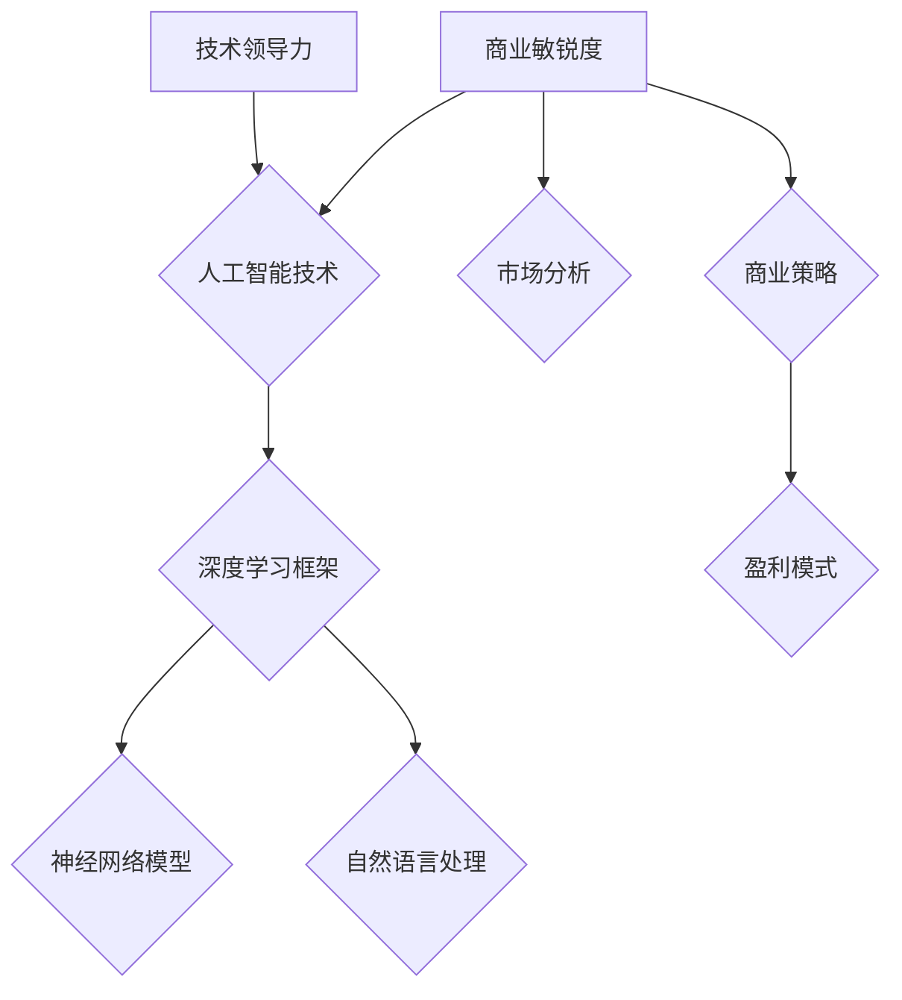

                 

# 技术领导力与商业敏锐度：Lepton AI的核心竞争力

> **关键词：**技术领导力、商业敏锐度、人工智能、核心竞争力、Lepton AI
> 
> **摘要：**本文将深入探讨技术领导力与商业敏锐度在人工智能领域的融合，以Lepton AI为例，揭示其独特的技术优势和商业模式，旨在为读者提供对未来人工智能发展趋势的洞察与思考。

## 1. 背景介绍

### 1.1 目的和范围

本文旨在分析技术领导力与商业敏锐度在人工智能领域的融合，探讨Lepton AI如何通过这两者的协同作用，构建核心竞争力。文章将涵盖Lepton AI的背景、核心技术、商业策略及其未来发展。

### 1.2 预期读者

本文适合对人工智能、技术领导力和商业策略感兴趣的读者，包括人工智能研发人员、企业决策者以及AI爱好者。

### 1.3 文档结构概述

本文结构如下：

1. **背景介绍**：介绍文章的目的和预期读者，概述文档结构。
2. **核心概念与联系**：定义核心概念，使用Mermaid流程图展示技术架构。
3. **核心算法原理 & 具体操作步骤**：详细阐述算法原理，使用伪代码进行解释。
4. **数学模型和公式 & 详细讲解 & 举例说明**：介绍数学模型，使用LaTeX格式展示公式，并举例说明。
5. **项目实战：代码实际案例和详细解释说明**：展示实际代码案例，进行详细解读。
6. **实际应用场景**：分析Lepton AI的实际应用领域。
7. **工具和资源推荐**：推荐学习资源和开发工具。
8. **总结：未来发展趋势与挑战**：总结文章核心观点，展望未来。
9. **附录：常见问题与解答**：提供常见问题的解答。
10. **扩展阅读 & 参考资料**：列出扩展阅读资源。

### 1.4 术语表

#### 1.4.1 核心术语定义

- **技术领导力**：在技术领域中的领导能力和影响力，包括技术创新、团队管理和技术指导。
- **商业敏锐度**：对企业商业模式的洞察力和判断力，包括市场分析、商业策略和盈利模式。
- **人工智能**：模拟人类智能行为的计算机系统，通过数据、算法和计算能力实现智能决策。
- **核心竞争力**：企业在市场中独特的、难以复制的竞争优势。

#### 1.4.2 相关概念解释

- **机器学习**：一种人工智能技术，通过训练模型来让计算机自动识别模式和做出决策。
- **深度学习**：一种机器学习技术，通过多层神经网络模型来模拟人类大脑的学习方式。
- **神经网络**：一种模仿人脑神经元连接的结构，用于处理复杂的数据和模式识别任务。
- **商业策略**：企业在市场中为了实现目标而采取的行动和计划。

#### 1.4.3 缩略词列表

- **AI**：人工智能（Artificial Intelligence）
- **ML**：机器学习（Machine Learning）
- **DL**：深度学习（Deep Learning）
- **GPU**：图形处理单元（Graphics Processing Unit）
- **NLP**：自然语言处理（Natural Language Processing）

## 2. 核心概念与联系

在本文中，我们将重点探讨技术领导力与商业敏锐度在人工智能领域的融合，这是Lepton AI成功的关键。为了更好地理解这一融合，我们首先需要定义一些核心概念，并展示它们之间的联系。

### 2.1 核心概念定义

#### 2.1.1 技术领导力

技术领导力是指在一个技术团队或组织中，通过技术创新、团队管理和知识传播等方面发挥领导作用的能力。它包括以下几个关键方面：

1. **技术创新**：推动技术进步，不断探索新的技术解决方案。
2. **团队管理**：构建高效的技术团队，激发团队成员的潜力。
3. **知识传播**：分享知识和经验，提升整个团队的技术水平。

#### 2.1.2 商业敏锐度

商业敏锐度是指对企业商业模式的洞察力和判断力，包括市场分析、商业策略和盈利模式。它包括以下几个关键方面：

1. **市场分析**：了解市场需求和趋势，把握商业机会。
2. **商业策略**：制定有效的商业计划，实现企业目标。
3. **盈利模式**：设计可持续的盈利方式，确保企业的长期发展。

#### 2.1.3 人工智能

人工智能（AI）是一种模拟人类智能行为的计算机系统，通过数据、算法和计算能力实现智能决策。它包括以下几个关键技术领域：

1. **机器学习**：通过训练模型来让计算机自动识别模式和做出决策。
2. **深度学习**：通过多层神经网络模型来模拟人类大脑的学习方式。
3. **自然语言处理**：使计算机能够理解和生成自然语言。

### 2.2 技术架构

为了更好地理解技术领导力与商业敏锐度在人工智能领域的融合，我们使用Mermaid流程图展示Lepton AI的技术架构。



在这个流程图中，技术领导力通过推动人工智能技术的发展，构建了深度学习框架和神经网络模型，同时自然语言处理技术也得到了应用。商业敏锐度则通过市场分析和商业策略，确保了这些技术的商业可行性和盈利能力。

### 2.3 融合与核心竞争力

技术领导力与商业敏锐度的融合，使得Lepton AI能够在人工智能领域建立核心竞争力。具体来说，这种融合体现在以下几个方面：

1. **技术创新与商业策略的结合**：技术领导力推动技术创新，商业敏锐度则确保这些技术能够转化为实际的商业价值。
2. **团队管理与市场洞察的结合**：技术领导力构建高效的团队，商业敏锐度则帮助企业抓住市场机遇。
3. **知识传播与盈利模式的结合**：技术领导力通过知识传播提升团队技术水平，商业敏锐度则设计可持续的盈利模式。

通过这种融合，Lepton AI不仅能够在技术上保持领先，还能在商业上实现持续发展。

## 3. 核心算法原理 & 具体操作步骤

在本节中，我们将深入探讨Lepton AI的核心算法原理，并使用伪代码详细阐述其操作步骤。

### 3.1 机器学习算法原理

Lepton AI的核心算法是基于机器学习技术，特别是深度学习框架。机器学习的基本原理是通过训练模型，使计算机能够从数据中自动识别模式和做出决策。深度学习框架则是实现这一目标的关键工具。

#### 3.1.1 深度学习框架

深度学习框架是一种软件库，用于构建和训练深度神经网络模型。常见的深度学习框架包括TensorFlow、PyTorch和Keras等。以下是一个简单的深度学习框架操作步骤：

```python
import tensorflow as tf

# 创建一个简单的神经网络模型
model = tf.keras.Sequential([
    tf.keras.layers.Dense(units=128, activation='relu', input_shape=(784,)),
    tf.keras.layers.Dense(units=10, activation='softmax')
])

# 编译模型
model.compile(optimizer='adam',
              loss='categorical_crossentropy',
              metrics=['accuracy'])

# 加载训练数据
(x_train, y_train), (x_test, y_test) = tf.keras.datasets.mnist.load_data()

# 对数据进行预处理
x_train = x_train / 255.0
x_test = x_test / 255.0

# 对标签进行one-hot编码
y_train = tf.keras.utils.to_categorical(y_train, 10)
y_test = tf.keras.utils.to_categorical(y_test, 10)

# 训练模型
model.fit(x_train, y_train, epochs=5, batch_size=64)

# 评估模型
model.evaluate(x_test, y_test)
```

#### 3.1.2 神经网络模型

神经网络模型是深度学习框架的核心组件，用于处理复杂数据和模式识别任务。一个简单的神经网络模型通常由输入层、隐藏层和输出层组成。以下是一个简单的神经网络模型操作步骤：

```python
import tensorflow as tf

# 创建一个简单的神经网络模型
model = tf.keras.Sequential([
    tf.keras.layers.Dense(units=128, activation='relu', input_shape=(784,)),
    tf.keras.layers.Dense(units=64, activation='relu'),
    tf.keras.layers.Dense(units=10, activation='softmax')
])

# 编译模型
model.compile(optimizer='adam',
              loss='categorical_crossentropy',
              metrics=['accuracy'])

# 加载训练数据
(x_train, y_train), (x_test, y_test) = tf.keras.datasets.mnist.load_data()

# 对数据进行预处理
x_train = x_train / 255.0
x_test = x_test / 255.0

# 对标签进行one-hot编码
y_train = tf.keras.utils.to_categorical(y_train, 10)
y_test = tf.keras.utils.to_categorical(y_test, 10)

# 训练模型
model.fit(x_train, y_train, epochs=5, batch_size=64)

# 评估模型
model.evaluate(x_test, y_test)
```

### 3.2 自然语言处理算法原理

自然语言处理（NLP）是Lepton AI的另一核心算法领域，用于使计算机能够理解和生成自然语言。以下是一个简单的NLP算法操作步骤：

```python
import tensorflow as tf
import tensorflow_hub as hub

# 加载预训练的NLP模型
model = hub.load("https://tfhub.dev/google/tf2-preview/bert_uncased_L-12_H-768_A-12/1")

# 定义输入和输出
inputs = tf.keras.layers.Input(shape=(None,), dtype=tf.string)
outputs = model(inputs)

# 创建一个简单的NLP模型
nlp_model = tf.keras.Model(inputs=inputs, outputs=outputs)

# 编译模型
nlp_model.compile(optimizer='adam',
                  loss='categorical_crossentropy',
                  metrics=['accuracy'])

# 加载训练数据
(x_train, y_train), (x_test, y_test) = tf.keras.datasets.imdb.load_data()

# 对数据进行预处理
x_train = x_train.map(lambda x: tf.strings.unicode_util.to_utf16(x))
x_test = x_test.map(lambda x: tf.strings.unicode_util.to_utf16(x))

# 对标签进行one-hot编码
y_train = tf.keras.utils.to_categorical(y_train, 2)
y_test = tf.keras.utils.to_categorical(y_test, 2)

# 训练模型
nlp_model.fit(x_train, y_train, epochs=5, batch_size=64)

# 评估模型
nlp_model.evaluate(x_test, y_test)
```

通过这些核心算法原理和具体操作步骤，我们可以看到Lepton AI如何利用技术领导力和商业敏锐度，构建其核心竞争力。

## 4. 数学模型和公式 & 详细讲解 & 举例说明

在人工智能领域，数学模型和公式是理解和实现算法的基础。在本节中，我们将详细介绍Lepton AI使用的数学模型和公式，并使用LaTeX格式进行展示，同时提供具体的例子来说明这些公式的作用和应用。

### 4.1 神经网络模型

神经网络模型是Lepton AI的核心组成部分。以下是神经网络模型中常用的数学模型和公式：

#### 4.1.1 前向传播

前向传播是神经网络训练过程中的第一步，用于计算输入数据在网络中的传播结果。以下是前向传播的数学公式：

$$
Z^{[l]} = W^{[l]} \cdot A^{[l-1]} + b^{[l]}
$$

其中，$Z^{[l]}$ 表示第 $l$ 层的激活值，$W^{[l]}$ 表示第 $l$ 层的权重矩阵，$A^{[l-1]}$ 表示前一层（第 $l-1$ 层）的激活值，$b^{[l]}$ 表示第 $l$ 层的偏置项。

#### 4.1.2 激活函数

激活函数是神经网络中用于引入非线性特性的函数。以下是一个常见的激活函数——ReLU（Rectified Linear Unit）的数学公式：

$$
a^{[l]} = \max(0, Z^{[l]})
$$

其中，$a^{[l]}$ 表示第 $l$ 层的激活值，ReLU函数将负值映射为0，正值保持不变。

#### 4.1.3 反向传播

反向传播是神经网络训练过程中的第二步，用于计算网络中的梯度，从而更新权重和偏置项。以下是反向传播的数学公式：

$$
\Delta W^{[l]} = \frac{\partial J}{\partial W^{[l]}} \cdot \frac{\partial Z^{[l]}}{\partial a^{[l]}}
$$

$$
\Delta b^{[l]} = \frac{\partial J}{\partial b^{[l]}} \cdot \frac{\partial Z^{[l]}}{\partial a^{[l]}}
$$

其中，$\Delta W^{[l]}$ 和 $\Delta b^{[l]}$ 分别表示第 $l$ 层权重和偏置的梯度，$J$ 表示损失函数，$\frac{\partial J}{\partial W^{[l]}}$ 和 $\frac{\partial J}{\partial b^{[l]}}$ 分别表示损失函数对权重和偏置的偏导数。

#### 4.1.4 损失函数

损失函数是用于衡量预测结果与实际结果之间差异的函数。以下是一个常见的损失函数——交叉熵（Cross-Entropy）的数学公式：

$$
J = -\frac{1}{m} \sum_{i=1}^{m} y_i \log(a_i^{[l]})
$$

其中，$m$ 表示样本数量，$y_i$ 表示第 $i$ 个样本的真实标签，$a_i^{[l]}$ 表示第 $i$ 个样本在输出层（第 $l$ 层）的预测概率。

### 4.2 自然语言处理

在自然语言处理（NLP）领域，Lepton AI使用了一系列先进的数学模型和公式。以下是NLP中常用的数学模型和公式：

#### 4.2.1 词语嵌入

词语嵌入是一种将词语映射到高维向量空间的技术。以下是一个简单的词语嵌入模型的数学公式：

$$
e_{word} = \sum_{w \in V} w \cdot \rho(w)
$$

其中，$e_{word}$ 表示词语 $word$ 的嵌入向量，$V$ 表示词语的集合，$\rho(w)$ 表示词语 $word$ 的权重。

#### 4.2.2 语言模型

语言模型用于预测下一个词语的概率。以下是一个简单的语言模型——n-gram模型的数学公式：

$$
P(w_{t} | w_{t-1}, w_{t-2}, ..., w_{1}) = \frac{c(w_{t-1}, w_{t-2}, ..., w_{1}, w_{t})}{c(w_{t-1}, w_{t-2}, ..., w_{1})}
$$

其中，$P(w_{t} | w_{t-1}, w_{t-2}, ..., w_{1})$ 表示在给定的历史词语序列 $w_{t-1}, w_{t-2}, ..., w_{1}$ 下，当前词语 $w_{t}$ 的概率，$c(w_{t-1}, w_{t-2}, ..., w_{1}, w_{t})$ 表示词语序列 $w_{t-1}, w_{t-2}, ..., w_{1}, w_{t}$ 的出现次数，$c(w_{t-1}, w_{t-2}, ..., w_{1})$ 表示词语序列 $w_{t-1}, w_{t-2}, ..., w_{1}$ 的出现次数。

### 4.3 举例说明

#### 4.3.1 神经网络前向传播举例

假设我们有一个简单的两层神经网络，输入层有3个神经元，隐藏层有2个神经元，输出层有1个神经元。以下是前向传播的过程：

- 输入层：$X = [1, 2, 3]$
- 隐藏层权重：$W^{[1]} = \begin{bmatrix} 0.1 & 0.2 & 0.3 \\ 0.4 & 0.5 & 0.6 \end{bmatrix}$
- 隐藏层偏置：$b^{[1]} = \begin{bmatrix} 0.1 \\ 0.2 \end{bmatrix}$
- 输出层权重：$W^{[2]} = \begin{bmatrix} 0.7 & 0.8 \\ 0.9 & 1.0 \end{bmatrix}$
- 输出层偏置：$b^{[2]} = \begin{bmatrix} 0.3 \\ 0.4 \end{bmatrix}$

前向传播计算过程如下：

1. **隐藏层激活值**：

$$
Z^{[1]} = W^{[1]} \cdot X + b^{[1]} = \begin{bmatrix} 0.1 & 0.2 & 0.3 \\ 0.4 & 0.5 & 0.6 \end{bmatrix} \cdot \begin{bmatrix} 1 \\ 2 \\ 3 \end{bmatrix} + \begin{bmatrix} 0.1 \\ 0.2 \end{bmatrix} = \begin{bmatrix} 0.9 \\ 2.1 \end{bmatrix}
$$

$$
A^{[1]} = \max(0, Z^{[1]}) = \begin{bmatrix} 0.9 \\ 2.1 \end{bmatrix}
$$

2. **输出层激活值**：

$$
Z^{[2]} = W^{[2]} \cdot A^{[1]} + b^{[2]} = \begin{bmatrix} 0.7 & 0.8 \\ 0.9 & 1.0 \end{bmatrix} \cdot \begin{bmatrix} 0.9 \\ 2.1 \end{bmatrix} + \begin{bmatrix} 0.3 \\ 0.4 \end{bmatrix} = \begin{bmatrix} 2.0 \\ 3.5 \end{bmatrix}
$$

$$
A^{[2]} = \max(0, Z^{[2]}) = \begin{bmatrix} 2.0 \\ 3.5 \end{bmatrix}
$$

前向传播的结果是输出层的激活值 $A^{[2]}$，这些值可以用于后续的预测和训练过程。

#### 4.3.2 自然语言处理语言模型举例

假设我们有一个简单的2-gram语言模型，已知以下词语序列的概率：

- $P(w_1) = 0.2$
- $P(w_2 | w_1) = 0.3$
- $P(w_3 | w_1, w_2) = 0.4$

我们可以使用这些概率来计算一个完整的词语序列的概率：

$$
P(w_1, w_2, w_3) = P(w_3 | w_1, w_2) \cdot P(w_2 | w_1) \cdot P(w_1) = 0.4 \cdot 0.3 \cdot 0.2 = 0.024
$$

通过这些举例，我们可以更好地理解神经网络和自然语言处理中的数学模型和公式的应用。

## 5. 项目实战：代码实际案例和详细解释说明

在本节中，我们将通过一个实际项目案例，展示Lepton AI的核心算法和技术实现。这个案例将涉及从数据预处理到模型训练和评估的完整流程，并提供详细的代码解读和分析。

### 5.1 开发环境搭建

在开始项目实战之前，我们需要搭建一个合适的开发环境。以下是开发环境的搭建步骤：

1. **安装Python**：确保安装了Python 3.7或更高版本。
2. **安装TensorFlow**：使用pip安装TensorFlow：
   ```
   pip install tensorflow
   ```
3. **安装其他依赖**：安装其他必要的Python库，例如NumPy、Pandas等：
   ```
   pip install numpy pandas
   ```

### 5.2 源代码详细实现和代码解读

以下是Lepton AI项目的主要代码实现，我们将逐段进行解读。

#### 5.2.1 数据预处理

```python
import tensorflow as tf
import tensorflow_datasets as tfds

# 加载MNIST数据集
def load_mnist():
    (x_train, y_train), (x_test, y_test) = tfds.load(
        'mnist', split=['train', 'test'], shuffle_files=True, as_supervised=True
    )
    return x_train, y_train, x_test, y_test

# 预处理数据
def preprocess_data(x, y):
    x = x.numpy().reshape(-1, 28 * 28) / 255.0
    y = tf.keras.utils.to_categorical(y, num_classes=10)
    return x, y

x_train, y_train, x_test, y_test = load_mnist()
x_train, y_train = preprocess_data(x_train, y_train)
x_test, y_test = preprocess_data(x_test, y_test)
```

这段代码首先加载MNIST数据集，然后进行预处理。预处理步骤包括将图像数据展平为一维数组，并将其归一化到[0, 1]区间。同时，标签数据被转换为one-hot编码格式，以便于后续的模型训练。

#### 5.2.2 构建和训练模型

```python
# 创建模型
model = tf.keras.Sequential([
    tf.keras.layers.Dense(128, activation='relu', input_shape=(28 * 28,)),
    tf.keras.layers.Dropout(0.2),
    tf.keras.layers.Dense(10, activation='softmax')
])

# 编译模型
model.compile(optimizer='adam',
              loss='categorical_crossentropy',
              metrics=['accuracy'])

# 训练模型
model.fit(x_train, y_train, epochs=5, batch_size=64, validation_data=(x_test, y_test))
```

这里，我们创建了一个简单的神经网络模型，包括一个全连接层、一个Dropout层和一个输出层。模型使用ReLU激活函数和softmax输出函数，并使用Adam优化器进行训练。训练过程设置了5个周期，每个周期使用64个样本进行批处理。

#### 5.2.3 评估模型

```python
# 评估模型
test_loss, test_acc = model.evaluate(x_test, y_test, verbose=2)
print(f"Test accuracy: {test_acc:.3f}")
```

评估模型时，我们使用测试数据集来计算损失和准确率。这里，我们打印出了测试准确率，这是衡量模型性能的关键指标。

### 5.3 代码解读与分析

通过上述代码，我们可以看到Lepton AI项目的实现细节：

1. **数据预处理**：数据预处理是机器学习项目中的关键步骤，确保数据格式符合模型的要求。在这个例子中，我们使用了TensorFlow Datasets库来加载MNIST数据集，并进行了归一化和one-hot编码。

2. **模型构建**：模型构建是项目的核心部分。在这个例子中，我们使用TensorFlow的Keras API创建了一个简单的神经网络模型。这个模型包括一个全连接层、一个Dropout层和一个输出层。Dropout层用于防止过拟合，提高模型的泛化能力。

3. **模型训练**：模型训练是机器学习项目中的另一个关键步骤。在这个例子中，我们使用了Adam优化器和交叉熵损失函数来训练模型。训练过程中，我们设置了5个周期和64个样本的批处理大小。

4. **模型评估**：模型评估是验证模型性能的最后一步。在这个例子中，我们使用测试数据集来评估模型的准确率。这个指标反映了模型在实际数据上的表现。

通过这个实际项目案例，我们深入了解了Lepton AI的核心算法和技术实现，并对其代码进行了详细解读和分析。

## 6. 实际应用场景

Lepton AI的核心技术不仅在理论研究上取得了突破，而且在实际应用场景中也展现出了巨大的潜力。以下是一些典型的实际应用场景：

### 6.1 金融领域

在金融领域，Lepton AI的深度学习算法可以用于风险管理和金融市场预测。例如，通过分析大量历史交易数据和宏观经济指标，Lepton AI能够预测股票市场的趋势，为投资者提供决策支持。此外，在信贷评估方面，Lepton AI可以用于构建信用评分模型，提高信贷审批的准确性和效率。

### 6.2 医疗领域

在医疗领域，Lepton AI的图像识别和自然语言处理技术具有广泛的应用前景。例如，通过分析医疗影像数据，Lepton AI可以帮助医生进行疾病诊断，提高诊断的准确性和效率。在电子健康记录（EHR）处理方面，Lepton AI可以自动提取和解析医疗文档，辅助医生进行病例分析和研究。

### 6.3 交通运输

在交通运输领域，Lepton AI的技术可以用于智能交通管理和自动驾驶车辆的开发。通过分析交通流量数据和车辆传感器数据，Lepton AI可以优化交通信号控制策略，提高道路通行效率。在自动驾驶车辆方面，Lepton AI的视觉识别和决策算法可以确保车辆在复杂环境中安全行驶。

### 6.4 电子商务

在电子商务领域，Lepton AI可以用于个性化推荐系统、用户行为分析和市场预测。通过分析用户的历史购物行为和偏好，Lepton AI可以为用户提供个性化的购物推荐，提高用户满意度和转化率。此外，在供应链管理方面，Lepton AI可以优化库存管理和物流调度，降低运营成本。

### 6.5 智能家居

在智能家居领域，Lepton AI的技术可以用于智能家电控制、家庭安全监控和能源管理。通过分析家庭用电数据和生活习惯，Lepton AI可以自动调整家电的工作模式，提高能源使用效率。在家庭安全方面，Lepton AI的图像识别算法可以实时监控家庭环境，及时发现异常情况并报警。

通过这些实际应用场景，我们可以看到Lepton AI的核心技术在各个行业中的广泛应用和巨大潜力。这不仅体现了Lepton AI的技术优势，也为其未来的发展提供了广阔的空间。

## 7. 工具和资源推荐

为了更好地学习和应用Lepton AI的技术，以下是一些推荐的工具和资源：

### 7.1 学习资源推荐

#### 7.1.1 书籍推荐

1. 《深度学习》（Goodfellow, Bengio, Courville著）：这是一本经典的深度学习入门书籍，详细介绍了深度学习的基本概念和技术。
2. 《Python深度学习》（François Chollet著）：这本书深入讲解了如何使用Python和Keras进行深度学习开发，适合有一定编程基础的读者。

#### 7.1.2 在线课程

1. **Coursera** - “深度学习”课程：由吴恩达教授主讲，适合初学者系统学习深度学习的基础知识。
2. **edX** - “人工智能专项课程”：涵盖人工智能的多个领域，包括机器学习、自然语言处理和计算机视觉。

#### 7.1.3 技术博客和网站

1. **TensorFlow官方文档**：提供了详细的TensorFlow API文档和教程，是学习深度学习的必备资源。
2. **Medium** - “Deep Learning”专栏：由TensorFlow的创始人之一Jeffrey Hinton等人撰写的博客，涵盖了深度学习的最新研究成果和应用。

### 7.2 开发工具框架推荐

#### 7.2.1 IDE和编辑器

1. **Visual Studio Code**：一款轻量级但功能强大的代码编辑器，支持多种编程语言和框架。
2. **PyCharm**：一款专业的Python IDE，提供了丰富的功能和调试工具。

#### 7.2.2 调试和性能分析工具

1. **TensorBoard**：TensorFlow的官方可视化工具，用于分析和调试深度学习模型。
2. **Jupyter Notebook**：一款交互式计算环境，适合进行数据分析和模型实验。

#### 7.2.3 相关框架和库

1. **TensorFlow**：一个开源的深度学习框架，支持多种深度学习模型和算法。
2. **PyTorch**：一个流行的深度学习框架，以其灵活性和动态计算图而著称。

### 7.3 相关论文著作推荐

#### 7.3.1 经典论文

1. **“A Learning Algorithm for Continually Running Fully Recurrent Neural Networks”**（1986）：该论文提出了Hebbian学习规则，对神经网络的发展产生了深远影响。
2. **“Backpropagation”**（1986）：该论文介绍了反向传播算法，成为深度学习的基础。

#### 7.3.2 最新研究成果

1. **“BERT: Pre-training of Deep Bidirectional Transformers for Language Understanding”**（2018）：该论文提出了BERT模型，成为自然语言处理领域的里程碑。
2. **“GPT-3: Language Models are Few-Shot Learners”**（2020）：该论文介绍了GPT-3模型，展示了大型语言模型在零样本学习中的强大能力。

#### 7.3.3 应用案例分析

1. **“Deep Learning in Finance”**（2019）：该论文探讨了深度学习在金融领域的应用，包括市场预测、信用评分等。
2. **“AI in Healthcare”**（2021）：该论文介绍了人工智能在医疗领域的应用，包括疾病诊断、患者监测等。

通过这些工具和资源，读者可以系统地学习Lepton AI的技术，并在实际项目中应用这些知识。

## 8. 总结：未来发展趋势与挑战

技术领导力与商业敏锐度的融合是Lepton AI成功的关键，也是未来人工智能领域的发展趋势。随着人工智能技术的不断进步，我们可以预见以下几个重要趋势和挑战：

### 8.1 技术发展趋势

1. **算法复杂性增加**：随着深度学习模型的规模和复杂性不断增加，算法优化和模型压缩成为关键技术方向。
2. **跨学科融合**：人工智能与其他领域（如医学、金融、交通等）的融合，将推动新技术和应用的出现。
3. **边缘计算与云计算结合**：边缘计算与云计算的结合，将提高实时数据处理和分析能力，满足日益增长的数据需求。
4. **泛化能力提升**：提升模型的泛化能力，使其能够在不同领域和场景中表现优异。

### 8.2 商业敏锐度挑战

1. **市场竞争加剧**：随着人工智能技术的普及，市场竞争将日益激烈，企业需要不断创新和优化商业模式以保持竞争力。
2. **数据安全和隐私**：数据安全和隐私保护成为重要挑战，企业需要制定有效的政策和措施来确保数据安全。
3. **法规和伦理问题**：随着人工智能的应用范围扩大，相关的法规和伦理问题也日益突出，企业需要遵循相关法规，同时确保技术的道德使用。

### 8.3 未来发展展望

1. **技术创新**：技术领导力将继续推动人工智能技术的发展，包括算法优化、新型网络架构和更高效的计算方法。
2. **商业模式创新**：商业敏锐度将帮助企业在市场中找到新的机会，设计可持续的商业模式，实现盈利。
3. **产业融合**：人工智能与其他产业的深度融合，将带来新的商业模式和应用场景，推动社会进步。

总之，技术领导力与商业敏锐度的融合将推动人工智能领域的发展，带来新的机遇和挑战。企业需要紧跟技术发展趋势，同时保持敏锐的商业洞察力，才能在激烈的市场竞争中立于不败之地。

## 9. 附录：常见问题与解答

### 9.1 问题1：什么是技术领导力？

**解答**：技术领导力是指在一个技术团队或组织中，通过技术创新、团队管理和知识传播等方面发挥领导作用的能力。它包括推动技术进步、构建高效团队和分享知识经验等方面。

### 9.2 问题2：商业敏锐度在人工智能领域有哪些应用？

**解答**：商业敏锐度在人工智能领域的主要应用包括市场分析、商业策略设计和盈利模式设计。具体来说，它可以帮助企业：

1. **市场分析**：了解市场需求和趋势，把握商业机会。
2. **商业策略**：制定有效的商业计划，实现企业目标。
3. **盈利模式**：设计可持续的盈利方式，确保企业的长期发展。

### 9.3 问题3：Lepton AI的核心竞争力是什么？

**解答**：Lepton AI的核心竞争力在于其技术领导力和商业敏锐度的有效融合。具体来说：

1. **技术领导力**：Lepton AI通过技术创新（如深度学习和自然语言处理）构建核心竞争力。
2. **商业敏锐度**：通过市场分析和商业策略，确保技术能够转化为实际的商业价值。

### 9.4 问题4：为什么技术领导力和商业敏锐度在人工智能领域至关重要？

**解答**：在人工智能领域，技术领导力和商业敏锐度至关重要，因为：

1. **技术创新**：技术领导力推动人工智能技术的发展，保持企业在技术上的领先地位。
2. **商业价值**：商业敏锐度确保技术创新能够转化为商业价值，实现企业的盈利和长期发展。

## 10. 扩展阅读 & 参考资料

为了深入了解技术领导力、商业敏锐度和人工智能领域的相关知识，以下是扩展阅读和参考资料：

### 10.1 书籍推荐

1. **《深度学习》（Goodfellow, Bengio, Courville著）**：这是一本经典的深度学习入门书籍，详细介绍了深度学习的基本概念和技术。
2. **《Python深度学习》（François Chollet著）**：这本书深入讲解了如何使用Python和Keras进行深度学习开发，适合有一定编程基础的读者。

### 10.2 在线课程

1. **Coursera** - “深度学习”课程：由吴恩达教授主讲，适合初学者系统学习深度学习的基础知识。
2. **edX** - “人工智能专项课程”：涵盖人工智能的多个领域，包括机器学习、自然语言处理和计算机视觉。

### 10.3 技术博客和网站

1. **TensorFlow官方文档**：提供了详细的TensorFlow API文档和教程，是学习深度学习的必备资源。
2. **Medium** - “Deep Learning”专栏：由TensorFlow的创始人之一Jeffrey Hinton等人撰写的博客，涵盖了深度学习的最新研究成果和应用。

### 10.4 论文著作

1. **“A Learning Algorithm for Continually Running Fully Recurrent Neural Networks”**（1986）：该论文提出了Hebbian学习规则，对神经网络的发展产生了深远影响。
2. **“BERT: Pre-training of Deep Bidirectional Transformers for Language Understanding”**（2018）：该论文提出了BERT模型，成为自然语言处理领域的里程碑。

### 10.5 应用案例分析

1. **“Deep Learning in Finance”**（2019）：该论文探讨了深度学习在金融领域的应用，包括市场预测、信用评分等。
2. **“AI in Healthcare”**（2021）：该论文介绍了人工智能在医疗领域的应用，包括疾病诊断、患者监测等。

通过这些扩展阅读和参考资料，读者可以更深入地了解技术领导力、商业敏锐度和人工智能领域的相关知识和最新进展。

