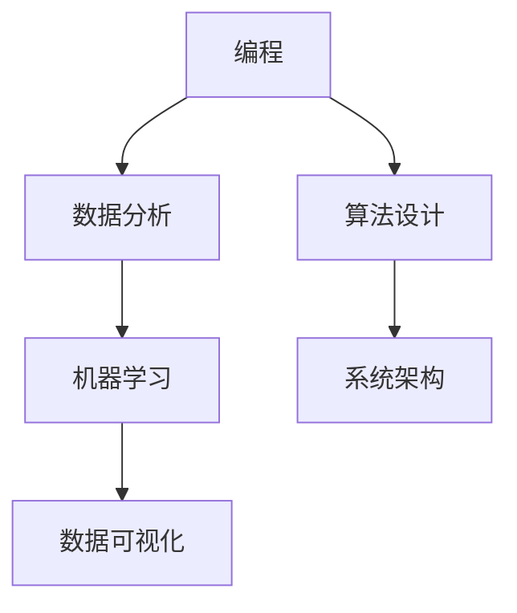
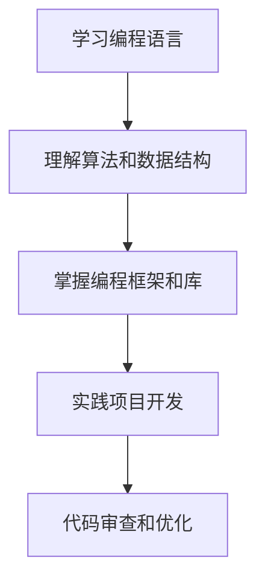
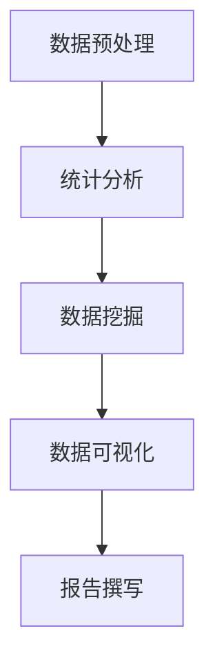
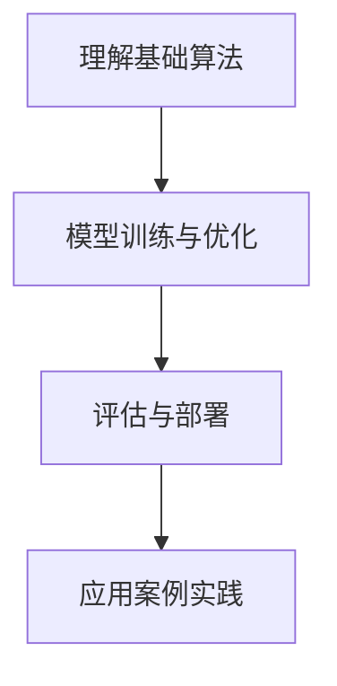
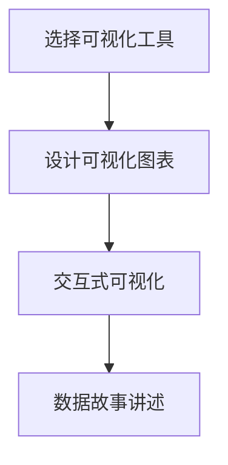

                 


# 技能提升：适应人类计算时代的新需求

> 关键词：计算时代，人工智能，技能提升，人类协作，技术趋势
>
> 摘要：本文旨在探讨在当前计算时代下，如何提升个人技能以更好地适应和利用新技术，实现人类与计算机的协同发展。文章将分析计算时代的特点，介绍核心技能要求，并给出具体的学习和实践建议。

## 1. 背景介绍

### 1.1 目的和范围

随着人工智能和大数据技术的飞速发展，人类进入了一个全新的计算时代。在这个时代，计算能力已经超越了人类的许多传统认知和能力，同时也对人类的工作、生活和学习提出了新的要求。本文的目标是帮助读者了解这个计算时代的背景和特点，明确提升技能的需求，并探索适应这一时代的方法。

### 1.2 预期读者

本文预期读者为以下几类人群：
- 正在寻找职业发展的个人
- 企业管理层，需要了解技术趋势以指导公司战略
- 技术从业者，希望提升个人技能以应对未来挑战
- 技术爱好者，对人工智能和计算技术感兴趣

### 1.3 文档结构概述

本文分为以下几个部分：
1. 背景介绍：分析计算时代的特点和挑战。
2. 核心概念与联系：介绍计算时代的关键技能。
3. 核心算法原理与具体操作步骤：讲解关键技术点的实现。
4. 数学模型和公式：阐述计算过程中涉及的数学原理。
5. 项目实战：提供实际代码案例。
6. 实际应用场景：分析技术在不同领域的应用。
7. 工具和资源推荐：推荐学习资源和开发工具。
8. 总结：预测未来发展趋势和挑战。
9. 附录：常见问题与解答。
10. 扩展阅读：提供进一步学习的参考资料。

### 1.4 术语表

#### 1.4.1 核心术语定义

- **计算时代**：指以计算技术为核心，大数据、人工智能等技术广泛应用的时代。
- **技能提升**：指通过学习和实践，提高个人在特定领域的专业能力和技术水平。
- **人工智能**：指通过计算机模拟人类智能行为，实现智能决策和问题解决的技术。

#### 1.4.2 相关概念解释

- **机器学习**：一种人工智能方法，通过数据训练模型，使其具备自主学习和优化能力。
- **深度学习**：一种基于神经网络的学习方法，能够通过多层非线性变换提取特征。

#### 1.4.3 缩略词列表

- **AI**：人工智能
- **ML**：机器学习
- **DL**：深度学习

## 2. 核心概念与联系

在计算时代，核心技能包括编程、数据分析、机器学习、数据可视化等。以下是一个简单的 Mermaid 流程图，展示了这些技能之间的关系：



### 2.1 编程技能

编程是计算时代的基础，它决定了我们如何与计算机交互，编写软件和应用。以下是一个简化的编程技能流程图：



### 2.2 数据分析技能

数据分析是挖掘数据价值的重要手段，它帮助我们理解数据背后的模式和趋势。以下是一个数据分析技能流程图：



### 2.3 机器学习技能

机器学习是人工智能的核心技术，它使计算机能够自主学习和优化。以下是一个机器学习技能流程图：



### 2.4 数据可视化技能

数据可视化是将数据以图形形式展示，帮助我们直观地理解数据。以下是一个数据可视化技能流程图：



## 3. 核心算法原理与具体操作步骤

### 3.1 编程算法

编程算法是实现特定功能的关键，以下是一个简单的算法流程图，使用伪代码展示：

```plaintext
Algorithm: 欧几里得算法（求最大公约数）
Input: a, b（两个整数）
Output: gcd（最大公约数）

1. 如果 b 为 0，则 gcd = a，结束
2. 否则，递归调用 gcd(b, a % b)
```

### 3.2 数据分析算法

数据分析中的算法包括排序、搜索、分类等。以下是一个简单的排序算法（冒泡排序）的伪代码：

```plaintext
Algorithm: 冒泡排序
Input: arr（一个无序数组）
Output: arr（一个有序数组）

1. 对于每个元素 i（从 1 到 n-1）
    2. 对于每个元素 j（从 1 到 n-i）
        3. 如果 arr[j] > arr[j+1]，交换 arr[j] 和 arr[j+1]
```

### 3.3 机器学习算法

机器学习算法的实现通常涉及多个步骤，以下是一个简单的线性回归算法的伪代码：

```plaintext
Algorithm: 线性回归
Input: X（自变量矩阵），y（因变量向量）
Output: w（模型权重），b（偏置）

1. 初始化 w 和 b 为随机值
2. 对于每个迭代 i
    3. 计算 y 的预测值 y_pred = X * w + b
    4. 计算 loss = (y_pred - y)^2
    5. 计算梯度 ∇w = 2 * X^T * (y_pred - y)
    6. 计算梯度 ∇b = 2 * (y_pred - y)
    7. 更新 w = w - learning_rate * ∇w
    8. 更新 b = b - learning_rate * ∇b
9. 返回 w 和 b
```

### 3.4 数据可视化算法

数据可视化算法通常涉及数据预处理、图表生成和交互设计。以下是一个简单的数据可视化算法的伪代码：

```plaintext
Algorithm: 数据可视化
Input: data（数据集），chart_type（图表类型）
Output: chart（可视化图表）

1. 预处理数据，确保数据格式和类型符合要求
2. 根据 chart_type 生成相应的图表
    3. 如果 chart_type 为 "line"，则生成折线图
    4. 如果 chart_type 为 "bar"，则生成柱状图
    5. 如果 chart_type 为 "pie"，则生成饼图
3. 将数据映射到图表的坐标轴和颜色上
4. 添加交互元素，如缩放、筛选、提示等
5. 返回 chart
```

## 4. 数学模型和公式 & 详细讲解 & 举例说明

在计算时代，数学模型和公式扮演着重要的角色。以下是一些常见的数学模型和公式的详细讲解以及实际应用示例。

### 4.1 线性回归模型

线性回归模型是机器学习中的一种基础模型，用于预测一个连续的数值变量。其数学公式为：

\[ y = \beta_0 + \beta_1 \cdot x + \epsilon \]

其中，\( y \) 是因变量，\( x \) 是自变量，\( \beta_0 \) 和 \( \beta_1 \) 分别是模型的截距和斜率，\( \epsilon \) 是误差项。

**示例：** 假设我们想预测一个人的年龄（因变量）与其身高（自变量）之间的关系。使用线性回归模型，我们可以建立如下公式：

\[ 年龄 = \beta_0 + \beta_1 \cdot 身高 + \epsilon \]

通过训练数据，我们可以得到 \( \beta_0 \) 和 \( \beta_1 \) 的值，从而预测新的身高对应的年龄。

### 4.2 逻辑回归模型

逻辑回归模型是一种用于预测二元变量的回归模型，其目标变量通常是一个二分类变量（0或1）。其数学公式为：

\[ P(Y=1) = \frac{1}{1 + e^{-(\beta_0 + \beta_1 \cdot x)}} \]

其中，\( P(Y=1) \) 是目标变量为1的概率，\( e \) 是自然底数，\( \beta_0 \) 和 \( \beta_1 \) 分别是模型的截距和斜率。

**示例：** 假设我们想预测一个患者的病情是否严重（目标变量，0表示病情不严重，1表示病情严重）。我们可以使用逻辑回归模型建立如下公式：

\[ P(病情严重) = \frac{1}{1 + e^{-(\beta_0 + \beta_1 \cdot 检查结果)}} \]

通过训练数据，我们可以得到 \( \beta_0 \) 和 \( \beta_1 \) 的值，从而预测新的检查结果对应的病情严重程度。

### 4.3 支持向量机模型

支持向量机（SVM）是一种分类算法，其目标是在高维空间中找到一个最佳的超平面，将不同类别的数据点分开。其数学公式为：

\[ w \cdot x - b = 0 \]

其中，\( w \) 是权重向量，\( x \) 是特征向量，\( b \) 是偏置项。

**示例：** 假设我们有一个二维空间，其中正类和负类的数据点分布在不同的区域。我们可以使用 SVM 模型找到一个最佳的超平面，将这两个类别分开。

\[ w \cdot x_+ - b = 1 \]
\[ w \cdot x_- - b = -1 \]

其中，\( x_+ \) 和 \( x_- \) 分别是正类和负类的特征向量。

### 4.4 神经网络模型

神经网络是一种基于生物神经网络原理设计的计算模型，可以用于多种机器学习任务，包括分类、回归和生成等。其数学公式为：

\[ a_{\text{layer}} = \sigma(\text{ReLU}(W_{\text{layer-1}} \cdot a_{\text{layer-1}} + b_{\text{layer-1}})) \]

其中，\( a_{\text{layer}} \) 是第 \( \text{layer} \) 层的激活值，\( \sigma \) 是激活函数（通常使用 ReLU 函数），\( W_{\text{layer-1}} \) 是第 \( \text{layer-1} \) 层到第 \( \text{layer} \) 层的权重矩阵，\( b_{\text{layer-1}} \) 是第 \( \text{layer-1} \) 层到第 \( \text{layer} \) 层的偏置向量。

**示例：** 假设我们有一个包含三个隐藏层的神经网络，用于分类任务。我们可以使用以下公式描述该神经网络：

\[ a_1 = \sigma(\text{ReLU}(W_1 \cdot a_0 + b_1)) \]
\[ a_2 = \sigma(\text{ReLU}(W_2 \cdot a_1 + b_2)) \]
\[ a_3 = \sigma(W_3 \cdot a_2 + b_3) \]

其中，\( a_0 \) 是输入层激活值，\( a_3 \) 是输出层激活值，\( W_1, W_2, W_3 \) 分别是输入层到第一层、第一层到第二层、第二层到第三层的权重矩阵，\( b_1, b_2, b_3 \) 分别是输入层到第一层、第一层到第二层、第二层到第三层的偏置向量。

## 5. 项目实战：代码实际案例和详细解释说明

### 5.1 开发环境搭建

在开始项目实战之前，我们需要搭建一个合适的开发环境。以下是搭建 Python 开发环境的基本步骤：

1. 安装 Python：从 [Python 官网](https://www.python.org/) 下载并安装 Python，建议安装最新版本。
2. 安装 IDE：选择一个适合 Python 开发的 IDE，如 PyCharm、VSCode 等。
3. 安装必要的库：使用 `pip` 命令安装所需的库，例如：

   ```bash
   pip install numpy pandas matplotlib scikit-learn
   ```

### 5.2 源代码详细实现和代码解读

以下是一个简单的线性回归项目的代码实现，包括数据预处理、模型训练和结果评估。

```python
# 导入必要的库
import numpy as np
import pandas as pd
import matplotlib.pyplot as plt
from sklearn.linear_model import LinearRegression
from sklearn.model_selection import train_test_split
from sklearn.metrics import mean_squared_error

# 加载数据
data = pd.read_csv("data.csv")
X = data.iloc[:, :-1].values
y = data.iloc[:, -1].values

# 数据预处理
X = X.reshape(-1, 1)

# 划分训练集和测试集
X_train, X_test, y_train, y_test = train_test_split(X, y, test_size=0.2, random_state=0)

# 模型训练
model = LinearRegression()
model.fit(X_train, y_train)

# 模型评估
y_pred = model.predict(X_test)
mse = mean_squared_error(y_test, y_pred)
print("均方误差:", mse)

# 可视化结果
plt.scatter(X_test, y_test, color='blue', label='实际值')
plt.plot(X_test, y_pred, color='red', label='预测值')
plt.xlabel('自变量')
plt.ylabel('因变量')
plt.legend()
plt.show()
```

**代码解读：**

- 第 1-5 行：导入必要的库。
- 第 7 行：加载数据，使用 pandas 读取 CSV 文件。
- 第 8-10 行：提取特征矩阵和目标向量。
- 第 12 行：对特征矩阵进行reshape操作，确保其形状为（n, 1）。
- 第 15-17 行：划分训练集和测试集。
- 第 20-22 行：训练线性回归模型。
- 第 25-27 行：评估模型性能，计算均方误差。
- 第 30-34 行：可视化模型结果，展示实际值和预测值的对比。

### 5.3 代码解读与分析

上述代码实现了一个简单的线性回归项目，主要包括数据加载、数据预处理、模型训练和结果评估。以下是代码的详细解读和分析：

- **数据加载**：使用 pandas 读取 CSV 文件，提取特征矩阵和目标向量。这里的数据集是一个简单的二维数据集，每行代表一个样本，每列代表一个特征和目标变量。
- **数据预处理**：将特征矩阵进行reshape操作，确保其形状为（n, 1）。这是为了满足线性回归模型的要求，因为线性回归模型只能处理一维特征矩阵。
- **模型训练**：使用 scikit-learn 的 LinearRegression 类训练线性回归模型。这里我们使用默认的线性回归模型，没有进行参数调整。
- **模型评估**：使用均方误差（MSE）评估模型性能。均方误差是衡量预测值和实际值之间差异的常用指标，值越小表示模型性能越好。
- **可视化结果**：使用 matplotlib 绘制实际值和预测值的散点图和拟合曲线，直观地展示模型的效果。

### 5.4 代码优化与改进

在实际项目中，我们可能需要对代码进行优化和改进，以提高模型性能和可维护性。以下是一些常见的优化和改进方法：

- **特征工程**：对特征进行转换和处理，提高特征的线性可分性。例如，对特征进行归一化、标准化等。
- **模型调参**：调整线性回归模型的参数，如正则化参数、学习率等，以获得更好的模型性能。
- **集成学习**：使用集成学习方法，如随机森林、梯度提升树等，提高模型的预测能力。
- **模型评估**：使用多种评估指标，如精确率、召回率、F1 分数等，全面评估模型性能。

## 6. 实际应用场景

### 6.1 数据分析

数据分析是计算时代的重要应用场景之一。以下是一些常见的数据分析应用案例：

- **市场营销**：通过数据分析，企业可以了解客户需求、购买行为和市场趋势，从而制定更有效的营销策略。
- **金融分析**：金融分析师使用数据分析技术分析股票市场、债券市场等，以预测市场走势和投资机会。
- **医疗诊断**：医生使用数据分析技术，结合患者的医疗数据，进行疾病诊断和治疗方案推荐。

### 6.2 人工智能

人工智能技术在计算时代得到了广泛应用，以下是一些常见的人工智能应用案例：

- **自动驾驶**：自动驾驶汽车使用传感器、摄像头和人工智能算法，实现自动导航和驾驶。
- **智能家居**：智能家居系统通过物联网技术和人工智能算法，实现家电的自动化控制。
- **自然语言处理**：自然语言处理技术用于机器翻译、文本分类、情感分析等任务。

### 6.3 数据可视化

数据可视化技术在计算时代也发挥着重要作用，以下是一些常见的数据可视化应用案例：

- **业务报表**：企业使用数据可视化技术，将业务数据以图表形式展示，帮助管理层快速了解业务状况。
- **科学实验**：科学家使用数据可视化技术，将实验数据以图形形式展示，以便更好地分析和理解实验结果。
- **大数据分析**：大数据分析平台使用数据可视化技术，将大量数据以可视化形式展示，帮助用户发现数据中的模式和趋势。

## 7. 工具和资源推荐

### 7.1 学习资源推荐

#### 7.1.1 书籍推荐

- 《Python编程：从入门到实践》
- 《深度学习》（Goodfellow et al.）
- 《数据科学入门》（Kaggle）

#### 7.1.2 在线课程

- Coursera 上的《机器学习》课程（吴恩达）
- Udacity 上的《深度学习纳米学位》
- edX 上的《数据科学基础》

#### 7.1.3 技术博客和网站

- Medium 上的《AI 技术博客》
- Arxiv 上的最新研究论文
- GitHub 上的开源项目和代码库

### 7.2 开发工具框架推荐

#### 7.2.1 IDE和编辑器

- PyCharm
- VSCode
- Jupyter Notebook

#### 7.2.2 调试和性能分析工具

- Pytest
- Profiler
- JMeter

#### 7.2.3 相关框架和库

- TensorFlow
- PyTorch
- Scikit-learn

### 7.3 相关论文著作推荐

#### 7.3.1 经典论文

- “ perceptron ”（Minsky and Papert）
- “ Backpropagation ”（Rumelhart et al.）
- “ The Hundred-Page Machine Learning Book ”（Brendan Martin）

#### 7.3.2 最新研究成果

- Arxiv 上的最新研究论文
- NIPS、ICML、CVPR 等会议的最新论文

#### 7.3.3 应用案例分析

- “深度学习在医疗领域的应用” （Nature Medicine）
- “大数据技术在金融行业的应用” （Financial Times）

## 8. 总结：未来发展趋势与挑战

在计算时代，技能提升是个人和企业的必然选择。随着技术的不断进步，计算能力将更加普及，对人类的工作、生活和教育将产生深远影响。未来，我们将面临以下趋势和挑战：

### 8.1 发展趋势

- **人工智能技术的普及**：人工智能技术将在更多领域得到应用，如智能制造、智能医疗、智能交通等。
- **数据隐私和安全**：随着数据量的增加，数据隐私和安全问题将更加突出，需要采取更有效的保护措施。
- **多模态数据处理**：未来将出现更多多模态数据，如文本、图像、声音等，如何高效处理这些数据是一个重要挑战。

### 8.2 挑战

- **技术更新速度加快**：技术更新速度加快，要求个人和团队不断学习和适应新技术。
- **技能多样性**：在计算时代，单一的编程语言或技能已经无法满足需求，需要具备多样化的技能。
- **人才短缺**：随着计算技术的发展，对高水平技术人才的需求将不断增加，但人才供给可能无法满足需求。

## 9. 附录：常见问题与解答

### 9.1 什么是最有效的学习方式？

- **主动学习**：通过实践和解决问题来学习，比被动阅读书籍或观看视频效果更好。
- **多样化学习资源**：结合书籍、在线课程、实战项目等多种学习资源，提高学习效果。

### 9.2 如何保持学习的动力？

- **设定明确的目标**：明确自己的学习目标和职业规划，有助于保持学习的动力。
- **建立学习小组**：与他人交流学习经验，共同进步。

### 9.3 如何评估自己的学习效果？

- **定期回顾**：定期回顾所学内容，检验自己的掌握程度。
- **参与实战项目**：通过实际项目来检验和应用所学知识。

## 10. 扩展阅读 & 参考资料

- [《人工智能：一种现代方法》](https://www.amazon.com/dp/0262033847)
- [《深度学习》（Goodfellow et al.）](https://www.deeplearningbook.org/)
- [《Python编程：从入门到实践》](https://www.amazon.com/dp/1449397721)
- [Coursera 上的《机器学习》课程](https://www.coursera.org/learn/machine-learning)
- [Udacity 上的《深度学习纳米学位》](https://www.udacity.com/course/deep-learning-nanodegree--nd131)
- [edX 上的《数据科学基础》](https://www.edx.org/course/data-science-fundamentals)  
- [NIPS、ICML、CVPR 等会议的最新论文](https://nips.cc/)
- [《深度学习在医疗领域的应用》](https://www.nature.com/articles/s41591-018-0114-8)
- [《大数据技术在金融行业的应用》](https://www.ft.com/content/4ad52a6e-33a8-11e9-8c54-00144feab7de)  
- [Arxiv 上的最新研究论文](https://arxiv.org/)  
- [GitHub 上的开源项目和代码库](https://github.com/)

---

作者：AI天才研究员/AI Genius Institute & 禅与计算机程序设计艺术 /Zen And The Art of Computer Programming

文章标题：技能提升：适应人类计算时代的新需求

文章关键词：计算时代，人工智能，技能提升，人类协作，技术趋势

文章摘要：本文探讨了在当前计算时代下，如何提升个人技能以更好地适应和利用新技术，实现人类与计算机的协同发展。文章分析了计算时代的特点和挑战，介绍了核心技能要求，并给出了具体的学习和实践建议。文章还提供了实际项目案例和丰富的学习资源，帮助读者更好地理解和应用相关技术。

