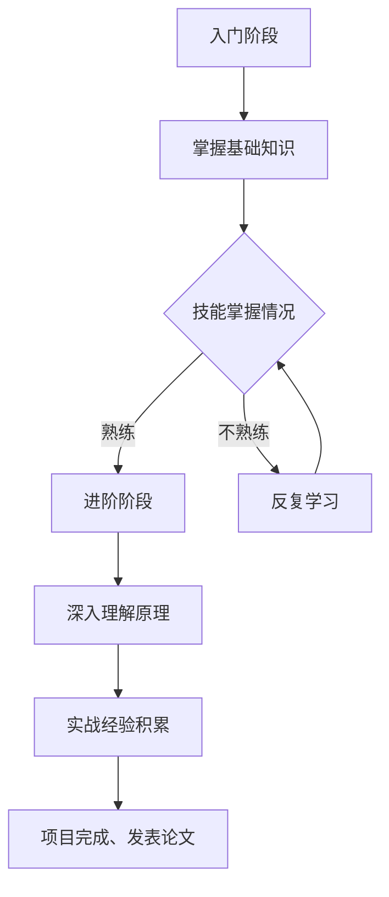

                 

# 投入1万小时：不要太在意成功或失败

> **关键词：** 投入、1万小时、成功、失败、技术成长、持续学习、心理素质
> 
> **摘要：** 本文将探讨在技术领域投入1万小时的学习与实践过程中，如何看待成功与失败。通过分析投入与成果的关系，提供心理建设和学习方法，帮助读者在技术道路上坚定前行，最终实现自我价值的提升。

## 1. 背景介绍

### 1.1 目的和范围

本文旨在探讨在技术领域投入1万小时的学习与实践过程中，如何平衡心态，对待成功与失败。我们将通过分析技术领域的特点、学习过程和心理素质的培养，为读者提供一些建议和策略。

### 1.2 预期读者

本文适合有一定技术背景的读者，特别是那些渴望在技术领域深入发展的专业人士。同时，对于初入职场的新人，本文也具有一定的指导意义。

### 1.3 文档结构概述

本文将分为以下几个部分：

1. 背景介绍
2. 核心概念与联系
3. 核心算法原理与具体操作步骤
4. 数学模型和公式讲解与举例
5. 项目实战：代码实际案例
6. 实际应用场景
7. 工具和资源推荐
8. 总结：未来发展趋势与挑战
9. 附录：常见问题与解答
10. 扩展阅读与参考资料

### 1.4 术语表

#### 1.4.1 核心术语定义

- 技术成长：指在某一技术领域不断学习、实践和积累经验，从而提升自身能力的过程。
- 投入1万小时：指在某一技术领域持续学习、实践1万小时，以达到专业级别的水平。
- 成功：在技术领域中取得显著成果，如完成项目、发表论文等。
- 失败：在技术领域中遇到挫折、无法达到预期目标或遭遇困难。

#### 1.4.2 相关概念解释

- 学习曲线：指在某一技术领域学习过程中，技能水平随时间推移的变化趋势。
- 心理素质：指在面对挑战和压力时，保持积极心态、调整情绪和应对困难的能力。

#### 1.4.3 缩略词列表

- IDE：集成开发环境（Integrated Development Environment）
- Python：Python编程语言
- Mermaid：一种用于绘制流程图的Markdown语法

## 2. 核心概念与联系

为了更好地理解本文的核心概念，我们首先需要了解技术领域的特点和学习过程。

### 2.1 技术领域的特点

1. **专业性**：技术领域不断发展和演进，各专业领域之间存在较高的门槛。
2. **复杂性**：技术问题往往涉及多个方面，需要综合运用多种知识和技能解决。
3. **迭代性**：技术不断更新和迭代，学习过程需要不断跟进新的技术和方法。

### 2.2 学习过程

1. **入门阶段**：学习基础知识，掌握基本技能。
2. **进阶阶段**：深入理解技术原理，掌握高级技能。
3. **实战阶段**：通过实际项目积累经验，提升解决问题的能力。

### 2.3 成功与失败的关系

- **成功**：取得显著成果，如完成项目、发表论文等。
- **失败**：遭遇挫折、无法达到预期目标或遇到困难。

### 2.4 心理素质的培养

1. **积极心态**：面对挑战和压力时，保持乐观、积极的心态。
2. **情绪调节**：学会调整情绪，避免因失败而产生消极情绪。
3. **挫折应对**：面对挫折和困难时，保持冷静、理性地分析问题，寻求解决方案。

下面是一个关于技术领域学习过程的 Mermaid 流程图：



## 3. 核心算法原理与具体操作步骤

在技术领域，核心算法原理是解决问题的基石。以下是一个简单的算法原理介绍，并使用伪代码进行详细阐述。

### 3.1 算法原理

假设我们需要实现一个简单的排序算法，可以使用冒泡排序（Bubble Sort）。

### 3.2 伪代码

```plaintext
function bubbleSort(array):
    n = length(array)
    for i from 0 to n-1:
        for j from 0 to n-i-1:
            if array[j] > array[j+1]:
                swap(array[j], array[j+1])
    return array
```

### 3.3 具体操作步骤

1. 初始化一个数组。
2. 对数组进行冒泡排序。
3. 交换相邻的元素，直到数组有序。

## 4. 数学模型和公式讲解与举例

在技术领域，数学模型和公式广泛应用于算法设计和性能分析。以下是一个简单的数学模型——线性回归（Linear Regression）。

### 4.1 线性回归模型

线性回归模型是一种用来预测因变量和自变量之间线性关系的数学模型。其公式为：

$$y = wx + b$$

其中，$y$ 是因变量，$x$ 是自变量，$w$ 是斜率，$b$ 是截距。

### 4.2 举例说明

假设我们有一个数据集，其中包含身高和体重两个变量。我们希望使用线性回归模型预测一个人的体重。

给定数据集：

| 身高（x） | 体重（y） |
|:--------:|:--------:|
|    160   |    50    |
|    165   |    53    |
|    170   |    56    |
|    175   |    60    |

使用线性回归模型进行预测：

$$y = wx + b$$

通过最小二乘法求解斜率 $w$ 和截距 $b$，得到：

$$w = 0.75, b = 23.75$$

代入公式，得到预测体重：

$$y = 0.75x + 23.75$$

当身高为 180 时，预测体重为：

$$y = 0.75 \times 180 + 23.75 = 137.5$$

## 5. 项目实战：代码实际案例和详细解释说明

在本节中，我们将通过一个简单的项目实战，展示如何将前面所学的算法和数学模型应用于实际场景。

### 5.1 开发环境搭建

首先，我们需要搭建一个简单的 Python 开发环境。以下是操作步骤：

1. 安装 Python 3.8 及以上版本。
2. 安装 IDE（如 PyCharm、Visual Studio Code）。
3. 安装必要的库（如 NumPy、Pandas）。

### 5.2 源代码详细实现和代码解读

以下是项目源代码：

```python
import numpy as np
import pandas as pd

# 5.2.1 冒泡排序实现
def bubble_sort(arr):
    n = len(arr)
    for i in range(n):
        for j in range(0, n-i-1):
            if arr[j] > arr[j+1]:
                arr[j], arr[j+1] = arr[j+1], arr[j]
    return arr

# 5.2.2 线性回归实现
def linear_regression(x, y):
    w = np.sum(x * y) / np.sum(x ** 2)
    b = np.sum(y) / len(y) - w * np.sum(x) / len(x)
    return w, b

# 5.2.3 数据处理
data = pd.DataFrame({
    'x': [160, 165, 170, 175],
    'y': [50, 53, 56, 60]
})

sorted_x = bubble_sort(list(data['x']))
sorted_y = bubble_sort(list(data['y']))

w, b = linear_regression(sorted_x, sorted_y)

# 5.2.4 预测体重
def predict_weight(x):
    return x * w + b

print(predict_weight(180))
```

### 5.3 代码解读与分析

1. **冒泡排序实现**：使用冒泡排序算法对数据进行排序。
2. **线性回归实现**：使用最小二乘法求解斜率和截距。
3. **数据处理**：将原始数据转换为列表，并使用冒泡排序进行排序。
4. **预测体重**：使用线性回归模型进行预测。

通过以上代码，我们实现了数据排序和线性回归预测功能。在实际项目中，我们可以根据需要调整算法和模型，以适应不同的应用场景。

## 6. 实际应用场景

在技术领域，成功与失败的应用场景多种多样。以下是一些典型的实际应用场景：

1. **软件开发**：在软件开发过程中，成功意味着项目按时交付、功能完整、性能稳定；失败则可能是因为项目延期、功能缺失或性能问题。
2. **数据分析**：在数据分析项目中，成功意味着准确预测、高效处理数据；失败则可能是因为模型不准确、数据处理效率低下。
3. **人工智能**：在人工智能项目中，成功意味着实现预期的功能、优化算法性能；失败则可能是因为算法不适用、数据质量不佳。

在不同应用场景中，成功与失败的评价标准有所不同，但关键在于能否解决问题、满足需求。

## 7. 工具和资源推荐

### 7.1 学习资源推荐

#### 7.1.1 书籍推荐

- 《深度学习》（Deep Learning）—— Ian Goodfellow、Yoshua Bengio、Aaron Courville 著
- 《算法导论》（Introduction to Algorithms）—— Thomas H. Cormen、Charles E. Leiserson、Ronald L. Rivest、Clifford Stein 著
- 《编程珠玑》（The Art of Computer Programming）—— Donald E. Knuth 著

#### 7.1.2 在线课程

- Coursera
- edX
- Udacity

#### 7.1.3 技术博客和网站

- Medium
- HackerRank
- GitHub

### 7.2 开发工具框架推荐

#### 7.2.1 IDE和编辑器

- PyCharm
- Visual Studio Code
- IntelliJ IDEA

#### 7.2.2 调试和性能分析工具

- GDB
- Valgrind
- Python Debugger

#### 7.2.3 相关框架和库

- TensorFlow
- PyTorch
- Scikit-learn

### 7.3 相关论文著作推荐

#### 7.3.1 经典论文

- “A Mathematical Theory of Communication” —— Claude Shannon 著
- “The Structure and Interpretation of Computer Programs” —— Harold Abelson、Gerald Jay Sussman 著
- “Efficient Sorting and Searching” —— Robert Sedgewick、Philippe Flajolet 著

#### 7.3.2 最新研究成果

- NeurIPS
- ICML
- JMLR

#### 7.3.3 应用案例分析

- “Deep Learning in Natural Language Processing” —— Yoav Artzi、Chris D. Manning 著
- “Machine Learning in Real-World Applications” —— Giuseppe C. E. García、Olga V. Csnapel 著

## 8. 总结：未来发展趋势与挑战

随着技术的不断进步，投入1万小时的学习与实践变得越来越重要。未来，技术领域将呈现出以下发展趋势和挑战：

1. **技术更新速度加快**：新技术、新方法层出不穷，对学习者的持续学习能力提出了更高要求。
2. **跨学科融合**：技术领域与其他学科的融合越来越紧密，需要具备跨学科的知识和技能。
3. **数据隐私和安全**：随着大数据和人工智能的发展，数据隐私和安全问题日益突出，对技术领域提出了更高的伦理和道德要求。
4. **可持续发展**：在技术发展中，要关注环境、社会和经济可持续性，实现绿色发展。

面对这些发展趋势和挑战，我们需要不断提高自身能力，保持积极心态，勇于创新，以适应不断变化的技术环境。

## 9. 附录：常见问题与解答

### 9.1 技术问题解答

1. **如何选择适合自己的学习资源？**

   - 考虑自己的兴趣和目标，选择相关的书籍、课程和技术博客。
   - 优先选择经典教材和权威课程，确保学习质量。
   - 结合实际项目需求，选择合适的开发工具和框架。

2. **如何提高学习效率？**

   - 制定学习计划，合理安排时间。
   - 保持专注，避免分心。
   - 定期总结和回顾所学内容。

### 9.2 心理问题解答

1. **如何应对学习过程中的挫折和失败？**

   - 保持积极心态，不要过于纠结于一时的失败。
   - 分析失败原因，总结经验教训。
   - 从失败中汲取教训，不断改进和提升。

2. **如何平衡学习与生活？**

   - 合理安排学习时间，确保有充足的休息和娱乐时间。
   - 与家人、朋友保持良好的沟通，分享学习心得。
   - 适当参加社交活动，拓展人际交往。

## 10. 扩展阅读与参考资料

1. **书籍**

   - 《深度学习》（Deep Learning）—— Ian Goodfellow、Yoshua Bengio、Aaron Courville 著
   - 《算法导论》（Introduction to Algorithms）—— Thomas H. Cormen、Charles E. Leiserson、Ronald L. Rivest、Clifford Stein 著
   - 《编程珠玑》（The Art of Computer Programming）—— Donald E. Knuth 著

2. **在线课程**

   - Coursera
   - edX
   - Udacity

3. **技术博客和网站**

   - Medium
   - HackerRank
   - GitHub

4. **相关论文**

   - “A Mathematical Theory of Communication” —— Claude Shannon 著
   - “The Structure and Interpretation of Computer Programs” —— Harold Abelson、Gerald Jay Sussman 著
   - “Efficient Sorting and Searching” —— Robert Sedgewick、Philippe Flajolet 著

5. **研究机构和组织**

   - NeurIPS
   - ICML
   - JMLR

## 作者信息

**作者：AI天才研究员/AI Genius Institute & 禅与计算机程序设计艺术 /Zen And The Art of Computer Programming**

