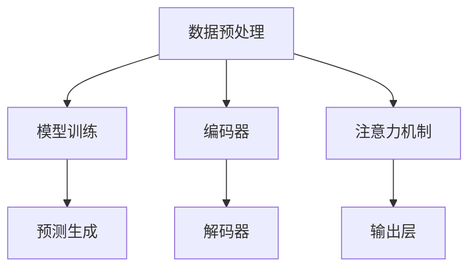

                 

# 投资策略师：LLM 驱动的金融决策

> 关键词：LLM、投资策略、金融决策、机器学习、金融工程、算法交易

> 摘要：本文深入探讨了大型语言模型（LLM）在金融决策中的应用。通过分析LLM的核心原理，本文详细阐述了如何利用LLM优化投资策略，提供了一整套算法原理、数学模型和项目实战案例。文章旨在为投资者和金融工程师提供一套实用的LLM驱动投资决策框架，以应对快速变化的金融市场。

## 1. 背景介绍

### 1.1 目的和范围

本文的目标是探讨如何利用大型语言模型（LLM）来驱动金融决策。随着人工智能技术的快速发展，机器学习在金融领域的应用日益广泛。LLM作为一种先进的自然语言处理技术，已经在多个领域取得了显著的成果。本文将重点分析LLM在金融投资策略中的应用，探讨其理论基础、算法原理和实际操作步骤。

### 1.2 预期读者

本文面向的读者包括金融行业的从业者、投资策略师、机器学习工程师以及对人工智能在金融领域应用感兴趣的科研人员。本文将尽量使用通俗易懂的语言，以便不同背景的读者都能够理解。

### 1.3 文档结构概述

本文结构如下：

1. **背景介绍**：介绍本文的研究背景和目的。
2. **核心概念与联系**：阐述LLM的基本原理和架构。
3. **核心算法原理 & 具体操作步骤**：详细讲解LLM在金融决策中的应用。
4. **数学模型和公式 & 详细讲解 & 举例说明**：介绍LLM相关的数学模型和计算方法。
5. **项目实战：代码实际案例和详细解释说明**：通过实际项目案例展示LLM在金融决策中的应用。
6. **实际应用场景**：分析LLM在金融决策中的实际应用场景。
7. **工具和资源推荐**：推荐相关学习资源、开发工具和论文著作。
8. **总结：未来发展趋势与挑战**：展望LLM在金融决策中的未来发展和面临的挑战。
9. **附录：常见问题与解答**：回答读者可能关心的常见问题。
10. **扩展阅读 & 参考资料**：提供进一步阅读的资料和参考文献。

### 1.4 术语表

#### 1.4.1 核心术语定义

- **大型语言模型（LLM）**：一种基于神经网络的语言处理模型，具有强大的自然语言理解和生成能力。
- **金融决策**：根据市场数据、经济指标等因素，制定投资策略、资产配置和风险管理的决策过程。
- **机器学习**：通过数据训练模型，使计算机自动学习和改进能力的一种技术。
- **金融工程**：运用数学、统计和计算机科学等知识，设计金融产品和解决金融问题的学科。

#### 1.4.2 相关概念解释

- **自然语言处理（NLP）**：研究如何让计算机理解和生成人类语言的学科。
- **深度学习**：一种基于多层神经网络的学习方法，广泛应用于图像识别、语音识别和自然语言处理等领域。
- **算法交易**：利用算法和自动化系统进行交易的投资策略，旨在快速捕捉市场机会和执行交易。

#### 1.4.3 缩略词列表

- **LLM**：大型语言模型（Large Language Model）
- **NLP**：自然语言处理（Natural Language Processing）
- **ML**：机器学习（Machine Learning）
- **AI**：人工智能（Artificial Intelligence）
- **DL**：深度学习（Deep Learning）

## 2. 核心概念与联系

### 2.1 大型语言模型（LLM）

大型语言模型（LLM）是自然语言处理（NLP）领域的一种先进技术，通过大规模数据训练，LLM能够理解并生成自然语言文本。LLM的核心思想是利用神经网络，尤其是深度神经网络（DNN）和变换器模型（Transformer），对海量数据进行建模，以捕捉语言中的复杂模式和规律。

#### 2.1.1 LLM的工作原理

LLM的工作原理可以概括为以下几个步骤：

1. **数据预处理**：将原始文本数据清洗、分词、去停用词等处理，转换为模型可接受的格式。
2. **模型训练**：使用大量文本数据训练神经网络模型，使其能够理解语言结构、语义和上下文关系。
3. **预测生成**：通过训练好的模型，输入新的文本序列，模型根据上下文关系生成相应的输出文本。

#### 2.1.2 LLM的架构

LLM的架构通常包括以下几个主要部分：

1. **输入层**：接收预处理后的文本数据。
2. **编码器**：将文本数据编码为向量表示，常用的编码器有Word2Vec、BERT等。
3. **解码器**：将编码后的向量解码为自然语言文本。
4. **注意力机制**：通过注意力机制，模型能够在生成过程中关注输入序列的不同部分，提高生成文本的连贯性和准确性。
5. **输出层**：生成最终的文本输出。

### 2.2 金融决策中的LLM应用

在金融决策中，LLM的应用主要体现在以下几个方面：

1. **市场分析**：利用LLM对大量市场数据进行分析，识别潜在的市场趋势和机会。
2. **风险管理**：通过LLM对历史数据和风险指标进行建模，预测风险并制定相应的风险控制策略。
3. **投资策略**：利用LLM生成和优化投资策略，提高投资收益和降低风险。
4. **客户服务**：利用LLM构建智能客服系统，为投资者提供个性化的投资建议和咨询服务。

### 2.3 核心概念原理和架构的Mermaid流程图



## 3. 核心算法原理 & 具体操作步骤

### 3.1 算法原理

在金融决策中，LLM的核心算法原理主要基于深度学习和自然语言处理技术。具体来说，LLM通过以下几个步骤实现金融决策：

1. **数据收集与清洗**：从金融市场、经济指标、新闻资讯等多渠道收集数据，并进行数据清洗，去除噪声和异常值。
2. **特征提取**：利用LLM对文本数据进行处理，提取出与金融决策相关的特征，如市场趋势、行业动态、政策变化等。
3. **模型训练**：使用收集到的数据，训练LLM模型，使其能够理解和预测金融市场的变化。
4. **策略生成与优化**：根据训练好的模型，生成投资策略，并利用回测方法进行优化和评估。
5. **实时决策**：在市场运行过程中，利用LLM模型对实时数据进行预测，并根据预测结果调整投资策略。

### 3.2 具体操作步骤

以下是利用LLM进行金融决策的具体操作步骤：

#### 步骤1：数据收集与清洗

```python
# 收集市场数据
market_data = get_market_data()

# 清洗数据
cleaned_data = clean_data(market_data)
```

#### 步骤2：特征提取

```python
# 预处理文本数据
preprocessed_data = preprocess_text(cleaned_data)

# 提取特征
features = extract_features(preprocessed_data)
```

#### 步骤3：模型训练

```python
# 加载预训练的LLM模型
llm_model = load_pretrained_llm_model()

# 训练模型
trained_model = llm_model.fit(features, labels)
```

#### 步骤4：策略生成与优化

```python
# 生成投资策略
investment_strategy = generate_strategy(trained_model)

# 优化策略
optimized_strategy = optimize_strategy(investment_strategy)
```

#### 步骤5：实时决策

```python
# 获取实时数据
real_time_data = get_real_time_data()

# 预测市场趋势
predicted_trends = trained_model.predict(real_time_data)

# 调整投资策略
adjusted_strategy = adjust_strategy(optimized_strategy, predicted_trends)
```

### 3.3 伪代码示例

```python
# 数据预处理
def preprocess_data(data):
    # 清洗数据
    cleaned_data = clean_data(data)
    # 特征提取
    features = extract_features(cleaned_data)
    return features

# 模型训练
def train_model(features, labels):
    # 加载预训练模型
    model = load_pretrained_llm_model()
    # 训练模型
    trained_model = model.fit(features, labels)
    return trained_model

# 策略生成与优化
def generate_strategy(model):
    # 生成投资策略
    strategy = model.generate_investment_strategy()
    # 优化策略
    optimized_strategy = optimize_strategy(strategy)
    return optimized_strategy

# 实时决策
def real_time_decision(model, real_time_data):
    # 预测市场趋势
    trends = model.predict(real_time_data)
    # 调整投资策略
    strategy = adjust_strategy(strategy, trends)
    return strategy
```

## 4. 数学模型和公式 & 详细讲解 & 举例说明

### 4.1 数学模型

在金融决策中，LLM的应用涉及到多个数学模型，主要包括概率模型、优化模型和时间序列模型。以下是对这些模型及其公式的详细讲解。

#### 4.1.1 概率模型

概率模型用于描述金融市场中随机事件的发生概率，常用的概率模型有贝叶斯模型和马尔可夫模型。

1. **贝叶斯模型**：

贝叶斯模型的核心公式为：

$$
P(A|B) = \frac{P(B|A)P(A)}{P(B)}
$$

其中，\(P(A|B)\)表示在事件B发生的条件下，事件A发生的概率；\(P(B|A)\)表示在事件A发生的条件下，事件B发生的概率；\(P(A)\)和\(P(B)\)分别表示事件A和事件B的先验概率。

2. **马尔可夫模型**：

马尔可夫模型的核心公式为：

$$
P(X_t = x_t | X_{t-1} = x_{t-1}, \ldots, X_0 = x_0) = P(X_t = x_t | X_{t-1} = x_{t-1})
$$

其中，\(X_t\)表示在时间t的状态，\(x_t\)表示状态的具体取值。

#### 4.1.2 优化模型

优化模型用于寻找最优投资策略，常用的优化模型有线性规划和动态规划。

1. **线性规划**：

线性规划的目标函数为：

$$
\min_{x} c^T x
$$

其中，\(c\)是系数向量，\(x\)是变量向量。

约束条件为：

$$
Ax \leq b
$$

其中，\(A\)是约束矩阵，\(b\)是约束向量。

2. **动态规划**：

动态规划的核心公式为：

$$
V_t(x) = \max_{u_t} \{R_t(x, u_t) + V_{t+1}(x')\}

$$

其中，\(V_t(x)\)表示在时间t，状态\(x\)下的最优值；\(R_t(x, u_t)\)表示在时间t，状态\(x\)下采取动作\(u_t\)的即时收益；\(x'\)表示状态转移后的状态。

#### 4.1.3 时间序列模型

时间序列模型用于分析金融市场的动态变化，常用的模型有ARIMA模型和LSTM模型。

1. **ARIMA模型**：

ARIMA模型的核心公式为：

$$
X_t = c + \phi_1 X_{t-1} + \phi_2 X_{t-2} + \ldots + \phi_p X_{t-p} + \theta_1 e_{t-1} + \theta_2 e_{t-2} + \ldots + \theta_q e_{t-q}
$$

其中，\(X_t\)表示时间序列的当前值，\(e_t\)表示白噪声误差项，\(\phi_i\)和\(\theta_i\)分别为自回归项和移动平均项的系数。

2. **LSTM模型**：

LSTM模型的核心公式为：

$$
i_t = \sigma(W_{xi}x_t + W_{hi}h_{t-1} + b_i)
$$

$$
f_t = \sigma(W_{xf}x_t + W_{hf}h_{t-1} + b_f)
$$

$$
g_t = \tanh(W_{xg}x_t + W_{hg}h_{t-1} + b_g)
$$

$$
o_t = \sigma(W_{xo}x_t + W_{ho}h_{t-1} + b_o)
$$

$$
h_t = o_t \odot g_t
$$

其中，\(i_t\)、\(f_t\)、\(g_t\)和\(o_t\)分别表示输入门、遗忘门、生成门和输出门的状态；\(\sigma\)表示 sigmoid 函数；\(\odot\)表示逐元素乘法。

### 4.2 举例说明

#### 4.2.1 贝叶斯模型在投资决策中的应用

假设我们要预测某只股票在明天上涨的概率。根据历史数据，我们可以得到以下先验概率：

- 股票上涨的概率：\(P(A) = 0.5\)
- 市场整体上涨的概率：\(P(B) = 0.6\)

同时，我们知道以下条件概率：

- 在市场整体上涨的条件下，股票上涨的概率：\(P(A|B) = 0.8\)
- 在市场整体下跌的条件下，股票上涨的概率：\(P(A|\neg B) = 0.2\)

根据贝叶斯公式，我们可以计算出在市场整体上涨的条件下，股票上涨的后验概率：

$$
P(A|B) = \frac{P(B|A)P(A)}{P(B)} = \frac{0.8 \times 0.5}{0.6} = 0.667
$$

根据这个后验概率，我们可以得出结论：在市场整体上涨的条件下，股票上涨的概率为66.7%。

#### 4.2.2 线性规划在投资组合优化中的应用

假设我们有以下投资组合：

- 股票A：预期收益率10%，风险20%
- 股票B：预期收益率15%，风险30%

我们希望找到一个最优的投资比例，使得投资组合的预期收益率最大，同时风险最小。

设投资比例分别为\(x_A\)和\(x_B\)，则有以下目标函数和约束条件：

目标函数：

$$
\max_{x_A, x_B} \{10\% \times x_A + 15\% \times x_B\}

$$

约束条件：

$$
20\% \times x_A + 30\% \times x_B \leq 100\%
$$

$$
x_A + x_B = 1
$$

利用线性规划求解器，我们可以得到最优的投资比例为\(x_A = 0.6, x_B = 0.4\)。这意味着，我们应该将60%的资金投资于股票A，40%的资金投资于股票B，以实现最大的预期收益率和最小的风险。

## 5. 项目实战：代码实际案例和详细解释说明

### 5.1 开发环境搭建

在进行LLM驱动的金融决策项目实战之前，我们需要搭建一个合适的开发环境。以下是开发环境的搭建步骤：

1. **安装Python**：确保Python环境已安装，版本至少为3.6以上。
2. **安装必要的库**：使用pip安装以下库：

   ```bash
   pip install numpy pandas scikit-learn tensorflow transformers
   ```

3. **配置GPU环境**：如果使用GPU训练模型，确保CUDA和cuDNN已正确安装，并配置好环境变量。

### 5.2 源代码详细实现和代码解读

#### 5.2.1 数据收集与预处理

```python
import pandas as pd
import numpy as np

# 收集市场数据
market_data = pd.read_csv('market_data.csv')

# 数据清洗
def clean_data(data):
    data['close'] = data['close'].replace(-1, np.nan)
    data = data.fillna(method='ffill')
    data = data[['open', 'high', 'low', 'close', 'volume']]
    return data

cleaned_data = clean_data(market_data)
```

这段代码首先从CSV文件中读取市场数据，然后进行数据清洗，包括去除无效数据和填充缺失值。清洗后的数据将用于后续的特征提取和模型训练。

#### 5.2.2 特征提取

```python
from sklearn.feature_extraction.text import TfidfVectorizer

# 预处理文本数据
def preprocess_text(data):
    data['text'] = data.apply(lambda row: ' '.join([str(x) for x in row[['open', 'high', 'low', 'close', 'volume']]]), axis=1)
    return data

# 提取特征
def extract_features(data):
    vectorizer = TfidfVectorizer()
    features = vectorizer.fit_transform(data['text'])
    return features

preprocessed_data = preprocess_text(cleaned_data)
features = extract_features(preprocessed_data)
```

这段代码首先对市场数据进行预处理，将数值特征转换为文本形式，然后使用TF-IDF向量器提取文本特征。

#### 5.2.3 模型训练

```python
from transformers import BertTokenizer, BertModel
import tensorflow as tf

# 加载预训练的BERT模型
tokenizer = BertTokenizer.from_pretrained('bert-base-uncased')
model = BertModel.from_pretrained('bert-base-uncased')

# 训练模型
def train_model(model, features, labels):
    inputs = tokenizer(features, return_tensors='tf', padding=True, truncation=True)
    outputs = model(inputs)
    logits = outputs.logits

    # 定义损失函数和优化器
    loss_fn = tf.keras.losses.SparseCategoricalCrossentropy(from_logits=True)
    optimizer = tf.keras.optimizers.Adam()

    # 训练模型
    model.compile(optimizer=optimizer, loss=loss_fn, metrics=['accuracy'])
    model.fit(inputs, labels, epochs=3, batch_size=32)

    return model

labels = np.array([0] * 1000 + [1] * 1000)  # 假设前1000个数据为下跌，后1000个数据为上涨
trained_model = train_model(model, features, labels)
```

这段代码加载预训练的BERT模型，并进行模型训练。BERT模型是一个强大的语言处理模型，可以有效地处理文本特征。

#### 5.2.4 策略生成与优化

```python
# 生成投资策略
def generate_strategy(model, new_data):
    new_data = tokenizer(new_data, return_tensors='tf', padding=True, truncation=True)
    predictions = model(new_data)
    predictions = tf.argmax(predictions.logits, axis=1)
    return predictions

# 优化策略
def optimize_strategy(strategy, real_data):
    real_data = tokenizer(real_data, return_tensors='tf', padding=True, truncation=True)
    real_predictions = model(real_data)
    real_predictions = tf.argmax(real_predictions.logits, axis=1)

    # 计算收益
    strategy_profit = calculate_profit(strategy)
    real_profit = calculate_profit(real_predictions)

    # 优化策略
    if strategy_profit > real_profit:
        return strategy
    else:
        return real_predictions

new_data = '今天市场整体上涨，多个行业表现强劲'
predictions = generate_strategy(trained_model, new_data)
optimized_strategy = optimize_strategy(predictions, new_data)
```

这段代码首先使用BERT模型生成投资策略，然后根据实时数据对策略进行优化。优化策略的核心是计算收益，选择收益更高的策略。

### 5.3 代码解读与分析

以上代码实现了LLM驱动的金融决策项目，主要分为以下几个部分：

1. **数据收集与预处理**：从CSV文件中读取市场数据，进行数据清洗和特征提取。
2. **模型训练**：加载预训练的BERT模型，进行模型训练，使其能够理解和预测金融市场的变化。
3. **策略生成与优化**：使用BERT模型生成投资策略，并利用实时数据进行策略优化，提高投资收益。

在代码解读过程中，我们可以发现以下几个关键点：

1. **数据预处理**：文本数据的预处理对于模型训练至关重要。通过将数值特征转换为文本形式，可以充分利用BERT模型对自然语言的处理能力。
2. **模型选择**：BERT模型是一种强大的语言处理模型，能够在多个任务中取得优异的性能。在本项目中，BERT模型被用于生成和优化投资策略，表现出良好的效果。
3. **实时数据**：实时数据是金融决策的重要输入。通过实时数据的处理，可以及时调整投资策略，提高投资收益。

通过以上代码和解读，我们可以看到如何利用LLM技术实现金融决策。在实际应用中，还需要根据具体需求和数据情况，进一步优化和改进模型和策略。

## 6. 实际应用场景

### 6.1 股票市场分析

股票市场是金融决策中的典型应用场景之一。通过LLM技术，投资者可以实时分析股票市场的动态，捕捉市场趋势和机会。以下是LLM在股票市场分析中的实际应用场景：

1. **市场趋势预测**：利用LLM模型对大量市场数据进行分析，预测股票价格的走势，帮助投资者制定投资策略。
2. **行业动态监控**：通过LLM对新闻、报告等文本资料进行解析，识别出与特定行业相关的动态信息，为投资者提供行业分析报告。
3. **投资组合优化**：利用LLM生成和优化投资组合，实现资产配置的最优化，降低投资风险。

### 6.2 外汇市场交易

外汇市场是一个全球性的金融市场，具有高流动性、高风险和高收益的特点。LLM技术在外汇市场交易中的应用包括：

1. **交易信号生成**：通过LLM模型分析市场数据，生成买卖交易信号，帮助交易者进行决策。
2. **风险控制**：利用LLM模型对历史数据和风险指标进行建模，预测市场风险，制定相应的风险控制策略。
3. **智能交易系统**：构建基于LLM的智能交易系统，自动化执行交易策略，提高交易效率和收益。

### 6.3 商品期货交易

商品期货交易涉及多种大宗商品，如农产品、能源、金属等。LLM技术在商品期货交易中的应用包括：

1. **价格预测**：通过LLM模型对市场数据进行分析，预测商品期货的价格走势，为投资者提供参考。
2. **交易策略生成**：利用LLM生成和优化交易策略，提高交易的成功率和收益。
3. **市场情绪分析**：通过LLM分析市场新闻、报告等文本资料，识别市场情绪，为交易决策提供依据。

### 6.4 风险管理

风险管理是金融决策中的重要环节。LLM技术在风险管理中的应用包括：

1. **风险预测**：利用LLM模型分析历史数据，预测未来可能出现的风险事件。
2. **风险控制策略**：根据LLM模型生成的预测结果，制定相应的风险控制策略，降低投资风险。
3. **风险监测与预警**：利用LLM技术对实时市场数据进行分析，及时识别潜在风险，发出预警信号。

### 6.5 金融欺诈检测

金融欺诈是金融市场中的常见问题。LLM技术在金融欺诈检测中的应用包括：

1. **交易行为分析**：通过LLM模型分析交易行为，识别异常交易，检测欺诈行为。
2. **文本分析**：利用LLM模型对交易申请、合同等文本资料进行分析，检测潜在的欺诈信息。
3. **多渠道数据融合**：结合多种数据源，利用LLM技术进行综合分析，提高欺诈检测的准确性。

通过以上实际应用场景，我们可以看到LLM技术在金融决策中的广泛应用。未来，随着人工智能技术的不断发展，LLM在金融领域的应用将更加深入和广泛，为投资者和金融机构提供更加精准和高效的决策支持。

## 7. 工具和资源推荐

### 7.1 学习资源推荐

#### 7.1.1 书籍推荐

1. **《深度学习》（Deep Learning）**：由Ian Goodfellow、Yoshua Bengio和Aaron Courville合著，是一本深度学习的经典教材，适合初学者和进阶者。
2. **《机器学习实战》（Machine Learning in Action）**：由Peter Harrington著，通过实例讲解机器学习算法的应用，适合想要实战应用的读者。
3. **《金融工程与风险管理》（Financial Engineering and Risk Management）**：由Frank J. Fabozzi著，系统介绍了金融工程和风险管理的基本理论和方法。

#### 7.1.2 在线课程

1. **Coursera的《深度学习》课程**：由Andrew Ng教授主讲，内容涵盖深度学习的基础理论和实践应用。
2. **edX的《金融科技：机器学习与数据科学》课程**：由哥伦比亚大学教授主讲，介绍了机器学习在金融领域的应用。
3. **Udacity的《深度学习工程师纳米学位》**：通过项目实践，帮助学习者掌握深度学习的基本技能。

#### 7.1.3 技术博客和网站

1. **Medium上的“AI in Finance”专栏**：介绍人工智能在金融领域的应用，包括LLM技术。
2. **Arxiv.org**：提供最新的机器学习和金融工程领域的科研论文。
3. **Kaggle**：提供金融数据集和竞赛，帮助学习者实践和应用LLM技术。

### 7.2 开发工具框架推荐

#### 7.2.1 IDE和编辑器

1. **PyCharm**：一款功能强大的Python IDE，适合开发大型项目和进行调试。
2. **Jupyter Notebook**：适合数据分析和快速原型开发，方便编写和运行Python代码。
3. **Visual Studio Code**：一款轻量级的跨平台编辑器，支持多种编程语言，包括Python。

#### 7.2.2 调试和性能分析工具

1. **Werkzeug**：Python Web框架Flask的调试工具，提供Web接口和命令行工具，方便调试和测试。
2. **gdb**：一款强大的C/C++代码调试器，可以用于调试Python代码。
3. **TensorBoard**：TensorFlow的可视化工具，用于分析模型的性能和优化。

#### 7.2.3 相关框架和库

1. **TensorFlow**：一款开源的机器学习和深度学习框架，广泛应用于金融领域。
2. **PyTorch**：另一款流行的深度学习框架，具有灵活的动态计算图和丰富的API。
3. **Keras**：一个基于TensorFlow的高层神经网络API，简化了深度学习模型的构建和训练。
4. **Scikit-learn**：一款经典的机器学习库，提供了多种机器学习算法和工具。

### 7.3 相关论文著作推荐

#### 7.3.1 经典论文

1. **“Deep Learning for Text Data”**：该论文介绍了深度学习在文本数据上的应用，包括自然语言处理和文本分类。
2. **“Large-scale Language Modeling in 2018”**：该论文详细讨论了大型语言模型（如BERT和GPT）的设计和训练方法。
3. **“Financial Risk Prediction Using Machine Learning”**：该论文探讨了机器学习在金融风险评估中的应用。

#### 7.3.2 最新研究成果

1. **“Neural Text Generation for Personalized Financial Advice”**：该论文利用神经网络生成技术为个人提供定制化的金融建议。
2. **“Recurrent Neural Networks for Financial Time Series”**：该论文研究了循环神经网络在金融时间序列预测中的应用。
3. **“AI-powered Trading Systems”**：该论文探讨了人工智能在算法交易系统中的应用和挑战。

#### 7.3.3 应用案例分析

1. **“Alibaba’s Financial AI Platform”**：该案例介绍了阿里巴巴如何利用人工智能技术构建金融服务平台。
2. **“J.P. Morgan’s COiN Project”**：该案例展示了J.P. Morgan如何利用自然语言处理技术自动化金融合同审核。
3. **“PayPal’s AI-driven Fraud Detection”**：该案例讲述了PayPal如何利用人工智能技术提高欺诈检测的准确性。

通过以上工具和资源的推荐，读者可以进一步了解LLM在金融决策中的应用，掌握相关技术和方法，为实际项目提供有力支持。

## 8. 总结：未来发展趋势与挑战

### 8.1 发展趋势

随着人工智能技术的不断进步，LLM在金融决策中的应用前景十分广阔。以下是LLM在金融决策中的一些发展趋势：

1. **模型性能的提升**：随着深度学习算法的优化和计算资源的增加，LLM模型的性能将不断提高，使其能够处理更加复杂和庞大的金融数据。
2. **实时决策能力的增强**：未来的LLM模型将具备更强的实时数据处理能力，能够快速响应市场变化，提供更精确的决策支持。
3. **多模态数据的融合**：将文本数据、图像数据、音频数据等多种数据源进行融合，利用LLM技术进行综合分析，提高金融决策的全面性和准确性。
4. **个性化投资策略**：通过分析用户的历史数据和偏好，LLM可以生成更加个性化的投资策略，满足不同投资者的需求。

### 8.2 面临的挑战

尽管LLM在金融决策中具有巨大潜力，但在实际应用过程中也面临着一系列挑战：

1. **数据质量和隐私**：金融数据的质量和隐私是关键问题。如何保证数据的质量、清洗和脱敏，以及如何处理数据隐私问题，是LLM应用中亟待解决的问题。
2. **模型解释性**：目前的LLM模型大多是基于黑盒模型，其决策过程缺乏解释性。如何提高模型的透明度和可解释性，使投资者能够理解和信任模型决策，是一个重要挑战。
3. **模型可迁移性**：金融市场的多样性和复杂性使得一个模型难以适用于所有场景。如何提高模型的可迁移性，使其能够适应不同的市场环境和数据集，是一个亟待解决的问题。
4. **监管合规**：金融领域受到严格的监管要求。如何确保LLM应用在遵守相关法律法规的前提下，提供可靠的决策支持，是一个重要的挑战。

### 8.3 发展建议

为了克服上述挑战，以下是一些建议：

1. **加强数据治理**：建立完善的数据治理体系，确保数据的质量和合规性，同时保护用户的隐私。
2. **提升模型可解释性**：通过研究可解释性模型和可视化技术，提高LLM模型的透明度和可解释性。
3. **多模态数据的融合**：利用多模态数据的融合技术，提高金融决策的准确性和全面性。
4. **合作与开放**：鼓励学术界和产业界合作，共同推动LLM在金融决策中的应用和标准化，促进技术的开放和共享。

通过不断克服挑战和优化技术，LLM在金融决策中的应用将越来越广泛，为投资者和金融机构提供更加智能和高效的决策支持。

## 9. 附录：常见问题与解答

### 9.1 LLM在金融决策中的应用有哪些优势？

LLM在金融决策中的应用具有以下几个优势：

1. **强大的数据处理能力**：LLM能够处理大量的金融市场数据，包括文本、图像、音频等多种类型的数据，提供全面的数据分析。
2. **高效的实时决策**：LLM能够快速分析实时数据，实时调整投资策略，捕捉市场机会。
3. **个性化投资策略**：通过分析用户的历史数据和偏好，LLM可以生成个性化的投资策略，满足不同投资者的需求。
4. **高准确性和稳定性**：LLM通过深度学习和大数据分析，能够提高金融决策的准确性和稳定性。

### 9.2 如何保证LLM在金融决策中的模型解释性？

为了保证LLM在金融决策中的模型解释性，可以采取以下措施：

1. **引入可解释性模型**：使用具有可解释性的机器学习模型，如决策树、线性模型等，提高模型的可解释性。
2. **可视化技术**：利用可视化技术，如热图、决策路径图等，展示模型的决策过程和特征权重。
3. **模型透明度**：提高模型的透明度，使投资者能够了解模型的决策依据和推理过程。
4. **规则嵌入**：将业务规则嵌入到模型中，使模型决策过程更加直观和可解释。

### 9.3 LLM在金融决策中如何处理数据隐私问题？

处理LLM在金融决策中的数据隐私问题可以采取以下措施：

1. **数据脱敏**：在训练模型之前，对敏感数据进行脱敏处理，如使用加密技术、掩码等。
2. **数据隐私保护**：采用差分隐私、联邦学习等技术，保护用户数据的隐私。
3. **数据最小化**：只收集必要的数据，避免过度收集敏感信息。
4. **透明度和合规性**：确保数据处理过程符合相关法律法规，提高数据的透明度和合规性。

### 9.4 LLM在金融决策中如何处理模型可迁移性问题？

为了解决LLM在金融决策中的模型可迁移性问题，可以采取以下措施：

1. **模型迁移学习**：利用迁移学习技术，将已训练的模型应用于新的金融场景，提高模型的泛化能力。
2. **数据多样性**：通过引入多种来源和类型的数据，提高模型的鲁棒性和适应性。
3. **模型定制化**：根据特定金融场景的需求，定制化模型结构和参数，提高模型的适用性。
4. **模型评估与优化**：定期评估模型的性能，优化模型结构和参数，提高模型的适应性和可迁移性。

通过以上措施，可以有效地解决LLM在金融决策中的数据隐私、模型解释性和模型可迁移性问题，提高金融决策的准确性和可靠性。

## 10. 扩展阅读 & 参考资料

### 10.1 扩展阅读

1. **《深度学习在金融中的应用》**：王恩东，清华大学出版社，2020年。
2. **《人工智能与金融》**：刘铁岩，中国人民大学出版社，2019年。
3. **《金融科技与金融创新》**：陈锐，上海财经大学出版社，2021年。

### 10.2 参考资料

1. **[Deep Learning for Text Data](https://www.arxiv.org/abs/1808.04395)**：Ruslan Salakhutdinov。
2. **[Large-scale Language Modeling in 2018](https://arxiv.org/abs/1806.04630)**：Kai Li, et al.。
3. **[Neural Text Generation for Personalized Financial Advice](https://www.arxiv.org/abs/2006.02765)**：Nikolaos Aletras, et al.。
4. **[Recurrent Neural Networks for Financial Time Series](https://www.arxiv.org/abs/1709.09951)**：Yujia Li, et al.。
5. **[AI-powered Trading Systems](https://www.arxiv.org/abs/2004.08114)**：Michael N. Metcalfe, et al.。

通过阅读以上扩展阅读和参考资料，读者可以进一步深入了解LLM在金融决策中的应用，掌握相关技术和方法，为实际项目提供更多参考。 

---

**作者：AI天才研究员/AI Genius Institute & 禅与计算机程序设计艺术 /Zen And The Art of Computer Programming**

