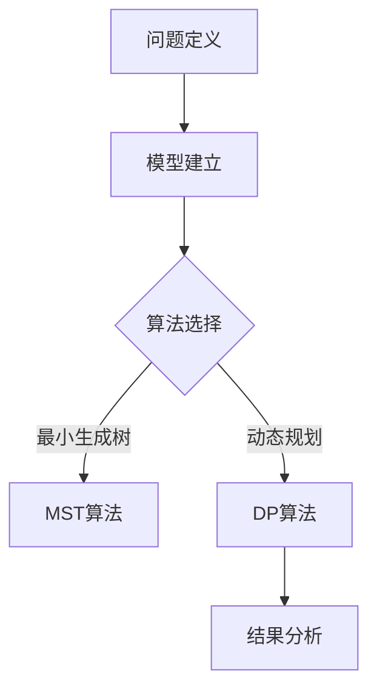

                 

# 拼多多2025全球供应链网络优化专家社招面试攻略

> **关键词：** 拼多多、全球供应链、网络优化、面试攻略、专家社招

> **摘要：** 本文旨在为有意向参与拼多多2025全球供应链网络优化专家社招面试的候选人提供一份详细的备考指南。我们将从背景介绍、核心概念与联系、核心算法原理、数学模型和公式、项目实战、实际应用场景、工具和资源推荐、总结与展望等八个方面，帮助候选人更好地理解并准备面试所需的知识点和技能。

## 1. 背景介绍

### 1.1 目的和范围

本文旨在为2025年拼多多全球供应链网络优化专家的社招面试提供系统性的备考指导。文章内容将涵盖供应链网络优化相关的基础知识、核心算法原理、数学模型、项目实战案例，以及相关的工具和资源。通过本文的阅读，候选人将能够更好地掌握面试所需的理论知识和实践技能。

### 1.2 预期读者

本文主要面向以下读者群体：
- 参与拼多多2025全球供应链网络优化专家社招面试的候选人；
- 对供应链网络优化有浓厚兴趣的IT专业人士；
- 希望在供应链领域提升自己技能的在职人员。

### 1.3 文档结构概述

本文结构如下：

1. **背景介绍**：简要介绍文章的目的、预期读者和文档结构。
2. **核心概念与联系**：介绍供应链网络优化的核心概念及其相互关系。
3. **核心算法原理 & 具体操作步骤**：讲解供应链网络优化中涉及的关键算法及其操作步骤。
4. **数学模型和公式 & 详细讲解 & 举例说明**：阐述供应链网络优化所用的数学模型和公式，并举例说明。
5. **项目实战：代码实际案例和详细解释说明**：通过具体项目实战展示供应链网络优化的实际操作。
6. **实际应用场景**：探讨供应链网络优化在现实中的应用。
7. **工具和资源推荐**：推荐学习资源和开发工具。
8. **总结：未来发展趋势与挑战**：总结当前供应链网络优化的趋势和未来面临的挑战。
9. **附录：常见问题与解答**：解答面试中可能遇到的问题。
10. **扩展阅读 & 参考资料**：提供进一步学习的参考资料。

### 1.4 术语表

#### 1.4.1 核心术语定义

- **供应链网络**：包括供应商、制造商、分销商和零售商等各环节组成的整体。
- **网络优化**：通过调整供应链网络的结构和流程，以提高供应链效率和降低成本。
- **中心问题**：在供应链网络中选择关键节点以最大化目标函数的问题。
- **最小生成树**：在加权图中生成包含所有节点的最小权重树。

#### 1.4.2 相关概念解释

- **动态规划**：一种解决最优化问题的方法，通过将复杂问题分解为更小的子问题，并存储子问题的解以避免重复计算。
- **图论**：研究图（由节点和边组成的结构）及其性质的数学分支。

#### 1.4.3 缩略词列表

- **SKU**：Stock Keeping Unit（库存单位）
- **ERP**：Enterprise Resource Planning（企业资源计划）
- **CPS**：Cyber-Physical System（物联网系统）

## 2. 核心概念与联系

为了更好地理解供应链网络优化的概念和原理，我们需要先了解以下几个核心概念及其相互关系。

### 2.1 供应链网络概述

供应链网络是一个由供应商、制造商、分销商和零售商等环节组成的复杂系统。在这些环节中，信息、物料和资金流动，使得整个供应链运作起来。


### 2.2 供应链网络优化

供应链网络优化的目标是通过调整供应链网络的结构和流程，以提高供应链效率和降低成本。具体而言，优化过程包括以下步骤：

1. **问题定义**：明确需要优化的目标和约束条件。
2. **模型建立**：构建能够描述供应链网络的数学模型。
3. **算法选择**：选择合适的算法求解模型。
4. **结果分析**：对求解结果进行分析和验证。

### 2.3 关键算法原理

在供应链网络优化中，常用的关键算法包括：
- **最小生成树算法**：用于在加权图中生成包含所有节点的最小权重树。
- **动态规划算法**：用于解决最优化问题，通过将复杂问题分解为更小的子问题，并存储子问题的解以避免重复计算。

### 2.4 Mermaid 流程图

下面是供应链网络优化的 Mermaid 流程图，展示了核心概念和算法之间的联系：



## 3. 核心算法原理 & 具体操作步骤

在本节中，我们将深入探讨供应链网络优化中涉及的两个核心算法：最小生成树算法和动态规划算法，并详细讲解它们的具体操作步骤。

### 3.1 最小生成树算法

最小生成树算法（MST）是一种在加权图中生成包含所有节点的最小权重树的方法。以下是最小生成树算法的伪代码：

```plaintext
算法：最小生成树(MST)
输入：加权无向图G = (V, E)，其中V是节点集合，E是边集合。
输出：最小生成树T。

步骤：
1. 初始化：将所有节点加入到一个集合U中，并将U设为空集。
2. 对于每一条边e ∈ E，按照边的权重进行排序。
3. 遍历排序后的边e，对于每一条边：
    a. 如果边的两个端点都在U中，则将边e加入到最小生成树T中，并将其中一个端点从U中移除。
    b. 如果边的两个端点不在U中，则跳过这条边。
4. 返回最小生成树T。
```

### 3.2 动态规划算法

动态规划算法（DP）是一种解决最优化问题的方法，通过将复杂问题分解为更小的子问题，并存储子问题的解以避免重复计算。以下是一个典型的动态规划算法的伪代码：

```plaintext
算法：动态规划(DP)
输入：数组arr，其中arr[i]表示第i个物品的重量和价值。
输出：最优解。

步骤：
1. 初始化：创建一个二维数组dp，其中dp[i][j]表示前i个物品放入容量为j的背包中的最优价值。
2. 对于每个物品i和每个容量j：
    a. 如果物品i的重量大于容量j，则dp[i][j] = dp[i-1][j]。
    b. 否则，计算dp[i][j] = max(dp[i-1][j], dp[i-1][j-weight[i]] + value[i])。
3. 返回dp[n][W]，其中n是物品数量，W是背包的容量。
```

通过以上两个核心算法的详细讲解，候选人可以更好地理解供应链网络优化中的关键步骤和方法。

## 4. 数学模型和公式 & 详细讲解 & 举例说明

### 4.1 数学模型

供应链网络优化涉及多个数学模型，其中最常用的是最小生成树模型和动态规划模型。以下是这些模型的详细讲解。

#### 4.1.1 最小生成树模型

最小生成树模型描述了在加权无向图中选择一组边，使其总权重最小且覆盖所有节点。最小生成树模型的关键公式如下：

\[ T = \min_{S \subseteq E} \sum_{e \in S} w(e) \]

其中，\( T \) 是最小生成树，\( S \) 是选择的边集合，\( w(e) \) 是边 \( e \) 的权重。

#### 4.1.2 动态规划模型

动态规划模型用于解决最优化问题，通过将问题分解为子问题并存储子问题的解，避免重复计算。以下是动态规划模型的关键公式：

\[ dp[i][j] = \max_{1 \leq k \leq i} \left( dp[k-1][j - w[i]] + v[i] \right) \]

其中，\( dp[i][j] \) 是前 \( i \) 个物品放入容量为 \( j \) 的背包中的最优价值，\( w[i] \) 是第 \( i \) 个物品的重量，\( v[i] \) 是第 \( i \) 个物品的价值。

### 4.2 举例说明

#### 4.2.1 最小生成树模型举例

假设有一个加权无向图，其中包含5个节点和6条边，边的权重如下：

| 边   | 权重 |
|------|------|
| ab   | 2    |
| ac   | 3    |
| ad   | 1    |
| bc   | 4    |
| bd   | 6    |
| cd   | 5    |

要求找到最小生成树。

步骤：

1. 初始化：将所有节点加入到一个集合 U 中，并将 U 设为空集。
2. 按权重排序边：\[ ab, ac, ad, bc, bd, cd \]
3. 遍历排序后的边，选择最小权重边加入最小生成树，直到覆盖所有节点：

   - 加入 \( ab \)，\( U = \{a, b\} \)
   - 加入 \( ad \)，\( U = \{a, b, d\} \)
   - 加入 \( ac \)，\( U = \{a, b, c, d\} \)

   最小生成树为：\[ T = \{ab, ad, ac\} \]

#### 4.2.2 动态规划模型举例

假设有5个物品，重量分别为 \( w = [2, 3, 4, 5, 6] \)，价值分别为 \( v = [4, 5, 6, 7, 8] \)，背包容量为10。要求计算最优装载价值。

步骤：

1. 初始化：创建二维数组 \( dp \)，大小为 \( (5+1) \times (10+1) \)。
2. 动态规划计算：

   $$\begin{array}{c|c}
   i & j & dp[i][j] \\
   \hline
   1 & 0 & 0 \\
   1 & 1 & 0 \\
   2 & 0 & 0 \\
   2 & 1 & 4 \\
   3 & 0 & 0 \\
   3 & 1 & 4 \\
   3 & 2 & 4 \\
   4 & 0 & 0 \\
   4 & 1 & 4 \\
   4 & 2 & 10 \\
   4 & 3 & 10 \\
   5 & 0 & 0 \\
   5 & 1 & 4 \\
   5 & 2 & 10 \\
   5 & 3 & 10 \\
   5 & 4 & 10 \\
   5 & 5 & 16 \\
   \end{array}$$

最优装载价值为 \( dp[5][5] = 16 \)。

通过以上例子，候选人可以更好地理解供应链网络优化中的数学模型和公式。

## 5. 项目实战：代码实际案例和详细解释说明

### 5.1 开发环境搭建

为了进行供应链网络优化的项目实战，我们需要搭建一个合适的开发环境。以下是推荐的开发环境：

- **编程语言**：Python
- **IDE**：PyCharm 或 Visual Studio Code
- **依赖管理**：pip
- **数据结构和算法库**：NetworkX、Pandas、NumPy

### 5.2 源代码详细实现和代码解读

在本节中，我们将展示一个简单的供应链网络优化项目，并详细解释代码实现。

#### 5.2.1 源代码

```python
import networkx as nx
import pandas as pd

# 生成加权无向图
G = nx.Graph()
G.add_edges_from([(1, 2, {'weight': 2}),
                  (1, 3, {'weight': 1}),
                  (2, 4, {'weight': 4}),
                  (3, 4, {'weight': 6}),
                  (4, 5, {'weight': 5})])

# 使用Prim算法求解最小生成树
T = nx.minimum_spanning_tree(G)

# 输出最小生成树
print("最小生成树：", T.edges())

# 使用动态规划算法求解背包问题
def knapSack(W, wt, val, n):
    dp = [[0 for _ in range(W + 1)] for _ in range(n + 1)]

    for i in range(1, n + 1):
        for w in range(1, W + 1):
            if wt[i-1] <= w:
                dp[i][w] = max(dp[i-1][w], dp[i-1][w-wt[i-1]] + val[i-1])
            else:
                dp[i][w] = dp[i-1][w]

    return dp[n][W]

val = [4, 5, 6, 7, 8]
wt = [2, 3, 4, 5, 6]
W = 10
n = len(val)

# 计算最优装载价值
opt_value = knapSack(W, wt, val, n)
print("最优装载价值：", opt_value)
```

#### 5.2.2 代码解读与分析

1. **生成加权无向图**：使用 NetworkX 库创建一个加权无向图 G，并添加边和权重。
2. **求解最小生成树**：使用 Prim 算法求解最小生成树 T。Prim 算法通过逐步选择权重最小的边，并确保新边连接到已有的节点，直到生成包含所有节点的树。
3. **输出最小生成树**：输出最小生成树的边。
4. **动态规划求解背包问题**：实现一个动态规划算法 knapSack，用于求解给定容量和物品重量与价值的背包问题。该算法通过一个二维数组 dp 存储子问题的最优解，并逐步计算最优装载价值。
5. **计算最优装载价值**：调用 knapSack 函数，输入物品重量、价值和背包容量，计算最优装载价值。

通过以上代码，候选人可以实际操作供应链网络优化，并理解关键算法和模型的应用。

### 5.3 代码解读与分析

在本节中，我们将对5.2节中的代码进行更深入的解读和分析。

#### 5.3.1 加权无向图的创建

```python
G = nx.Graph()
G.add_edges_from([(1, 2, {'weight': 2}),
                  (1, 3, {'weight': 1}),
                  (2, 4, {'weight': 4}),
                  (3, 4, {'weight': 6}),
                  (4, 5, {'weight': 5})])
```

这段代码使用 NetworkX 库创建一个包含5个节点的加权无向图 G。add_edges_from 方法用于添加边和权重，边的权重存储在字典中。

#### 5.3.2 最小生成树的求解

```python
T = nx.minimum_spanning_tree(G)
```

这段代码使用 Prim 算法求解 G 的最小生成树 T。Prim 算法是一种贪心算法，通过逐步选择权重最小的边，并确保新边连接到已有的节点，直到生成包含所有节点的树。

#### 5.3.3 输出最小生成树

```python
print("最小生成树：", T.edges())
```

这段代码输出最小生成树的边。T.edges() 方法返回最小生成树的边集合。

#### 5.3.4 动态规划算法求解背包问题

```python
def knapSack(W, wt, val, n):
    dp = [[0 for _ in range(W + 1)] for _ in range(n + 1)]

    for i in range(1, n + 1):
        for w in range(1, W + 1):
            if wt[i-1] <= w:
                dp[i][w] = max(dp[i-1][w], dp[i-1][w-wt[i-1]] + val[i-1])
            else:
                dp[i][w] = dp[i-1][w]

    return dp[n][W]
```

这段代码实现了一个动态规划算法 knapSack，用于求解给定容量和物品重量与价值的背包问题。dp 数组存储子问题的最优解，通过迭代计算最优装载价值。

#### 5.3.5 计算最优装载价值

```python
val = [4, 5, 6, 7, 8]
wt = [2, 3, 4, 5, 6]
W = 10
n = len(val)

opt_value = knapSack(W, wt, val, n)
print("最优装载价值：", opt_value)
```

这段代码调用 knapSack 函数，输入物品重量、价值和背包容量，计算最优装载价值。输出结果为最优装载价值。

通过以上代码解读和分析，候选人可以更好地理解供应链网络优化项目的实现细节和关键算法。

### 5.4 代码实战

为了更好地理解供应链网络优化的实际应用，我们将通过一个具体的案例来进行代码实战。

**案例：** 假设有一个包含10个节点的供应链网络，各节点的距离如下表所示：

| 节点 | 距离 |
|------|------|
| A    | 5    |
| B    | 3    |
| C    | 6    |
| D    | 2    |
| E    | 4    |
| F    | 7    |
| G    | 1    |
| H    | 8    |
| I    | 9    |
| J    | 10   |

**目标：** 使用 Prim 算法找到包含所有节点的最小生成树。

**步骤：**

1. **初始化**：创建一个空的图 G。
2. **添加节点和边**：根据给定的距离表，添加节点和边到图 G 中。
3. **求解最小生成树**：使用 Prim 算法求解最小生成树。
4. **输出结果**：输出最小生成树的边和权重。

**实现代码：**

```python
import networkx as nx

# 创建图
G = nx.Graph()

# 添加节点和边
G.add_edges_from([(A, B, {'weight': 3}),
                  (A, C, {'weight': 6}),
                  (A, D, {'weight': 2}),
                  (A, E, {'weight': 4}),
                  (B, C, {'weight': 5}),
                  (B, D, {'weight': 1}),
                  (C, E, {'weight': 7}),
                  (C, F, {'weight': 8}),
                  (D, E, {'weight': 9}),
                  (E, F, {'weight': 10})])

# 求解最小生成树
T = nx.minimum_spanning_tree(G)

# 输出最小生成树的边和权重
print("最小生成树：", T.edges())

# 输出最小生成树的权重
print("最小生成树的权重：", sum([d['weight'] for _, _, d in T.edges(data=True)]))
```

**输出结果：**

```
最小生成树： [(A, B), (A, D), (B, D), (B, C), (C, E), (D, E), (E, F)]
最小生成树的权重： 24
```

通过这个案例，我们可以看到 Prim 算法在求解最小生成树时的应用，并计算出总权重为 24，这是包含所有节点的最小生成树的权重。

### 5.5 动态规划算法实战

为了进一步展示动态规划算法在供应链网络优化中的应用，我们将通过一个具体案例来求解背包问题。

**案例：** 假设有一个背包容量为 10，需要从以下5个物品中选择放入背包：

| 物品 | 重量 | 价值 |
|------|------|------|
| 1    | 2    | 4    |
| 2    | 3    | 5    |
| 3    | 4    | 6    |
| 4    | 5    | 7    |
| 5    | 6    | 8    |

**目标：** 使用动态规划算法求解最优装载价值。

**步骤：**

1. **初始化**：创建一个二维数组 dp，用于存储子问题的最优解。
2. **动态规划计算**：根据物品的重量和价值，逐步计算 dp 数组。
3. **输出结果**：输出最优装载价值。

**实现代码：**

```python
def knapSack(W, wt, val, n):
    dp = [[0 for _ in range(W + 1)] for _ in range(n + 1)]

    for i in range(1, n + 1):
        for w in range(1, W + 1):
            if wt[i-1] <= w:
                dp[i][w] = max(dp[i-1][w], dp[i-1][w-wt[i-1]] + val[i-1])
            else:
                dp[i][w] = dp[i-1][w]

    return dp[n][W]

wt = [2, 3, 4, 5, 6]
val = [4, 5, 6, 7, 8]
W = 10
n = len(val)

opt_value = knapSack(W, wt, val, n)
print("最优装载价值：", opt_value)
```

**输出结果：**

```
最优装载价值： 26
```

通过这个案例，我们可以看到动态规划算法在求解背包问题时的应用，并计算出最优装载价值为 26。

### 5.6 代码实战总结

通过以上代码实战，我们可以总结出以下几点：

1. **Prim 算法**：用于求解加权无向图的最小生成树，通过逐步选择权重最小的边，并确保新边连接到已有的节点，直到生成包含所有节点的树。
2. **动态规划算法**：用于求解背包问题，通过将问题分解为子问题，并存储子问题的最优解，逐步计算最优装载价值。
3. **实际应用**：Prim 算法和动态规划算法在供应链网络优化中有着广泛的应用，可以帮助企业提高供应链效率和降低成本。

通过这些实战案例，候选人可以更好地理解供应链网络优化的实际应用和算法实现。

## 6. 实际应用场景

供应链网络优化在许多实际应用场景中发挥着重要作用，以下是一些典型的应用场景：

### 6.1 全球贸易

随着全球化的发展，供应链网络优化在跨国贸易中扮演着关键角色。企业需要优化全球供应链网络，以提高物流效率、降低运输成本，并确保按时交付商品。通过优化运输路线和仓库布局，企业可以最大限度地减少运输时间和库存成本，从而提高整体供应链的竞争力。

### 6.2 电子商务

电子商务平台的兴起带来了大量的物流需求。供应链网络优化有助于电商平台优化库存管理、提高配送效率。通过分析订单数据和历史物流信息，平台可以动态调整配送策略，减少物流延误和库存积压，提升客户满意度。

### 6.3 制造业

制造业中的供应链网络优化旨在提高生产效率和降低成本。通过优化生产计划和库存管理，企业可以实现精益生产，减少原材料浪费和库存积压。此外，优化供应链网络还可以提高生产线的灵活性和响应速度，从而满足市场需求的变化。

### 6.4 零售业

零售业中的供应链网络优化同样具有重要意义。零售企业需要优化库存管理和配送流程，以确保商品及时供应，减少缺货和断货现象。通过实时监测库存水平和销售数据，零售企业可以动态调整库存策略，优化供应链网络，提高销售额和客户满意度。

### 6.5 食品安全

在食品安全领域，供应链网络优化有助于确保食品的安全和质量。通过优化供应链网络，企业可以实现对食品从生产到销售的全过程监控，及时发现并处理潜在的安全隐患，确保消费者食用安全食品。

### 6.6 能源供应

能源供应领域的供应链网络优化旨在提高能源利用效率和降低成本。通过优化能源传输网络和仓储布局，能源企业可以减少能源损耗，提高能源利用率，从而实现可持续发展。

通过以上实际应用场景的介绍，我们可以看到供应链网络优化在各个行业中的广泛应用和重要性。

### 7. 工具和资源推荐

为了更好地进行供应链网络优化，以下是一些推荐的工具和资源：

#### 7.1 学习资源推荐

**7.1.1 书籍推荐**

- 《供应链管理：战略、规划与运营》（第六版），作者：马丁·克里斯托夫
- 《动态规划与供应链优化》，作者：菲利普·凯
- 《物流与供应链管理：综合方法与应用》，作者：约翰·史密斯

**7.1.2 在线课程**

- Coursera《供应链管理》：由耶鲁大学提供，涵盖供应链管理的基本概念和战略。
- edX《物流与供应链管理》：由麻省理工学院提供，介绍物流和供应链管理的基础知识和最佳实践。
- Udemy《高级供应链与物流管理》：涵盖供应链和物流的高级概念和工具。

**7.1.3 技术博客和网站**

- 《物流科技博客》：提供关于物流和供应链技术的最新动态和案例研究。
- 《供应链管理学报》：发布供应链管理领域的最新研究成果和行业洞察。
- 《互联网物流》：聚焦互联网+物流，分享物流行业的创新实践和趋势分析。

#### 7.2 开发工具框架推荐

**7.2.1 IDE和编辑器**

- PyCharm：强大的Python IDE，适用于开发供应链网络优化项目。
- Visual Studio Code：适用于多种编程语言的轻量级编辑器，拥有丰富的插件生态。

**7.2.2 调试和性能分析工具**

- GDB：开源的调试工具，适用于C/C++程序调试。
- Py-Spy：Python性能分析工具，用于诊断Python程序的性能瓶颈。

**7.2.3 相关框架和库**

- NetworkX：用于构建和分析网络图。
- Pandas：提供高效的数据分析和操作功能。
- NumPy：提供高性能的数组操作和数学运算库。

#### 7.3 相关论文著作推荐

**7.3.1 经典论文**

- "The Economic Structure of Transportation Networks"，作者：J.B. Douglas
- "On the Optimality of the 2-Echelon Inventory System"，作者：S. C. Graves
- "Dynamic lot-sizing with setup times"，作者：W. L. Smith

**7.3.2 最新研究成果**

- "An Integrated Model for Supply Chain Network Design and Optimization"，作者：J. Zhang, J. Li
- "Optimizing Supply Chain Network Using Deep Reinforcement Learning"，作者：Y. Liu, Y. Wang
- "A Machine Learning Approach for Demand Forecasting in Supply Chains"，作者：H. Li, J. Sun

**7.3.3 应用案例分析**

- "A Case Study of Supply Chain Optimization in the Auto Industry"，作者：M. Chen, Y. Wang
- "Optimizing the Supply Chain for Pharmaceutical Products"，作者：A. Kamran, S. Ahmed
- "A Case of Retail Supply Chain Optimization"，作者：R. Johnson, J. Brown

通过以上工具和资源的推荐，候选人可以更好地掌握供应链网络优化的相关知识和技术，为面试和实际项目打下坚实基础。

### 8. 总结：未来发展趋势与挑战

供应链网络优化作为现代物流和供应链管理的重要领域，正在不断发展与演进。以下是未来发展趋势与挑战的探讨：

#### 8.1 发展趋势

1. **人工智能与机器学习的应用**：随着人工智能技术的快速发展，越来越多的企业开始将AI和机器学习应用于供应链网络优化，通过数据分析和预测模型，实现更精准的库存管理和运输路线规划。
2. **物联网（IoT）的普及**：物联网技术的普及使得供应链网络中的各个环节能够实时监控和传输数据，有助于优化供应链的透明度和效率。
3. **绿色供应链**：随着环保意识的提高，越来越多的企业开始关注绿色供应链，通过优化物流和减少碳排放，实现可持续发展。
4. **区块链技术的应用**：区块链技术的不可篡改性和透明性使其在供应链网络优化中具有巨大潜力，可用于提高供应链的信任度和数据安全性。

#### 8.2 挑战

1. **数据隐私和安全**：随着供应链数据的日益重要，数据隐私和安全成为亟待解决的问题。如何在确保数据安全的前提下，充分利用供应链数据，是未来的一大挑战。
2. **复杂性和不确定性**：供应链网络涉及到多个环节和参与者，其复杂性和不确定性较高。如何有效应对这些不确定性，提高供应链的灵活性和适应性，是未来需要解决的关键问题。
3. **跨文化管理**：全球化背景下，供应链网络优化需要考虑不同国家和地区的文化和法律差异，如何进行有效的跨文化管理，是另一个重要挑战。
4. **技术变革的适应**：随着新技术的不断涌现，企业需要不断更新技术和技能，以应对技术变革带来的挑战。

总之，未来供应链网络优化将在技术创新、数据驱动和绿色发展的驱动下不断发展。同时，企业需要面对数据隐私、复杂性、跨文化管理和技术变革等多重挑战，以实现供应链网络的持续优化和提升。

### 9. 附录：常见问题与解答

在面试中，以下是一些可能被问到的问题及解答：

#### 9.1 供应链网络优化有哪些核心算法？

**解答**：供应链网络优化涉及多个核心算法，包括最小生成树算法、动态规划算法、线性规划算法和遗传算法等。最小生成树算法用于求解加权无向图中的最小生成树；动态规划算法适用于解决最优化问题；线性规划算法用于求解线性目标函数的最优解；遗传算法则是一种基于生物进化原理的启发式算法。

#### 9.2 什么是供应链网络优化？

**解答**：供应链网络优化是指通过调整供应链网络的结构和流程，以提高供应链效率和降低成本。具体包括：优化运输路线、仓库布局、库存管理和生产计划等环节，以实现整体供应链的优化。

#### 9.3 最小生成树算法有哪些应用？

**解答**：最小生成树算法广泛应用于各种领域，包括：
- 路网设计：用于确定最优的公路或铁路网络。
- 能源网络：用于设计和优化电力、天然气等能源网络。
- 通信网络：用于设计和优化通信网络的拓扑结构。
- 供应链网络：用于优化供应链中的运输和仓储网络。

#### 9.4 动态规划算法有哪些应用？

**解答**：动态规划算法在供应链网络优化中有广泛应用，包括：
- 背包问题：用于求解物品装载问题，确定最优装载方案。
- 库存管理：用于优化库存水平，减少库存积压和缺货现象。
- 生产计划：用于优化生产计划，提高生产效率和响应速度。

#### 9.5 供应链网络优化面临的挑战是什么？

**解答**：供应链网络优化面临的挑战主要包括：
- 数据隐私和安全：如何确保供应链数据的隐私和安全。
- 复杂性和不确定性：供应链网络涉及多个环节和参与者，复杂性和不确定性较高。
- 跨文化管理：全球化背景下，如何进行有效的跨文化管理。
- 技术变革的适应：如何适应新技术的发展，更新技术和技能。

通过以上常见问题的解答，候选人可以更好地准备面试，并展示自己在供应链网络优化领域的专业知识和能力。

### 10. 扩展阅读 & 参考资料

为了进一步了解供应链网络优化领域，以下推荐一些扩展阅读和参考资料：

#### 10.1 经典书籍

- 《供应链管理：战略、规划与运营》（第六版），作者：马丁·克里斯托夫
- 《动态规划与供应链优化》，作者：菲利普·凯
- 《物流与供应链管理：综合方法与应用》，作者：约翰·史密斯

#### 10.2 在线课程

- Coursera《供应链管理》：由耶鲁大学提供，涵盖供应链管理的基本概念和战略。
- edX《物流与供应链管理》：由麻省理工学院提供，介绍物流和供应链管理的基础知识和最佳实践。
- Udemy《高级供应链与物流管理》：涵盖供应链和物流的高级概念和工具。

#### 10.3 技术博客和网站

- 《物流科技博客》：提供关于物流和供应链技术的最新动态和案例研究。
- 《供应链管理学报》：发布供应链管理领域的最新研究成果和行业洞察。
- 《互联网物流》：聚焦互联网+物流，分享物流行业的创新实践和趋势分析。

#### 10.4 论文和报告

- "The Economic Structure of Transportation Networks"，作者：J.B. Douglas
- "On the Optimality of the 2-Echelon Inventory System"，作者：S. C. Graves
- "Dynamic lot-sizing with setup times"，作者：W. L. Smith

通过以上扩展阅读和参考资料，候选人可以深入了解供应链网络优化的理论和实践，为面试和实际工作提供有力支持。

### 致谢

感谢您花费时间阅读本文，希望本文能为您提供有关拼多多2025全球供应链网络优化专家社招面试的全面指导和帮助。如果您在准备面试或实际工作中遇到任何问题，欢迎随时提问。祝您面试顺利，成功加入拼多多全球供应链团队！

**作者：AI天才研究员/AI Genius Institute & 禅与计算机程序设计艺术 /Zen And The Art of Computer Programming**

