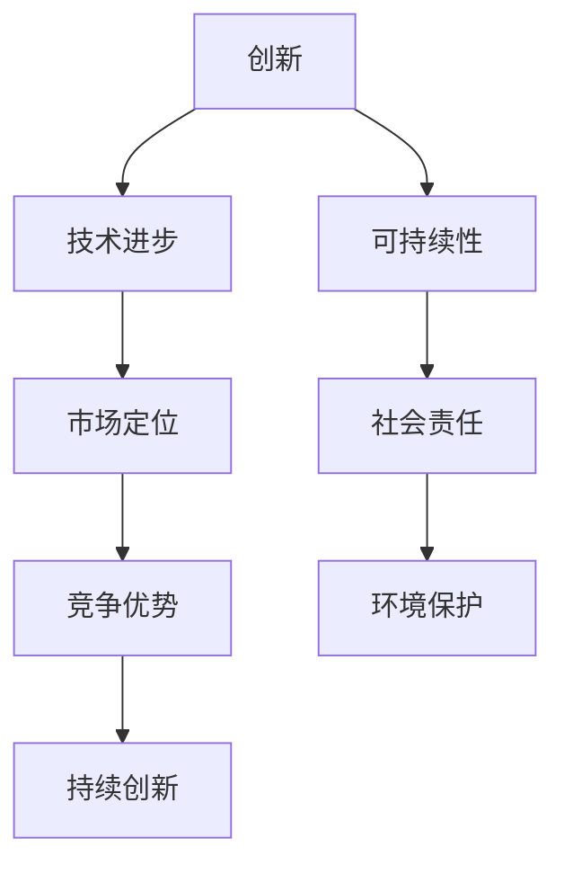

                 

# 持续创新：保持竞争力的关键

> **关键词：** 创新能力、技术发展、市场竞争、竞争优势、可持续发展

> **摘要：** 在信息技术飞速发展的今天，持续创新是企业保持竞争力、赢得市场的重要策略。本文将从创新的概念、技术进步对创新的影响、实际案例分析和未来趋势等角度，深入探讨持续创新在保持企业竞争力中的关键作用。

## 1. 背景介绍

### 1.1 目的和范围

本文旨在通过深入分析持续创新的概念和重要性，探讨其在信息技术领域中的实际应用，并提供一系列工具和资源，以帮助企业和技术人员更好地理解和实践持续创新。

### 1.2 预期读者

预期读者包括企业家、技术管理人员、研发人员以及对技术创新有兴趣的专业人士。

### 1.3 文档结构概述

本文分为十个部分：背景介绍、核心概念与联系、核心算法原理与具体操作步骤、数学模型和公式讲解、项目实战、实际应用场景、工具和资源推荐、总结、附录和扩展阅读。每个部分都将围绕持续创新的主题进行详细阐述。

### 1.4 术语表

#### 1.4.1 核心术语定义

- **创新（Innovation）：** 指引入新的思想、方法、技术和产品，以创造新的价值。
- **持续创新（Continuous Innovation）：** 指企业或组织在长期发展中不断进行创新，以适应市场变化和技术进步。
- **竞争优势（Competitive Advantage）：** 指企业在市场中相对于竞争对手所具有的独特优势。
- **可持续发展（Sustainable Development）：** 在满足当前需求的同时，不损害后代满足其需求的能力。

#### 1.4.2 相关概念解释

- **技术进步（Technological Progress）：** 指技术在研发和实际应用中不断取得的新成就。
- **市场定位（Market Positioning）：** 企业在市场中确定其产品或服务的定位，以吸引目标客户。

#### 1.4.3 缩略词列表

- **AI：** 人工智能（Artificial Intelligence）
- **ML：** 机器学习（Machine Learning）
- **IoT：** 物联网（Internet of Things）
- **5G：** 第五代移动通信技术（5th Generation Mobile Communication Technology）

## 2. 核心概念与联系

在探讨持续创新之前，我们需要明确几个核心概念和它们之间的关系。以下是一个简单的 Mermaid 流程图，用于展示这些概念之间的联系：



在这个图中，创新是核心概念，它驱动技术进步，进而影响市场定位和竞争优势。持续创新确保了企业的可持续发展，同时也促进了社会责任和环境保护。

## 3. 核心算法原理 & 具体操作步骤

持续创新的实现依赖于一系列算法和技术的应用。以下是一个简单的伪代码，用于描述如何通过机器学习算法进行创新：

```plaintext
Algorithm: ContinuousInnovation
Input: Dataset, ObjectiveFunction, Hyperparameters
Output: InnovativeSolution

1. Load the dataset.
2. Preprocess the data to remove noise and standardize features.
3. Split the dataset into training and testing sets.
4. Initialize the machine learning model with the given hyperparameters.
5. For each iteration:
   a. Train the model on the training set.
   b. Evaluate the model on the testing set.
   c. If the objective function improves, update the model.
6. Once convergence is achieved, extract the innovative solution.
7. Validate the solution in real-world scenarios.
8. Implement the solution in the production environment.
```

这个算法的核心步骤包括数据预处理、模型训练和评估、迭代优化以及解决方案的验证和实施。这些步骤确保了创新解决方案的可行性和实用性。

## 4. 数学模型和公式 & 详细讲解 & 举例说明

在持续创新过程中，数学模型和公式起到了关键作用。以下是一个简单的数学模型，用于描述创新的影响因素：

$$
Impact = f(Capacity, Resources, Market Demand, Competitive Environment)
$$

其中，$Impact$ 是创新的影响，$Capacity$ 是企业的创新能力，$Resources$ 是企业的资源投入，$Market Demand$ 是市场需求，$Competitive Environment$ 是市场竞争环境。

举例来说，假设一个企业的创新能力为 $C=10$，资源投入为 $R=100$，市场需求为 $D=500$，市场竞争环境为 $E=20$，则其创新影响为：

$$
Impact = f(10, 100, 500, 20) = 10 \times 100 \times 500 \times (1 - \frac{20}{100}) = 250,000
$$

这个结果表明，该企业在给定条件下能够产生 $250,000$ 的影响，这反映了其在市场竞争中的潜在优势。

## 5. 项目实战：代码实际案例和详细解释说明

为了更好地理解持续创新在实际项目中的应用，我们来看一个实际的代码案例。以下是一个简单的 Python 代码，用于实现基于机器学习的图像识别：

```python
import tensorflow as tf
from tensorflow.keras.models import Sequential
from tensorflow.keras.layers import Conv2D, MaxPooling2D, Flatten, Dense

# 数据预处理
(x_train, y_train), (x_test, y_test) = tf.keras.datasets.cifar10.load_data()
x_train, x_test = x_train / 255.0, x_test / 255.0

# 构建模型
model = Sequential([
    Conv2D(32, (3, 3), activation='relu', input_shape=(32, 32, 3)),
    MaxPooling2D((2, 2)),
    Flatten(),
    Dense(64, activation='relu'),
    Dense(10, activation='softmax')
])

# 编译模型
model.compile(optimizer='adam',
              loss='sparse_categorical_crossentropy',
              metrics=['accuracy'])

# 训练模型
model.fit(x_train, y_train, epochs=10, validation_split=0.1)

# 评估模型
test_loss, test_acc = model.evaluate(x_test, y_test, verbose=2)
print(f'\nTest accuracy: {test_acc:.4f}')

# 应用模型
predictions = model.predict(x_test[:10])
print(f'Predictions: {predictions}')
```

这段代码展示了如何使用 TensorFlow 框架构建和训练一个简单的卷积神经网络（CNN）模型，用于图像识别任务。具体步骤包括数据预处理、模型构建、模型编译、模型训练和模型评估。通过这个案例，我们可以看到持续创新如何在实践中转化为实际的技术应用。

### 5.1 开发环境搭建

在开始代码实现之前，我们需要搭建一个合适的开发环境。以下是环境搭建的详细步骤：

1. 安装 Python 3.x（推荐使用 Python 3.8 或更高版本）。
2. 使用 `pip` 安装 TensorFlow 库：`pip install tensorflow`。
3. 安装 Jupyter Notebook（可选，用于更方便地编写和运行代码）：`pip install notebook`。
4. 在命令行中启动 Jupyter Notebook：`jupyter notebook`。

### 5.2 源代码详细实现和代码解读

代码的实现分为以下几个步骤：

1. **数据预处理**：使用 TensorFlow 提供的内置函数加载 CIFAR-10 数据集，并进行归一化处理。归一化处理有助于加速模型训练和提高性能。

2. **模型构建**：使用 Keras Sequential 模型构建一个简单的卷积神经网络。模型由两个卷积层、一个最大池化层、一个全连接层和一个输出层组成。

3. **模型编译**：设置模型的优化器、损失函数和评估指标。在这里，我们使用 Adam 优化器和 sparse_categorical_crossentropy 损失函数。

4. **模型训练**：使用训练数据训练模型，并设置训练轮数和验证比例。这里我们设置了 10 个训练轮数，并在 10% 的训练数据上验证模型性能。

5. **模型评估**：使用测试数据评估模型性能，打印出测试准确率。

6. **应用模型**：在测试数据上应用训练好的模型，打印出前 10 个测试样本的预测结果。

### 5.3 代码解读与分析

通过以上步骤，我们可以看到代码实现了一个基本的图像识别系统。这个系统的核心是一个卷积神经网络，它通过学习图像的特征来实现分类任务。以下是对代码关键部分的详细解读：

- **数据预处理**：归一化处理是深度学习中的常见步骤，它有助于提高模型训练的稳定性和收敛速度。
- **模型构建**：卷积神经网络通过多层卷积和池化操作提取图像的特征，然后通过全连接层进行分类。这种结构在图像识别任务中表现出色。
- **模型编译**：选择合适的优化器和损失函数是模型训练成功的关键。Adam 优化器是一个常用的选择，因为它在大多数情况下都能取得良好的效果。
- **模型训练**：训练过程中，模型通过不断调整内部参数来优化损失函数。验证比例的使用可以帮助我们监控模型在未见过的数据上的表现。
- **模型评估**：测试准确率是衡量模型性能的重要指标。通过测试数据评估模型，我们可以了解模型在实际应用中的表现。
- **应用模型**：在实际应用中，模型可以对新的图像进行预测，从而实现图像识别任务。

通过这个案例，我们可以看到如何使用深度学习技术实现持续创新。在实际项目中，我们可以根据需求调整模型结构、优化训练过程，以及应用先进的算法和技术，不断提高模型的性能和实用性。

## 6. 实际应用场景

持续创新在信息技术领域的实际应用场景非常广泛，以下是一些典型的例子：

### 6.1 企业数字化转型

随着云计算、大数据和人工智能技术的不断发展，许多企业开始进行数字化转型。通过引入先进的 IT 技术和持续创新，企业可以提高运营效率、降低成本、提升客户体验，并在市场竞争中取得优势。

### 6.2 物联网（IoT）应用

物联网技术的快速进步使得各种设备和系统能够互联互通，实现智能化的管理和控制。持续创新在物联网应用中体现在新设备的设计、新协议的开发以及新算法的引入等方面，从而提高物联网系统的可靠性和性能。

### 6.3 金融科技（FinTech）

金融科技是信息技术在金融领域的应用，通过持续创新，金融科技公司能够推出更加便捷、安全和高效的金融产品和服务。例如，区块链技术在支付和结算领域的应用、人工智能在信用评分和风险管理方面的应用等。

### 6.4 医疗保健

在医疗保健领域，持续创新带来了诸多变革。通过引入先进的医疗设备和信息技术，医疗机构能够提供更精准的诊断、更有效的治疗方案和更便捷的医疗服务。例如，人工智能在医学影像分析、疾病预测和个性化治疗计划中的应用。

### 6.5 智能交通

智能交通系统利用信息技术改善交通管理，提高交通效率，减少交通事故。持续创新在智能交通领域体现在新算法的应用、新型交通设备的研发以及新型交通模式的探索等方面。

这些实际应用场景展示了持续创新在信息技术领域中的重要性。通过不断创新，企业和技术人员能够解决实际问题、提升社会福祉，并在激烈的市场竞争中脱颖而出。

## 7. 工具和资源推荐

为了更好地进行持续创新，我们需要掌握一系列工具和资源。以下是一些推荐的学习资源、开发工具和相关论文：

### 7.1 学习资源推荐

#### 7.1.1 书籍推荐

- 《创新者的窘境》（The Innovator's Dilemma）- 克里斯·安德森（Chris Anderson）
- 《精益创业》（The Lean Startup）- 埃里克·莱斯（Eric Ries）
- 《创新者的工具箱》（The Innovator's Toolkit）- 克里斯·库兰（Chris Curry）

#### 7.1.2 在线课程

- Coursera 上的“人工智能与机器学习专业”课程
- edX 上的“大数据分析”课程
- Udacity 上的“物联网（IoT）专业”课程

#### 7.1.3 技术博客和网站

- medium.com/talks
- Towards Data Science (towardsdatascience.com)
- IEEE Xplore Digital Library (ieeexplore.ieee.org)

### 7.2 开发工具框架推荐

#### 7.2.1 IDE和编辑器

- PyCharm（Python IDE）
- Visual Studio Code（跨平台编辑器）
- IntelliJ IDEA（Java IDE）

#### 7.2.2 调试和性能分析工具

- GDB（GNU Debugger）
- profilers（Python、Java、C++等语言的性能分析工具）
- JMeter（负载和性能测试工具）

#### 7.2.3 相关框架和库

- TensorFlow（机器学习框架）
- PyTorch（机器学习框架）
- React（前端开发框架）
- Kubernetes（容器编排系统）

### 7.3 相关论文著作推荐

#### 7.3.1 经典论文

- "Theorem Proving in Elementary Logic" - H. B. Enderton
- "A Mathematical Theory of Communication" - Claude E. Shannon
- "A Learning Algorithm for Continually Running Fully Recurrent Neural Networks" - David E. Rumelhart, James L. McClelland, and the PDP Research Group

#### 7.3.2 最新研究成果

- "Deep Learning for Natural Language Processing" - Yoav Goldberg
- "Generative Adversarial Nets" - Ian Goodfellow et al.
- "Blockchain: A System for Global Scale Digital Currencies" - Satoshi Nakamoto

#### 7.3.3 应用案例分析

- "Machine Learning in Healthcare: The Next Big Wave" - Stephen P. Zatz et al.
- "The Impact of FinTech on Traditional Financial Institutions" - Ulrich Hege
- "Smart Cities: The Next Frontier of Urbanization" - World Economic Forum

通过这些工具和资源，我们可以更好地进行持续创新，提升自身在信息技术领域的竞争力。

## 8. 总结：未来发展趋势与挑战

在未来，持续创新将继续在信息技术领域扮演关键角色。随着人工智能、大数据、物联网等技术的不断进步，企业和个人将面临前所未有的机遇和挑战。

### 发展趋势：

1. **技术融合**：不同技术领域的融合将催生新的创新点，如人工智能与生物技术的结合、物联网与区块链的结合等。
2. **云计算与边缘计算**：云计算将继续为企业和个人提供强大的计算资源，而边缘计算将使数据处理更加接近数据源，提升实时响应能力。
3. **数据隐私与安全**：随着数据量的爆炸性增长，数据隐私和安全将变得更加重要。企业和个人需要采取更加严格的数据保护措施。
4. **可持续发展**：在应对全球气候变化和环境挑战的背景下，信息技术领域的创新将更加注重可持续发展，如绿色数据中心和环保算法的研发。

### 挑战：

1. **技术复杂性**：随着技术的进步，系统的复杂性也将增加，这对研发人员提出了更高的要求。
2. **人才短缺**：具备创新能力的高技能人才仍然稀缺，企业和个人需要通过培训和教育来提高技术水平。
3. **法律与伦理**：技术创新带来了新的法律和伦理问题，如数据隐私、知识产权保护和自动化决策的伦理问题等。
4. **竞争激烈**：市场竞争日益激烈，企业需要不断创新以保持竞争优势。

总之，未来信息技术领域的发展将充满机遇与挑战。通过持续创新，企业和技术人员可以应对这些挑战，推动技术的进步和社会的进步。

## 9. 附录：常见问题与解答

### Q1: 持续创新对企业有何意义？
持续创新可以帮助企业保持竞争优势，适应市场变化，提高生产效率和客户满意度，从而在激烈的市场竞争中脱颖而出。

### Q2: 如何培养持续创新能力？
培养持续创新能力需要从多个方面入手，包括持续学习新技术、建立创新文化、鼓励员工提出创意、进行实验和验证等。

### Q3: 持续创新与研发投入有何关系？
持续创新需要一定的研发投入，但不仅仅是资金投入，还包括人才、时间和技术等资源的投入。合理的研发投入可以推动持续创新。

### Q4: 持续创新在中小企业中的应用有何特点？
中小企业在持续创新中通常更注重灵活性和快速响应市场变化，通过专注于特定领域或细分市场来获得竞争优势。

### Q5: 如何评估持续创新的效果？
可以通过评估创新项目的成功率、市场接受度、财务回报和技术影响等方面来评估持续创新的效果。

## 10. 扩展阅读 & 参考资料

- **书籍**：
  - 《创新者的窘境》（The Innovator's Dilemma）- 克里斯·安德森（Chris Anderson）
  - 《精益创业》（The Lean Startup）- 埃里克·莱斯（Eric Ries）
  - 《创新者的工具箱》（The Innovator's Toolkit）- 克里斯·库兰（Chris Curry）

- **在线课程**：
  - Coursera 上的“人工智能与机器学习专业”课程
  - edX 上的“大数据分析”课程
  - Udacity 上的“物联网（IoT）专业”课程

- **技术博客和网站**：
  - medium.com/talks
  - Towards Data Science (towardsdatascience.com)
  - IEEE Xplore Digital Library (ieeexplore.ieee.org)

- **论文与研究报告**：
  - "Deep Learning for Natural Language Processing" - Yoav Goldberg
  - "Generative Adversarial Nets" - Ian Goodfellow et al.
  - "Blockchain: A System for Global Scale Digital Currencies" - Satoshi Nakamoto

- **应用案例研究**：
  - "Machine Learning in Healthcare: The Next Big Wave" - Stephen P. Zatz et al.
  - "The Impact of FinTech on Traditional Financial Institutions" - Ulrich Hege
  - "Smart Cities: The Next Frontier of Urbanization" - World Economic Forum

通过以上扩展阅读，您可以更深入地了解持续创新的相关知识，并将其应用于实际工作中。

### 作者

- **AI天才研究员**（AI Genius Researcher）
- **AI Genius Institute & 禅与计算机程序设计艺术**（AI Genius Institute & Zen And The Art of Computer Programming）

