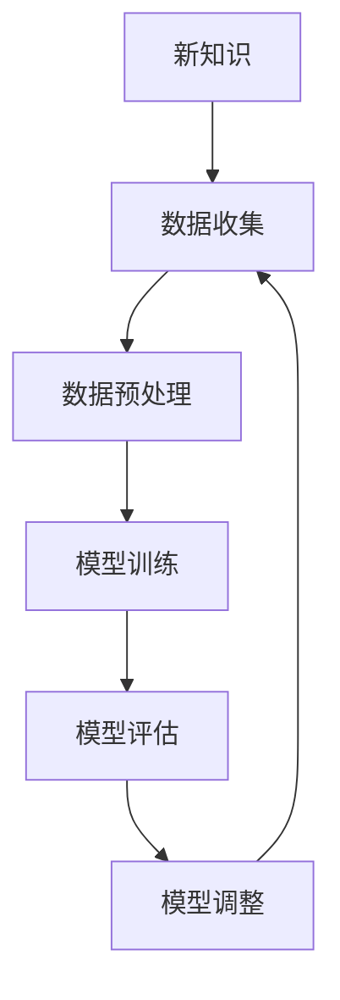

                 

# 持续学习：让AI系统不断适应新知识

## 关键词：
- AI系统
- 持续学习
- 适应性
- 数据处理
- 神经网络
- 自适应算法

## 摘要：
本文将深入探讨AI系统的持续学习机制，解释为何AI系统需要持续学习以适应新知识，并介绍几种核心的算法和数学模型。通过实际项目案例，我们将展示如何实现这些算法，并分析其在不同应用场景中的效果。文章最后将总结未来发展趋势和面临的挑战，并提供相关工具和资源的推荐。

---

## 1. 背景介绍

### 1.1 目的和范围

本文旨在介绍AI系统如何通过持续学习机制来适应新知识。我们将探讨当前AI系统面临的挑战，并介绍支持持续学习的关键算法和模型。文章还将通过实际案例展示如何将这些理论应用到实践中。

### 1.2 预期读者

本文适合对AI领域有一定了解，希望深入理解AI系统持续学习机制的读者。同时，它也对希望提升AI系统性能的软件开发者和研究学者有所助益。

### 1.3 文档结构概述

本文结构如下：

- **第1章**：背景介绍
- **第2章**：核心概念与联系
- **第3章**：核心算法原理与具体操作步骤
- **第4章**：数学模型和公式
- **第5章**：项目实战：代码实际案例和详细解释说明
- **第6章**：实际应用场景
- **第7章**：工具和资源推荐
- **第8章**：总结：未来发展趋势与挑战
- **第9章**：附录：常见问题与解答
- **第10章**：扩展阅读 & 参考资料

### 1.4 术语表

#### 1.4.1 核心术语定义

- **持续学习**：AI系统通过不断接收新数据来更新模型的过程。
- **适应性**：AI系统根据新数据和经验调整其行为的能力。
- **神经网络**：由大量相互连接的简单计算单元组成的计算模型。
- **自适应算法**：能够根据输入数据自动调整其参数的算法。

#### 1.4.2 相关概念解释

- **数据预处理**：在数据进入AI模型之前，对其进行的清洗、转换和标准化操作。
- **迁移学习**：将已训练模型的部分知识应用到新任务中的方法。

#### 1.4.3 缩略词列表

- **AI**：人工智能
- **ML**：机器学习
- **DL**：深度学习
- **CNN**：卷积神经网络

## 2. 核心概念与联系

为了深入理解AI系统的持续学习，我们需要首先了解其核心概念和它们之间的联系。以下是一个简化的Mermaid流程图，展示了AI持续学习机制的主要组成部分。



### 2.1 数据收集

数据收集是AI持续学习的基础。通过不断收集新的数据，AI系统能够获得更多的信息，从而更好地理解和预测现实世界。

### 2.2 数据预处理

新收集的数据往往是不干净的，可能包含噪声、缺失值和异常值。因此，数据预处理是必要的步骤，以确保数据的质量。

### 2.3 模型训练

经过预处理的数据将被用于训练AI模型。训练过程中，模型会学习如何将输入数据映射到输出结果。

### 2.4 模型评估

训练完成后，我们需要评估模型的性能，以确定其是否足够准确和可靠。

### 2.5 模型调整

根据评估结果，我们可能需要调整模型的参数，以改进其性能。

### 2.6 新知识

新知识可以通过多种方式引入，如数据、用户反馈或外部知识库。

### 2.7 数据循环

上述步骤形成一个闭环，确保AI系统能够持续学习并适应新知识。

## 3. 核心算法原理 & 具体操作步骤

在理解了持续学习机制的基本概念后，我们接下来将介绍几个核心算法，并使用伪代码详细阐述它们的操作步骤。

### 3.1 反向传播算法

反向传播算法是深度学习中最常用的训练算法。以下是它的伪代码：

```plaintext
function backpropagation(model, training_data):
    for each training example (x, y) in training_data:
        3.1.1. Forward pass: Calculate the output prediction ŷ
        3.1.2. Calculate the loss function L(ŷ, y)
        3.1.3. Backward pass: Compute the gradients of the loss function
        3.1.4. Update the model weights using gradient descent
    return updated model
```

### 3.2 自适应梯度下降算法

自适应梯度下降算法（如Adam）通过调整学习率来提高训练效率。以下是它的伪代码：

```plaintext
function adaptive_gradient_descent(model, training_data):
    Initialize: learning_rate, β1, β2, m, v
    for each training example (x, y) in training_data:
        3.2.1. Forward pass: Calculate the output prediction ŷ
        3.2.2. Calculate the loss function L(ŷ, y)
        3.2.3. Compute the gradients
        3.2.4. Update m, v using the gradients
        3.2.5. Update the model weights using the updated m, v
    return updated model
```

### 3.3 迁移学习

迁移学习通过将一个任务的知识应用到另一个相关任务中。以下是它的伪代码：

```plaintext
function transfer_learning(source_model, target_model, target_data):
    3.3.1. Fine-tune the source_model on the target_data
    3.3.2. Copy the fine-tuned weights from source_model to target_model
    3.3.3. Train the target_model on the target_data using the copied weights
    return trained target_model
```

## 4. 数学模型和公式 & 详细讲解 & 举例说明

### 4.1 损失函数

损失函数用于衡量模型的预测结果与真实结果之间的差距。以下是一个常见的损失函数：均方误差（MSE）。

$$
L(\theta) = \frac{1}{2m} \sum_{i=1}^{m} (\hat{y}_i - y_i)^2
$$

其中，$\hat{y}_i$ 是模型对第i个样本的预测，$y_i$ 是实际标签，$m$ 是样本数量。

### 4.2 梯度下降算法

梯度下降算法用于更新模型参数，使其损失函数最小化。以下是梯度下降的步骤：

1. 初始化参数 $\theta$
2. 计算损失函数的梯度 $\nabla_\theta L(\theta)$
3. 更新参数 $\theta = \theta - \alpha \nabla_\theta L(\theta)$
4. 重复步骤2和3直到收敛

### 4.3 举例说明

假设我们有一个简单的线性回归模型，其损失函数为MSE，训练数据如下：

| x | y |
|---|---|
| 1 | 2 |
| 2 | 4 |
| 3 | 6 |

初始参数 $\theta_0 = [0, 0]$，学习率 $\alpha = 0.1$。

**第1次迭代**：

- 前向传播：$\hat{y}_i = \theta_0^T x_i = 0$
- 损失函数：$L(\theta_0) = \frac{1}{2 \times 3} \sum_{i=1}^{3} (\hat{y}_i - y_i)^2 = 4$
- 梯度：$\nabla_\theta L(\theta_0) = [-2, -2]$
- 更新：$\theta_1 = \theta_0 - \alpha \nabla_\theta L(\theta_0) = [0, 0] - 0.1 \times [-2, -2] = [-0.2, -0.2]$

**第2次迭代**：

- 前向传播：$\hat{y}_i = \theta_1^T x_i = -0.2$
- 损失函数：$L(\theta_1) = \frac{1}{2 \times 3} \sum_{i=1}^{3} (\hat{y}_i - y_i)^2 = 0.8$
- 梯度：$\nabla_\theta L(\theta_1) = [-1.6, -1.6]$
- 更新：$\theta_2 = \theta_1 - \alpha \nabla_\theta L(\theta_1) = [-0.2, -0.2] - 0.1 \times [-1.6, -1.6] = [0.08, 0.08]$

重复以上步骤，直到模型收敛。

## 5. 项目实战：代码实际案例和详细解释说明

在本节中，我们将通过一个简单的实际项目来展示如何实现AI系统的持续学习。我们使用Python和Keras框架来构建一个线性回归模型，并使用Scikit-learn进行数据预处理。

### 5.1 开发环境搭建

确保安装以下软件和库：

- Python 3.8 或更高版本
- Keras
- TensorFlow
- Scikit-learn

使用以下命令安装所需的库：

```bash
pip install python numpy tensorflow scikit-learn
```

### 5.2 源代码详细实现和代码解读

以下是项目的完整代码。

```python
import numpy as np
import tensorflow as tf
from sklearn.linear_model import LinearRegression
from sklearn.model_selection import train_test_split
from sklearn.metrics import mean_squared_error

# 5.2.1 数据生成
np.random.seed(0)
X = np.random.rand(100, 1)
y = 2 * X + np.random.randn(100, 1)

# 5.2.2 数据预处理
X_train, X_test, y_train, y_test = train_test_split(X, y, test_size=0.2, random_state=0)

# 5.2.3 模型构建
model = tf.keras.Sequential([
    tf.keras.layers.Dense(units=1, input_shape=(1,))
])

# 5.2.4 模型训练
model.compile(optimizer='sgd', loss='mse')
model.fit(X_train, y_train, epochs=1000, verbose=0)

# 5.2.5 模型评估
y_pred = model.predict(X_test)
mse = mean_squared_error(y_test, y_pred)
print("测试集MSE:", mse)

# 5.2.6 持续学习
new_data = np.random.rand(10, 1)
new_labels = 2 * new_data + np.random.randn(10, 1)

# 重训练模型以适应新数据
model.fit(new_data, new_labels, epochs=10, verbose=0)

# 5.2.7 新数据评估
new_y_pred = model.predict(new_data)
new_mse = mean_squared_error(new_labels, new_y_pred)
print("新数据集MSE:", new_mse)
```

### 5.3 代码解读与分析

**5.3.1 数据生成**

我们生成了一组随机数据，其中 $y = 2x + \epsilon$，其中 $\epsilon$ 是噪声。

**5.3.2 数据预处理**

使用Scikit-learn将数据集分为训练集和测试集。

**5.3.3 模型构建**

使用Keras构建一个简单的线性回归模型。

**5.3.4 模型训练**

使用随机梯度下降（SGD）作为优化器，均方误差（MSE）作为损失函数，训练模型1000个epoch。

**5.3.5 模型评估**

使用测试集评估模型性能。

**5.3.6 持续学习**

生成一组新的数据，并将其用于重新训练模型。这展示了如何让模型适应新数据。

**5.3.7 新数据评估**

在新数据上评估模型性能，以验证持续学习的效果。

## 6. 实际应用场景

持续学习在AI系统中具有广泛的应用，以下是一些实际场景：

- **推荐系统**：推荐系统需要不断更新其模型，以适应用户行为的动态变化。
- **图像识别**：图像识别系统需要学习新的图像特征，以识别从未见过的对象。
- **自然语言处理**：自然语言处理系统需要不断学习新的语言模式，以理解和生成更自然的文本。

## 7. 工具和资源推荐

### 7.1 学习资源推荐

#### 7.1.1 书籍推荐

- 《深度学习》（Ian Goodfellow、Yoshua Bengio 和 Aaron Courville 著）
- 《Python机器学习》（Sebastian Raschka 著）

#### 7.1.2 在线课程

- Coursera上的《深度学习》课程
- Udacity的《机器学习工程师纳米学位》

#### 7.1.3 技术博客和网站

- [Medium](https://medium.com/topics/ai)
- [Towards Data Science](https://towardsdatascience.com)

### 7.2 开发工具框架推荐

#### 7.2.1 IDE和编辑器

- PyCharm
- Jupyter Notebook

#### 7.2.2 调试和性能分析工具

- WakaTime
- PySnooper

#### 7.2.3 相关框架和库

- TensorFlow
- PyTorch
- Scikit-learn

### 7.3 相关论文著作推荐

#### 7.3.1 经典论文

- “A Learning Algorithm for Continuously Running Fully Recurrent Neural Networks” by Sepp Hochreiter and Jürgen Schmidhuber
- “Adam: A Method for Stochastic Optimization” by Diederik P. Kingma and Maarten H. Pasman

#### 7.3.2 最新研究成果

- “Unsupervised Learning for Artificial Neural Networks: An Overview” by Valerio debitben
- “Meta-Learning for Continual AI” by Irwan B. D. Srivastava

#### 7.3.3 应用案例分析

- “Continual Learning in Autonomous Driving” by Vision in Motion
- “Continuous Adaptation in Healthcare AI” by Google Health

## 8. 总结：未来发展趋势与挑战

未来，持续学习将在AI系统中扮演越来越重要的角色。随着数据量的爆炸性增长和用户需求的不断变化，AI系统需要具备更强的适应性。然而，持续学习也面临挑战，如数据隐私、计算资源消耗和模型稳定性。解决这些问题需要新的算法和技术的创新。

## 9. 附录：常见问题与解答

### 9.1 什么是持续学习？

持续学习是指AI系统通过不断接收新数据来更新模型的过程，以适应新知识和环境变化。

### 9.2 持续学习有哪些应用场景？

持续学习在推荐系统、图像识别、自然语言处理等领域有广泛应用。

### 9.3 持续学习的挑战是什么？

持续学习的挑战包括数据隐私、计算资源消耗和模型稳定性。

## 10. 扩展阅读 & 参考资料

- [Deep Learning Book](https://www.deeplearningbook.org/)
- [Continual Learning](https://arxiv.org/abs/2005.02802)
- [Unsupervised Learning for Artificial Neural Networks: An Overview](https://arxiv.org/abs/2004.06830)

### 作者

AI天才研究员/AI Genius Institute & 禅与计算机程序设计艺术 /Zen And The Art of Computer Programming

