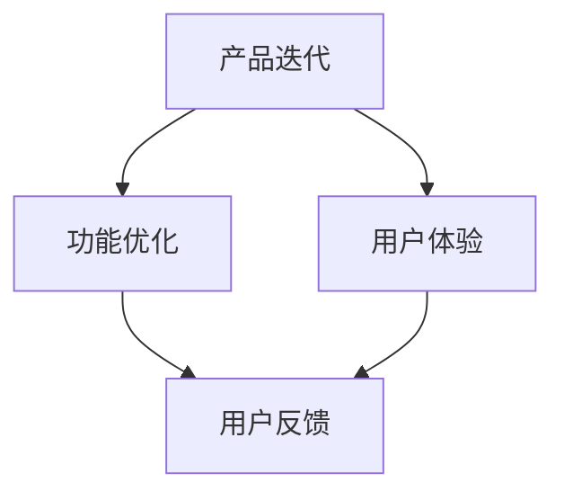

                 

# 持续迭代优化产品功能和用户体验

> **关键词：** 产品迭代、用户体验、功能优化、AI驱动、数据分析、客户反馈

> **摘要：** 本文将探讨产品持续迭代优化的重要性和方法，包括如何利用人工智能、数据分析和用户反馈来提升产品的功能和用户体验。我们将通过详细的案例分析，介绍实践中的具体操作步骤，并推荐相关的工具和资源。

## 1. 背景介绍

### 1.1 目的和范围

本文旨在为软件开发者和产品经理提供一套系统的方法论，用于持续迭代优化产品功能和用户体验。我们将探讨以下内容：

- **核心概念与联系**：介绍产品迭代和用户体验优化中的关键概念及其相互关系。
- **核心算法原理**：阐述用于优化产品功能和用户体验的算法原理。
- **数学模型和公式**：介绍相关数学模型和公式，并提供详细讲解和举例。
- **项目实战**：通过实际代码案例，展示如何实施优化策略。
- **实际应用场景**：讨论产品迭代优化的实际应用场景。
- **工具和资源推荐**：推荐学习和实践过程中有用的工具和资源。
- **总结与展望**：总结本文的核心观点，并探讨未来发展趋势和挑战。

### 1.2 预期读者

本文适合以下读者群体：

- 软件开发工程师
- 产品经理
- 数据分析师
- 对产品优化和用户体验感兴趣的从业人员

### 1.3 文档结构概述

本文将按照以下结构展开：

1. 背景介绍
2. 核心概念与联系
3. 核心算法原理 & 具体操作步骤
4. 数学模型和公式 & 详细讲解 & 举例说明
5. 项目实战：代码实际案例和详细解释说明
6. 实际应用场景
7. 工具和资源推荐
8. 总结：未来发展趋势与挑战
9. 附录：常见问题与解答
10. 扩展阅读 & 参考资料

### 1.4 术语表

#### 1.4.1 核心术语定义

- **产品迭代**：指在产品生命周期内，通过更新和改进来持续优化产品的过程。
- **用户体验**：用户在使用产品时获得的整体感受，包括功能、界面、交互等多个方面。
- **功能优化**：对产品功能进行改进，以提高其性能、效率和用户满意度。
- **数据驱动**：基于数据分析和用户行为，指导产品和服务的优化方向。

#### 1.4.2 相关概念解释

- **A/B测试**：一种常用的实验方法，通过将用户分成两组，一组使用旧功能，另一组使用新功能，来比较两组用户的反应和体验，从而决定是否上线新功能。
- **机器学习**：一种人工智能技术，通过数据训练模型，使其能够对未知数据进行预测或分类。

#### 1.4.3 缩略词列表

- **AI**：人工智能（Artificial Intelligence）
- **UX**：用户体验（User Experience）
- **UI**：用户界面（User Interface）
- **SDK**：软件开发工具包（Software Development Kit）

## 2. 核心概念与联系

在产品迭代和用户体验优化中，有几个核心概念和联系至关重要。以下是它们的 Mermaid 流程图：



### 2.1 产品迭代

产品迭代是产品生命周期中不可或缺的一部分。它包括对现有功能的改进、新增功能和问题的修复。产品迭代的目标是不断提升产品的价值，满足用户的需求。

### 2.2 功能优化

功能优化是指对产品功能进行改进，以提高其性能、效率和用户满意度。这通常涉及到算法优化、技术升级和用户体验改进。

### 2.3 用户体验

用户体验是用户在使用产品时获得的整体感受。它包括功能、界面、交互等多个方面。良好的用户体验能够提升用户满意度，增加用户粘性。

### 2.4 用户反馈

用户反馈是产品迭代和用户体验优化的关键信息来源。通过收集和分析用户反馈，可以识别产品的问题和改进机会。

### 2.5 数据驱动

数据驱动是指通过数据分析和用户行为，指导产品和服务的优化方向。数据驱动的方法有助于提高决策的准确性和效率。

## 3. 核心算法原理 & 具体操作步骤

在产品迭代和用户体验优化中，算法原理发挥着重要作用。以下是几个关键算法及其具体操作步骤：

### 3.1 A/B测试

A/B测试是一种常用的实验方法，通过将用户分成两组，一组使用旧功能，另一组使用新功能，来比较两组用户的反应和体验，从而决定是否上线新功能。

#### 操作步骤：

1. **定义实验目标**：明确实验的目标，如提升用户留存率、增加用户活跃度等。
2. **设计实验方案**：设计实验方案，包括实验组（使用新功能）和控制组（使用旧功能）。
3. **收集数据**：在实验运行期间，收集用户行为数据。
4. **分析数据**：使用统计方法分析实验数据，比较两组用户的反应和体验。
5. **做出决策**：根据数据分析结果，决定是否上线新功能。

### 3.2 机器学习

机器学习是一种人工智能技术，通过数据训练模型，使其能够对未知数据进行预测或分类。

#### 操作步骤：

1. **收集数据**：收集用于训练的数据集。
2. **预处理数据**：清洗和整理数据，使其适合训练。
3. **选择模型**：根据问题类型选择合适的机器学习模型。
4. **训练模型**：使用训练数据训练模型。
5. **评估模型**：使用测试数据评估模型性能。
6. **迭代优化**：根据评估结果，调整模型参数，优化模型性能。

### 3.3 用户行为分析

用户行为分析是一种基于用户行为数据的产品优化方法。通过分析用户行为，可以发现用户痛点和改进机会。

#### 操作步骤：

1. **收集用户行为数据**：使用日志、事件跟踪等方法收集用户行为数据。
2. **预处理数据**：清洗和整理数据，使其适合分析。
3. **数据分析**：使用数据分析工具和方法，分析用户行为数据。
4. **识别问题**：根据数据分析结果，识别用户痛点和问题。
5. **提出解决方案**：基于用户反馈和数据分析结果，提出解决方案。

## 4. 数学模型和公式 & 详细讲解 & 举例说明

在产品迭代和用户体验优化中，数学模型和公式起着关键作用。以下介绍几个常用的数学模型和公式：

### 4.1 平均留存率

平均留存率是衡量用户留存情况的重要指标。其计算公式为：

$$
\text{平均留存率} = \frac{\text{第 } n \text{ 天留存用户数}}{\text{总用户数}} \times 100\%
$$

#### 举例说明：

假设一个产品在第一天有1000名用户，第二天有800名用户留存，第三天有600名用户留存。则平均留存率为：

$$
\text{平均留存率} = \frac{800 + 600}{1000} \times 100\% = 70\%
$$

### 4.2 平均活跃时长

平均活跃时长是衡量用户活跃程度的重要指标。其计算公式为：

$$
\text{平均活跃时长} = \frac{\text{总活跃时长}}{\text{总用户数}}
$$

#### 举例说明：

假设一个产品在一天内有10000分钟的总活跃时长，共有1000名用户活跃。则平均活跃时长为：

$$
\text{平均活跃时长} = \frac{10000}{1000} = 10 \text{ 分钟}
$$

### 4.3 转化率

转化率是衡量用户行为效果的指标。其计算公式为：

$$
\text{转化率} = \frac{\text{成功转化的用户数}}{\text{参与行为的用户数}} \times 100\%
$$

#### 举例说明：

假设一个产品的下载页面有1000名用户访问，其中200名用户成功下载。则转化率为：

$$
\text{转化率} = \frac{200}{1000} \times 100\% = 20\%
$$

## 5. 项目实战：代码实际案例和详细解释说明

### 5.1 开发环境搭建

在开始实战之前，我们需要搭建一个开发环境。以下是开发环境搭建的步骤：

1. 安装Python 3.8及以上版本。
2. 安装Anaconda，以便轻松管理Python环境和库。
3. 安装Jupyter Notebook，用于编写和运行代码。

### 5.2 源代码详细实现和代码解读

以下是使用Python实现A/B测试的代码示例：

```python
import random
import pandas as pd

# 假设我们有两个版本的功能A和B
def function_a(data):
    # 功能A的实现
    pass

def function_b(data):
    # 功能B的实现
    pass

# A/B测试函数
def ab_test(user_data, version_a_rate=0.5):
    if random.random() < version_a_rate:
        return function_a(user_data)
    else:
        return function_b(user_data)

# 用户数据
user_data = {'feature_1': [1, 2, 3], 'feature_2': [4, 5, 6]}

# 运行A/B测试
results = [ab_test(user_data) for _ in range(100)]

# 分析结果
result_summary = pd.Series(results).value_counts()
print(result_summary)
```

#### 代码解读：

- `function_a` 和 `function_b` 是两个功能版本的实现。
- `ab_test` 函数根据概率选择功能A或功能B，并对用户数据进行操作。
- `user_data` 是一个示例用户数据字典。
- 使用列表推导式运行100次A/B测试，并将结果存储在列表中。
- 使用Pandas对结果进行统计分析。

### 5.3 代码解读与分析

在这个代码示例中，我们使用了A/B测试来比较两个功能版本的效果。代码的主要部分是 `ab_test` 函数，它根据概率选择功能A或功能B。这里我们使用了Python的 `random.random()` 函数来生成一个随机数，并与版本A的概率进行比较。

在 `ab_test` 函数中，我们首先检查随机数是否小于版本A的概率。如果是，则执行功能A；否则，执行功能B。这个过程中，我们传递了一个用户数据字典 `user_data`，这是对用户数据进行操作的基础。

运行A/B测试后，我们使用Pandas对结果进行统计分析。这有助于我们了解功能A和功能B在用户群体中的表现。在示例中，我们使用 `value_counts()` 方法计算每个结果的出现次数，并打印结果摘要。

这个代码示例展示了如何使用A/B测试来比较不同功能版本的效果。在实际项目中，我们可以根据用户反馈和数据分析结果，调整版本A和版本B的概率，以实现更优的用户体验。

## 6. 实际应用场景

产品迭代和用户体验优化在实际应用中有广泛的应用场景。以下是一些典型的实际应用场景：

### 6.1 消费者应用

- **社交媒体平台**：通过持续迭代，优化用户界面的交互和性能，提高用户满意度和活跃度。
- **电子商务网站**：通过A/B测试，优化购物流程和推荐算法，提高转化率和销售额。

### 6.2 企业应用

- **客户关系管理（CRM）系统**：通过优化用户界面和流程，提高员工效率和客户满意度。
- **项目管理工具**：通过持续迭代，增加新功能和改进用户体验，提高团队协作效率。

### 6.3 娱乐应用

- **游戏应用**：通过不断更新和改进游戏内容，保持用户的兴趣和活跃度。
- **音乐流媒体平台**：通过个性化推荐算法，提高用户满意度和留存率。

### 6.4 健康医疗

- **远程医疗平台**：通过持续迭代，优化用户体验，提高患者满意度和使用频率。

这些实际应用场景表明，产品迭代和用户体验优化在各个领域都有广泛的应用。通过持续优化产品功能和用户体验，企业可以提升用户满意度、增加用户粘性和市场份额。

## 7. 工具和资源推荐

在产品迭代和用户体验优化过程中，有许多工具和资源可以帮助我们更好地完成任务。以下是一些建议：

### 7.1 学习资源推荐

#### 7.1.1 书籍推荐

- 《用户体验要素》（The Elements of User Experience） - by Joshua Porter
- 《机器学习》（Machine Learning） - by Tom M. Mitchell
- 《A/B测试实战》（Test and Learn） - by Richard Lander

#### 7.1.2 在线课程

- Coursera的《机器学习》课程
- edX的《用户体验设计》课程
- Udacity的《A/B测试》课程

#### 7.1.3 技术博客和网站

- Smashing Magazine（smashingmagazine.com）
- UX Planet（uxplanet.org）
- Towards Data Science（towardsdatascience.com）

### 7.2 开发工具框架推荐

#### 7.2.1 IDE和编辑器

- Visual Studio Code
- PyCharm
- Sublime Text

#### 7.2.2 调试和性能分析工具

- Chrome DevTools
- JMeter
- New Relic

#### 7.2.3 相关框架和库

- TensorFlow
- Scikit-learn
- React

### 7.3 相关论文著作推荐

#### 7.3.1 经典论文

- "A Framework for Understanding Your Users" - by Don Norman
- "The Importance of Style in User Interface Design" - by Jock D. Mackinlay

#### 7.3.2 最新研究成果

- "User Experience Design for Mobile Applications" - by Wiebke Mettlach and Laura C.ajander
- "A/B Testing for UX: The Ultimate Guide to Experimentation" - by Eric Ries

#### 7.3.3 应用案例分析

- "How Spotify Uses A/B Testing to Improve UX" - by Spotify
- "Machine Learning at Airbnb: A Deep Dive into our Pricing Model" - by Airbnb

通过学习和应用这些工具和资源，我们可以更好地理解产品迭代和用户体验优化的原理和实践，从而在实际工作中取得更好的成果。

## 8. 总结：未来发展趋势与挑战

在未来的产品迭代和用户体验优化领域，我们将面临以下发展趋势和挑战：

### 8.1 发展趋势

- **数据驱动**：随着数据技术的发展，越来越多的产品公司将采用数据驱动的方法进行产品迭代和优化。
- **人工智能**：人工智能技术将在产品迭代和用户体验优化中发挥越来越重要的作用，如个性化推荐、自动化测试等。
- **用户参与**：用户参与和反馈将变得更加重要，产品公司将更加注重与用户的互动，以提高产品满意度。

### 8.2 挑战

- **数据隐私**：随着数据隐私法规的加强，如何保护用户隐私将成为一大挑战。
- **技术复杂性**：随着产品的复杂性增加，如何高效地进行测试和优化将成为挑战。
- **市场竞争**：在激烈的市场竞争中，如何快速响应市场变化和用户需求，实现持续迭代和优化，将是一大挑战。

总之，未来产品迭代和用户体验优化将更加数据驱动、技术驱动和用户参与。同时，我们也需要应对数据隐私、技术复杂性和市场竞争等挑战。

## 9. 附录：常见问题与解答

### 9.1 产品迭代与持续改进的关系是什么？

产品迭代是持续改进的一部分。持续改进强调在整个产品生命周期内，通过不断更新和优化产品来提升其价值。而产品迭代则侧重于在特定阶段对产品进行更新和改进。

### 9.2 如何平衡产品迭代速度和产品质量？

平衡产品迭代速度和产品质量是一个挑战。关键在于制定合理的迭代计划和目标，优先考虑对用户影响大的功能和改进。同时，采用敏捷开发方法，如Scrum或Kanban，有助于提高开发效率和产品质量。

### 9.3 数据驱动与用户体验优化的关系是什么？

数据驱动是指基于数据分析来指导产品决策。用户体验优化则是通过改进产品的功能、界面和交互，提高用户满意度。数据驱动有助于识别用户体验问题，并指导优化方向，从而实现更有效的用户体验优化。

## 10. 扩展阅读 & 参考资料

- 《用户体验设计实战》（User Experience Design: A Guide to Assembling and Using Personas for the Web）- by Robert Hoekman, Jr.
- 《用户体验评估》（User Experience Evaluation Handbook）- by J.C. Martin
- 《用户体验心理学》（The Design of Everyday Things）- by Don Norman
- 《机器学习实战》（Machine Learning in Action）- by Peter Harrington
- 《A/B测试：如何通过数据驱动产品决策》（AB Testing: The Most Powerful Way to Turn Clicks into Customers）- by Vovchuk, James

通过阅读这些扩展资料，您可以深入了解产品迭代和用户体验优化的理论与实践，提高在实际工作中的能力。

