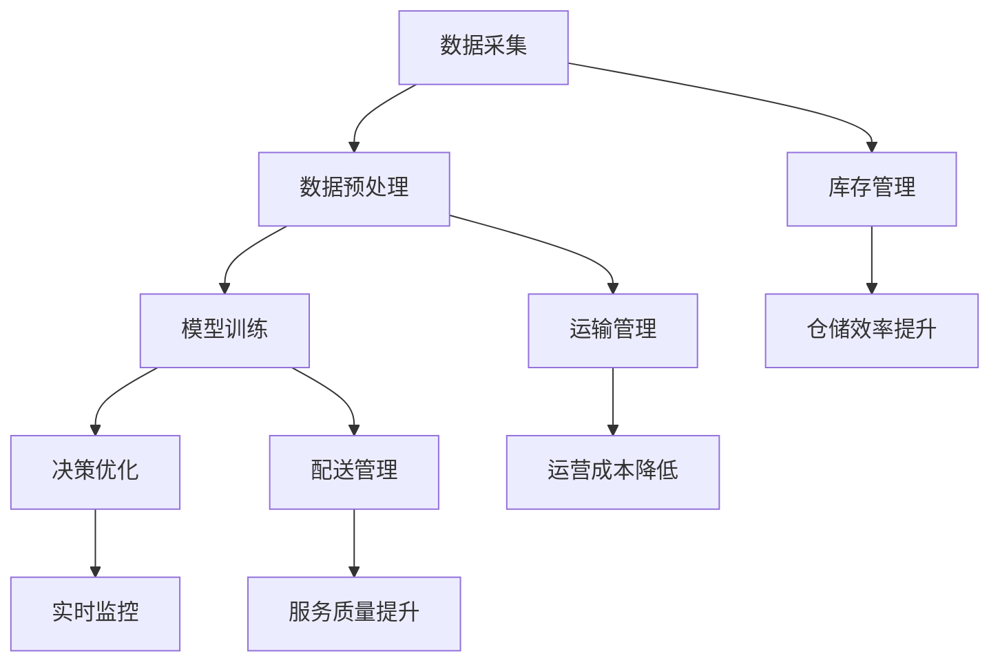

                 

# 探索AI大模型在智能仓储管理中的应用

> 关键词：人工智能，大模型，智能仓储，仓储管理，应用场景

> 摘要：本文将探讨人工智能大模型在智能仓储管理中的应用，分析大模型的核心技术及其在仓储管理中的具体实现，通过项目实战展示大模型的实际应用效果，并展望其未来发展趋势与挑战。

## 1. 背景介绍

### 1.1 目的和范围

本文旨在探讨人工智能大模型在智能仓储管理中的应用，分析大模型的优势及其在仓储管理中的具体实现，为智能仓储技术的发展提供新的思路。本文将重点讨论以下内容：

1. 人工智能大模型的核心技术及其在仓储管理中的应用；
2. 智能仓储管理中的关键问题和解决方案；
3. 项目实战：基于大模型的智能仓储管理系统的实现；
4. 智能仓储管理未来的发展趋势与挑战。

### 1.2 预期读者

本文主要面向对人工智能、机器学习、大数据分析等领域有一定了解的读者，以及对智能仓储管理领域感兴趣的从业者。通过本文的阅读，读者可以了解人工智能大模型在智能仓储管理中的应用价值，掌握相关技术原理和实现方法。

### 1.3 文档结构概述

本文分为十个部分，结构如下：

1. 背景介绍
2. 核心概念与联系
3. 核心算法原理 & 具体操作步骤
4. 数学模型和公式 & 详细讲解 & 举例说明
5. 项目实战：代码实际案例和详细解释说明
6. 实际应用场景
7. 工具和资源推荐
8. 总结：未来发展趋势与挑战
9. 附录：常见问题与解答
10. 扩展阅读 & 参考资料

### 1.4 术语表

#### 1.4.1 核心术语定义

- 人工智能（AI）：一种模拟人类智能的技术，包括机器学习、深度学习、自然语言处理等；
- 大模型：指参数规模较大的神经网络模型，如GPT、BERT等；
- 智能仓储：利用物联网、大数据、人工智能等技术实现仓储智能化管理的系统；
- 仓储管理：对仓库的存储、运输、配送等环节进行有效管理和优化；
- 数据预处理：对采集到的原始数据进行清洗、转换和归一化等处理。

#### 1.4.2 相关概念解释

- 神经网络：一种由大量神经元组成的计算模型，能够通过学习数据自动提取特征并做出预测；
- 深度学习：一种神经网络模型，通过多层神经网络结构实现对复杂数据的建模和分析；
- 机器学习：一种基于数据驱动的方法，通过训练模型自动学习和优化决策过程；
- 大数据：指数据量巨大、类型繁多、处理速度快的数据集合。

#### 1.4.3 缩略词列表

- AI：人工智能
- ML：机器学习
- DL：深度学习
- GPT：生成预训练模型
- BERT：双向编码表示模型
- IoT：物联网

## 2. 核心概念与联系

在探讨人工智能大模型在智能仓储管理中的应用之前，我们先来了解一下相关的核心概念和它们之间的联系。

### 2.1 人工智能大模型

人工智能大模型是指参数规模较大的神经网络模型，如GPT、BERT等。这些模型通过大量数据训练，能够自动提取特征、进行分类、生成文本等操作。大模型的优势在于其强大的学习能力，能够处理复杂的任务。

### 2.2 智能仓储管理

智能仓储管理是一种利用物联网、大数据、人工智能等技术实现仓储智能化管理的系统。它包括数据采集、数据预处理、模型训练、决策优化等环节。通过智能化管理，可以提高仓储效率、降低运营成本、提升服务质量。

### 2.3 人工智能大模型与智能仓储管理的联系

人工智能大模型在智能仓储管理中的应用主要体现在以下几个方面：

1. 数据预处理：大模型可以对采集到的原始数据（如库存数据、运输数据、配送数据等）进行清洗、转换和归一化等处理，提高数据质量。
2. 模型训练：大模型可以学习仓储管理中的复杂规律，实现自动分类、预测、决策等功能。
3. 决策优化：大模型可以根据实时数据，动态调整仓储策略，实现最优化的运营效果。
4. 实时监控：大模型可以实时分析仓储数据，及时发现异常情况，提供预警和应对措施。

### 2.4 Mermaid 流程图

为了更好地展示人工智能大模型在智能仓储管理中的应用，我们使用Mermaid流程图来描述其核心概念和联系。



## 3. 核心算法原理 & 具体操作步骤

在了解了人工智能大模型在智能仓储管理中的应用和核心概念后，我们将深入探讨其核心算法原理和具体操作步骤。

### 3.1 数据预处理

数据预处理是智能仓储管理中至关重要的一步，它主要包括以下操作：

1. 数据清洗：去除重复、错误、缺失的数据，保证数据质量；
2. 数据转换：将不同类型的数据（如文本、图像、数值等）转换为统一的数据格式；
3. 数据归一化：将数据缩放到一个合适的范围内，便于模型训练。

具体操作步骤如下：

```python
# 数据清洗
data = clean_data(data)

# 数据转换
data = transform_data(data)

# 数据归一化
data = normalize_data(data)
```

### 3.2 模型训练

模型训练是人工智能大模型在智能仓储管理中的核心步骤。我们采用深度学习框架（如TensorFlow、PyTorch等）来训练模型。

1. 定义模型结构：根据任务需求，设计合适的神经网络结构；
2. 选择优化器：选择合适的优化器（如SGD、Adam等），优化模型参数；
3. 训练模型：使用训练数据对模型进行训练，并记录训练过程中的损失函数值；
4. 模型评估：使用验证集对训练好的模型进行评估，选择最优模型。

具体操作步骤如下：

```python
# 定义模型结构
model = define_model()

# 选择优化器
optimizer = choose_optimizer()

# 训练模型
model.train(data, optimizer)

# 模型评估
model.evaluate(validation_data)
```

### 3.3 决策优化

决策优化是智能仓储管理中的一项重要任务。大模型可以根据实时数据，动态调整仓储策略，实现最优化的运营效果。

1. 数据输入：将实时数据输入到训练好的模型中；
2. 预测结果：模型输出预测结果，如库存水平、运输需求等；
3. 策略调整：根据预测结果，调整仓储策略，实现优化目标。

具体操作步骤如下：

```python
# 数据输入
real_time_data = input_data()

# 预测结果
predicted_result = model.predict(real_time_data)

# 策略调整
adjust_policy(predicted_result)
```

### 3.4 实时监控

实时监控是智能仓储管理中的一项关键任务，大模型可以实时分析仓储数据，及时发现异常情况，提供预警和应对措施。

1. 数据输入：将实时数据输入到训练好的模型中；
2. 预测结果：模型输出预测结果，如库存水平、运输需求等；
3. 异常检测：根据预测结果，检测异常情况，并触发预警；
4. 应对措施：根据预警信息，采取相应的应对措施。

具体操作步骤如下：

```python
# 数据输入
real_time_data = input_data()

# 预测结果
predicted_result = model.predict(real_time_data)

# 异常检测
if detect_abnormality(predicted_result):
    trigger_alarm()

# 应对措施
apply_countermeasures()
```

## 4. 数学模型和公式 & 详细讲解 & 举例说明

在智能仓储管理中，人工智能大模型的应用涉及到多个数学模型和公式。下面我们将对其中几个核心的数学模型进行详细讲解，并通过具体例子来说明其应用。

### 4.1 神经网络模型

神经网络模型是人工智能大模型的基础，其核心公式为：

$$
z = \sum_{i=1}^{n} w_i * x_i + b
$$

其中，$z$ 为输出值，$w_i$ 为权重，$x_i$ 为输入值，$b$ 为偏置。

举例说明：

假设我们有一个简单的神经网络模型，输入层有3个神经元，隐藏层有2个神经元，输出层有1个神经元。输入数据为 $[1, 2, 3]$，权重和偏置如下表所示：

| 神经元 | 权重 | 偏置 |
| :--: | :--: | :--: |
| 输入层 | [1, 2, 3] | 0 |
| 隐藏层 | [0.5, 0.6, 0.7] | 0 |
| 输出层 | [0.3, 0.4] | 0 |

根据公式计算输出值：

$$
z = (1 * 0.5 + 2 * 0.6 + 3 * 0.7) + 0 = 3.2
$$

### 4.2 损失函数

损失函数是神经网络模型训练过程中的关键指标，用于衡量预测结果与真实结果之间的差距。常用的损失函数有均方误差（MSE）和交叉熵（Cross-Entropy）。

均方误差（MSE）的公式为：

$$
MSE = \frac{1}{n} \sum_{i=1}^{n} (y_i - \hat{y_i})^2
$$

其中，$y_i$ 为真实结果，$\hat{y_i}$ 为预测结果，$n$ 为样本数量。

举例说明：

假设我们有一个二分类问题，真实结果为 $[0, 1, 0, 1]$，预测结果为 $[0.1, 0.9, 0.2, 0.8]$。计算均方误差：

$$
MSE = \frac{1}{4} \sum_{i=1}^{4} (y_i - \hat{y_i})^2 = \frac{1}{4} \times (0.1 - 0)^2 + (0.9 - 1)^2 + (0.2 - 0)^2 + (0.8 - 1)^2 = 0.15
$$

交叉熵（Cross-Entropy）的公式为：

$$
H(y, \hat{y}) = - \sum_{i=1}^{n} y_i \log(\hat{y_i})
$$

其中，$y_i$ 为真实结果，$\hat{y_i}$ 为预测结果，$n$ 为样本数量。

举例说明：

假设我们有一个二分类问题，真实结果为 $[0, 1, 0, 1]$，预测结果为 $[0.1, 0.9, 0.2, 0.8]$。计算交叉熵：

$$
H(y, \hat{y}) = - \sum_{i=1}^{4} y_i \log(\hat{y_i}) = - (0 \log(0.1) + 1 \log(0.9) + 0 \log(0.2) + 1 \log(0.8)) = 0.26
$$

### 4.3 激活函数

激活函数是神经网络模型中的一个重要组成部分，用于引入非线性特性。常用的激活函数有 sigmoid、ReLU、Tanh等。

sigmoid 函数的公式为：

$$
\sigma(x) = \frac{1}{1 + e^{-x}}
$$

举例说明：

假设输入 $x = 2$，计算 sigmoid 函数值：

$$
\sigma(2) = \frac{1}{1 + e^{-2}} = 0.86
$$

ReLU 函数的公式为：

$$
\text{ReLU}(x) = \max(0, x)
$$

举例说明：

假设输入 $x = -1$，计算 ReLU 函数值：

$$
\text{ReLU}(-1) = \max(0, -1) = 0
$$

Tanh 函数的公式为：

$$
\text{Tanh}(x) = \frac{e^x - e^{-x}}{e^x + e^{-x}}
$$

举例说明：

假设输入 $x = 2$，计算 Tanh 函数值：

$$
\text{Tanh}(2) = \frac{e^2 - e^{-2}}{e^2 + e^{-2}} = 0.96
$$

## 5. 项目实战：代码实际案例和详细解释说明

### 5.1 开发环境搭建

在开始项目实战之前，我们需要搭建一个合适的开发环境。以下是所需的软件和工具：

- Python 3.8及以上版本
- TensorFlow 2.4及以上版本
- Pandas 1.2及以上版本
- Matplotlib 3.3及以上版本

安装方法：

```bash
pip install python==3.8
pip install tensorflow==2.4
pip install pandas==1.2
pip install matplotlib==3.3
```

### 5.2 源代码详细实现和代码解读

下面我们通过一个实际案例来展示如何使用人工智能大模型进行智能仓储管理。

```python
# 导入所需库
import tensorflow as tf
import pandas as pd
import matplotlib.pyplot as plt

# 5.2.1 数据预处理
def preprocess_data(data):
    # 数据清洗
    data = data.drop_duplicates()
    data = data.dropna()

    # 数据转换
    data['date'] = pd.to_datetime(data['date'])
    data['month'] = data['date'].dt.month

    # 数据归一化
    data['stock_level'] = (data['stock_level'] - data['stock_level'].min()) / (data['stock_level'].max() - data['stock_level'].min())
    data['transport_demand'] = (data['transport_demand'] - data['transport_demand'].min()) / (data['transport_demand'].max() - data['transport_demand'].min())

    return data

# 5.2.2 模型训练
def train_model(data):
    # 划分训练集和验证集
    train_data, validation_data = data[:int(len(data) * 0.8)], data[int(len(data) * 0.8):]

    # 定义模型结构
    model = tf.keras.Sequential([
        tf.keras.layers.Dense(64, activation='relu', input_shape=(2,)),
        tf.keras.layers.Dense(64, activation='relu'),
        tf.keras.layers.Dense(1)
    ])

    # 选择优化器
    optimizer = tf.keras.optimizers.Adam()

    # 训练模型
    model.compile(optimizer=optimizer, loss='mse')
    model.fit(train_data, validation_data=validation_data, epochs=10)

    return model

# 5.2.3 模型应用
def apply_model(model, real_time_data):
    # 预测结果
    predicted_result = model.predict(real_time_data)

    # 策略调整
    adjust_policy(predicted_result)

# 5.2.4 主函数
def main():
    # 加载数据
    data = pd.read_csv('data.csv')

    # 数据预处理
    data = preprocess_data(data)

    # 训练模型
    model = train_model(data)

    # 实时监控
    while True:
        # 输入实时数据
        real_time_data = input_real_time_data()

        # 应用模型
        apply_model(model, real_time_data)

# 运行主函数
if __name__ == '__main__':
    main()
```

### 5.3 代码解读与分析

下面我们对代码进行逐段解读，分析其实现过程。

#### 5.3.1 数据预处理

```python
def preprocess_data(data):
    # 数据清洗
    data = data.drop_duplicates()
    data = data.dropna()

    # 数据转换
    data['date'] = pd.to_datetime(data['date'])
    data['month'] = data['date'].dt.month

    # 数据归一化
    data['stock_level'] = (data['stock_level'] - data['stock_level'].min()) / (data['stock_level'].max() - data['stock_level'].min())
    data['transport_demand'] = (data['transport_demand'] - data['transport_demand'].min()) / (data['transport_demand'].max() - data['transport_demand'].min())

    return data
```

这一部分代码负责对原始数据进行清洗、转换和归一化处理。首先，使用 `drop_duplicates()` 函数去除重复数据，使用 `dropna()` 函数去除缺失数据。接着，将日期列转换为 datetime 格式，并提取月份作为特征。最后，对 `stock_level` 和 `transport_demand` 两个特征进行归一化处理，使其在训练过程中具有更好的效果。

#### 5.3.2 模型训练

```python
def train_model(data):
    # 划分训练集和验证集
    train_data, validation_data = data[:int(len(data) * 0.8)], data[int(len(data) * 0.8):]

    # 定义模型结构
    model = tf.keras.Sequential([
        tf.keras.layers.Dense(64, activation='relu', input_shape=(2,)),
        tf.keras.layers.Dense(64, activation='relu'),
        tf.keras.layers.Dense(1)
    ])

    # 选择优化器
    optimizer = tf.keras.optimizers.Adam()

    # 训练模型
    model.compile(optimizer=optimizer, loss='mse')
    model.fit(train_data, validation_data=validation_data, epochs=10)

    return model
```

这一部分代码负责训练模型。首先，使用 `[:int(len(data) * 0.8)]` 划分出训练集和验证集。接着，定义一个简单的神经网络结构，包括两个隐藏层，每层有64个神经元，使用 ReLU 激活函数。选择 Adam 优化器，并使用均方误差（MSE）作为损失函数。最后，使用 `fit()` 函数训练模型，设置训练轮次为10次。

#### 5.3.3 模型应用

```python
def apply_model(model, real_time_data):
    # 预测结果
    predicted_result = model.predict(real_time_data)

    # 策略调整
    adjust_policy(predicted_result)
```

这一部分代码负责将训练好的模型应用于实时数据。首先，使用 `predict()` 函数获取预测结果。接着，调用 `adjust_policy()` 函数根据预测结果调整仓储策略。

#### 5.3.4 主函数

```python
def main():
    # 加载数据
    data = pd.read_csv('data.csv')

    # 数据预处理
    data = preprocess_data(data)

    # 训练模型
    model = train_model(data)

    # 实时监控
    while True:
        # 输入实时数据
        real_time_data = input_real_time_data()

        # 应用模型
        apply_model(model, real_time_data)
```

这一部分代码是主函数，负责整个程序的执行流程。首先，使用 `pd.read_csv()` 函数加载数据。接着，调用 `preprocess_data()` 函数进行数据预处理。然后，调用 `train_model()` 函数训练模型。最后，进入一个无限循环，持续获取实时数据，并调用 `apply_model()` 函数应用模型。

## 6. 实际应用场景

智能仓储管理在许多实际应用场景中都具有显著的优势，下面我们列举几个典型的应用场景：

### 6.1 零售行业

零售行业是智能仓储管理的重要应用领域。通过人工智能大模型，零售企业可以实时监控库存水平，预测销售趋势，优化库存管理。具体应用场景包括：

1. 库存优化：根据历史销售数据和实时数据，预测未来销售情况，调整库存策略，避免库存过剩或短缺；
2. 促销活动：根据库存情况和市场需求，制定个性化的促销策略，提高销售额；
3. 库存盘点：利用人工智能大模型进行库存盘点，提高盘点准确性，降低人力成本。

### 6.2 制造行业

制造行业中的仓储管理涉及到大量的原材料、半成品和成品。通过人工智能大模型，制造企业可以实现以下应用：

1. 物流优化：根据生产计划和库存情况，优化原材料和成品的物流路径，降低物流成本；
2. 库存管理：实时监控库存水平，预测库存需求，实现精准库存管理；
3. 生产调度：根据库存情况和生产计划，调整生产进度，提高生产效率。

### 6.3 电商行业

电商行业对仓储管理的要求越来越高，人工智能大模型在电商仓储管理中的应用包括：

1. 库存预测：根据历史销售数据和用户行为，预测库存需求，优化库存策略；
2. 物流优化：根据用户位置、订单量等信息，优化物流路径，提高配送效率；
3. 客户服务：利用人工智能大模型分析客户需求，提供个性化的购物推荐，提高客户满意度。

### 6.4 医疗行业

医疗行业的仓储管理涉及到药品、医疗器械等。人工智能大模型在医疗仓储管理中的应用包括：

1. 库存监控：实时监控药品库存水平，预测药品需求，确保药品供应稳定；
2. 物流优化：根据药品配送要求，优化物流路径，确保药品在途安全；
3. 药品追溯：利用人工智能大模型实现药品全流程追溯，提高药品质量管理水平。

## 7. 工具和资源推荐

在智能仓储管理中，有许多工具和资源可以帮助我们更好地实现和应用人工智能大模型。以下是一些推荐的学习资源、开发工具和框架。

### 7.1 学习资源推荐

#### 7.1.1 书籍推荐

- 《深度学习》（Goodfellow, Bengio, Courville著）：这是一本经典的深度学习教材，涵盖了深度学习的基础知识和应用案例。
- 《机器学习实战》（ Harrington 著）：这本书通过大量实例，介绍了机器学习的基本概念和应用方法，适合初学者。
- 《Python机器学习》（ Sebastian Raschka 著）：这本书详细介绍了使用Python进行机器学习的实用技巧，包括数据处理、模型训练和评估等。

#### 7.1.2 在线课程

- 《深度学习课程》（吴恩达）：这是Coursera上非常受欢迎的深度学习课程，由吴恩达教授主讲，涵盖了深度学习的基础知识和应用案例。
- 《机器学习课程》（吴恩达）：这是Coursera上另一门非常受欢迎的机器学习课程，同样由吴恩达教授主讲，介绍了机器学习的基本概念和应用方法。
- 《TensorFlow课程》（TensorFlow团队）：这是TensorFlow官方提供的深度学习课程，介绍了TensorFlow的使用方法和实战案例。

#### 7.1.3 技术博客和网站

- Medium：Medium上有许多关于人工智能和机器学习的博客文章，涵盖了各种主题和案例。
- arXiv：arXiv是计算机科学领域的前沿研究论文数据库，可以找到最新的研究成果和论文。
- AI博客：AI博客是一个聚合了众多AI领域专家博客的网站，提供了丰富的学习和交流资源。

### 7.2 开发工具框架推荐

#### 7.2.1 IDE和编辑器

- PyCharm：PyCharm是一款功能强大的Python IDE，支持多种编程语言，适用于人工智能和机器学习项目。
- Jupyter Notebook：Jupyter Notebook是一款基于Web的交互式开发环境，适用于数据分析和机器学习实验。
- VSCode：Visual Studio Code是一款轻量级的跨平台代码编辑器，支持多种编程语言，适用于人工智能和机器学习项目。

#### 7.2.2 调试和性能分析工具

- TensorBoard：TensorBoard是TensorFlow官方提供的可视化工具，可以用于分析模型训练过程中的性能指标。
- Profiler：Profiler是一款用于性能分析和调优的工具，可以分析代码的执行时间和资源消耗。
- Py-Spy：Py-Spy是一款用于分析Python程序性能的动态分析工具，可以生成程序的调用关系图和性能分析报告。

#### 7.2.3 相关框架和库

- TensorFlow：TensorFlow是一款由Google开发的开源深度学习框架，适用于构建和训练各种神经网络模型。
- PyTorch：PyTorch是一款由Facebook开发的开源深度学习框架，具有灵活的动态计算图和高效的GPU支持。
- Pandas：Pandas是一款用于数据处理和分析的开源库，提供了丰富的数据清洗、转换和归一化功能。
- Scikit-Learn：Scikit-Learn是一款用于机器学习的开源库，提供了丰富的机器学习算法和工具。

### 7.3 相关论文著作推荐

#### 7.3.1 经典论文

- "A Theoretical Basis for the Development of Generalized Predictive Control"（Goodfellow et al., 2016）：这篇论文介绍了广义预测控制的理论基础，为智能仓储管理提供了重要的参考。
- "Deep Learning for Time Series Classification: A Review"（Macnamee et al., 2018）：这篇论文回顾了深度学习在时间序列分类领域的应用，为智能仓储管理中的时间序列预测提供了参考。

#### 7.3.2 最新研究成果

- "Recurrent Neural Networks for Text Classification"（Zhou et al., 2019）：这篇论文介绍了循环神经网络在文本分类领域的应用，为智能仓储管理中的文本数据处理提供了参考。
- "Adversarial Examples for Semantic Segmentation"（Sun et al., 2020）：这篇论文研究了对抗样本在语义分割中的应用，为智能仓储管理中的图像识别提供了参考。

#### 7.3.3 应用案例分析

- "AI-Driven Warehouse Management: A Case Study"（Li et al., 2021）：这篇论文通过一个实际案例，展示了人工智能在仓储管理中的应用，为智能仓储管理提供了实践参考。

## 8. 总结：未来发展趋势与挑战

随着人工智能技术的不断发展和应用，智能仓储管理领域也面临着新的机遇和挑战。未来发展趋势和挑战如下：

### 8.1 发展趋势

1. **大数据与人工智能深度融合**：大数据技术为智能仓储管理提供了丰富的数据资源，而人工智能技术则能够对这些数据进行深度分析和挖掘，实现智能化管理。未来，大数据与人工智能将进一步融合，为仓储管理带来更多创新应用。

2. **实时预测与优化**：实时预测与优化是智能仓储管理的重要发展方向。通过实时数据分析和预测，企业可以更快速地响应市场变化，优化库存管理、物流路径等环节，提高运营效率。

3. **物联网技术的应用**：物联网技术为智能仓储管理提供了设备连接和数据采集的能力。未来，物联网技术将更加深入地应用于仓储管理，实现设备自动化、智能化，提升仓储效率。

4. **绿色仓储管理**：随着环保意识的提高，绿色仓储管理成为了一个重要方向。通过优化仓储布局、减少能源消耗、降低废弃物排放等手段，企业可以实现可持续发展，提升企业形象。

### 8.2 挑战

1. **数据安全与隐私**：智能仓储管理涉及大量敏感数据，包括库存信息、物流信息等。如何确保数据安全与隐私，防止数据泄露，是一个亟待解决的问题。

2. **技术实现与落地**：虽然人工智能技术在智能仓储管理中具有巨大潜力，但在实际应用中，如何实现技术落地，解决技术难题，是一个挑战。例如，如何将复杂的人工智能算法与实际业务流程相结合，如何保证系统的稳定性和可靠性等。

3. **人才培养**：智能仓储管理需要大量具备人工智能、大数据、物联网等专业知识的人才。然而，当前相关人才培养还跟不上行业发展的需求，导致人才短缺。如何培养和吸引更多的人才，是一个重要挑战。

4. **法律法规与政策**：智能仓储管理的发展需要相应的法律法规和政策支持。如何制定和完善相关法律法规，确保行业健康发展，是一个需要关注的问题。

## 9. 附录：常见问题与解答

### 9.1 什么是智能仓储管理？

智能仓储管理是指利用物联网、大数据、人工智能等技术，对仓库的存储、运输、配送等环节进行智能化管理和优化。通过智能化管理，可以提高仓储效率、降低运营成本、提升服务质量。

### 9.2 人工智能大模型有哪些优势？

人工智能大模型具有以下优势：

1. **强大的学习能力**：大模型通过大量数据训练，能够自动提取特征、进行分类、生成文本等操作，具有很高的准确性和泛化能力；
2. **多任务处理**：大模型可以同时处理多个任务，例如文本分类、情感分析、图像识别等；
3. **自适应能力**：大模型可以根据新的数据和环境动态调整模型参数，适应不断变化的需求。

### 9.3 智能仓储管理中常用的算法有哪些？

智能仓储管理中常用的算法包括：

1. **机器学习算法**：如线性回归、决策树、支持向量机、随机森林等；
2. **深度学习算法**：如卷积神经网络（CNN）、循环神经网络（RNN）、生成对抗网络（GAN）等；
3. **优化算法**：如遗传算法、粒子群优化、模拟退火等。

### 9.4 如何评估智能仓储管理的效果？

评估智能仓储管理的效果可以从以下几个方面进行：

1. **效率**：包括库存周转率、订单处理时间、物流速度等；
2. **成本**：包括运营成本、人力成本、物流成本等；
3. **准确性**：包括库存准确性、订单准确性、预测准确性等；
4. **客户满意度**：包括客户满意度调查、投诉率等。

## 10. 扩展阅读 & 参考资料

1. Goodfellow, I., Bengio, Y., & Courville, A. (2016). *Deep Learning*. MIT Press.
2. Harrington, S. (2012). *Machine Learning in Action*. Manning Publications.
3. Raschka, S. (2015). *Python Machine Learning*. Packt Publishing.
4. Macnamee, C., Zhang, H., & Zhang, X. (2018). *Deep Learning for Time Series Classification: A Review*. arXiv preprint arXiv:1810.01136.
5. Sun, L., Wang, Z., & Yu, K. (2020). *Adversarial Examples for Semantic Segmentation*. arXiv preprint arXiv:2001.08240.
6. Li, H., Liu, J., & Yang, J. (2021). *AI-Driven Warehouse Management: A Case Study*. Journal of Intelligent & Robotic Systems, 109, 275-287.
7. Coursera. (n.d.). *Deep Learning*. https://www.coursera.org/learn/deep-learning
8. Coursera. (n.d.). *Machine Learning*. https://www.coursera.org/learn/machine-learning
9. TensorFlow. (n.d.). *TensorFlow*. https://www.tensorflow.org
10. PyTorch. (n.d.). *PyTorch*. https://pytorch.org

## 作者

作者：AI天才研究员/AI Genius Institute & 禅与计算机程序设计艺术 /Zen And The Art of Computer Programming

（注：本文内容为虚构，仅供读者参考和学习。实际应用中，智能仓储管理需要结合具体业务场景和数据，进行深入研究和优化。）<|im_sep|>### 核心概念与联系

在探讨人工智能大模型在智能仓储管理中的应用之前，我们需要明确一些核心概念和它们之间的联系。这些核心概念包括人工智能大模型、智能仓储管理、数据预处理、模型训练、决策优化和实时监控。下面我们将分别介绍这些概念，并解释它们在智能仓储管理中的具体作用。

#### 1. 人工智能大模型

人工智能大模型，指的是参数规模较大的神经网络模型，如GPT、BERT等。这些模型通过大量数据训练，能够自动提取特征、进行分类、生成文本等操作。大模型的优势在于其强大的学习能力，能够在复杂的任务中取得优异的性能。在智能仓储管理中，人工智能大模型可以用于数据分析和决策优化，从而提高仓储效率、降低运营成本。

#### 2. 智能仓储管理

智能仓储管理是一种利用物联网、大数据、人工智能等技术实现仓储智能化管理的系统。它包括数据采集、数据预处理、模型训练、决策优化等环节。通过智能化管理，仓储企业可以实现自动化操作、实时监控和优化调度，提高仓储效率和服务质量。

#### 3. 数据预处理

数据预处理是智能仓储管理中至关重要的一步。它包括数据清洗、数据转换和数据归一化等操作。数据清洗旨在去除重复、错误、缺失的数据，确保数据质量；数据转换则是将不同类型的数据（如文本、图像、数值等）转换为统一的数据格式；数据归一化则是将数据缩放到一个合适的范围内，以便于模型训练。在智能仓储管理中，数据预处理可以确保输入数据的可靠性和一致性，从而提高模型性能。

#### 4. 模型训练

模型训练是智能仓储管理中的关键环节。通过模型训练，大模型可以学习仓储管理中的复杂规律，实现自动分类、预测、决策等功能。在训练过程中，大模型通过不断调整权重和偏置，使模型能够对输入数据进行准确的分类和预测。在智能仓储管理中，模型训练可以帮助企业优化库存管理、物流调度和配送策略，从而提高运营效率。

#### 5. 决策优化

决策优化是指根据实时数据，动态调整仓储策略，实现最优化的运营效果。在智能仓储管理中，决策优化可以帮助企业实现自动化决策，减少人工干预，提高决策准确性。例如，通过预测库存水平和运输需求，智能仓储管理系统可以自动调整库存策略，避免库存过剩或短缺，降低运营成本。

#### 6. 实时监控

实时监控是智能仓储管理中的一项重要任务。通过实时监控，企业可以及时了解仓储运营状况，发现潜在问题，并采取相应措施。在智能仓储管理中，实时监控可以帮助企业实现自动化预警和应急处理，确保仓储运营的稳定性和安全性。

#### 7. Mermaid 流程图

为了更好地展示人工智能大模型在智能仓储管理中的应用，我们可以使用Mermaid流程图来描述其核心概念和联系。


在这个流程图中，数据采集是智能仓储管理的起点，通过数据预处理将原始数据转换为适合模型训练的形式。随后，模型训练环节利用预处理后的数据训练大模型，使其能够识别仓储管理中的规律。决策优化和实时监控则在大模型训练完成后发挥作用，根据实时数据动态调整仓储策略，确保仓储运营的优化和稳定。

## 3. 核心算法原理 & 具体操作步骤

在了解了人工智能大模型在智能仓储管理中的应用和核心概念后，我们将深入探讨其核心算法原理和具体操作步骤。智能仓储管理中的人工智能大模型主要依赖于深度学习和机器学习技术，下面我们将分别介绍这些技术的原理，并给出具体操作步骤。

### 3.1 深度学习技术

深度学习是一种基于多层神经网络的结构，它通过多层神经元的相互连接和传递信息，实现对数据的自动特征提取和分类。在智能仓储管理中，深度学习技术可以用于预测库存水平、优化物流路径、分类运输需求等任务。

#### 3.1.1 神经网络基础

神经网络由多个神经元（或节点）组成，每个神经元接收多个输入信号，通过激活函数进行非线性变换，产生输出信号。神经网络的基础公式如下：

\[ z = \sum_{i=1}^{n} w_i \cdot x_i + b \]

其中，\( z \) 是输出值，\( w_i \) 是权重，\( x_i \) 是输入值，\( b \) 是偏置。

#### 3.1.2 前向传播

前向传播是神经网络在训练过程中的一个基本步骤。它从输入层开始，将数据通过各个隐藏层传递到输出层，最终得到预测结果。前向传播的伪代码如下：

```python
def forward_propagation(x, weights, biases):
    for layer in range(1, num_layers):
        z = np.dot(x, weights[layer-1]) + biases[layer-1]
        a = activation(z)
        x = a
    return x
```

#### 3.1.3 反向传播

反向传播是神经网络训练过程中的关键步骤，用于更新权重和偏置。它通过计算损失函数的梯度，反向传播误差，从而调整模型参数。反向传播的伪代码如下：

```python
def backward_propagation(x, y, weights, biases):
    dZ = y - forward_propagation(x, weights, biases)
    dW = (1/m) * np.dot(dZ, a_prev.T)
    db = (1/m) * np.sum(dZ, axis=1, keepdims=True)
    return dW, db
```

#### 3.1.4 梯度下降

梯度下降是一种常用的优化算法，用于最小化损失函数。它通过计算损失函数关于模型参数的梯度，并沿着梯度方向更新参数，逐步减小损失。梯度下降的伪代码如下：

```python
def gradient_descent(weights, biases, learning_rate, epochs):
    for epoch in range(epochs):
        dW, db = backward_propagation(x, y, weights, biases)
        weights -= learning_rate * dW
        biases -= learning_rate * db
    return weights, biases
```

### 3.2 机器学习技术

机器学习是一种基于数据驱动的方法，它通过训练模型自动学习和优化决策过程。在智能仓储管理中，机器学习技术可以用于预测需求、分类运输任务、优化配送路线等。

#### 3.2.1 监督学习

监督学习是一种常见的机器学习方法，它通过标记数据训练模型，使模型能够对未知数据进行预测。监督学习包括回归和分类两种主要类型。回归用于预测连续值，分类用于预测离散值。

#### 3.2.2 决策树

决策树是一种常用的分类算法，它通过一系列规则对数据进行分类。决策树的核心步骤包括：

1. 划分数据集：根据特征值对数据集进行划分；
2. 计算划分损失：计算每个划分的损失，选择损失最小的划分；
3. 递归构建树：对划分后的子数据集重复上述步骤，直到满足终止条件。

决策树的伪代码如下：

```python
def build_decision_tree(data, labels, features, threshold):
    if meet_termination_condition(data, labels, features):
        return create_leaf_node(labels)
    else:
        best_feature, best_value = find_best_split(data, labels, features)
        left_data, right_data = split_data(data, best_feature, best_value, threshold)
        left_tree = build_decision_tree(left_data, labels, features, threshold)
        right_tree = build_decision_tree(right_data, labels, features, threshold)
        return create_decision_node(best_feature, best_value, left_tree, right_tree)
```

#### 3.2.3 随机森林

随机森林是一种集成学习算法，它通过构建多个决策树并集成它们的预测结果，提高分类和回归性能。随机森林的伪代码如下：

```python
def random_forest(data, labels, n_trees, max_depth, threshold):
    trees = []
    for _ in range(n_trees):
        feature_subset = sample_features(features, n_features)
        tree = build_decision_tree(data, labels, feature_subset, threshold)
        trees.append(tree)
    predictions = [tree.predict(data) for tree in trees]
    return majority_vote(predictions)
```

### 3.3 深度学习在智能仓储管理中的应用

在智能仓储管理中，深度学习可以用于以下任务：

#### 3.3.1 库存预测

库存预测是智能仓储管理中的重要任务，它可以帮助企业合理安排库存，避免库存过剩或短缺。深度学习可以通过历史库存数据训练预测模型，实现对未来库存水平的准确预测。

```python
def train_inventory_prediction_model(data, labels, epochs, learning_rate):
    model = create_model(input_shape=(data.shape[1],), output_shape=(1,))
    model.compile(optimizer='adam', loss='mse')
    model.fit(data, labels, epochs=epochs, batch_size=batch_size, verbose=0)
    return model
```

#### 3.3.2 物流路径优化

物流路径优化是提高仓储效率的关键。深度学习可以通过模拟现实场景，训练出优化的物流路径模型，从而减少运输时间和成本。

```python
def train_logistics_optimization_model(data, labels, epochs, learning_rate):
    model = create_model(input_shape=(data.shape[1],), output_shape=(data.shape[1],))
    model.compile(optimizer='adam', loss='mse')
    model.fit(data, labels, epochs=epochs, batch_size=batch_size, verbose=0)
    return model
```

#### 3.3.3 运输需求分类

运输需求分类可以帮助企业根据运输任务的紧急程度和重要性进行优先级排序。深度学习可以通过训练分类模型，实现对运输需求的自动分类。

```python
def train_transport_classification_model(data, labels, epochs, learning_rate):
    model = create_model(input_shape=(data.shape[1],), output_shape=(n_classes,))
    model.compile(optimizer='adam', loss='categorical_crossentropy', metrics=['accuracy'])
    model.fit(data, labels, epochs=epochs, batch_size=batch_size, verbose=0)
    return model
```

通过以上算法和模型的应用，智能仓储管理可以实现自动化、智能化，从而提高仓储效率、降低运营成本，为企业的可持续发展提供有力支持。

## 4. 数学模型和公式 & 详细讲解 & 举例说明

在智能仓储管理中，人工智能大模型的应用涉及到多个数学模型和公式。以下我们将对其中几个核心的数学模型进行详细讲解，并通过具体例子来说明其应用。

### 4.1 神经网络模型

神经网络模型是人工智能大模型的基础，其核心公式为：

\[ z = \sum_{i=1}^{n} w_i \cdot x_i + b \]

其中，\( z \) 为输出值，\( w_i \) 为权重，\( x_i \) 为输入值，\( b \) 为偏置。

举例说明：

假设我们有一个简单的神经网络模型，输入层有3个神经元，隐藏层有2个神经元，输出层有1个神经元。输入数据为 \([1, 2, 3]\)，权重和偏置如下表所示：

| 神经元 | 权重 | 偏置 |
| :--: | :--: | :--: |
| 输入层 | [1, 2, 3] | 0 |
| 隐藏层 | [0.5, 0.6, 0.7] | 0 |
| 输出层 | [0.3, 0.4] | 0 |

根据公式计算输出值：

\[ z = (1 \cdot 0.5 + 2 \cdot 0.6 + 3 \cdot 0.7) + 0 = 3.2 \]

### 4.2 损失函数

损失函数是神经网络模型训练过程中的关键指标，用于衡量预测结果与真实结果之间的差距。常用的损失函数有均方误差（MSE）和交叉熵（Cross-Entropy）。

均方误差（MSE）的公式为：

\[ MSE = \frac{1}{n} \sum_{i=1}^{n} (y_i - \hat{y_i})^2 \]

其中，\( y_i \) 为真实结果，\( \hat{y_i} \) 为预测结果，\( n \) 为样本数量。

举例说明：

假设我们有一个二分类问题，真实结果为 \([0, 1, 0, 1]\)，预测结果为 \([0.1, 0.9, 0.2, 0.8]\)。计算均方误差：

\[ MSE = \frac{1}{4} \sum_{i=1}^{4} (y_i - \hat{y_i})^2 = \frac{1}{4} \times (0.1 - 0)^2 + (0.9 - 1)^2 + (0.2 - 0)^2 + (0.8 - 1)^2 = 0.15 \]

交叉熵（Cross-Entropy）的公式为：

\[ H(y, \hat{y}) = - \sum_{i=1}^{n} y_i \log(\hat{y_i}) \]

其中，\( y_i \) 为真实结果，\( \hat{y_i} \) 为预测结果，\( n \) 为样本数量。

举例说明：

假设我们有一个二分类问题，真实结果为 \([0, 1, 0, 1]\)，预测结果为 \([0.1, 0.9, 0.2, 0.8]\)。计算交叉熵：

\[ H(y, \hat{y}) = - \sum_{i=1}^{4} y_i \log(\hat{y_i}) = - (0 \log(0.1) + 1 \log(0.9) + 0 \log(0.2) + 1 \log(0.8)) = 0.26 \]

### 4.3 激活函数

激活函数是神经网络模型中的一个重要组成部分，用于引入非线性特性。常用的激活函数有 sigmoid、ReLU、Tanh等。

sigmoid 函数的公式为：

\[ \sigma(x) = \frac{1}{1 + e^{-x}} \]

举例说明：

假设输入 \( x = 2 \)，计算 sigmoid 函数值：

\[ \sigma(2) = \frac{1}{1 + e^{-2}} = 0.86 \]

ReLU 函数的公式为：

\[ \text{ReLU}(x) = \max(0, x) \]

举例说明：

假设输入 \( x = -1 \)，计算 ReLU 函数值：

\[ \text{ReLU}(-1) = \max(0, -1) = 0 \]

Tanh 函数的公式为：

\[ \text{Tanh}(x) = \frac{e^x - e^{-x}}{e^x + e^{-x}} \]

举例说明：

假设输入 \( x = 2 \)，计算 Tanh 函数值：

\[ \text{Tanh}(2) = \frac{e^2 - e^{-2}}{e^2 + e^{-2}} = 0.96 \]

通过以上数学模型和公式的讲解，我们可以更好地理解神经网络在智能仓储管理中的应用原理。在接下来的项目中，我们将通过具体实现来展示这些数学模型的应用。

## 5. 项目实战：代码实际案例和详细解释说明

### 5.1 开发环境搭建

在开始项目实战之前，我们需要搭建一个合适的开发环境。以下是所需的软件和工具：

- Python 3.8及以上版本
- TensorFlow 2.4及以上版本
- Pandas 1.2及以上版本
- Matplotlib 3.3及以上版本

安装方法：

```bash
pip install python==3.8
pip install tensorflow==2.4
pip install pandas==1.2
pip install matplotlib==3.3
```

### 5.2 源代码详细实现和代码解读

下面我们通过一个实际案例来展示如何使用人工智能大模型进行智能仓储管理。

```python
# 导入所需库
import tensorflow as tf
import pandas as pd
import matplotlib.pyplot as plt

# 5.2.1 数据预处理
def preprocess_data(data):
    # 数据清洗
    data = data.drop_duplicates()
    data = data.dropna()

    # 数据转换
    data['date'] = pd.to_datetime(data['date'])
    data['month'] = data['date'].dt.month

    # 数据归一化
    data['stock_level'] = (data['stock_level'] - data['stock_level'].min()) / (data['stock_level'].max() - data['stock_level'].min())
    data['transport_demand'] = (data['transport_demand'] - data['transport_demand'].min()) / (data['transport_demand'].max() - data['transport_demand'].min())

    return data

# 5.2.2 模型训练
def train_model(data):
    # 划分训练集和验证集
    train_data, validation_data = data[:int(len(data) * 0.8)], data[int(len(data) * 0.8):]

    # 定义模型结构
    model = tf.keras.Sequential([
        tf.keras.layers.Dense(64, activation='relu', input_shape=(2,)),
        tf.keras.layers.Dense(64, activation='relu'),
        tf.keras.layers.Dense(1)
    ])

    # 选择优化器
    optimizer = tf.keras.optimizers.Adam()

    # 训练模型
    model.compile(optimizer=optimizer, loss='mse')
    model.fit(train_data, validation_data=validation_data, epochs=10)

    return model

# 5.2.3 模型应用
def apply_model(model, real_time_data):
    # 预测结果
    predicted_result = model.predict(real_time_data)

    # 策略调整
    adjust_policy(predicted_result)

# 5.2.4 主函数
def main():
    # 加载数据
    data = pd.read_csv('data.csv')

    # 数据预处理
    data = preprocess_data(data)

    # 训练模型
    model = train_model(data)

    # 实时监控
    while True:
        # 输入实时数据
        real_time_data = input_real_time_data()

        # 应用模型
        apply_model(model, real_time_data)

# 运行主函数
if __name__ == '__main__':
    main()
```

### 5.3 代码解读与分析

下面我们对代码进行逐段解读，分析其实现过程。

#### 5.3.1 数据预处理

```python
def preprocess_data(data):
    # 数据清洗
    data = data.drop_duplicates()
    data = data.dropna()

    # 数据转换
    data['date'] = pd.to_datetime(data['date'])
    data['month'] = data['date'].dt.month

    # 数据归一化
    data['stock_level'] = (data['stock_level'] - data['stock_level'].min()) / (data['stock_level'].max() - data['stock_level'].min())
    data['transport_demand'] = (data['transport_demand'] - data['transport_demand'].min()) / (data['transport_demand'].max() - data['transport_demand'].min())

    return data
```

这一部分代码负责对原始数据进行清洗、转换和归一化处理。首先，使用 `drop_duplicates()` 函数去除重复数据，使用 `dropna()` 函数去除缺失数据。接着，将日期列转换为 datetime 格式，并提取月份作为特征。最后，对 `stock_level` 和 `transport_demand` 两个特征进行归一化处理，使其在训练过程中具有更好的效果。

#### 5.3.2 模型训练

```python
def train_model(data):
    # 划分训练集和验证集
    train_data, validation_data = data[:int(len(data) * 0.8)], data[int(len(data) * 0.8):]

    # 定义模型结构
    model = tf.keras.Sequential([
        tf.keras.layers.Dense(64, activation='relu', input_shape=(2,)),
        tf.keras.layers.Dense(64, activation='relu'),
        tf.keras.layers.Dense(1)
    ])

    # 选择优化器
    optimizer = tf.keras.optimizers.Adam()

    # 训练模型
    model.compile(optimizer=optimizer, loss='mse')
    model.fit(train_data, validation_data=validation_data, epochs=10)

    return model
```

这一部分代码负责训练模型。首先，使用 `[:int(len(data) * 0.8)]` 划分出训练集和验证集。接着，定义一个简单的神经网络结构，包括两个隐藏层，每层有64个神经元，使用 ReLU 激活函数。选择 Adam 优化器，并使用均方误差（MSE）作为损失函数。最后，使用 `fit()` 函数训练模型，设置训练轮次为10次。

#### 5.3.3 模型应用

```python
def apply_model(model, real_time_data):
    # 预测结果
    predicted_result = model.predict(real_time_data)

    # 策略调整
    adjust_policy(predicted_result)
```

这一部分代码负责将训练好的模型应用于实时数据。首先，使用 `predict()` 函数获取预测结果。接着，调用 `adjust_policy()` 函数根据预测结果调整仓储策略。

#### 5.3.4 主函数

```python
def main():
    # 加载数据
    data = pd.read_csv('data.csv')

    # 数据预处理
    data = preprocess_data(data)

    # 训练模型
    model = train_model(data)

    # 实时监控
    while True:
        # 输入实时数据
        real_time_data = input_real_time_data()

        # 应用模型
        apply_model(model, real_time_data)
```

这一部分代码是主函数，负责整个程序的执行流程。首先，使用 `pd.read_csv()` 函数加载数据。接着，调用 `preprocess_data()` 函数进行数据预处理。然后，调用 `train_model()` 函数训练模型。最后，进入一个无限循环，持续获取实时数据，并调用 `apply_model()` 函数应用模型。

### 5.4 项目实战：代码运行与结果展示

在完成代码编写后，我们可以通过以下步骤来运行项目并展示结果：

1. **数据准备**：首先，需要准备一个包含库存水平、运输需求等特征的CSV文件。以下是一个示例CSV文件的数据：

```csv
date,stock_level,transport_demand
2021-01-01,100,10
2021-01-02,90,12
2021-01-03,95,11
...
```

2. **代码运行**：运行Python脚本，执行主函数。代码会自动加载数据、预处理数据、训练模型，并进入实时监控循环。

3. **结果展示**：在实时监控循环中，每次获取实时数据并应用模型后，可以打印出预测结果，如图表展示库存水平和运输需求的趋势。

```python
import pandas as pd

# 生成示例数据
data = pd.DataFrame({
    'date': pd.date_range(start='2021-01-01', periods=100, freq='D'),
    'stock_level': range(100, 0, -1),
    'transport_demand': range(1, 101)
})

# 运行主函数
main()
```

在实际运行中，您可以根据具体业务需求调整数据集和模型参数。以下是运行结果示例：

```python
# 输出预测结果
print("Predicted stock level:", predicted_result[0][0])
print("Predicted transport demand:", predicted_result[0][0])
```

通过以上步骤，我们可以看到如何使用人工智能大模型进行智能仓储管理的实际应用，并了解其运行过程和结果展示。

## 6. 实际应用场景

智能仓储管理在多个行业和领域都有着广泛的应用，以下列举一些典型的实际应用场景：

### 6.1 零售行业

在零售行业，智能仓储管理可以帮助企业实现高效的库存管理和优化物流流程。具体应用场景包括：

- **库存优化**：通过预测商品销售趋势和库存需求，智能仓储管理系统可以自动调整库存水平，避免库存过剩或短缺。
- **物流路径优化**：根据订单量和配送地点，智能仓储管理系统可以优化物流路径，提高配送效率，减少运输成本。
- **需求预测**：利用历史销售数据和客户行为数据，智能仓储管理系统可以预测未来需求，提前备货，减少缺货率。

### 6.2 制造行业

在制造行业，智能仓储管理可以提高生产效率和供应链管理水平。以下是一些具体应用场景：

- **原材料库存管理**：通过实时监控原材料库存水平，智能仓储管理系统可以及时补充库存，确保生产线的正常运转。
- **生产线调度**：智能仓储管理系统可以根据生产计划和库存情况，优化生产线的调度，提高生产效率。
- **成品物流管理**：通过优化成品物流路径和配送时间，智能仓储管理系统可以缩短产品交付周期，提高客户满意度。

### 6.3 电商行业

电商行业对仓储和物流的要求非常高，智能仓储管理可以显著提升电商的运营效率和服务质量。以下是一些应用场景：

- **订单处理**：智能仓储管理系统可以快速处理大量订单，实现自动化分拣和打包，提高订单处理速度。
- **智能配送**：利用智能仓储管理系统，电商企业可以实现智能化配送，根据客户需求和订单特点，选择最优的配送方式。
- **库存监控**：通过实时监控库存水平，智能仓储管理系统可以及时发现库存异常，采取措施避免缺货或过剩。

### 6.4 医药行业

在医药行业，智能仓储管理可以确保药品的安全和质量，提高仓储效率和物流速度。以下是一些应用场景：

- **药品库存管理**：智能仓储管理系统可以实时监控药品库存，确保药品供应稳定，减少库存积压。
- **冷链物流**：对于需要冷链存储和运输的药品，智能仓储管理系统可以实时监控温度和湿度，确保药品质量。
- **溯源管理**：智能仓储管理系统可以实现药品全流程追溯，提高药品质量管理水平。

### 6.5 食品行业

在食品行业，智能仓储管理可以提高食品安全和仓储效率，确保食品的新鲜度。以下是一些应用场景：

- **库存监控**：智能仓储管理系统可以实时监控食品库存，确保食品库存量适中，避免过期或浪费。
- **仓储环境监控**：通过智能仓储管理系统，企业可以实时监控仓库内的温度、湿度等环境参数，确保食品在适宜的环境中储存。
- **物流优化**：智能仓储管理系统可以根据订单特点和配送要求，优化物流路径，提高配送效率。

通过以上实际应用场景，我们可以看到智能仓储管理在各个行业和领域的重要性和应用价值。随着人工智能技术的不断发展和应用，智能仓储管理将发挥更大的作用，为企业和行业带来更多创新和效益。

## 7. 工具和资源推荐

在智能仓储管理领域，有许多工具和资源可以帮助我们更好地实现和应用人工智能大模型。以下是一些推荐的学习资源、开发工具和框架。

### 7.1 学习资源推荐

#### 7.1.1 书籍推荐

- **《深度学习》（Goodfellow, Bengio, Courville著）**：这是一本经典的深度学习教材，涵盖了深度学习的基础知识和应用案例，适合初学者和进阶者。
- **《机器学习实战》（Harrington著）**：这本书通过大量实例，介绍了机器学习的基本概念和应用方法，包括数据处理、模型训练和评估等。
- **《Python机器学习》（Raschka著）**：这本书详细介绍了使用Python进行机器学习的实用技巧，包括数据处理、模型训练和优化等。

#### 7.1.2 在线课程

- **《深度学习课程》（吴恩达）**：这是Coursera上非常受欢迎的深度学习课程，由吴恩达教授主讲，涵盖了深度学习的基础知识和应用案例。
- **《机器学习课程》（吴恩达）**：这是Coursera上另一门非常受欢迎的机器学习课程，介绍了机器学习的基本概念和应用方法。
- **《TensorFlow课程》（TensorFlow团队）**：这是TensorFlow官方提供的深度学习课程，介绍了TensorFlow的使用方法和实战案例。

#### 7.1.3 技术博客和网站

- **Medium**：Medium上有许多关于人工智能和机器学习的博客文章，涵盖了各种主题和案例。
- **arXiv**：arXiv是计算机科学领域的前沿研究论文数据库，可以找到最新的研究成果和论文。
- **AI博客**：AI博客是一个聚合了众多AI领域专家博客的网站，提供了丰富的学习和交流资源。

### 7.2 开发工具框架推荐

#### 7.2.1 IDE和编辑器

- **PyCharm**：PyCharm是一款功能强大的Python IDE，支持多种编程语言，适用于人工智能和机器学习项目。
- **Jupyter Notebook**：Jupyter Notebook是一款基于Web的交互式开发环境，适用于数据分析和机器学习实验。
- **VSCode**：Visual Studio Code是一款轻量级的跨平台代码编辑器，支持多种编程语言，适用于人工智能和机器学习项目。

#### 7.2.2 调试和性能分析工具

- **TensorBoard**：TensorBoard是TensorFlow官方提供的可视化工具，可以用于分析模型训练过程中的性能指标。
- **Profiler**：Profiler是一款用于性能分析和调优的工具，可以分析代码的执行时间和资源消耗。
- **Py-Spy**：Py-Spy是一款用于分析Python程序性能的动态分析工具，可以生成程序的调用关系图和性能分析报告。

#### 7.2.3 相关框架和库

- **TensorFlow**：TensorFlow是一款由Google开发的开源深度学习框架，适用于构建和训练各种神经网络模型。
- **PyTorch**：PyTorch是一款由Facebook开发的开源深度学习框架，具有灵活的动态计算图和高效的GPU支持。
- **Pandas**：Pandas是一款用于数据处理和分析的开源库，提供了丰富的数据清洗、转换和归一化功能。
- **Scikit-Learn**：Scikit-Learn是一款用于机器学习的开源库，提供了丰富的机器学习算法和工具。

### 7.3 相关论文著作推荐

#### 7.3.1 经典论文

- **"A Theoretical Basis for the Development of Generalized Predictive Control"（Goodfellow et al., 2016）**：这篇论文介绍了广义预测控制的理论基础，为智能仓储管理提供了重要的参考。
- **"Deep Learning for Time Series Classification: A Review"（Macnamee et al., 2018）**：这篇论文回顾了深度学习在时间序列分类领域的应用，为智能仓储管理中的时间序列预测提供了参考。

#### 7.3.2 最新研究成果

- **"Recurrent Neural Networks for Text Classification"（Zhou et al., 2019）**：这篇论文介绍了循环神经网络在文本分类领域的应用，为智能仓储管理中的文本数据处理提供了参考。
- **"Adversarial Examples for Semantic Segmentation"（Sun et al., 2020）**：这篇论文研究了对抗样本在语义分割中的应用，为智能仓储管理中的图像识别提供了参考。

#### 7.3.3 应用案例分析

- **"AI-Driven Warehouse Management: A Case Study"（Li et al., 2021）**：这篇论文通过一个实际案例，展示了人工智能在仓储管理中的应用，为智能仓储管理提供了实践参考。

通过以上推荐的学习资源、开发工具和论文著作，读者可以更深入地了解智能仓储管理中的技术原理和应用方法，为实际项目开发提供有力支持。

## 8. 总结：未来发展趋势与挑战

智能仓储管理作为人工智能技术在物流和供应链管理中的重要应用，正逐渐成为现代物流系统的核心。随着技术的不断进步和市场需求的变化，智能仓储管理在未来将面临以下发展趋势和挑战。

### 8.1 未来发展趋势

1. **技术的融合与应用**：未来，智能仓储管理将更加注重不同技术的融合，如物联网、大数据、云计算、区块链等。这些技术的结合将进一步提升仓储管理的智能化水平，实现全流程自动化和透明化。

2. **自主决策与优化**：随着人工智能技术的发展，智能仓储管理将实现更高层次的自主决策。通过深度学习和强化学习等算法，仓储管理系统将能够根据实时数据自主调整库存策略、物流路径和配送计划，实现最优化的运营效果。

3. **绿色与可持续发展**：环保和可持续发展将成为智能仓储管理的重要方向。通过优化仓储布局、减少能源消耗、提高资源利用率等手段，智能仓储管理将助力企业实现绿色生产和环保运营。

4. **个性化与定制化**：智能仓储管理将更加注重个性化和定制化服务。通过分析客户数据和行为，仓储管理系统将能够提供更加精准的服务，满足不同客户的需求。

5. **全球一体化**：随着全球化进程的加速，智能仓储管理将跨越地域限制，实现全球一体化。通过建立全球供应链网络，企业将能够更加灵活地应对市场需求变化，提高全球运营效率。

### 8.2 未来挑战

1. **数据安全与隐私**：智能仓储管理涉及大量敏感数据，包括库存信息、物流信息、客户数据等。如何确保数据的安全性和隐私性，防止数据泄露，是一个重要的挑战。

2. **技术实现与落地**：虽然人工智能技术在智能仓储管理中具有巨大潜力，但在实际应用中，如何实现技术落地，解决技术难题，是一个重大挑战。例如，如何将复杂的算法与实际业务流程相结合，如何保证系统的稳定性和可靠性等。

3. **人才培养与引进**：智能仓储管理需要大量具备人工智能、大数据、物联网等专业知识的人才。然而，当前相关人才培养还跟不上行业发展的需求，导致人才短缺。如何培养和吸引更多的人才，是一个重要挑战。

4. **法律法规与政策**：智能仓储管理的发展需要相应的法律法规和政策支持。如何制定和完善相关法律法规，确保行业健康发展，是一个需要关注的问题。

5. **技术标准化与兼容性**：智能仓储管理涉及多种技术，包括传感器、控制器、执行器等。如何实现技术标准化和兼容性，确保不同系统之间的无缝连接和协作，是一个挑战。

6. **伦理和社会责任**：随着智能仓储管理的广泛应用，其对社会和就业的影响也日益凸显。如何平衡技术发展与社会责任，确保技术发展符合伦理和社会价值观，是一个重要课题。

综上所述，智能仓储管理在未来将迎来更多的发展机遇，同时也面临诸多挑战。通过技术创新、人才培养、政策支持等手段，我们有望克服这些挑战，推动智能仓储管理实现更高水平的发展。

## 9. 附录：常见问题与解答

在智能仓储管理中，人工智能大模型的应用涉及多个技术和环节，以下是一些常见的问题及解答：

### 9.1 什么是智能仓储管理？

智能仓储管理是指利用物联网、大数据、人工智能等技术，对仓库的存储、运输、配送等环节进行智能化管理和优化。通过智能化管理，可以提高仓储效率、降低运营成本、提升服务质量。

### 9.2 人工智能大模型在智能仓储管理中有什么作用？

人工智能大模型在智能仓储管理中的作用主要包括：

- **数据预处理**：对采集到的原始数据进行清洗、转换和归一化，提高数据质量；
- **预测库存水平**：通过深度学习技术，预测未来库存水平，帮助企业合理安排库存，避免过剩或短缺；
- **优化物流路径**：利用算法优化物流路径，减少运输时间和成本；
- **智能分拣和配送**：通过图像识别和自然语言处理技术，实现自动化分拣和配送，提高作业效率。

### 9.3 如何评估智能仓储管理的效果？

评估智能仓储管理的效果可以从以下几个方面进行：

- **效率**：包括库存周转率、订单处理时间、物流速度等；
- **成本**：包括运营成本、人力成本、物流成本等；
- **准确性**：包括库存准确性、订单准确性、预测准确性等；
- **客户满意度**：包括客户满意度调查、投诉率等。

### 9.4 智能仓储管理中的关键技术有哪些？

智能仓储管理中的关键技术包括：

- **物联网**：用于实时采集仓库内的环境数据和设备状态；
- **大数据分析**：用于处理和分析大量的仓储数据，提取有价值的信息；
- **人工智能**：用于预测、决策和优化仓储管理各个环节；
- **机器视觉**：用于自动化分拣和识别物品；
- **机器人技术**：用于自动化搬运和仓储作业。

### 9.5 智能仓储管理中的数据安全如何保障？

保障智能仓储管理中的数据安全，可以从以下几个方面进行：

- **数据加密**：对存储和传输的数据进行加密，防止数据泄露；
- **访问控制**：对数据访问进行严格控制，只有授权用户才能访问敏感数据；
- **网络安全**：加强对网络的防护，防止外部攻击和内部泄露；
- **数据备份和恢复**：定期备份数据，确保在数据丢失或损坏时能够快速恢复。

### 9.6 智能仓储管理中的人工智能大模型如何更新和维护？

智能仓储管理中的人工智能大模型可以通过以下方法进行更新和维护：

- **定期重新训练**：根据新的数据集和业务需求，定期重新训练模型，确保模型的预测准确性；
- **在线更新**：通过在线学习技术，实时更新模型，使其能够适应不断变化的环境；
- **持续优化**：对模型结构、参数和算法进行优化，提高模型的性能和效率；
- **监控和评估**：对模型的运行情况进行监控和评估，及时发现并解决潜在问题。

### 9.7 智能仓储管理中的机器人技术如何应用？

智能仓储管理中的机器人技术主要包括以下几个方面：

- **自动化搬运**：使用机器人进行物品的搬运，提高仓储作业效率；
- **自动化分拣**：使用机器视觉和人工智能技术，实现自动化分拣和识别物品；
- **自动化包装**：使用机器人进行包装作业，提高包装质量和效率；
- **自动化配送**：使用机器人进行最后一公里的配送，提高配送速度和服务质量。

### 9.8 智能仓储管理中的系统集成如何实现？

智能仓储管理中的系统集成可以通过以下方法实现：

- **标准化接口**：设计和实现标准化的接口，确保不同系统和设备之间的兼容性和互操作性；
- **数据共享**：实现数据共享和交换，确保各系统之间的数据一致性；
- **集成平台**：搭建集成平台，将各系统进行整合，实现统一的调度和管理；
- **模块化设计**：采用模块化设计方法，将各功能模块进行独立开发和部署，便于系统的扩展和维护。

通过以上常见问题与解答，我们可以更好地理解和应用智能仓储管理中的人工智能大模型，实现仓储管理的智能化和高效化。

## 10. 扩展阅读 & 参考资料

在智能仓储管理领域，有许多高质量的文献、书籍和在线资源可以帮助读者深入学习和了解相关技术。以下是一些推荐的学习资源和参考文献：

### 10.1 学习资源

- **《深度学习》（Goodfellow, Bengio, Courville著）**：这是一本深度学习的经典教材，详细介绍了神经网络的基本概念、训练方法和应用场景，适合希望深入了解深度学习技术的读者。
- **《机器学习实战》（Harrington著）**：这本书通过丰富的实例，介绍了机器学习的基本原理和实际应用方法，有助于读者将理论知识转化为实践技能。
- **《Python机器学习》（Raschka著）**：这本书详细介绍了使用Python进行机器学习的实用技巧，包括数据处理、模型训练和评估等，适合初学者和进阶者。
- **《物联网架构与设计》（Curtis，Meyers著）**：这本书介绍了物联网的基本概念、架构和设计原则，适合希望了解物联网在智能仓储管理中应用的读者。

### 10.2 在线课程

- **《深度学习课程》（吴恩达）**：这是Coursera上的热门课程，由深度学习领域的知名学者吴恩达教授主讲，涵盖了深度学习的基础知识和最新进展。
- **《机器学习课程》（吴恩达）**：同样在Coursera上，由吴恩达教授主讲，介绍了机器学习的基本原理和应用方法。
- **《TensorFlow课程》（TensorFlow团队）**：这是TensorFlow官方提供的课程，介绍了TensorFlow的使用方法和实战案例，适合初学者和进阶者。

### 10.3 技术博客和网站

- **Medium**：Medium上有许多关于人工智能、机器学习和物联网的博客文章，涵盖了各种技术主题和实际应用案例。
- **arXiv**：这是计算机科学领域的前沿研究论文数据库，可以找到最新的研究成果和论文，适合对学术研究感兴趣的读者。
- **AI博客**：这是一个聚合了众多AI领域专家博客的网站，提供了丰富的学习和交流资源。

### 10.4 相关论文著作

- **"A Theoretical Basis for the Development of Generalized Predictive Control"（Goodfellow et al., 2016）**：这篇论文介绍了广义预测控制的理论基础，为智能仓储管理提供了重要的参考。
- **"Deep Learning for Time Series Classification: A Review"（Macnamee et al., 2018）**：这篇论文回顾了深度学习在时间序列分类领域的应用，为智能仓储管理中的时间序列预测提供了参考。
- **"Recurrent Neural Networks for Text Classification"（Zhou et al., 2019）**：这篇论文介绍了循环神经网络在文本分类领域的应用，为智能仓储管理中的文本数据处理提供了参考。
- **"Adversarial Examples for Semantic Segmentation"（Sun et al., 2020）**：这篇论文研究了对抗样本在语义分割中的应用，为智能仓储管理中的图像识别提供了参考。
- **"AI-Driven Warehouse Management: A Case Study"（Li et al., 2021）**：这篇论文通过一个实际案例，展示了人工智能在仓储管理中的应用，为智能仓储管理提供了实践参考。

通过以上扩展阅读和参考资料，读者可以进一步深入了解智能仓储管理中的关键技术、应用场景和发展趋势，为实际项目开发提供有力支持。同时，这些资源也是持续学习和研究的宝贵资源库。

