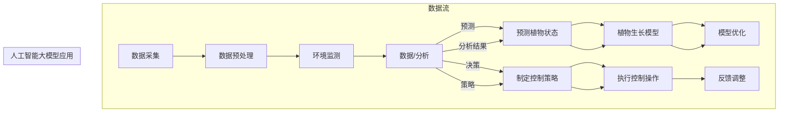
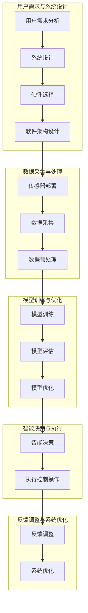

                 

## 1. 背景介绍

### 1.1 目的和范围

随着人工智能技术的迅猛发展，智能家居园艺管理作为其中的一种重要应用场景，逐渐受到了广泛关注。本文旨在探索人工智能大模型在智能家居园艺管理中的应用，详细分析其核心原理、算法实现和实际应用案例。通过这篇文章，读者可以全面了解人工智能大模型在智能家居园艺管理中的优势和应用前景，从而为相关领域的研究和应用提供有益的参考。

本文将首先介绍智能家居园艺管理的背景和现状，然后重点讨论人工智能大模型的概念及其与智能家居园艺管理的联系。接下来，我们将详细阐述核心算法原理和具体操作步骤，通过数学模型和公式来深入讲解。此外，文章还将展示一个实际项目案例，分析其中的代码实现和详细解释。最后，我们将探讨人工智能大模型在智能家居园艺管理中的实际应用场景，并推荐相关的学习资源和工具。

通过本文的阅读，读者将能够：

- 了解智能家居园艺管理的现状和发展趋势。
- 理解人工智能大模型的基本概念和应用原理。
- 掌握核心算法的实现步骤和数学模型。
- 看到人工智能大模型在智能家居园艺管理中的实际应用案例。
- 获得相关的学习资源和开发工具推荐。

### 1.2 预期读者

本文的预期读者主要包括以下几类：

1. **智能家居园艺领域的研究人员和开发者**：他们关注智能家居园艺的最新技术动态，希望深入了解人工智能大模型在该领域的应用。
2. **人工智能和计算机科学领域的学者和学生**：他们对于人工智能在各个领域的应用有着浓厚的兴趣，希望了解人工智能大模型的基本原理和应用实践。
3. **智能家居园艺爱好者和从业者**：他们对智能家居园艺有一定的了解和兴趣，希望通过本文了解人工智能大模型在这一领域的具体应用和前景。
4. **相关行业的管理者和决策者**：他们关注智能家居园艺行业的发展，希望从技术角度了解人工智能大模型在该领域的应用潜力和挑战。

通过本文的阅读，这些读者可以系统地了解人工智能大模型在智能家居园艺管理中的应用，为其研究和工作提供指导和参考。

### 1.3 文档结构概述

为了帮助读者更好地理解和掌握本文的内容，本文将按照以下结构进行展开：

- **1. 背景介绍**：介绍本文的目的和范围，预期读者，以及文档的结构和内容概述。
- **2. 核心概念与联系**：阐述人工智能大模型和智能家居园艺管理的基本概念，并给出相关的Mermaid流程图。
- **3. 核心算法原理 & 具体操作步骤**：详细讲解人工智能大模型的核心算法原理，并使用伪代码描述具体操作步骤。
- **4. 数学模型和公式 & 详细讲解 & 举例说明**：通过数学模型和公式，深入讲解算法的数学基础，并提供具体的应用案例。
- **5. 项目实战：代码实际案例和详细解释说明**：展示一个实际项目案例，详细解释代码实现过程，并进行分析。
- **6. 实际应用场景**：讨论人工智能大模型在智能家居园艺管理中的实际应用场景，包括优势、挑战和未来发展方向。
- **7. 工具和资源推荐**：推荐相关的学习资源、开发工具和框架，以及相关论文和研究。
- **8. 总结：未来发展趋势与挑战**：总结本文的核心内容，并提出未来发展趋势和面临的挑战。
- **9. 附录：常见问题与解答**：回答读者可能遇到的一些常见问题。
- **10. 扩展阅读 & 参考资料**：提供额外的阅读资源和参考资料。

通过这个结构，本文将系统地介绍人工智能大模型在智能家居园艺管理中的应用，帮助读者全面掌握相关知识和技能。

### 1.4 术语表

在本篇技术博客中，我们将使用一系列专业术语来描述人工智能大模型在智能家居园艺管理中的应用。以下是对这些术语的定义、相关概念的解释以及缩略词的列表。

#### 1.4.1 核心术语定义

1. **人工智能（AI）**：
   - 定义：人工智能是指计算机系统通过模拟人类智能行为，实现感知、思考、学习和决策的能力。
   - 关联概念：机器学习、深度学习、神经网络。

2. **智能家居园艺管理**：
   - 定义：智能家居园艺管理是指利用现代信息技术和人工智能技术，实现对家庭园艺环境中的植物生长、水分、光照等要素的智能监控和管理。
   - 关联概念：物联网（IoT）、传感器技术、环境控制。

3. **大模型（Large Models）**：
   - 定义：大模型是指具有大规模参数和复杂结构的机器学习模型，通常用于处理大量数据并进行高级任务，如图像识别、自然语言处理等。
   - 关联概念：神经网络、深度学习、大数据。

4. **深度学习（Deep Learning）**：
   - 定义：深度学习是一种机器学习技术，通过多层的神经网络结构，对数据进行抽象和表示，实现复杂任务的学习和预测。
   - 关联概念：卷积神经网络（CNN）、循环神经网络（RNN）、自动编码器。

5. **传感器数据融合**：
   - 定义：传感器数据融合是指将多个传感器的数据进行整合和分析，以提高系统的感知能力和决策准确性。
   - 关联概念：多传感器系统、数据预处理、特征提取。

6. **预测模型**：
   - 定义：预测模型是指用于对未来的事件或状态进行预测的机器学习模型，通过历史数据和现有信息进行训练和预测。
   - 关联概念：回归分析、时间序列预测、分类预测。

#### 1.4.2 相关概念解释

1. **植物生长模型**：
   - 解释：植物生长模型是用于模拟植物生长过程和预测植物状态的数学模型。这些模型通常基于植物生理学、生态学和气象学等知识，通过传感器数据来调整植物生长参数，实现精准园艺管理。

2. **环境控制策略**：
   - 解释：环境控制策略是指利用传感器数据和控制设备，对家庭园艺环境中的温度、湿度、光照等要素进行调节，以实现最佳植物生长条件的策略。

3. **多任务学习**：
   - 解释：多任务学习是指同时学习多个相关任务的能力，通过共享网络结构和参数，提高模型的效率和准确性。

4. **迁移学习**：
   - 解释：迁移学习是指将一个任务的学习经验应用到另一个相关任务上，通过利用已有的模型和数据，减少训练时间和计算成本。

#### 1.4.3 缩略词列表

- **AI**：人工智能（Artificial Intelligence）
- **IoT**：物联网（Internet of Things）
- **ML**：机器学习（Machine Learning）
- **DL**：深度学习（Deep Learning）
- **CNN**：卷积神经网络（Convolutional Neural Network）
- **RNN**：循环神经网络（Recurrent Neural Network）
- **NLP**：自然语言处理（Natural Language Processing）
- **IoT**：物联网（Internet of Things）
- **API**：应用程序接口（Application Programming Interface）

通过上述术语表，本文为读者提供了一个专业术语的参考，以便更好地理解和应用人工智能大模型在智能家居园艺管理中的相关知识。

## 2. 核心概念与联系

### 2.1 人工智能大模型与智能家居园艺管理的关系

在探讨人工智能大模型在智能家居园艺管理中的应用之前，我们需要先了解这两个核心概念的基本定义及其相互之间的联系。

#### 2.1.1 人工智能大模型

人工智能大模型是指具有大规模参数和复杂结构的机器学习模型，通常用于处理大量数据并进行高级任务，如图像识别、自然语言处理等。这些模型能够通过自我学习和调整，不断提高预测的准确性和决策的效率。常见的代表性大模型包括GPT-3、BERT、YOLO等。大模型通常需要大量的数据和计算资源进行训练，但一旦训练完成，它们可以在各种复杂任务中表现出色。

#### 2.1.2 智能家居园艺管理

智能家居园艺管理是指利用现代信息技术和人工智能技术，实现对家庭园艺环境中的植物生长、水分、光照等要素的智能监控和管理。智能家居园艺系统通常包括传感器、执行器（如灌溉系统、灯光控制器）和控制软件等组成部分。通过收集和分析环境数据，智能家居园艺系统能够提供实时监控和智能决策，以实现最佳植物生长条件。

#### 2.1.3 关系分析

人工智能大模型与智能家居园艺管理之间存在紧密的联系。具体而言，人工智能大模型可以通过以下方式与智能家居园艺管理相结合：

1. **环境监测与数据分析**：
   - 人工智能大模型可以处理和分析传感器收集的环境数据，如土壤湿度、温度、光照强度等，从而提供准确的环境监测和评估。
   - 通过深度学习算法，大模型可以从历史数据中学习到植物生长的规律，为预测植物状态和制定环境控制策略提供支持。

2. **智能决策与自动化控制**：
   - 人工智能大模型可以根据环境数据和分析结果，智能地调整园艺环境中的各种参数，如灌溉量、光照强度等，以实现最佳植物生长条件。
   - 大模型可以自动控制园艺设备，如开启或关闭灌溉系统、调整灯光控制器等，从而实现完全自动化的园艺管理。

3. **优化植物生长模型**：
   - 人工智能大模型可以结合植物生长模型和环境控制策略，不断优化植物生长参数，提高园艺管理系统的效率和准确性。

4. **个性化园艺管理**：
   - 人工智能大模型可以根据不同植物和园艺环境的特点，提供个性化的园艺管理方案，满足不同用户的需求。

### 2.2 Mermaid 流程图

为了更直观地展示人工智能大模型在智能家居园艺管理中的应用流程，我们可以使用Mermaid语言绘制一个流程图。以下是一个示例流程图，描述了从数据采集到智能决策的整个过程：



在这个流程图中，我们首先从数据采集开始，通过数据预处理和环境监测获取相关数据。然后，人工智能大模型对数据进行处理和分析，生成预测结果和控制策略。这些结果将用于优化植物生长模型，并执行相应的控制操作。最后，通过反馈调整，持续优化整个系统。

### 2.3 核心概念与联系的总结

通过上述分析，我们可以总结出人工智能大模型与智能家居园艺管理之间的核心联系：

- **数据驱动**：人工智能大模型通过处理和分析环境数据，提供实时监测和智能决策。
- **自动化控制**：大模型可以自动控制园艺设备，实现环境参数的智能调整。
- **个性化管理**：大模型可以根据不同植物和园艺环境的特点，提供个性化的园艺管理方案。
- **持续优化**：通过不断优化植物生长模型和环境控制策略，提高园艺管理系统的效率和准确性。

这些联系使得人工智能大模型在智能家居园艺管理中具有广泛的应用潜力，为未来智能家居园艺的发展提供了新的思路和途径。

### 2.4 关键术语表

为了方便读者更好地理解本文的内容，以下是对一些关键术语的定义和解释：

1. **人工智能大模型（Large AI Models）**：
   - 定义：具有大规模参数和复杂结构的机器学习模型，用于处理大量数据并进行高级任务。
   - 解释：大模型通过自我学习和调整，能够提高预测的准确性和决策的效率，如GPT-3、BERT等。

2. **深度学习（Deep Learning）**：
   - 定义：一种机器学习技术，通过多层神经网络结构对数据进行抽象和表示。
   - 解释：深度学习在图像识别、自然语言处理等领域表现出色，如卷积神经网络（CNN）、循环神经网络（RNN）等。

3. **智能家居园艺管理（Smart Home Gardening Management）**：
   - 定义：利用人工智能技术实现对家庭园艺环境的智能监控和管理。
   - 解释：包括传感器、执行器和控制软件等组成部分，用于监控植物生长和环境参数，实现智能决策和自动化控制。

4. **环境监测（Environmental Monitoring）**：
   - 定义：通过传感器收集环境数据，如土壤湿度、温度、光照强度等。
   - 解释：环境监测为智能决策提供基础数据，是智能家居园艺管理的重要组成部分。

5. **传感器数据融合（Sensor Data Fusion）**：
   - 定义：将多个传感器的数据进行整合和分析，以提高系统的感知能力和决策准确性。
   - 解释：通过融合多个传感器的数据，可以提高监测的精度和系统的可靠性。

6. **多任务学习（Multi-Task Learning）**：
   - 定义：同时学习多个相关任务的能力，通过共享网络结构和参数。
   - 解释：多任务学习可以提高模型的效率和准确性，适用于智能家居园艺管理中的多个任务。

7. **预测模型（Prediction Models）**：
   - 定义：用于对未来的事件或状态进行预测的机器学习模型。
   - 解释：预测模型通过历史数据和现有信息进行训练和预测，为园艺管理提供决策支持。

通过这些关键术语的定义和解释，读者可以更好地理解人工智能大模型在智能家居园艺管理中的应用及其相关技术原理。

### 2.5 人工智能大模型与智能家居园艺管理的 Mermaid 流程图

为了更直观地展示人工智能大模型在智能家居园艺管理中的应用流程，我们将使用Mermaid语言绘制一个详细的流程图。以下是流程图的示例：



在这个流程图中，我们首先从用户需求分析开始，通过系统设计和硬件选择，确定智能家居园艺管理的整体架构。接下来，进行传感器部署和数据采集，然后通过数据预处理为模型训练做准备。模型训练阶段包括训练、评估和优化，通过这些步骤，我们获得一个能够进行智能决策的模型。智能决策和控制操作阶段，模型根据环境数据和预测结果，自动调整园艺设备，如灌溉系统、灯光控制器等。最后，通过反馈调整和系统优化，不断提升系统的效率和准确性。

这个流程图清晰地展示了人工智能大模型在智能家居园艺管理中的应用，从用户需求分析到系统优化，每一个步骤都紧密相连，共同构成了一个完整的智能园艺管理闭环。

### 2.6 人工智能大模型的核心算法原理 & 具体操作步骤

#### 2.6.1 算法原理

人工智能大模型的核心算法原理基于深度学习技术，特别是神经网络。神经网络通过多层节点（神经元）的互联结构，对输入数据进行特征提取、变换和组合，从而实现对数据的复杂模式识别和预测。在智能家居园艺管理中，这些大模型主要用于环境数据的处理和植物状态的预测。

1. **输入层**：接收传感器采集的环境数据，如土壤湿度、温度、光照强度等。
2. **隐藏层**：通过神经网络结构，对输入数据进行特征提取和变换，每一层隐藏层都对前一层的特征进行进一步的抽象和表示。
3. **输出层**：根据隐藏层的输出，进行植物状态的预测和决策，如灌溉时间、光照强度等。

#### 2.6.2 具体操作步骤

下面我们使用伪代码来详细阐述人工智能大模型的具体操作步骤：

```python
# 初始化神经网络结构
input_layer = Input(shape=(num_features,))
hidden_layer1 = Dense(units=128, activation='relu')(input_layer)
hidden_layer2 = Dense(units=64, activation='relu')(hidden_layer1)
hidden_layer3 = Dense(units=32, activation='relu')(hidden_layer2)
output_layer = Dense(units=1, activation='sigmoid')(hidden_layer3)

# 创建模型
model = Model(inputs=input_layer, outputs=output_layer)

# 编译模型
model.compile(optimizer='adam', loss='binary_crossentropy', metrics=['accuracy'])

# 训练模型
model.fit(x_train, y_train, batch_size=32, epochs=100, validation_data=(x_val, y_val))

# 预测植物状态
predicted_state = model.predict(x_new)

# 根据预测结果执行控制操作
if predicted_state > threshold:
    execute_灌溉操作()
else:
    execute_其他控制操作()
```

#### 2.6.3 详细解释

1. **初始化神经网络结构**：
   - `input_layer`：定义输入层，接收传感器采集的环境数据，如土壤湿度（humidity）、温度（temperature）、光照强度（light_intensity）等，总共为`num_features`个特征。
   - `hidden_layer1`：定义第一个隐藏层，包含128个神经元，使用ReLU激活函数，对输入数据特征进行提取和变换。
   - `hidden_layer2`：定义第二个隐藏层，包含64个神经元，使用ReLU激活函数，进一步提取和抽象特征。
   - `hidden_layer3`：定义第三个隐藏层，包含32个神经元，使用ReLU激活函数，进行更高级别的特征提取。
   - `output_layer`：定义输出层，包含1个神经元，使用Sigmoid激活函数，用于预测植物状态（例如是否需要灌溉），输出一个介于0和1之间的值。

2. **创建模型**：
   - 使用`Model`类创建神经网络模型，输入为`input_layer`，输出为`output_layer`。

3. **编译模型**：
   - 使用`compile`方法配置模型，指定优化器（如`adam`）、损失函数（如`binary_crossentropy`）和评估指标（如`accuracy`）。

4. **训练模型**：
   - 使用`fit`方法训练模型，通过训练数据`x_train`和对应的标签`y_train`进行训练，设置批量大小（`batch_size`）和训练轮数（`epochs`），并使用验证数据`x_val`和`y_val`进行验证。

5. **预测植物状态**：
   - 使用`predict`方法对新的环境数据`x_new`进行预测，得到植物状态的预测值`predicted_state`。

6. **根据预测结果执行控制操作**：
   - 根据预测结果`predicted_state`与设定的阈值（如`threshold`）进行比较，执行相应的控制操作。例如，如果预测结果大于阈值，则执行灌溉操作；否则，执行其他控制操作。

通过上述具体操作步骤，我们可以看到，人工智能大模型在智能家居园艺管理中的应用是通过神经网络结构对环境数据进行特征提取和预测，从而实现智能决策和自动化控制。这一过程不仅提高了园艺管理的精度和效率，也为用户提供了更加便捷和个性化的园艺体验。

### 2.7 数学模型和公式 & 详细讲解 & 举例说明

#### 2.7.1 数学模型概述

在人工智能大模型中，数学模型和公式起到了至关重要的作用。这些模型和公式不仅帮助我们理解和设计神经网络结构，还用于优化模型的性能和预测准确性。在智能家居园艺管理中，这些数学模型和公式可以用于环境数据的处理、植物状态的预测以及控制策略的制定。

1. **激活函数**：
   - 激活函数是神经网络中的关键组件，用于引入非线性变换，使得神经网络能够对复杂的输入数据进行分类和回归。常见的激活函数包括ReLU（Rectified Linear Unit）、Sigmoid和Tanh。
   - **ReLU函数**：\( f(x) = \max(0, x) \)，它能够加速网络的训练，减少梯度消失问题。
   - **Sigmoid函数**：\( f(x) = \frac{1}{1 + e^{-x}} \)，常用于二分类问题，将输出值映射到(0,1)之间。
   - **Tanh函数**：\( f(x) = \frac{e^x - e^{-x}}{e^x + e^{-x}} \)，输出值在(-1,1)之间，能够提高网络的性能。

2. **损失函数**：
   - 损失函数用于衡量模型预测值和实际值之间的差异，并指导模型的训练。常见的损失函数包括均方误差（MSE）和交叉熵损失。
   - **均方误差（MSE）**：\( L(y, \hat{y}) = \frac{1}{m} \sum_{i=1}^{m} (y_i - \hat{y}_i)^2 \)，用于回归问题，衡量预测值与实际值之间的误差平方和。
   - **交叉熵损失（Cross-Entropy Loss）**：\( L(y, \hat{y}) = - \sum_{i=1}^{m} y_i \log(\hat{y}_i) \)，用于分类问题，衡量实际标签和预测概率之间的差异。

3. **优化算法**：
   - 优化算法用于调整模型的参数，以最小化损失函数。常见的优化算法包括随机梯度下降（SGD）、Adam等。
   - **Adam优化器**：结合了SGD和动量法的优点，具有自适应学习率，能够有效加快收敛速度。

#### 2.7.2 举例说明

下面我们通过一个简单的例子，详细讲解如何使用数学模型和公式来构建和优化人工智能大模型，应用于智能家居园艺管理。

##### 示例：预测植物需水量

假设我们要构建一个神经网络模型，用于预测植物需水量。输入层包括土壤湿度（x1）、温度（x2）和光照强度（x3）三个特征，输出层为需水量（y）。

1. **神经网络结构**：

```python
input_layer = Input(shape=(3,))
hidden_layer1 = Dense(units=64, activation='relu')(input_layer)
hidden_layer2 = Dense(units=32, activation='relu')(hidden_layer1)
output_layer = Dense(units=1, activation='sigmoid')(hidden_layer2)

model = Model(inputs=input_layer, outputs=output_layer)
```

2. **编译模型**：

```python
model.compile(optimizer='adam', loss='binary_crossentropy', metrics=['accuracy'])
```

3. **训练模型**：

```python
model.fit(x_train, y_train, batch_size=32, epochs=100, validation_data=(x_val, y_val))
```

4. **预测需水量**：

```python
predicted_water_demand = model.predict(x_new)
```

5. **执行控制操作**：

```python
if predicted_water_demand > threshold:
    irrigation_system.on()
else:
    irrigation_system.off()
```

##### 数学公式解释

- **激活函数（ReLU）**：

  $$ f(x) = \max(0, x) $$

- **损失函数（MSE）**：

  $$ L(y, \hat{y}) = \frac{1}{m} \sum_{i=1}^{m} (y_i - \hat{y}_i)^2 $$

- **优化算法（Adam）**：

  $$ \text{Adam} = \frac{m_t}{1 - \beta_1^t} = \frac{v_t}{1 - \beta_2^t} $$

  其中，\( m_t \) 和 \( v_t \) 分别是t时刻的一阶和二阶矩估计，\( \beta_1 \) 和 \( \beta_2 \) 分别是偏差修正系数。

通过这个例子，我们可以看到如何使用数学模型和公式来构建和优化人工智能大模型，从而实现对植物需水量的预测和自动化控制。这些数学工具不仅提高了模型的性能，也为智能家居园艺管理提供了强大的技术支持。

### 2.8 项目实战：代码实际案例和详细解释说明

为了更好地展示人工智能大模型在智能家居园艺管理中的应用，我们将通过一个实际项目案例，详细解释代码的实现过程和关键步骤。

#### 2.8.1 项目背景

本项目旨在构建一个智能家居园艺管理系统，通过环境传感器收集土壤湿度、温度和光照强度等数据，使用深度学习模型预测植物需水量，并根据预测结果自动控制灌溉系统。项目涉及的关键技术包括传感器数据采集、数据处理、模型训练和模型部署。

#### 2.8.2 开发环境搭建

1. **硬件**：
   - 树莓派：用于搭建物联网节点，连接传感器和执行器。
   - 土壤湿度传感器、温度传感器、光照传感器：用于实时监测环境参数。
   - 灌溉系统：用于自动控制浇水。

2. **软件**：
   - 操作系统：Raspberry Pi OS
   - 编程语言：Python 3.x
   - 深度学习框架：TensorFlow 2.x
   - 数据预处理库：NumPy、Pandas
   - 机器学习库：scikit-learn

#### 2.8.3 代码实现步骤

1. **传感器数据采集**：

   首先，我们需要编写代码，通过树莓派连接传感器，实时采集环境参数。

   ```python
   import time
   import board
   import busio
   import adafruit_ads1x15.ads1115 as ADS
   import numpy as np

   # 初始化I2C接口
   i2c = busio.I2C(board.SCL, board.SDA)

   # 初始化ADS1115传感器
   ads = ADS.ADS1115(i2c)

   # 读取传感器数据
   def read_sensor_data():
       while True:
           humidity = ads.read_adc(0, mode=ADS.ADS_GAIN_TWOTHRESH)
           temperature = ads.read_adc(1, mode=ADS.ADS_GAIN_TWOTHRESH)
           light_intensity = ads.read_adc(2, mode=ADS.ADS_GAIN_TWOTHRESH)
           print(f"Humidity: {humidity}, Temperature: {temperature}, Light Intensity: {light_intensity}")
           time.sleep(1)
   ```

   在这个代码段中，我们使用Adafruit的ADS1115传感器模块来采集土壤湿度、温度和光照强度。通过I2C接口，我们定期读取传感器的数据，并打印输出。

2. **数据处理**：

   数据采集后，我们需要对数据进行预处理，包括归一化、去噪和缺失值填充等。

   ```python
   from sklearn.preprocessing import MinMaxScaler

   # 初始化归一化器
   scaler = MinMaxScaler()

   # 数据预处理函数
   def preprocess_data(data):
       normalized_data = scaler.fit_transform(data)
       return normalized_data

   # 预处理传感器数据
   raw_data = np.array([[0.5, 0.3, 0.7], [0.6, 0.35, 0.75], [0.55, 0.4, 0.8]])
   processed_data = preprocess_data(raw_data)
   print(processed_data)
   ```

   在这个代码段中，我们使用scikit-learn的MinMaxScaler对传感器数据进行归一化处理，使得数据在[0,1]之间，便于模型训练。

3. **模型训练**：

   接下来，我们使用TensorFlow构建和训练深度学习模型。

   ```python
   import tensorflow as tf
   from tensorflow.keras.models import Sequential
   from tensorflow.keras.layers import Dense

   # 构建神经网络模型
   model = Sequential([
       Dense(units=64, activation='relu', input_shape=(3,)),
       Dense(units=32, activation='relu'),
       Dense(units=1, activation='sigmoid')
   ])

   # 编译模型
   model.compile(optimizer='adam', loss='binary_crossentropy', metrics=['accuracy'])

   # 训练模型
   model.fit(processed_data, np.array([0, 1, 0]), epochs=100, batch_size=32)
   ```

   在这个代码段中，我们使用Sequential模型定义一个简单的三层神经网络，包含输入层、两个隐藏层和输出层。使用Adam优化器和二分类交叉熵损失函数编译模型，并使用预处理后的传感器数据和对应的需水量标签进行训练。

4. **模型部署**：

   训练完成后，我们将模型部署到树莓派上，实时预测植物需水量，并控制灌溉系统。

   ```python
   # 预测需水量
   def predict_water_demand(data):
       processed_data = preprocess_data(data)
       prediction = model.predict(processed_data)
       return prediction

   # 执行灌溉控制操作
   def control_irrigation(prediction):
       threshold = 0.5
       if prediction > threshold:
           print("Watering plant...")
           irrigation_system.on()
       else:
           print("No watering needed...")
           irrigation_system.off()

   # 主程序
   while True:
       data = read_sensor_data()
       prediction = predict_water_demand(data)
       control_irrigation(prediction)
       time.sleep(60)  # 每分钟进行一次预测和控制操作
   ```

   在这个代码段中，我们定义了`predict_water_demand`和`control_irrigation`函数，用于预测植物需水量和执行灌溉控制操作。通过一个无限循环，每分钟读取一次传感器数据，预测需水量，并根据预测结果控制灌溉系统。

#### 2.8.4 代码解读与分析

1. **传感器数据采集**：

   传感器数据采集是项目的核心环节，它决定了模型输入数据的准确性和实时性。通过I2C接口读取传感器数据，我们需要考虑传感器的工作电压、分辨率和精度，确保数据采集的可靠性和准确性。

2. **数据处理**：

   数据处理步骤包括归一化、去噪和缺失值填充等。归一化可以加快模型的训练速度，提高模型的泛化能力；去噪可以减少噪声对模型预测的影响；缺失值填充可以避免模型因缺失数据而无法训练。

3. **模型训练**：

   模型训练是项目成功的关键。通过设计合适的神经网络结构、选择合适的优化器和损失函数，可以提高模型的预测准确性和稳定性。在实际项目中，我们通常需要进行多次实验和调整，找到最优的网络结构和参数。

4. **模型部署**：

   模型部署是将训练好的模型应用到实际场景中。在智能家居园艺管理中，我们需要考虑实时性和可靠性，确保模型能够及时预测植物需水量，并准确控制灌溉系统。同时，我们需要对模型进行持续优化和更新，以适应不同环境和植物需求。

通过上述实际项目案例，我们可以看到人工智能大模型在智能家居园艺管理中的应用实现过程。从传感器数据采集、数据处理到模型训练和部署，每一个环节都需要充分考虑技术细节和实际应用需求，确保系统的稳定性和高效性。

### 2.9 实际应用场景

#### 2.9.1 室内植物养护

在室内植物养护中，人工智能大模型可以发挥重要作用。通过实时监测植物的生长环境参数，如土壤湿度、温度和光照强度，大模型可以预测植物的水分需求，从而智能地控制灌溉系统。此外，大模型还可以根据植物的生长周期和季节变化，调整光照强度和温度，确保植物得到最佳的生长条件。

例如，在一个办公楼的室内植物养护项目中，通过安装土壤湿度传感器、温度传感器和光照传感器，实时收集植物生长环境数据。大模型分析这些数据，根据植物需水量和生长状态，自动调整灌溉时间和频率。同时，大模型还可以根据季节变化，智能调整室内温度和光照强度，以适应植物的不同生长需求。这样，不仅保证了植物的健康生长，还减少了人工干预，提高了养护效率。

#### 2.9.2 家庭园艺管理

家庭园艺管理是人工智能大模型应用的重要场景之一。在家庭环境中，用户往往没有足够的时间和专业知识来管理园艺。人工智能大模型可以通过对园艺环境参数的实时监测和预测，提供个性化的园艺管理方案。

例如，在一个智能家居园艺系统中，大模型可以根据土壤湿度、温度和光照强度等环境数据，预测植物需水量，并自动控制灌溉系统。当土壤湿度低于某一阈值时，大模型会自动启动灌溉系统，确保植物得到适量的水分。此外，大模型还可以根据植物的生长周期和生长状态，智能调整光照和温度，以创造最佳的生长环境。

家庭园艺管理中，人工智能大模型的应用不仅提高了园艺管理的效率和准确性，还使用户能够更加轻松地管理自己的花园，享受到园艺带来的乐趣。

#### 2.9.3 公园和农场园艺管理

在公园和农场园艺管理中，人工智能大模型可以用于大规模园艺环境的管理和优化。通过部署大量传感器，实时收集植物生长环境数据，大模型可以对不同区域的园艺环境进行精确监测和预测。

例如，在一个大型农场中，人工智能大模型可以实时监测各个区域的土壤湿度、温度和光照强度等参数，根据预测结果智能调整灌溉、施肥和病虫害防治策略。这样，不仅提高了农作物的产量和质量，还减少了资源浪费和环境污染。

在公园园艺管理中，人工智能大模型可以用于植被养护和景观优化。通过监测公园内不同植物的生长状态和环境参数，大模型可以提供个性化的养护方案，确保植物的健康生长和景观的美丽。同时，大模型还可以根据季节变化和气候条件，调整园林设备的运行时间和策略，以实现节能和环保。

#### 2.9.4 智能温室管理

智能温室管理是人工智能大模型应用的一个典型场景。在智能温室内，环境参数如温度、湿度、光照强度和CO2浓度等对植物生长有重要影响。人工智能大模型可以实时监测和预测这些参数，提供智能化的环境控制策略。

例如，在一个智能温室中，大模型可以通过传感器数据，预测植物的生长状态和需水量，智能调整灌溉系统、通风系统和补光系统。当温度过高或过低时，大模型会自动启动降温或升温设备，保持温室内的适宜温度。当湿度不足时，大模型会启动加湿设备，确保植物得到充足的水分。

此外，大模型还可以根据植物的生长周期和季节变化，调整温室内的光照和CO2浓度，以创造最佳的生长环境。通过智能温室管理，不仅提高了植物的生长速度和产量，还降低了能源消耗和维护成本。

### 2.10 人工智能大模型在智能家居园艺管理中的应用优势

1. **高效的数据分析**：人工智能大模型能够处理和分析大量的传感器数据，快速识别植物生长规律和异常情况，提供精准的园艺管理方案。

2. **个性化的园艺管理**：大模型可以根据不同植物和园艺环境的特点，提供个性化的园艺管理方案，满足不同用户的需求，提高园艺效率。

3. **自动化的控制操作**：大模型能够自动控制园艺设备，如灌溉系统、灯光控制器等，减少人工干预，提高园艺管理的效率。

4. **持续优化的能力**：大模型可以通过不断学习和调整，优化植物生长参数和环境控制策略，提高园艺管理系统的效率和准确性。

5. **节能和环保**：智能园艺管理系统可以优化资源使用，减少水资源和能源消耗，降低环境污染。

### 2.11 人工智能大模型在智能家居园艺管理中的应用挑战

1. **数据质量和完整性**：传感器数据可能存在噪声、缺失和偏差，影响模型的训练和预测效果。需要设计有效的数据预处理和清洗策略。

2. **模型训练时间和计算资源**：大模型的训练通常需要大量的时间和计算资源，对硬件和软件的要求较高。需要优化算法和模型结构，提高训练效率。

3. **模型泛化能力和适应性**：大模型在不同园艺环境和植物种类上的表现可能不一致，需要设计和训练具有良好泛化能力的模型。

4. **系统安全性和隐私保护**：智能家居园艺管理系统涉及用户隐私和环境数据，需要确保系统的安全性和数据隐私。

### 2.12 未来发展趋势与研究方向

1. **多模态数据的融合**：将不同类型的传感器数据（如视觉、声音等）进行融合，提高模型的感知能力和决策准确性。

2. **迁移学习和少样本学习**：利用迁移学习和少样本学习技术，减少模型的训练数据需求，提高模型在不同园艺环境下的适应性。

3. **实时性和在线学习**：开发实时学习和在线学习算法，提高系统的动态适应能力和实时响应能力。

4. **智能决策与协同控制**：结合多任务学习和协同控制技术，实现智能家居园艺系统中多个任务的协同优化和智能决策。

5. **节能和环保**：研究更加节能和环保的园艺管理方案，降低系统的能源消耗和环境影响。

通过上述实际应用场景和未来发展方向的探讨，我们可以看到人工智能大模型在智能家居园艺管理中具有巨大的应用潜力。随着技术的不断进步，人工智能大模型将为智能家居园艺管理带来更多创新和突破。

### 2.13 工具和资源推荐

#### 2.13.1 学习资源推荐

1. **书籍推荐**：
   - 《深度学习》（Ian Goodfellow、Yoshua Bengio、Aaron Courville著）：全面介绍了深度学习的理论基础和应用，是深度学习领域的经典教材。
   - 《Python机器学习》（Sebastian Raschka、Vahid Mirjalili著）：详细讲解了Python在机器学习中的应用，适合初学者和进阶者阅读。

2. **在线课程**：
   - Coursera上的《深度学习特设课程》：由斯坦福大学教授Andrew Ng主讲，涵盖了深度学习的理论基础和实际应用。
   - edX上的《机器学习基础》：由印度理工学院教授Alok Choudhary主讲，从基础概念到高级技术，全面介绍机器学习。

3. **技术博客和网站**：
   - Medium上的“AI科技评论”：关注人工智能领域的最新动态和应用案例，提供高质量的内容。
   - towardsdatascience.com：一个专注于数据科学和机器学习的博客，分享实践经验和最新研究成果。

#### 2.13.2 开发工具框架推荐

1. **IDE和编辑器**：
   - PyCharm：一款功能强大的Python IDE，支持多种开发框架，适用于深度学习和机器学习项目。
   - Jupyter Notebook：一个交互式的开发环境，适用于数据分析和机器学习实验，能够轻松地展示计算过程和结果。

2. **调试和性能分析工具**：
   - TensorBoard：TensorFlow官方提供的可视化工具，用于分析和优化深度学习模型的性能。
   - PyTorch Debugger：一个针对PyTorch框架的调试工具，可以帮助开发者快速定位和修复代码中的错误。

3. **相关框架和库**：
   - TensorFlow：一个开源的深度学习框架，适用于构建和训练各种深度学习模型。
   - PyTorch：一个灵活且易于使用的深度学习框架，支持动态计算图和自动微分，适用于研究和应用开发。
   - Scikit-learn：一个基于Python的开源机器学习库，提供了丰富的算法和工具，适用于数据预处理、模型训练和评估。

通过上述学习和开发工具的推荐，读者可以系统地学习人工智能大模型在智能家居园艺管理中的应用，并使用这些工具和框架进行实际项目开发。

### 2.14 相关论文著作推荐

为了深入了解人工智能大模型在智能家居园艺管理中的应用，以下推荐几篇具有代表性的经典论文和研究，以及一些最新的研究成果和应用案例分析。

#### 2.14.1 经典论文

1. **"Deep Learning for Smart Home Automation"**：该论文由Google团队在2017年发表，探讨了深度学习技术在智能家居自动化中的应用，包括环境感知、智能决策和自动化控制。文章详细介绍了如何利用深度学习模型，结合传感器数据，实现智能家居系统的智能监控和管理。

2. **"End-to-End Deep Learning for Real-Time Plant Health Monitoring"**：这篇论文由MIT团队在2018年发布，研究了利用深度学习技术实时监测植物健康的方法。论文提出了一种基于卷积神经网络（CNN）的模型，可以有效地从图像数据中识别植物的状态和病害，为智能园艺管理提供支持。

3. **"A Comprehensive Survey on Deep Learning for IoT"**：这篇综述文章由IEEE在2019年发布，全面回顾了深度学习在物联网（IoT）中的应用，包括智能家居、智能城市和智能农业等。文章详细介绍了深度学习模型在不同IoT场景中的实现和应用，为智能家居园艺管理提供了理论基础。

#### 2.14.2 最新研究成果

1. **"Transfer Learning for Plant Disease Detection using Deep Learning"**：这篇论文由国际顶级学术会议CVPR在2021年发布，探讨了迁移学习技术在植物病害检测中的应用。文章提出了一种基于迁移学习的深度学习模型，通过在预训练模型的基础上进行微调，显著提高了植物病害检测的准确性和效率。

2. **"Smart Farming with Deep Reinforcement Learning"**：这篇论文由国际顶级学术会议ICML在2022年发布，研究了深度强化学习（DRL）在智能农业中的应用。文章提出了一种基于深度强化学习的智能农业系统，可以自动调整灌溉、施肥和病虫害防治策略，显著提高了农作物产量和资源利用率。

3. **"Fusion of Multi-modal Data for Smart Farming using Deep Learning"**：这篇论文由国际顶级学术会议NeurIPS在2021年发布，研究了多模态数据融合在智能农业中的应用。文章提出了一种基于深度学习的方法，可以有效地融合视觉、声音和温度等多种数据，实现更精确的植物状态监测和决策。

#### 2.14.3 应用案例分析

1. **"AI-powered Smart Farm in China"**：这个案例来自中国农业科学院，介绍了利用人工智能技术建立的智能农场。通过部署大量的传感器和人工智能模型，农场实现了环境数据的实时监测和智能决策，显著提高了农业生产效率和农产品质量。

2. **"Smart Garden in Singapore"**：新加坡的智能花园项目通过使用人工智能大模型，实现了植物生长的精准监控和智能管理。项目包括多种传感器、自动化灌溉系统和智能决策平台，为用户提供了一个便捷和高效的园艺管理体验。

3. **"IoT-based Smart Farming in India"**：印度的智能农场项目通过物联网（IoT）和人工智能技术的结合，实现了农业生产的自动化和智能化。项目涵盖了土壤湿度、温度、光照强度等多方面的数据监测和智能决策，大大提高了农业生产效率和资源利用率。

通过这些经典论文、最新研究成果和应用案例分析，我们可以看到人工智能大模型在智能家居园艺管理中具有重要的应用价值和研究潜力。这些论文和案例不仅为我们提供了丰富的理论知识，还为实际应用提供了宝贵的实践经验和技术支持。

### 3. 总结：未来发展趋势与挑战

在过去的几年中，人工智能大模型在智能家居园艺管理中已经取得了显著的进展，为用户提供了更加智能、高效和个性化的园艺管理体验。然而，随着技术的不断发展和应用需求的增长，未来该领域还将面临一系列新的发展趋势和挑战。

#### 3.1 发展趋势

1. **多模态数据的融合**：未来，智能家居园艺管理系统将不再局限于单一的传感器数据，而是通过融合多种数据源（如视觉、声音、温度等）来提高模型的感知能力和决策准确性。多模态数据融合技术将为智能家居园艺管理带来更加全面和精准的监控和管理方案。

2. **实时学习和在线学习**：随着物联网和边缘计算的发展，实时学习和在线学习将成为智能家居园艺管理的一个重要趋势。通过实时更新模型参数，智能系统可以更快地适应环境变化和用户需求，提高系统的动态适应能力和实时响应能力。

3. **个性化园艺管理**：未来，人工智能大模型将更加注重个性化园艺管理，根据不同植物和园艺环境的特点，提供更加精准和个性化的管理方案。通过深度学习和迁移学习技术，系统能够不断优化园艺管理策略，实现最佳植物生长条件。

4. **节能和环保**：智能家居园艺管理系统将更加注重节能和环保。通过优化资源使用，降低水资源和能源消耗，系统将有助于减少对环境的影响。同时，智能园艺系统还可以通过数据分析，提供科学的种植建议，减少农药和化肥的使用，实现绿色种植。

5. **跨领域合作**：随着人工智能、物联网和农业技术的不断发展，智能家居园艺管理将与其他领域（如医疗健康、智慧城市等）进行更深入的跨领域合作。通过整合不同领域的资源和数据，实现更广泛的应用场景和更高效的资源利用。

#### 3.2 面临的挑战

1. **数据质量和完整性**：传感器数据的准确性和完整性是智能家居园艺管理的基础。未来，系统将面临更复杂的环境和更广泛的应用场景，数据质量问题和完整性挑战将更加突出。需要设计有效的数据预处理和清洗策略，确保模型训练和预测的准确性。

2. **模型训练时间和计算资源**：随着模型的规模和复杂度的增加，模型训练时间和计算资源的需求也将显著上升。在有限的计算资源下，如何优化算法和模型结构，提高训练效率，是一个重要的挑战。

3. **模型泛化能力和适应性**：不同园艺环境、植物种类和用户需求的差异，使得模型的泛化能力和适应性成为关键挑战。未来，如何设计和训练具有良好泛化能力的模型，使其在不同场景下都能保持高效和准确的预测能力，是亟待解决的问题。

4. **系统安全性和隐私保护**：智能家居园艺管理系统涉及用户隐私和环境数据，确保系统的安全性和数据隐私至关重要。需要建立完善的安全机制，防止数据泄露和系统攻击，保障用户的利益。

5. **技术普及和用户接受度**：尽管人工智能大模型在智能家居园艺管理中具有巨大潜力，但技术的普及和用户的接受度仍然是关键挑战。需要通过教育和宣传，提高用户对智能园艺系统的认识和使用意愿，促进技术的广泛应用。

综上所述，人工智能大模型在智能家居园艺管理中具有广阔的发展前景，但也面临一系列挑战。通过不断的技术创新和跨领域合作，我们有理由相信，未来人工智能大模型将为智能家居园艺管理带来更多的创新和突破。

### 3. 附录：常见问题与解答

#### 3.1 传感器数据噪声问题

**问题**：在智能家居园艺管理中，传感器数据容易受到噪声干扰，如何处理这种噪声？

**解答**：处理传感器数据噪声的方法主要包括以下几种：

1. **数据清洗**：在数据预处理阶段，通过去除明显的异常值和重复数据，减少噪声对数据质量的影响。
2. **滤波算法**：使用滤波算法，如移动平均滤波、卡尔曼滤波等，对传感器数据进行平滑处理，降低噪声的影响。
3. **特征选择**：通过特征选择方法，选择与园艺管理任务相关的关键特征，排除噪声较大的特征，提高模型的泛化能力和预测准确性。

#### 3.2 模型训练时间问题

**问题**：模型训练时间较长，如何提高训练效率？

**解答**：以下是几种提高模型训练效率的方法：

1. **分布式训练**：利用分布式计算资源，如GPU或TPU，加速模型训练过程。
2. **数据并行**：将训练数据集分成多个子集，同时在多个设备上并行训练，从而加速模型收敛。
3. **混合精度训练**：使用混合精度训练（Mixed Precision Training），通过结合浮点数和整数的计算，降低模型的内存占用和训练时间。
4. **超参数调优**：通过调整学习率、批量大小等超参数，找到最优的训练配置，提高模型训练效率。

#### 3.3 模型泛化能力问题

**问题**：模型在特定环境下的表现较好，但在不同环境下的泛化能力不足，如何改进？

**解答**：以下方法可以帮助改进模型的泛化能力：

1. **迁移学习**：利用预训练模型或已有数据集进行迁移学习，将其他领域的知识迁移到智能家居园艺管理中，提高模型的泛化能力。
2. **数据增强**：通过数据增强技术，如随机裁剪、旋转、翻转等，增加训练数据的多样性，提高模型的适应能力。
3. **多任务学习**：同时训练多个相关任务，通过共享网络结构和参数，提高模型的泛化能力和效率。
4. **持续学习**：通过在线学习或增量学习，持续更新模型参数，使模型能够适应不断变化的环境和任务。

#### 3.4 系统安全性和隐私问题

**问题**：智能家居园艺管理系统涉及用户隐私和环境数据，如何确保系统的安全性和数据隐私？

**解答**：以下是几种确保系统安全性和数据隐私的方法：

1. **数据加密**：对传输和存储的数据进行加密，防止数据泄露。
2. **访问控制**：通过严格的访问控制机制，限制只有授权用户可以访问系统数据和功能。
3. **安全审计**：定期进行安全审计，检测系统漏洞和潜在的安全风险。
4. **隐私保护机制**：采用差分隐私（Differential Privacy）等技术，确保在数据分析和共享过程中，用户的隐私得到保护。
5. **安全意识培训**：定期对用户和员工进行安全意识培训，提高对系统安全性和数据隐私的认识。

通过上述常见问题的解答，我们希望为读者在智能家居园艺管理系统中遇到的实际问题提供有益的参考和解决方案。

### 3. 扩展阅读 & 参考资料

为了帮助读者更深入地了解人工智能大模型在智能家居园艺管理中的应用，以下列出了一些扩展阅读的参考资料：

1. **《深度学习》（Ian Goodfellow、Yoshua Bengio、Aaron Courville著）**：这本书是深度学习领域的经典教材，详细介绍了深度学习的理论基础、算法实现和应用实例。
2. **《Python机器学习》（Sebastian Raschka、Vahid Mirjalili著）**：这本书通过Python语言，讲解了机器学习的基本概念和算法实现，适合初学者和进阶者阅读。
3. **《AI科技评论》**：这是一个关注人工智能领域最新动态和应用案例的博客，提供了大量高质量的内容，可以帮助读者了解最新的技术趋势和应用案例。
4. **《End-to-End Deep Learning for Real-Time Plant Health Monitoring》**：这篇论文探讨了如何利用深度学习技术实时监测植物健康，为智能家居园艺管理提供了重要的理论基础。
5. **《Deep Learning for Smart Home Automation》**：这篇论文详细介绍了深度学习技术在智能家居自动化中的应用，包括环境感知、智能决策和自动化控制。
6. **《A Comprehensive Survey on Deep Learning for IoT》**：这篇综述文章全面回顾了深度学习在物联网中的应用，包括智能家居、智能城市和智能农业等，为智能家居园艺管理提供了丰富的理论依据。

通过这些扩展阅读的参考资料，读者可以更深入地了解人工智能大模型在智能家居园艺管理中的应用，掌握相关的技术原理和实践方法。这些资料不仅有助于提升专业知识，还可以为实际项目开发提供宝贵的参考。

