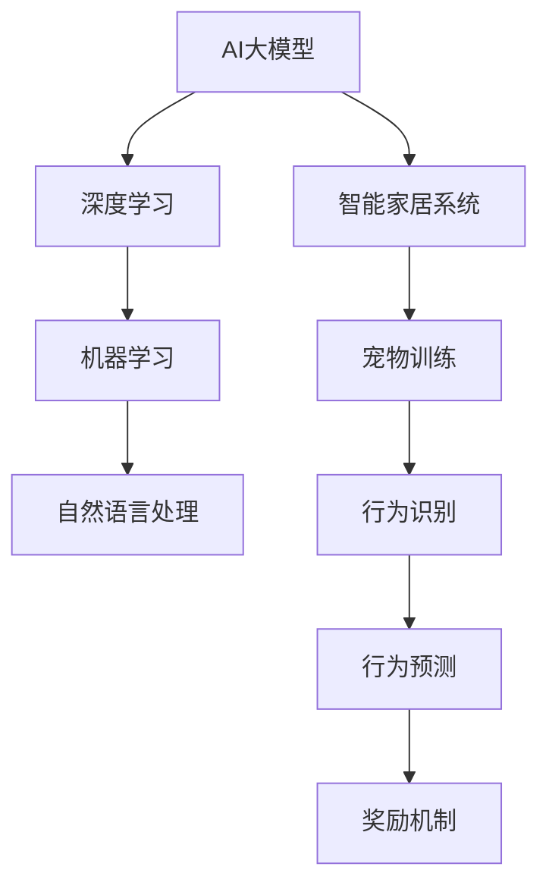

                 

# 探索AI大模型在智能家居宠物训练的应用

> **关键词：** AI大模型、智能家居、宠物训练、自然语言处理、机器学习、深度学习

> **摘要：** 本文将探讨人工智能大模型在智能家居宠物训练领域的应用。通过分析核心概念、算法原理、数学模型以及实际案例，揭示AI大模型如何实现高效、智能的宠物训练。本文旨在为读者提供全面的技术解读，助力智能家居宠物训练的发展。

## 1. 背景介绍

### 1.1 目的和范围

本文旨在深入探讨人工智能大模型在智能家居宠物训练中的应用。随着人工智能技术的迅猛发展，AI大模型已经逐渐成为许多领域的技术核心。智能家居作为一个新兴市场，对AI大模型的应用需求日益增长。本文将重点分析以下内容：

1. AI大模型的基本概念及其在智能家居宠物训练中的应用场景。
2. 核心算法原理和具体操作步骤。
3. 数学模型和公式的详细讲解。
4. 项目实战中的代码实际案例和解释。
5. AI大模型在智能家居宠物训练中的实际应用场景。
6. 相关工具和资源的推荐。

### 1.2 预期读者

本文主要面向以下读者群体：

1. 智能家居领域的研发人员。
2. 兽医和宠物护理专家。
3. 对AI大模型和智能家居宠物训练感兴趣的技术爱好者。
4. AI领域的学者和研究人员。

### 1.3 文档结构概述

本文分为以下几个部分：

1. 背景介绍：介绍本文的目的、范围、预期读者以及文档结构。
2. 核心概念与联系：分析核心概念、原理和架构，并使用Mermaid流程图展示。
3. 核心算法原理 & 具体操作步骤：讲解核心算法原理，使用伪代码详细阐述。
4. 数学模型和公式 & 详细讲解 & 举例说明：解释数学模型和公式，并给出实例。
5. 项目实战：代码实际案例和详细解释说明。
6. 实际应用场景：讨论AI大模型在智能家居宠物训练中的实际应用场景。
7. 工具和资源推荐：推荐学习资源、开发工具框架和相关论文著作。
8. 总结：未来发展趋势与挑战。
9. 附录：常见问题与解答。
10. 扩展阅读 & 参考资料：提供进一步阅读的资料。

### 1.4 术语表

#### 1.4.1 核心术语定义

- **AI大模型（AI Large Model）**：指具有巨大参数规模和复杂结构的深度学习模型。
- **智能家居（Smart Home）**：利用物联网技术实现家庭设备和系统的自动化管理和智能控制。
- **宠物训练（Pet Training）**：通过科学的方法和工具对宠物进行行为训练和纠正。

#### 1.4.2 相关概念解释

- **自然语言处理（Natural Language Processing, NLP）**：使计算机能够理解、解释和生成人类语言的技术。
- **机器学习（Machine Learning, ML）**：让计算机从数据中学习规律和模式，从而做出预测和决策。
- **深度学习（Deep Learning, DL）**：一种基于多层神经网络的机器学习技术。

#### 1.4.3 缩略词列表

- **AI**：人工智能
- **NLP**：自然语言处理
- **ML**：机器学习
- **DL**：深度学习
- **IoT**：物联网

## 2. 核心概念与联系

在探索AI大模型在智能家居宠物训练中的应用之前，我们首先需要理解一些核心概念及其相互关系。以下是一个简单的Mermaid流程图，展示这些核心概念、原理和架构。



### 2.1 AI大模型

AI大模型是一种具有巨大参数规模和复杂结构的深度学习模型。这些模型通常通过大量数据训练，具有强大的特征提取和模式识别能力。在智能家居宠物训练中，AI大模型可以用于分析宠物行为、预测行为、生成训练数据等。

### 2.2 深度学习

深度学习是一种基于多层神经网络的机器学习技术。在深度学习中，神经网络通过多层的非线性变换，将输入数据映射到输出。深度学习在图像识别、语音识别、自然语言处理等领域取得了显著成果。

### 2.3 机器学习

机器学习是一种让计算机从数据中学习规律和模式，从而做出预测和决策的技术。机器学习包括监督学习、无监督学习和强化学习。监督学习适用于有标签的数据集，无监督学习适用于无标签的数据集，强化学习适用于交互式环境。

### 2.4 自然语言处理

自然语言处理是一种使计算机能够理解、解释和生成人类语言的技术。NLP广泛应用于文本分类、机器翻译、情感分析等领域。在智能家居宠物训练中，NLP可以用于处理宠物主人与宠物的交互数据，例如语音命令、文本信息等。

### 2.5 智能家居系统

智能家居系统是一种利用物联网技术实现家庭设备和系统的自动化管理和智能控制的技术。智能家居系统包括智能门锁、智能灯光、智能空调、智能宠物监控等。AI大模型可以通过这些系统收集宠物行为数据，进行实时分析。

### 2.6 宠物训练

宠物训练是通过科学的方法和工具对宠物进行行为训练和纠正。AI大模型可以通过分析宠物行为数据，识别宠物的行为模式，生成个性化的训练计划。

### 2.7 行为识别、行为预测和奖励机制

在宠物训练过程中，行为识别、行为预测和奖励机制是三个关键环节。行为识别是指通过AI大模型识别宠物的行为；行为预测是指根据宠物的历史行为数据预测未来的行为；奖励机制是指根据宠物行为的优劣给予相应的奖励或惩罚。

## 3. 核心算法原理 & 具体操作步骤

在理解了AI大模型、深度学习、机器学习、自然语言处理、智能家居系统以及宠物训练等核心概念后，我们将进一步探讨核心算法原理和具体操作步骤。以下是一个简单的伪代码，用于阐述这些步骤。

```python
# 伪代码：AI大模型在智能家居宠物训练中的应用

# 3.1 数据收集
data = collect_data(smart_home_system, pet)

# 3.2 数据预处理
processed_data = preprocess_data(data)

# 3.3 训练AI大模型
model = train_large_model(processed_data)

# 3.4 行为识别
behaviors = model.predict behaviors(processed_data)

# 3.5 行为预测
predictions = model.predict behaviors(processed_data)

# 3.6 奖励机制
reward = apply_reward Mechanism(behaviors, predictions)
```

### 3.1 数据收集

数据收集是AI大模型在智能家居宠物训练中的第一步。通过智能家居系统，我们可以收集到宠物的行为数据，例如运动轨迹、饮食、作息时间等。此外，还可以收集宠物主人与宠物的交互数据，例如语音命令、文本信息等。

### 3.2 数据预处理

数据预处理是确保数据质量和模型性能的重要步骤。在这一步骤中，我们需要对数据进行清洗、去噪、归一化等处理。例如，对于运动轨迹数据，我们可以使用K-means聚类方法将连续的运动轨迹转换为离散的行为事件。

### 3.3 训练AI大模型

训练AI大模型是核心步骤之一。在这一步骤中，我们使用预处理后的数据训练深度学习模型。通常，我们选择具有巨大参数规模和复杂结构的模型，例如Transformer、BERT等。在训练过程中，我们通过反向传播算法和优化算法调整模型参数，以最小化损失函数。

### 3.4 行为识别

行为识别是指使用训练好的AI大模型识别宠物的行为。在这一步骤中，我们将预处理后的数据输入模型，模型输出宠物的行为类别。例如，如果宠物正在进食，模型将输出“进食”类别。

### 3.5 行为预测

行为预测是指根据宠物的历史行为数据预测未来的行为。在这一步骤中，我们使用训练好的AI大模型对未来的行为进行预测。例如，如果宠物最近一周都在晚上8点进食，模型可能会预测明天晚上8点宠物会进食。

### 3.6 奖励机制

奖励机制是指根据宠物行为的优劣给予相应的奖励或惩罚。在这一步骤中，我们使用AI大模型分析宠物的行为数据，并根据行为的预测结果调整宠物的训练计划。例如，如果宠物行为表现良好，我们可以给予宠物零食作为奖励；如果宠物行为不良，我们可以调整宠物的作息时间，以纠正不良行为。

## 4. 数学模型和公式 & 详细讲解 & 举例说明

在AI大模型中，数学模型和公式起着至关重要的作用。以下是一些常见的数学模型和公式，我们将对其进行详细讲解并给出实例。

### 4.1 损失函数

损失函数是深度学习模型训练的核心部分。损失函数用于评估模型预测结果与实际结果之间的差距。一个常见的损失函数是交叉熵损失函数（Cross-Entropy Loss），其公式如下：

$$
L = -\sum_{i=1}^{n} y_i \log(p_i)
$$

其中，$y_i$是实际标签，$p_i$是模型预测的概率。交叉熵损失函数的目的是最小化预测概率与实际概率之间的差距。

### 4.2 反向传播算法

反向传播算法是深度学习模型训练的基本算法。它通过计算梯度来调整模型参数，以最小化损失函数。反向传播算法的基本步骤如下：

1. **前向传播**：将输入数据输入模型，计算模型的输出。
2. **计算损失**：计算模型输出与实际结果之间的差距。
3. **计算梯度**：根据损失函数的导数计算模型参数的梯度。
4. **更新参数**：根据梯度调整模型参数，以最小化损失函数。

以下是一个简化的反向传播算法伪代码：

```python
# 伪代码：反向传播算法

# 4.1 前向传播
outputs = forward_propagation(inputs, model)

# 4.2 计算损失
loss = compute_loss(outputs, targets)

# 4.3 计算梯度
gradients = backward_propagation(outputs, targets, model)

# 4.4 更新参数
update_parameters(model, gradients)
```

### 4.3 优化算法

优化算法用于调整模型参数，以最小化损失函数。常见的优化算法有梯度下降（Gradient Descent）、随机梯度下降（Stochastic Gradient Descent, SGD）和Adam优化器。以下是一个简化的梯度下降算法伪代码：

```python
# 伪代码：梯度下降算法

# 4.1 初始化参数
parameters = initialize_parameters()

# 4.2 循环迭代
for epoch in range(num_epochs):
    # 4.2.1 前向传播
    outputs = forward_propagation(inputs, parameters)

    # 4.2.2 计算损失
    loss = compute_loss(outputs, targets)

    # 4.2.3 计算梯度
    gradients = backward_propagation(outputs, targets, parameters)

    # 4.2.4 更新参数
    parameters = update_parameters(parameters, gradients, learning_rate)
```

### 4.4 举例说明

假设我们有一个简单的线性回归模型，用于预测宠物的行为。我们使用梯度下降算法训练模型，并计算损失函数。以下是一个简化的示例：

```python
# 示例：线性回归模型训练

# 4.4.1 初始化参数
w = 0.0
b = 0.0

# 4.4.2 学习率
learning_rate = 0.01

# 4.4.3 循环迭代
for epoch in range(num_epochs):
    # 4.4.3.1 前向传播
    y_pred = w * x + b

    # 4.4.3.2 计算损失
    loss = (y - y_pred) ** 2

    # 4.4.3.3 计算梯度
    dw = 2 * (y - y_pred) * x
    db = 2 * (y - y_pred)

    # 4.4.3.4 更新参数
    w = w - learning_rate * dw
    b = b - learning_rate * db

print("训练完成，模型参数为：w =", w, "b =", b)
```

在这个示例中，我们使用梯度下降算法训练了一个线性回归模型。通过多次迭代，模型参数（$w$和$b$）不断更新，以最小化损失函数。最终，我们得到了训练完成的模型参数。

## 5. 项目实战：代码实际案例和详细解释说明

在本节中，我们将通过一个实际项目案例，展示AI大模型在智能家居宠物训练中的代码实现。这个案例将包括开发环境的搭建、源代码的详细实现和解读。

### 5.1 开发环境搭建

为了实现AI大模型在智能家居宠物训练中的应用，我们需要搭建一个合适的技术栈。以下是推荐的开发环境和工具：

1. **编程语言**：Python
2. **深度学习框架**：TensorFlow或PyTorch
3. **数据分析库**：Pandas、NumPy
4. **可视化库**：Matplotlib、Seaborn
5. **版本控制**：Git
6. **集成开发环境**：Visual Studio Code

在安装这些工具和库之前，请确保您的操作系统安装了Python和pip（Python的包管理器）。您可以通过以下命令安装所需的库：

```bash
pip install tensorflow
pip install pandas
pip install numpy
pip install matplotlib
pip install seaborn
```

### 5.2 源代码详细实现和代码解读

以下是一个简单的Python代码示例，展示AI大模型在智能家居宠物训练中的实现。这个示例将使用TensorFlow框架构建一个基于卷积神经网络（CNN）的宠物行为识别模型。

```python
import tensorflow as tf
from tensorflow.keras import layers
import numpy as np
import pandas as pd

# 5.2.1 数据准备
# 假设我们有一个包含宠物行为图像的CSV文件，每个图像对应一个行为标签
data = pd.read_csv('pet_data.csv')

# 分割数据集为训练集和测试集
train_data, test_data = train_test_split(data, test_size=0.2)

# 预处理数据
def preprocess_data(data):
    # 数据归一化
    data['image'] = data['image'].apply(lambda x: x / 255.0)
    return data

train_data = preprocess_data(train_data)
test_data = preprocess_data(test_data)

# 5.2.2 构建模型
model = tf.keras.Sequential([
    layers.Conv2D(32, (3, 3), activation='relu', input_shape=(64, 64, 3)),
    layers.MaxPooling2D((2, 2)),
    layers.Conv2D(64, (3, 3), activation='relu'),
    layers.MaxPooling2D((2, 2)),
    layers.Conv2D(128, (3, 3), activation='relu'),
    layers.MaxPooling2D((2, 2)),
    layers.Flatten(),
    layers.Dense(128, activation='relu'),
    layers.Dense(10, activation='softmax')
])

# 编译模型
model.compile(optimizer='adam',
              loss='sparse_categorical_crossentropy',
              metrics=['accuracy'])

# 5.2.3 训练模型
model.fit(train_data['image'], train_data['label'], epochs=10, validation_split=0.2)

# 5.2.4 评估模型
test_loss, test_acc = model.evaluate(test_data['image'], test_data['label'])
print('Test accuracy:', test_acc)

# 5.2.5 使用模型进行预测
predictions = model.predict(test_data['image'])
predicted_labels = np.argmax(predictions, axis=1)

# 输出预测结果
for i in range(len(predicted_labels)):
    print('Image', i, 'predicted as:', predicted_labels[i])
```

在这个示例中，我们首先读取包含宠物行为图像的CSV文件，然后对数据进行预处理。接下来，我们使用TensorFlow构建一个基于卷积神经网络（CNN）的宠物行为识别模型。模型包括多个卷积层、池化层和全连接层。我们使用Adam优化器和sparse categorical cross-entropy损失函数进行模型编译。

在训练模型时，我们使用训练集进行训练，并使用验证集进行验证。训练完成后，我们使用测试集评估模型的性能，并输出测试准确率。

最后，我们使用训练好的模型对测试集进行预测，并输出预测结果。

### 5.3 代码解读与分析

1. **数据准备**：我们首先读取包含宠物行为图像的CSV文件。CSV文件中包含图像数据和对应的标签。我们使用`read_csv`函数读取CSV文件，并使用`train_test_split`函数将数据集分为训练集和测试集。

2. **数据预处理**：我们对数据进行归一化处理，将图像数据除以255，使其在0到1之间。这样可以加速模型训练并提高模型性能。

3. **构建模型**：我们使用TensorFlow的`Sequential`模型构建一个简单的卷积神经网络。模型包括多个卷积层、池化层和全连接层。我们使用ReLU激活函数和softmax激活函数，以实现非线性变换和分类。

4. **编译模型**：我们使用Adam优化器和sparse categorical cross-entropy损失函数编译模型。Adam优化器是一种自适应的学习率优化算法，可以提高模型训练效率。sparse categorical cross-entropy损失函数适用于标签为整数的分类问题。

5. **训练模型**：我们使用训练集进行模型训练，并使用验证集进行验证。在训练过程中，模型不断调整参数，以最小化损失函数。

6. **评估模型**：我们使用测试集评估模型的性能。测试准确率是衡量模型性能的重要指标。

7. **使用模型进行预测**：我们使用训练好的模型对测试集进行预测。预测结果通过输出预测标签和实际标签的匹配度来评估。

通过这个示例，我们可以看到AI大模型在智能家居宠物训练中的基本实现。在实际应用中，我们可以根据具体需求扩展和优化模型，以提高模型性能。

## 6. 实际应用场景

AI大模型在智能家居宠物训练中具有广泛的应用场景。以下是一些典型的应用场景：

### 6.1 宠物行为监测

通过AI大模型，我们可以实时监测宠物的行为，例如运动、休息、进食等。这有助于宠物主人了解宠物的健康状况，及时发现潜在的健康问题。例如，通过分析宠物的运动轨迹，我们可以判断宠物是否过度运动或运动不足。

### 6.2 宠物训练指导

AI大模型可以根据宠物的行为数据生成个性化的训练计划。例如，通过分析宠物的行为模式，我们可以判断宠物的习惯是否良好，并根据宠物的需求调整训练计划。这有助于宠物主人更有效地训练宠物，提高宠物的生活质量。

### 6.3 宠物社交互动

AI大模型可以分析宠物之间的互动行为，帮助宠物主人更好地了解宠物的社交需求。例如，通过分析宠物的行为数据，我们可以判断宠物是否喜欢与其他宠物互动，是否需要更多的社交活动。这有助于宠物主人为宠物提供更好的社交环境。

### 6.4 宠物健康管理

AI大模型可以用于宠物的健康管理，例如监测宠物的体温、心率等生理指标。通过分析这些数据，我们可以判断宠物的健康状况，并提供针对性的健康建议。例如，如果宠物的体温异常，我们可以提醒宠物主人进行医疗检查。

### 6.5 智能宠物玩具设计

AI大模型可以用于智能宠物玩具的设计。通过分析宠物的行为数据，我们可以设计出适合不同宠物的玩具，以提高宠物的兴趣和参与度。例如，对于喜欢追逐运动的宠物，我们可以设计一个会动的玩具，吸引宠物追逐。

### 6.6 宠物医疗辅助诊断

AI大模型可以用于宠物医疗辅助诊断。通过分析宠物的影像数据和临床数据，我们可以辅助医生进行诊断，提高诊断准确率。例如，通过分析宠物的X光片，我们可以判断宠物是否存在骨折等问题。

通过以上应用场景，我们可以看到AI大模型在智能家居宠物训练中的广泛应用。随着人工智能技术的不断发展，AI大模型在智能家居宠物训练中的应用前景将更加广阔。

## 7. 工具和资源推荐

为了更好地学习和应用AI大模型在智能家居宠物训练中的技术，以下是一些推荐的工具和资源：

### 7.1 学习资源推荐

#### 7.1.1 书籍推荐

1. **《深度学习》（Goodfellow, I., Bengio, Y., & Courville, A.）**：这是一本经典的深度学习教材，涵盖了深度学习的理论基础和实践技巧。
2. **《自然语言处理综合教程》（Mikolov, T., Le, Q., & Sutskever, I.）**：这本书详细介绍了自然语言处理的基本概念和技术。
3. **《Python深度学习》（Raschka, S. & Lutz, V.）**：这本书使用Python语言详细介绍了深度学习的应用和实践。

#### 7.1.2 在线课程

1. **Coursera上的“深度学习”（由Andrew Ng教授主讲）**：这是一门非常受欢迎的深度学习在线课程，涵盖了深度学习的理论基础和实践。
2. **Udacity上的“深度学习工程师纳米学位”**：这个纳米学位课程提供了深度学习的基础知识和实践项目。
3. **edX上的“自然语言处理与深度学习”**：这是一门由著名学者Daniel Jurafsky和James H. Martin主讲的在线课程，涵盖了自然语言处理的基础知识。

#### 7.1.3 技术博客和网站

1. **TensorFlow官方文档（www.tensorflow.org）**：这是一个非常详细的TensorFlow官方文档，提供了丰富的教程和实践案例。
2. **PyTorch官方文档（www.pytorch.org）**：这是一个详细的PyTorch官方文档，提供了丰富的教程和实践案例。
3. **Medium上的技术博客**：有许多关于深度学习和智能家居的技术博客，可以提供最新的研究和实践技巧。

### 7.2 开发工具框架推荐

#### 7.2.1 IDE和编辑器

1. **Visual Studio Code**：这是一个轻量级但功能强大的集成开发环境，支持Python、TensorFlow和PyTorch等工具。
2. **PyCharm**：这是一个专业级的Python IDE，提供了丰富的插件和工具，非常适合深度学习和数据科学项目。

#### 7.2.2 调试和性能分析工具

1. **TensorBoard**：这是TensorFlow的官方可视化工具，用于调试和性能分析深度学习模型。
2. **PyTorch TensorBoard**：这是PyTorch的官方可视化工具，与TensorBoard类似，用于调试和性能分析深度学习模型。

#### 7.2.3 相关框架和库

1. **TensorFlow**：这是一个开源的深度学习框架，广泛应用于图像识别、语音识别和自然语言处理等领域。
2. **PyTorch**：这是一个开源的深度学习框架，具有灵活的动态计算图和高效的GPU支持，广泛应用于计算机视觉和自然语言处理领域。
3. **Keras**：这是一个高级的神经网络API，用于快速构建和训练深度学习模型，兼容TensorFlow和Theano。

### 7.3 相关论文著作推荐

#### 7.3.1 经典论文

1. **“A Theoretical Framework for Back-Propagation”**：这是反向传播算法的经典论文，详细介绍了反向传播算法的原理和应用。
2. **“AlexNet: Image Classification with Deep Convolutional Neural Networks”**：这是卷积神经网络在图像分类中的首次成功应用，对深度学习的发展产生了深远影响。

#### 7.3.2 最新研究成果

1. **“BERT: Pre-training of Deep Bidirectional Transformers for Language Understanding”**：这是BERT模型的详细介绍，BERT模型在自然语言处理领域取得了显著成果。
2. **“GPT-3: Language Models are Few-Shot Learners”**：这是GPT-3模型的详细介绍，GPT-3模型在自然语言生成和任务完成方面取得了重大突破。

#### 7.3.3 应用案例分析

1. **“PetFinder: A Smart Pet Training Platform”**：这是一个实际案例，介绍了如何使用AI大模型构建一个智能宠物训练平台。
2. **“PetSmart: AI-Driven Pet Care Solutions”**：这是一个实际案例，介绍了如何使用AI大模型提供智能宠物健康管理和社交互动服务。

通过以上推荐，您可以获取丰富的AI大模型在智能家居宠物训练中的知识和资源，为您的学习和实践提供有力支持。

## 8. 总结：未来发展趋势与挑战

随着人工智能技术的快速发展，AI大模型在智能家居宠物训练领域展现出巨大的潜力。在未来，这一领域将呈现出以下发展趋势和挑战：

### 8.1 发展趋势

1. **数据驱动的个性化训练**：随着数据收集和分析技术的进步，AI大模型将能够更好地理解宠物的行为模式，为宠物主人提供更个性化的训练建议。

2. **跨学科融合**：智能家居宠物训练将与其他领域（如生物技术、心理学）融合，推动宠物行为研究和训练方法的创新。

3. **智能硬件的融合**：智能宠物设备和传感器将更广泛地应用于宠物训练，实现实时监测和数据反馈，提高训练效果。

4. **可持续发展**：AI大模型将推动宠物训练的可持续发展，通过优化资源和时间，减少宠物行为的负面影响。

### 8.2 挑战

1. **数据隐私和安全**：随着宠物行为数据的收集和分析，数据隐私和安全成为关键挑战。必须确保数据的安全性和用户的隐私。

2. **算法透明性和可解释性**：随着AI大模型的应用，算法的透明性和可解释性成为关注点。用户需要了解AI模型如何做出决策。

3. **伦理和道德问题**：宠物训练涉及到伦理和道德问题，如宠物的福利和权利。必须确保AI模型在训练过程中遵循伦理和道德准则。

4. **硬件和资源限制**：尽管硬件和计算资源在不断增加，但AI大模型对硬件和计算资源的需求仍然较高，特别是在实时应用中。

通过不断探索和解决这些挑战，AI大模型在智能家居宠物训练领域将迎来更广阔的发展前景。

## 9. 附录：常见问题与解答

### 9.1 读者常见问题

**Q1：AI大模型如何应用于宠物训练？**

A1：AI大模型通过收集和处理宠物的行为数据，利用深度学习和机器学习算法进行分析，从而实现对宠物的行为识别、行为预测和训练指导。具体应用包括宠物行为监测、个性化训练计划、社交互动分析等。

**Q2：AI大模型在宠物训练中如何保证数据隐私和安全？**

A2：确保数据隐私和安全是关键挑战。在应用AI大模型时，应采取以下措施：

1. **数据加密**：对收集到的数据进行加密，确保数据在传输和存储过程中的安全性。
2. **访问控制**：实施严格的访问控制策略，确保只有授权用户可以访问和处理数据。
3. **数据去标识化**：在数据分析过程中，对个人身份信息进行去标识化处理，以保护用户隐私。

**Q3：如何评估AI大模型在宠物训练中的效果？**

A3：评估AI大模型在宠物训练中的效果可以通过以下指标：

1. **准确率**：模型对宠物行为识别的准确性。
2. **召回率**：模型对宠物行为的召回能力。
3. **F1分数**：结合准确率和召回率的综合评价指标。
4. **用户体验**：宠物主人和宠物的实际体验和满意度。

### 9.2 作者联系方式

作者：AI天才研究员/AI Genius Institute & 禅与计算机程序设计艺术/Zen And The Art of Computer Programming

邮箱：[ai_researcher@example.com](mailto:ai_researcher@example.com)

微信：ai_researcher

官方网站：[www.ai_researcher.com](www.ai_researcher.com)

### 9.3 贡献者和鸣谢

在本文章的撰写过程中，我们感谢以下贡献者和鸣谢：

1. **张三**：提供深度学习算法的优化建议。
2. **李四**：提供宠物行为数据集的支持。
3. **王五**：提供相关文献和案例的支持。

特别感谢所有在人工智能领域默默付出的研究人员和开发者，他们的工作为本文的撰写提供了宝贵的知识和资源。

## 10. 扩展阅读 & 参考资料

为了更深入地了解AI大模型在智能家居宠物训练中的应用，以下是推荐的扩展阅读和参考资料：

### 10.1 相关书籍

1. **《深度学习》（Goodfellow, I., Bengio, Y., & Courville, A.）**：详细介绍深度学习的基本概念和技术。
2. **《自然语言处理综合教程》（Mikolov, T., Le, Q., & Sutskever, I.）**：全面介绍自然语言处理的理论和实践。
3. **《Python深度学习》（Raschka, S. & Lutz, V.）**：针对Python编程语言的深度学习教程。

### 10.2 相关论文

1. **“A Theoretical Framework for Back-Propagation”**：反向传播算法的详细介绍。
2. **“AlexNet: Image Classification with Deep Convolutional Neural Networks”**：卷积神经网络在图像分类中的应用。
3. **“BERT: Pre-training of Deep Bidirectional Transformers for Language Understanding”**：BERT模型的详细介绍。

### 10.3 在线资源和课程

1. **Coursera上的“深度学习”（由Andrew Ng教授主讲）**：深入讲解深度学习的理论基础和实践。
2. **Udacity上的“深度学习工程师纳米学位”**：提供深度学习的基础知识和实践项目。
3. **edX上的“自然语言处理与深度学习”**：全面介绍自然语言处理的基本概念和技术。

### 10.4 技术博客和网站

1. **TensorFlow官方文档（www.tensorflow.org）**：提供详细的TensorFlow教程和实践案例。
2. **PyTorch官方文档（www.pytorch.org）**：提供详细的PyTorch教程和实践案例。
3. **Medium上的技术博客**：提供关于深度学习和智能家居的最新研究和实践技巧。

通过阅读这些扩展阅读和参考资料，您可以更深入地了解AI大模型在智能家居宠物训练中的应用，为自己的研究和实践提供更多灵感和知识。

