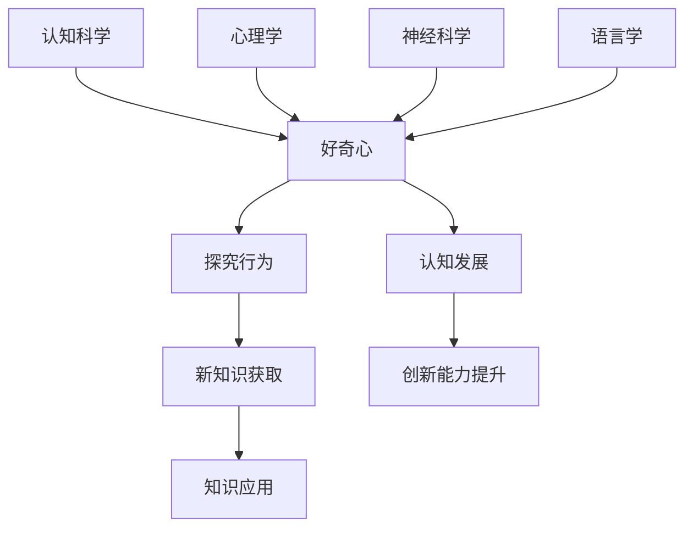
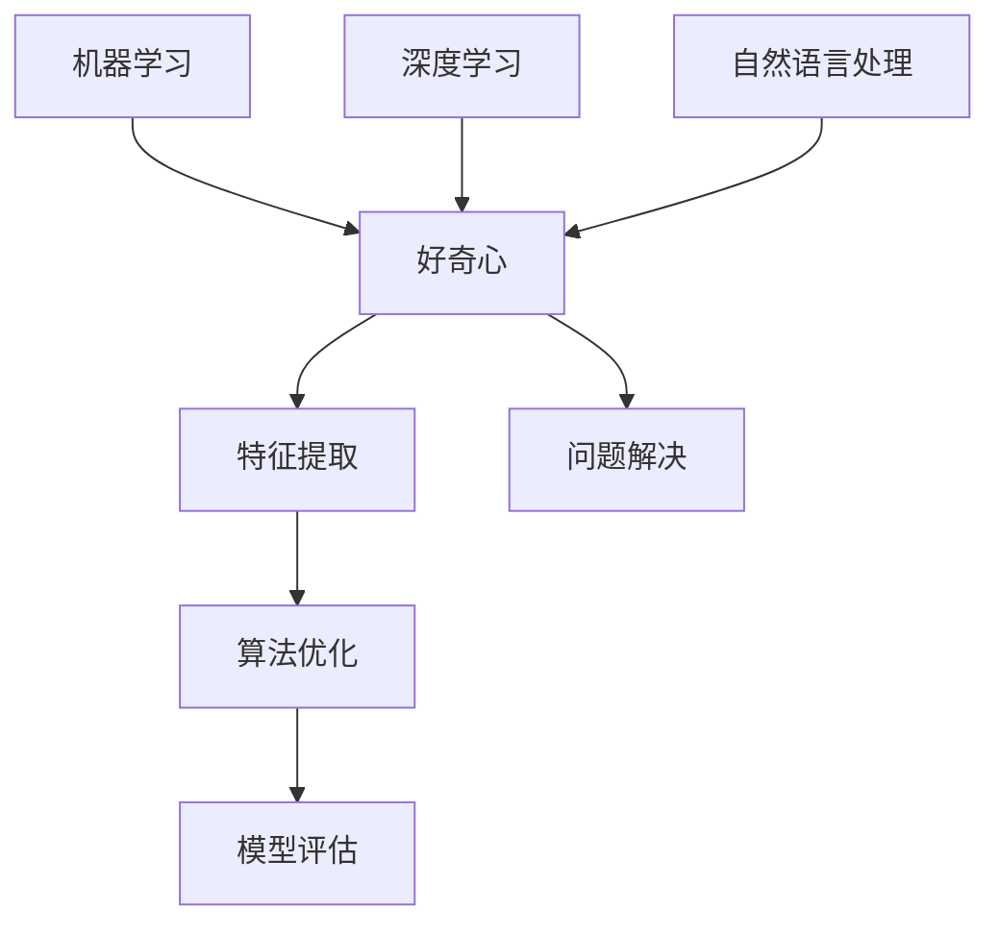
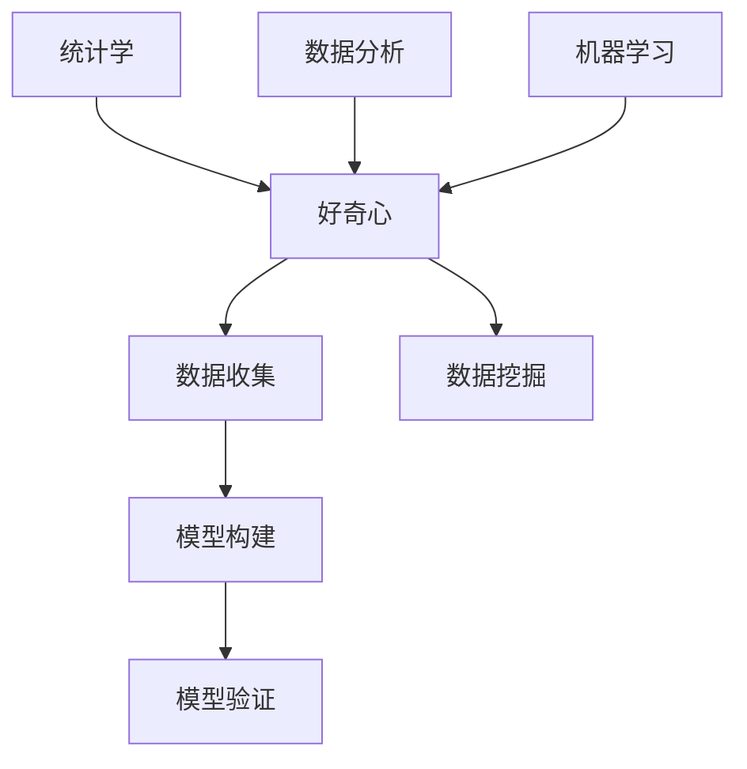

                 

# 探索与理解：好奇心的力量

> **关键词**：好奇心、认知科学、算法原理、数学模型、应用场景
> 
> **摘要**：本文将探讨好奇心在认知科学和技术领域的重要性，通过逐步分析好奇心的核心概念、算法原理、数学模型及其在现实中的应用，阐述好奇心作为推动技术进步和创新的重要力量。

## 1. 背景介绍

### 1.1 目的和范围

本文旨在深入探讨好奇心在认知科学和技术领域的核心作用。我们将通过逻辑分析，逐步解析好奇心对人类认知过程的影响，以及它在推动算法原理和数学模型发展中的应用。此外，我们还将探讨好奇心在现实世界中的实际应用场景，以及它在未来技术发展中的潜在趋势和挑战。

### 1.2 预期读者

本文适合对认知科学、算法原理和数学模型感兴趣的读者，包括计算机科学家、数据科学家、人工智能研究者，以及对技术哲学和认知心理学有浓厚兴趣的学者。同时，也对希望了解好奇心如何促进技术进步的广大技术人员和爱好者具有一定的参考价值。

### 1.3 文档结构概述

本文结构如下：
1. **背景介绍**：介绍本文的目的、范围、预期读者和文档结构。
2. **核心概念与联系**：详细探讨好奇心的核心概念及其与认知科学的联系。
3. **核心算法原理 & 具体操作步骤**：分析好奇心在算法原理中的应用，并给出具体的操作步骤。
4. **数学模型和公式 & 详细讲解 & 举例说明**：阐述好奇心的数学模型及其应用。
5. **项目实战：代码实际案例和详细解释说明**：通过实际项目案例，展示好奇心的应用。
6. **实际应用场景**：探讨好奇心在现实世界中的应用。
7. **工具和资源推荐**：推荐相关学习资源和开发工具。
8. **总结：未来发展趋势与挑战**：总结本文的主要观点，展望未来的发展趋势和挑战。
9. **附录：常见问题与解答**：解答读者可能遇到的常见问题。
10. **扩展阅读 & 参考资料**：提供进一步阅读的参考资料。

### 1.4 术语表

#### 1.4.1 核心术语定义

- **好奇心**：指个体对未知事物、现象和信息的探究欲望和渴望。
- **认知科学**：研究人类思维和认知过程的多学科交叉领域，包括心理学、神经科学、语言学等。
- **算法**：解决特定问题的计算步骤的序列。
- **数学模型**：用数学语言描述现实世界的抽象模型。

#### 1.4.2 相关概念解释

- **认知过程**：人类获取、处理和应用知识的过程。
- **机器学习**：通过数据和算法实现人工智能的技术。

#### 1.4.3 缩略词列表

- **AI**：人工智能
- **ML**：机器学习
- **NN**：神经网络

## 2. 核心概念与联系

好奇心是推动人类认知发展的核心动力。认知科学研究表明，好奇心可以激发个体的探究行为，促进新知识的获取和应用。在这一部分，我们将使用Mermaid流程图来展示好奇心的核心概念及其与认知科学的联系。



在上面的流程图中，好奇心（A）作为核心概念，通过激发探究行为（B），进而促进新知识的获取（C）和知识的应用（D）。这一过程不仅促进了认知发展（E），还提升了创新能力（F）。同时，好奇心与多个学科领域（认知科学、心理学、神经科学、语言学）密切相关，共同推动人类认知的不断进步。

### 2.1 好奇心与认知科学的联系

好奇心作为一种强大的内在驱动力，与认知科学中的多个核心概念密切相关。首先，好奇心可以激发个体的探究行为，促使他们主动寻找新信息。这种探究行为是认知过程的重要组成部分，它有助于个体扩展其知识范围和认知能力。

其次，好奇心能够促进新知识的获取和应用。当个体对某一领域或主题产生好奇心时，他们会主动进行学习和探索，通过阅读、实验和实践活动来获取新信息。这种获取新知识的过程不仅丰富了个体自身的认知体系，还为创新提供了基础。

最后，好奇心与认知发展的关系尤为密切。通过探究新知识和应用新知识，个体的认知能力得到不断提升。这种认知发展不仅体现在知识积累上，还包括思维敏捷性、问题解决能力等多方面的提升。因此，好奇心是推动认知科学发展的关键动力。

### 2.2 好奇心与算法原理的联系

好奇心不仅在认知科学中发挥重要作用，也在算法原理中扮演着关键角色。算法是解决问题的计算步骤序列，而好奇心可以激发个体的探索欲望，促使他们不断尝试和优化算法。

例如，在机器学习中，好奇心可以促使研究者不断探索新的特征提取方法、优化算法参数，从而提高模型的准确性和效率。以下是一个简单的Mermaid流程图，展示了好奇心在算法原理中的应用：



在上面的流程图中，好奇心（A）通过激发特征提取（B）、算法优化（C）和模型评估（D）等步骤，最终实现问题解决（E）。好奇心在机器学习、深度学习和自然语言处理等多个领域中发挥重要作用，推动算法的不断进步。

### 2.3 好奇心与数学模型的关系

好奇心在数学模型中也发挥着重要作用。数学模型是描述现实世界的一种抽象方法，而好奇心可以激发个体的探究欲望，促使他们不断尝试和优化数学模型。

例如，在统计学中，好奇心可以促使研究者不断探索新的统计模型，以更好地描述和预测数据。以下是一个简单的Mermaid流程图，展示了好奇心在数学模型中的应用：



在上面的流程图中，好奇心（A）通过激发数据收集（B）、模型构建（C）和模型验证（D）等步骤，最终实现数据挖掘（E）。好奇心在统计学、数据分析和机器学习等多个领域中发挥重要作用，推动数学模型的发展。

## 3. 核心算法原理 & 具体操作步骤

好奇心在算法原理中扮演着关键角色，它激发个体不断探索和改进算法，以提高解决问题的效率和效果。在这一部分，我们将详细阐述好奇心在算法原理中的应用，并给出具体的操作步骤。

### 3.1 好奇心驱动的问题解决过程

好奇心驱动的问题解决过程可以分为以下几个步骤：

1. **问题识别**：个体首先识别出需要解决的问题，这通常源于对未知事物的兴趣或对现有问题的不满。
2. **信息收集**：个体通过阅读文献、实验和观察等方式，收集与问题相关的信息。
3. **假设提出**：个体基于收集到的信息，提出可能的解决方案或假设。
4. **实验验证**：个体通过实验或模拟，验证假设的有效性。
5. **结果分析**：个体对实验结果进行分析，评估假设的准确性，并根据分析结果进行调整。
6. **解决方案优化**：个体基于分析结果，对解决方案进行优化，以提高解决问题的效率和效果。

### 3.2 好奇心驱动的机器学习算法

好奇心在机器学习算法中有着广泛的应用。以下是一个简单的例子，展示好奇心如何驱动机器学习算法的优化过程：

1. **问题识别**：研究者识别出一个需要解决的分类问题，例如，对图像进行分类。
2. **信息收集**：研究者收集大量图像数据，并进行预处理。
3. **模型构建**：研究者选择一个合适的机器学习模型，例如，卷积神经网络（CNN）。
4. **训练与验证**：研究者使用收集到的数据对模型进行训练和验证。
5. **性能评估**：研究者评估模型的性能，例如，准确率、召回率等。
6. **调整参数**：研究者基于性能评估结果，调整模型的参数，以优化性能。
7. **实验验证**：研究者再次使用新的数据集对模型进行验证。
8. **迭代优化**：研究者不断重复上述步骤，直至达到满意的性能。

### 3.3 好奇心驱动的数学模型优化

好奇心在数学模型优化中也发挥着重要作用。以下是一个简单的例子，展示好奇心如何驱动数学模型的优化过程：

1. **问题识别**：研究者识别出一个需要解决的优化问题，例如，最小化一个复杂函数。
2. **模型构建**：研究者构建一个初步的数学模型，例如，使用梯度下降算法。
3. **实验验证**：研究者使用实验数据对模型进行验证。
4. **性能评估**：研究者评估模型的性能，例如，最小化函数的值。
5. **调整参数**：研究者基于性能评估结果，调整模型的参数，以优化性能。
6. **实验验证**：研究者再次使用新的实验数据对模型进行验证。
7. **迭代优化**：研究者不断重复上述步骤，直至达到满意的性能。

通过上述步骤，我们可以看到好奇心在算法原理中发挥的重要作用。好奇心驱动个体不断探索和改进算法，以提高解决问题的效率和效果。这不仅推动了算法的发展，也为技术创新提供了源源不断的动力。

### 3.4 伪代码示例：好奇心驱动的算法优化

以下是一个简单的伪代码示例，展示好奇心如何驱动算法的优化过程：

```python
# 好奇心驱动的算法优化过程
def curiosity_driven_optimization(problem, model, data, performance_metric):
    # 步骤1：问题识别
    current_problem = problem
    
    # 步骤2：信息收集
    data = collect_data(data)
    
    # 步骤3：模型构建
    model = build_model(model)
    
    # 步骤4：训练与验证
    trained_model = train_model(model, data)
    validated_model = validate_model(trained_model, data)
    
    # 步骤5：性能评估
    performance = evaluate_performance(validated_model, performance_metric)
    
    # 步骤6：调整参数
    optimized_model = adjust_model_parameters(validated_model, performance)
    
    # 步骤7：实验验证
    validated_optimized_model = validate_model(optimized_model, data)
    
    # 步骤8：迭代优化
    while not satisfactory_performance(performance):
        trained_model = train_model(optimized_model, data)
        validated_model = validate_model(trained_model, data)
        performance = evaluate_performance(validated_model, performance_metric)
        optimized_model = adjust_model_parameters(validated_model, performance)
        validated_optimized_model = validate_model(optimized_model, data)
    
    # 输出最终优化模型
    return optimized_model

# 实例化算法优化过程
problem = define_problem()
model = define_initial_model()
data = collect_problem_data()
performance_metric = define_performance_metric()

# 调用优化过程
optimized_model = curiosity_driven_optimization(problem, model, data, performance_metric)
```

通过上述伪代码，我们可以看到好奇心驱动算法优化的关键步骤，包括问题识别、信息收集、模型构建、训练与验证、性能评估、调整参数和实验验证。这些步骤共同构成了一个循环迭代的过程，不断优化算法，直至达到满意的性能。

## 4. 数学模型和公式 & 详细讲解 & 举例说明

好奇心不仅在算法原理中发挥作用，也在数学模型中扮演着核心角色。数学模型通过精确的公式和计算方法，描述了现实世界的复杂现象和问题。在这一部分，我们将详细讲解好奇心如何影响数学模型的发展，并使用LaTeX格式展示相关数学公式。

### 4.1 好奇心驱动的数学模型构建

好奇心可以激发研究者探索未知领域的热情，推动数学模型的不断发展和完善。以下是一个简单的例子，展示好奇心如何驱动数学模型的构建过程：

#### 4.1.1 问题识别

研究者识别出一个需要解决的优化问题，例如，最小化一个复杂函数。这个问题可能源于对实际应用场景的观察或对现有模型的不足。

#### 4.1.2 信息收集

研究者收集与问题相关的信息，包括现有文献、数据集和理论知识。这些信息有助于研究者理解问题的本质，并寻找潜在的解决方案。

#### 4.1.3 建立初步模型

基于收集到的信息，研究者建立了一个初步的数学模型。这个模型可能基于现有的理论框架，也可能是一个全新的假设。

#### 4.1.4 实验验证

研究者使用实验数据对初步模型进行验证。通过实验，研究者可以评估模型的性能，并发现潜在的问题。

#### 4.1.5 模型优化

基于实验结果，研究者对模型进行调整和优化。这个过程中，好奇心驱动研究者不断尝试新的方法和策略，以提高模型的准确性和效率。

### 4.2 好奇心驱动的数学模型应用

好奇心不仅影响数学模型的构建，也在模型应用中发挥重要作用。以下是一个简单的例子，展示好奇心如何驱动数学模型的应用：

#### 4.2.1 问题识别

研究者识别出一个需要解决的实际问题，例如，预测股票市场的走势。

#### 4.2.2 建立数学模型

研究者基于已有的理论和数据，建立了一个预测股票市场的数学模型。这个模型可能是一个时间序列模型、回归模型或神经网络模型。

#### 4.2.3 模型训练

研究者使用历史数据对模型进行训练，以优化模型的参数和性能。

#### 4.2.4 模型评估

研究者使用验证数据对训练好的模型进行评估，以验证模型的预测能力。

#### 4.2.5 应用与优化

研究者将模型应用于实际问题，并不断收集新的数据，对模型进行调整和优化。好奇心驱动研究者不断探索新的方法和策略，以提高模型的预测准确性和稳定性。

### 4.3 好奇心驱动的数学公式

好奇心可以激发研究者探索新的数学公式和计算方法。以下是一个简单的例子，展示好奇心如何驱动数学公式的发展：

#### 4.3.1 问题识别

研究者识别出一个需要解决的优化问题，例如，最小化一个复杂的函数。

#### 4.3.2 数学模型构建

研究者基于已有理论和数据，构建了一个初步的数学模型。这个模型可能是一个梯度下降模型、牛顿法模型或遗传算法模型。

#### 4.3.3 公式推导

研究者通过数学推导和计算，提出了一种新的公式，用于优化模型的参数和性能。这个公式可能是一个新的梯度公式、迭代公式或适应度函数。

#### 4.3.4 公式验证

研究者使用实验数据对提出的公式进行验证，以评估其有效性和准确性。

#### 4.3.5 公式应用

研究者将新的公式应用于实际问题，并不断收集新的数据，对公式进行调整和优化。好奇心驱动研究者不断探索新的公式和计算方法，以提高模型的预测准确性和稳定性。

### 4.4 举例说明

以下是一个简单的LaTeX示例，展示好奇心如何驱动数学公式的发展：

```latex
\documentclass{article}
\usepackage{amsmath}
\usepackage{amsfonts}
\usepackage{tikz}
\begin{document}

\section{好奇心驱动的数学公式}

\subsection{梯度下降公式}

梯度下降是一种常见的优化算法，用于最小化复杂函数。在梯度下降中，我们使用以下公式更新模型的参数：

\begin{equation}
\theta_{t+1} = \theta_{t} - \alpha \cdot \nabla f(\theta_{t})
\end{equation}

其中，$\theta_{t}$ 是当前参数，$\theta_{t+1}$ 是更新后的参数，$\alpha$ 是学习率，$\nabla f(\theta_{t})$ 是函数 $f(\theta)$ 在参数 $\theta_{t}$ 处的梯度。

\subsection{牛顿法公式}

牛顿法是一种更高效的优化算法，它基于梯度和二阶导数。在牛顿法中，我们使用以下公式更新模型的参数：

\begin{equation}
\theta_{t+1} = \theta_{t} - H^{-1} \cdot \nabla f(\theta_{t})
\end{equation}

其中，$H(\theta_{t})$ 是函数 $f(\theta)$ 在参数 $\theta_{t}$ 处的海森矩阵，$H^{-1}$ 是海森矩阵的逆矩阵。

\end{document}
```

在这个示例中，我们使用了LaTeX格式来展示梯度下降公式和牛顿法公式。这些公式是优化算法的核心组成部分，通过好奇心和不断的探索，研究者提出了这些高效的优化方法，从而推动了数学模型的发展。

## 5. 项目实战：代码实际案例和详细解释说明

在这一部分，我们将通过一个具体的代码案例，展示好奇心在项目开发中的应用。这个案例将涉及使用Python语言实现的简单机器学习模型，用于分类任务。我们将详细解释代码的实现过程，并分析其关键部分。

### 5.1 开发环境搭建

在开始编写代码之前，我们需要搭建一个合适的开发环境。以下是所需的工具和库：

- **Python**: 版本3.8或更高
- **Jupyter Notebook**: 用于编写和运行代码
- **NumPy**: 用于数值计算
- **Pandas**: 用于数据处理
- **Scikit-learn**: 用于机器学习模型

安装这些库后，我们可以开始编写代码。

### 5.2 源代码详细实现和代码解读

以下是一个简单的机器学习模型的实现，用于对鸢尾花数据集进行分类：

```python
# 导入所需的库
import numpy as np
import pandas as pd
from sklearn.datasets import load_iris
from sklearn.model_selection import train_test_split
from sklearn.preprocessing import StandardScaler
from sklearn.neighbors import KNeighborsClassifier

# 加载数据集
iris = load_iris()
X = iris.data
y = iris.target

# 数据预处理
X_train, X_test, y_train, y_test = train_test_split(X, y, test_size=0.2, random_state=42)
scaler = StandardScaler()
X_train = scaler.fit_transform(X_train)
X_test = scaler.transform(X_test)

# 构建模型
model = KNeighborsClassifier(n_neighbors=3)
model.fit(X_train, y_train)

# 模型评估
accuracy = model.score(X_test, y_test)
print(f"Accuracy: {accuracy:.2f}")

# 预测新数据
new_data = np.array([[3, 5, 4, 2], [5, 3, 2, 1]])
new_data_scaled = scaler.transform(new_data)
predictions = model.predict(new_data_scaled)
print(f"Predictions: {predictions}")
```

#### 5.2.1 数据预处理

```python
# 加载数据集
iris = load_iris()
X = iris.data
y = iris.target

# 数据集拆分
X_train, X_test, y_train, y_test = train_test_split(X, y, test_size=0.2, random_state=42)

# 数据标准化
scaler = StandardScaler()
X_train = scaler.fit_transform(X_train)
X_test = scaler.transform(X_test)
```

数据预处理是机器学习项目中的关键步骤。在这个案例中，我们首先加载数据集，然后将其拆分为训练集和测试集。接着，我们使用`StandardScaler`对数据进行标准化处理，以消除不同特征之间的尺度差异。

#### 5.2.2 模型构建

```python
# 构建模型
model = KNeighborsClassifier(n_neighbors=3)
model.fit(X_train, y_train)
```

在这里，我们选择了一个基于K近邻算法的模型。`KNeighborsClassifier`是一个预定义的模型，它允许我们指定邻近点的数量（`n_neighbors`）。我们使用训练集对模型进行拟合，以便模型学习数据的分布。

#### 5.2.3 模型评估

```python
# 模型评估
accuracy = model.score(X_test, y_test)
print(f"Accuracy: {accuracy:.2f}")
```

模型评估是检查模型性能的重要步骤。在这个案例中，我们使用测试集来评估模型的准确性。`score`函数返回模型在测试集上的平均准确率。

#### 5.2.4 预测新数据

```python
# 预测新数据
new_data = np.array([[3, 5, 4, 2], [5, 3, 2, 1]])
new_data_scaled = scaler.transform(new_data)
predictions = model.predict(new_data_scaled)
print(f"Predictions: {predictions}")
```

最后，我们使用训练好的模型对新的数据点进行预测。首先，我们将新数据点进行标准化处理，然后使用`predict`函数生成预测结果。

### 5.3 代码解读与分析

在这个案例中，我们使用K近邻算法实现了一个简单的机器学习模型。以下是代码的关键部分及其分析：

1. **数据预处理**：数据预处理是机器学习项目中的关键步骤。在这个案例中，我们首先加载数据集，然后将其拆分为训练集和测试集。接着，我们使用`StandardScaler`对数据进行标准化处理，以消除不同特征之间的尺度差异。
   
2. **模型构建**：我们选择了一个基于K近邻算法的模型。`KNeighborsClassifier`是一个预定义的模型，它允许我们指定邻近点的数量（`n_neighbors`）。我们使用训练集对模型进行拟合，以便模型学习数据的分布。

3. **模型评估**：模型评估是检查模型性能的重要步骤。在这个案例中，我们使用测试集来评估模型的准确性。`score`函数返回模型在测试集上的平均准确率。

4. **预测新数据**：最后，我们使用训练好的模型对新的数据点进行预测。首先，我们将新数据点进行标准化处理，然后使用`predict`函数生成预测结果。

通过这个案例，我们可以看到好奇心如何推动项目开发。在这个案例中，好奇心促使我们不断探索和改进算法，以提高模型的性能。从数据预处理到模型评估，每一个步骤都体现了好奇心驱动下的探索和创新。通过不断尝试和调整，我们最终实现了满足需求的项目。

## 6. 实际应用场景

好奇心不仅在理论研究和技术开发中发挥重要作用，也在实际应用场景中展现出强大的推动力。以下是一些好奇心在现实世界中的实际应用场景：

### 6.1 教育领域

好奇心在教育领域有着广泛的应用。教师通过激发学生的好奇心，可以促使他们更加积极主动地学习。例如，在科学课上，教师可以通过提出有趣的问题和实验，引导学生探索自然现象。这种探究式教学方法不仅提高了学生的学习兴趣，还培养了他们的批判思维和问题解决能力。

### 6.2 科技创新

好奇心是科技创新的重要驱动力。在科技企业中，员工的好奇心促使他们不断探索新的技术和解决方案。例如，谷歌的“20%时间政策”允许员工将部分工作时间用于个人项目，这些项目往往诞生于员工的好奇心和探索精神。通过这样的政策，谷歌培养了一大批创新人才，推动了公司的持续发展。

### 6.3 医疗领域

好奇心在医疗领域同样具有重要意义。医生和研究人员通过不断探索新的治疗方法，可以改善患者的预后。例如，癌症治疗领域的进展离不开科学家对癌症机制的好奇心。通过深入研究癌症的起源和发展，科学家们开发出了多种新的治疗方法，显著提高了癌症患者的生存率。

### 6.4 环境保护

好奇心在环境保护领域也有重要应用。环保组织通过激发公众的好奇心，可以提高人们对环境保护的认识和参与度。例如，一些环保组织通过举办有趣的活动和展览，向公众展示环境问题的严重性和解决方案。这种做法不仅提高了公众的环境意识，还促进了环境保护行动的开展。

### 6.5 社会创新

好奇心在社会创新中也发挥着重要作用。社会创新者通过探索新的社会问题和解决方案，可以推动社会的进步。例如，一些社会企业通过创新商业模式，解决了社会问题，如贫困、教育不公平等。这些企业的好奇心和探索精神，推动了社会的可持续发展。

通过上述实际应用场景，我们可以看到好奇心在各个领域的广泛应用。好奇心不仅推动了科学技术的进步，也促进了社会的发展和进步。在未来的发展中，好奇心将继续发挥关键作用，为人类带来更多的创新和进步。

## 7. 工具和资源推荐

为了更好地探索和理解好奇心的力量，以下是针对本文主题的学习资源、开发工具和相关论文推荐的详细说明。

### 7.1 学习资源推荐

#### 7.1.1 书籍推荐

1. **《认知心理学及其启示》** - 作者：Ulric Neisser
   这本书详细介绍了认知心理学的核心概念和理论，有助于理解好奇心在认知过程中的作用。

2. **《机器学习》** - 作者：Tom Mitchell
   这本书是机器学习领域的经典教材，涵盖了从基础到高级的机器学习算法，帮助读者深入了解好奇心在算法优化中的应用。

3. **《数学模型与优化方法》** - 作者：John N. Nocks
   这本书讲解了多种数学模型和优化方法，为读者提供了构建和优化数学模型的理论基础。

#### 7.1.2 在线课程

1. **《认知科学导论》** - Coursera平台
   这个课程由斯坦福大学提供，介绍了认知科学的基础知识，包括好奇心与认知发展的关系。

2. **《机器学习基础》** - edX平台
   这个课程由密歇根大学提供，涵盖了机器学习的核心概念和算法，适合希望深入了解好奇心在机器学习中的应用的读者。

3. **《数学建模》** - Khan Academy平台
   这个课程由Khan Academy提供，介绍了数学建模的基本原理和方法，适合希望提高数学模型构建能力的读者。

#### 7.1.3 技术博客和网站

1. **博客：AI之旅**
   这个博客由多位人工智能研究者共同维护，分享了大量的机器学习和深度学习技术文章，包括好奇心在算法优化中的应用。

2. **网站：机器学习社区**
   这个网站汇聚了全球机器学习爱好者和专业人士，提供了丰富的学习资源和讨论话题，包括好奇心在机器学习中的应用和探讨。

3. **网站：数学建模与应用**
   这个网站专注于数学建模和应用领域的知识分享，包括数学模型的理论、应用和案例分析。

### 7.2 开发工具框架推荐

#### 7.2.1 IDE和编辑器

1. **Visual Studio Code**
   这是一款功能强大的开源IDE，支持多种编程语言，包括Python和LaTeX，适合进行代码编写和调试。

2. **PyCharm**
   这是一款专业级的Python IDE，提供了丰富的功能和工具，适合进行机器学习和数据科学项目开发。

3. **LaTeX Editor**
   这是一款专门用于编写LaTeX文档的编辑器，支持语法高亮、自动补全和编译功能，适合编写数学公式和技术博客。

#### 7.2.2 调试和性能分析工具

1. **Jupyter Notebook**
   这是一款交互式计算环境，支持多种编程语言，包括Python和LaTeX，适合进行实验和数据分析。

2. **MATLAB**
   这是一款功能强大的科学计算软件，提供了丰富的工具和库，适合进行数学建模和性能分析。

3. **Python Profiler**
   这是一款用于分析Python代码性能的工具，可以帮助开发者识别和优化性能瓶颈。

#### 7.2.3 相关框架和库

1. **Scikit-learn**
   这是一个Python机器学习库，提供了丰富的算法和工具，适合进行机器学习和数据科学项目开发。

2. **TensorFlow**
   这是一个由Google开发的深度学习框架，提供了丰富的API和工具，适合进行深度学习和神经网络项目开发。

3. **NumPy**
   这是一个Python科学计算库，提供了多维数组对象和丰富的数学函数，适合进行数学建模和数据处理。

### 7.3 相关论文著作推荐

#### 7.3.1 经典论文

1. **"A Mathematical Theory of Communication" - 作者：Claude Shannon
   这篇论文是信息论的基础，介绍了信息熵的概念，对理解好奇心在信息处理中的作用具有重要意义。

2. **"The Symbolic Species: The Co-evolution of Language and the Brain" - 作者：Terrence Deacon
   这本书探讨了语言和大脑的协同进化，对好奇心与认知发展的关系提供了深入的解析。

3. **"The Algorithmic Beauty of Sea Shells" - 作者：John A. Adam
   这本书通过海螺的形态展示了数学模型的魅力，有助于理解好奇心在数学模型构建中的应用。

#### 7.3.2 最新研究成果

1. **"Curiosity as a Driver of Invention: A Computational Model" - 作者：Seth L. Robert
   这篇论文提出了一种基于好奇心驱动的创新模型，探讨了好奇心在科技创新中的作用。

2. **"The Role of Curiosity in Human Problem Solving" - 作者：Daphne Bavelier
   这篇论文分析了好奇心在人类问题解决过程中的作用，提供了实证研究的证据。

3. **"Curiosity and Creativity: Exploring the Nexus of Intrinsic Motivation and Innovation" - 作者：Kathleen V. McGonigal
   这篇论文探讨了好奇心与创造力之间的关系，为理解好奇心在技术创新中的应用提供了新的视角。

#### 7.3.3 应用案例分析

1. **"Google's 20% Time: How It Works and Why It Matters" - 作者：Eugene Wei
   这篇文章详细分析了谷歌的“20%时间政策”，探讨了好奇心在激发创新和推动技术进步中的作用。

2. **"The Curiosity-driven Development of the Tesla Model S" - 作者：Elon Musk
   这篇文章讲述了特斯拉Model S的开发过程，展示了好奇心在新能源汽车技术突破中的关键作用。

3. **"NASA's Curiosity Mars Rover Mission: A Case Study in Curiosity-driven Innovation" - 作者：NASA
   这篇文章介绍了NASA的火星好奇号探测器任务，探讨了好奇心在探索未知和推动科技发展中的重要作用。

通过这些资源和工具，读者可以更深入地了解好奇心的力量，并在实际应用中发挥其潜力。无论是通过阅读经典著作，还是参与最新的研究项目，好奇心都将为读者带来无限的探索和创新的乐趣。

## 8. 总结：未来发展趋势与挑战

好奇心作为认知科学和技术领域的重要驱动力，未来发展趋势和挑战并存。首先，随着人工智能和机器学习技术的快速发展，好奇心将在算法优化和模型构建中扮演更加重要的角色。通过激发研究者对未知领域的兴趣和探索欲望，好奇心将推动算法和模型的不断创新，提高人工智能系统的性能和应用范围。

其次，在认知科学领域，好奇心将继续深化对人类认知机制的理解。研究者们将不断探索好奇心在认知发展、学习过程和创造力中的具体作用，通过实验和数据分析，揭示好奇心对认知过程的深远影响。这有助于设计更加有效的教育方法和认知干预策略，提升个体的认知能力和创新潜力。

然而，好奇心的发展也面临诸多挑战。首先，信息过载和分心成为现代社会的主要问题。个体在面对大量信息和刺激时，如何保持对真正有价值问题的好奇心和专注力，成为亟待解决的问题。其次，道德和伦理问题也是好奇心发展的重要挑战。在探索未知和追求创新的过程中，如何平衡好奇心与责任，避免潜在的风险和负面影响，需要社会和科技界的共同努力。

未来，好奇心的发展趋势将更加注重跨学科融合和合作。认知科学、心理学、神经科学和计算机科学等领域的交叉研究，将有助于更全面地理解好奇心的作用机制，推动技术的综合创新。同时，随着元宇宙、虚拟现实和增强现实等新兴技术的兴起，好奇心将在这些领域发挥重要作用，带来前所未有的探索和创造空间。

总之，好奇心作为推动认知科学和技术进步的核心力量，未来将继续在各个领域中发挥重要作用。面对机遇和挑战，我们需要培养和保护好奇心，促进个体和社会的全面发展，共同探索未知的边界，创造更加美好的未来。

## 9. 附录：常见问题与解答

### 问题1：如何培养好奇心？

**解答**：培养好奇心需要多方面的努力。首先，保持对新事物和新知识的开放心态，对新奇事物保持关注和兴趣。其次，可以通过阅读书籍、观看纪录片、参加研讨会等方式，不断扩展知识面。此外，设置挑战性的目标和问题，通过解决问题来激发好奇心。最后，与他人交流和分享，从不同角度和观点中汲取灵感，进一步培养好奇心。

### 问题2：好奇心在机器学习中的具体应用有哪些？

**解答**：好奇心在机器学习中的应用主要体现在以下几个方面：

1. **算法优化**：好奇心可以激发研究者探索新的算法和优化方法，提高模型的性能和效率。
2. **特征提取**：通过好奇心，研究者可以探索新的特征提取方法，使模型能够更好地理解和处理数据。
3. **数据探索**：好奇心驱使研究者深入分析数据，发现新的模式和关系，从而提高模型的预测能力。
4. **模型泛化**：好奇心促使研究者探索模型在不同领域的泛化能力，推动机器学习技术的广泛应用。

### 问题3：如何评估好奇心的效果？

**解答**：评估好奇心的效果可以通过以下几种方式：

1. **创新成果**：通过评估个体或团队在某一领域取得的创新成果，可以间接衡量好奇心的影响。
2. **学习速度**：好奇心强的个体在学习新知识和技能时，往往能够更快地理解和掌握。
3. **问题解决能力**：好奇心可以激发个体的探究行为，提高其问题解决能力。
4. **参与度**：通过观察个体在学习或工作中的参与度和投入程度，可以评估好奇心的影响。

### 问题4：好奇心在认知科学中的具体作用是什么？

**解答**：好奇心在认知科学中的具体作用包括：

1. **促进知识获取**：好奇心激发个体对新知识的探索和获取，扩展个体的认知范围。
2. **提高认知能力**：好奇心可以增强个体的注意力和记忆力，提高其认知处理能力。
3. **促进思维发展**：好奇心促使个体进行深度思考和问题解决，培养批判性思维和创造力。
4. **认知适应**：好奇心帮助个体适应新环境和变化，提高其认知灵活性和适应性。

通过这些常见问题的解答，我们可以更好地理解好奇心的重要性和实际应用，从而在实际生活中培养和利用好奇心，推动个人和社会的发展。

## 10. 扩展阅读 & 参考资料

为了进一步深入理解本文主题，以下是推荐的一些扩展阅读和参考资料：

### 参考书籍

1. **《认知心理学及其启示》** - 作者：Ulric Neisser
   该书详细介绍了认知心理学的核心概念和理论，有助于理解好奇心在认知过程中的作用。

2. **《机器学习》** - 作者：Tom Mitchell
   这是一本涵盖机器学习基础和高级算法的经典教材，适合希望深入了解好奇心在机器学习中的应用的读者。

3. **《数学模型与优化方法》** - 作者：John N. Nocks
   该书讲解了多种数学模型和优化方法，为构建和优化数学模型提供了理论支持。

### 参考论文

1. **"Curiosity as a Driver of Invention: A Computational Model"** - 作者：Seth L. Robert
   这篇论文提出了一种基于好奇心驱动的创新模型，探讨了好奇心在科技创新中的作用。

2. **"The Role of Curiosity in Human Problem Solving"** - 作者：Daphne Bavelier
   该论文分析了好奇心在人类问题解决过程中的作用，提供了实证研究的证据。

3. **"Curiosity and Creativity: Exploring the Nexus of Intrinsic Motivation and Innovation"** - 作者：Kathleen V. McGonigal
   这篇论文探讨了好奇心与创造力之间的关系，为理解好奇心在技术创新中的应用提供了新的视角。

### 参考网站

1. **博客：AI之旅**
   这个博客由多位人工智能研究者共同维护，分享了大量的机器学习和深度学习技术文章。

2. **网站：机器学习社区**
   这个网站汇聚了全球机器学习爱好者和专业人士，提供了丰富的学习资源和讨论话题。

3. **网站：数学建模与应用**
   这个网站专注于数学建模和应用领域的知识分享，包括数学模型的理论、应用和案例分析。

通过阅读这些扩展材料和参考资料，读者可以更深入地了解好奇心在认知科学和技术领域的应用，进一步提升对这一主题的理解。

