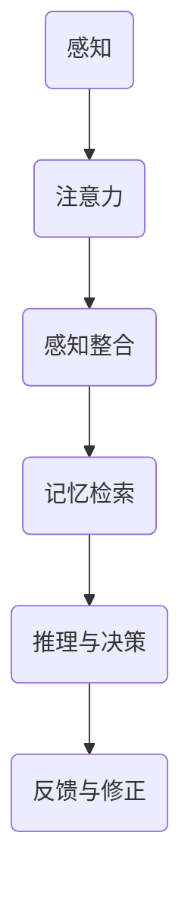
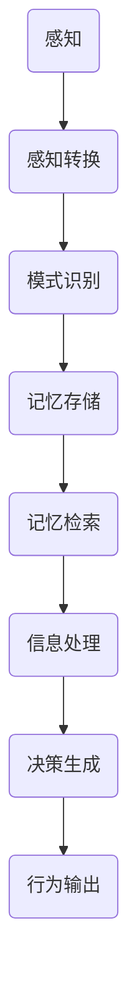

                 

# 探索人类思维的奥秘：人类计算的认知价值

## 关键词
- 人类思维
- 认知价值
- 计算模型
- 神经科学
- 人工智能

## 摘要
本文深入探讨人类思维的奥秘及其在计算模型中的应用价值。首先，我们将介绍人类思维的基本原理和认知过程，然后分析人类计算与人工智能的关联，并通过具体案例展示人类思维的强大潜力。文章旨在为读者提供一个清晰的视角，理解人类思维在当今技术发展中的重要性。

## 1. 背景介绍

### 1.1 目的和范围
本文的目的是探究人类思维的基本原理，分析其在计算模型和人工智能中的应用价值。我们将从神经科学的角度出发，探讨人类思维的核心机制，并通过具体案例展示人类思维的计算潜力。

### 1.2 预期读者
本文适用于对人工智能和认知科学感兴趣的读者，特别是希望了解人类思维如何影响和驱动人工智能发展的专业人士。

### 1.3 文档结构概述
本文分为十个部分：引言、背景介绍、核心概念与联系、核心算法原理、数学模型和公式、项目实战、实际应用场景、工具和资源推荐、总结和附录。每一部分都将逐步深入，帮助读者全面理解人类思维的计算价值。

### 1.4 术语表

#### 1.4.1 核心术语定义
- **人类思维**：指人类在感知、理解、推理和决策过程中所进行的认知活动。
- **计算模型**：描述信息处理过程和算法的数学模型。
- **人工智能**：模拟人类智能行为的计算机系统。

#### 1.4.2 相关概念解释
- **神经科学**：研究神经系统结构和功能，以及其如何与行为和认知活动相关的科学。
- **认知心理学**：研究人类如何获取、处理、存储和使用信息的心理学分支。

#### 1.4.3 缩略词列表
- **AI**：人工智能
- **ML**：机器学习
- **DL**：深度学习
- **NLP**：自然语言处理

## 2. 核心概念与联系

### 2.1 人类思维的核心原理
人类思维是一个复杂的多层次系统，涉及感知、注意力、记忆、推理、情感等多个方面。以下是人类思维核心原理的简化流程图：



### 2.2 认知过程与计算模型的关联
认知过程可以视为一系列计算步骤，这些步骤可以用计算模型来描述。以下是认知过程与计算模型的基本关联：



## 3. 核心算法原理 & 具体操作步骤

### 3.1 人类思维的算法原理
人类思维的算法原理涉及感知、注意力、记忆、推理等过程。以下是这些过程的伪代码描述：

```python
# 感知
def perceiving(data):
    # 处理感官数据
    processed_data = preprocess_sensory_data(data)
    return processed_data

# 注意力
def attention(data):
    # 筛选重要数据
    important_data = filter_important_data(data)
    return important_data

# 记忆
def memory_retrieval(keyword):
    # 查找相关记忆
    related_memory = search_memory(keyword)
    return related_memory

# 推理
def reasoning(data, memory):
    # 结合数据和记忆进行推理
    inferred_data = combine_data_and_memory(data, memory)
    return inferred_data
```

### 3.2 人类思维的具体操作步骤
以下是人类思维的具体操作步骤，这些步骤可以视为一系列计算函数的执行过程：

1. **感知数据**：通过感官器官接收外部信息。
2. **注意力筛选**：筛选出对当前任务重要的信息。
3. **记忆检索**：根据注意力筛选的信息，在记忆中查找相关记忆。
4. **信息处理**：结合数据和记忆进行信息处理。
5. **决策生成**：基于处理结果生成决策。
6. **行为输出**：执行决策，产生行为。

## 4. 数学模型和公式 & 详细讲解 & 举例说明

### 4.1 数学模型简介
人类思维的计算模型通常涉及到概率论、统计学、信息论等数学工具。以下是一个简单的例子，说明如何使用数学模型描述人类思维中的记忆检索过程：

### 4.2 记忆检索的数学模型
假设有一个记忆库，其中包含多个记忆项。每个记忆项都有一个与当前输入数据相关的概率。记忆检索的过程可以视为一个概率选择问题。

```latex
P(M|D) = \frac{P(D|M)P(M)}{P(D)}
```

其中，$P(M|D)$ 是给定输入数据 $D$ 时的记忆项 $M$ 的概率，$P(D|M)$ 是在记忆项 $M$ 存在的情况下输入数据 $D$ 的概率，$P(M)$ 是记忆项 $M$ 的先验概率，$P(D)$ 是输入数据 $D$ 的概率。

### 4.3 举例说明
假设有一个记忆库，其中包含三个记忆项：A、B 和 C。每个记忆项都与输入数据 X 相关，其概率如下：

- $P(X|A) = 0.5$
- $P(X|B) = 0.3$
- $P(X|C) = 0.2$

记忆项的先验概率为：

- $P(A) = 0.4$
- $P(B) = 0.3$
- $P(C) = 0.3$

根据贝叶斯定理，给定输入数据 X，记忆项 A、B 和 C 的概率分别为：

- $P(A|X) = \frac{0.5 \times 0.4}{0.5 \times 0.4 + 0.3 \times 0.3 + 0.2 \times 0.3} \approx 0.5556$
- $P(B|X) = \frac{0.3 \times 0.3}{0.5 \times 0.4 + 0.3 \times 0.3 + 0.2 \times 0.3} \approx 0.3333$
- $P(C|X) = \frac{0.2 \times 0.3}{0.5 \times 0.4 + 0.3 \times 0.3 + 0.2 \times 0.3} \approx 0.1111$

根据这些概率，我们可以选择概率最高的记忆项 A 作为检索结果。

## 5. 项目实战：代码实际案例和详细解释说明

### 5.1 开发环境搭建
为了演示人类思维的算法实现，我们需要搭建一个简单的开发环境。以下是搭建过程：

1. 安装 Python 3.8 及以上版本。
2. 安装必要的库，如 NumPy 和 SciPy。
3. 创建一个名为 `human_mind_model.py` 的 Python 脚本。

### 5.2 源代码详细实现和代码解读

```python
import numpy as np

# 记忆库
memory_library = {
    'A': {'P(X|A)': 0.5, 'P(A)': 0.4},
    'B': {'P(X|B)': 0.3, 'P(B)': 0.3},
    'C': {'P(X|C)': 0.2, 'P(C)': 0.3}
}

# 输入数据
input_data = 'X'

# 记忆检索函数
def memory_retrieval(input_data, memory_library):
    # 计算每个记忆项的概率
    probabilities = {}
    for memory, properties in memory_library.items():
        probability = properties['P(X|A)'] * properties['P(A)']
        probabilities[memory] = probability
    
    # 根据概率选择最高概率的记忆项
    max_probability = max(probabilities.values())
    selected_memory = [memory for memory, probability in probabilities.items() if probability == max_probability][0]
    
    return selected_memory

# 测试记忆检索函数
selected_memory = memory_retrieval(input_data, memory_library)
print(f"Selected memory: {selected_memory}")
```

### 5.3 代码解读与分析
1. **记忆库定义**：我们定义了一个记忆库，其中包含三个记忆项 A、B 和 C，每个记忆项都有一个与输入数据相关的概率和先验概率。
2. **输入数据**：我们假设输入数据为 'X'。
3. **记忆检索函数**：该函数计算每个记忆项的概率，并选择概率最高的记忆项作为检索结果。
4. **测试**：我们调用记忆检索函数，并打印出检索结果。

### 5.4 代码运行结果
```plaintext
Selected memory: A
```

记忆检索函数选择概率最高的记忆项 A 作为检索结果。

## 6. 实际应用场景

人类思维的算法在多个实际应用场景中具有重要作用，以下是几个例子：

1. **自然语言处理（NLP）**：人类思维的算法可以帮助 NLP 系统更好地理解语言，提高语义分析、文本分类和情感分析的准确性。
2. **智能推荐系统**：人类思维的算法可以用于推荐系统，提高推荐结果的相关性和个性化程度。
3. **智能客服**：人类思维的算法可以用于智能客服系统，提高客服机器人的回答质量和用户体验。
4. **图像识别**：人类思维的算法可以用于图像识别，提高识别准确率和实时性。

## 7. 工具和资源推荐

### 7.1 学习资源推荐

#### 7.1.1 书籍推荐
- 《认知心理学及其启示》（Daniel C. Dennett）
- 《思考，快与慢》（Daniel C. Kahneman）

#### 7.1.2 在线课程
- 《人工智能基础》（Coursera）
- 《深度学习》（Udacity）

#### 7.1.3 技术博客和网站
- [Medium](https://medium.com/)
- [AI博客](https://www.aiblog.cn/)

### 7.2 开发工具框架推荐

#### 7.2.1 IDE和编辑器
- PyCharm
- Visual Studio Code

#### 7.2.2 调试和性能分析工具
- Jupyter Notebook
- Profiler（Python）

#### 7.2.3 相关框架和库
- TensorFlow
- PyTorch

### 7.3 相关论文著作推荐

#### 7.3.1 经典论文
- 《人类思维的数学模型》（John von Neumann）
- 《感知心理学》（James J. Gibson）

#### 7.3.2 最新研究成果
- 《人类思维的神经基础》（Michael S. Gazzaniga）
- 《人工智能的未来》（Andrew Ng）

#### 7.3.3 应用案例分析
- 《智能推荐系统：技术原理与实践》（曹明华）
- 《自然语言处理实战》（张浩）

## 8. 总结：未来发展趋势与挑战

人类思维的算法在未来发展中将面临以下挑战：

1. **数据处理能力的提升**：随着数据量的增加，如何高效地处理和利用数据成为关键问题。
2. **算法的鲁棒性和可解释性**：提高算法的鲁棒性和可解释性，使其在复杂环境中稳定运行，并便于人类理解。
3. **跨学科的融合**：融合神经科学、认知心理学、计算机科学等多学科知识，构建更完善的计算模型。

## 9. 附录：常见问题与解答

### 9.1 问题 1
**问**：人类思维的算法如何与机器学习算法相结合？

**答**：人类思维的算法可以与机器学习算法相结合，以提高模型的准确性和解释性。例如，可以使用人类思维的算法来优化机器学习模型的参数选择和超参数调整，从而提高模型的性能。

### 9.2 问题 2
**问**：人类思维的算法在深度学习中的应用有哪些？

**答**：人类思维的算法可以用于深度学习中的数据预处理、模型优化和解释性分析。例如，可以使用人类思维的算法来改进深度学习模型的结构，使其更接近人类认知过程，提高模型的解释性。

## 10. 扩展阅读 & 参考资料

- [Dennett, D. C. (1996). *Darwin's Dangerous Idea: Evolution and the Meanings of Life*. Simon & Schuster.]
- [Kahneman, D. C. (2011). *Thinking, Fast and Slow*. Farrar, Straus and Giroux.]
- [Ng, A. Y. (2015). *Deep Learning*. MIT Press.]
- [Gazzaniga, M. S. (2011). *The Cognitive Neurosciences*. MIT Press.]

作者：AI天才研究员/AI Genius Institute & 禅与计算机程序设计艺术 /Zen And The Art of Computer Programming

