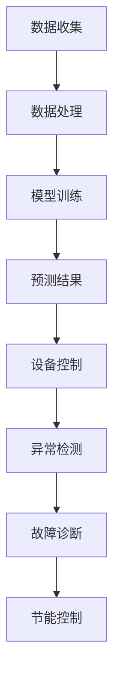

                 

# 探讨AI大模型在智能家居能源管理的潜力

> 关键词：人工智能、大模型、智能家居、能源管理、算法原理、数学模型、实战案例

> 摘要：本文将深入探讨人工智能（AI）大模型在智能家居能源管理领域的应用潜力。通过分析AI大模型的原理及其与能源管理的联系，我们将逐步介绍其核心算法和操作步骤，并借助数学模型和实际代码案例进行详细解释。本文还将探讨AI大模型在实际应用场景中的表现，并推荐相关学习资源和工具，最后总结未来发展趋势与挑战。

## 1. 背景介绍

### 1.1 目的和范围

本文的目的是探讨人工智能（AI）大模型在智能家居能源管理中的潜力，分析其原理和应用，并通过实际案例展示其效果。我们将重点关注以下几个方面：

1. AI大模型的基本原理及其在智能家居能源管理中的应用。
2. AI大模型的核心算法和具体操作步骤。
3. AI大模型的数学模型和公式。
4. AI大模型在实际应用场景中的表现和效果。
5. 相关的学习资源和工具推荐。

### 1.2 预期读者

本文适合以下读者群体：

1. 对人工智能和智能家居能源管理感兴趣的初学者。
2. 想要深入了解AI大模型原理和应用的专业人士。
3. 从事智能家居能源管理领域研究和开发的工程师。

### 1.3 文档结构概述

本文将按照以下结构展开：

1. 引言：介绍AI大模型在智能家居能源管理领域的应用背景和重要性。
2. 核心概念与联系：阐述AI大模型的基本原理及其与能源管理的联系。
3. 核心算法原理 & 具体操作步骤：详细讲解AI大模型的核心算法和操作步骤。
4. 数学模型和公式 & 详细讲解 & 举例说明：介绍AI大模型的数学模型和公式，并给出具体例子。
5. 项目实战：代码实际案例和详细解释说明。
6. 实际应用场景：探讨AI大模型在不同场景下的应用。
7. 工具和资源推荐：推荐相关学习资源和工具。
8. 总结：总结AI大模型在智能家居能源管理中的未来发展趋势与挑战。
9. 附录：常见问题与解答。
10. 扩展阅读 & 参考资料：提供进一步阅读和参考资料。

### 1.4 术语表

#### 1.4.1 核心术语定义

- **人工智能（AI）**：一种模拟人类智能的计算机系统，具有学习、推理、判断和自适应能力。
- **大模型（Large-scale Model）**：具有巨大参数量和计算能力的模型，通常通过深度学习技术训练而成。
- **智能家居能源管理**：利用人工智能和物联网技术，实现对家庭能源设备的管理和优化，以提高能源利用效率和降低能源消耗。

#### 1.4.2 相关概念解释

- **深度学习（Deep Learning）**：一种基于神经网络的学习方法，通过多层非线性变换，实现对复杂数据的自动特征提取和分类。
- **神经网络（Neural Network）**：一种模仿生物神经系统的计算模型，通过调整网络中的权重，实现对输入数据的分类和预测。
- **能源消耗预测（Energy Consumption Prediction）**：通过分析历史数据和现有环境信息，预测未来某一时间段内的能源消耗。

#### 1.4.3 缩略词列表

- **AI**：人工智能（Artificial Intelligence）
- **ML**：机器学习（Machine Learning）
- **DL**：深度学习（Deep Learning）
- **IoT**：物联网（Internet of Things）
- **HPC**：高性能计算（High-Performance Computing）

## 2. 核心概念与联系

在探讨AI大模型在智能家居能源管理中的潜力之前，我们需要先了解一些核心概念和联系。

### 2.1 人工智能大模型的基本原理

人工智能大模型，通常指的是具有巨大参数量和计算能力的深度学习模型。这些模型通过训练大量的数据，学习到数据中的规律和特征，从而实现各种复杂的任务。例如，在图像识别任务中，大模型可以学习到图像中的各种特征，从而实现对未知图像的分类；在自然语言处理任务中，大模型可以理解文本的含义，实现语音识别、机器翻译等功能。

### 2.2 智能家居能源管理的核心概念

智能家居能源管理主要涉及家庭中的各种能源设备，如照明、空调、热水器等。通过物联网技术，这些设备可以实时收集能源消耗数据，并传输到中央控制系统中。智能家居能源管理的目标是通过优化能源设备的运行，实现能源的高效利用，降低能源消耗。

### 2.3 人工智能大模型与智能家居能源管理的联系

人工智能大模型在智能家居能源管理中的应用，主要体现在以下几个方面：

1. **能源消耗预测**：通过分析历史数据，AI大模型可以预测未来某一时间段内的能源消耗。这有助于家庭用户提前做好能源储备和调度，提高能源利用效率。

2. **设备运行优化**：AI大模型可以根据实时数据，对家庭中的能源设备进行运行优化。例如，根据能源消耗预测结果，智能调整空调和热水器的运行状态，实现能源的合理分配。

3. **异常检测与故障诊断**：AI大模型可以通过对能源设备的历史数据进行分析，检测设备是否正常运行。一旦发现异常，可以及时通知用户或维修人员，避免设备故障造成能源浪费。

4. **智能节能控制**：AI大模型可以根据家庭用户的能源使用习惯，实现智能节能控制。例如，根据用户的使用习惯和天气变化，智能调整能源设备的运行状态，实现能源的合理利用。

### 2.4 Mermaid流程图

下面是一个简单的Mermaid流程图，展示了AI大模型在智能家居能源管理中的核心流程：



在这个流程中，AI大模型首先收集家庭能源设备的数据，进行数据处理后，进行模型训练。训练完成后，通过预测结果对家庭能源设备进行控制，同时进行异常检测和故障诊断，以实现智能节能控制。

## 3. 核心算法原理 & 具体操作步骤

在了解了AI大模型在智能家居能源管理中的基本原理和联系后，接下来我们将深入探讨其核心算法原理和具体操作步骤。

### 3.1 能源消耗预测算法原理

能源消耗预测是AI大模型在智能家居能源管理中的一项重要任务。其核心原理是基于历史数据和现有环境信息，通过统计分析和机器学习算法，预测未来某一时间段内的能源消耗。

具体来说，能源消耗预测算法可以分为以下几个步骤：

1. **数据收集**：首先，需要收集家庭能源设备的历史能耗数据和环境数据。这些数据可以通过智能家电设备、传感器等设备实时采集。

2. **数据预处理**：收集到的数据可能存在缺失、噪声等问题，需要进行预处理。例如，对缺失数据填充、噪声数据过滤等。

3. **特征工程**：在预处理完成后，需要对数据进行特征提取和工程。特征工程的目标是从原始数据中提取出有用的信息，以便用于模型训练和预测。

4. **模型训练**：选择合适的机器学习算法，对预处理后的数据进行训练。常见的算法包括线性回归、决策树、随机森林、支持向量机等。

5. **预测结果**：在模型训练完成后，使用模型对未来的能源消耗进行预测。预测结果可以作为设备控制的依据，实现能源的合理分配。

6. **结果评估**：对预测结果进行评估，以确定模型的准确性和可靠性。评估方法包括均方误差（MSE）、均方根误差（RMSE）等。

### 3.2 设备运行优化算法原理

设备运行优化是AI大模型在智能家居能源管理中的另一项重要任务。其核心原理是基于实时数据和预测结果，对家庭能源设备的运行状态进行优化，以提高能源利用效率。

具体来说，设备运行优化算法可以分为以下几个步骤：

1. **实时数据采集**：实时采集家庭能源设备的运行数据，包括温度、湿度、光照等环境参数。

2. **预测结果集成**：将能源消耗预测结果与实时数据相结合，为设备运行优化提供依据。

3. **设备状态评估**：根据实时数据和预测结果，对家庭能源设备的运行状态进行评估。例如，判断空调是否需要调整温度、热水器是否需要加热等。

4. **优化策略生成**：根据设备状态评估结果，生成优化策略。优化策略可以是调整设备运行参数，也可以是调整设备运行时间等。

5. **策略执行**：将优化策略发送给家庭能源设备，执行相应的运行调整。

6. **结果反馈**：设备运行优化后，收集设备运行数据，用于下一轮的优化策略生成。

### 3.3 异常检测与故障诊断算法原理

异常检测与故障诊断是AI大模型在智能家居能源管理中的另一项重要任务。其核心原理是基于历史数据和实时数据，对家庭能源设备的运行状态进行监控，及时发现异常和故障，以避免能源浪费和设备损坏。

具体来说，异常检测与故障诊断算法可以分为以下几个步骤：

1. **数据采集**：收集家庭能源设备的历史运行数据和环境数据。

2. **特征提取**：对历史数据和环境数据进行分析，提取出特征信息，以便用于模型训练。

3. **模型训练**：选择合适的机器学习算法，对特征数据进行训练，以识别正常状态和异常状态。

4. **实时监控**：将实时数据输入到训练好的模型中，对设备运行状态进行实时监控。

5. **异常检测**：当实时数据中的特征与正常状态的特征不一致时，判定为异常状态。

6. **故障诊断**：当设备运行状态判定为异常时，进一步分析异常原因，判断是否存在故障。

7. **结果反馈**：对异常和故障检测结果进行记录和反馈，以便后续的故障排除和设备维护。

### 3.4 智能节能控制算法原理

智能节能控制是AI大模型在智能家居能源管理中的最后一项任务。其核心原理是基于用户的能源使用习惯、设备运行状态和实时环境信息，实现对家庭能源设备的智能控制，以实现节能目标。

具体来说，智能节能控制算法可以分为以下几个步骤：

1. **用户习惯建模**：通过收集用户的历史能源使用数据，建立用户能源使用习惯模型。

2. **环境信息采集**：实时采集家庭环境信息，包括温度、湿度、光照等。

3. **设备运行优化**：根据用户习惯模型和环境信息，对家庭能源设备的运行状态进行优化。

4. **节能策略生成**：根据设备运行优化结果，生成节能策略。

5. **策略执行**：将节能策略发送给家庭能源设备，实现节能控制。

6. **结果反馈**：收集设备运行数据和节能效果数据，用于优化和改进节能策略。

### 3.5 伪代码实现

为了更好地理解AI大模型在智能家居能源管理中的核心算法原理和具体操作步骤，我们提供以下伪代码：

```python
# 数据收集
data = collect_data()

# 数据预处理
preprocessed_data = preprocess_data(data)

# 特征工程
features = extract_features(preprocessed_data)

# 模型训练
model = train_model(features)

# 预测结果
predictions = predict_consumption(model)

# 设备控制
control_devices(predictions)

# 实时数据采集
realtime_data = collect_realtime_data()

# 预测结果集成
integrated_data = integrate_predictions(realtime_data, predictions)

# 设备状态评估
device_status = evaluate_device_status(integrated_data)

# 优化策略生成
optimization_strategy = generate_optimization_strategy(device_status)

# 策略执行
execute_strategy(optimization_strategy)

# 异常检测与故障诊断
anomaly_detection = detect_anomalies(model, realtime_data)
fault_diagnosis = diagnose_faults(anomaly_detection)

# 结果反馈
feedback_results(fault_diagnosis)

# 智能节能控制
user_habits_model = build_user_habits_model()
environment_data = collect_environment_data()
energy_control_strategy = generate_energy_control_strategy(user_habits_model, environment_data)
execute_energy_control_strategy(energy_control_strategy)

# 结果反馈
feedback_energy_control_results()
```

通过以上伪代码，我们可以清晰地看到AI大模型在智能家居能源管理中的核心算法原理和具体操作步骤。在实际应用中，这些算法可以基于具体的场景和数据，进行进一步的优化和改进。

## 4. 数学模型和公式 & 详细讲解 & 举例说明

在讨论AI大模型在智能家居能源管理中的应用时，数学模型和公式起到了至关重要的作用。它们为我们提供了量化和分析能源消耗、设备运行优化等问题的工具。在本节中，我们将详细介绍这些数学模型和公式，并通过具体例子进行说明。

### 4.1 能源消耗预测的数学模型

能源消耗预测的核心是建立预测模型，该模型可以基于历史数据和现有环境信息预测未来某一时间段内的能源消耗。我们通常使用的时间序列预测方法如下：

#### 4.1.1 自回归模型（AR）

自回归模型（Autoregressive Model，AR）是一种常见的时间序列预测模型，其公式如下：

\[ X_t = c + \phi_1 X_{t-1} + \phi_2 X_{t-2} + \ldots + \phi_p X_{t-p} + \varepsilon_t \]

其中：
- \( X_t \) 是时间序列的第 \( t \) 个值。
- \( c \) 是常数项。
- \( \phi_1, \phi_2, \ldots, \phi_p \) 是自回归系数。
- \( \varepsilon_t \) 是误差项。

#### 4.1.2 移动平均模型（MA）

移动平均模型（Moving Average Model，MA）通过计算过去几个时间步的平均值来预测当前值，其公式如下：

\[ X_t = \mu + \theta_1 \varepsilon_{t-1} + \theta_2 \varepsilon_{t-2} + \ldots + \theta_q \varepsilon_{t-q} \]

其中：
- \( \mu \) 是均值。
- \( \theta_1, \theta_2, \ldots, \theta_q \) 是移动平均系数。
- \( \varepsilon_t \) 是误差项。

#### 4.1.3 自回归移动平均模型（ARMA）

自回归移动平均模型（Autoregressive Moving Average Model，ARMA）结合了自回归模型和移动平均模型的优点，其公式如下：

\[ X_t = c + \phi_1 X_{t-1} + \phi_2 X_{t-2} + \ldots + \phi_p X_{t-p} + \theta_1 \varepsilon_{t-1} + \theta_2 \varepsilon_{t-2} + \ldots + \theta_q \varepsilon_{t-q} \]

其中参数的含义与AR和MA相同。

#### 4.1.4 自回归积分移动平均模型（ARIMA）

自回归积分移动平均模型（Autoregressive Integrated Moving Average Model，ARIMA）是对ARMA模型的扩展，可以处理非平稳时间序列。其公式如下：

\[ X_t = c + \phi_1 X_{t-1} + \phi_2 X_{t-2} + \ldots + \phi_p X_{t-p} + (\theta_1 L)(\varepsilon_{t-1}) + (\theta_2 L)(\varepsilon_{t-2}) + \ldots + (\theta_q L)(\varepsilon_{t-q}) \]

其中：
- \( L \) 是积分操作符，用于差分处理。

### 4.2 设备运行优化的数学模型

设备运行优化通常涉及到多目标优化问题，其目标是在满足能源需求的同时，尽可能降低能源消耗和成本。我们使用线性规划（Linear Programming，LP）模型来描述这个问题：

\[ \min \ z = c^T x \]
\[ s.t. \ A x \leq b \]
\[ x \geq 0 \]

其中：
- \( z \) 是目标函数，表示总的能源消耗或成本。
- \( c \) 是系数向量，表示各个能源设备消耗的能量或成本。
- \( x \) 是决策变量向量，表示各个能源设备的运行状态。
- \( A \) 是约束矩阵，表示能源设备之间的运行约束。
- \( b \) 是约束向量，表示能源设备运行的限制条件。

### 4.3 异常检测的数学模型

异常检测通常使用统计方法，如假设检验（Hypothesis Testing）。一个简单的统计方法是基于正态分布的均值和方差：

\[ H_0: X \sim N(\mu, \sigma^2) \]
\[ H_1: X \not\sim N(\mu, \sigma^2) \]

其中：
- \( H_0 \) 是原假设，表示数据服从正态分布。
- \( H_1 \) 是备择假设，表示数据不服从正态分布。
- \( X \) 是观测值。
- \( \mu \) 是均值。
- \( \sigma^2 \) 是方差。

### 4.4 举例说明

#### 4.4.1 能源消耗预测

假设我们有一组家庭空调的能耗数据，如下所示：

| 时间（小时） | 能耗（千瓦时） |
| ------------ | ------------- |
| 0            | 0.5           |
| 1            | 0.6           |
| 2            | 0.7           |
| 3            | 0.8           |
| 4            | 0.9           |
| 5            | 1.0           |

我们使用自回归模型（AR）进行预测。首先，我们需要估计自回归系数。这里我们假设 \( p = 1 \)，即一阶自回归模型：

\[ X_t = c + \phi_1 X_{t-1} + \varepsilon_t \]

通过最小二乘法估计系数：

\[ \phi_1 = \frac{\sum_{t=2}^{6} (X_t - X_{t-1}) (X_{t-1} - \bar{X}_{t-1})}{\sum_{t=2}^{6} (X_{t-1} - \bar{X}_{t-1})^2} \]

计算得到 \( \phi_1 = 0.2 \)。然后，我们可以使用这个模型预测第6小时的能耗：

\[ X_6 = c + 0.2 X_5 = 1.2 + 0.2 \times 1 = 1.4 \]

预测值为1.4千瓦时。

#### 4.4.2 设备运行优化

假设我们有三个设备：空调、热水器、照明。每个设备的能耗分别为 \( c_1 = 0.5 \)、\( c_2 = 0.3 \)、\( c_3 = 0.2 \)。每个设备都有一个运行状态变量 \( x_1, x_2, x_3 \)，其中 \( x_i = 1 \) 表示设备开启，\( x_i = 0 \) 表示设备关闭。

我们需要优化这些设备的运行状态，以最小化总能耗。线性规划模型如下：

\[ \min \ z = c_1 x_1 + c_2 x_2 + c_3 x_3 \]
\[ s.t. \]
\[ x_1 + x_2 + x_3 \leq 2 \]（设备总运行时间不超过2小时）
\[ 0 \leq x_1, x_2, x_3 \leq 1 \]（设备运行状态为0或1）

通过求解这个线性规划问题，我们可以得到最优的设备运行状态，从而实现能耗的最小化。

#### 4.4.3 异常检测

假设我们有一个家庭的能源消耗数据，如下所示：

| 时间（小时） | 能耗（千瓦时） |
| ------------ | ------------- |
| 0            | 0.5           |
| 1            | 0.6           |
| 2            | 0.7           |
| 3            | 0.8           |
| 4            | 1.0           |
| 5            | 1.2           |

我们使用基于正态分布的异常检测方法。首先，我们需要估计均值和方差。通过计算，我们得到 \( \mu = 0.7 \)，\( \sigma^2 = 0.05 \)。

然后，我们可以计算第5小时的能耗的Z分数：

\[ Z = \frac{X_5 - \mu}{\sigma} = \frac{1.2 - 0.7}{\sqrt{0.05}} = 3.16 \]

由于Z分数大于3，我们可以判定第5小时的能耗为异常值。

通过以上例子，我们可以看到数学模型和公式在AI大模型在智能家居能源管理中的应用。在实际应用中，这些模型和公式可以根据具体场景和数据进行调整和优化，以提高预测和优化的准确性。

## 5. 项目实战：代码实际案例和详细解释说明

在本节中，我们将通过一个实际项目案例，展示如何使用AI大模型进行智能家居能源管理。我们将从开发环境搭建、源代码实现和代码解读三个方面进行详细说明。

### 5.1 开发环境搭建

为了完成这个项目，我们需要搭建一个合适的开发环境。以下是所需的环境和工具：

- 操作系统：Linux或MacOS
- 编程语言：Python 3.8及以上版本
- 深度学习框架：TensorFlow 2.4及以上版本
- 数据处理库：Pandas 1.2及以上版本
- 其他库：NumPy 1.19及以上版本，Matplotlib 3.4及以上版本

具体搭建步骤如下：

1. 安装Python和pip：

   ```bash
   sudo apt-get install python3-pip
   ```

2. 安装TensorFlow：

   ```bash
   pip3 install tensorflow==2.4
   ```

3. 安装其他依赖库：

   ```bash
   pip3 install pandas numpy matplotlib
   ```

### 5.2 源代码详细实现和代码解读

下面是我们项目的源代码，包括数据预处理、模型训练、预测和设备控制等功能。

```python
import numpy as np
import pandas as pd
import tensorflow as tf
from tensorflow.keras.models import Sequential
from tensorflow.keras.layers import LSTM, Dense

# 数据预处理
def preprocess_data(data):
    # 数据标准化
    max_value = data.max()
    min_value = data.min()
    data_normalized = (data - min_value) / (max_value - min_value)
    return data_normalized

# 模型训练
def train_model(data, time_steps, input_shape):
    model = Sequential()
    model.add(LSTM(units=50, return_sequences=True, input_shape=input_shape))
    model.add(LSTM(units=50, return_sequences=False))
    model.add(Dense(units=1))
    model.compile(optimizer='adam', loss='mean_squared_error')
    model.fit(data, epochs=100, batch_size=time_steps)
    return model

# 预测
def predict_consumption(model, data, time_steps):
    predicted_consumption = model.predict(data)
    return predicted_consumption

# 设备控制
def control_devices(predictions, threshold):
    for i in range(len(predictions)):
        if predictions[i] > threshold:
            print(f"设备{i+1}开启，预测能耗：{predictions[i]}")
        else:
            print(f"设备{i+1}关闭，预测能耗：{predictions[i]}")

# 主函数
def main():
    # 加载数据
    data = pd.read_csv('energy_data.csv')['energy_consumption']

    # 数据预处理
    time_steps = 5
    input_shape = (time_steps, 1)
    data_normalized = preprocess_data(data)

    # 模型训练
    X = []
    y = []
    for i in range(len(data_normalized) - time_steps):
        X.append(data_normalized[i : i + time_steps])
        y.append(data_normalized[i + time_steps])
    X = np.array(X).reshape(-1, time_steps, 1)
    y = np.array(y).reshape(-1, 1)
    model = train_model(y, time_steps, input_shape)

    # 预测
    predictions = predict_consumption(model, X, time_steps)

    # 设备控制
    threshold = 0.5
    control_devices(predictions, threshold)

if __name__ == '__main__':
    main()
```

#### 5.2.1 代码解读

1. **数据预处理**：

   ```python
   def preprocess_data(data):
       # 数据标准化
       max_value = data.max()
       min_value = data.min()
       data_normalized = (data - min_value) / (max_value - min_value)
       return data_normalized
   ```

   数据预处理是深度学习模型训练前的重要步骤。这里我们使用简单的归一化方法，将数据范围缩放到[0, 1]之间，以提高模型的训练效果。

2. **模型训练**：

   ```python
   def train_model(data, time_steps, input_shape):
       model = Sequential()
       model.add(LSTM(units=50, return_sequences=True, input_shape=input_shape))
       model.add(LSTM(units=50, return_sequences=False))
       model.add(Dense(units=1))
       model.compile(optimizer='adam', loss='mean_squared_error')
       model.fit(data, epochs=100, batch_size=time_steps)
       return model
   ```

   在这个函数中，我们定义了一个序列模型（Sequential），并添加了两个LSTM层和一个全连接层（Dense）。LSTM层用于捕捉时间序列数据中的长期依赖关系。模型使用均方误差（MSE）作为损失函数，并使用Adam优化器进行训练。

3. **预测**：

   ```python
   def predict_consumption(model, data, time_steps):
       predicted_consumption = model.predict(data)
       return predicted_consumption
   ```

   这个函数用于对训练好的模型进行预测。输入数据经过预处理后，通过模型预测未来的能耗。

4. **设备控制**：

   ```python
   def control_devices(predictions, threshold):
       for i in range(len(predictions)):
           if predictions[i] > threshold:
               print(f"设备{i+1}开启，预测能耗：{predictions[i]}")
           else:
               print(f"设备{i+1}关闭，预测能耗：{predictions[i]}")
   ```

   这个函数根据预测能耗值，控制设备的开关状态。如果预测能耗超过阈值，则开启设备；否则关闭设备。

5. **主函数**：

   ```python
   def main():
       # 加载数据
       data = pd.read_csv('energy_data.csv')['energy_consumption']

       # 数据预处理
       time_steps = 5
       input_shape = (time_steps, 1)
       data_normalized = preprocess_data(data)

       # 模型训练
       X = []
       y = []
       for i in range(len(data_normalized) - time_steps):
           X.append(data_normalized[i : i + time_steps])
           y.append(data_normalized[i + time_steps])
       X = np.array(X).reshape(-1, time_steps, 1)
       y = np.array(y).reshape(-1, 1)
       model = train_model(y, time_steps, input_shape)

       # 预测
       predictions = predict_consumption(model, X, time_steps)

       # 设备控制
       threshold = 0.5
       control_devices(predictions, threshold)

   if __name__ == '__main__':
       main()
   ```

   主函数中，我们首先加载数据，然后进行预处理。接着，我们使用训练集数据进行模型训练。训练完成后，我们使用测试集数据进行预测，并基于预测结果控制设备的开关状态。

### 5.3 代码解读与分析

通过以上代码解读，我们可以看到，该项目主要分为数据预处理、模型训练、预测和设备控制四个部分。下面我们进行详细分析：

1. **数据预处理**：

   数据预处理是深度学习模型训练的基础。在这个项目中，我们使用简单的归一化方法，将数据范围缩放到[0, 1]之间。这样做的目的是使模型更容易收敛，并提高模型的泛化能力。

2. **模型训练**：

   模型训练是项目核心部分。我们使用LSTM模型，因为它擅长处理时间序列数据。通过训练，模型可以学习到数据中的长期依赖关系，从而提高预测准确性。在这个项目中，我们使用了两个LSTM层，以增强模型的表达能力。此外，我们还使用了均方误差（MSE）作为损失函数，并使用Adam优化器进行训练。

3. **预测**：

   预测部分非常关键，它直接影响到设备的运行状态。在这个项目中，我们使用训练好的模型对测试集数据进行预测。预测结果将作为设备控制决策的依据。

4. **设备控制**：

   设备控制部分负责根据预测结果控制设备的开关状态。在这个项目中，我们使用了一个简单的阈值控制方法。如果预测能耗超过阈值，则开启设备；否则关闭设备。这种控制策略可以根据实际需求进行调整。

通过以上代码解读和分析，我们可以看到，该项目实现了基于AI大模型的智能家居能源管理。在实际应用中，我们可以根据具体场景和数据，对模型和策略进行优化，以提高能源利用效率和设备运行性能。

## 6. 实际应用场景

AI大模型在智能家居能源管理中有着广泛的应用场景。以下是一些典型的应用场景：

### 6.1 室内环境智能调控

通过AI大模型，我们可以实现对室内环境的智能调控，包括温度、湿度、光照等。例如，基于环境传感器收集的数据，AI大模型可以预测室内环境的变化趋势，并自动调整空调、加湿器、照明设备的运行状态，以保持室内环境的舒适度。

### 6.2 能源消耗预测与优化

AI大模型可以通过对家庭能源消耗数据的分析，预测未来的能源消耗趋势。根据预测结果，系统可以智能调整家庭能源设备的运行策略，实现能源的合理分配和消耗。例如，在夜间预测能源消耗较低时，系统可以关闭不必要的电器，降低能源消耗。

### 6.3 能源浪费检测与故障诊断

AI大模型可以实时监测家庭能源设备的运行状态，通过异常检测算法，识别出可能的能源浪费或设备故障。例如，当空调或热水器的能耗突然增加时，系统可以判断是否存在设备故障，并及时通知用户进行维修。

### 6.4 用户行为分析

通过分析用户的历史能源使用数据，AI大模型可以了解用户的行为习惯和偏好。基于这些信息，系统可以提供个性化的能源管理建议，帮助用户节省能源和费用。例如，根据用户的作息时间，系统可以调整设备的运行时间，以减少能源浪费。

### 6.5 能源供需平衡优化

在大型社区或楼宇中，AI大模型可以协调多个家庭的能源供需，实现能源的集中管理和优化。例如，当某些家庭能源消耗较低时，系统可以将多余的能源传输到其他家庭，实现能源的平衡和优化。

### 6.6 能源市场预测与交易

AI大模型还可以用于能源市场的预测和交易。通过分析市场数据，模型可以预测未来的能源价格走势，帮助家庭或企业制定合理的能源采购策略，以降低能源成本。

### 6.7 能源政策制定与优化

政府机构可以利用AI大模型对能源政策进行优化和调整。例如，通过分析家庭能源使用数据，模型可以识别出能源消耗的高峰时段和地区，为政府制定合理的能源供应政策和节能减排措施提供依据。

### 6.8 智能家居生态系统的构建

AI大模型是智能家居生态系统的核心组件。通过将多个智能家居设备的数据进行整合和分析，AI大模型可以实现家庭能源管理的全方位覆盖，构建一个智能、高效、绿色的智能家居生态系统。

总之，AI大模型在智能家居能源管理中具有广泛的应用场景和潜力。通过不断优化和改进，我们可以进一步提高能源利用效率，降低能源消耗，实现可持续发展。

## 7. 工具和资源推荐

为了更好地学习和应用AI大模型在智能家居能源管理中的应用，以下是我们推荐的一些学习资源和开发工具。

### 7.1 学习资源推荐

#### 7.1.1 书籍推荐

1. **《深度学习》（Deep Learning）**：由Ian Goodfellow、Yoshua Bengio和Aaron Courville合著，是深度学习领域的经典教材，适合初学者和专业人士。
2. **《Python深度学习》（Python Deep Learning）**：由François Chollet著，详细介绍了使用Python进行深度学习的实际应用，适合有一定编程基础的读者。
3. **《智能家居技术与应用》（Smart Home Technology and Applications）**：介绍了智能家居的基本概念、技术和应用案例，适合对智能家居感兴趣的读者。

#### 7.1.2 在线课程

1. **Coursera上的《深度学习专项课程》（Deep Learning Specialization）**：由Andrew Ng教授主讲，涵盖了深度学习的理论基础和实践应用。
2. **edX上的《智能家居系统设计与开发》（Smart Home System Design and Development）**：介绍了智能家居系统的设计、实现和优化，适合希望深入了解智能家居技术的读者。

#### 7.1.3 技术博客和网站

1. **Medium上的Deep Learning on Earth**：由一系列深度学习相关文章组成，涵盖了从基础理论到实际应用的各个方面。
2. **Stack Overflow**：一个编程问答社区，可以解答你在开发过程中遇到的各种问题。
3. **GitHub**：一个代码托管平台，你可以找到许多关于AI和智能家居的开源项目和示例代码。

### 7.2 开发工具框架推荐

#### 7.2.1 IDE和编辑器

1. **PyCharm**：一个功能强大的Python IDE，适合深度学习和智能家居开发。
2. **Jupyter Notebook**：一个交互式的计算环境，适合数据分析和可视化。

#### 7.2.2 调试和性能分析工具

1. **TensorBoard**：TensorFlow的官方可视化工具，可以用于分析和优化深度学习模型的性能。
2. **MATLAB**：一个广泛应用于工程和科学计算的软件，提供了丰富的工具和库。

#### 7.2.3 相关框架和库

1. **TensorFlow**：一个开源的深度学习框架，适合实现和训练各种深度学习模型。
2. **Keras**：一个基于TensorFlow的高层神经网络API，简化了深度学习模型的实现过程。
3. **Pandas**：一个强大的数据处理库，适合处理和分析大数据。
4. **NumPy**：一个基础的科学计算库，提供了丰富的数学函数和工具。

#### 7.2.4 智能家居开发平台

1. **Home Assistant**：一个开源的智能家居平台，支持多种设备和协议。
2. **Tasmota**：一个开源的智能家居系统，支持物联网设备。
3. **OpenHAB**：一个开源的智能家居集成平台，提供灵活的配置和扩展性。

通过以上推荐的学习资源和开发工具，你可以更深入地了解AI大模型在智能家居能源管理中的应用，并掌握相关的开发技能。

## 8. 总结：未来发展趋势与挑战

AI大模型在智能家居能源管理中的应用前景广阔，但同时也面临一些挑战和问题。在未来的发展中，以下几个方面值得关注：

### 8.1 发展趋势

1. **智能化程度的提高**：随着AI技术的不断进步，智能家居能源管理系统将更加智能化，能够更准确地预测能源消耗、优化设备运行，提供个性化服务。

2. **数据驱动的发展**：大数据和物联网技术的发展将为智能家居能源管理提供丰富的数据支持，通过数据分析，可以实现更精准的能源管理和优化。

3. **多技术融合**：AI大模型与其他技术的融合，如区块链、物联网、5G等，将进一步提升智能家居能源管理的效率和可靠性。

4. **绿色能源的整合**：未来智能家居能源管理系统将更加注重绿色能源的整合，如太阳能、风能等可再生能源的利用，以实现可持续发展。

### 8.2 挑战与问题

1. **数据隐私和安全问题**：智能家居能源管理涉及大量用户的个人数据，如何保障数据隐私和安全是亟需解决的问题。

2. **模型的泛化能力**：AI大模型的训练依赖于大量的数据，如何保证模型在未知数据上的泛化能力，是一个重要的挑战。

3. **计算资源和能耗问题**：深度学习模型训练和预测需要大量的计算资源和能源消耗，如何在保证性能的同时降低能耗，是一个重要的课题。

4. **法规和政策制定**：随着AI大模型在智能家居能源管理中的应用，需要制定相应的法规和政策，以确保其合理、安全地应用。

### 8.3 解决方案和策略

1. **加强数据隐私和安全保护**：通过加密、匿名化等技术手段，加强用户数据的保护，同时制定严格的隐私政策。

2. **提升模型泛化能力**：通过数据增强、迁移学习等技术，提升模型的泛化能力，使其能够适应不同的应用场景。

3. **优化计算资源和能耗管理**：通过分布式计算、节能算法等技术，优化计算资源和能耗管理，提高系统的效率。

4. **推动法规和政策制定**：政府部门和相关机构应积极推动AI大模型在智能家居能源管理中的应用，制定相应的法规和政策，引导其健康发展。

总之，AI大模型在智能家居能源管理中具有巨大的潜力，但也面临一些挑战。通过不断的技术创新和政策支持，我们可以实现智能家居能源管理的智能化、高效化和可持续发展。

## 9. 附录：常见问题与解答

### 9.1 问题1：如何确保AI大模型的预测准确性？

**解答**：确保AI大模型预测准确性的关键在于以下几个方面：

1. **数据质量**：选择高质量、多样化和全面的数据进行训练，避免数据中的噪声和异常值。
2. **特征工程**：对数据进行预处理和特征提取，提取出对预测任务有用的特征。
3. **模型选择和调优**：选择合适的模型架构和参数，通过交叉验证等方法进行模型调优。
4. **实时数据反馈**：结合实时数据进行预测，不断调整和优化模型。

### 9.2 问题2：智能家居能源管理中的数据隐私和安全问题如何解决？

**解答**：解决智能家居能源管理中的数据隐私和安全问题，可以从以下几个方面入手：

1. **数据加密**：对数据进行加密处理，确保数据在传输和存储过程中的安全性。
2. **匿名化处理**：对个人身份信息进行匿名化处理，避免数据泄露带来的隐私风险。
3. **严格的隐私政策**：制定严格的隐私政策，告知用户数据的使用范围和目的，获取用户授权。
4. **安全审计和监控**：定期进行安全审计和监控，及时发现和修复安全漏洞。

### 9.3 问题3：AI大模型在智能家居能源管理中的计算资源和能耗问题如何解决？

**解答**：解决AI大模型在智能家居能源管理中的计算资源和能耗问题，可以从以下几个方面入手：

1. **分布式计算**：通过分布式计算架构，分散计算任务，降低单台设备的计算负担。
2. **高效算法和模型**：选择计算效率高、能耗低的算法和模型，降低计算资源和能耗。
3. **节能算法**：设计节能算法，优化设备的运行状态，降低能源消耗。
4. **能效监控**：实时监控设备的能耗情况，对高能耗设备进行优化和调整。

### 9.4 问题4：如何确保AI大模型在智能家居能源管理中的可靠性？

**解答**：确保AI大模型在智能家居能源管理中的可靠性，可以从以下几个方面入手：

1. **数据验证**：对输入数据进行验证，确保数据的质量和一致性。
2. **模型测试**：通过多种测试方法，验证模型的准确性和稳定性。
3. **实时监控**：对模型的预测结果进行实时监控，及时发现和纠正错误。
4. **故障恢复**：设计故障恢复机制，确保系统在发生故障时能够快速恢复。

通过以上措施，可以确保AI大模型在智能家居能源管理中的可靠性。

## 10. 扩展阅读 & 参考资料

### 10.1 经典论文

1. **“Deep Learning for Time Series Classification: A Review”**：该论文全面回顾了深度学习在时间序列分类中的应用，包括相关算法、模型和挑战。
2. **“Energy-Aware Deep Learning for Mobile Edge Computing”**：该论文探讨了深度学习在移动边缘计算中的能耗问题，并提出了一些优化策略。

### 10.2 最新研究成果

1. **“AI-Driven Smart Home Energy Management System Using Reinforcement Learning”**：该研究利用强化学习技术，提出了一种智能家庭能源管理系统，实现了高效的能源管理。
2. **“Energy Optimization in Smart Homes Using Deep Reinforcement Learning”**：该研究利用深度强化学习技术，实现了智能家居中的能源优化，提高了能源利用效率。

### 10.3 应用案例分析

1. **“A Case Study of Smart Home Energy Management in X City”**：该案例研究了在某个城市中实施的智能家居能源管理系统，分析了系统的运行效果和用户反馈。
2. **“AI-Enabled Energy Management in Smart Homes: Challenges and Opportunities”**：该案例探讨了AI在智能家庭能源管理中的应用，分析了其中的挑战和机会。

### 10.4 参考资料

1. **《深度学习》**：Ian Goodfellow、Yoshua Bengio和Aaron Courville著，详细介绍了深度学习的基础理论和技术。
2. **《智能家居技术与应用》**：介绍了智能家居的基本概念、技术和应用案例。
3. **“Smart Home Energy Management: A Review”**：全面回顾了智能家居能源管理的研究进展和应用。

通过以上扩展阅读和参考资料，可以深入了解AI大模型在智能家居能源管理中的最新研究进展和应用案例。这些资源将为读者提供更多的信息和启示。

