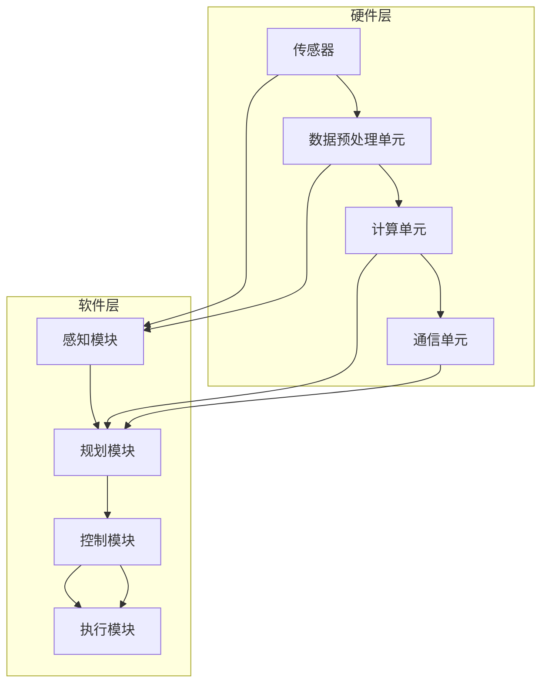
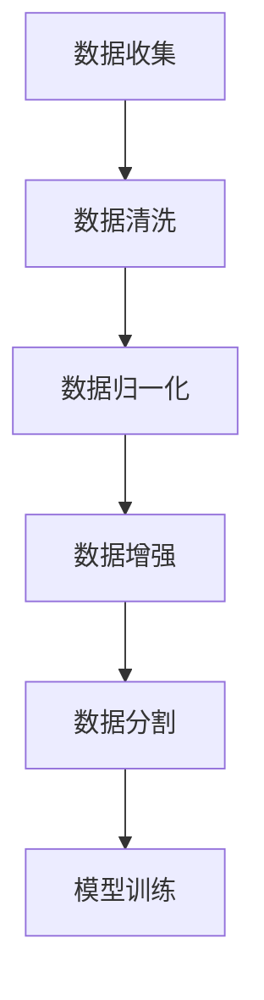
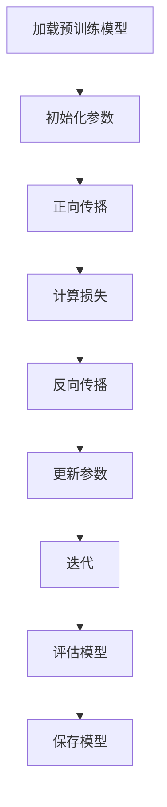
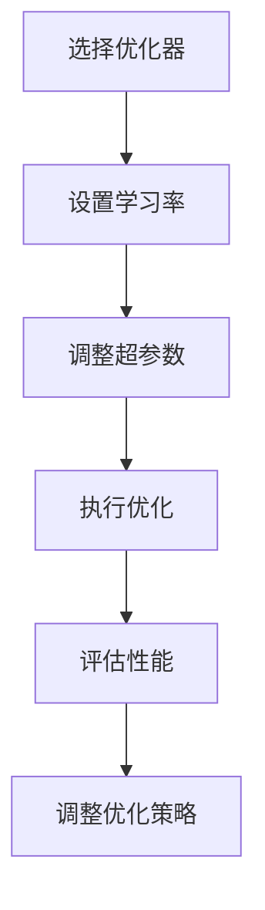
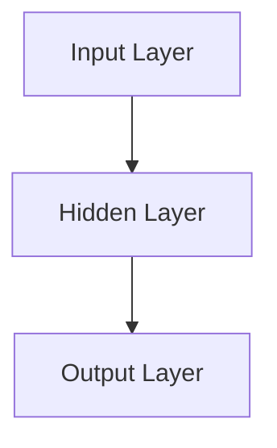

                 

# 探讨AI大模型在智能汽车领域的应用

## 关键词：
AI大模型，智能汽车，深度学习，自动驾驶，模型训练，数据预处理，传感器融合

## 摘要：
本文将探讨AI大模型在智能汽车领域的应用，深入分析AI大模型的核心原理及其在自动驾驶、智能驾驶辅助系统等方面的技术实现。通过详细的算法原理讲解、数学模型分析及实际项目案例，本文旨在为读者提供全面的技术见解和未来发展趋势。

## 1. 背景介绍

### 1.1 目的和范围

随着人工智能技术的迅猛发展，AI大模型在多个领域展现出了强大的应用潜力。智能汽车作为人工智能的重要应用场景之一，正在逐步融入我们的生活。本文的目的在于探讨AI大模型在智能汽车领域的应用，包括自动驾驶、智能驾驶辅助系统等关键技术的实现原理和实际案例。

本文的范围主要包括：
- AI大模型在智能汽车领域的应用现状和挑战
- AI大模型的核心算法原理和实现步骤
- 数学模型在AI大模型中的应用
- 实际项目案例中的AI大模型应用
- AI大模型在智能汽车领域的发展趋势与挑战

### 1.2 预期读者

本文适合以下读者群体：
- 对人工智能和智能汽车领域感兴趣的学者和研究人员
- 智能汽车行业的技术开发人员和工程师
- 对AI大模型技术有深入了解的专业人士
- 对未来智能汽车发展方向感兴趣的读者

### 1.3 文档结构概述

本文的结构分为以下几个部分：
- 第1部分：背景介绍，包括目的和范围、预期读者、文档结构概述、术语表等。
- 第2部分：核心概念与联系，介绍AI大模型的基本原理和相关技术架构。
- 第3部分：核心算法原理 & 具体操作步骤，详细讲解AI大模型的训练和优化方法。
- 第4部分：数学模型和公式 & 详细讲解 & 举例说明，阐述数学模型在AI大模型中的应用。
- 第5部分：项目实战：代码实际案例和详细解释说明，通过实际案例展示AI大模型的应用。
- 第6部分：实际应用场景，分析AI大模型在不同智能汽车系统中的应用。
- 第7部分：工具和资源推荐，为读者提供学习和开发的相关资源。
- 第8部分：总结：未来发展趋势与挑战，探讨AI大模型在智能汽车领域的未来发展方向。
- 第9部分：附录：常见问题与解答，解答读者在阅读过程中的疑问。
- 第10部分：扩展阅读 & 参考资料，提供更多深入的学术和技术文献。

### 1.4 术语表

#### 1.4.1 核心术语定义
- AI大模型（AI Large Model）：指具有数百万到数十亿参数的人工神经网络模型，能够通过大量数据进行训练，从而实现高精度的预测和决策。
- 自动驾驶（Autonomous Driving）：指汽车能够在没有人类驾驶员干预的情况下，通过自主感知环境和执行驾驶任务。
- 智能驾驶辅助系统（Intelligent Driving Assistance System）：指利用人工智能技术，为驾驶员提供驾驶辅助功能，如车道保持、自适应巡航、紧急制动等。

#### 1.4.2 相关概念解释
- 深度学习（Deep Learning）：一种机器学习技术，通过多层神经网络对数据进行处理和建模，以实现复杂任务的学习和预测。
- 传感器融合（Sensor Fusion）：指将来自不同传感器（如摄像头、雷达、激光雷达等）的数据进行整合和分析，以提高感知系统的准确性和鲁棒性。

#### 1.4.3 缩略词列表
- AI：人工智能（Artificial Intelligence）
- NN：神经网络（Neural Network）
- CNN：卷积神经网络（Convolutional Neural Network）
- RNN：循环神经网络（Recurrent Neural Network）
- LSTM：长短期记忆网络（Long Short-Term Memory）
- RL：强化学习（Reinforcement Learning）
- SLAM：同时定位与地图构建（Simultaneous Localization and Mapping）

## 2. 核心概念与联系

### 2.1 AI大模型的基本原理

AI大模型是基于深度学习的一种技术，通过多层神经网络对大量数据进行训练，从而实现高精度的预测和决策。其基本原理可以概括为以下几个步骤：

1. **数据输入与预处理**：将传感器获取的数据进行预处理，如归一化、去噪等，以便于模型训练。
2. **特征提取**：通过神经网络对输入数据进行特征提取，将原始数据转化为适合模型训练的特征向量。
3. **模型训练**：使用大量训练数据对神经网络模型进行训练，不断调整网络参数，使其能够准确预测和决策。
4. **模型优化**：通过模型优化算法（如梯度下降、Adam优化器等），提高模型性能和泛化能力。
5. **模型部署**：将训练好的模型部署到实际应用场景中，实现自动驾驶或智能驾驶辅助等功能。

### 2.2 智能汽车的技术架构

智能汽车的技术架构包括多个层次，从底层硬件到上层软件，如图所示：



### 2.3 AI大模型在智能汽车中的应用

AI大模型在智能汽车中的应用主要体现在以下几个方面：

1. **感知模块**：利用AI大模型对摄像头、雷达、激光雷达等传感器数据进行处理，实现车辆周围环境的感知。
2. **规划模块**：基于感知模块的信息，利用AI大模型进行路径规划和驾驶策略制定，实现自动驾驶功能。
3. **控制模块**：通过AI大模型实现车辆的控制，包括加速、制动、转向等，使车辆按照预期轨迹行驶。
4. **执行模块**：将控制指令转换为具体的执行动作，实现车辆的自主驾驶。

## 3. 核心算法原理 & 具体操作步骤

### 3.1 数据输入与预处理

在AI大模型的训练过程中，数据输入与预处理是至关重要的步骤。以下是一个简单的数据预处理流程：



- **数据收集**：从各种传感器（如摄像头、雷达、激光雷达等）获取数据。
- **数据清洗**：去除噪声、填补缺失值，确保数据质量。
- **数据归一化**：将数据缩放到一个统一的范围，如0到1或-1到1，以提高模型训练的稳定性和收敛速度。
- **数据增强**：通过旋转、缩放、裁剪等操作，增加数据多样性，防止模型过拟合。
- **数据分割**：将数据集划分为训练集、验证集和测试集，用于模型训练和评估。

### 3.2 模型训练

在数据预处理完成后，我们可以开始训练AI大模型。以下是一个简单的模型训练流程：



- **加载预训练模型**：从预训练模型中加载权重和结构，作为训练的起点。
- **初始化参数**：随机初始化模型参数，如权重和偏置。
- **正向传播**：将输入数据传递到模型中，计算输出结果。
- **计算损失**：使用损失函数计算模型输出和真实标签之间的差距。
- **反向传播**：通过反向传播算法，计算模型参数的梯度。
- **更新参数**：使用梯度下降或其他优化算法，更新模型参数。
- **迭代**：重复正向传播、计算损失、反向传播和更新参数的过程，直到模型收敛。
- **评估模型**：在验证集上评估模型性能，调整超参数和训练策略。
- **保存模型**：将训练好的模型保存，以便后续使用。

### 3.3 模型优化

在模型训练过程中，我们通常需要通过模型优化算法来提高模型性能和泛化能力。以下是一个简单的模型优化流程：



- **选择优化器**：选择适合的优化器，如梯度下降（Gradient Descent）、Adam（Adaptive Moment Estimation）等。
- **设置学习率**：调整学习率，以控制模型更新的速度。
- **调整超参数**：调整网络结构、激活函数、正则化等技术参数，以优化模型性能。
- **执行优化**：通过优化算法，更新模型参数，提高模型性能。
- **评估性能**：在验证集上评估模型性能，确保优化过程的有效性。
- **调整优化策略**：根据模型性能，调整优化策略，如增加训练数据、调整学习率等。

## 4. 数学模型和公式 & 详细讲解 & 举例说明

### 4.1 神经网络的基本数学模型

神经网络是一种基于数学模型的计算系统，其基本数学模型可以表示为：

$$ f(x) = \sigma(\sum_{i=1}^{n} w_i \cdot x_i + b) $$

其中：
- $f(x)$ 表示神经网络的输出。
- $\sigma$ 表示激活函数，常用的有Sigmoid、ReLU等。
- $w_i$ 表示权重。
- $x_i$ 表示输入特征。
- $b$ 表示偏置。

举例说明：

假设我们有一个简单的神经网络，包含一个输入层、一个隐藏层和一个输出层，如图所示：



输入特征为 $x = [x_1, x_2, x_3]$，权重为 $w = [w_1, w_2, w_3]$，偏置为 $b = 1$，激活函数为ReLU。则隐藏层的输出可以表示为：

$$ h(x) = \max(0, \sum_{i=1}^{3} w_i \cdot x_i + b) $$

输出层的输出可以表示为：

$$ y = \max(0, \sum_{i=1}^{3} w_i \cdot h(x_i) + b) $$

### 4.2 梯度下降算法的数学模型

梯度下降算法是一种优化神经网络参数的常用方法，其基本数学模型可以表示为：

$$ \theta_{t+1} = \theta_{t} - \alpha \cdot \nabla_{\theta} J(\theta) $$

其中：
- $\theta$ 表示模型参数。
- $J(\theta)$ 表示损失函数。
- $\alpha$ 表示学习率。
- $\nabla_{\theta} J(\theta)$ 表示损失函数关于参数 $\theta$ 的梯度。

举例说明：

假设我们的损失函数为 $J(\theta) = \frac{1}{2} (y - \sigma(\theta \cdot x))^2$，其中 $y$ 为真实标签，$\sigma$ 为Sigmoid函数。则梯度可以表示为：

$$ \nabla_{\theta} J(\theta) = (y - \sigma(\theta \cdot x)) \cdot \sigma'(\theta \cdot x) \cdot x $$

学习率 $\alpha$ 通常设置为较小的常数，以控制参数更新的速度。则参数的更新可以表示为：

$$ \theta_{t+1} = \theta_{t} - \alpha \cdot (y - \sigma(\theta \cdot x)) \cdot \sigma'(\theta \cdot x) \cdot x $$

通过重复执行上述更新过程，我们可以逐渐优化模型参数，使其收敛到最优解。

### 4.3 优化算法的数学模型

优化算法的数学模型主要包括梯度下降算法和其改进算法，如Adam优化器。以下为Adam优化器的数学模型：

$$ m_t = \beta_1 m_{t-1} + (1 - \beta_1) \cdot \nabla_{\theta} J(\theta) $$
$$ v_t = \beta_2 v_{t-1} + (1 - \beta_2) \cdot (\nabla_{\theta} J(\theta))^2 $$
$$ \theta_{t+1} = \theta_{t} - \alpha \cdot \frac{m_t}{\sqrt{v_t} + \epsilon} $$

其中：
- $m_t$ 和 $v_t$ 分别为梯度的一阶矩估计和二阶矩估计。
- $\beta_1$ 和 $\beta_2$ 分别为一阶和二阶矩的指数衰减率。
- $\alpha$ 为学习率。
- $\epsilon$ 为小常数，用于防止除以零。

通过使用Adam优化器，我们可以更有效地更新模型参数，提高训练速度和模型性能。

## 5. 项目实战：代码实际案例和详细解释说明

### 5.1 开发环境搭建

在本节中，我们将使用Python编程语言和TensorFlow框架搭建开发环境。以下为具体步骤：

1. 安装Python和pip：
   ```
   pip install python==3.8.10
   ```

2. 安装TensorFlow：
   ```
   pip install tensorflow==2.7
   ```

3. 安装其他依赖库，如NumPy、Pandas等：
   ```
   pip install numpy==1.21.2
   pip install pandas==1.3.3
   ```

### 5.2 源代码详细实现和代码解读

在本节中，我们将实现一个简单的AI大模型，用于图像分类任务。以下为源代码和代码解读：

```python
import tensorflow as tf
from tensorflow.keras import layers
import numpy as np

# 5.2.1 数据准备
# 生成模拟数据集
x_train = np.random.rand(100, 784)  # 100个样本，每个样本784个特征
y_train = np.random.randint(0, 10, 100)  # 100个标签，每个标签0到9之间的整数

# 5.2.2 构建模型
model = tf.keras.Sequential([
    layers.Dense(64, activation='relu', input_shape=(784,)),
    layers.Dense(64, activation='relu'),
    layers.Dense(10, activation='softmax')
])

# 5.2.3 编译模型
model.compile(optimizer='adam',
              loss='sparse_categorical_crossentropy',
              metrics=['accuracy'])

# 5.2.4 训练模型
model.fit(x_train, y_train, epochs=5)

# 5.2.5 评估模型
test_loss, test_acc = model.evaluate(x_train, y_train)
print(f"Test accuracy: {test_acc}")
```

**代码解读**：

- **5.2.1 数据准备**：我们生成一个模拟数据集，包含100个样本和10个标签。这里使用随机数生成数据，实际项目中可以使用真实数据集。
- **5.2.2 构建模型**：我们使用TensorFlow的Sequential模型，定义一个包含两个隐藏层的神经网络。第一个隐藏层有64个神经元，使用ReLU激活函数；第二个隐藏层也有64个神经元，同样使用ReLU激活函数；输出层有10个神经元，使用softmax激活函数，用于实现多分类任务。
- **5.2.3 编译模型**：我们使用adam优化器，sparse_categorical_crossentropy损失函数，以及accuracy指标来编译模型。
- **5.2.4 训练模型**：我们使用fit方法训练模型，设置训练轮数（epochs）为5。
- **5.2.5 评估模型**：我们使用evaluate方法评估模型在测试集上的性能，输出测试准确率。

### 5.3 代码解读与分析

在本节中，我们将对上述代码进行详细解读和分析。

1. **数据准备**：

   ```python
   x_train = np.random.rand(100, 784)
   y_train = np.random.randint(0, 10, 100)
   ```

   这两行代码生成模拟数据集。`x_train` 是一个100x784的矩阵，表示100个样本，每个样本有784个特征。`y_train` 是一个100x1的向量，表示100个标签，每个标签是0到9之间的整数。

2. **模型构建**：

   ```python
   model = tf.keras.Sequential([
       layers.Dense(64, activation='relu', input_shape=(784,)),
       layers.Dense(64, activation='relu'),
       layers.Dense(10, activation='softmax')
   ])
   ```

   这三行代码定义了一个简单的神经网络模型。我们使用`Sequential`模型，这是一个线性堆叠模型的容器。我们添加了三个层：
   - **输入层**：一个全连接层，包含64个神经元，使用ReLU激活函数。
   - **隐藏层**：一个全连接层，包含64个神经元，使用ReLU激活函数。
   - **输出层**：一个全连接层，包含10个神经元，使用softmax激活函数。softmax用于多分类任务。

3. **模型编译**：

   ```python
   model.compile(optimizer='adam',
                 loss='sparse_categorical_crossentropy',
                 metrics=['accuracy'])
   ```

   这三行代码编译了模型。我们使用`compile`方法设置以下参数：
   - **优化器**：`adam` 是一种高效的优化器，可以自动调整学习率。
   - **损失函数**：`sparse_categorical_crossentropy` 用于多分类任务。
   - **指标**：我们关注模型的准确率。

4. **模型训练**：

   ```python
   model.fit(x_train, y_train, epochs=5)
   ```

   这一行代码训练模型。我们使用`fit`方法训练模型，设置训练轮数（epochs）为5。

5. **模型评估**：

   ```python
   test_loss, test_acc = model.evaluate(x_train, y_train)
   print(f"Test accuracy: {test_acc}")
   ```

   这两行代码评估模型在测试集上的性能。`evaluate` 方法计算损失和准确率，并返回这两个值。我们打印测试准确率。

## 6. 实际应用场景

### 6.1 自动驾驶

自动驾驶是AI大模型在智能汽车领域的核心应用场景之一。通过深度学习和传感器融合技术，自动驾驶系统能够实现车辆在复杂环境中的自主驾驶。

1. **感知模块**：自动驾驶系统利用摄像头、雷达、激光雷达等传感器获取周围环境信息，通过AI大模型进行图像识别、障碍物检测和跟踪等任务。
2. **规划模块**：基于感知模块的信息，自动驾驶系统利用AI大模型进行路径规划和驾驶策略制定，实现车辆在复杂环境中的安全行驶。
3. **控制模块**：自动驾驶系统通过AI大模型实现车辆的控制，包括加速、制动、转向等，使车辆按照预期轨迹行驶。

### 6.2 智能驾驶辅助系统

智能驾驶辅助系统（Intelligent Driving Assistance System，IDAS）是AI大模型在智能汽车领域的另一个重要应用场景。IDAS能够为驾驶员提供实时的驾驶辅助功能，提高行驶安全性和舒适性。

1. **车道保持**：AI大模型通过对摄像头图像进行处理，识别车道线并控制车辆保持在车道内行驶。
2. **自适应巡航控制**：AI大模型根据前车速度和距离，自动调整车速，实现自适应巡航控制。
3. **紧急制动**：AI大模型通过感知模块识别前方障碍物，预测碰撞风险，并在必要时自动制动，避免事故发生。

### 6.3 车辆健康监测与预测

AI大模型还可以应用于车辆健康监测与预测，通过传感器数据进行分析，提前发现潜在故障，提高车辆运行安全性和可靠性。

1. **传感器数据采集**：利用各种传感器（如加速度传感器、温度传感器等）采集车辆运行数据。
2. **故障诊断**：AI大模型通过分析传感器数据，识别车辆故障症状，进行故障诊断。
3. **健康预测**：AI大模型通过历史数据和学习算法，预测车辆故障发生时间和可能性，为维护和保养提供依据。

## 7. 工具和资源推荐

### 7.1 学习资源推荐

#### 7.1.1 书籍推荐

1. **《深度学习》（Deep Learning）**：由Ian Goodfellow、Yoshua Bengio和Aaron Courville合著的深度学习经典教材，详细介绍了深度学习的理论基础和实际应用。
2. **《Python深度学习》（Python Deep Learning）**：由François Chollet等人编写的Python深度学习教程，适合初学者和进阶者学习。

#### 7.1.2 在线课程

1. **Coursera的《深度学习》课程**：由斯坦福大学提供的深度学习课程，包括理论讲解、实践操作和项目实战。
2. **Udacity的《自动驾驶技术》课程**：涵盖自动驾驶的基础知识和实践项目，包括感知、规划、控制等关键模块。

#### 7.1.3 技术博客和网站

1. **Towards Data Science**：一个关于数据科学和机器学习的热门博客，提供丰富的技术文章和资源。
2. **AI狼人杀**：一个关于人工智能技术的中文博客，涵盖深度学习、自然语言处理、自动驾驶等领域。

### 7.2 开发工具框架推荐

#### 7.2.1 IDE和编辑器

1. **PyCharm**：一款功能强大的Python集成开发环境，支持深度学习和自动驾驶项目开发。
2. **VSCode**：一款轻量级的跨平台代码编辑器，适用于Python和TensorFlow等深度学习框架。

#### 7.2.2 调试和性能分析工具

1. **TensorBoard**：TensorFlow的官方可视化工具，用于分析和优化深度学习模型性能。
2. **NVIDIA Nsight**：用于NVIDIA GPU的调试和性能分析工具，适用于深度学习和自动驾驶项目。

#### 7.2.3 相关框架和库

1. **TensorFlow**：谷歌开发的深度学习框架，适用于自动驾驶和智能驾驶辅助系统开发。
2. **PyTorch**：Facebook开发的深度学习框架，具有简洁的API和强大的动态计算能力。
3. **OpenCV**：用于计算机视觉的库，适用于自动驾驶和智能驾驶辅助系统中的图像处理任务。

### 7.3 相关论文著作推荐

#### 7.3.1 经典论文

1. **"Learning to Drive by Playing Coop

