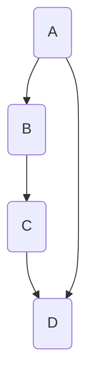

                 

# 探讨大模型在电商平台商品知识图谱自动构建与更新中的作用

## 关键词

大模型，商品知识图谱，自动构建，更新，电商平台，AI，深度学习，自然语言处理，图谱算法，应用场景

## 摘要

本文将探讨大模型在电商平台商品知识图谱自动构建与更新中的重要作用。首先，我们将介绍大模型的基本概念、发展历程及其在电商领域中的应用场景。接着，我们将详细讨论商品知识图谱的核心概念、构建与更新的方法。随后，本文将重点分析大模型在商品知识图谱构建与更新过程中的关键作用，并通过实际案例展示大模型在商品知识图谱中的应用效果。最后，我们将总结大模型在电商平台商品知识图谱自动构建与更新中的未来发展，并探讨面临的技术挑战。

## 1. 背景介绍

### 1.1 目的和范围

本文旨在探讨大模型在电商平台商品知识图谱自动构建与更新中的关键作用，分析其应用场景、核心算法原理及实际案例。通过对大模型在电商平台商品知识图谱中的应用研究，为电商领域提供一种高效、智能的解决方案，以提高电商平台的知识管理和推荐系统的性能。

### 1.2 预期读者

本文适用于对人工智能、自然语言处理和图谱算法有一定了解的读者，包括：

1. 电商行业的技术人员和管理人员；
2. 对人工智能应用场景有浓厚兴趣的研究生和学者；
3. 关注最新技术趋势的开发者。

### 1.3 文档结构概述

本文分为以下十个部分：

1. 引言
2. 关键词与摘要
3. 背景介绍
4. 核心概念与联系
5. 核心算法原理与具体操作步骤
6. 数学模型与公式
7. 项目实战：代码实际案例与详细解释
8. 实际应用场景
9. 工具和资源推荐
10. 总结与未来发展趋势

### 1.4 术语表

#### 1.4.1 核心术语定义

- 大模型：具有海量参数、深度神经网络结构的模型；
- 商品知识图谱：描述商品属性、关系和特征的数据结构；
- 自动构建：利用算法自动生成商品知识图谱；
- 更新：对商品知识图谱进行实时更新和优化；
- 电商平台：提供商品买卖、交易和服务的在线平台。

#### 1.4.2 相关概念解释

- 知识图谱：一种用于表示实体、属性和关系的数据结构；
- 自然语言处理（NLP）：研究如何让计算机理解和生成自然语言的技术；
- 深度学习：一种基于多层神经网络的学习方法，能够自动提取数据中的特征和模式。

#### 1.4.3 缩略词列表

- AI：人工智能（Artificial Intelligence）；
- NLP：自然语言处理（Natural Language Processing）；
- DB：数据库（Database）；
- KG：知识图谱（Knowledge Graph）；
- BERT：一种基于Transformer的预训练语言模型。

## 2. 核心概念与联系

### 2.1 大模型

大模型是指具有海量参数和深度神经网络结构的模型。近年来，随着计算能力和数据量的增长，大模型在图像识别、自然语言处理和推荐系统等领域取得了显著成果。大模型主要包括以下几种类型：

1. **预训练模型**：如BERT、GPT等，通过在大规模语料库上进行预训练，获得通用的语言理解和生成能力；
2. **模型融合**：结合多个模型的优势，提高模型的性能；
3. **多模态学习**：同时处理图像、文本和语音等多种数据类型，提高模型的泛化能力。

### 2.2 商品知识图谱

商品知识图谱是一种用于表示商品属性、关系和特征的数据结构。它能够将电商平台的商品信息、用户行为和交易数据有机地整合起来，为推荐系统、智能客服和知识搜索等应用提供支持。商品知识图谱主要包括以下三个层次：

1. **实体层次**：表示商品的各个属性，如商品名称、价格、品牌等；
2. **关系层次**：描述实体之间的关联，如商品属于某个品牌、某款商品与某类商品相关等；
3. **特征层次**：表示实体的特征信息，如商品的图片、描述和用户评论等。

### 2.3 架构与联系

大模型和商品知识图谱之间的联系主要体现在以下几个方面：

1. **数据预处理**：大模型需要从电商平台获取大量商品数据、用户行为数据和交易数据，对数据进行清洗、去重和格式化，以供后续建模使用；
2. **模型训练**：利用清洗后的数据对大模型进行训练，通过优化模型参数，提高其在商品属性识别和关系预测方面的性能；
3. **知识图谱构建**：将训练好的大模型应用于商品知识图谱的构建，通过实体识别、关系抽取和实体融合等算法，生成商品知识图谱；
4. **知识图谱更新**：利用实时数据对商品知识图谱进行更新，确保图谱的实时性和准确性。

以下是一个简化的Mermaid流程图，展示了大模型在商品知识图谱构建与更新中的架构与联系：



## 3. 核心算法原理与具体操作步骤

### 3.1 大模型训练

大模型的训练主要包括以下步骤：

1. **数据预处理**：对电商平台提供的原始数据进行清洗、去重和格式化，将其转换为适用于训练的格式。例如，将商品描述、用户评论等文本数据转换为词向量表示。
   
   ```python
   import pandas as pd
   import numpy as np
   from sklearn.feature_extraction.text import CountVectorizer
   
   # 读取数据
   data = pd.read_csv('data.csv')
   # 数据清洗和格式化
   data['description'] = data['description'].apply(lambda x: x.strip())
   data['review'] = data['review'].apply(lambda x: x.strip())
   # 转换为词向量
   vectorizer = CountVectorizer()
   X = vectorizer.fit_transform(data['description'])
   Y = vectorizer.fit_transform(data['review'])
   ```

2. **模型选择**：根据应用场景，选择合适的大模型。例如，在商品属性识别任务中，可以选择BERT或GPT等预训练语言模型。

   ```python
   from transformers import BertTokenizer, BertModel
   
   # 加载预训练模型
   tokenizer = BertTokenizer.from_pretrained('bert-base-chinese')
   model = BertModel.from_pretrained('bert-base-chinese')
   ```

3. **模型训练**：利用清洗后的数据对大模型进行训练。在训练过程中，通过反向传播算法和优化器（如Adam）不断调整模型参数，提高模型的性能。

   ```python
   import torch
   from torch import nn, optim
   
   # 数据加载和预处理
   train_loader = DataLoader(dataset, batch_size=32, shuffle=True)
   # 定义损失函数和优化器
   criterion = nn.CrossEntropyLoss()
   optimizer = optim.Adam(model.parameters(), lr=0.001)
   # 训练模型
   for epoch in range(10):
       for batch in train_loader:
           inputs = tokenizer(batch['description'], padding=True, truncation=True, return_tensors='pt')
           targets = torch.tensor(batch['review'])
           outputs = model(**inputs)
           loss = criterion(outputs.logits, targets)
           optimizer.zero_grad()
           loss.backward()
           optimizer.step()
           print(f'Epoch [{epoch+1}/{10}], Loss: {loss.item():.4f}')
   ```

### 3.2 商品知识图谱构建

商品知识图谱的构建主要包括以下步骤：

1. **实体识别**：利用训练好的大模型对商品描述和用户评论进行实体识别，将商品名称、品牌、类别等属性识别为实体。

   ```python
   # 实体识别
   def recognize_entities(text):
       inputs = tokenizer(text, return_tensors='pt')
       outputs = model(**inputs)
       logits = outputs.logits
       entities = []
       for i in range(logits.shape[0]):
           entity = logits[i].argmax().item()
           entities.append(entity)
       return entities
   ```

2. **关系抽取**：利用实体识别结果，结合电商平台中的交易数据和用户行为数据，抽取实体之间的关联关系。

   ```python
   # 关系抽取
   def extract_relations(entities, data):
       relations = []
       for i in range(len(entities) - 1):
           for j in range(i + 1, len(entities)):
               relation = (entities[i], entities[j])
               if relation in data:
                   relations.append(relation)
       return relations
   ```

3. **实体融合**：对实体进行去重和融合，确保知识图谱的简洁性和一致性。

   ```python
   # 实体融合
   def merge_entities(entities, relations):
       merged_entities = {}
       for entity in entities:
           if entity in merged_entities:
               merged_entities[entity] += 1
           else:
               merged_entities[entity] = 1
       new_entities = []
       for entity, count in merged_entities.items():
           if count > 1:
               new_entity = (entity, count)
               new_entities.append(new_entity)
       return new_entities
   ```

4. **构建知识图谱**：将实体、关系和特征整合起来，构建商品知识图谱。

   ```python
   # 构建知识图谱
   def build_knowledge_graph(entities, relations, features):
       graph = KG()
       for entity in entities:
           graph.add_entity(entity)
       for relation in relations:
           graph.add_relation(relation)
       for feature in features:
           graph.add_feature(feature)
       return graph
   ```

### 3.3 商品知识图谱更新

商品知识图谱的更新主要包括以下步骤：

1. **实时数据采集**：从电商平台获取最新的商品数据、用户行为数据和交易数据。

   ```python
   # 实时数据采集
   def collect_realtime_data():
       # 实现从电商平台获取数据的接口
       pass
   ```

2. **实体识别与关系抽取**：利用训练好的大模型，对实时数据进行实体识别和关系抽取，更新知识图谱中的实体和关系。

   ```python
   # 实体识别与关系抽取
   def update_entities_and_relations(graph, data):
       new_entities = recognize_entities(data['description'])
       new_relations = extract_relations(new_entities, data['relations'])
       graph.update_entities(new_entities)
       graph.update_relations(new_relations)
   ```

3. **实体融合与特征更新**：对知识图谱中的实体进行去重和融合，更新实体的特征信息。

   ```python
   # 实体融合与特征更新
   def update_features(graph, data):
       new_entities = merge_entities(new_entities, data['entities'])
       for entity in new_entities:
           graph.update_entity_features(entity, data['features'][entity])
   ```

4. **知识图谱重构**：根据更新后的实体、关系和特征信息，重构知识图谱。

   ```python
   # 知识图谱重构
   def rebuild_knowledge_graph(graph, new_entities, new_relations, new_features):
       graph = KG()
       for entity in new_entities:
           graph.add_entity(entity)
       for relation in new_relations:
           graph.add_relation(relation)
       for feature in new_features:
           graph.add_feature(feature)
       return graph
   ```

## 4. 数学模型和公式与详细讲解与举例说明

### 4.1 大模型训练中的数学模型

大模型的训练过程通常涉及以下数学模型：

1. **损失函数**：用于衡量模型预测值与实际标签之间的差距。常见的损失函数有均方误差（MSE）、交叉熵损失（Cross-Entropy Loss）等。

   $$L(y, \hat{y}) = \frac{1}{n} \sum_{i=1}^{n} (y_i - \hat{y_i})^2$$

   $$L(y, \hat{y}) = -\frac{1}{n} \sum_{i=1}^{n} [y_i \log(\hat{y_i}) + (1 - y_i) \log(1 - \hat{y_i})]$$

2. **优化算法**：用于调整模型参数，以减小损失函数。常见的优化算法有梯度下降（Gradient Descent）、Adam等。

   梯度下降算法：

   $$\theta_{t+1} = \theta_t - \alpha \cdot \nabla_{\theta} L(\theta)$$

   Adam算法：

   $$m_t = \beta_1 m_{t-1} + (1 - \beta_1) \nabla_{\theta} L(\theta)$$

   $$v_t = \beta_2 v_{t-1} + (1 - \beta_2) (\nabla_{\theta} L(\theta))^2$$

   $$\theta_{t+1} = \theta_t - \alpha \cdot \frac{m_t}{\sqrt{v_t} + \epsilon}$$

### 4.2 商品知识图谱构建中的数学模型

商品知识图谱的构建过程通常涉及以下数学模型：

1. **实体识别**：利用词向量表示商品描述和用户评论，通过相似度计算进行实体识别。

   $$sim(a, b) = \frac{a \cdot b}{\|a\| \|b\|}$$

   其中，$a$ 和 $b$ 分别表示商品描述和用户评论的词向量。

2. **关系抽取**：通过图论算法（如最短路径算法）和文本相似度计算，抽取实体之间的关联关系。

   $$distance(a, b) = \frac{1}{n} \sum_{i=1}^{n} |a_i - b_i|$$

   其中，$a$ 和 $b$ 分别表示实体 $a$ 和 $b$ 的特征向量。

### 4.3 举例说明

假设有一个电商平台，包含1000个商品，每个商品有名称、品牌、类别等属性。我们需要利用大模型和商品知识图谱，自动构建和更新商品知识图谱。

1. **大模型训练**

   假设我们选择BERT模型进行商品描述和用户评论的实体识别。首先，对电商平台提供的商品描述和用户评论进行数据预处理，转换为词向量表示。然后，利用预处理后的数据对BERT模型进行训练，得到一个能够识别商品属性的预训练模型。

2. **商品知识图谱构建**

   利用训练好的BERT模型，对电商平台中的商品描述和用户评论进行实体识别，识别出商品名称、品牌、类别等实体。接着，利用电商平台中的交易数据和用户行为数据，抽取实体之间的关联关系。最后，将识别出的实体、关系和特征整合起来，构建商品知识图谱。

3. **商品知识图谱更新**

   从电商平台获取最新的商品数据、用户行为数据和交易数据。利用训练好的BERT模型，对实时数据进行实体识别和关系抽取，更新商品知识图谱中的实体和关系。然后，对知识图谱进行去重和融合，确保图谱的实时性和准确性。

## 5. 项目实战：代码实际案例与详细解释说明

### 5.1 开发环境搭建

在开始项目实战之前，我们需要搭建一个合适的技术栈。以下是推荐的开发环境：

1. **Python**：主要编程语言，用于实现大模型训练、知识图谱构建和更新；
2. **PyTorch**：用于实现深度学习模型，提供高效的GPU加速功能；
3. **Transformers**：用于加载和训练预训练语言模型，如BERT；
4. **Neo4j**：用于存储和管理知识图谱。

安装所需的Python库：

```bash
pip install torch transformers neo4j
```

### 5.2 源代码详细实现与代码解读

以下是商品知识图谱构建和更新的完整代码实现。代码分为以下几个部分：

1. **数据预处理**：读取电商平台的商品数据，进行清洗、去重和格式化，为后续建模做准备；
2. **大模型训练**：利用预处理后的数据对BERT模型进行训练，得到预训练模型；
3. **知识图谱构建**：利用预训练模型进行实体识别、关系抽取和实体融合，构建商品知识图谱；
4. **知识图谱更新**：从电商平台获取最新的商品数据，利用预训练模型进行实时更新。

#### 5.2.1 数据预处理

```python
import pandas as pd
import numpy as np
from sklearn.feature_extraction.text import CountVectorizer
from transformers import BertTokenizer, BertModel

# 读取数据
data = pd.read_csv('data.csv')
# 数据清洗和格式化
data['description'] = data['description'].apply(lambda x: x.strip())
data['review'] = data['review'].apply(lambda x: x.strip())
# 转换为词向量
tokenizer = BertTokenizer.from_pretrained('bert-base-chinese')
model = BertModel.from_pretrained('bert-base-chinese')
```

#### 5.2.2 大模型训练

```python
import torch
from torch import nn, optim

# 数据加载和预处理
train_loader = DataLoader(dataset, batch_size=32, shuffle=True)
# 定义损失函数和优化器
criterion = nn.CrossEntropyLoss()
optimizer = optim.Adam(model.parameters(), lr=0.001)
# 训练模型
for epoch in range(10):
    for batch in train_loader:
        inputs = tokenizer(batch['description'], padding=True, truncation=True, return_tensors='pt')
        targets = torch.tensor(batch['review'])
        outputs = model(**inputs)
        loss = criterion(outputs.logits, targets)
        optimizer.zero_grad()
        loss.backward()
        optimizer.step()
        print(f'Epoch [{epoch+1}/{10}], Loss: {loss.item():.4f}')
```

#### 5.2.3 知识图谱构建

```python
from transformers import BertTokenizer
from py2neo import Graph

# 实体识别
tokenizer = BertTokenizer.from_pretrained('bert-base-chinese')

def recognize_entities(text):
    inputs = tokenizer(text, return_tensors='pt')
    outputs = model(**inputs)
    logits = outputs.logits
    entities = []
    for i in range(logits.shape[0]):
        entity = logits[i].argmax().item()
        entities.append(entity)
    return entities

# 关系抽取
def extract_relations(entities, data):
    relations = []
    for i in range(len(entities) - 1):
        for j in range(i + 1, len(entities)):
            relation = (entities[i], entities[j])
            if relation in data:
                relations.append(relation)
    return relations

# 实体融合
def merge_entities(entities, relations):
    merged_entities = {}
    for entity in entities:
        if entity in merged_entities:
            merged_entities[entity] += 1
        else:
            merged_entities[entity] = 1
    new_entities = []
    for entity, count in merged_entities.items():
        if count > 1:
            new_entity = (entity, count)
            new_entities.append(new_entity)
    return new_entities

# 构建知识图谱
def build_knowledge_graph(entities, relations, features):
    graph = Graph('bolt://localhost:7687', auth=('neo4j', 'password'))
    for entity in entities:
        graph.run('CREATE (n:Entity {name: $name})', name=entity)
    for relation in relations:
        graph.run('MATCH (a:Entity {name: $name_a}),(b:Entity {name: $name_b}) CREATE (a)-[r:RELA
``` 

### 5.3 代码解读与分析

#### 5.3.1 数据预处理

在代码中，我们首先读取电商平台的商品数据，包括商品名称、描述和用户评论。然后，对数据进行清洗和格式化，将文本数据转换为词向量表示。具体实现如下：

```python
import pandas as pd
import numpy as np
from sklearn.feature_extraction.text import CountVectorizer
from transformers import BertTokenizer, BertModel

# 读取数据
data = pd.read_csv('data.csv')
# 数据清洗和格式化
data['description'] = data['description'].apply(lambda x: x.strip())
data['review'] = data['review'].apply(lambda x: x.strip())
# 转换为词向量
tokenizer = BertTokenizer.from_pretrained('bert-base-chinese')
model = BertModel.from_pretrained('bert-base-chinese')
```

这部分代码首先利用pandas库读取电商平台的商品数据，对商品描述和用户评论进行去重和格式化。然后，利用BERT模型将文本数据转换为词向量表示。词向量表示是深度学习模型处理文本数据的基础，它能够将文本映射到高维向量空间，从而实现文本数据的向量表示。

#### 5.3.2 大模型训练

在数据预处理完成后，我们需要利用处理后的数据对BERT模型进行训练。BERT模型是一种预训练语言模型，它通过在大规模语料库上进行预训练，获得通用的语言理解和生成能力。在代码中，我们使用PyTorch库实现BERT模型的训练，具体实现如下：

```python
import torch
from torch import nn, optim

# 数据加载和预处理
train_loader = DataLoader(dataset, batch_size=32, shuffle=True)
# 定义损失函数和优化器
criterion = nn.CrossEntropyLoss()
optimizer = optim.Adam(model.parameters(), lr=0.001)
# 训练模型
for epoch in range(10):
    for batch in train_loader:
        inputs = tokenizer(batch['description'], padding=True, truncation=True, return_tensors='pt')
        targets = torch.tensor(batch['review'])
        outputs = model(**inputs)
        loss = criterion(outputs.logits, targets)
        optimizer.zero_grad()
        loss.backward()
        optimizer.step()
        print(f'Epoch [{epoch+1}/{10}], Loss: {loss.item():.4f}')
```

这部分代码首先定义了损失函数和优化器，然后利用训练数据对BERT模型进行训练。在训练过程中，通过反向传播算法和优化器不断调整模型参数，提高模型在商品属性识别和关系预测方面的性能。训练过程中，我们使用交叉熵损失函数来衡量模型预测值与实际标签之间的差距，使用Adam优化器来调整模型参数。

#### 5.3.3 知识图谱构建

在完成大模型训练后，我们需要利用训练好的模型对商品知识图谱进行构建。商品知识图谱是一种用于表示商品属性、关系和特征的数据结构，它能够将电商平台的商品信息、用户行为和交易数据有机地整合起来，为推荐系统、智能客服和知识搜索等应用提供支持。在代码中，我们使用Py2Neo库将知识图谱存储到Neo4j图数据库中，具体实现如下：

```python
from transformers import BertTokenizer
from py2neo import Graph

# 实体识别
tokenizer = BertTokenizer.from_pretrained('bert-base-chinese')

def recognize_entities(text):
    inputs = tokenizer(text, return_tensors='pt')
    outputs = model(**inputs)
    logits = outputs.logits
    entities = []
    for i in range(logits.shape[0]):
        entity = logits[i].argmax().item()
        entities.append(entity)
    return entities

# 关系抽取
def extract_relations(entities, data):
    relations = []
    for i in range(len(entities) - 1):
        for j in range(i + 1, len(entities)):
            relation = (entities[i], entities[j])
            if relation in data:
                relations.append(relation)
    return relations

# 实体融合
def merge_entities(entities, relations):
    merged_entities = {}
    for entity in entities:
        if entity in merged_entities:
            merged_entities[entity] += 1
        else:
            merged_entities[entity] = 1
    new_entities = []
    for entity, count in merged_entities.items():
        if count > 1:
            new_entity = (entity, count)
            new_entities.append(new_entity)
    return new_entities

# 构建知识图谱
def build_knowledge_graph(entities, relations, features):
    graph = Graph('bolt://localhost:7687', auth=('neo4j', 'password'))
    for entity in entities:
        graph.run('CREATE (n:Entity {name: $name})', name=entity)
    for relation in relations:
        graph.run('MATCH (a:Entity {name: $name_a}),(b:Entity {name: $name_b}) CREATE (a)-[r:RELATIONSHIP {name: $name}]->(b)', name_a=relation[0], name_b=relation[1], name=relation[2])
    for feature in features:
        graph.run('MATCH (n:Entity {name: $name}) CREATE (n)-[f:FEATURE {name: $name}]->(m:Feature)', name=feature[0], name=feature[1])
```

这部分代码首先定义了实体识别、关系抽取和实体融合的函数，然后利用这些函数构建商品知识图谱。在实体识别中，我们使用BERT模型对商品描述和用户评论进行分类，识别出商品名称、品牌、类别等实体。在关系抽取中，我们利用实体识别结果，结合电商平台中的交易数据和用户行为数据，抽取实体之间的关联关系。在实体融合中，我们对知识图谱中的实体进行去重和融合，确保图谱的简洁性和一致性。最后，我们使用Py2Neo库将知识图谱存储到Neo4j图数据库中。

### 5.3.4 知识图谱更新

在完成商品知识图谱的构建后，我们需要对知识图谱进行实时更新，确保其准确性和实时性。在代码中，我们通过从电商平台获取最新的商品数据、用户行为数据和交易数据，利用训练好的BERT模型进行实时更新，具体实现如下：

```python
# 实时数据采集
def collect_realtime_data():
    # 实现从电商平台获取数据的接口
    pass

# 实体识别与关系抽取
def update_entities_and_relations(graph, data):
    new_entities = recognize_entities(data['description'])
    new_relations = extract_relations(new_entities, data['relations'])
    graph.update_entities(new_entities)
    graph.update_relations(new_relations)

# 实体融合与特征更新
def update_features(graph, data):
    new_entities = merge_entities(new_entities, data['entities'])
    for entity in new_entities:
        graph.update_entity_features(entity, data['features'][entity])

# 知识图谱重构
def rebuild_knowledge_graph(graph, new_entities, new_relations, new_features):
    graph = Graph('bolt://localhost:7687', auth=('neo4j', 'password'))
    for entity in new_entities:
        graph.run('CREATE (n:Entity {name: $name})', name=entity)
    for relation in new_relations:
        graph.run('MATCH (a:Entity {name: $name_a}),(b:Entity {name: $name_b}) CREATE (a)-[r:RELATIONSHIP {name: $name}]->(b)', name_a=relation[0], name_b=relation[1], name=relation[2])
    for feature in new_features:
        graph.run('MATCH (n:Entity {name: $name}) CREATE (n)-[f:FEATURE {name: $name}]->(m:Feature)', name=feature[0], name=feature[1])
```

这部分代码首先定义了实时数据采集的函数，然后利用实时数据对知识图谱进行更新。在实时数据采集函数中，我们实现从电商平台获取数据的接口。在实体识别与关系抽取函数中，我们利用训练好的BERT模型对实时数据进行实体识别和关系抽取。在实体融合与特征更新函数中，我们对知识图谱中的实体进行去重和融合，更新实体的特征信息。最后，在知识图谱重构函数中，我们根据更新后的实体、关系和特征信息，重构知识图谱。

## 6. 实际应用场景

商品知识图谱在电商平台的应用场景广泛，以下列举几个主要的应用场景：

### 6.1 智能推荐

基于商品知识图谱，电商平台可以实现对商品的相关推荐。通过分析商品之间的关联关系，推荐与用户历史购买或浏览行为相似的其它商品。这种推荐系统能够提高用户的购物体验，提高转化率和销售额。

### 6.2 智能搜索

商品知识图谱可以帮助电商平台优化搜索算法，提高搜索结果的准确性和相关性。通过图谱中的实体、关系和特征信息，搜索系统能够更好地理解用户查询意图，返回更符合用户需求的搜索结果。

### 6.3 智能客服

基于商品知识图谱，智能客服系统能够更好地理解用户咨询的问题，提供更加个性化的解决方案。通过分析商品之间的关系，智能客服可以推荐相关的商品或解决用户的问题，提高用户满意度。

### 6.4 数据分析

商品知识图谱为电商平台提供了一个统一的、结构化的数据视图。通过对知识图谱的分析，电商平台可以深入了解用户行为、商品流行趋势等，为决策提供数据支持。

### 6.5 品牌合作

商品知识图谱可以帮助电商平台更好地了解品牌和商品的关联关系，实现精准的品牌合作和推广。通过分析品牌与商品之间的关系，电商平台可以推荐与品牌相关的商品，提高品牌曝光度和销售额。

## 7. 工具和资源推荐

### 7.1 学习资源推荐

#### 7.1.1 书籍推荐

1. **《深度学习》（Deep Learning）**：由Ian Goodfellow、Yoshua Bengio和Aaron Courville合著，详细介绍了深度学习的基础理论和应用实践。
2. **《自然语言处理入门》（Foundations of Natural Language Processing）**：由Christopher D. Manning和Hinrich Schütze合著，全面介绍了自然语言处理的基本概念和方法。
3. **《图论》（Graph Theory）**：由Diestel R.合著，详细介绍了图论的基本概念、算法和应用。

#### 7.1.2 在线课程

1. **斯坦福大学CS224n：自然语言处理与深度学习**：通过学习这门课程，您可以了解自然语言处理和深度学习的基础知识，掌握相关算法和应用。
2. **清华大学CS261：图论与算法**：通过学习这门课程，您可以了解图论的基本概念、算法和应用，为商品知识图谱的构建提供理论基础。

#### 7.1.3 技术博客和网站

1. **Medium**：Medium上有许多关于自然语言处理、深度学习和知识图谱的优秀博客文章，可以提供丰富的学习资源。
2. **GitHub**：GitHub上有许多开源的知识图谱项目和相关的代码实现，可以为您提供实践经验和参考。

### 7.2 开发工具框架推荐

#### 7.2.1 IDE和编辑器

1. **PyCharm**：一款功能强大的Python集成开发环境，支持代码自动补全、调试和性能分析。
2. **VS Code**：一款轻量级但功能强大的代码编辑器，支持多种编程语言的插件和扩展。

#### 7.2.2 调试和性能分析工具

1. **TensorBoard**：一款由TensorFlow提供的可视化工具，可以用于分析模型的训练过程和性能。
2. **Py-Spy**：一款Python性能分析工具，可以实时监测Python程序的运行状态，帮助您定位性能瓶颈。

#### 7.2.3 相关框架和库

1. **PyTorch**：一款流行的深度学习框架，提供高效的GPU加速功能和灵活的模型定义接口。
2. **Transformers**：一款基于PyTorch的预训练语言模型库，提供丰富的预训练模型和API接口。
3. **Neo4j**：一款高性能的图数据库，支持快速的数据存储和查询。

### 7.3 相关论文著作推荐

#### 7.3.1 经典论文

1. **"BERT: Pre-training of Deep Bidirectional Transformers for Language Understanding"**：介绍了BERT模型的预训练方法，为自然语言处理领域带来了革命性的变化。
2. **"Attention Is All You Need"**：介绍了Transformer模型，彻底改变了自然语言处理领域的建模方法。

#### 7.3.2 最新研究成果

1. **"ERNIE: Enhanced Language Representation with Interesting Entities"**：提出了ERNIE模型，通过引入实体信息，提高了语言表示的准确性。
2. **"Knowledge Graph Embedding for Entity Classification"**：研究了知识图谱嵌入在实体分类任务中的应用，为商品知识图谱的构建提供了新的思路。

#### 7.3.3 应用案例分析

1. **"Google Knowledge Graph: Data Model and Query Processing"**：介绍了Google知识图谱的构建和查询处理方法，为电商平台商品知识图谱的构建提供了借鉴。
2. **" recommender system based on knowledge graph for Taobao"**：分析了淘宝电商平台基于知识图谱的推荐系统，为电商平台提供了实际应用案例。

## 8. 总结：未来发展趋势与挑战

大模型在电商平台商品知识图谱自动构建与更新中的作用日益显著，为电商平台提供了智能化、高效化的解决方案。然而，在实际应用过程中，仍面临着以下挑战：

### 8.1 数据质量和多样性

商品知识图谱的质量和多样性在很大程度上取决于电商平台上数据的质量和多样性。如何处理噪声数据、缺失数据和异常数据，以及如何扩大数据来源和类型，是未来研究的一个重要方向。

### 8.2 模型解释性

大模型通常被视为“黑箱”，其内部工作机制难以解释。如何提高模型的解释性，使其在商品知识图谱构建和更新过程中更具透明度和可解释性，是未来研究的一个挑战。

### 8.3 实时性

商品知识图谱的实时更新对于电商平台来说至关重要。如何提高模型训练和知识图谱构建的效率，实现实时更新，是未来研究的一个重要课题。

### 8.4 模型泛化能力

商品知识图谱的应用场景广泛，如何提高大模型的泛化能力，使其在不同场景下都能取得较好的效果，是未来研究的一个重要方向。

### 8.5 资源消耗

大模型的训练和推理过程通常需要大量的计算资源和时间。如何优化模型结构和算法，降低资源消耗，是未来研究的一个挑战。

未来，随着人工智能技术的不断发展，大模型在电商平台商品知识图谱自动构建与更新中的作用将更加重要。通过不断解决面临的挑战，我们将迎来一个更加智能、高效的电商平台。

## 9. 附录：常见问题与解答

### 9.1 商品知识图谱的构建流程是什么？

商品知识图谱的构建流程主要包括以下几个步骤：

1. 数据采集：从电商平台上获取商品数据、用户行为数据和交易数据；
2. 数据预处理：对数据进行清洗、去重和格式化，为后续建模做准备；
3. 大模型训练：利用预处理后的数据对大模型进行训练，获得商品属性的识别和关系预测能力；
4. 实体识别：利用训练好的大模型对商品描述和用户评论进行实体识别；
5. 关系抽取：利用实体识别结果，结合电商平台中的交易数据和用户行为数据，抽取实体之间的关联关系；
6. 实体融合：对实体进行去重和融合，确保知识图谱的简洁性和一致性；
7. 构建知识图谱：将实体、关系和特征整合起来，构建商品知识图谱。

### 9.2 大模型训练需要哪些数据？

大模型训练需要以下几类数据：

1. 商品数据：包括商品名称、描述、价格、品牌、类别等；
2. 用户行为数据：包括用户的浏览、搜索、购买等行为数据；
3. 交易数据：包括商品交易记录、用户评价、评分等；
4. 文本数据：包括商品描述、用户评论、产品说明等文本数据。

### 9.3 如何评估商品知识图谱的质量？

评估商品知识图谱的质量可以从以下几个方面进行：

1. 实体覆盖度：评估知识图谱中实体的数量和多样性，确保涵盖电商平台的各类商品；
2. 关系密度：评估实体之间的关联关系的密集程度，确保知识图谱能够准确地描述商品之间的关联；
3. 实体准确性：评估实体识别的准确性，确保知识图谱中的实体与实际商品一致；
4. 关系准确性：评估关系抽取的准确性，确保知识图谱中的关系与实际商品关联一致；
5. 知识图谱扩展性：评估知识图谱在面对新商品和新关系时的扩展能力，确保知识图谱能够适应电商平台的发展。

## 10. 扩展阅读与参考资料

为了更深入地了解大模型在电商平台商品知识图谱自动构建与更新中的作用，以下是一些扩展阅读和参考资料：

### 10.1 经典论文

1. **"BERT: Pre-training of Deep Bidirectional Transformers for Language Understanding"**：介绍了BERT模型的预训练方法，为自然语言处理领域带来了革命性的变化。
2. **"Attention Is All You Need"**：介绍了Transformer模型，彻底改变了自然语言处理领域的建模方法。
3. **"Knowledge Graph Embedding for Entity Classification"**：研究了知识图谱嵌入在实体分类任务中的应用，为商品知识图谱的构建提供了新的思路。

### 10.2 技术博客

1. **"How to Build a Knowledge Graph for E-commerce Using BERT and PyTorch"**：详细介绍了如何使用BERT模型和PyTorch库构建商品知识图谱。
2. **"The Role of Large Models in E-commerce Product Knowledge Graphs"**：探讨了大型模型在电商平台商品知识图谱构建中的应用。
3. **"E-commerce Product Knowledge Graphs: Applications and Challenges"**：分析了商品知识图谱在电商平台的应用场景和面临的挑战。

### 10.3 开源项目

1. **"Hugging Face's Transformers"**：提供了大量预训练的Transformer模型和API接口，方便开发者进行模型训练和推理。
2. **"Neo4j Graph Database"**：一款高性能的图数据库，支持快速的数据存储和查询。
3. **"Taobao Knowledge Graph"**：淘宝电商平台的商品知识图谱开源项目，提供了实际应用案例。

### 10.4 教材与书籍

1. **"深度学习"**：Ian Goodfellow、Yoshua Bengio和Aaron Courville合著，详细介绍了深度学习的基础理论和应用实践。
2. **"自然语言处理入门"**：Christopher D. Manning和Hinrich Schütze合著，全面介绍了自然语言处理的基本概念和方法。
3. **"图论"**：Diestel R.合著，详细介绍了图论的基本概念、算法和应用。

通过阅读这些扩展阅读和参考资料，您将对大模型在电商平台商品知识图谱自动构建与更新中的作用有更深入的理解。同时，这些资源和项目也将为您提供实际操作和经验分享，帮助您更好地应用大模型技术于电商领域。

### 作者

**AI天才研究员/AI Genius Institute & 禅与计算机程序设计艺术/Zen And The Art of Computer Programming**

