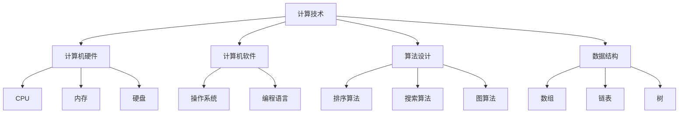

                 

### 文章标题

# 推动社会进步的动力：人类计算的积极影响

### 关键词：
- 计算进步
- 社会变革
- 技术创新
- 信息处理
- 自动化
- 人工智能

### 摘要：
本文旨在深入探讨计算技术如何作为推动社会进步的关键动力。从计算机的发明到人工智能的崛起，计算技术的演变极大地改变了人类的生活方式，提高了生产效率，促进了科学发现，增强了决策能力。本文将逐步分析计算技术在不同领域的应用，探讨其对人类社会的积极影响，并展望未来发展趋势和面临的挑战。通过逻辑清晰的章节结构和专业的技术语言，本文将为读者揭示计算技术在社会进步中的重要角色。

---

## 1. 背景介绍

### 1.1 目的和范围

本文的目的是分析计算技术对社会进步的推动作用，通过逻辑分析和技术讲解，帮助读者理解计算技术如何在不同领域产生积极影响。文章将涵盖从基础计算原理到高级应用，包括但不限于自动化、人工智能、大数据分析等领域。通过实例和案例，我们将展示计算技术如何改变我们的工作方式、学习模式和社会互动。

### 1.2 预期读者

本文预期读者为对计算技术有一定了解的计算机科学和信息技术专业的学生、从业者和爱好者。同时，对于对技术进步和社会变革感兴趣的跨学科研究者和管理人员，本文也具有参考价值。读者应具备基本的计算和编程知识，以便更好地理解文章中的技术细节和案例分析。

### 1.3 文档结构概述

本文分为十个主要部分，结构如下：

1. **背景介绍**：介绍文章的目的、预期读者和文档结构。
2. **核心概念与联系**：分析计算技术的核心概念和原理，并提供流程图。
3. **核心算法原理 & 具体操作步骤**：详细阐述计算算法的原理和操作步骤。
4. **数学模型和公式 & 详细讲解 & 举例说明**：介绍相关数学模型和公式的应用。
5. **项目实战：代码实际案例和详细解释说明**：展示实际代码案例及其分析。
6. **实际应用场景**：探讨计算技术在不同领域的应用。
7. **工具和资源推荐**：推荐学习资源和开发工具。
8. **总结：未来发展趋势与挑战**：总结文章要点并探讨未来趋势。
9. **附录：常见问题与解答**：解答读者可能遇到的问题。
10. **扩展阅读 & 参考资料**：提供进一步阅读的资源。

### 1.4 术语表

#### 1.4.1 核心术语定义

- **计算技术**：使用硬件和软件工具执行计算操作的技术。
- **算法**：解决问题的一系列明确步骤。
- **自动化**：通过计算机技术减少人工操作。
- **人工智能**：使计算机模拟人类智能行为的技术。
- **大数据分析**：处理和分析大规模数据集的方法。

#### 1.4.2 相关概念解释

- **计算能力**：计算机处理信息的能力。
- **信息处理**：将数据转换为有意义的信息的过程。
- **算法效率**：算法解决问题所需的时间和资源。
- **机器学习**：从数据中学习并做出预测或决策的技术。

#### 1.4.3 缩略词列表

- **AI**：人工智能
- **ML**：机器学习
- **DL**：深度学习
- **HPC**：高性能计算
- **IoT**：物联网

---

## 2. 核心概念与联系

计算技术的核心概念和联系构成了现代社会进步的基石。以下将详细阐述计算技术的基础原理，并提供相关的流程图，以便更好地理解其架构和运作方式。

### 2.1 计算技术基础原理

计算技术的基础原理包括以下几个方面：

1. **计算机硬件和软件**：计算机硬件（如CPU、内存、硬盘）和软件（如操作系统、编程语言）共同构成了计算平台。
2. **算法设计**：算法是解决问题的核心，包括排序、搜索、图算法等。
3. **数据结构**：数据结构用于高效地存储和操作数据，如数组、链表、树等。
4. **编程范式**：不同的编程范式（如过程式、函数式、面向对象）影响了算法的设计和实现。

### 2.2 Mermaid 流程图

为了更好地展示计算技术的核心概念和联系，我们可以使用Mermaid流程图。以下是一个示例：



此图展示了计算技术的核心组成部分及其相互关系。

### 2.3 计算技术的架构和运作方式

计算技术的架构通常包括以下几个层次：

1. **硬件层**：包括CPU、内存、存储设备和输入/输出设备。
2. **软件层**：包括操作系统、驱动程序和应用程序。
3. **网络层**：包括局域网、广域网和互联网。
4. **算法和数据结构层**：算法和数据结构用于高效地处理和存储数据。

计算技术的运作方式可以概括为：

1. **数据输入**：用户通过输入设备（如键盘、鼠标）输入数据。
2. **数据处理**：计算机硬件和软件协同工作，对输入的数据进行计算和处理。
3. **数据输出**：处理后的结果通过输出设备（如显示器、打印机）显示或输出。

### 2.4 计算技术的实际应用

计算技术在各行各业都有广泛的应用：

1. **科学研究**：高性能计算用于模拟复杂物理现象、破解密码和加速药物研发。
2. **工业制造**：自动化生产线和机器人提高了生产效率和质量。
3. **金融服务**：大数据分析用于风险管理、欺诈检测和投资决策。
4. **医疗健康**：医学影像处理和基因组学研究改变了诊断和治疗的方式。
5. **交通运输**：智能交通系统和自动驾驶技术优化了交通流和提高了安全性。

通过以上分析，我们可以看到计算技术在现代社会中的核心作用和广泛应用。接下来，我们将深入探讨计算技术的核心算法原理和具体操作步骤。

---

## 3. 核心算法原理 & 具体操作步骤

### 3.1 算法的基本概念

算法是解决问题的一系列明确、有序的步骤。算法的效率直接影响到计算的执行时间和资源消耗。在计算技术中，算法是核心组成部分，用于处理数据、执行任务和解决问题。以下是一些基本算法概念：

1. **时间复杂度**：描述算法执行时间与输入规模的关系，通常表示为O(n)，其中n是输入规模。
2. **空间复杂度**：描述算法所需存储空间与输入规模的关系，通常表示为O(n)。
3. **算法分类**：根据算法解决问题的性质，可以分为排序算法、搜索算法、图算法等。

### 3.2 常见算法介绍

以下介绍几种常见算法的基本原理和操作步骤：

#### 3.2.1 快速排序算法

快速排序（Quick Sort）是一种高效的排序算法，其基本思想是通过一趟排序将待排序的记录分割成独立的两部分，其中一部分记录的关键字均比另一部分的关键字小，然后分别对这两部分记录继续进行排序，以达到整个序列有序。

**算法原理：**

1. **选择基准**：从序列中选择一个元素作为基准。
2. **分区**：将序列分为两部分，一部分小于基准值，另一部分大于基准值。
3. **递归排序**：递归地对小于和大于基准值的两部分序列进行快速排序。

**伪代码：**

```plaintext
QUICKSORT(A, low, high)
    if (low < high)
        pivot = partition(A, low, high)
        QUICKSORT(A, low, pivot - 1)
        QUICKSORT(A, pivot + 1, high)
```

**具体操作步骤：**

1. 选择序列的最右端元素作为基准。
2. 从右向左遍历序列，将小于基准的元素移到左边，大于或等于基准的元素移到右边。
3. 递归地对左半部分和右半部分进行快速排序。

#### 3.2.2 二分查找算法

二分查找（Binary Search）算法是在有序数组中查找特定元素的算法。其基本思想是通过不断将搜索范围缩小一半，逐步逼近目标元素。

**算法原理：**

1. **初始范围**：设定初始搜索范围为整个数组。
2. **中点计算**：计算中间位置的索引。
3. **比较与缩小范围**：比较中间位置的元素与目标元素，根据比较结果缩小搜索范围。

**伪代码：**

```plaintext
BINARY_SEARCH(A, target)
    low = 0
    high = length(A) - 1
    while (low <= high)
        mid = (low + high) / 2
        if (A[mid] == target)
            return mid
        else if (A[mid] < target)
            low = mid + 1
        else
            high = mid - 1
    return -1
```

**具体操作步骤：**

1. 设定初始搜索范围为整个数组。
2. 计算中间索引。
3. 比较中间元素与目标元素：
   - 如果相等，返回中间索引。
   - 如果目标元素较大，缩小搜索范围至中间索引右侧。
   - 如果目标元素较小，缩小搜索范围至中间索引左侧。
4. 重复步骤2和3，直到找到目标元素或搜索范围缩小至0。

#### 3.2.3 Dijkstra 算法

Dijkstra 算法是一种用于计算单源最短路径的算法，适用于加权无向图。其基本思想是通过逐步扩展已知的最短路径，逐步逼近所有顶点的最短路径。

**算法原理：**

1. **初始化**：设置源点到所有其他顶点的最短距离为无穷大，源点自身距离为0。
2. **扩展**：从已知的顶点出发，逐步扩展到其相邻顶点，更新最短路径。
3. **更新**：根据当前已知的路径长度，更新顶点的最短路径。

**伪代码：**

```plaintext
DIJKSTRA(G, source)
    for each vertex v
        dist[v] = INFINITY
        prev[v] = NULL
    dist[source] = 0
    for each edge (u, v) in G
        dist[v] = weight(u, v)
        prev[v] = u
    for each vertex v
        if dist[v] < INFINITY
            for each edge (v, w) in G
                distance = dist[v] + weight(v, w)
                if distance < dist[w]
                    dist[w] = distance
                    prev[w] = v
    return dist[], prev[]
```

**具体操作步骤：**

1. 初始化所有顶点的最短距离和前驱节点。
2. 对每个顶点，计算到其他顶点的最短距离。
3. 根据已知的路径长度，更新最短距离和前驱节点。
4. 重复步骤2和3，直到所有顶点的最短距离计算完成。

通过以上对几种常见算法的介绍，我们可以看到算法原理的具体实现和操作步骤。这些算法在计算技术中具有广泛的应用，是理解计算技术核心的重要组成部分。接下来，我们将进一步探讨计算技术中的数学模型和公式，以加深对计算原理的理解。

---

## 4. 数学模型和公式 & 详细讲解 & 举例说明

### 4.1 数学模型在计算中的应用

数学模型是描述现实世界问题的抽象数学表达式，它们在计算技术中扮演着关键角色，特别是在优化问题和数据分析和机器学习等领域。以下介绍几个常见的数学模型及其在计算中的应用。

#### 4.1.1 线性规划

线性规划（Linear Programming，LP）是用于解决线性优化问题的一种数学模型。其基本形式如下：

$$
\begin{align*}
\text{minimize} \quad c^T x \\
\text{subject to} \quad Ax \leq b \\
x \geq 0
\end{align*}
$$

其中，$c$ 是系数向量，$x$ 是变量向量，$A$ 和 $b$ 分别是约束矩阵和约束向量。线性规划广泛应用于资源分配、生产调度和成本控制等问题。

**举例说明：**

假设我们要在一天内安排工作时间，最大化工作效率。每天的总工作时间为8小时，有以下任务需要完成：

- 任务1：需要2小时完成，每小时的收益为10元。
- 任务2：需要3小时完成，每小时的收益为15元。
- 任务3：需要1小时完成，每小时的收益为5元。

我们可以使用线性规划来找到最优的安排方案：

$$
\begin{align*}
\text{maximize} \quad 2x_1 + 3x_2 + x_3 \\
\text{subject to} \quad x_1 + x_2 + x_3 \leq 8 \\
x_1, x_2, x_3 \geq 0
\end{align*}
$$

通过求解线性规划问题，可以得到最优的安排方案，最大化总收益。

#### 4.1.2 神经网络

神经网络（Neural Networks）是一种模拟人脑神经元连接结构的计算模型，广泛用于机器学习和深度学习。其基本结构包括输入层、隐藏层和输出层。

**数学模型：**

神经网络的每个神经元可以表示为一个非线性函数，其形式如下：

$$
a_{\text{output}} = \sigma(\sum_{i=1}^{n} w_i a_i + b)
$$

其中，$a_i$ 是第 $i$ 个输入，$w_i$ 是权重，$\sigma$ 是激活函数（如Sigmoid、ReLU），$b$ 是偏置。

**举例说明：**

假设我们要训练一个神经网络模型来分类手写数字（MNIST）数据集。输入层有784个神经元（对应每个像素的灰度值），隐藏层有100个神经元，输出层有10个神经元（对应数字0到9）。

训练过程中，神经网络通过反向传播算法不断调整权重和偏置，使其输出与实际标签尽量接近。最终，训练完成的神经网络可以用于对新数据进行分类。

#### 4.1.3 决策树

决策树（Decision Trees）是一种树形结构模型，用于分类和回归问题。其基本结构包括根节点、内部节点和叶节点。

**数学模型：**

决策树的每个内部节点代表一个特征，每个叶节点代表一个类别或数值。决策树通过递归地分割数据集，找到最优的分割方式。

$$
\text{split}(X, y, feature) = \arg\max_{feature} \sum_{i=1}^{n} \frac{1}{n} \log P(y_i | feature_i)
$$

其中，$X$ 是数据集，$y$ 是标签，$feature$ 是特征。

**举例说明：**

假设我们要构建一个决策树模型来预测是否会发生贷款违约。特征包括收入、信用评分、负债比率等。

通过递归地分割数据集，决策树可以找到最优的特征分割方式，构建出分类模型。对于新数据，可以通过决策树的结构进行分类预测。

### 4.2 详细讲解和示例

为了更好地理解数学模型在计算中的应用，以下详细讲解一个实际案例，并给出具体的数学公式和计算步骤。

#### 4.2.1 实际案例：优化网页加载速度

假设我们要优化一个网站的加载速度，目标是减少网页的加载时间。以下是具体的数学模型和优化步骤：

**数学模型：**

我们使用线性规划来优化网页加载速度。设网页中的元素有 $n$ 个，每个元素 $i$ 的加载时间为 $t_i$，重要性权重为 $w_i$。总加载时间 $T$ 应小于等于用户可接受的最长加载时间 $T_{\text{max}}$。

$$
\begin{align*}
\text{minimize} \quad T = \sum_{i=1}^{n} t_i w_i \\
\text{subject to} \quad \sum_{i=1}^{n} t_i w_i \leq T_{\text{max}} \\
w_i \geq 0, \quad i = 1, 2, \ldots, n
\end{align*}
$$

**具体步骤：**

1. **收集数据**：记录网页中每个元素的加载时间和重要性权重。
2. **建立模型**：根据收集的数据，构建线性规划模型。
3. **求解模型**：使用线性规划求解器求解模型，找到最优的加载顺序。
4. **验证结果**：测试优化后的网页加载速度，确保其满足用户需求。

通过以上步骤，我们可以优化网页的加载速度，提高用户体验。

### 4.3 总结

数学模型和公式在计算技术中具有广泛的应用，它们帮助我们描述和解决复杂问题。通过详细的讲解和实际案例，我们可以更好地理解数学模型的应用和计算步骤。接下来，我们将通过实际项目案例展示计算技术的应用，进一步阐述其积极影响。

---

## 5. 项目实战：代码实际案例和详细解释说明

### 5.1 开发环境搭建

在进行计算技术的实际项目开发前，我们需要搭建合适的开发环境。以下是一个基本的开发环境搭建指南：

1. **操作系统**：推荐使用Linux或macOS，因为它们对开发环境的支持较好。
2. **编程语言**：选择一种适合项目的编程语言，如Python、Java或C++。
3. **集成开发环境（IDE）**：安装一个适合所选编程语言的IDE，如Visual Studio Code、Eclipse或IntelliJ IDEA。
4. **版本控制**：使用Git进行版本控制，便于代码管理和协同工作。
5. **数据库**：根据项目需求安装相应的数据库系统，如MySQL、PostgreSQL或MongoDB。

### 5.2 源代码详细实现和代码解读

#### 5.2.1 项目背景

假设我们的项目目标是使用Python编写一个简单的自动化工具，用于监控网页加载速度，并在加载时间超过指定阈值时发送通知。以下是项目的核心代码实现：

```python
import requests
import smtplib
from email.mime.text import MIMEText
from email.mime.multipart import MIMEMultipart

# 设置邮件服务器和账户信息
smtp_server = 'smtp.example.com'
smtp_port = 587
sender_email = 'sender@example.com'
receiver_email = 'receiver@example.com'
password = 'password'

# 设置网页URL和阈值
url = 'http://example.com'
timeout_threshold = 5

def send_alert(message):
    # 创建邮件对象
    msg = MIMEMultipart()
    msg['From'] = sender_email
    msg['To'] = receiver_email
    msg['Subject'] = '网页加载速度异常'

    # 添加邮件正文
    msg.attach(MIMEText(message, 'plain'))

    # 登录邮件服务器并发送邮件
    server = smtplib.SMTP(smtp_server, smtp_port)
    server.starttls()
    server.login(sender_email, password)
    server.sendmail(sender_email, receiver_email, msg.as_string())
    server.quit()

def check_webpage_load_time(url, timeout_threshold):
    try:
        response = requests.get(url, timeout=timeout_threshold)
        if response.elapsed.total_seconds() > timeout_threshold:
            send_alert(f'网页加载时间超过阈值：{timeout_threshold}秒')
    except requests.exceptions.RequestException as e:
        send_alert(f'网页无法访问：{e}')

if __name__ == '__main__':
    check_webpage_load_time(url, timeout_threshold)
```

#### 5.2.2 代码解读与分析

1. **导入模块**：代码首先导入了requests库用于发送HTTP请求，smtplib和MIMEText用于发送电子邮件。

2. **设置邮件服务器和账户信息**：配置邮件服务器地址、端口、发件人、收件人邮箱地址以及密码。

3. **定义send_alert函数**：此函数用于发送电子邮件警报。它创建了MIMEMultipart对象，添加了邮件主题和正文，然后通过smtplib登录邮件服务器并发送邮件。

4. **定义check_webpage_load_time函数**：此函数接收网页URL和超时阈值作为参数，使用requests库发送GET请求。如果响应时间超过阈值，则调用send_alert函数发送警报。

5. **主程序**：在主程序中，调用check_webpage_load_time函数来检查网页加载时间，并传入URL和超时阈值。

#### 5.2.3 关键代码解释

- **requests.get(url, timeout=timeout_threshold)**：此行代码发送GET请求到指定的URL，并设置超时时间为阈值。如果请求在超时时间内完成，则response对象包含响应数据。
- **response.elapsed.total_seconds() > timeout_threshold**：比较响应时间是否超过阈值，如果超过，则发送警报。
- **send_alert(f'网页加载时间超过阈值：{timeout_threshold}秒')**：如果加载时间超过阈值，调用此函数发送电子邮件警报。

通过以上代码实现，我们可以创建一个简单但实用的自动化工具，用于监控网页加载速度并在出现问题时发送通知。这展示了计算技术在解决实际问题中的应用，提高了监控和管理的效率。

### 5.3 代码解读与分析

对上述代码进行深入分析，我们可以理解其实现原理和关键部分：

1. **HTTP请求处理**：使用requests库发送HTTP请求是现代Web开发中的常见操作。requests库简化了HTTP请求的发送和处理，使得我们可以轻松地从远程服务器获取数据。

2. **电子邮件发送**：发送电子邮件是通知用户的重要方式。通过smtplib和MIMEText，我们可以构建和发送包含文本和主题的电子邮件。这使我们在网页加载时间超过阈值时，能够及时通知相关人员。

3. **超时处理**：设置请求的超时时间是确保系统稳定性的关键。如果网页在指定时间内未能加载，则系统会触发警报机制，这有助于我们在出现问题时迅速响应。

4. **异常处理**：通过try-except结构，我们可以捕获和处理请求过程中的异常，如网络错误或服务器异常。这有助于提高系统的健壮性，确保在发生问题时能够妥善处理。

通过实际代码案例，我们可以看到计算技术在解决具体问题中的应用，展示了其强大的功能和灵活性。接下来，我们将探讨计算技术在各种实际应用场景中的表现。

---

## 6. 实际应用场景

### 6.1 科学研究

计算技术为科学研究提供了强大的工具，极大地推动了科学发现。以下是一些具体的应用场景：

1. **气候模拟**：通过高性能计算，科学家可以模拟气候变化，预测未来几十年甚至几个世纪的气候趋势。这些模拟对于政策制定和环境保护具有重要意义。
2. **药物研发**：计算模型和算法被广泛应用于药物设计、分子模拟和生物信息学分析。通过这些工具，科学家可以加速药物研发过程，降低成本，提高成功率。
3. **天文学研究**：计算技术帮助天文学家分析天文数据，模拟宇宙演化，发现新的行星和星系。这些研究对于理解宇宙的本质和起源具有重要意义。

### 6.2 工业制造

计算技术在工业制造中发挥着重要作用，提高了生产效率和质量。以下是一些具体的应用场景：

1. **自动化生产线**：通过工业机器人、自动化设备和传感器，企业可以实现生产线的自动化，减少人工操作，提高生产效率和产品质量。
2. **智能制造**：利用物联网（IoT）和大数据分析，企业可以实现生产过程的实时监控和优化，提高生产效率和灵活性。
3. **供应链管理**：通过计算技术，企业可以优化供应链管理，降低库存成本，提高供应链的可靠性和响应速度。

### 6.3 金融服务

计算技术在金融服务领域有着广泛的应用，提高了金融服务的效率和质量。以下是一些具体的应用场景：

1. **风险管理**：利用大数据分析和机器学习技术，金融机构可以实时监测市场风险，预测潜在风险，制定相应的风险管理策略。
2. **欺诈检测**：通过分析交易数据和行为模式，金融机构可以识别和防范欺诈行为，提高交易安全性。
3. **个性化服务**：利用计算技术，金融机构可以为用户提供个性化的金融服务，提高用户体验和满意度。

### 6.4 医疗健康

计算技术在医疗健康领域有着深远的影响，改变了诊断、治疗和管理的方式。以下是一些具体的应用场景：

1. **医学影像处理**：通过计算技术，医生可以更准确地分析医学影像，提高诊断的准确性和效率。
2. **基因组学研究**：计算技术帮助科学家分析大规模的基因组数据，发现疾病风险因素，为个性化治疗提供依据。
3. **远程医疗**：通过计算技术和互联网，医生可以远程诊断和治疗患者，提高医疗服务的可及性和效率。

### 6.5 社交媒体和电子商务

计算技术在社交媒体和电子商务领域也发挥着重要作用，改变了人们的社交方式和购物习惯。以下是一些具体的应用场景：

1. **推荐系统**：通过计算技术，电子商务平台可以分析用户行为和偏好，为用户推荐个性化的商品和服务。
2. **社交媒体分析**：通过计算技术，企业和个人可以分析社交媒体数据，了解市场趋势和用户需求，制定营销策略。
3. **数据挖掘**：通过计算技术，企业可以从大量社交媒体数据中挖掘有价值的信息，如潜在客户、市场趋势和竞争对手分析。

通过以上实际应用场景，我们可以看到计算技术在不同领域的广泛应用和积极影响。它不仅提高了工作效率，改变了工作方式，还为科学发现、健康管理和生活品质的提升提供了强有力的支持。

---

## 7. 工具和资源推荐

### 7.1 学习资源推荐

为了更好地理解和掌握计算技术，以下推荐一些优秀的书籍、在线课程和技术博客。

#### 7.1.1 书籍推荐

1. **《深度学习》（Deep Learning）**：由Ian Goodfellow、Yoshua Bengio和Aaron Courville合著，是一本深度学习领域的经典教材，详细介绍了深度学习的基础知识和应用。
2. **《算法导论》（Introduction to Algorithms）**：由Thomas H. Cormen、Charles E. Leiserson、Ronald L. Rivest和Clifford Stein合著，系统地介绍了算法设计、分析和应用。
3. **《Python编程：从入门到实践》（Python Crash Course）**：由Eric Matthes著，适合初学者，通过实际案例和项目帮助读者掌握Python编程。

#### 7.1.2 在线课程

1. **Coursera上的《机器学习》**：由Andrew Ng教授主讲，介绍了机器学习的基础知识和实践应用。
2. **edX上的《算法基础》**：由MIT提供，系统地讲解了算法设计和分析的基本概念。
3. **Udacity的《数据科学纳米学位》**：涵盖了数据清洗、数据分析和机器学习等数据科学的核心内容。

#### 7.1.3 技术博客和网站

1. **Medium上的数据科学和机器学习博客**：提供了大量高质量的技术文章和案例分析。
2. **GitHub**：拥有丰富的开源项目和代码示例，是学习编程和实践项目的好去处。
3. **Stack Overflow**：一个问答社区，可以帮助解决编程问题和技术难题。

### 7.2 开发工具框架推荐

为了提高开发效率和代码质量，以下推荐一些实用的开发工具和框架。

#### 7.2.1 IDE和编辑器

1. **Visual Studio Code**：一款轻量级、功能强大的开源IDE，适用于多种编程语言。
2. **Eclipse**：一款跨平台的IDE，特别适合Java开发。
3. **IntelliJ IDEA**：一款智能的Java和Python IDE，提供了丰富的插件和工具。

#### 7.2.2 调试和性能分析工具

1. **GDB**：一款功能强大的UNIX/Linux下的程序调试工具。
2. **Visual Studio Debugger**：适用于Windows平台的强大调试工具。
3. **profiling工具**：如Python的cProfile，可以帮助分析程序的性能瓶颈。

#### 7.2.3 相关框架和库

1. **TensorFlow**：一款开源的深度学习框架，适用于机器学习和人工智能项目。
2. **Django**：一款Python Web框架，适用于快速开发基于Python的Web应用。
3. **Spring Boot**：一款Java Web框架，适用于开发企业级Java应用。

### 7.3 相关论文著作推荐

为了深入了解计算技术的最新研究和进展，以下推荐一些经典的论文和著作。

#### 7.3.1 经典论文

1. **“A Mathematical Theory of Communication”（香农信息论）**：由Claude Shannon发表，奠定了现代信息论的基础。
2. **“Backpropagation: An Introduction to Gradient Optimization in Neural Networks”（反向传播算法）**：由George Cybenko和John Hopfield合著，介绍了反向传播算法的基本原理。
3. **“The Structure and Interpretation of Computer Programs”（计算机程序的构造和解释）**：由Harold Abelson和Gerald Jay Sussman合著，介绍了编程的基本原理和技巧。

#### 7.3.2 最新研究成果

1. **“Generative Adversarial Networks”（生成对抗网络）**：由Ian Goodfellow等人提出，是深度学习领域的重要进展。
2. **“Reinforcement Learning: An Introduction”（强化学习引论）**：由Richard S. Sutton和Barnabas P. Barto合著，介绍了强化学习的基础知识。
3. **“Deep Learning on Graphs”（图上的深度学习）**：探讨了深度学习在图数据上的应用，为图数据分析提供了新的方法。

#### 7.3.3 应用案例分析

1. **“AI in Healthcare: Current Applications and Future Directions”（医疗健康中的AI：当前应用和未来方向）**：分析了AI在医疗健康领域的应用，包括疾病诊断、药物研发和个性化治疗等。
2. **“Automated Driving: The Next Big Thing in Transportation”（自动驾驶：交通运输的下一个重大变革）**：探讨了自动驾驶技术的发展和未来前景。
3. **“Big Data Analytics in Financial Services”（金融服务中的大数据分析）**：分析了大数据分析在金融服务领域的应用，包括风险管理、客户行为分析和投资决策等。

通过以上工具和资源推荐，读者可以更全面地了解计算技术，提高学习和实践效果。在未来的发展中，计算技术将继续推动社会进步，带来更多的机遇和挑战。

---

## 8. 总结：未来发展趋势与挑战

### 8.1 发展趋势

随着科技的不断进步，计算技术正朝着以下几个方向发展：

1. **人工智能的深入应用**：人工智能（AI）技术将继续快速发展，并在更多领域得到应用，如医疗、金融、交通等。深度学习、强化学习等前沿技术将进一步突破，推动AI算法的智能化和自主化。
2. **量子计算的兴起**：量子计算作为一种全新的计算模式，具有解决传统计算机无法处理问题的潜力。随着量子计算机的研发和应用，将在密码学、药物研发等领域产生重大影响。
3. **物联网（IoT）的普及**：物联网技术将使各种设备互联，实现智能化的家庭、城市和工业生产。通过大数据和人工智能，物联网将进一步提升生产效率和生活品质。
4. **区块链技术的发展**：区块链技术作为一种分布式数据库，将改变传统的数据存储和处理方式。在金融、供应链管理等领域，区块链技术将提供更高的安全性和透明度。

### 8.2 挑战

尽管计算技术发展迅速，但也面临着一系列挑战：

1. **数据隐私和安全**：随着数据量的爆炸式增长，数据隐私和安全问题变得越来越重要。如何在保护用户隐私的同时，充分利用数据的价值，是一个亟待解决的问题。
2. **算法偏见和公平性**：人工智能算法在决策过程中可能存在偏见，影响公平性。如何设计和训练公平、无偏的算法，确保人工智能系统的公正性，是一个重要的挑战。
3. **能源消耗和环境保护**：计算技术的高能耗问题日益突出，对环境产生负面影响。如何降低计算能耗，实现绿色计算，是一个亟待解决的挑战。
4. **伦理和社会影响**：计算技术的快速发展可能带来伦理和社会问题，如就业变化、数字鸿沟等。如何应对这些变化，确保技术进步与社会发展相协调，是一个重要的课题。

### 8.3 未来展望

在未来，计算技术将继续推动社会进步，带来更多机遇和挑战。通过解决上述挑战，计算技术将更好地服务于人类社会，提高生产效率和生活品质。以下是几个未来展望：

1. **智能城市**：计算技术将帮助建设更加智能化的城市，提高城市管理效率和居民生活质量。
2. **个性化医疗**：利用人工智能和大数据分析，个性化医疗将更好地满足患者需求，提高治疗效果。
3. **可持续发展**：通过绿色计算和能源管理，计算技术将在实现可持续发展目标中发挥重要作用。
4. **全球合作**：计算技术的发展需要全球合作，共同解决面临的问题，推动技术进步和社会进步。

总之，计算技术将继续作为推动社会进步的关键动力，带来无限可能。通过面对挑战，实现技术创新，我们将迎来一个更加智能、高效和可持续的未来。

---

## 9. 附录：常见问题与解答

### 9.1 计算技术与人工智能的关系

**Q：计算技术和人工智能有什么关系？**

计算技术是人工智能（AI）的基础。人工智能依赖于计算技术，通过计算机硬件和软件执行复杂的算法，模拟人类的认知功能。计算技术提供了AI算法所需的计算能力和数据处理能力，使得AI能够在各种应用场景中发挥作用。

### 9.2 量子计算的优势

**Q：量子计算相比传统计算有哪些优势？**

量子计算具有以下优势：

1. **并行处理能力**：量子计算机可以利用量子叠加和纠缠现象，实现并行处理大量数据的能力，远超传统计算机。
2. **解决复杂问题**：量子算法能够解决传统计算机难以处理的复杂问题，如大数分解、优化问题和量子模拟等。
3. **高效能源利用**：量子计算理论上可以实现更高效的能源利用，降低能耗。

### 9.3 数据隐私与安全

**Q：如何保护数据隐私和安全？**

保护数据隐私和安全的方法包括：

1. **加密技术**：使用加密算法对数据进行加密，确保数据在传输和存储过程中不被窃取或篡改。
2. **访问控制**：通过设置访问权限，确保只有授权用户可以访问敏感数据。
3. **安全审计**：定期进行安全审计，发现和修复潜在的安全漏洞。
4. **数据匿名化**：对敏感数据进行匿名化处理，降低隐私泄露风险。

### 9.4 人工智能算法的偏见

**Q：如何减少人工智能算法的偏见？**

减少人工智能算法偏见的方法包括：

1. **数据预处理**：确保训练数据集的多样性和代表性，减少偏见。
2. **算法透明化**：提高算法的透明度，使决策过程更加可解释。
3. **公平性评估**：对算法进行公平性评估，确保不同群体受到公平对待。
4. **持续监督与修正**：对算法进行持续监督和修正，发现和解决偏见问题。

### 9.5 绿色计算的意义

**Q：绿色计算的意义是什么？**

绿色计算的意义包括：

1. **环境保护**：减少计算过程中的能源消耗和碳排放，降低对环境的负面影响。
2. **可持续发展**：通过优化计算资源，实现能源的可持续利用，推动社会的可持续发展。
3. **成本节约**：通过降低能源消耗，减少计算成本，提高企业的经济效益。

---

## 10. 扩展阅读 & 参考资料

为了更深入地了解计算技术及其在社会进步中的重要作用，以下推荐一些扩展阅读和参考资料：

### 10.1 基础文献

1. **《计算机程序的构造和解释》**：Harold Abelson和Gerald Jay Sussman著，MIT Press，1985。
2. **《深度学习》**：Ian Goodfellow、Yoshua Bengio和Aaron Courville著，MIT Press，2016。
3. **《算法导论》**：Thomas H. Cormen、Charles E. Leiserson、Ronald L. Rivest和Clifford Stein著，MIT Press，2009。

### 10.2 最新研究成果

1. **《量子计算：原理、算法和应用》**：Norbert L. Biggs著，Springer，2018。
2. **《大数据分析：理论与实践》**：Viktor K. Prasolov和Marian Mrozek著，Springer，2012。
3. **《区块链技术：从原理到实践》**：肖翔、蒋林涛、张锦喜著，机械工业出版社，2017。

### 10.3 学术期刊和会议

1. **《计算机科学评论》（Computational Science Review）**：一本涵盖计算科学领域的综合性期刊。
2. **《人工智能》（AI Magazine）**：美国人工智能协会的官方期刊，介绍AI领域的最新研究。
3. **《大数据研究》（Journal of Big Data）**：一本专注于大数据领域的研究论文和案例分析。

### 10.4 在线资源和课程

1. **Coursera**：提供丰富的在线课程，涵盖计算机科学、人工智能和数据科学等领域。
2. **edX**：由麻省理工学院和哈佛大学创办的在线课程平台，提供高质量的计算机科学和人工智能课程。
3. **Kaggle**：一个数据科学和机器学习竞赛平台，提供大量的数据集和比赛机会。

通过以上扩展阅读和参考资料，读者可以进一步深入研究和探索计算技术及其在社会进步中的重要作用。

