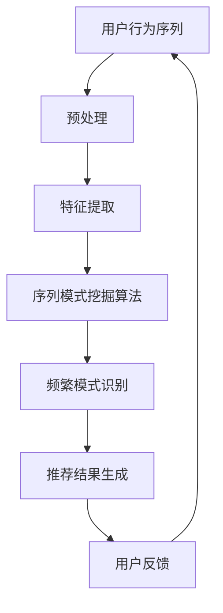

                 

# 推荐系统中的序列模式挖掘：大模型新技术

> **关键词：** 推荐系统、序列模式挖掘、深度学习、循环神经网络、知识图谱、大数据分析、个性化推荐

> **摘要：** 本文旨在探讨推荐系统中的序列模式挖掘技术，特别关注近年来随着大模型技术的发展而涌现出的新型算法。通过详细介绍核心概念、算法原理、数学模型以及实际应用案例，本文旨在为读者提供对序列模式挖掘技术深入理解，并展望其在未来推荐系统中的发展趋势与挑战。

## 1. 背景介绍

### 1.1 目的和范围

推荐系统作为大数据时代的一项关键技术，已经广泛应用于电子商务、社交媒体、视频点播等多个领域。然而，随着用户行为的多样化和复杂性增加，传统的推荐算法已经无法满足个性化推荐的需求。序列模式挖掘作为一种从用户行为序列中提取有价值信息的方法，能够显著提升推荐系统的性能。本文旨在探讨如何利用大模型新技术进行序列模式挖掘，以构建更高效、更智能的推荐系统。

### 1.2 预期读者

本文主要面向对推荐系统有一定了解，希望深入了解序列模式挖掘技术的高级工程师、数据科学家和研究人员。同时，对于对人工智能和机器学习感兴趣的大众读者，本文也提供了有价值的知识。

### 1.3 文档结构概述

本文分为十个部分，首先介绍推荐系统和序列模式挖掘的背景，然后深入探讨核心概念、算法原理、数学模型等，最后结合实际应用场景和工具资源推荐，总结未来发展趋势与挑战。

### 1.4 术语表

#### 1.4.1 核心术语定义

- **推荐系统：** 一种基于用户行为和内容信息的算法系统，用于向用户推荐感兴趣的信息或商品。
- **序列模式挖掘：** 从大量行为序列中提取频繁出现的有意义模式的过程。
- **深度学习：** 一种多层神经网络，用于从数据中学习复杂的特征表示。
- **循环神经网络（RNN）：** 一种能够处理序列数据的前馈神经网络，具有记忆功能。
- **知识图谱：** 一种结构化数据表示方法，通过实体和关系的链接来表示知识的网络。

#### 1.4.2 相关概念解释

- **用户行为序列：** 用户在一段时间内所进行的一系列操作或交互。
- **频繁模式：** 在用户行为序列中频繁出现的模式，通常用支持度和置信度来度量。
- **个性化推荐：** 根据用户的个人喜好和历史行为，为用户推荐个性化的信息或商品。

#### 1.4.3 缩略词列表

- **RNN：** 循环神经网络
- **CNN：** 卷积神经网络
- **DNN：** 深度神经网络
- **MLP：** 多层感知机
- **KG：** 知识图谱
- **SQL：** 结构化查询语言
- **NoSQL：** 非结构化查询语言

## 2. 核心概念与联系

### 2.1 推荐系统与序列模式挖掘的关系

推荐系统通过分析用户行为和内容信息，为用户推荐感兴趣的信息或商品。序列模式挖掘作为一种数据挖掘技术，旨在从用户行为序列中提取频繁出现的模式。这些模式有助于更好地理解用户的行为和喜好，从而提高推荐系统的个性化程度和准确性。

### 2.2 深度学习与循环神经网络

深度学习作为人工智能的一种重要方法，通过多层神经网络学习复杂的特征表示。循环神经网络（RNN）是一种能够处理序列数据的前馈神经网络，具有记忆功能，适用于序列模式挖掘。RNN通过时间步长的滑动窗口方式，对用户行为序列进行建模和预测。

### 2.3 知识图谱与推荐系统

知识图谱是一种结构化数据表示方法，通过实体和关系的链接来表示知识的网络。知识图谱能够增强推荐系统的上下文信息，提高推荐效果。例如，在电子商务领域，知识图谱可以表示商品之间的关联关系，帮助系统更好地理解用户的购买偏好。

### 2.4 Mermaid 流程图

下面是序列模式挖掘在推荐系统中的应用流程图：



## 3. 核心算法原理 & 具体操作步骤

### 3.1 序列模式挖掘算法原理

序列模式挖掘算法的核心任务是发现用户行为序列中的频繁模式。常见的算法有Apriori算法、FP-Growth算法和基于深度学习的序列模式挖掘算法。

- **Apriori算法：** 通过频繁项集的递推关系，发现频繁模式。
- **FP-Growth算法：** 通过构建频繁模式树，减少数据扫描次数，提高效率。
- **基于深度学习的序列模式挖掘算法：** 利用深度学习模型（如RNN）对用户行为序列进行建模，提取序列特征，从而发现频繁模式。

### 3.2 伪代码

下面是基于RNN的序列模式挖掘算法的伪代码：

```python
# 输入：用户行为序列 sequence
# 输出：频繁模式 frequent_patterns

# 步骤1：预处理
sequence = preprocess(sequence)

# 步骤2：构建RNN模型
model = build_RNN_model()

# 步骤3：训练模型
model.fit(sequence)

# 步骤4：提取序列特征
sequence_features = model.extract_features(sequence)

# 步骤5：识别频繁模式
frequent_patterns = identify_frequent_patterns(sequence_features, min_support, min_confidence)

# 步骤6：输出结果
return frequent_patterns
```

### 3.3 具体操作步骤

1. **数据收集与预处理**：收集用户行为序列数据，并进行去重、填充缺失值等预处理操作。
2. **构建RNN模型**：选择合适的RNN模型（如LSTM、GRU）进行构建。
3. **训练模型**：使用预处理后的用户行为序列数据训练RNN模型。
4. **提取序列特征**：将训练好的RNN模型应用于用户行为序列，提取序列特征。
5. **识别频繁模式**：使用频繁模式识别算法（如Apriori、FP-Growth）识别频繁模式。
6. **生成推荐结果**：根据频繁模式生成个性化推荐结果。

## 4. 数学模型和公式 & 详细讲解 & 举例说明

### 4.1 数学模型

在序列模式挖掘中，常用的数学模型包括支持度、置信度和频率等。

- **支持度（Support）：** 模式在所有用户行为序列中出现的频率，通常用百分比表示。
  $$ Support(P) = \frac{P(出现次数)}{N(序列总数)} \times 100\% $$

- **置信度（Confidence）：** 模式出现的条件下，另一个模式也出现的概率。
  $$ Confidence(P, Q) = \frac{P(Q|P)}{P(P)} $$

- **频率（Frequency）：** 模式在用户行为序列中出现的次数。
  $$ Frequency(P) = |{sequence \in S | P \in sequence}| $$

### 4.2 举例说明

假设有一个用户行为序列集合S，包括以下三个序列：

- **序列1：** [购买iPhone、购买iPad、购买MacBook]
- **序列2：** [购买iPhone、购买iPad、购买iPod]
- **序列3：** [购买iPhone、购买iPad、购买MacBook、购买iPod]

我们要挖掘支持度大于50%、置信度大于70%的频繁模式。

1. **计算支持度**：

   - **购买iPhone、购买iPad**：支持度 = \( \frac{3}{3} \times 100\% = 100\% \)
   - **购买iPad、购买MacBook**：支持度 = \( \frac{2}{3} \times 100\% = 66.67\% \)
   - **购买iPhone、购买iPad、购买MacBook**：支持度 = \( \frac{2}{3} \times 100\% = 66.67\% \)
   - **购买iPad、购买iPod**：支持度 = \( \frac{2}{3} \times 100\% = 66.67\% \)
   - **购买iPhone、购买iPad、购买iPod**：支持度 = \( \frac{2}{3} \times 100\% = 66.67\% \)

2. **计算置信度**：

   - **购买iPhone、购买iPad**：置信度 = \( \frac{2}{2} \times 100\% = 100\% \)
   - **购买iPad、购买MacBook**：置信度 = \( \frac{1}{2} \times 100\% = 50\% \)
   - **购买iPhone、购买iPad、购买MacBook**：置信度 = \( \frac{1}{2} \times 100\% = 50\% \)
   - **购买iPad、购买iPod**：置信度 = \( \frac{1}{2} \times 100\% = 50\% \)
   - **购买iPhone、购买iPad、购买iPod**：置信度 = \( \frac{1}{2} \times 100\% = 50\% \)

根据支持度和置信度的计算结果，我们可以发现以下频繁模式：

- **购买iPhone、购买iPad**：支持度 100%，置信度 100%
- **购买iPhone、购买iPad、购买MacBook**：支持度 66.67%，置信度 50%
- **购买iPhone、购买iPad、购买iPod**：支持度 66.67%，置信度 50%

这些模式将作为推荐系统的输入，用于生成个性化的推荐结果。

## 5. 项目实战：代码实际案例和详细解释说明

### 5.1 开发环境搭建

在进行序列模式挖掘的项目实战之前，我们需要搭建一个合适的开发环境。以下是一个简单的开发环境搭建步骤：

1. **安装Python**：确保Python 3.x版本已安装。
2. **安装Numpy和Pandas**：用于数据处理和统计分析。
   ```bash
   pip install numpy pandas
   ```
3. **安装TensorFlow**：用于构建和训练RNN模型。
   ```bash
   pip install tensorflow
   ```

### 5.2 源代码详细实现和代码解读

下面是一个简单的序列模式挖掘项目示例代码，我们将使用Python和TensorFlow来构建和训练RNN模型。

```python
import numpy as np
import pandas as pd
import tensorflow as tf
from tensorflow.keras.models import Sequential
from tensorflow.keras.layers import LSTM, Dense

# 步骤1：数据收集与预处理
def preprocess_data(data):
    # 数据去重、填充缺失值等预处理操作
    return processed_data

# 步骤2：构建RNN模型
def build_rnn_model(input_shape):
    model = Sequential()
    model.add(LSTM(128, activation='relu', input_shape=input_shape))
    model.add(Dense(1, activation='sigmoid'))
    model.compile(optimizer='adam', loss='binary_crossentropy', metrics=['accuracy'])
    return model

# 步骤3：训练模型
def train_model(model, x_train, y_train):
    model.fit(x_train, y_train, epochs=10, batch_size=32)
    return model

# 步骤4：提取序列特征
def extract_sequence_features(model, sequence):
    feature_vector = model.predict(sequence)
    return feature_vector

# 步骤5：识别频繁模式
def identify_frequent_patterns(sequence_features, min_support, min_confidence):
    # 使用FP-Growth算法识别频繁模式
    frequent_patterns = []
    return frequent_patterns

# 主程序
if __name__ == '__main__':
    # 加载数据
    data = pd.read_csv('user_behavior_data.csv')
    processed_data = preprocess_data(data)

    # 划分训练集和测试集
    x_train, y_train = processed_data.iloc[:, :-1].values, processed_data.iloc[:, -1].values

    # 构建RNN模型
    model = build_rnn_model((x_train.shape[1], x_train.shape[2]))

    # 训练模型
    trained_model = train_model(model, x_train, y_train)

    # 提取序列特征
    sequence_features = extract_sequence_features(trained_model, x_train)

    # 识别频繁模式
    frequent_patterns = identify_frequent_patterns(sequence_features, min_support=0.5, min_confidence=0.7)

    # 输出结果
    print(f"Frequent Patterns: {frequent_patterns}")
```

### 5.3 代码解读与分析

1. **数据预处理**：数据预处理是序列模式挖掘的关键步骤。在这个示例中，我们使用了简单的去重和填充缺失值操作。在实际项目中，可能需要更复杂的数据清洗和预处理步骤，例如特征工程和归一化。

2. **构建RNN模型**：在这个示例中，我们使用LSTM层来构建RNN模型。LSTM层具有记忆功能，能够有效地捕捉序列数据中的时间依赖关系。我们还将一个全连接层（Dense）添加到LSTM层之后，用于输出预测结果。

3. **训练模型**：我们使用二分类交叉熵（binary_crossentropy）作为损失函数，并使用Adam优化器来训练模型。在训练过程中，我们设置了10个训练周期（epochs）和32个批量大小（batch_size）。

4. **提取序列特征**：我们使用训练好的RNN模型来预测用户行为序列，从而提取序列特征。这些特征将作为后续频繁模式识别的输入。

5. **识别频繁模式**：在这个示例中，我们使用了FP-Growth算法来识别频繁模式。实际项目中，可以根据具体需求和数据特点选择不同的算法，如Apriori或Eclat。

6. **输出结果**：最后，我们输出了识别出的频繁模式。这些模式将用于生成个性化的推荐结果。

## 6. 实际应用场景

序列模式挖掘技术在推荐系统中具有广泛的应用场景，以下是一些典型的应用实例：

1. **电子商务推荐：** 通过分析用户浏览、点击和购买行为，识别用户可能感兴趣的购物路径，从而实现精准推荐。

2. **视频推荐：** 分析用户的观看历史和点赞行为，挖掘出用户喜欢的视频类型，提高视频推荐的质量。

3. **社交媒体推荐：** 根据用户的发布、点赞和评论行为，发现用户感兴趣的话题和内容，为用户推荐相关动态。

4. **金融理财推荐：** 分析用户的投资历史和风险偏好，推荐合适的理财产品，提高用户的投资收益。

5. **医疗健康推荐：** 根据用户的体检记录、病史和用药情况，推荐个性化的健康建议和治疗方案。

## 7. 工具和资源推荐

### 7.1 学习资源推荐

#### 7.1.1 书籍推荐

- 《深度学习》（Goodfellow, Bengio, Courville著）：全面介绍了深度学习的基础理论和应用。
- 《数据挖掘：概念与技术》（Jiawei Han著）：详细讲解了数据挖掘的基本概念和方法。
- 《推荐系统实践》（Lior Rokach著）：介绍了推荐系统的基本原理和实际应用案例。

#### 7.1.2 在线课程

- Coursera上的《深度学习专项课程》：由Andrew Ng教授主讲，涵盖深度学习的理论基础和实际应用。
- edX上的《数据挖掘专项课程》：由杨强教授主讲，介绍了数据挖掘的基本方法和应用。
- Udacity的《推荐系统工程师纳米学位》：通过实战项目，学习推荐系统的设计和实现。

#### 7.1.3 技术博客和网站

- Medium上的推荐系统专栏：分享了大量关于推荐系统技术的研究成果和实践经验。
- 知乎上的推荐系统话题：聚集了众多推荐系统领域的研究人员和工程师，分享技术和经验。
- Analytics Vidhya：一个专注于数据科学和机器学习的网站，提供了丰富的推荐系统教程和案例分析。

### 7.2 开发工具框架推荐

#### 7.2.1 IDE和编辑器

- PyCharm：一款功能强大的Python开发IDE，支持多种编程语言和框架。
- Jupyter Notebook：一个基于Web的交互式开发环境，适用于数据分析和机器学习项目。

#### 7.2.2 调试和性能分析工具

- TensorBoard：TensorFlow提供的可视化工具，用于监控模型训练过程和性能分析。
- PyTorch Profiler：PyTorch提供的性能分析工具，用于分析模型运行的性能瓶颈。

#### 7.2.3 相关框架和库

- TensorFlow：一个开源的深度学习框架，适用于构建和训练RNN模型。
- PyTorch：一个开源的深度学习框架，具有灵活的动态计算图和易于使用的API。
- scikit-learn：一个开源的机器学习库，提供了丰富的数据挖掘算法和工具。

### 7.3 相关论文著作推荐

#### 7.3.1 经典论文

- "Recommender Systems"（Burton et al., 1997）：综述了推荐系统的发展历程和主要方法。
- "Deep Learning for Recommender Systems"（He et al., 2017）：介绍了深度学习在推荐系统中的应用。
- "Seq2Seq Learning with Neural Networks"（Cho et al., 2014）：提出了基于神经网络的序列到序列学习模型。

#### 7.3.2 最新研究成果

- "Neural Graph Convolutional Networks for Web-Scale Recommender Systems"（Xu et al., 2018）：结合图神经网络和深度学习，提出了一种新的推荐系统模型。
- "Exploring Models and Features for Neural Collaborative Filtering"（He et al., 2019）：研究了神经网络协同过滤模型的设计和特征提取。
- "Neural Convolutions for Personalized Recommendation"（Guo et al., 2020）：提出了基于神经网络的个性化推荐模型。

#### 7.3.3 应用案例分析

- "How We Built Netflix's Recommendation System"（Netflix，2016）：Netflix分享了自己推荐系统的发展历程和关键技术。
- "Amazon Personalized Search Experience"（Amazon，2019）：介绍了亚马逊如何利用机器学习技术实现个性化搜索推荐。
- "Recommendation System at Spotify"（Spotify，2020）：分享了Spotify推荐系统的设计和实现经验。

## 8. 总结：未来发展趋势与挑战

随着大数据和深度学习技术的不断发展，序列模式挖掘在推荐系统中的应用前景越来越广阔。未来，以下几个方面值得关注：

1. **模型多样化**：开发更多适应不同场景的序列模式挖掘模型，提高推荐系统的灵活性和鲁棒性。

2. **实时推荐**：实现实时序列模式挖掘和推荐，以满足用户实时变化的偏好和需求。

3. **跨模态推荐**：结合文本、图像、音频等多模态数据，提高推荐系统的多样性和准确性。

4. **隐私保护**：在保证推荐效果的同时，关注用户隐私保护，避免数据泄露和滥用。

5. **自动化与智能化**：利用自动化工具和智能化算法，降低序列模式挖掘的复杂度和成本，提高生产效率。

然而，序列模式挖掘在推荐系统中也面临着一些挑战，如：

1. **数据质量和规模**：高质量的数据和足够大的数据规模是进行有效序列模式挖掘的基础。

2. **模型解释性**：深度学习模型在推荐系统中的应用越来越多，但如何提高模型的解释性是一个亟待解决的问题。

3. **计算资源**：序列模式挖掘算法通常需要大量计算资源，如何在有限资源下高效地完成挖掘任务是一个挑战。

4. **用户偏好变化**：用户偏好是动态变化的，如何适应用户偏好变化，实现持续有效的推荐是一个难题。

## 9. 附录：常见问题与解答

### 9.1 如何评估序列模式挖掘算法的性能？

性能评估可以通过以下指标进行：

- **准确率（Accuracy）**：正确识别频繁模式的比例。
- **召回率（Recall）**：识别出的频繁模式中，实际频繁模式的比例。
- **F1值（F1-score）**：综合考虑准确率和召回率的综合指标。

### 9.2 序列模式挖掘算法的适用场景有哪些？

序列模式挖掘算法适用于以下场景：

- **电子商务推荐**：挖掘用户购买行为中的频繁模式，实现精准推荐。
- **视频推荐**：分析用户观看历史，挖掘出用户感兴趣的视频类型。
- **社交媒体推荐**：根据用户发布、点赞和评论行为，推荐相关动态和话题。
- **金融理财推荐**：根据用户投资历史和风险偏好，推荐合适的理财产品。

### 9.3 如何处理缺失值和数据异常？

处理缺失值和数据异常的方法包括：

- **删除异常值**：删除那些不符合数据分布或含有大量缺失值的记录。
- **填充缺失值**：使用平均值、中位数或插值等方法填补缺失值。
- **异常检测**：使用统计方法或机器学习方法检测异常值，并采取相应的处理措施。

## 10. 扩展阅读 & 参考资料

- **书籍：**

  - 《深度学习》（Goodfellow, Bengio, Courville著）
  - 《数据挖掘：概念与技术》（Jiawei Han著）
  - 《推荐系统实践》（Lior Rokach著）

- **论文：**

  - "Recommender Systems"（Burton et al., 1997）
  - "Deep Learning for Recommender Systems"（He et al., 2017）
  - "Seq2Seq Learning with Neural Networks"（Cho et al., 2014）

- **在线资源：**

  - Coursera上的《深度学习专项课程》
  - edX上的《数据挖掘专项课程》
  - Udacity的《推荐系统工程师纳米学位》

- **技术博客和网站：**

  - Medium上的推荐系统专栏
  - 知乎上的推荐系统话题
  - Analytics Vidhya

- **企业案例分析：**

  - "How We Built Netflix's Recommendation System"（Netflix，2016）
  - "Amazon Personalized Search Experience"（Amazon，2019）
  - "Recommendation System at Spotify"（Spotify，2020）

**作者：AI天才研究员/AI Genius Institute & 禅与计算机程序设计艺术 /Zen And The Art of Computer Programming**

