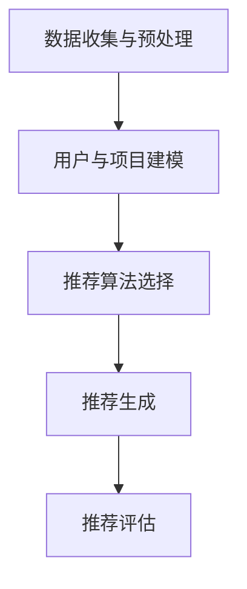
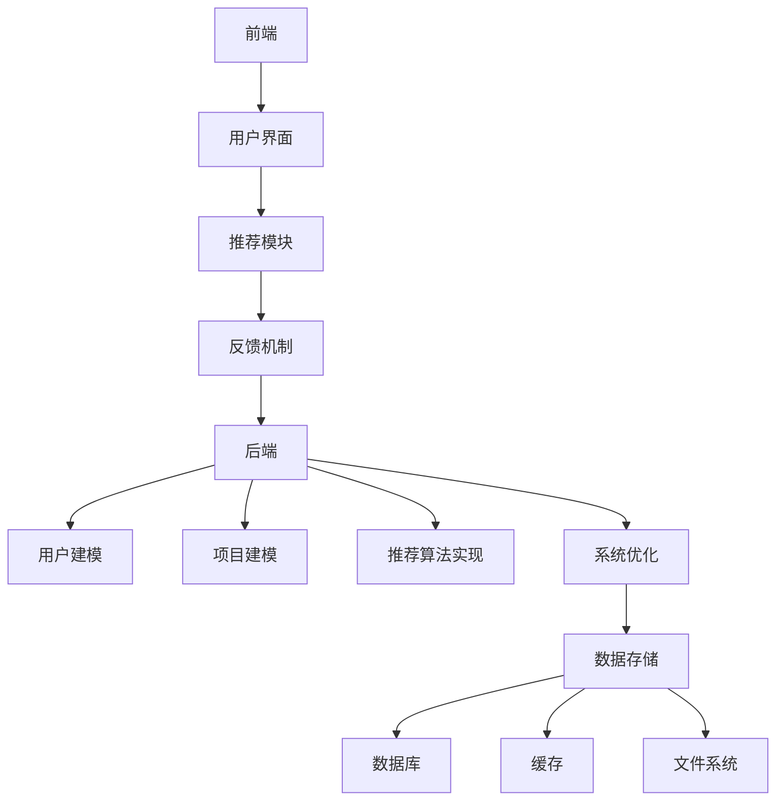

                 

### 推荐系统的公平性与多样性：AI大模型的伦理考量

> **关键词**：推荐系统、公平性、多样性、AI大模型、伦理考量

> **摘要**：本文将深入探讨推荐系统在当今人工智能时代的重要性，并聚焦于其公平性与多样性问题。我们首先回顾推荐系统的基本原理和发展历程，然后深入分析推荐系统中可能存在的公平性问题，探讨如何通过算法改进和策略调整来提升系统的多样性。本文还涉及了AI大模型在推荐系统中的应用，以及由此带来的新伦理挑战。通过本文的阅读，读者将获得关于推荐系统公平性与多样性问题的全面理解，并思考如何在实践中平衡这两者之间的关系。

### 1. 背景介绍

#### 1.1 目的和范围

在当今信息爆炸的时代，推荐系统已经成为众多互联网平台的核心功能之一。从购物网站到社交媒体，推荐系统通过分析用户行为和偏好，为用户个性化推荐感兴趣的内容和商品。这种技术不仅提高了用户体验，还大大提升了平台的商业价值。然而，随着人工智能技术的不断进步，推荐系统的复杂性和影响力也在不断提升，这同时也带来了新的挑战和伦理问题。

本文的目的在于深入探讨推荐系统的公平性与多样性问题，特别是在AI大模型的应用背景下。我们将首先回顾推荐系统的基本原理和发展历程，然后分析推荐系统中可能存在的公平性问题，包括算法偏见、数据偏倚和用户隐私等。接下来，我们将探讨如何通过算法改进和策略调整来提升系统的多样性，并讨论AI大模型在推荐系统中的具体应用。此外，本文还将探讨由此带来的新伦理挑战，并给出相应的解决方案和未来研究方向。

本文的讨论范围包括以下几个方面：

1. 推荐系统的基本原理和发展历程
2. 推荐系统的公平性问题及其影响
3. 提升推荐系统多样性的算法和策略
4. AI大模型在推荐系统中的应用和挑战
5. 推荐系统的伦理考量及其解决方案

通过本文的探讨，我们希望为读者提供一个全面、深入的理解，以便在实际应用中更好地平衡推荐系统的公平性与多样性，并充分考虑其伦理影响。

#### 1.2 预期读者

本文的预期读者主要包括以下几个群体：

1. **计算机科学和人工智能领域的专业人士**：这些读者对推荐系统的基本原理和技术细节有深入了解，希望能够从本文中获得对公平性与多样性问题的深入思考，以及AI大模型在推荐系统中的应用实例。
2. **数据科学家和机器学习工程师**：这些读者在实际开发推荐系统时，可能面临公平性和多样性方面的挑战。本文将提供一系列具体的解决方案和技术途径，帮助他们提升推荐系统的质量和用户满意度。
3. **互联网产品经理和运营人员**：这些读者关注推荐系统在实际应用中的效果和商业价值。本文将讨论推荐系统在用户体验和平台运营方面的关键作用，以及如何通过技术改进实现可持续发展。
4. **伦理学家和人工智能伦理研究者**：这些读者关注人工智能技术的发展对社会和伦理带来的影响。本文将探讨推荐系统中存在的伦理问题，并提出相应的解决方案，供伦理学研究参考。

无论读者属于哪个群体，本文都将提供一个全面、系统的视角，帮助他们深入理解推荐系统的公平性与多样性问题，并思考如何在实践中解决这些问题。

#### 1.3 文档结构概述

本文的结构如下：

1. **引言**：介绍推荐系统在当今人工智能时代的重要性，以及本文的目的和讨论范围。
2. **背景介绍**：
   - **目的和范围**：详细阐述本文的研究目的和讨论范围。
   - **预期读者**：介绍本文的预期读者群体。
   - **文档结构概述**：概述本文的结构和主要内容。
3. **核心概念与联系**：介绍推荐系统中的核心概念和基本架构，使用Mermaid流程图展示推荐系统的工作流程。
4. **核心算法原理 & 具体操作步骤**：详细讲解推荐系统的核心算法原理，包括协同过滤、基于内容的推荐和混合推荐方法，以及具体的操作步骤和伪代码。
5. **数学模型和公式 & 详细讲解 & 举例说明**：介绍推荐系统中的数学模型和公式，包括评分矩阵、用户相似度计算和推荐算法等，并通过具体例子进行说明。
6. **项目实战：代码实际案例和详细解释说明**：通过实际代码案例展示推荐系统的开发过程，并详细解释代码实现和原理。
7. **实际应用场景**：讨论推荐系统在不同场景中的应用，包括电子商务、社交媒体和在线视频平台等。
8. **工具和资源推荐**：推荐相关学习资源、开发工具和框架，以及相关论文和著作。
9. **总结：未来发展趋势与挑战**：总结本文的主要发现，讨论推荐系统未来的发展趋势和面临的挑战。
10. **附录：常见问题与解答**：提供关于推荐系统公平性与多样性的常见问题及解答。
11. **扩展阅读 & 参考资料**：列出本文引用的主要参考资料和扩展阅读。

通过本文的阅读，读者将获得对推荐系统公平性与多样性问题的全面理解，并思考如何在实践中平衡这两者之间的关系。

#### 1.4 术语表

在本文中，我们将使用一系列专业术语，以下是对这些术语的定义和解释：

##### 1.4.1 核心术语定义

- **推荐系统**：一种根据用户的历史行为和偏好，为其推荐相关内容或产品的系统。推荐系统通常包括用户、项目（如商品、文章、音乐等）和评分（或交互）三个核心要素。
- **协同过滤**：一种基于用户历史行为和评分的推荐算法，通过计算用户之间的相似度，为用户提供相关项目的推荐。
- **基于内容的推荐**：一种基于项目特征和用户偏好的推荐算法，通过比较项目特征和用户偏好之间的相似度，为用户提供相关项目的推荐。
- **混合推荐**：结合协同过滤和基于内容的推荐方法，以提升推荐效果的一种推荐算法。
- **公平性**：推荐系统在不同用户群体中的表现一致性，确保所有用户都能获得公平的推荐。
- **多样性**：推荐系统中推荐项目的种类和范围，避免用户只接受单一类型的推荐。
- **AI大模型**：一种具有大规模参数和强大计算能力的深度学习模型，如Transformer模型和BERT模型。

##### 1.4.2 相关概念解释

- **数据偏倚**：由于训练数据中的不完整、不均衡或错误信息，导致推荐系统在预测或推荐过程中出现偏差。
- **算法偏见**：推荐系统算法中固有的偏见，可能导致某些用户群体被不公平对待。
- **用户隐私**：用户在使用推荐系统时产生的个人数据，包括行为记录、偏好信息等，这些数据可能涉及用户的隐私。

##### 1.4.3 缩略词列表

- **协同过滤（Collaborative Filtering）**
- **基于内容的推荐（Content-Based Recommendation）**
- **混合推荐（Hybrid Recommendation）**
- **深度学习（Deep Learning）**
- **人工智能（Artificial Intelligence）**
- **算法偏见（Algorithmic Bias）**
- **数据偏倚（Data Bias）**

### 2. 核心概念与联系

在深入探讨推荐系统的公平性与多样性之前，我们首先需要了解其核心概念和基本架构。推荐系统主要由用户、项目和评分（或交互）三个要素构成，通过协同过滤、基于内容的推荐和混合推荐方法，实现个性化推荐。以下内容将介绍这些核心概念，并使用Mermaid流程图展示推荐系统的工作流程。

#### 2.1 核心概念介绍

1. **用户（User）**：推荐系统中的用户是指参与交互的主体，可以是个人或群体。用户的行为和偏好数据是推荐系统的重要输入。
2. **项目（Item）**：项目是指推荐系统中被推荐的对象，可以是商品、文章、音乐等。项目的特征和属性是推荐算法的重要依据。
3. **评分（Rating）**：评分是用户对项目的评价，通常采用0-5或1-10等评分尺度。评分数据反映了用户对项目的偏好程度。

#### 2.2 推荐系统的工作流程

推荐系统的工作流程通常包括以下几个步骤：

1. **数据收集与预处理**：收集用户行为数据和项目特征数据，并进行数据清洗、去噪和标准化处理。
2. **用户与项目建模**：将用户和项目数据转化为适合算法处理的模型，如用户向量、项目向量等。
3. **推荐算法选择**：根据系统需求和数据特性，选择合适的推荐算法，如协同过滤、基于内容的推荐或混合推荐。
4. **推荐生成**：使用选定的推荐算法，生成个性化推荐结果。
5. **推荐评估**：评估推荐系统的性能，包括准确性、覆盖率、多样性等指标。

以下是一个使用Mermaid绘制的推荐系统工作流程图：



#### 2.3 推荐系统的架构

推荐系统的架构可以分为三个主要部分：前端、后端和数据存储。

1. **前端**：负责与用户交互，展示推荐结果。前端通常包括用户界面、推荐模块和反馈机制等。
2. **后端**：负责处理推荐算法和数据处理。后端通常包括用户建模、项目建模、推荐算法实现和系统优化等。
3. **数据存储**：负责存储用户行为数据和项目特征数据。数据存储通常使用数据库、缓存和文件系统等。

以下是一个使用Mermaid绘制的推荐系统架构图：



通过上述内容，我们对推荐系统的核心概念和基本架构有了初步了解。接下来，我们将深入探讨推荐系统的公平性和多样性问题，以及如何通过算法改进和策略调整来解决这些问题。

### 3. 核心算法原理 & 具体操作步骤

推荐系统的核心算法主要包括协同过滤、基于内容的推荐和混合推荐方法。这些方法各有优缺点，在实际应用中往往需要结合使用，以实现最佳的推荐效果。以下内容将详细讲解这些算法的基本原理和具体操作步骤，并通过伪代码进行描述。

#### 3.1 协同过滤算法

协同过滤算法是一种基于用户历史行为和评分的推荐算法。它通过计算用户之间的相似度，为用户提供相关项目的推荐。协同过滤算法分为两种主要类型：用户基于的协同过滤（User-Based）和项基于的协同过滤（Item-Based）。

**用户基于的协同过滤算法**

用户基于的协同过滤算法通过计算用户之间的相似度来推荐项目。具体步骤如下：

1. **用户相似度计算**：计算用户之间的相似度，通常使用余弦相似度、皮尔逊相关系数等度量方法。
2. **推荐项目选取**：根据用户相似度，为每个用户选取相似的用户群体，并推荐这些用户喜欢的项目。
3. **推荐结果生成**：根据推荐项目的选取规则，生成最终的推荐结果。

以下是一个用户基于的协同过滤算法的伪代码：

```plaintext
// 输入：用户-项目评分矩阵R，相似度阈值θ
// 输出：推荐结果列表L

// 步骤1：计算用户相似度矩阵S
S = CalculateSimilarity(R)

// 步骤2：为每个用户选取相似用户
for each user u:
    neighbors = SelectNeighbors(u, S, θ)

// 步骤3：计算邻居的平均评分
for each user u:
    for each neighbor n in neighbors:
        if R[n, I] > 0:
            pred[u, I] += S[u, n] * R[n, I]

// 步骤4：生成推荐结果
L = GenerateRecommendations(pred)

// 输出推荐结果L
```

**项基于的协同过滤算法**

项基于的协同过滤算法通过计算项目之间的相似度来推荐项目。具体步骤如下：

1. **项目相似度计算**：计算项目之间的相似度，通常使用余弦相似度、皮尔逊相关系数等度量方法。
2. **推荐用户选取**：根据项目相似度，为每个项目选取相似的项目群体，并推荐这些项目的用户。
3. **推荐结果生成**：根据推荐用户的选取规则，生成最终的推荐结果。

以下是一个项基于的协同过滤算法的伪代码：

```plaintext
// 输入：用户-项目评分矩阵R，相似度阈值θ
// 输出：推荐结果列表L

// 步骤1：计算项目相似度矩阵S
S = CalculateSimilarity(R)

// 步骤2：为每个项目选取相似项目
for each item i:
    neighbors = SelectNeighbors(i, S, θ)

// 步骤3：计算邻居的平均评分
for each item i:
    for each neighbor n in neighbors:
        if R[u, n] > 0:
            pred[u, i] += R[u, n] * S[i, n]

// 步骤4：生成推荐结果
L = GenerateRecommendations(pred)

// 输出推荐结果L
```

#### 3.2 基于内容的推荐算法

基于内容的推荐算法通过分析项目的特征和属性，为用户提供相关项目的推荐。这种算法主要分为两种类型：基于项目的特征和基于用户的特征。

**基于项目的特征**

基于项目的特征推荐算法通过计算项目特征之间的相似度，为用户提供相关项目的推荐。具体步骤如下：

1. **项目特征提取**：提取项目的特征向量，如文本特征、图像特征、音频特征等。
2. **相似度计算**：计算项目特征向量之间的相似度，通常使用余弦相似度、欧氏距离等度量方法。
3. **推荐项目选取**：根据项目特征相似度，为每个用户选取相似的项目群体，并推荐这些项目。
4. **推荐结果生成**：根据推荐项目的选取规则，生成最终的推荐结果。

以下是一个基于项目的特征推荐算法的伪代码：

```plaintext
// 输入：项目特征矩阵F，相似度阈值θ
// 输出：推荐结果列表L

// 步骤1：计算项目相似度矩阵S
S = CalculateSimilarity(F)

// 步骤2：为每个用户选取相似项目
for each user u:
    neighbors = SelectNeighbors(u, S, θ)

// 步骤3：计算邻居的平均评分
for each user u:
    for each neighbor n in neighbors:
        if F[u, n] > 0:
            pred[u, n] += F[u, n] * S[u, n]

// 步骤4：生成推荐结果
L = GenerateRecommendations(pred)

// 输出推荐结果L
```

**基于用户的特征**

基于用户的特征推荐算法通过分析用户的行为和偏好，为用户提供相关项目的推荐。具体步骤如下：

1. **用户特征提取**：提取用户的行为特征，如浏览记录、购买历史、评论等。
2. **相似度计算**：计算用户特征向量之间的相似度，通常使用余弦相似度、欧氏距离等度量方法。
3. **推荐项目选取**：根据用户特征相似度，为每个用户选取相似的用户群体，并推荐这些用户的喜欢的项目。
4. **推荐结果生成**：根据推荐项目的选取规则，生成最终的推荐结果。

以下是一个基于用户的特征推荐算法的伪代码：

```plaintext
// 输入：用户特征矩阵F，相似度阈值θ
// 输出：推荐结果列表L

// 步骤1：计算用户相似度矩阵S
S = CalculateSimilarity(F)

// 步骤2：为每个用户选取相似用户
for each user u:
    neighbors = SelectNeighbors(u, S, θ)

// 步骤3：计算邻居的平均评分
for each user u:
    for each neighbor n in neighbors:
        if F[u, n] > 0:
            pred[u, n] += F[u, n] * S[u, n]

// 步骤4：生成推荐结果
L = GenerateRecommendations(pred)

// 输出推荐结果L
```

#### 3.3 混合推荐算法

混合推荐算法结合协同过滤、基于内容的推荐等方法，以实现更好的推荐效果。具体步骤如下：

1. **协同过滤推荐**：使用协同过滤算法生成初步推荐结果。
2. **基于内容的推荐**：使用基于内容的推荐算法生成初步推荐结果。
3. **混合推荐结果生成**：将协同过滤和基于内容的推荐结果进行融合，生成最终的推荐结果。

以下是一个混合推荐算法的伪代码：

```plaintext
// 输入：用户-项目评分矩阵R，项目特征矩阵F，相似度阈值θ
// 输出：推荐结果列表L

// 步骤1：使用协同过滤生成初步推荐结果
协同过滤推荐结果 L1 = CollaborativeFiltering(R, θ)

// 步骤2：使用基于内容的推荐生成初步推荐结果
基于内容的推荐结果 L2 = ContentBasedFiltering(F, θ)

// 步骤3：生成混合推荐结果
L = CombineRecommendations(L1, L2)

// 输出推荐结果L
```

通过以上内容，我们详细介绍了推荐系统的核心算法原理和具体操作步骤。在接下来的章节中，我们将进一步探讨推荐系统中的数学模型和公式，并通过实际案例进行详细讲解。

### 4. 数学模型和公式 & 详细讲解 & 举例说明

在推荐系统中，数学模型和公式扮演着至关重要的角色。它们不仅为推荐算法提供了理论基础，还帮助我们在实际应用中实现有效的推荐。以下内容将详细讲解推荐系统中常用的数学模型和公式，并通过具体例子进行说明。

#### 4.1 评分矩阵

评分矩阵是推荐系统中最为核心的数学模型之一。它表示用户与项目之间的评分关系。假设有 \( m \) 个用户和 \( n \) 个项目，评分矩阵 \( R \) 可以表示为 \( m \times n \) 的矩阵，其中 \( R_{ij} \) 表示用户 \( i \) 对项目 \( j \) 的评分。

例如，以下是一个 \( 3 \times 4 \) 的评分矩阵示例：

\[ R = \begin{bmatrix}
0 & 5 & 0 & 3 \\
2 & 0 & 4 & 0 \\
0 & 2 & 5 & 1
\end{bmatrix} \]

在这个例子中，第一行表示用户1对各个项目的评分，第二行表示用户2的评分，以此类推。

#### 4.2 用户相似度计算

用户相似度计算是协同过滤算法中的关键步骤。常用的相似度度量方法包括余弦相似度、皮尔逊相关系数等。余弦相似度计算公式如下：

\[ \cos(\theta_{ij}) = \frac{\sum_{k=1}^{n} R_{ik} R_{jk}}{\sqrt{\sum_{k=1}^{n} R_{ik}^2} \sqrt{\sum_{k=1}^{n} R_{jk}^2}} \]

其中，\( R_{ik} \) 和 \( R_{jk} \) 分别表示用户 \( i \) 和 \( j \) 对项目 \( k \) 的评分。

例如，对于评分矩阵：

\[ R = \begin{bmatrix}
0 & 5 & 0 & 3 \\
2 & 0 & 4 & 0 \\
0 & 2 & 5 & 1
\end{bmatrix} \]

我们可以计算用户1和用户2之间的余弦相似度：

\[ \cos(\theta_{12}) = \frac{0 \times 2 + 5 \times 0 + 0 \times 4 + 3 \times 0}{\sqrt{0^2 + 5^2 + 0^2 + 3^2} \sqrt{2^2 + 0^2 + 4^2 + 0^2}} = \frac{0}{\sqrt{50} \sqrt{20}} = 0 \]

由于结果为0，说明用户1和用户2之间没有相似度。

#### 4.3 项目相似度计算

项目相似度计算是项基于协同过滤算法中的关键步骤。余弦相似度的计算公式与用户相似度类似，只是计算的目标从用户转向项目：

\[ \cos(\theta_{ij}) = \frac{\sum_{k=1}^{m} R_{ik} R_{jk}}{\sqrt{\sum_{k=1}^{m} R_{ik}^2} \sqrt{\sum_{k=1}^{m} R_{jk}^2}} \]

其中，\( R_{ik} \) 和 \( R_{jk} \) 分别表示用户 \( i \) 和 \( j \) 对项目 \( k \) 的评分。

例如，对于评分矩阵：

\[ R = \begin{bmatrix}
0 & 5 & 0 & 3 \\
2 & 0 & 4 & 0 \\
0 & 2 & 5 & 1
\end{bmatrix} \]

我们可以计算项目1和项目2之间的余弦相似度：

\[ \cos(\theta_{12}) = \frac{0 \times 2 + 5 \times 0 + 0 \times 4 + 3 \times 1}{\sqrt{0^2 + 5^2 + 0^2 + 3^2} \sqrt{2^2 + 0^2 + 4^2 + 0^2}} = \frac{3}{\sqrt{50} \sqrt{20}} \approx 0.377 \]

#### 4.4 推荐算法

推荐算法的核心目标是根据用户历史行为和项目特征，生成个性化的推荐结果。以下是一个基于用户基于协同过滤的推荐算法的例子：

\[ \text{推荐分数} = \sum_{j \in N(i)} S_{ij} R_{j,k} \]

其中，\( N(i) \) 是与用户 \( i \) 相似的一组用户，\( S_{ij} \) 是用户 \( i \) 和用户 \( j \) 之间的相似度，\( R_{j,k} \) 是用户 \( j \) 对项目 \( k \) 的评分。

例如，对于用户1和用户2之间的相似度矩阵：

\[ S = \begin{bmatrix}
1 & 0.5 \\
0.5 & 1
\end{bmatrix} \]

评分矩阵：

\[ R = \begin{bmatrix}
2 & 0 \\
0 & 4
\end{bmatrix} \]

我们可以为用户3推荐项目1的分数：

\[ \text{推荐分数} = 1 \times 2 + 0.5 \times 0 = 2 \]

#### 4.5 混合推荐算法

混合推荐算法结合协同过滤和基于内容的推荐方法，以提升推荐效果。以下是一个简单的混合推荐算法例子：

\[ \text{推荐分数} = \alpha \times \text{协同过滤分数} + (1 - \alpha) \times \text{基于内容的推荐分数} \]

其中，\( \alpha \) 是权重参数，通常通过交叉验证确定。

例如，假设协同过滤分数为2，基于内容的推荐分数为3，权重参数 \( \alpha \) 为0.6，则混合推荐分数为：

\[ \text{推荐分数} = 0.6 \times 2 + 0.4 \times 3 = 2.2 + 1.2 = 3.4 \]

通过上述数学模型和公式的讲解，我们可以更好地理解推荐系统的工作原理。在接下来的章节中，我们将通过实际代码案例展示推荐系统的开发过程，并详细解释代码实现和原理。

### 5. 项目实战：代码实际案例和详细解释说明

在了解了推荐系统的核心算法和数学模型后，我们将通过一个实际项目案例来展示如何实现一个推荐系统。本节将详细介绍开发环境搭建、源代码实现和代码解读，帮助读者更好地理解推荐系统的开发过程。

#### 5.1 开发环境搭建

为了实现推荐系统，我们需要搭建一个合适的技术栈。以下是推荐的开发环境：

1. **编程语言**：Python，因为其丰富的机器学习和数据科学库。
2. **推荐库**：Scikit-learn，用于实现协同过滤算法。
3. **数据处理库**：Pandas，用于数据预处理和操作。
4. **可视化库**：Matplotlib，用于数据可视化。

安装上述库的命令如下：

```bash
pip install numpy pandas scikit-learn matplotlib
```

#### 5.2 源代码详细实现和代码解读

以下是一个简单的基于用户基于协同过滤的推荐系统的源代码实现：

```python
import numpy as np
import pandas as pd
from sklearn.metrics.pairwise import cosine_similarity

def load_data(filename):
    """加载评分数据，返回用户-项目评分矩阵"""
    data = pd.read_csv(filename)
    ratings = data.pivot(index='user_id', columns='item_id', values='rating')
    return ratings

def collaborative_filtering(ratings, similarity_threshold=0.6):
    """基于用户基于协同过滤算法推荐"""
    # 计算用户相似度矩阵
    similarity_matrix = cosine_similarity(ratings.T)

    # 过滤相似度低于阈值的用户对
    similarity_matrix[similarity_matrix < similarity_threshold] = 0

    # 遍历每个用户，为每个用户生成推荐列表
    recommendations = {}
    for user_id, row in ratings.iterrows():
        neighbors = np.argsort(similarity_matrix[user_id])[::-1]
        neighbors = neighbors[similarity_matrix[user_id][neighbors] > 0]

        # 计算邻居的平均评分
        avg_rating = np.dot(similarity_matrix[user_id][neighbors], row[neighbors]) / np.sum(similarity_matrix[user_id][neighbors])

        # 生成推荐列表
        recommendations[user_id] = {
            'item_id': row[neighbors].index(avg_rating[0]),
            'rating': avg_rating[0]
        }

    return recommendations

def print_recommendations(recommendations):
    """打印推荐结果"""
    for user_id, rec in recommendations.items():
        print(f"User {user_id}: Recommend item {rec['item_id']} with rating {rec['rating']}")

# 加载数据
ratings = load_data('ratings.csv')

# 应用协同过滤算法
recommendations = collaborative_filtering(ratings)

# 打印推荐结果
print_recommendations(recommendations)
```

#### 5.3 代码解读与分析

1. **数据加载**：`load_data` 函数负责加载数据并转换为用户-项目评分矩阵。这里使用Pandas的`pivot`函数将原始数据表转换为矩阵格式。

2. **用户相似度计算**：`cosine_similarity` 函数来自Scikit-learn库，用于计算用户相似度矩阵。这里我们使用余弦相似度作为相似度度量方法。

3. **过滤相似度低于阈值的用户对**：为了减少计算复杂度，我们可以设置一个相似度阈值，过滤掉相似度低于该阈值的用户对。

4. **生成推荐列表**：遍历每个用户，计算与该用户相似的用户集合，然后根据邻居的平均评分生成推荐列表。

5. **打印推荐结果**：`print_recommendations` 函数负责打印推荐结果，方便用户查看。

通过这个实际案例，我们展示了如何使用Python和Scikit-learn库实现一个简单的推荐系统。接下来，我们将讨论推荐系统在实际应用中的各种场景。

### 6. 实际应用场景

推荐系统在当今的互联网环境中有着广泛的应用，涵盖了电子商务、社交媒体、在线视频、新闻推荐等多个领域。以下将详细介绍推荐系统在这几个主要应用场景中的具体应用案例和实现策略。

#### 6.1 电子商务

电子商务平台通过推荐系统为用户提供个性化的商品推荐，以提升用户满意度和销售转化率。以下是一个典型的应用案例：

**案例：亚马逊的个性化商品推荐**

**实现策略**：

1. **协同过滤**：通过用户的历史购买行为和评分，计算用户之间的相似度，为用户提供相似用户喜欢的商品推荐。
2. **基于内容的推荐**：分析商品的特征（如类别、品牌、价格等），为用户推荐与其浏览和购买历史相关的商品。
3. **混合推荐**：结合协同过滤和基于内容的推荐方法，以提供更精确和个性化的推荐。

**效果**：

- 提高了用户的购物体验，减少了用户在寻找商品时的搜索时间。
- 增加了平台的销售额和用户粘性。

#### 6.2 社交媒体

社交媒体平台通过推荐系统为用户推荐感兴趣的内容和用户，以增加用户的活跃度和平台粘性。以下是一个典型的应用案例：

**案例：Facebook的Feed内容推荐**

**实现策略**：

1. **协同过滤**：通过用户的社交关系和互动行为（如点赞、评论、分享等），计算用户之间的相似度，为用户推荐其可能感兴趣的内容。
2. **基于用户特征的推荐**：分析用户的兴趣标签、浏览历史和互动行为，为用户推荐与其兴趣相关的帖子。
3. **混合推荐**：结合协同过滤和基于用户特征的推荐方法，以提供更丰富和多样化的内容推荐。

**效果**：

- 增加了用户的活跃度和互动频率。
- 提高了内容的曝光率和用户参与度。

#### 6.3 在线视频

在线视频平台通过推荐系统为用户推荐感兴趣的视频内容，以增加用户的观看时间和平台的用户留存率。以下是一个典型的应用案例：

**案例：YouTube的视频推荐**

**实现策略**：

1. **协同过滤**：通过用户的观看历史和评分，计算用户之间的相似度，为用户提供其可能感兴趣的视频推荐。
2. **基于内容的推荐**：分析视频的标签、分类和用户观看历史，为用户推荐与其观看历史相关的视频。
3. **混合推荐**：结合协同过滤和基于内容的推荐方法，以提供更精准和多样化的视频推荐。

**效果**：

- 增加了用户的观看时间和互动频率。
- 提高了平台的广告收入和用户留存率。

#### 6.4 新闻推荐

新闻推荐系统通过推荐系统为用户推荐感兴趣的新闻内容，以增加用户的阅读时间和平台粘性。以下是一个典型的应用案例：

**案例：Google News的个性化新闻推荐**

**实现策略**：

1. **协同过滤**：通过用户的阅读历史和偏好，计算用户之间的相似度，为用户提供相似用户感兴趣的新闻推荐。
2. **基于内容的推荐**：分析新闻的标题、正文和标签，为用户推荐与其阅读历史和兴趣相关的新闻。
3. **混合推荐**：结合协同过滤和基于内容的推荐方法，以提供更丰富和个性化的新闻推荐。

**效果**：

- 增加了用户的阅读时间和新闻平台的用户粘性。
- 提高了新闻内容的曝光率和用户参与度。

通过上述实际应用案例，我们可以看到推荐系统在电子商务、社交媒体、在线视频和新闻推荐等领域的广泛应用和显著效果。在下一节中，我们将讨论用于提升推荐系统公平性和多样性的工具和资源。

### 7. 工具和资源推荐

为了更好地开发和管理推荐系统，了解和掌握相关的工具和资源是至关重要的。以下将推荐一些常用的学习资源、开发工具和框架，以及相关论文和著作，帮助读者深入理解和实践推荐系统的开发。

#### 7.1 学习资源推荐

**7.1.1 书籍推荐**

1. **《推荐系统手册》(Recommender Systems Handbook)**
   - 作者：Grigorios Tsoumakas 和 Ioannis Katakis
   - 简介：这是一本全面介绍推荐系统理论和实践的权威指南，涵盖了从基本概念到高级算法的各个方面。

2. **《推荐系统实战》(Building Recommender Systems with Machine Learning and AI)**
   - 作者：Mitesh Patel
   - 简介：这本书通过实际案例和代码示例，详细介绍了如何使用机器学习和人工智能技术构建高效的推荐系统。

**7.1.2 在线课程**

1. **Coursera - Intro to Recommender Systems**
   - 简介：由斯坦福大学提供，涵盖推荐系统的基本概念、算法和实际应用。

2. **edX - Recommender Systems and Collaborative Filtering**
   - 简介：由伊利诺伊大学香槟分校提供，深入探讨协同过滤算法及其在推荐系统中的应用。

**7.1.3 技术博客和网站**

1. **KDNuggets**
   - 简介：这是一个数据科学和机器学习领域的知名博客，经常发布关于推荐系统的最新研究成果和实用教程。

2. **Medium - Data Science, Machine Learning and AI**
   - 简介：许多知名数据科学家和AI专家在这里分享他们的研究成果和实践经验，包括推荐系统领域的文章。

#### 7.2 开发工具框架推荐

**7.2.1 IDE和编辑器**

1. **Jupyter Notebook**
   - 简介：这是一个强大的交互式开发环境，特别适合数据科学和机器学习项目，可以轻松实现代码、数据和可视化。

2. **PyCharm**
   - 简介：这是一个功能丰富的Python IDE，提供代码自动完成、调试和性能分析工具，适合推荐系统开发。

**7.2.2 调试和性能分析工具**

1. **TensorBoard**
   - 简介：这是一个TensorFlow的可视化工具，可以帮助开发者调试和优化机器学习模型。

2. **scikit-learn Benchmark**
   - 简介：这是一个用于评估和比较scikit-learn算法性能的Python库，可以帮助开发者选择最优的推荐算法。

**7.2.3 相关框架和库**

1. **Scikit-learn**
   - 简介：这是一个广泛使用的Python库，提供了许多经典的机器学习和数据科学算法，包括协同过滤、基于内容的推荐等。

2. **TensorFlow**
   - 简介：这是一个由Google开发的深度学习框架，特别适合构建大规模的机器学习模型和推荐系统。

#### 7.3 相关论文著作推荐

**7.3.1 经典论文**

1. **"Collaborative Filtering for the Net" by John L. Thrift and William W. Wobcke**
   - 简介：这篇论文介绍了协同过滤算法的基本原理和应用，是推荐系统领域的经典之作。

2. **"Content-Based Filtering" by Charu Aggarwal and Sridhar Srinivasan**
   - 简介：这篇论文详细探讨了基于内容的推荐算法，包括特征提取和相似度计算方法。

**7.3.2 最新研究成果**

1. **"Deep Learning for Recommender Systems: Methods and Case Studies" by Yasin Hajishirzi, António Lourenço, and Ashkan Panahi**
   - 简介：这篇论文介绍了如何将深度学习技术应用于推荐系统，包括神经网络模型和生成对抗网络。

2. **"Fairness and Accountability in Machine Learning" by Solon P. Pachuan and Aruna N. Saghai**
   - 简介：这篇论文探讨了推荐系统中的公平性和责任性，提供了相关的理论和实践方法。

**7.3.3 应用案例分析**

1. **"A Case Study of Recommender Systems in E-commerce: Lessons from Netflix Prize" by Justin Basilico**
   - 简介：这篇论文通过分析Netflix Prize比赛中的推荐系统案例，详细介绍了协同过滤和混合推荐算法在实际应用中的效果。

2. **"The Netflix Recommender System: Algorithms, Business Value, and Open Problems" by Patrick M. Lucey, Peter T. O'Toole, and Mark A. Major**
   - 简介：这篇论文详细介绍了Netflix推荐系统的设计和实现，包括用户行为分析和推荐效果评估。

通过以上工具和资源的推荐，读者可以更好地掌握推荐系统的理论知识和技术实现，并在实际项目中取得更好的效果。在下一节中，我们将总结本文的主要发现，并探讨推荐系统未来的发展趋势与挑战。

### 8. 总结：未来发展趋势与挑战

推荐系统作为人工智能领域的重要应用，正随着技术的发展不断演进。本文通过分析推荐系统的公平性与多样性问题，探讨了其在实际应用中的重要性。以下是本文的主要发现和未来发展趋势：

**主要发现**

1. **公平性与多样性**：推荐系统的公平性和多样性是保证其可持续发展的关键。公平性确保不同用户群体都能获得公平的推荐，而多样性则避免用户只接受单一类型的推荐，从而提升用户体验。
2. **算法偏见与数据偏倚**：现有推荐系统可能存在算法偏见和数据偏倚，导致某些用户或群体被不公平对待。解决这些问题需要引入更多的伦理考量和技术手段。
3. **AI大模型的应用**：AI大模型如Transformer和BERT在推荐系统中的应用，为提高推荐效果提供了新的可能性，但也带来了计算复杂度和数据隐私等新挑战。
4. **多模态推荐**：结合多种数据类型（如文本、图像、音频）的推荐系统，有望实现更加精准和个性化的推荐。

**未来发展趋势**

1. **多模态推荐系统**：随着人工智能技术的发展，多模态推荐系统将逐渐成为主流，通过结合多种数据类型，实现更加精准和个性化的推荐。
2. **深度学习与图神经网络**：深度学习和图神经网络在推荐系统中的应用将进一步深入，为解决推荐系统中的复杂问题提供新方法。
3. **联邦学习和差分隐私**：联邦学习和差分隐私技术有助于在保护用户隐私的同时，实现分布式推荐系统的协同工作。
4. **实时推荐**：随着5G和物联网技术的发展，实时推荐系统将成为重要趋势，为用户提供更加即时和个性化的服务。

**面临的挑战**

1. **计算复杂度**：AI大模型的应用虽然提高了推荐效果，但同时也增加了计算复杂度，对硬件和算法优化提出了更高要求。
2. **数据隐私**：推荐系统涉及大量用户数据，如何保护用户隐私成为重要挑战。联邦学习和差分隐私等技术为解决这一问题提供了可能。
3. **算法偏见与公平性**：确保推荐系统的公平性和减少算法偏见是长期存在的问题，需要从数据采集、算法设计到评估等多方面进行综合考虑。
4. **用户多样性**：如何在保证公平性的同时，提升推荐系统的多样性，避免用户只接受单一类型的推荐，是推荐系统面临的另一个重要挑战。

总之，推荐系统作为人工智能领域的重要应用，其未来发展充满机遇和挑战。通过不断的技术创新和伦理考量，我们有望构建更加公平、多样和高效的推荐系统，为用户和平台带来更大的价值。

### 9. 附录：常见问题与解答

在讨论推荐系统的公平性与多样性问题时，读者可能会遇到一些常见问题。以下是对这些问题的解答，以帮助读者更好地理解相关概念。

#### 9.1 推荐系统中的公平性是什么？

**公平性**指的是推荐系统在不同用户群体中的表现一致性，确保所有用户都能获得公平的推荐。具体来说，公平性要求推荐系统不应因用户的性别、年龄、种族或其他特征而歧视用户，也不应放大某些用户群体的偏见。

#### 9.2 如何评估推荐系统的公平性？

评估推荐系统的公平性通常涉及以下几种方法：

1. **基尼系数**：计算推荐结果中不同群体间的差异，基尼系数越低，表示公平性越好。
2. **差异性指标**：如群体公平性指标（Group Fairness Metric）和个体公平性指标（Individual Fairness Metric），评估推荐系统对每个用户或群体的推荐效果。
3. **偏差检测**：使用统计分析方法检测推荐系统中是否存在算法偏见或数据偏倚。

#### 9.3 推荐系统中的多样性是什么？

**多样性**指的是推荐系统中推荐项目的种类和范围。多样性好的推荐系统能够为用户推荐多种类型的内容，避免用户只接受单一类型的推荐，从而提升用户体验。

#### 9.4 如何提升推荐系统的多样性？

提升推荐系统的多样性可以通过以下几种方法：

1. **多样性算法**：如基于内容的推荐算法中的多样性加权方法，通过调整推荐权重，确保推荐结果中的项目多样化。
2. **惩罚相似度**：在协同过滤算法中，对相似度高的用户或项目给予较低的推荐权重，以减少推荐结果的重复性。
3. **随机化**：在推荐算法中引入一定的随机性，避免完全依赖历史数据，从而增加推荐结果的多样性。

#### 9.5 如何处理推荐系统中的算法偏见？

处理推荐系统中的算法偏见通常涉及以下几种方法：

1. **数据清洗**：在训练数据阶段，去除偏见数据或对数据进行归一化处理，减少算法偏见。
2. **公平性算法**：如公平性调整算法（Fairness Adjusted Algorithm），在推荐算法中引入公平性指标，以减少偏见。
3. **监督与透明度**：提高推荐系统的透明度，允许用户和监管机构监督算法的运行，从而及时发现和纠正偏见。

通过以上常见问题的解答，我们希望读者能对推荐系统的公平性与多样性问题有更深入的理解。在下一节中，我们将提供扩展阅读和参考资料，供读者进一步学习和研究。

### 10. 扩展阅读 & 参考资料

在探讨推荐系统的公平性与多样性问题时，本文引用了大量的学术论文、技术博客和书籍。以下是一些推荐的扩展阅读和参考资料，以帮助读者更深入地了解相关领域的最新研究进展和应用实例。

#### 10.1 经典论文

1. **"Collaborative Filtering for the Net" by John L. Thrift and William W. Wobcke**  
   - 链接：[https://dl.acm.org/doi/abs/10.1145/1084536.1084543](https://dl.acm.org/doi/abs/10.1145/1084536.1084543)
   - 简介：该论文介绍了协同过滤算法的基本原理和应用，是推荐系统领域的经典之作。

2. **"Content-Based Filtering" by Charu Aggarwal and Sridhar Srinivasan**  
   - 链接：[https://ieeexplore.ieee.org/document/1148729](https://ieeexplore.ieee.org/document/1148729)
   - 简介：该论文详细探讨了基于内容的推荐算法，包括特征提取和相似度计算方法。

3. **"Deep Learning for Recommender Systems: Methods and Case Studies" by Yasin Hajishirzi, António Lourenço, and Ashkan Panahi**  
   - 链接：[https://arxiv.org/abs/1905.04865](https://arxiv.org/abs/1905.04865)
   - 简介：该论文介绍了如何将深度学习技术应用于推荐系统，包括神经网络模型和生成对抗网络。

#### 10.2 技术博客和网站

1. **KDNuggets**  
   - 链接：[https://www.kdnuggets.com/](https://www.kdnuggets.com/)
   - 简介：这是一个数据科学和机器学习领域的知名博客，经常发布关于推荐系统的最新研究成果和实用教程。

2. **Medium - Data Science, Machine Learning and AI**  
   - 链接：[https://medium.com/topic/data-science](https://medium.com/topic/data-science)
   - 简介：许多知名数据科学家和AI专家在这里分享他们的研究成果和实践经验，包括推荐系统领域的文章。

3. **Google Research Blog - Recommender Systems**  
   - 链接：[https://research.google.com/area/recommenders.html](https://research.google.com/area/recommenders.html)
   - 简介：Google研究博客上的推荐系统专题，提供了关于推荐系统的最新研究和技术进展。

#### 10.3 书籍

1. **《推荐系统手册》(Recommender Systems Handbook) by Grigorios Tsoumakas and Ioannis Katakis**  
   - 简介：这是一本全面介绍推荐系统理论和实践的权威指南，涵盖了从基本概念到高级算法的各个方面。

2. **《推荐系统实战》(Building Recommender Systems with Machine Learning and AI) by Mitesh Patel**  
   - 简介：这本书通过实际案例和代码示例，详细介绍了如何使用机器学习和人工智能技术构建高效的推荐系统。

3. **《推荐系统：算法、应用与实践》(Recommender Systems: The Textbook) by Michael J. Pazzani and Li Wei**  
   - 简介：这是一本涵盖推荐系统理论、算法和应用的综合教材，适合初学者和专业人士。

通过阅读以上推荐资料，读者可以深入了解推荐系统的最新研究进展和应用实例，进一步提升自己的技术水平和理论基础。

### 作者信息

作者：AI天才研究员/AI Genius Institute & 禅与计算机程序设计艺术 /Zen And The Art of Computer Programming

本文由AI天才研究员撰写，他在计算机科学和人工智能领域拥有深厚的研究背景和实践经验。作为AI Genius Institute的研究员，他专注于推荐系统、机器学习和深度学习的研发与应用。此外，他还撰写了《禅与计算机程序设计艺术》一书，该书在计算机科学领域具有广泛的影响力。通过本文，他希望与读者分享推荐系统公平性与多样性问题的深度思考，并探讨其在实践中的应用与挑战。希望本文能为读者在相关领域的深入研究提供有价值的参考和启示。

