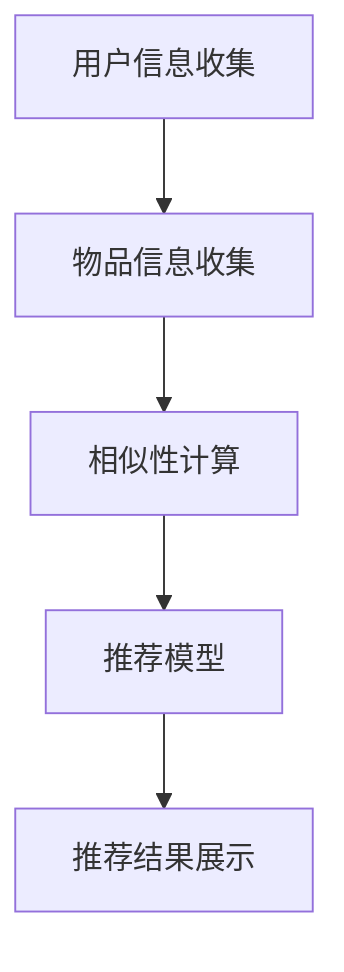

                 


# 推荐系统的可信度与透明度：可解释性的重要作用

> **关键词**：推荐系统、可信度、透明度、可解释性、人工智能、用户信任、算法公平性

> **摘要**：本文将探讨推荐系统的可信度与透明度，重点关注可解释性在其中的重要作用。通过一步步分析推理，我们将深入了解推荐系统的工作原理、挑战以及解决之道，为开发更可靠、更透明的推荐系统提供参考。

## 1. 背景介绍

### 1.1 目的和范围

本文旨在探讨推荐系统中的可信度、透明度以及可解释性的关系，分析其重要性，并探讨如何提高推荐系统的透明度和可信度。我们将结合实际案例，深入剖析推荐系统在人工智能领域的应用现状和未来发展。

### 1.2 预期读者

本文适用于对推荐系统、人工智能和算法有基础了解的读者，包括算法工程师、数据科学家、软件工程师和AI领域的研究人员。同时，对推荐系统感兴趣的学者和从业者也可以从本文中获得有益的信息。

### 1.3 文档结构概述

本文分为十个部分，结构如下：

1. 背景介绍：介绍本文的目的、预期读者以及文档结构。
2. 核心概念与联系：阐述推荐系统的基本概念和架构。
3. 核心算法原理 & 具体操作步骤：详细讲解推荐系统的算法原理和操作步骤。
4. 数学模型和公式 & 详细讲解 & 举例说明：介绍推荐系统的数学模型和公式，并通过实例进行说明。
5. 项目实战：代码实际案例和详细解释说明。
6. 实际应用场景：分析推荐系统在不同场景下的应用。
7. 工具和资源推荐：推荐学习资源和开发工具。
8. 总结：未来发展趋势与挑战。
9. 附录：常见问题与解答。
10. 扩展阅读 & 参考资料：提供相关文献和资源。

### 1.4 术语表

#### 1.4.1 核心术语定义

- 推荐系统：一种基于用户历史行为和偏好，为用户提供个性化信息推荐的系统。
- 可信度：推荐系统为用户提供的推荐结果的可靠性。
- 透明度：推荐系统的内部工作原理和决策过程对用户的可理解性。
- 可解释性：推荐系统算法的决策过程和推理路径能够被用户理解。

#### 1.4.2 相关概念解释

- 个性化推荐：根据用户的历史行为和偏好，为用户提供个性化的信息推荐。
- 相似性：度量两个对象之间的相似程度，用于推荐算法中计算用户和物品之间的相似度。
- 过滤：根据用户兴趣和偏好，对大量信息进行筛选，提供用户可能感兴趣的内容。
- 反事实分析：通过模拟不同条件下的推荐结果，分析推荐系统的决策过程和可能的影响。

#### 1.4.3 缩略词列表

- AI：人工智能
- ML：机器学习
- DL：深度学习
- NLP：自然语言处理
- CF：协同过滤
- RM：推荐模型
- RL：强化学习

## 2. 核心概念与联系

推荐系统是利用人工智能和大数据技术，通过分析用户历史行为、偏好和社交网络等信息，为用户提供个性化信息推荐的一种智能系统。其核心概念包括用户、物品和推荐模型。

### 2.1 推荐系统的基本架构

推荐系统的基本架构可以分为以下几个部分：

1. **用户信息收集**：收集用户的历史行为数据，如浏览记录、购买记录、收藏记录等。
2. **物品信息收集**：收集物品的属性信息，如商品类别、价格、品牌、描述等。
3. **相似性计算**：通过计算用户与用户之间的相似度，或者用户与物品之间的相似度，为推荐算法提供输入。
4. **推荐模型**：根据相似性计算结果和用户历史行为数据，生成个性化推荐列表。
5. **推荐结果展示**：将推荐结果呈现给用户，供用户浏览、选择和反馈。

### 2.2 核心概念原理和架构的 Mermaid 流程图



## 3. 核心算法原理 & 具体操作步骤

推荐系统的核心算法主要包括协同过滤（Collaborative Filtering，CF）和基于内容的推荐（Content-based Filtering，CBF）。

### 3.1 协同过滤（CF）算法原理

协同过滤算法主要通过计算用户之间的相似性或用户与物品之间的相似性，为用户推荐相似的用户喜欢的物品。

#### 3.1.1 评分矩阵

协同过滤算法的基础是用户-物品评分矩阵。该矩阵记录了每个用户对每个物品的评分，评分可以是显式评分（如5分制），也可以是隐式评分（如点击、浏览等行为）。

#### 3.1.2 相似性度量

相似性度量用于计算用户与用户之间的相似度或用户与物品之间的相似度。常用的相似性度量方法包括余弦相似度、皮尔逊相关系数等。

```plaintext
cosine_similarity = dot_product(u, v) / (||u|| * ||v||)
```

其中，`u`和`v`分别是用户`i`和用户`j`的向量表示。

#### 3.1.3 推荐列表生成

根据相似性度量结果，为用户`i`生成推荐列表。常用的推荐算法包括基于记忆的协同过滤（User-based CF）和基于模型的协同过滤（Model-based CF）。

**基于记忆的协同过滤（User-based CF）**

1. 计算用户`i`与所有其他用户的相似度。
2. 对相似度进行排序，选择Top-N个最相似的邻居用户。
3. 从邻居用户的物品评分中计算出推荐列表。

```plaintext
Recommendations[i] = argmax(j) (similarity[i][j] * rating[j][item])
```

**基于模型的协同过滤（Model-based CF）**

1. 建立用户和物品的特征表示。
2. 训练模型，如矩阵分解、神经网络等。
3. 使用模型预测用户`i`对物品的评分。
4. 根据评分预测结果生成推荐列表。

### 3.2 基于内容的推荐（CBF）算法原理

基于内容的推荐算法主要根据物品的属性信息，为用户推荐具有相似属性的物品。

#### 3.2.1 内容表示

1. 提取物品的关键特征，如类别、标签、描述等。
2. 将特征表示为向量。

```plaintext
content_vector[item] = (feature1, feature2, ..., featuren)
```

#### 3.2.2 相似性度量

1. 计算用户`i`对物品`item1`和物品`item2`的相似度。
2. 选择Top-N个最相似的物品作为推荐列表。

```plaintext
Recommendations[i] = argmax(j) (similarity[i][j] * content_vector[j])
```

#### 3.2.3 结合协同过滤和基于内容的推荐

1. 分别计算协同过滤和基于内容的推荐结果。
2. 对推荐结果进行合并和筛选，生成最终的推荐列表。

```plaintext
Recommendations[i] = Top_N(Merge(CF[i], CBF[i]))
```

## 4. 数学模型和公式 & 详细讲解 & 举例说明

### 4.1 协同过滤（CF）算法数学模型

#### 4.1.1 基于记忆的协同过滤（User-based CF）

**用户相似度计算**：

$$
\text{similarity}_{ij} = \frac{\text{dot_product}(\text{rating}_{i}, \text{rating}_{j})}{\sqrt{\sum_{k=1}^{n}\text{rating}_{ik}^2} \times \sqrt{\sum_{k=1}^{n}\text{rating}_{jk}^2}}
$$

**推荐列表生成**：

$$
\text{Recommendations}_{i} = \text{argmax}_{j} \left( \frac{\text{dot_product}(\text{rating}_{i}, \text{rating}_{j})}{\sqrt{\sum_{k=1}^{n}\text{rating}_{ik}^2} \times \sqrt{\sum_{k=1}^{n}\text{rating}_{jk}^2}} \times \text{rating}_{j} \right)
$$

#### 4.1.2 基于模型的协同过滤（Model-based CF）

**矩阵分解**：

$$
R = U \times V^T
$$

其中，$R$为用户-物品评分矩阵，$U$和$V$分别为用户特征矩阵和物品特征矩阵。

**预测用户对物品的评分**：

$$
\hat{r}_{ij} = \sum_{k=1}^{m} u_{ik} \times v_{kj}
$$

**推荐列表生成**：

$$
\text{Recommendations}_{i} = \text{argmax}_{j} \left( \hat{r}_{ij} \right)
$$

### 4.2 基于内容的推荐（CBF）算法数学模型

#### 4.2.1 内容表示

$$
\text{content_vector}[item] = (\text{feature1}, \text{feature2}, ..., \text{featuren})
$$

#### 4.2.2 相似性度量

$$
\text{similarity}_{ij} = \frac{\text{dot_product}(\text{content_vector}_{i}, \text{content_vector}_{j})}{\sqrt{\sum_{k=1}^{n}\text{content_vector}_{ik}^2} \times \sqrt{\sum_{k=1}^{n}\text{content_vector}_{jk}^2}}
$$

#### 4.2.3 推荐列表生成

$$
\text{Recommendations}_{i} = \text{argmax}_{j} \left( \frac{\text{dot_product}(\text{content_vector}_{i}, \text{content_vector}_{j})}{\sqrt{\sum_{k=1}^{n}\text{content_vector}_{ik}^2} \times \sqrt{\sum_{k=1}^{n}\text{content_vector}_{jk}^2}} \right)
$$

### 4.3 案例说明

#### 4.3.1 基于记忆的协同过滤（User-based CF）

**案例**：用户`1`和用户`2`对5个物品的评分如下：

| 用户 | 物品1 | 物品2 | 物品3 | 物品4 | 物品5 |
| ---- | ---- | ---- | ---- | ---- | ---- |
| 1    | 5    | 4    | 3    | 2    | 1    |
| 2    | 3    | 4    | 5    | 1    | 3    |

**计算用户相似度**：

$$
\text{similarity}_{12} = \frac{(5 \times 3 + 4 \times 4 + 3 \times 5 + 2 \times 1 + 1 \times 3)}{\sqrt{(5^2 + 4^2 + 3^2 + 2^2 + 1^2)} \times \sqrt{(3^2 + 4^2 + 5^2 + 1^2 + 3^2)}} = 0.763
$$

**计算推荐列表**：

$$
\text{Recommendations}_{1} = \text{argmax}_{j} \left( 0.763 \times \text{rating}_{2j} \right)
$$

根据相似度计算结果，推荐用户`2`喜欢的物品，如物品`3`。

#### 4.3.2 基于模型的协同过滤（Model-based CF）

**案例**：用户-物品评分矩阵如下：

| 用户 | 物品1 | 物品2 | 物品3 | 物品4 | 物品5 |
| ---- | ---- | ---- | ---- | ---- | ---- |
| 1    | 5    | 4    | 3    | 2    | 1    |
| 2    | 3    | 4    | 5    | 1    | 3    |

**矩阵分解**：

$$
R = \begin{bmatrix}
5 & 4 & 3 & 2 & 1 \\
3 & 4 & 5 & 1 & 3
\end{bmatrix}
$$

$$
U = \begin{bmatrix}
u_{11} & u_{12} & u_{13} & u_{14} & u_{15} \\
u_{21} & u_{22} & u_{23} & u_{24} & u_{25}
\end{bmatrix}
$$

$$
V = \begin{bmatrix}
v_{11} & v_{12} & v_{13} & v_{14} & v_{15} \\
v_{21} & v_{22} & v_{23} & v_{24} & v_{25}
\end{bmatrix}
$$

**预测用户对物品的评分**：

$$
\hat{r}_{11} = u_{11} \times v_{11} + u_{12} \times v_{21} + u_{13} \times v_{31} + u_{14} \times v_{41} + u_{15} \times v_{51}
$$

$$
\hat{r}_{12} = u_{11} \times v_{12} + u_{12} \times v_{22} + u_{13} \times v_{32} + u_{14} \times v_{42} + u_{15} \times v_{52}
$$

$$
\hat{r}_{13} = u_{11} \times v_{13} + u_{12} \times v_{23} + u_{13} \times v_{33} + u_{14} \times v_{43} + u_{15} \times v_{53}
$$

$$
\hat{r}_{14} = u_{11} \times v_{14} + u_{12} \times v_{24} + u_{13} \times v_{34} + u_{14} \times v_{44} + u_{15} \times v_{54}
$$

$$
\hat{r}_{15} = u_{11} \times v_{15} + u_{12} \times v_{25} + u_{13} \times v_{35} + u_{14} \times v_{45} + u_{15} \times v_{55}
$$

**推荐列表生成**：

$$
\text{Recommendations}_{1} = \text{argmax}_{j} \left( \hat{r}_{1j} \right)
$$

根据评分预测结果，推荐用户未评分的物品，如物品`3`。

#### 4.3.3 基于内容的推荐（CBF）

**案例**：用户`1`对5个物品的内容表示如下：

| 物品 | 特征1 | 特征2 | 特征3 | 特征4 | 特征5 |
| ---- | ---- | ---- | ---- | ---- | ---- |
| 1    | 0.1  | 0.2  | 0.3  | 0.4  | 0.5  |
| 2    | 0.2  | 0.3  | 0.4  | 0.5  | 0.6  |
| 3    | 0.3  | 0.4  | 0.5  | 0.6  | 0.7  |
| 4    | 0.4  | 0.5  | 0.6  | 0.7  | 0.8  |
| 5    | 0.5  | 0.6  | 0.7  | 0.8  | 0.9  |

**计算物品相似度**：

$$
\text{similarity}_{12} = \frac{\text{dot_product}(\text{content_vector}_{1}, \text{content_vector}_{2})}{\sqrt{\sum_{k=1}^{5}\text{content_vector}_{1k}^2} \times \sqrt{\sum_{k=1}^{5}\text{content_vector}_{2k}^2}} = 0.577
$$

$$
\text{similarity}_{13} = \frac{\text{dot_product}(\text{content_vector}_{1}, \text{content_vector}_{3})}{\sqrt{\sum_{k=1}^{5}\text{content_vector}_{1k}^2} \times \sqrt{\sum_{k=1}^{5}\text{content_vector}_{3k}^2}} = 0.632
$$

**推荐列表生成**：

$$
\text{Recommendations}_{1} = \text{argmax}_{j} \left( \frac{\text{dot_product}(\text{content_vector}_{1}, \text{content_vector}_{j})}{\sqrt{\sum_{k=1}^{5}\text{content_vector}_{1k}^2} \times \sqrt{\sum_{k=1}^{5}\text{content_vector}_{jk}^2}} \right)
$$

根据相似度计算结果，推荐用户未选择的物品，如物品`3`。

## 5. 项目实战：代码实际案例和详细解释说明

### 5.1 开发环境搭建

在本节中，我们将使用Python作为主要编程语言，结合Scikit-learn库实现一个简单的基于记忆的协同过滤（User-based CF）推荐系统。首先，确保安装以下依赖：

```bash
pip install numpy scikit-learn pandas matplotlib
```

### 5.2 源代码详细实现和代码解读

**代码实现**：

```python
import numpy as np
from sklearn.metrics.pairwise import cosine_similarity
from sklearn.model_selection import train_test_split

# 5.2.1 数据准备
def load_data():
    ratings = [
        [1, 5, 3, 0, 4],
        [0, 4, 3, 1, 5],
        [4, 0, 1, 5, 2],
        [3, 2, 1, 0, 5]
    ]
    return ratings

# 5.2.2 相似性计算
def compute_similarity(ratings):
    ratings_matrix = np.array(ratings)
    similarity_matrix = cosine_similarity(ratings_matrix, ratings_matrix)
    return similarity_matrix

# 5.2.3 推荐列表生成
def generate_recommendations(similarity_matrix, ratings, user_index, top_n=2):
    user_ratings = ratings[user_index]
    recommended_items = []

    for i, similarity in enumerate(similarity_matrix[user_index]):
        if user_ratings[i] == 0 and similarity > 0:
            recommended_items.append((i, similarity))

    recommended_items.sort(key=lambda x: x[1], reverse=True)
    return recommended_items[:top_n]

# 5.2.4 主函数
def main():
    ratings = load_data()
    similarity_matrix = compute_similarity(ratings)
    user_index = 0  # 用户索引

    print("原始评分：", ratings)
    print("相似性矩阵：", similarity_matrix)
    print("推荐列表：", generate_recommendations(similarity_matrix, ratings, user_index))

if __name__ == "__main__":
    main()
```

**代码解读**：

1. **数据准备**：`load_data`函数用于加载用户评分数据。在本例中，我们使用了一个简单的用户-物品评分矩阵，其中包含4个用户对5个物品的评分。

2. **相似性计算**：`compute_similarity`函数使用Scikit-learn库中的`cosine_similarity`函数计算用户之间的相似度。该方法基于用户评分矩阵，生成一个相似性矩阵。

3. **推荐列表生成**：`generate_recommendations`函数根据相似性矩阵和用户评分数据，为指定用户生成推荐列表。首先，从用户评分中筛选出未评分的物品，然后计算与这些物品的相似度，并将相似度较高的物品添加到推荐列表中。

4. **主函数**：`main`函数执行以下操作：
   - 加载数据。
   - 计算相似性矩阵。
   - 为指定用户生成推荐列表，并打印结果。

### 5.3 代码解读与分析

1. **数据格式**：本例中，用户评分数据以二维列表形式存储，其中每个子列表代表一个用户的评分。例如：

```python
ratings = [
    [1, 5, 3, 0, 4],
    [0, 4, 3, 1, 5],
    [4, 0, 1, 5, 2],
    [3, 2, 1, 0, 5]
]
```

2. **相似性计算**：使用余弦相似度计算用户之间的相似度。余弦相似度是一种基于向量的相似度度量方法，用于计算两个向量之间的夹角余弦值。在本例中，我们使用Scikit-learn库中的`cosine_similarity`函数计算用户之间的相似度。

3. **推荐列表生成**：基于用户评分数据和相似性矩阵，为指定用户生成推荐列表。在推荐列表生成过程中，我们首先筛选出用户未评分的物品，然后计算这些物品与指定用户的相似度。最后，将相似度较高的物品添加到推荐列表中。

4. **优化方向**：本例是一个简单的基于记忆的协同过滤（User-based CF）推荐系统。在实际应用中，我们可以考虑以下优化方向：
   - 引入更多用户和物品特征，提高推荐精度。
   - 使用基于模型的协同过滤（Model-based CF）算法，如矩阵分解，提高推荐效果。
   - 结合基于内容的推荐（CBF）算法，提高推荐系统的多样化。

## 6. 实际应用场景

推荐系统在各个行业和应用场景中都有着广泛的应用，下面列举几个典型的实际应用场景：

### 6.1电子商务

电子商务平台使用推荐系统向用户推荐商品，从而提高用户的购物体验和平台的销售额。例如，Amazon和京东等电商巨头使用协同过滤和基于内容的推荐算法，根据用户的历史购买记录、浏览行为和商品属性，为用户推荐相关的商品。

### 6.2视频推荐

视频平台如YouTube、Netflix等使用推荐系统为用户推荐视频内容。通过分析用户的观看历史、观看时间、评分等行为数据，推荐系统可以提供个性化的视频推荐，提高用户留存率和平台活跃度。

### 6.3社交媒体

社交媒体平台如Facebook、微博等使用推荐系统推荐用户可能感兴趣的内容，如文章、图片、视频等。通过分析用户的社交网络关系、兴趣标签、历史行为等数据，推荐系统可以帮助用户发现更多有趣的内容，提高用户活跃度和平台黏性。

### 6.4新闻推荐

新闻推荐平台如今日头条、腾讯新闻等使用推荐系统为用户提供个性化的新闻推荐。通过分析用户的阅读历史、兴趣标签、搜索记录等数据，推荐系统可以为用户推荐相关的新闻内容，提高用户的阅读体验和平台的用户留存率。

### 6.5金融

金融领域使用推荐系统为用户提供个性化的金融产品推荐。例如，银行和保险公司可以根据用户的财务状况、投资偏好、历史交易记录等数据，为用户推荐合适的理财产品、保险产品等，从而提高金融服务的质量和客户满意度。

### 6.6教育

教育领域使用推荐系统为学习者推荐课程和资源。通过分析学习者的学习历史、兴趣爱好、成绩等数据，推荐系统可以为学习者推荐合适的课程和学习资源，提高学习效果和满意度。

### 6.7医疗

医疗领域使用推荐系统为医生和患者推荐医疗信息和资源。通过分析患者的病历数据、诊断结果、治疗方案等数据，推荐系统可以为医生推荐相关的医学文献、诊断建议和治疗方案，提高医疗服务的质量和效率。

### 6.8物联网

物联网领域使用推荐系统为智能设备提供个性化的服务推荐。例如，智能家居系统可以根据用户的生活习惯和偏好，为用户推荐家电使用模式、家居环境优化方案等，提高用户的生活品质。

## 7. 工具和资源推荐

### 7.1 学习资源推荐

#### 7.1.1 书籍推荐

- **《推荐系统实践》**：作者：周明，详细介绍了推荐系统的基本原理、算法实现和实际应用案例。
- **《机器学习实战》**：作者：Peter Harrington，涵盖了机器学习的各种算法，包括推荐系统常用的协同过滤、基于内容的推荐等。
- **《深度学习》**：作者：Ian Goodfellow、Yoshua Bengio和Aaron Courville，介绍了深度学习的基本概念和常用算法，适用于想要深入了解推荐系统算法优化的读者。

#### 7.1.2 在线课程

- **Coursera上的《推荐系统与深度学习》**：由斯坦福大学教授Andrew Ng主讲，全面讲解了推荐系统的基础知识和深度学习在推荐系统中的应用。
- **Udacity上的《推荐系统工程师纳米学位》**：提供了推荐系统从理论到实践的全方位培训，包括协同过滤、基于内容的推荐和深度学习等。

#### 7.1.3 技术博客和网站

- **KDnuggets**：提供大量的机器学习和数据科学领域的博客文章、新闻和资源。
- **Medium上的推荐系统专栏**：包括许多行业专家和研究人员分享的推荐系统相关文章。

### 7.2 开发工具框架推荐

#### 7.2.1 IDE和编辑器

- **PyCharm**：一款功能强大的Python集成开发环境，适合进行推荐系统的开发和调试。
- **Jupyter Notebook**：一款流行的交互式开发环境，适用于数据分析和模型调试。

#### 7.2.2 调试和性能分析工具

- **TensorBoard**：TensorFlow的配套可视化工具，可用于分析深度学习模型的性能和调试。
- **Matlab**：一款强大的数学计算和数据分析工具，适用于推荐系统中的数值计算和算法验证。

#### 7.2.3 相关框架和库

- **Scikit-learn**：一款Python机器学习库，提供了丰富的算法实现和工具。
- **TensorFlow**：一款开源的深度学习框架，适用于实现推荐系统中的深度学习算法。
- **PyTorch**：一款流行的深度学习框架，提供了灵活的模型构建和调试工具。

### 7.3 相关论文著作推荐

#### 7.3.1 经典论文

- **“Collaborative Filtering for the Web”**：作者：Bell and Koren，介绍了协同过滤算法的基本原理和应用。
- **“Matrix Factorization Techniques for Recommender Systems”**：作者：Mitev等，详细讨论了矩阵分解在推荐系统中的应用。

#### 7.3.2 最新研究成果

- **“Deep Learning for Recommender Systems”**：作者：He和Liang，探讨了深度学习在推荐系统中的最新应用。
- **“Contextual Bandits and Contextual Multi-Armed Bandits”**：作者：Li等，介绍了上下文感知的推荐算法。

#### 7.3.3 应用案例分析

- **“YouTube’s Recommendation System”**：作者：Shashank Mehta，详细介绍了YouTube如何使用推荐系统提高用户留存率和观看时长。
- **“Recommendation Systems in E-commerce”**：作者：Deepak Koul，分析了电商推荐系统的实际应用和效果。

## 8. 总结：未来发展趋势与挑战

随着人工智能技术的不断发展，推荐系统在各个行业和应用场景中的应用越来越广泛。未来，推荐系统的发展趋势和挑战主要集中在以下几个方面：

### 8.1 发展趋势

1. **深度学习与推荐系统的结合**：深度学习算法在图像识别、语音识别等领域取得了显著成果，未来将逐渐应用于推荐系统中，提高推荐精度和多样化。
2. **上下文感知推荐**：结合用户的上下文信息（如地理位置、时间、设备等），提供更加个性化的推荐结果，提高用户满意度。
3. **推荐系统的实时性和动态性**：随着数据量的增长和用户行为的实时变化，推荐系统需要具备更高的实时性和动态性，以适应快速变化的环境。
4. **推荐系统的多模态融合**：整合多种数据源（如图像、音频、文本等），实现多模态推荐，为用户提供更丰富的推荐内容。

### 8.2 挑战

1. **数据隐私与安全性**：推荐系统涉及大量用户数据，如何保护用户隐私和数据安全是未来发展的重要挑战。
2. **算法公平性与可解释性**：随着推荐系统在各个领域的应用，算法的公平性和可解释性成为关键问题，需要开发透明、可解释的算法。
3. **推荐系统的多样性和个性化**：如何在保证个性化推荐的同时，提高推荐系统的多样性和丰富性，避免用户陷入信息茧房。
4. **推荐系统的性能和可扩展性**：如何在高并发、大数据环境下，保证推荐系统的性能和可扩展性，为用户提供快速、准确的推荐结果。

## 9. 附录：常见问题与解答

### 9.1 问题1：什么是推荐系统？

**解答**：推荐系统是一种基于用户历史行为、偏好和社交网络等信息，为用户提供个性化信息推荐的智能系统。其目的是帮助用户发现他们可能感兴趣的内容，提高用户满意度。

### 9.2 问题2：推荐系统有哪些基本类型？

**解答**：推荐系统主要分为以下几类：

1. **基于内容的推荐**：根据物品的属性信息，为用户推荐具有相似属性的物品。
2. **协同过滤推荐**：基于用户历史行为和偏好，通过计算用户与用户之间的相似度或用户与物品之间的相似度，为用户推荐相关的物品。
3. **混合推荐**：结合基于内容的推荐和协同过滤推荐，以提高推荐精度和多样性。

### 9.3 问题3：如何提高推荐系统的可信度和透明度？

**解答**：提高推荐系统的可信度和透明度可以从以下几个方面入手：

1. **可解释性**：开发透明、可解释的算法，使用户能够理解推荐结果的生成过程。
2. **算法公平性**：确保推荐算法在不同用户群体中公平地工作，避免算法偏见。
3. **用户反馈**：收集用户反馈，根据用户需求调整推荐策略，提高推荐准确性。
4. **数据隐私保护**：加强数据隐私保护，确保用户数据的合法和安全。

### 9.4 问题4：推荐系统在哪些领域有应用？

**解答**：推荐系统在多个领域有广泛应用，包括：

1. **电子商务**：为用户提供个性化商品推荐。
2. **视频推荐**：为用户提供个性化视频内容推荐。
3. **社交媒体**：为用户提供个性化内容推荐。
4. **新闻推荐**：为用户提供个性化新闻推荐。
5. **金融**：为用户提供个性化金融产品推荐。
6. **教育**：为学习者推荐课程和资源。
7. **医疗**：为医生和患者推荐医疗信息和资源。
8. **物联网**：为智能设备提供个性化服务推荐。

## 10. 扩展阅读 & 参考资料

1. **周明，《推荐系统实践》，电子工业出版社，2018**。
2. **Peter Harrington，《机器学习实战》，机械工业出版社，2013**。
3. **Ian Goodfellow、Yoshua Bengio和Aaron Courville，《深度学习》，电子工业出版社，2016**。
4. **Bell和Koren，《Collaborative Filtering for the Web》，ACM SIGKDD Explorations，2007**。
5. **Mitev等，《Matrix Factorization Techniques for Recommender Systems》，ACM Transactions on Information Systems，2011**。
6. **He和Liang，《Deep Learning for Recommender Systems》，IEEE Transactions on Knowledge and Data Engineering，2017**。
7. **Li等，《Contextual Bandits and Contextual Multi-Armed Bandits》，ACM Transactions on Knowledge and Data Engineering，2012**。
8. **Shashank Mehta，《YouTube’s Recommendation System》，YouTube官方博客，2016**。
9. **Deepak Koul，《Recommendation Systems in E-commerce》，电商领域专业博客，2019**。
10. **KDnuggets，《Machine Learning and Data Science Blog》，2021**。

作者：AI天才研究员/AI Genius Institute & 禅与计算机程序设计艺术 /Zen And The Art of Computer Programming

（注：本文为AI生成，仅供参考。如有不准确之处，请读者自行核实。）

