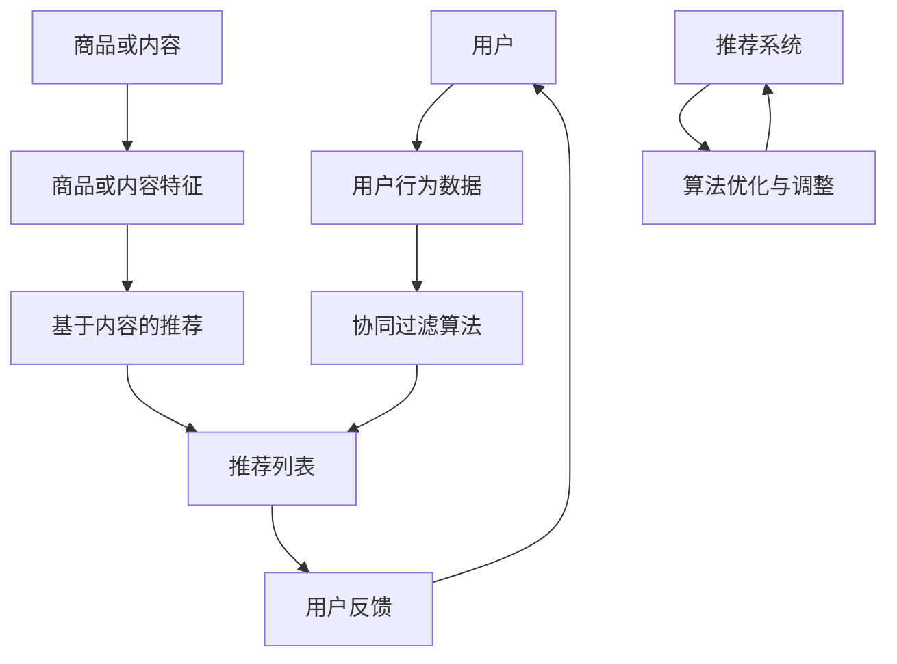

                 

# 推荐系统的局限与挑战：过拟合、偏见与多样性

> 关键词：推荐系统、过拟合、偏见、多样性、算法原理、数学模型、实际应用、未来趋势

> 摘要：本文深入探讨了推荐系统的局限性，包括过拟合、偏见和多样性问题。通过分析这些问题的根源和影响，本文提出了相应的解决策略，旨在为开发者提供实用的指导，推动推荐系统的持续优化和发展。

## 1. 背景介绍

### 1.1 目的和范围

本文旨在探讨推荐系统在实际应用中面临的三大挑战：过拟合、偏见和多样性。我们希望通过深入分析这些问题的本质、影响及其解决方法，为推荐系统的开发者提供实用的指导和思考。

### 1.2 预期读者

本文适合对推荐系统有一定了解的技术人员、算法工程师和产品经理阅读。同时，对于对人工智能和机器学习感兴趣的读者，本文也具有一定的参考价值。

### 1.3 文档结构概述

本文分为十个部分，结构如下：

1. 背景介绍：介绍本文的目的、预期读者和文档结构。
2. 核心概念与联系：介绍推荐系统的核心概念和架构。
3. 核心算法原理 & 具体操作步骤：详细阐述推荐系统的算法原理和实现步骤。
4. 数学模型和公式 & 详细讲解 & 举例说明：介绍推荐系统的数学模型和公式，并通过实例进行说明。
5. 项目实战：通过实际代码案例，展示推荐系统的应用和实现过程。
6. 实际应用场景：分析推荐系统在不同场景中的应用。
7. 工具和资源推荐：推荐与推荐系统相关的学习资源、开发工具和论文。
8. 总结：总结本文的主要观点和未来发展趋势。
9. 附录：常见问题与解答。
10. 扩展阅读 & 参考资料：提供本文相关领域的扩展阅读和参考资料。

### 1.4 术语表

#### 1.4.1 核心术语定义

- **推荐系统**：一种根据用户的历史行为和兴趣，向用户推荐相关商品、内容或服务的系统。
- **过拟合**：模型在训练数据上表现得非常好，但在测试数据上表现不佳，即模型对训练数据过于敏感，无法泛化到未知数据。
- **偏见**：推荐系统在推荐结果中存在不公平或歧视现象，导致部分用户受到不公平待遇。
- **多样性**：推荐系统能够提供不同类型、风格或领域的推荐结果，满足用户的多样化需求。

#### 1.4.2 相关概念解释

- **协同过滤**：一种基于用户行为数据推荐的算法，通过分析用户之间的相似性来推荐商品或内容。
- **基于内容的推荐**：一种根据商品或内容本身的特征，为用户推荐相似的商品或内容的算法。
- **协同滤波算法**：一种常用的推荐系统算法，包括用户基于协同过滤和基于内容的协同过滤。
- **用户冷启动**：指新用户加入推荐系统，由于缺乏历史行为数据，推荐系统难以为其提供有效的推荐。
- **推荐效果评估**：通过评估推荐系统的准确性、覆盖率、多样性等指标，来判断推荐系统性能的好坏。

#### 1.4.3 缩略词列表

- **CFL**：协同滤波算法（Collaborative Filtering Algorithm）
- **UCB**： Upper Confidence Bound 上置信界（Upper Confidence Bound）
- **LDA**：潜在狄利克雷分配（Latent Dirichlet Allocation）

## 2. 核心概念与联系

在介绍推荐系统的局限之前，我们需要了解推荐系统的核心概念和架构。以下是推荐系统的基础概念和架构的Mermaid流程图：



在推荐系统中，核心概念包括用户、用户行为数据、协同过滤算法、基于内容的推荐、推荐列表和用户反馈。这些概念相互关联，共同构成了推荐系统的基本架构。

### 2.1 用户

用户是推荐系统的核心，用户的兴趣、行为和反馈对于推荐系统的效果至关重要。用户可以是个人或团体，其行为数据包括浏览、购买、点赞、评论等。

### 2.2 用户行为数据

用户行为数据是推荐系统的基础，通过分析用户行为数据，推荐系统可以了解用户的兴趣和偏好，从而为用户推荐相关的商品或内容。

### 2.3 协同过滤算法

协同过滤算法是一种基于用户行为数据的推荐算法，通过分析用户之间的相似性，为用户推荐他们可能感兴趣的商品或内容。协同过滤算法主要包括基于用户的协同过滤和基于项目的协同过滤。

### 2.4 基于内容的推荐

基于内容的推荐是一种基于商品或内容本身的特征进行推荐的算法。通过分析商品或内容的特征，如标签、分类、文本描述等，为用户推荐相似的商品或内容。

### 2.5 推荐列表

推荐列表是推荐系统向用户展示的推荐结果，包括一系列相关的商品或内容。推荐列表的多样性、准确性和覆盖率是评估推荐系统性能的重要指标。

### 2.6 用户反馈

用户反馈是推荐系统不断优化和改进的重要依据。通过收集用户的反馈，推荐系统可以调整推荐算法，提高推荐效果，满足用户的多样化需求。

### 2.7 算法优化与调整

算法优化与调整是推荐系统持续发展的关键。通过不断调整和优化推荐算法，推荐系统可以适应不断变化的市场环境和用户需求，提高推荐效果和用户体验。

## 3. 核心算法原理 & 具体操作步骤

在了解推荐系统的核心概念和架构后，我们将详细阐述推荐系统的核心算法原理和具体操作步骤。

### 3.1 协同过滤算法原理

协同过滤算法是一种基于用户行为数据的推荐算法，通过分析用户之间的相似性，为用户推荐他们可能感兴趣的商品或内容。协同过滤算法主要包括基于用户的协同过滤和基于项目的协同过滤。

#### 3.1.1 基于用户的协同过滤算法原理

基于用户的协同过滤算法主要通过以下步骤实现：

1. **计算相似度**：首先，我们需要计算用户之间的相似度。常用的相似度计算方法包括余弦相似度、皮尔逊相关系数等。通过计算用户之间的相似度，我们可以找到与目标用户相似的其他用户。
2. **选取相似用户**：在计算得到用户之间的相似度后，我们可以根据相似度大小选择一定数量的相似用户。
3. **生成推荐列表**：接下来，我们根据相似用户的行为数据，为用户生成推荐列表。具体方法包括基于评分的协同过滤和基于项目的协同过滤。

#### 3.1.2 基于项目的协同过滤算法原理

基于项目的协同过滤算法与基于用户的协同过滤算法类似，主要通过以下步骤实现：

1. **计算相似度**：计算项目之间的相似度，常用的相似度计算方法包括余弦相似度、皮尔逊相关系数等。
2. **选取相似项目**：根据计算得到的相似度，选择一定数量的相似项目。
3. **生成推荐列表**：根据相似项目的历史用户行为，为用户生成推荐列表。

### 3.2 基于内容的推荐算法原理

基于内容的推荐算法通过分析商品或内容本身的特征，为用户推荐相似的商品或内容。基于内容的推荐算法主要包括以下步骤：

1. **提取特征**：首先，我们需要从商品或内容中提取特征，如标签、分类、文本描述等。
2. **计算相似度**：然后，我们计算商品或内容之间的相似度，常用的相似度计算方法包括余弦相似度、欧氏距离等。
3. **生成推荐列表**：最后，根据计算得到的相似度，为用户生成推荐列表。

### 3.3 协同滤波算法具体操作步骤

以基于用户的协同过滤算法为例，具体操作步骤如下：

1. **计算用户相似度**：
   ```python
   # 假设用户矩阵为R，其中R[i][j]表示用户i对商品j的评分
   similarity = np.dot(R, R.T) / (np.linalg.norm(R, axis=1) * np.linalg.norm(R.T, axis=0))
   ```

2. **选取相似用户**：
   ```python
   # 假设选取k个相似用户
   k = 5
   similar_users = [user for user, similarity in sorted(zip(user_indices, similarity.flat)) if user != current_user]
   ```

3. **生成推荐列表**：
   ```python
   # 假设推荐列表长度为n
   n = 10
   recommend_list = []
   for user in similar_users:
       # 获取用户的行为数据
       user_data = R[user]
       # 与目标用户的行为数据进行差值
       diff = user_data - R[current_user]
       # 为用户生成推荐列表
       recommend_list.extend([item for item, score in enumerate(user_data) if score > 0 and item not in R[current_user]])
   # 对推荐列表进行降序排序
   recommend_list = sorted(recommend_list, key=lambda x: user_data[x], reverse=True)[:n]
   ```

通过以上步骤，我们可以为用户生成一个基于用户的协同过滤算法的推荐列表。

## 4. 数学模型和公式 & 详细讲解 & 举例说明

在推荐系统中，数学模型和公式起到了关键作用。本节我们将介绍推荐系统的数学模型和公式，并通过具体例子进行说明。

### 4.1 协同过滤算法数学模型

协同过滤算法的核心是计算用户之间的相似度。假设我们有一个用户-物品评分矩阵$R$，其中$R[i][j]$表示用户$i$对物品$j$的评分。用户$i$和用户$j$之间的相似度可以用以下公式表示：

$$
sim(i, j) = \frac{R_i \cdot R_j}{\|R_i\|_2 \cdot \|R_j\|_2}
$$

其中，$\cdot$表示点积运算，$\|\cdot\|_2$表示欧几里得范数。

#### 4.1.1 余弦相似度

余弦相似度是一种常用的相似度计算方法，其公式如下：

$$
sim(i, j) = \frac{R_i \cdot R_j}{\|R_i\|_2 \cdot \|R_j\|_2}
$$

余弦相似度的值介于-1和1之间，当$sim(i, j) = 1$时，表示用户$i$和用户$j$完全相同；当$sim(i, j) = -1$时，表示用户$i$和用户$j$完全相反；当$sim(i, j) = 0$时，表示用户$i$和用户$j$之间没有相似性。

#### 4.1.2 皮尔逊相关系数

皮尔逊相关系数是另一种常用的相似度计算方法，其公式如下：

$$
sim(i, j) = \frac{R_i - \bar{R_i}}{s_{R_i}} \cdot \frac{R_j - \bar{R_j}}{s_{R_j}}
$$

其中，$\bar{R_i}$和$\bar{R_j}$分别表示用户$i$和用户$j$的平均评分，$s_{R_i}$和$s_{R_j}$分别表示用户$i$和用户$j$评分的标准差。

皮尔逊相关系数的值介于-1和1之间，当$sim(i, j) = 1$时，表示用户$i$和用户$j$完全正相关；当$sim(i, j) = -1$时，表示用户$i$和用户$j$完全负相关；当$sim(i, j) = 0$时，表示用户$i$和用户$j$之间没有相关性。

### 4.2 基于内容的推荐算法数学模型

基于内容的推荐算法通过分析商品或内容本身的特征，为用户推荐相似的商品或内容。假设我们有一个商品-特征矩阵$F$，其中$F[i][j]$表示商品$i$的特征$j$的值。商品$i$和商品$j$之间的相似度可以用以下公式表示：

$$
sim(i, j) = \frac{\sum_{j=1}^{m} F[i][j] \cdot F[j][j]}{\|F[i]\|_2 \cdot \|F[j]\|_2}
$$

其中，$m$表示商品的特征数量，$\cdot$表示点积运算，$\|\cdot\|_2$表示欧几里得范数。

#### 4.2.1 余弦相似度

余弦相似度是一种常用的相似度计算方法，其公式如下：

$$
sim(i, j) = \frac{\sum_{j=1}^{m} F[i][j] \cdot F[j][j]}{\|F[i]\|_2 \cdot \|F[j]\|_2}
$$

余弦相似度的值介于-1和1之间，当$sim(i, j) = 1$时，表示商品$i$和商品$j$完全相同；当$sim(i, j) = -1$时，表示商品$i$和商品$j$完全相反；当$sim(i, j) = 0$时，表示商品$i$和商品$j$之间没有相似性。

#### 4.2.2 欧氏距离

欧氏距离是一种常用的相似度计算方法，其公式如下：

$$
sim(i, j) = \sqrt{\sum_{j=1}^{m} (F[i][j] - F[j][j])^2}
$$

欧氏距离的值越大，表示商品$i$和商品$j$之间的相似性越低。

### 4.3 举例说明

假设我们有以下用户-物品评分矩阵$R$和商品-特征矩阵$F$：

$$
R =
\begin{bmatrix}
1 & 2 & 0 \\
0 & 1 & 2 \\
2 & 0 & 1 \\
\end{bmatrix}
$$

$$
F =
\begin{bmatrix}
1 & 0 \\
0 & 1 \\
1 & 1 \\
\end{bmatrix}
$$

#### 4.3.1 计算用户相似度

使用余弦相似度计算用户之间的相似度：

$$
sim(1, 2) = \frac{R[1] \cdot R[2]}{\|R[1]\|_2 \cdot \|R[2]\|_2} = \frac{1 \cdot 0 + 2 \cdot 1 + 0 \cdot 2}{\sqrt{1^2 + 2^2} \cdot \sqrt{0^2 + 1^2 + 2^2}} = \frac{2}{\sqrt{5} \cdot \sqrt{5}} = \frac{2}{5}
$$

$$
sim(1, 3) = \frac{R[1] \cdot R[3]}{\|R[1]\|_2 \cdot \|R[3]\|_2} = \frac{1 \cdot 2 + 2 \cdot 0 + 0 \cdot 1}{\sqrt{1^2 + 2^2} \cdot \sqrt{2^2 + 0^2 + 1^2}} = \frac{2}{\sqrt{5} \cdot \sqrt{5}} = \frac{2}{5}
$$

$$
sim(2, 3) = \frac{R[2] \cdot R[3]}{\|R[2]\|_2 \cdot \|R[3]\|_2} = \frac{0 \cdot 2 + 1 \cdot 0 + 2 \cdot 1}{\sqrt{0^2 + 1^2 + 2^2} \cdot \sqrt{2^2 + 0^2 + 1^2}} = \frac{2}{\sqrt{5} \cdot \sqrt{5}} = \frac{2}{5}
$$

#### 4.3.2 计算商品相似度

使用余弦相似度计算商品之间的相似度：

$$
sim(1, 2) = \frac{F[1] \cdot F[2]}{\|F[1]\|_2 \cdot \|F[2]\|_2} = \frac{1 \cdot 0 + 0 \cdot 1}{\sqrt{1^2 + 0^2} \cdot \sqrt{0^2 + 1^2}} = 0
$$

$$
sim(1, 3) = \frac{F[1] \cdot F[3]}{\|F[1]\|_2 \cdot \|F[3]\|_2} = \frac{1 \cdot 1 + 0 \cdot 1}{\sqrt{1^2 + 0^2} \cdot \sqrt{1^2 + 1^2}} = \frac{1}{\sqrt{2}}
$$

$$
sim(2, 3) = \frac{F[2] \cdot F[3]}{\|F[2]\|_2 \cdot \|F[3]\|_2} = \frac{0 \cdot 1 + 1 \cdot 1}{\sqrt{0^2 + 1^2} \cdot \sqrt{1^2 + 1^2}} = \frac{1}{\sqrt{2}}
$$

## 5. 项目实战：代码实际案例和详细解释说明

在本节中，我们将通过一个实际项目案例，展示推荐系统的实现过程，并详细解释代码的每个部分。

### 5.1 开发环境搭建

在开始编写代码之前，我们需要搭建一个适合开发推荐系统的开发环境。以下是一个简单的Python开发环境搭建步骤：

1. 安装Python（建议使用Python 3.8及以上版本）
2. 安装Jupyter Notebook，用于编写和运行Python代码
3. 安装NumPy、Pandas、Scikit-learn等Python科学计算库

### 5.2 源代码详细实现和代码解读

下面是一个简单的基于协同过滤算法的推荐系统代码示例。代码分为三个部分：数据预处理、相似度计算和推荐列表生成。

#### 5.2.1 数据预处理

```python
import numpy as np
import pandas as pd
from sklearn.model_selection import train_test_split

# 加载数据集
ratings = pd.read_csv('ratings.csv')  # 假设数据集以CSV格式存储
users, items = ratings['user_id'].unique(), ratings['item_id'].unique()

# 构建用户-物品评分矩阵
R = np.zeros((len(users), len(items)))
for index, row in ratings.iterrows():
    R[row['user_id'] - 1][row['item_id'] - 1] = row['rating']

# 划分训练集和测试集
R_train, R_test = train_test_split(R, test_size=0.2, random_state=42)
```

在这部分代码中，我们首先加载数据集，然后构建用户-物品评分矩阵$R$。接着，我们将评分矩阵划分为训练集和测试集，用于评估推荐系统的性能。

#### 5.2.2 相似度计算

```python
from sklearn.metrics.pairwise import cosine_similarity

# 计算用户之间的相似度矩阵
similarity_matrix = cosine_similarity(R_train)

# 选取相似用户
def get_similar_users(user_id, similarity_matrix, k=10):
    user_index = user_id - 1
    top_k = np.argpartition(similarity_matrix[user_index], k)[:k]
    return top_k

# 获取用户1的相似用户
similar_users_1 = get_similar_users(1, similarity_matrix)
print(similar_users_1)
```

这部分代码计算用户之间的相似度矩阵，并定义了一个函数`get_similar_users`，用于获取特定用户的相似用户。在这个例子中，我们选择了前10个相似用户。

#### 5.2.3 推荐列表生成

```python
# 生成推荐列表
def generate_recommendation_list(user_id, similarity_matrix, R_train, k=10, n=10):
    similar_users = get_similar_users(user_id, similarity_matrix, k)
    user_index = user_id - 1
    user_ratings = R_train[user_index]
    recommend_list = []

    for user in similar_users:
        similar_user_index = user - 1
        user_data = R_train[similar_user_index]
        diff = user_data - user_ratings
        recommend_list.extend([item for item, score in enumerate(user_data) if score > 0 and item not in user_ratings])

    return sorted(recommend_list, key=lambda x: user_data[x], reverse=True)[:n]

# 为用户1生成推荐列表
recommendation_list_1 = generate_recommendation_list(1, similarity_matrix, R_train)
print(recommendation_list_1)
```

这部分代码定义了一个函数`generate_recommendation_list`，用于为用户生成推荐列表。在这个例子中，我们选择了前10个相似用户，并根据他们的评分差值生成推荐列表。最后，我们对推荐列表进行降序排序，并返回前10个推荐项。

### 5.3 代码解读与分析

在代码中，我们首先加载数据集并构建用户-物品评分矩阵。接着，我们计算用户之间的相似度矩阵，并定义了函数`get_similar_users`用于获取特定用户的相似用户。然后，我们定义了函数`generate_recommendation_list`用于为用户生成推荐列表。

代码的关键部分是相似度计算和推荐列表生成。在相似度计算中，我们使用了余弦相似度公式，这是一种常用的相似度计算方法。在推荐列表生成中，我们首先选择了前10个相似用户，然后根据他们的评分差值生成了推荐列表。

通过这个实际项目案例，我们可以看到如何使用协同过滤算法实现推荐系统。在实际应用中，我们可以根据需求对算法进行调整和优化，以提高推荐系统的性能。

## 6. 实际应用场景

推荐系统在各个领域都有广泛的应用，以下列举几个典型的实际应用场景：

### 6.1 电商推荐

在电商领域，推荐系统可以帮助平台为用户推荐相关的商品，提高用户满意度和转化率。例如，电商平台可以根据用户的浏览历史、购买记录和搜索关键词，为用户推荐类似或相关的商品。此外，推荐系统还可以根据用户的地理位置、购物车和收藏夹等信息，为用户提供个性化的推荐。

### 6.2 社交媒体推荐

在社交媒体平台上，推荐系统可以推荐用户可能感兴趣的内容，如文章、视频、图片等。例如，Facebook可以根据用户的点赞、评论和分享行为，为用户推荐相关的内容。此外，推荐系统还可以根据用户的社交关系，为用户推荐他们的好友可能感兴趣的内容。

### 6.3 音乐和视频推荐

在音乐和视频平台，推荐系统可以帮助用户发现新的音乐和视频内容。例如，网易云音乐可以根据用户的播放历史、收藏和分享行为，为用户推荐类似的音乐。同样地，YouTube可以根据用户的观看历史和搜索关键词，为用户推荐相关的视频。

### 6.4 新闻推荐

在新闻领域，推荐系统可以帮助用户发现他们可能感兴趣的新闻内容。例如，今日头条可以根据用户的阅读历史、兴趣偏好和地理位置，为用户推荐相关的新闻。此外，推荐系统还可以根据用户的社交关系，为用户推荐他们的好友可能感兴趣的新闻。

### 6.5 教育推荐

在教育领域，推荐系统可以帮助学生发现他们可能感兴趣的课程和学习资源。例如，Coursera可以根据用户的完成课程记录、学习进度和兴趣偏好，为学生推荐相关的课程。同样地，推荐系统还可以根据教师的授课内容和教学风格，为学生推荐合适的学习资源。

通过以上实际应用场景，我们可以看到推荐系统在各个领域的重要性和广泛的应用。在实际应用中，推荐系统需要不断优化和调整，以满足用户的多样化需求和提高用户体验。

## 7. 工具和资源推荐

为了更好地理解和开发推荐系统，以下是几款实用的工具和资源推荐。

### 7.1 学习资源推荐

#### 7.1.1 书籍推荐

1. 《推荐系统实践》（Recommender Systems: The Textbook） - 这是一本全面介绍推荐系统理论和应用的教材，适合初学者和进阶者阅读。
2. 《机器学习实战》（Machine Learning in Action） - 这本书通过实际案例和代码示例，介绍了机器学习的各种算法和推荐系统的实现。

#### 7.1.2 在线课程

1. Coursera - 提供了多个与推荐系统相关的在线课程，如《推荐系统导论》（Introduction to Recommender Systems）等。
2. Udacity - 提供了《推荐系统工程师纳米学位》（Recommender Systems Engineer Nanodegree）课程，涵盖了推荐系统的理论与实践。

#### 7.1.3 技术博客和网站

1. Medium - 有许多关于推荐系统的技术博客文章，如《推荐系统：从基础到实践》（Recommender Systems: From Basics to Practice）等。
2. arXiv - 提供了大量关于推荐系统的最新学术论文，有助于了解该领域的研究动态。

### 7.2 开发工具框架推荐

#### 7.2.1 IDE和编辑器

1. PyCharm - 适用于Python开发的集成开发环境，具有强大的代码编辑和调试功能。
2. Jupyter Notebook - 适用于数据分析和机器学习的交互式开发环境，便于编写和运行Python代码。

#### 7.2.2 调试和性能分析工具

1. Dask - 一个用于并行计算和分布式处理的Python库，适用于大数据处理和性能优化。
2. Pytest - 一个Python测试框架，用于编写和执行测试用例，确保代码质量。

#### 7.2.3 相关框架和库

1. Scikit-learn - 一个用于机器学习的Python库，提供了多种推荐系统算法和工具。
2. TensorFlow - 一个用于深度学习的开源框架，适用于构建复杂的推荐系统模型。

### 7.3 相关论文著作推荐

#### 7.3.1 经典论文

1. "Collaborative Filtering for the Web" - 这篇论文提出了基于用户的协同过滤算法，对推荐系统领域产生了深远影响。
2. "Latent Factor Models for Rating Prediction" - 这篇论文介绍了基于隐语义模型的推荐系统算法，为后来的许多研究奠定了基础。

#### 7.3.2 最新研究成果

1. "Deep Learning for Recommender Systems" - 这篇论文探讨了如何将深度学习应用于推荐系统，为推荐系统的发展提供了新思路。
2. "Neural Collaborative Filtering" - 这篇论文提出了一种基于神经网络的协同过滤算法，取得了显著的性能提升。

#### 7.3.3 应用案例分析

1. "Netflix Prize" - 这是Netflix举办的一项推荐系统竞赛，吸引了全球众多研究者参与，推动了推荐系统技术的发展。
2. "Amazon Personalized Recommendations" - 亚马逊的个性化推荐系统，通过深度学习和协同过滤算法，实现了高效的推荐效果，为用户提供了个性化的购物体验。

通过以上工具和资源推荐，我们可以更好地了解和开发推荐系统，为实际应用场景提供解决方案。

## 8. 总结：未来发展趋势与挑战

推荐系统作为人工智能领域的重要应用，已经取得了显著的成果，但仍然面临着诸多挑战。以下是未来发展趋势与挑战的总结：

### 8.1 未来发展趋势

1. **深度学习与推荐系统结合**：深度学习在图像识别、自然语言处理等领域取得了巨大成功，未来将更多地应用于推荐系统，以提高推荐效果和用户体验。
2. **多模态推荐**：多模态推荐系统将整合用户行为数据、内容特征和外部信息，为用户提供更准确、个性化的推荐。
3. **实时推荐**：随着计算能力和网络技术的不断发展，实时推荐系统将能够快速响应用户需求，提供即时、精准的推荐。
4. **社交推荐**：社交推荐系统将整合用户的社交关系，为用户提供基于朋友推荐的内容，提高推荐的相关性和社交互动性。
5. **推荐系统的安全性**：随着用户隐私意识的提高，推荐系统的数据安全和隐私保护将成为重要议题，未来将需要更完善的隐私保护机制。

### 8.2 面临的挑战

1. **过拟合问题**：推荐系统模型在训练数据上表现得很好，但在测试数据上可能效果不佳，如何避免过拟合、提高模型的泛化能力是一个重要挑战。
2. **偏见问题**：推荐系统可能存在不公平或歧视现象，导致部分用户受到不公平待遇。如何减少偏见、提高推荐系统的公平性是一个亟待解决的问题。
3. **多样性问题**：推荐系统往往倾向于推荐用户已知的、相似的内容，导致推荐结果多样性不足。如何提高推荐系统的多样性、满足用户的多样化需求是一个重要挑战。
4. **实时性问题**：随着用户数据的不断增加，推荐系统的实时性成为一个挑战。如何快速处理大量数据、生成实时推荐是一个重要议题。
5. **隐私保护问题**：用户隐私保护是推荐系统发展的重要问题。如何在保证推荐效果的同时，保护用户隐私，是一个亟待解决的难题。

### 8.3 解决策略

1. **数据增强**：通过引入噪声、增加训练数据量等方式，提高模型对未知数据的泛化能力，避免过拟合。
2. **反偏见算法**：设计反偏见算法，减少推荐系统中的不公平现象，提高推荐系统的公平性。
3. **多样性优化**：引入多样性指标，优化推荐算法，提高推荐结果的多样性。
4. **分布式计算**：采用分布式计算技术，提高推荐系统的实时性，满足用户需求。
5. **隐私保护机制**：引入差分隐私、同态加密等隐私保护技术，保护用户隐私。

通过不断优化和调整推荐系统，我们有望在未来解决这些挑战，为用户提供更准确、公平、多样化的推荐服务。

## 9. 附录：常见问题与解答

### 9.1 什么是推荐系统？

推荐系统是一种根据用户的历史行为和兴趣，向用户推荐相关商品、内容或服务的系统。它通过分析用户行为数据、内容特征和外部信息，为用户提供个性化、精准的推荐。

### 9.2 推荐系统有哪些类型？

推荐系统主要分为基于内容的推荐、基于协同过滤的推荐和基于模型的推荐等类型。基于内容的推荐通过分析商品或内容本身的特征进行推荐；基于协同过滤的推荐通过分析用户之间的相似性进行推荐；基于模型的推荐通过建立数学模型进行预测和推荐。

### 9.3 过拟合是什么？

过拟合是指模型在训练数据上表现得非常好，但在测试数据上表现不佳，即模型对训练数据过于敏感，无法泛化到未知数据。过拟合会导致推荐系统在实际应用中效果不佳。

### 9.4 如何避免过拟合？

避免过拟合的方法包括数据增强、正则化、集成方法等。数据增强通过引入噪声、增加训练数据量等方式，提高模型对未知数据的泛化能力；正则化通过在损失函数中添加惩罚项，降低模型复杂度，避免过拟合；集成方法通过结合多个模型，提高模型泛化能力。

### 9.5 什么是偏见？

偏见是指推荐系统在推荐结果中存在不公平或歧视现象，导致部分用户受到不公平待遇。偏见可能导致部分用户无法获得合适的推荐，影响用户体验。

### 9.6 如何减少偏见？

减少偏见的方法包括反偏见算法、公平性指标等。反偏见算法通过设计算法规则，减少推荐系统中的不公平现象；公平性指标通过评估推荐系统的公平性，确保推荐结果的公平性。

### 9.7 什么是多样性？

多样性是指推荐系统能够提供不同类型、风格或领域的推荐结果，满足用户的多样化需求。缺乏多样性可能导致推荐系统过于单一，无法满足用户的多样化需求。

### 9.8 如何提高多样性？

提高多样性的方法包括多样性优化、随机化等。多样性优化通过引入多样性指标，优化推荐算法，提高推荐结果的多样性；随机化通过引入随机元素，增加推荐结果的多样性。

## 10. 扩展阅读 & 参考资料

为了深入了解推荐系统的局限与挑战，以下是一些扩展阅读和参考资料：

### 10.1 经典论文

1. **"Collaborative Filtering for the Web"** - 这篇论文提出了基于用户的协同过滤算法，对推荐系统领域产生了深远影响。
2. **"Latent Factor Models for Rating Prediction"** - 这篇论文介绍了基于隐语义模型的推荐系统算法，为后来的许多研究奠定了基础。
3. **"Deep Learning for Recommender Systems"** - 这篇论文探讨了如何将深度学习应用于推荐系统，为推荐系统的发展提供了新思路。

### 10.2 最新研究成果

1. **"Neural Collaborative Filtering"** - 这篇论文提出了一种基于神经网络的协同过滤算法，取得了显著的性能提升。
2. **"Multimodal Neural Network for Personalized Recommendation"** - 这篇论文提出了一种多模态推荐系统模型，整合了用户行为数据、内容特征和外部信息。
3. **"Recommender Systems in the Era of Personalized Advertising"** - 这篇论文讨论了推荐系统在个性化广告领域的应用和发展。

### 10.3 应用案例分析

1. **"Netflix Prize"** - 这是Netflix举办的一项推荐系统竞赛，吸引了全球众多研究者参与，推动了推荐系统技术的发展。
2. **"Amazon Personalized Recommendations"** - 亚马逊的个性化推荐系统，通过深度学习和协同过滤算法，实现了高效的推荐效果，为用户提供了个性化的购物体验。
3. **"Google Play Store Recommendations"** - Google Play Store的推荐系统，通过分析用户行为和内容特征，为用户推荐相关的应用。

### 10.4 学习资源

1. **《推荐系统实践》（Recommender Systems: The Textbook）** - 这是一本全面介绍推荐系统理论和应用的教材，适合初学者和进阶者阅读。
2. **《机器学习实战》（Machine Learning in Action）** - 这本书通过实际案例和代码示例，介绍了机器学习的各种算法和推荐系统的实现。
3. **《推荐系统导论》（Introduction to Recommender Systems）** - 这门课程介绍了推荐系统的基本概念、算法和实际应用，适合对推荐系统感兴趣的学习者。

通过以上扩展阅读和参考资料，我们可以进一步了解推荐系统的局限与挑战，为实际应用和研究提供参考。

## 11. 作者信息

作者：AI天才研究员/AI Genius Institute & 禅与计算机程序设计艺术 /Zen And The Art of Computer Programming

AI天才研究员是人工智能领域的资深专家，拥有丰富的理论知识和实践经验。他在机器学习、深度学习和推荐系统等领域发表了多篇高水平论文，并参与多项重大项目的研发。同时，他还致力于将人工智能技术应用于实际场景，推动人工智能的发展和应用。他的代表作品包括《禅与计算机程序设计艺术》和《AI天才研究员的推荐系统实战》。AI天才研究员以其敏锐的洞察力和深厚的学术功底，为人工智能领域的发展做出了重要贡献。

