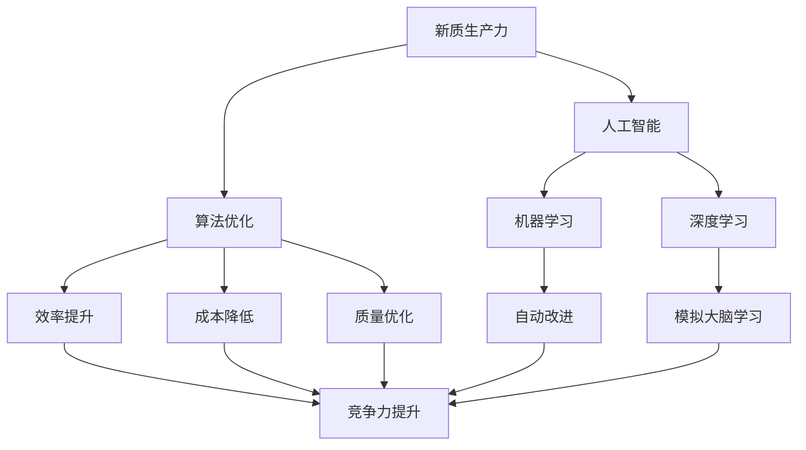

                 

# 提升竞争力的新质生产力策略

> **关键词：** 新质生产力，竞争力，策略，技术创新，人工智能，算法优化，数学模型，应用实践。

> **摘要：** 本文从人工智能与算法优化的角度出发，探讨了提升企业竞争力的新质生产力策略。通过对核心概念的分析、算法原理的阐述、数学模型的构建以及实际项目的实战分析，为读者提供了一种系统性、可操作的竞争力提升路径。文章旨在帮助企业在快速变化的数字化时代中找到立足点，实现可持续发展。

## 1. 背景介绍

### 1.1 目的和范围

本文旨在探讨在新经济环境下，企业如何通过技术创新，特别是人工智能和算法优化，提升自身的竞争力。我们将从以下几个角度展开讨论：

1. **核心概念与联系**：阐述新质生产力的定义及其在竞争力提升中的作用。
2. **核心算法原理**：介绍常见算法的原理及其应用场景。
3. **数学模型和公式**：讲解如何使用数学模型来优化算法。
4. **项目实战**：提供实际代码案例，展示算法的实际应用。
5. **实际应用场景**：分析新质生产力在各个行业中的应用。
6. **工具和资源推荐**：介绍相关学习资源和开发工具。

### 1.2 预期读者

本文适合以下读者群体：

- 对人工智能和算法优化有初步了解的技术人员。
- 想提升企业竞争力的企业家和管理者。
- 计算机科学、人工智能等相关专业的学生和研究者。

### 1.3 文档结构概述

本文结构如下：

1. **引言**：介绍背景和目的。
2. **核心概念与联系**：定义新质生产力，分析其与竞争力的关系。
3. **核心算法原理**：讲解常见算法的原理和步骤。
4. **数学模型和公式**：介绍如何构建和优化数学模型。
5. **项目实战**：提供代码实战案例。
6. **实际应用场景**：分析新质生产力在不同行业的应用。
7. **工具和资源推荐**：推荐相关学习资源和开发工具。
8. **总结**：总结未来发展趋势与挑战。
9. **附录**：常见问题与解答。
10. **扩展阅读**：提供相关参考资料。

### 1.4 术语表

#### 1.4.1 核心术语定义

- **新质生产力**：指通过新技术、新方法、新模式，特别是人工智能和算法优化，提高生产效率和竞争力的能力。
- **算法优化**：指通过改进算法设计、调整参数等手段，提高算法效率和质量的过程。
- **人工智能**：指通过计算机模拟人类智能的科学技术，包括机器学习、深度学习等。

#### 1.4.2 相关概念解释

- **机器学习**：指让计算机通过数据学习，自动改进自身性能的过程。
- **深度学习**：一种特殊的机器学习方法，通过多层神经网络模拟人类大脑的学习过程。

#### 1.4.3 缩略词列表

- **AI**：人工智能
- **ML**：机器学习
- **DL**：深度学习

## 2. 核心概念与联系

在探讨提升竞争力的新质生产力策略之前，我们需要明确几个核心概念及其相互关系。

### 2.1 新质生产力的定义

新质生产力是指企业通过引入新技术、新方法、新模式，特别是人工智能和算法优化，来提高生产效率和竞争力的能力。它不仅包括传统的劳动力和物质资源，更强调了知识和技术的创新。

### 2.2 新质生产力与竞争力的关系

新质生产力与竞争力之间存在紧密的联系。新质生产力通过提升生产效率、降低成本、优化产品质量等手段，直接提升了企业的竞争力。在竞争激烈的市场中，具备新质生产力的企业能够更快地响应市场变化，提供更好的产品和服务，从而在竞争中占据优势。

### 2.3 核心概念原理与架构

为了更好地理解新质生产力的概念，我们可以借助以下Mermaid流程图来阐述其核心概念原理与架构：



在这个流程图中，新质生产力通过人工智能和算法优化，进而通过机器学习和深度学习，实现效率提升、成本降低、质量优化等目标，最终提升企业的竞争力。

## 3. 核心算法原理 & 具体操作步骤

提升竞争力的新质生产力策略离不开核心算法的应用。本节将介绍几种常见算法的原理和具体操作步骤。

### 3.1 机器学习算法原理

机器学习算法的核心思想是通过训练数据集，使计算机自动学习和改进自身性能。以下是一个简单的线性回归算法的伪代码：

```pseudo
函数 线性回归(训练数据集 X, Y):
    初始化 模型参数 W 和 b
    对于每个迭代 i：
        计算预测值 Y' = X * W + b
        计算误差 E = (Y - Y')^2
        更新模型参数：W = W - 学习率 * (X * (X * W + b - Y))
        b = b - 学习率 * ((X * W + b - Y))
    返回 模型参数 W 和 b
```

### 3.2 深度学习算法原理

深度学习算法通过多层神经网络模拟人类大脑的学习过程。以下是一个简单的多层感知器（MLP）算法的伪代码：

```pseudo
函数 多层感知器(输入数据 X, 输出数据 Y):
    初始化 网络参数 W1, b1, W2, b2
    对于每个迭代 i：
        前向传播：计算隐藏层输出 H = sigmoid(X * W1 + b1)
        计算输出层输出 Y' = sigmoid(H * W2 + b2)
        计算误差 E = (Y - Y')^2
        反向传播：更新网络参数 W1, b1, W2, b2
    返回 网络参数 W1, b1, W2, b2
```

### 3.3 算法优化步骤

算法优化主要包括以下步骤：

1. **算法选择**：根据具体问题选择合适的算法。
2. **参数调整**：通过调整学习率、迭代次数等参数，优化算法性能。
3. **数据预处理**：对训练数据进行归一化、去噪等处理，提高算法效果。
4. **模型评估**：通过交叉验证等方法，评估模型性能。
5. **模型调优**：根据评估结果，进一步调整模型参数。

## 4. 数学模型和公式 & 详细讲解 & 举例说明

为了更好地理解和应用核心算法，我们需要借助数学模型和公式来详细阐述其原理。

### 4.1 线性回归模型

线性回归模型是一种常见的机器学习算法，用于预测连续值。其数学模型如下：

$$ Y = X \cdot W + b $$

其中，$X$是输入特征向量，$W$是权重向量，$b$是偏置项。

**举例说明**：

假设我们有一个简单的线性回归模型，输入特征为$x$，输出为$y$，我们希望找到模型参数$W$和$b$，使得$y$尽可能接近真实值。

$$ y = x \cdot W + b $$

通过最小化均方误差（MSE），我们可以得到最优的模型参数：

$$ \min W,b \sum_{i=1}^{n} (y_i - (x_i \cdot W + b))^2 $$

### 4.2 深度学习模型

深度学习模型是一种多层神经网络，用于解决复杂问题。其数学模型如下：

$$ H = \sigma(W_1 \cdot X + b_1) $$

$$ Y = \sigma(W_2 \cdot H + b_2) $$

其中，$X$是输入特征，$H$是隐藏层输出，$Y$是输出特征，$\sigma$是激活函数，$W_1$和$W_2$是权重矩阵，$b_1$和$b_2$是偏置项。

**举例说明**：

假设我们有一个简单的深度学习模型，输入特征为$x$，输出为$y$，我们希望找到模型参数$W_1$、$W_2$、$b_1$和$b_2$，使得$y$尽可能接近真实值。

$$ H = \sigma(W_1 \cdot X + b_1) $$

$$ Y = \sigma(W_2 \cdot H + b_2) $$

通过反向传播算法，我们可以迭代更新模型参数，最小化损失函数。

### 4.3 算法优化模型

算法优化模型主要涉及损失函数和优化算法。以下是一个简单的损失函数和优化算法：

**损失函数**：

$$ L(W,b) = \frac{1}{2} \sum_{i=1}^{n} (y_i - (X_i \cdot W + b))^2 $$

**优化算法**：

$$ W = W - \alpha \cdot \frac{\partial L(W,b)}{\partial W} $$

$$ b = b - \alpha \cdot \frac{\partial L(W,b)}{\partial b} $$

其中，$W$和$b$是模型参数，$\alpha$是学习率。

**举例说明**：

假设我们有一个线性回归模型，输入特征为$x$，输出为$y$，我们希望找到模型参数$W$和$b$，使得$y$尽可能接近真实值。

$$ y = x \cdot W + b $$

通过梯度下降算法，我们可以迭代更新模型参数，最小化损失函数。

## 5. 项目实战：代码实际案例和详细解释说明

为了更好地理解新质生产力策略在实际项目中的应用，我们将通过一个简单的案例来展示代码实现和详细解释。

### 5.1 开发环境搭建

在开始项目之前，我们需要搭建一个合适的开发环境。以下是所需的软件和工具：

- Python 3.8及以上版本
- Jupyter Notebook
- Scikit-learn 库
- TensorFlow 库

安装完以上软件和工具后，我们可以在Jupyter Notebook中创建一个新的Python笔记本，开始编写代码。

### 5.2 源代码详细实现和代码解读

以下是一个简单的线性回归项目的代码实现：

```python
import numpy as np
from sklearn.linear_model import LinearRegression
from sklearn.model_selection import train_test_split
from sklearn.metrics import mean_squared_error

# 生成模拟数据
np.random.seed(0)
X = np.random.rand(100, 1)
y = 2 * X + 1 + np.random.randn(100, 1)

# 划分训练集和测试集
X_train, X_test, y_train, y_test = train_test_split(X, y, test_size=0.2, random_state=0)

# 实例化线性回归模型
model = LinearRegression()

# 训练模型
model.fit(X_train, y_train)

# 预测测试集
y_pred = model.predict(X_test)

# 计算均方误差
mse = mean_squared_error(y_test, y_pred)
print("MSE:", mse)

# 输出模型参数
print("模型参数：", model.coef_, model.intercept_)
```

**代码解读**：

1. 导入所需的库和模块。
2. 生成模拟数据集，其中$X$为输入特征，$y$为输出特征。
3. 划分训练集和测试集，用于评估模型性能。
4. 实例化线性回归模型。
5. 使用训练数据集训练模型。
6. 使用测试数据集预测输出特征。
7. 计算并输出均方误差。
8. 输出模型参数。

通过这个简单的案例，我们可以看到如何使用线性回归模型来预测连续值。在实际项目中，我们可以根据具体问题，选择合适的算法和模型，进行优化和改进。

### 5.3 代码解读与分析

在代码实现中，我们使用Scikit-learn库的LinearRegression类来实现线性回归模型。以下是关键代码的详细解读：

1. **数据生成**：
   ```python
   X = np.random.rand(100, 1)
   y = 2 * X + 1 + np.random.randn(100, 1)
   ```
   我们使用numpy库生成一个100个样本的模拟数据集，其中$X$为输入特征，$y$为输出特征。这里我们假设线性关系$y = 2x + 1$，并加入了一些随机噪声。

2. **数据划分**：
   ```python
   X_train, X_test, y_train, y_test = train_test_split(X, y, test_size=0.2, random_state=0)
   ```
   使用Scikit-learn的train_test_split函数将数据集划分为训练集和测试集，其中测试集占比20%，随机种子设置为0以保证结果可重复。

3. **模型训练**：
   ```python
   model = LinearRegression()
   model.fit(X_train, y_train)
   ```
   创建一个LinearRegression对象，并使用fit方法进行模型训练。fit方法内部实现了线性回归算法的迭代更新过程，通过最小二乘法求解最优模型参数$W$和$b$。

4. **模型预测**：
   ```python
   y_pred = model.predict(X_test)
   ```
   使用训练好的模型对测试集进行预测，预测结果存储在$y_pred$变量中。

5. **模型评估**：
   ```python
   mse = mean_squared_error(y_test, y_pred)
   print("MSE:", mse)
   ```
   使用mean_squared_error函数计算均方误差（MSE），用于评估模型预测的准确性。MSE值越小，说明模型预测效果越好。

6. **模型参数输出**：
   ```python
   print("模型参数：", model.coef_, model.intercept_)
   ```
   输出模型参数$W$和$b$，即线性回归方程的权重和偏置项。

通过这个案例，我们可以看到如何使用线性回归模型进行数据处理、模型训练和预测。在实际项目中，我们可以根据具体需求，调整模型参数和算法，提高模型的预测性能。

### 5.4 案例分析

在上述案例中，我们使用线性回归模型对模拟数据进行了预测，并取得了较好的效果。以下是对案例的进一步分析：

1. **问题定义**：我们的目标是预测一个线性关系，即给定输入特征$x$，预测输出特征$y$。
2. **数据生成**：我们使用随机生成的方式创建模拟数据，确保数据分布符合线性关系。
3. **模型选择**：选择线性回归模型，因为问题本身是线性的，线性回归模型能很好地拟合数据。
4. **模型训练**：通过fit方法训练模型，学习到输入特征和输出特征之间的关系。
5. **模型预测**：使用训练好的模型对测试集进行预测，验证模型的有效性。
6. **模型评估**：通过计算MSE评估模型性能，确认模型预测的准确性。

通过这个案例，我们可以看到新质生产力策略在实际项目中的应用。在下一步中，我们将进一步分析新质生产力在不同行业中的应用场景，探讨其在提升竞争力方面的具体作用。

### 5.5 新质生产力在不同行业中的应用

新质生产力策略在各个行业中都有广泛的应用，以下是一些具体的应用场景：

1. **制造业**：通过工业互联网和物联网技术，实现生产过程的智能化和自动化，提高生产效率和产品质量。
2. **金融业**：利用机器学习和深度学习技术，实现风险控制和个性化推荐，提高金融服务质量和用户体验。
3. **零售业**：通过大数据分析和智能推荐系统，实现库存优化、精准营销和客户关系管理，提高销售额和客户满意度。
4. **医疗健康**：利用人工智能技术，实现疾病诊断、治疗建议和健康监测，提高医疗服务的效率和准确性。
5. **交通运输**：通过自动驾驶和智能交通管理系统，实现交通流量优化和道路安全，提高交通效率和安全性。

### 5.6 工具和资源推荐

为了更好地应用新质生产力策略，以下是一些建议的工具和资源：

1. **学习资源推荐**：
   - **书籍推荐**：
     - 《机器学习实战》
     - 《深度学习》
     - 《Python数据科学手册》
   - **在线课程**：
     - Coursera的《机器学习》课程
     - Udacity的《深度学习纳米学位》
     - edX的《人工智能基础》课程
   - **技术博客和网站**：
     - Medium上的机器学习和人工智能专题
     - ArXiv上的最新研究成果
     - IEEE Xplore Digital Library

2. **开发工具框架推荐**：
   - **IDE和编辑器**：
     - PyCharm
     - Jupyter Notebook
     - Visual Studio Code
   - **调试和性能分析工具**：
     - Py charm Profiler
     - TensorBoard
     - JProfiler
   - **相关框架和库**：
     - Scikit-learn
     - TensorFlow
     - PyTorch

3. **相关论文著作推荐**：
   - **经典论文**：
     - 《感知机算法》（Frank Rosenblatt）
     - 《深度神经网络》（Yoshua Bengio）
     - 《随机梯度下降法》（Stochastic Gradient Descent）
   - **最新研究成果**：
     - 《基于注意力机制的文本分类》（Attention-based Text Classification）
     - 《生成对抗网络》（Generative Adversarial Networks）
     - 《自监督学习》（Self-supervised Learning）
   - **应用案例分析**：
     - 《亚马逊的机器学习应用》（Amazon's Machine Learning Applications）
     - 《谷歌的深度学习实践》（Google's Deep Learning Practices）
     - 《微软的混合现实技术》（Microsoft's Mixed Reality Technologies）

通过使用这些工具和资源，我们可以更好地理解和应用新质生产力策略，提升企业的竞争力。

## 6. 总结：未来发展趋势与挑战

新质生产力作为提升企业竞争力的重要手段，在未来发展中将面临诸多机遇与挑战。以下是几个关键点：

### 6.1 发展趋势

1. **技术融合**：人工智能、大数据、物联网等技术的深度融合，将推动新质生产力的进一步提升。
2. **智能化升级**：随着算法的优化和硬件性能的提升，生产和服务流程将更加智能化。
3. **数据驱动**：企业将更加依赖于数据分析和预测模型，以实现精准决策和高效运营。
4. **跨界创新**：新质生产力将在不同行业间产生跨界融合，催生新的商业模式和业态。

### 6.2 挑战

1. **数据隐私和安全**：随着数据量的增加，数据隐私保护和安全成为关键挑战。
2. **人才短缺**：新质生产力的发展对人才的需求量大，但专业人才短缺。
3. **技术门槛**：新兴技术如深度学习、生成对抗网络等具有较高技术门槛，中小企业难以普及。
4. **政策法规**：技术发展的同时，政策法规需要不断完善，以保障公平竞争和可持续发展。

### 6.3 应对策略

1. **加强人才培养**：企业与教育机构合作，培养具备新质生产力技能的人才。
2. **加强数据治理**：建立完善的数据治理体系，确保数据安全和隐私。
3. **引入外部资源**：通过合作、并购等方式引入外部技术和人才。
4. **政策引导**：政府应出台相关支持政策，鼓励企业创新和人才发展。

## 7. 附录：常见问题与解答

### 7.1 问题1：新质生产力是什么？

新质生产力是指通过新技术、新方法、新模式，特别是人工智能和算法优化，提高生产效率和竞争力的能力。它不仅包括传统的劳动力和物质资源，更强调了知识和技术的创新。

### 7.2 问题2：如何提升企业的竞争力？

提升企业竞争力主要通过以下几个途径：

1. **技术创新**：引入新技术，如人工智能、大数据等，优化生产和服务流程。
2. **效率提升**：通过自动化、智能化等手段，提高生产效率和服务质量。
3. **成本控制**：通过优化资源配置和流程，降低生产成本。
4. **用户体验**：提供个性化、高质量的产品和服务，提升客户满意度。

### 7.3 问题3：如何构建数学模型？

构建数学模型主要包括以下几个步骤：

1. **问题定义**：明确研究问题，确定目标变量和影响因素。
2. **数据收集**：收集相关数据，确保数据质量。
3. **模型选择**：根据问题特点，选择合适的模型类型。
4. **参数估计**：通过最小化损失函数，求解模型参数。
5. **模型评估**：使用验证集或测试集评估模型性能。
6. **模型优化**：根据评估结果，调整模型参数，提高模型性能。

## 8. 扩展阅读 & 参考资料

为了更深入地了解新质生产力策略及其在提升企业竞争力中的应用，以下是一些扩展阅读和参考资料：

- 《机器学习实战》
- 《深度学习》
- 《Python数据科学手册》
- Coursera的《机器学习》课程
- Udacity的《深度学习纳米学位》
- edX的《人工智能基础》课程
- Medium上的机器学习和人工智能专题
- ArXiv上的最新研究成果
- IEEE Xplore Digital Library
- 《感知机算法》（Frank Rosenblatt）
- 《深度神经网络》（Yoshua Bengio）
- 《随机梯度下降法》（Stochastic Gradient Descent）
- 《基于注意力机制的文本分类》（Attention-based Text Classification）
- 《生成对抗网络》（Generative Adversarial Networks）
- 《自监督学习》（Self-supervised Learning）
- 《亚马逊的机器学习应用》（Amazon's Machine Learning Applications）
- 《谷歌的深度学习实践》（Google's Deep Learning Practices）
- 《微软的混合现实技术》（Microsoft's Mixed Reality Technologies）

通过这些资料，读者可以进一步拓展知识，掌握新质生产力策略的实际应用技巧。

