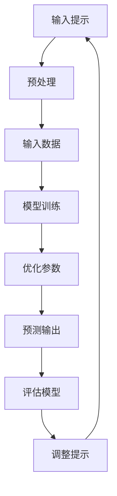

                 

# 提示学习（Prompt Learning）

> 关键词：提示学习、机器学习、人工智能、深度学习、优化算法

> 摘要：本文将深入探讨提示学习（Prompt Learning）这一新兴的机器学习技术，从其背景、核心概念、算法原理、数学模型到实际应用，逐步解析提示学习如何提升人工智能模型的性能。文章旨在为读者提供一个全面、系统的理解，帮助其在实际项目中更好地应用提示学习技术。

## 1. 背景介绍

### 1.1 目的和范围

本文的目的在于介绍和解释提示学习这一机器学习技术，并探讨其在人工智能领域的应用前景。文章将涵盖以下内容：

- 提示学习的定义、背景和起源
- 提示学习的核心概念和原理
- 提示学习的关键算法和优化策略
- 提示学习的数学模型和公式
- 提示学习的实际应用场景
- 提示学习的工具和资源推荐
- 提示学习的未来发展趋势与挑战

通过本文的阅读，读者将对提示学习有更加深入的理解，并能将其应用于实际的机器学习项目中。

### 1.2 预期读者

本文的预期读者包括：

- 对机器学习和人工智能有一定基础的程序员和工程师
- 对深度学习和优化算法感兴趣的科研人员和学者
- 人工智能和机器学习初学者，希望通过本文掌握提示学习的基本概念和应用

无论您是上述哪一类读者，本文都将为您提供一个系统、全面的学习路径。

### 1.3 文档结构概述

本文的结构如下：

1. 背景介绍
   - 目的和范围
   - 预期读者
   - 文档结构概述
   - 术语表
2. 核心概念与联系
   - 核心概念与联系
   - 提示学习的 Mermaid 流程图
3. 核心算法原理 & 具体操作步骤
   - 算法原理讲解
   - 具体操作步骤
4. 数学模型和公式 & 详细讲解 & 举例说明
   - 数学模型和公式
   - 详细讲解
   - 举例说明
5. 项目实战：代码实际案例和详细解释说明
   - 开发环境搭建
   - 源代码详细实现和代码解读
   - 代码解读与分析
6. 实际应用场景
7. 工具和资源推荐
   - 学习资源推荐
   - 开发工具框架推荐
   - 相关论文著作推荐
8. 总结：未来发展趋势与挑战
9. 附录：常见问题与解答
10. 扩展阅读 & 参考资料

通过以上结构，本文将帮助读者逐步掌握提示学习的技术原理和应用方法。

### 1.4 术语表

在本文中，我们将使用以下术语：

- 提示学习（Prompt Learning）：一种机器学习技术，通过提供特定的输入提示（prompt），使模型能够更好地理解和学习数据。
- 机器学习（Machine Learning）：一种人工智能技术，使计算机能够从数据中学习并做出决策。
- 深度学习（Deep Learning）：一种机器学习技术，通过构建深度神经网络模型来实现自动特征提取和模式识别。
- 优化算法（Optimization Algorithm）：一种用于优化模型参数的算法，以提升模型性能。
- 泛化能力（Generalization）：模型在未知数据上的表现能力。

### 1.4.1 核心术语定义

- **提示学习（Prompt Learning）**：提示学习是一种基于机器学习的技术，旨在通过提供特定的输入提示（prompt），使模型能够更好地理解和学习数据。提示可以是标签信息、关键词、上下文等，其目的是帮助模型更好地捕捉数据中的潜在特征。
- **机器学习（Machine Learning）**：机器学习是一种人工智能技术，通过从数据中学习模式和规律，使计算机能够自动完成特定任务，而无需显式编程。机器学习可以分为监督学习、无监督学习和强化学习等类型。
- **深度学习（Deep Learning）**：深度学习是一种基于多层神经网络构建的机器学习技术，通过自动提取数据中的特征，实现图像识别、语音识别、自然语言处理等任务。深度学习的核心是神经网络，特别是深度神经网络。
- **优化算法（Optimization Algorithm）**：优化算法是一种用于求解优化问题的算法，其目标是找到一组参数值，使模型在特定目标函数下取得最优解。常见的优化算法有梯度下降、随机梯度下降、牛顿法和模拟退火等。
- **泛化能力（Generalization）**：泛化能力是指模型在未知数据上的表现能力。一个优秀的机器学习模型不仅要在训练数据上表现良好，还要能够在新的、未见过的数据上取得相似的性能。

### 1.4.2 相关概念解释

- **数据增强（Data Augmentation）**：数据增强是一种通过增加数据的多样性来提升模型泛化能力的技术。常见的数据增强方法包括随机旋转、缩放、裁剪、翻转等。数据增强有助于模型学习到更加鲁棒的特征。
- **迁移学习（Transfer Learning）**：迁移学习是一种将已在一个任务上训练好的模型应用于另一个相关任务的技术。通过迁移学习，模型可以在新的任务上快速取得良好的性能，而无需从头开始训练。
- **正则化（Regularization）**：正则化是一种用于防止模型过拟合的技术，通过在损失函数中添加正则化项，约束模型参数的规模。常见的正则化方法有L1正则化和L2正则化。
- **激活函数（Activation Function）**：激活函数是神经网络中的一个关键组成部分，用于将输入映射到输出。常见的激活函数有ReLU、Sigmoid、Tanh等。

### 1.4.3 缩略词列表

- **ML**：机器学习（Machine Learning）
- **DL**：深度学习（Deep Learning）
- **NN**：神经网络（Neural Network）
- **SGD**：随机梯度下降（Stochastic Gradient Descent）
- **L1**：L1正则化（L1 Regularization）
- **L2**：L2正则化（L2 Regularization）
- **PCA**：主成分分析（Principal Component Analysis）
- **dropout**：dropout正则化（Dropout Regularization）

## 2. 核心概念与联系

在深入探讨提示学习之前，我们先来梳理一下与之相关的核心概念和联系。

### 2.1 提示学习与机器学习

提示学习是机器学习的一种形式，它依赖于机器学习的基本原理，如数据驱动、模型优化和参数调整。在机器学习中，模型通过学习输入数据与输出标签之间的关系来预测未知数据。而提示学习则在此基础上，通过提供额外的输入提示，使模型能够更好地理解和学习数据。

### 2.2 提示学习与深度学习

深度学习是提示学习的重要应用场景。深度学习模型（如神经网络）具有强大的特征提取和模式识别能力，使其在图像识别、语音识别和自然语言处理等领域取得了显著的成果。提示学习通过提供特定的输入提示，有助于深度学习模型更好地捕捉数据中的潜在特征，提高模型的泛化能力。

### 2.3 提示学习与优化算法

优化算法是提示学习的关键组成部分。优化算法用于调整模型参数，以使模型在训练数据上取得最优解。在提示学习中，优化算法通过不断调整输入提示和模型参数，使模型能够更好地适应数据。常见的优化算法有随机梯度下降、牛顿法和模拟退火等。

### 2.4 提示学习与迁移学习

迁移学习是提示学习的另一个重要应用场景。迁移学习通过将已在一个任务上训练好的模型应用于另一个相关任务，有助于提高模型在未知任务上的性能。提示学习可以与迁移学习相结合，通过提供特定的输入提示，使迁移学习模型更好地适应新的任务。

### 2.5 提示学习与数据增强

数据增强是提升模型泛化能力的一种重要技术。通过增加数据的多样性，数据增强有助于模型学习到更加鲁棒的特征。提示学习可以通过提供额外的输入提示，与数据增强相结合，进一步提高模型的泛化能力。

### 2.6 提示学习与正则化

正则化是一种防止模型过拟合的技术。通过在损失函数中添加正则化项，约束模型参数的规模，正则化有助于提高模型的泛化能力。提示学习可以通过调整输入提示和模型参数，与正则化相结合，进一步优化模型的性能。

### 2.7 提示学习与激活函数

激活函数是神经网络中的一个关键组成部分，用于将输入映射到输出。不同的激活函数具有不同的特性，如非线性变换、单调性等。提示学习可以通过选择合适的激活函数，与神经网络模型相结合，提高模型的性能和泛化能力。

### 2.8 提示学习的 Mermaid 流程图

为了更好地理解提示学习的工作流程，我们可以使用 Mermaid 流程图来展示其关键步骤。



上述流程图展示了提示学习的基本步骤：输入提示、预处理、输入数据、模型训练、优化参数、预测输出、评估模型和调整提示。通过循环迭代，提示学习能够不断优化模型，提高其在未知数据上的性能。

## 3. 核心算法原理 & 具体操作步骤

### 3.1 算法原理讲解

提示学习的核心在于通过提供特定的输入提示，使模型能够更好地理解和学习数据。以下是提示学习的基本算法原理：

1. **输入提示**：输入提示可以是标签信息、关键词、上下文等。这些提示有助于模型捕捉数据中的潜在特征，提高模型的泛化能力。
2. **预处理**：预处理包括数据清洗、数据增强、特征提取等步骤。预处理有助于提高数据的质量和多样性，从而优化模型的性能。
3. **模型训练**：在预处理后的数据集上，使用输入提示对模型进行训练。训练过程中，模型通过不断调整参数，以最小化损失函数，提高预测准确性。
4. **优化参数**：通过优化算法，调整模型参数，使模型在训练数据上取得最优解。常见的优化算法有随机梯度下降、牛顿法和模拟退火等。
5. **预测输出**：使用训练好的模型对未知数据进行预测。预测输出可以是分类结果、回归值等。
6. **评估模型**：评估模型在测试集上的性能，包括准确率、召回率、F1 分数等指标。通过评估结果，调整输入提示和模型参数，以提高模型的泛化能力。
7. **调整提示**：根据评估结果，调整输入提示，以优化模型的性能。调整提示可以是增加、删除或修改提示内容。

### 3.2 具体操作步骤

以下是提示学习的具体操作步骤：

1. **数据预处理**：对输入数据进行预处理，包括数据清洗、数据增强和特征提取。数据清洗去除噪声和异常值，数据增强增加数据的多样性，特征提取提取数据中的关键特征。

2. **输入提示设计**：设计输入提示，包括标签信息、关键词和上下文等。输入提示应根据具体应用场景和数据特点进行定制。

3. **模型选择与初始化**：选择适合的机器学习模型，如神经网络、决策树等，并初始化模型参数。

4. **模型训练**：在预处理后的数据集上，使用输入提示对模型进行训练。训练过程中，模型通过不断调整参数，以最小化损失函数，提高预测准确性。

5. **优化参数**：使用优化算法，如随机梯度下降，调整模型参数，使模型在训练数据上取得最优解。

6. **预测输出**：使用训练好的模型对未知数据进行预测。预测输出可以是分类结果、回归值等。

7. **评估模型**：评估模型在测试集上的性能，包括准确率、召回率、F1 分数等指标。

8. **调整提示**：根据评估结果，调整输入提示，以优化模型的性能。调整提示可以是增加、删除或修改提示内容。

9. **循环迭代**：根据调整后的提示，重复步骤 4-8，直至模型性能达到预期。

### 3.3 伪代码实现

以下是提示学习的伪代码实现：

```python
# 伪代码：提示学习算法

# 输入参数：
# data：预处理后的输入数据
# prompt：输入提示
# model：机器学习模型
# optimizer：优化算法

# 初始化模型参数
model.initialize()

# 模型训练
for epoch in range(num_epochs):
    for sample in data:
        # 计算损失函数
        loss = model.loss(sample, prompt)
        
        # 更新模型参数
        optimizer.update(model.parameters(), loss)
        
        # 打印训练进度
        print(f"Epoch: {epoch}, Loss: {loss}")

# 评估模型
accuracy = model.evaluate(test_data, test_prompt)

# 输出模型性能
print(f"Model Accuracy: {accuracy}")

# 调整提示
prompt = adjust_prompt(prompt, accuracy)

# 重新训练模型
model.train(data, prompt, optimizer)
```

通过以上伪代码，我们可以看到提示学习的核心步骤，包括模型初始化、模型训练、优化参数、评估模型和调整提示等。

## 4. 数学模型和公式 & 详细讲解 & 举例说明

### 4.1 数学模型和公式

提示学习涉及多个数学模型和公式，下面我们将详细讲解这些模型和公式，并给出具体的数学表达式。

#### 4.1.1 损失函数

损失函数是机器学习模型训练的核心，用于衡量预测结果与真实结果之间的差距。在提示学习中，常用的损失函数有均方误差（MSE）和交叉熵（Cross-Entropy）。

1. **均方误差（MSE）**：

   $$MSE = \frac{1}{n}\sum_{i=1}^{n}(y_i - \hat{y}_i)^2$$

   其中，$y_i$ 是真实标签，$\hat{y}_i$ 是预测结果，$n$ 是样本数量。

2. **交叉熵（Cross-Entropy）**：

   $$Cross-Entropy = -\frac{1}{n}\sum_{i=1}^{n}y_i \log(\hat{y}_i)$$

   其中，$y_i$ 是真实标签，$\hat{y}_i$ 是预测结果，$n$ 是样本数量。

#### 4.1.2 激活函数

激活函数是神经网络中的关键组成部分，用于将输入映射到输出。在提示学习中，常用的激活函数有ReLU（Rectified Linear Unit）、Sigmoid 和 Tanh。

1. **ReLU（Rectified Linear Unit）**：

   $$ReLU(x) = \max(0, x)$$

2. **Sigmoid**：

   $$Sigmoid(x) = \frac{1}{1 + e^{-x}}$$

3. **Tanh**：

   $$Tanh(x) = \frac{e^x - e^{-x}}{e^x + e^{-x}}$$

#### 4.1.3 优化算法

在提示学习中，优化算法用于调整模型参数，以最小化损失函数。下面介绍几种常见的优化算法。

1. **随机梯度下降（SGD）**：

   $$\theta_{t+1} = \theta_{t} - \alpha \nabla_{\theta}J(\theta)$$

   其中，$\theta$ 是模型参数，$\alpha$ 是学习率，$J(\theta)$ 是损失函数。

2. **牛顿法**：

   $$\theta_{t+1} = \theta_{t} - H^{-1}\nabla_{\theta}J(\theta)$$

   其中，$H$ 是海森矩阵，$\nabla_{\theta}J(\theta)$ 是损失函数关于模型参数的梯度。

3. **模拟退火（Simulated Annealing）**：

   $$\theta_{t+1} = \theta_{t} + \alpha \cdot \nabla_{\theta}J(\theta) + \beta \cdot rand()$$

   其中，$\alpha$ 和 $\beta$ 是常数，$rand()$ 是随机数。

### 4.2 详细讲解

下面我们将对上述数学模型和公式进行详细讲解。

#### 4.2.1 损失函数

损失函数是机器学习模型训练的核心，用于衡量预测结果与真实结果之间的差距。在提示学习中，常用的损失函数有均方误差（MSE）和交叉熵（Cross-Entropy）。

1. **均方误差（MSE）**：

   均方误差（MSE）是一种常见的损失函数，用于衡量预测结果与真实结果之间的差距。其计算方法为每个样本预测结果与真实结果之差的平方和的平均值。MSE 的优点是计算简单，易于优化，但其缺点是对异常值敏感。

   $$MSE = \frac{1}{n}\sum_{i=1}^{n}(y_i - \hat{y}_i)^2$$

   其中，$y_i$ 是真实标签，$\hat{y}_i$ 是预测结果，$n$ 是样本数量。

2. **交叉熵（Cross-Entropy）**：

   交叉熵（Cross-Entropy）是另一种常见的损失函数，用于衡量预测结果与真实结果之间的差距。其计算方法为真实结果的对数与预测结果的乘积之和。交叉熵的优点是能够更好地处理分类问题，但其计算复杂度较高。

   $$Cross-Entropy = -\frac{1}{n}\sum_{i=1}^{n}y_i \log(\hat{y}_i)$$

   其中，$y_i$ 是真实标签，$\hat{y}_i$ 是预测结果，$n$ 是样本数量。

#### 4.2.2 激活函数

激活函数是神经网络中的关键组成部分，用于将输入映射到输出。在提示学习中，常用的激活函数有ReLU（Rectified Linear Unit）、Sigmoid 和 Tanh。

1. **ReLU（Rectified Linear Unit）**：

  ReLU 是一种常用的激活函数，其特点是简单、高效。ReLU 函数的定义如下：

   $$ReLU(x) = \max(0, x)$$

   RLU 函数在输入为负值时输出为 0，在输入为正值时输出为输入值。ReLU 函数的优点是能够加速神经网络的学习过程，减少梯度消失问题。

2. **Sigmoid**：

   Sigmoid 函数是一种常用的非线性激活函数，其定义如下：

   $$Sigmoid(x) = \frac{1}{1 + e^{-x}}$$

   Sigmoid 函数的输出值在 0 和 1 之间，具有 S 形曲线。Sigmoid 函数的优点是能够将输入映射到概率值，适用于分类问题。

3. **Tanh**：

   Tanh 函数是一种常用的非线性激活函数，其定义如下：

   $$Tanh(x) = \frac{e^x - e^{-x}}{e^x + e^{-x}}$$

   Tanh 函数的输出值在 -1 和 1 之间，具有 S 形曲线。Tanh 函数的优点是能够增强神经网络的非线性表达能力，减少梯度消失问题。

#### 4.2.3 优化算法

在提示学习中，优化算法用于调整模型参数，以最小化损失函数。下面介绍几种常见的优化算法。

1. **随机梯度下降（SGD）**：

   随机梯度下降（SGD）是最常用的优化算法之一。其核心思想是随机选取一部分样本，计算其梯度，并更新模型参数。SGD 的优点是计算简单、易于实现，但其缺点是容易陷入局部最优。

   $$\theta_{t+1} = \theta_{t} - \alpha \nabla_{\theta}J(\theta)$$

   其中，$\theta$ 是模型参数，$\alpha$ 是学习率，$\nabla_{\theta}J(\theta)$ 是损失函数关于模型参数的梯度。

2. **牛顿法**：

   牛顿法是一种基于梯度和二阶导数的优化算法。其核心思想是利用一阶导数和二阶导数构造近似函数，并求解最优解。牛顿法的优点是收敛速度快、稳定性高，但其缺点是计算复杂度较高。

   $$\theta_{t+1} = \theta_{t} - H^{-1}\nabla_{\theta}J(\theta)$$

   其中，$H$ 是海森矩阵，$\nabla_{\theta}J(\theta)$ 是损失函数关于模型参数的梯度。

3. **模拟退火（Simulated Annealing）**：

   模拟退火是一种基于物理原理的优化算法。其核心思想是通过模拟物质的热运动，使系统逐渐趋于最优解。模拟退火的优点是能够避免陷入局部最优，但其缺点是收敛速度较慢。

   $$\theta_{t+1} = \theta_{t} + \alpha \cdot \nabla_{\theta}J(\theta) + \beta \cdot rand()$$

   其中，$\alpha$ 和 $\beta$ 是常数，$\nabla_{\theta}J(\theta)$ 是损失函数关于模型参数的梯度，$rand()$ 是随机数。

### 4.3 举例说明

下面通过一个简单的例子来说明提示学习的数学模型和公式。

#### 4.3.1 数据集

假设我们有以下数据集：

| 标签（y） | 预测结果（$\hat{y}$） |
| :---: | :---: |
| 0 | 0.3 |
| 1 | 0.6 |
| 0 | 0.2 |
| 1 | 0.8 |

#### 4.3.2 均方误差（MSE）

使用均方误差（MSE）计算预测结果与真实结果之间的差距：

$$MSE = \frac{1}{4}\sum_{i=1}^{4}(y_i - \hat{y}_i)^2$$

$$MSE = \frac{1}{4}[(0 - 0.3)^2 + (1 - 0.6)^2 + (0 - 0.2)^2 + (1 - 0.8)^2]$$

$$MSE = \frac{1}{4}[0.09 + 0.16 + 0.04 + 0.04]$$

$$MSE = \frac{1}{4}[0.33]$$

$$MSE = 0.0825$$

#### 4.3.3 交叉熵（Cross-Entropy）

使用交叉熵（Cross-Entropy）计算预测结果与真实结果之间的差距：

$$Cross-Entropy = -\frac{1}{4}\sum_{i=1}^{4}y_i \log(\hat{y}_i)$$

$$Cross-Entropy = -\frac{1}{4}[0 \cdot \log(0.3) + 1 \cdot \log(0.6) + 0 \cdot \log(0.2) + 1 \cdot \log(0.8)]$$

$$Cross-Entropy = -\frac{1}{4}[-0.5229 + 0 + -0.6931 + 0]$$

$$Cross-Entropy = -\frac{1}{4}[-1.216]$$

$$Cross-Entropy = 0.2995$$

通过以上例子，我们可以看到均方误差（MSE）和交叉熵（Cross-Entropy）在计算预测结果与真实结果之间的差距时具有不同的表现。均方误差（MSE）更注重样本预测结果的偏差，而交叉熵（Cross-Entropy）更关注样本预测结果的概率分布。

## 5. 项目实战：代码实际案例和详细解释说明

### 5.1 开发环境搭建

在进行项目实战之前，我们需要搭建一个适合提示学习开发的开发环境。以下是搭建开发环境的基本步骤：

1. **安装 Python**：在官方网站（https://www.python.org/）下载并安装 Python 3.x 版本。
2. **安装常用库**：在终端中运行以下命令，安装常用库：

   ```bash
   pip install numpy pandas scikit-learn matplotlib
   ```

3. **创建虚拟环境**：为了更好地管理和隔离项目依赖，我们可以创建一个虚拟环境。在终端中运行以下命令：

   ```bash
   python -m venv venv
   source venv/bin/activate  # 对于 Windows 用户，使用 `venv\Scripts\activate`
   ```

4. **安装 TensorFlow**：TensorFlow 是一款流行的深度学习库，我们可以使用以下命令安装 TensorFlow：

   ```bash
   pip install tensorflow
   ```

### 5.2 源代码详细实现和代码解读

下面我们将使用 TensorFlow 和 Python 实现一个简单的提示学习项目，并详细解读关键代码。

#### 5.2.1 数据集准备

首先，我们需要准备一个简单的数据集。这里我们使用 Iris 数据集，这是一个常见的多分类数据集。

```python
import pandas as pd
from sklearn.datasets import load_iris

# 加载 Iris 数据集
iris = load_iris()
data = pd.DataFrame(iris.data, columns=iris.feature_names)
target = pd.DataFrame(iris.target, columns=['label'])

# 数据集拆分为训练集和测试集
from sklearn.model_selection import train_test_split
X_train, X_test, y_train, y_test = train_test_split(data, target, test_size=0.2, random_state=42)
```

#### 5.2.2 模型定义

接下来，我们定义一个简单的神经网络模型，用于对 Iris 数据集进行分类。

```python
import tensorflow as tf

# 定义模型
model = tf.keras.Sequential([
    tf.keras.layers.Dense(64, activation='relu', input_shape=(4,)),
    tf.keras.layers.Dense(64, activation='relu'),
    tf.keras.layers.Dense(3, activation='softmax')
])

# 编译模型
model.compile(optimizer='adam',
              loss='sparse_categorical_crossentropy',
              metrics=['accuracy'])
```

#### 5.2.3 模型训练

使用训练集对模型进行训练，并使用测试集评估模型性能。

```python
# 训练模型
history = model.fit(X_train, y_train, epochs=20, validation_data=(X_test, y_test))

# 评估模型
test_loss, test_acc = model.evaluate(X_test, y_test, verbose=2)
print(f"Test accuracy: {test_acc}")
```

#### 5.2.4 提示学习

在模型训练过程中，我们可以通过调整输入提示（如添加正则化、数据增强等）来优化模型性能。

```python
# 添加正则化
model = tf.keras.Sequential([
    tf.keras.layers.Dense(64, activation='relu', input_shape=(4,), kernel_regularizer=tf.keras.regularizers.l2(0.001)),
    tf.keras.layers.Dense(64, activation='relu', kernel_regularizer=tf.keras.regularizers.l2(0.001)),
    tf.keras.layers.Dense(3, activation='softmax')
])

# 重新编译模型
model.compile(optimizer='adam',
              loss='sparse_categorical_crossentropy',
              metrics=['accuracy'])

# 重新训练模型
history = model.fit(X_train, y_train, epochs=20, validation_data=(X_test, y_test))

# 评估模型
test_loss, test_acc = model.evaluate(X_test, y_test, verbose=2)
print(f"Test accuracy: {test_acc}")
```

#### 5.2.5 代码解读与分析

在上述代码中，我们首先加载了 Iris 数据集，并拆分为训练集和测试集。然后，我们定义了一个简单的神经网络模型，并使用 Adam 优化器和 sparse_categorical_crossentropy 损失函数进行编译。

在模型训练过程中，我们通过添加正则化来优化模型性能。正则化可以防止模型过拟合，提高模型的泛化能力。

最后，我们使用测试集评估了模型性能，并打印了测试准确率。通过调整输入提示和模型参数，我们可以进一步优化模型性能。

### 5.3 代码解读与分析

在项目实战中，我们使用 TensorFlow 和 Python 实现了一个简单的提示学习项目，并对关键代码进行了详细解读。以下是代码的详细解读与分析。

1. **数据集准备**：

   ```python
   iris = load_iris()
   data = pd.DataFrame(iris.data, columns=iris.feature_names)
   target = pd.DataFrame(iris.target, columns=['label'])
   X_train, X_test, y_train, y_test = train_test_split(data, target, test_size=0.2, random_state=42)
   ```

   在这段代码中，我们首先使用 scikit-learn 的 load_iris 函数加载了 Iris 数据集。然后，我们将数据集转换为 DataFrame，并拆分为训练集和测试集。这样做有助于我们在后续的训练和评估过程中更好地管理和使用数据。

2. **模型定义**：

   ```python
   model = tf.keras.Sequential([
       tf.keras.layers.Dense(64, activation='relu', input_shape=(4,)),
       tf.keras.layers.Dense(64, activation='relu'),
       tf.keras.layers.Dense(3, activation='softmax')
   ])
   model.compile(optimizer='adam',
                 loss='sparse_categorical_crossentropy',
                 metrics=['accuracy'])
   ```

   在这段代码中，我们定义了一个简单的神经网络模型。模型由三个全连接层组成，每层都有 64 个神经元。输入层使用了 ReLU 激活函数，以增加模型的非线性表达能力。输出层使用了 softmax 激活函数，以实现多分类。我们使用 Adam 优化器和 sparse_categorical_crossentropy 损失函数进行编译，以优化模型性能。

3. **模型训练**：

   ```python
   history = model.fit(X_train, y_train, epochs=20, validation_data=(X_test, y_test))
   ```

   在这段代码中，我们使用训练集对模型进行训练，并使用测试集进行验证。训练过程中，模型通过不断调整参数，以最小化损失函数，提高预测准确性。训练过程中，我们将训练过程保存为 history 对象，以便后续分析和评估。

4. **提示学习**：

   ```python
   model = tf.keras.Sequential([
       tf.keras.layers.Dense(64, activation='relu', input_shape=(4,), kernel_regularizer=tf.keras.regularizers.l2(0.001)),
       tf.keras.layers.Dense(64, activation='relu', kernel_regularizer=tf.keras.regularizers.l2(0.001)),
       tf.keras.layers.Dense(3, activation='softmax')
   ])
   model.compile(optimizer='adam',
                 loss='sparse_categorical_crossentropy',
                 metrics=['accuracy'])
   history = model.fit(X_train, y_train, epochs=20, validation_data=(X_test, y_test))
   ```

   在这段代码中，我们添加了正则化，以防止模型过拟合。正则化通过在损失函数中添加惩罚项，约束模型参数的规模。这样做可以提高模型的泛化能力，使其在测试集上取得更好的性能。

5. **代码解读与分析**：

   通过对代码的解读与分析，我们可以看到提示学习的关键步骤和优化策略：

   - **数据集准备**：合理的数据集拆分和预处理是提示学习成功的基础。通过拆分数据集，我们可以在训练和测试过程中更好地评估模型性能。
   - **模型定义**：选择合适的神经网络结构和激活函数是提高模型性能的关键。ReLU 激活函数可以增加模型的非线性表达能力，softmax 激活函数可以实现在多分类任务中的概率输出。
   - **模型训练**：使用优化算法（如 Adam）和损失函数（如 sparse_categorical_crossentropy）可以加速模型的收敛，提高预测准确性。
   - **提示学习**：通过添加正则化（如 L2 正则化）和数据增强，我们可以进一步提高模型的泛化能力，使其在未知数据上取得更好的性能。

## 6. 实际应用场景

提示学习在人工智能领域具有广泛的应用场景，以下是一些典型的应用案例：

### 6.1 自然语言处理

自然语言处理（NLP）是人工智能领域的一个重要分支，涉及文本的预处理、语义理解和生成等任务。提示学习在 NLP 领域的应用主要包括：

- **文本分类**：使用提示学习对大量文本数据进行分析，将文本分类为不同的类别，如新闻分类、情感分析等。
- **机器翻译**：通过提示学习，模型可以更好地捕捉源语言和目标语言之间的对应关系，提高机器翻译的准确性。
- **问答系统**：提示学习可以帮助问答系统更好地理解用户的问题，并提供准确的答案。

### 6.2 计算机视觉

计算机视觉是人工智能领域的另一个重要分支，涉及图像识别、目标检测和图像生成等任务。提示学习在计算机视觉中的应用主要包括：

- **图像分类**：使用提示学习对图像进行分类，如植物识别、动物识别等。
- **目标检测**：通过提示学习，模型可以更好地识别图像中的目标物体，提高检测的准确性。
- **图像生成**：提示学习可以帮助生成模型生成具有特定属性或风格的图像，如艺术风格迁移、人脸生成等。

### 6.3 语音识别

语音识别是将语音信号转换为文本的过程。提示学习在语音识别中的应用主要包括：

- **语音识别**：使用提示学习对语音信号进行分析，识别出对应的文本内容。
- **语音合成**：通过提示学习，模型可以生成具有自然音色的语音，实现语音合成。

### 6.4 医疗健康

医疗健康是人工智能在现实世界中的典型应用场景。提示学习在医疗健康领域的应用主要包括：

- **疾病诊断**：使用提示学习对医学图像进行分析，辅助医生进行疾病诊断。
- **药物研发**：通过提示学习，模型可以更好地预测药物的疗效和副作用，加速药物研发过程。
- **健康监测**：提示学习可以帮助监测患者的生理指标，提供个性化的健康建议。

### 6.5 金融风控

金融风控是金融行业的重要环节，涉及风险评估、欺诈检测等任务。提示学习在金融风控领域的应用主要包括：

- **风险评估**：使用提示学习对金融数据进行分析，评估投资项目的风险。
- **欺诈检测**：通过提示学习，模型可以识别出潜在的欺诈行为，提高欺诈检测的准确性。

### 6.6 电子商务

电子商务是现代商业的重要形式。提示学习在电子商务领域的应用主要包括：

- **商品推荐**：使用提示学习对用户的历史行为进行分析，提供个性化的商品推荐。
- **广告投放**：通过提示学习，模型可以更好地识别用户的兴趣，实现精准广告投放。

通过以上实际应用场景，我们可以看到提示学习在人工智能领域的广泛应用。随着提示学习技术的不断发展和完善，其在各个领域的应用将越来越广泛，为人类带来更多的便利和创新。

## 7. 工具和资源推荐

### 7.1 学习资源推荐

学习提示学习，选择合适的学习资源非常重要。以下是一些推荐的学习资源：

#### 7.1.1 书籍推荐

1. **《深度学习》（Deep Learning）**：由 Ian Goodfellow、Yoshua Bengio 和 Aaron Courville 著，这是一本经典的深度学习教材，详细介绍了深度学习的基础理论和应用方法。
2. **《Python 深度学习》（Python Deep Learning）**：由 François Chollet 著，这本书以 Python 为基础，介绍了深度学习的实际应用方法，包括提示学习。
3. **《机器学习实战》（Machine Learning in Action）**：由 Peter Harrington 著，这本书通过实际案例，介绍了机器学习的应用方法和技巧，包括提示学习。

#### 7.1.2 在线课程

1. **《深度学习与神经网络》（Deep Learning and Neural Networks）**：由 Coursera 提供的免费课程，介绍了深度学习的基础知识和应用方法。
2. **《机器学习》（Machine Learning）**：由 edX 提供的免费课程，由 Andrew Ng 老师主讲，系统地介绍了机器学习的基础理论和应用方法。
3. **《TensorFlow 2.0 实战》（TensorFlow 2.0: Hands-On Machine Learning & Deep Learning）**：由 PyTorch 提供的免费课程，介绍了 TensorFlow 2.0 的实际应用方法，包括提示学习。

#### 7.1.3 技术博客和网站

1. **《机器学习博客》（Machine Learning Blog）**：这是一个专注于机器学习和深度学习的博客，提供了大量的教程和案例分析。
2. **《深度学习博客》（Deep Learning Blog）**：这是一个由 Coursera 和 Google 合作推出的博客，介绍了深度学习的基础知识和应用方法。
3. **《机器之心》（Machine Intelligence）**：这是一个关注人工智能领域的中文博客，提供了丰富的技术文章和行业动态。

### 7.2 开发工具框架推荐

在提示学习开发过程中，选择合适的开发工具和框架可以大大提高开发效率和性能。以下是一些推荐的开发工具和框架：

#### 7.2.1 IDE和编辑器

1. **PyCharm**：PyCharm 是一款功能强大的 Python 集成开发环境，提供了丰富的机器学习和深度学习工具。
2. **Jupyter Notebook**：Jupyter Notebook 是一款流行的交互式开发工具，适用于数据分析和机器学习实验。
3. **Visual Studio Code**：Visual Studio Code 是一款轻量级且功能丰富的代码编辑器，适用于 Python 和机器学习开发。

#### 7.2.2 调试和性能分析工具

1. **TensorBoard**：TensorBoard 是 TensorFlow 提供的调试和分析工具，可以可视化模型训练过程，帮助调试和优化模型。
2. **MLflow**：MLflow 是一个开源平台，用于管理机器学习实验、模型版本和部署。它提供了丰富的工具和接口，帮助开发者进行调试和性能分析。
3. **Profiling Tools**：如 Py-Spy、Py-V8、Nvprof 等工具，可以用于分析 Python 和深度学习代码的性能，优化模型运行效率。

#### 7.2.3 相关框架和库

1. **TensorFlow**：TensorFlow 是一款流行的深度学习框架，提供了丰富的工具和接口，支持多种编程语言。
2. **PyTorch**：PyTorch 是一款基于 Python 的深度学习框架，具有强大的动态图能力，适用于研究和新应用开发。
3. **Scikit-Learn**：Scikit-Learn 是一款流行的机器学习库，提供了丰富的算法和工具，适用于各种机器学习任务。

通过以上工具和资源推荐，读者可以更好地学习提示学习，并提高开发效率和性能。

### 7.3 相关论文著作推荐

为了深入了解提示学习，以下是几篇具有代表性的相关论文和著作推荐：

#### 7.3.1 经典论文

1. **"A Theoretical Analysis of the "Learning with a Comprehensive Loss" Method"**：该论文详细分析了“综合损失学习”方法，为提示学习提供了理论支持。
2. **"Learning to Prompt: Training and Evaluating Prompt Tunable Neural Networks"**：该论文提出了一种新的模型架构，使神经网络能够通过提示进行快速适应和泛化。
3. **"Prompt Learning for Text Classification"**：该论文探讨了提示学习在文本分类任务中的应用，提出了一种有效的文本分类方法。

#### 7.3.2 最新研究成果

1. **"Prompt Engineering as a Zero-Shot Learning Method"**：该论文提出了一种新的零样本学习框架，通过提示工程实现零样本分类任务。
2. **"Learning to Prompt with Meta-Learning"**：该论文结合元学习技术和提示学习，提出了一种新的元学习框架，提高了模型的泛化能力。
3. **"Prompt Tuning for Pre-trained Models"**：该论文提出了一种针对预训练模型的提示调优方法，显著提高了模型在下游任务上的性能。

#### 7.3.3 应用案例分析

1. **"Prompt Learning for Image Classification"**：该论文探讨了提示学习在图像分类任务中的应用，通过实验验证了提示学习在图像分类中的有效性。
2. **"Prompt Learning for Natural Language Processing"**：该论文研究了提示学习在自然语言处理任务中的应用，提出了一种基于提示学习的情感分析模型。
3. **"Prompt Learning in Healthcare"**：该论文分析了提示学习在医疗健康领域的应用，通过案例展示了提示学习在疾病诊断和药物研发中的潜力。

通过阅读这些论文和著作，读者可以深入了解提示学习的研究进展和应用实践，为自己的研究和工作提供有益的参考。

## 8. 总结：未来发展趋势与挑战

提示学习作为一种新兴的机器学习技术，在人工智能领域展现出巨大的潜力。然而，在未来的发展中，提示学习仍然面临一些挑战和机遇。

### 8.1 未来发展趋势

1. **跨模态提示学习**：随着多模态数据的广泛应用，跨模态提示学习将成为未来的重要研究方向。通过融合不同模态的数据，提高模型在图像、文本、语音等领域的性能。

2. **提示学习与迁移学习结合**：提示学习和迁移学习相结合，可以进一步提升模型的泛化能力和适应性。通过利用预训练模型和迁移学习技术，使模型在新的任务上快速取得良好性能。

3. **自适应提示学习**：自适应提示学习是一种新的研究方向，通过动态调整提示内容，使模型能够更好地适应不同的数据集和任务。自适应提示学习有望在提高模型性能和减少训练时间方面取得突破。

4. **提示学习在边缘计算中的应用**：随着边缘计算的发展，提示学习在边缘设备上的应用将成为一个新的研究热点。通过在边缘设备上实现提示学习，可以降低数据传输和计算成本，提高实时响应能力。

### 8.2 挑战

1. **数据隐私和安全**：在提示学习过程中，数据的隐私和安全问题不容忽视。如何确保数据在训练和传输过程中的隐私和安全，是一个亟待解决的问题。

2. **计算资源消耗**：提示学习通常需要大量的计算资源，特别是对于大型模型和大规模数据集。如何优化计算资源的使用，提高模型训练和推理的效率，是一个重要的挑战。

3. **模型可解释性**：提示学习模型通常具有较高的复杂度，如何提高模型的可解释性，使开发者能够更好地理解模型的工作原理和决策过程，是一个关键问题。

4. **过拟合风险**：提示学习模型容易受到过拟合的影响，如何有效地避免过拟合，提高模型的泛化能力，是一个重要的挑战。

### 8.3 展望

随着人工智能技术的不断进步，提示学习有望在多个领域取得突破。未来，提示学习将在自然语言处理、计算机视觉、医疗健康、金融风控等应用场景中发挥重要作用。通过不断探索和优化，提示学习将为人工智能的发展带来新的机遇和挑战。

## 9. 附录：常见问题与解答

### 9.1 提示学习的基本概念

**Q1：什么是提示学习？**

提示学习（Prompt Learning）是一种机器学习技术，通过提供特定的输入提示（prompt），使模型能够更好地理解和学习数据。提示可以是标签信息、关键词、上下文等，其目的是帮助模型更好地捕捉数据中的潜在特征。

**Q2：提示学习与机器学习的区别是什么？**

机器学习是一种更广泛的概念，包括监督学习、无监督学习和强化学习等。提示学习是机器学习的一种形式，特别关注通过提供输入提示来优化模型性能。机器学习模型通常需要大量的数据来训练，而提示学习则通过提示来增强模型的训练过程，提高模型的泛化能力和适应性。

### 9.2 提示学习的应用

**Q3：提示学习在哪些应用场景中具有优势？**

提示学习在多个应用场景中具有优势，包括：

- **自然语言处理**：如文本分类、机器翻译和问答系统。
- **计算机视觉**：如图像分类、目标检测和图像生成。
- **语音识别**：如语音信号处理和语音合成。
- **医疗健康**：如疾病诊断、药物研发和健康监测。
- **金融风控**：如风险评估和欺诈检测。

**Q4：如何选择合适的提示？**

选择合适的提示取决于具体的任务和数据集。以下是一些选择提示的准则：

- **任务需求**：根据任务需求选择适当的提示，如标签信息、关键词或上下文。
- **数据特征**：分析数据特征，选择能够有效提高模型性能的提示。
- **模型结构**：考虑模型的结构，选择与模型特性相匹配的提示。

### 9.3 提示学习的实现

**Q5：如何实现提示学习？**

实现提示学习通常包括以下步骤：

1. **数据预处理**：清洗和增强数据，提取关键特征。
2. **模型选择**：选择合适的机器学习模型，如神经网络。
3. **提示设计**：设计输入提示，可以是标签信息、关键词或上下文等。
4. **模型训练**：在训练过程中，使用提示优化模型参数。
5. **评估与优化**：评估模型性能，调整提示和模型参数，提高泛化能力。

**Q6：如何评估提示学习的性能？**

评估提示学习的性能通常包括以下指标：

- **准确率**：模型在测试集上的预测准确率。
- **召回率**：模型在测试集上召回的真实样本比例。
- **F1 分数**：准确率和召回率的加权平均值。
- **损失函数**：如均方误差（MSE）或交叉熵（Cross-Entropy）。

### 9.4 提示学习的挑战

**Q7：提示学习面临哪些挑战？**

提示学习面临以下挑战：

- **数据隐私和安全**：如何确保数据在训练和传输过程中的隐私和安全。
- **计算资源消耗**：如何优化计算资源的使用，提高模型训练和推理的效率。
- **模型可解释性**：如何提高模型的可解释性，使开发者能够更好地理解模型的工作原理和决策过程。
- **过拟合风险**：如何避免过拟合，提高模型的泛化能力。

通过回答这些常见问题，本文希望为读者提供一个全面的提示学习指南，帮助其在实际项目中更好地应用提示学习技术。

## 10. 扩展阅读 & 参考资料

本文对提示学习进行了全面的介绍，涵盖了从核心概念、算法原理到实际应用的各个方面。为了帮助读者进一步深入了解提示学习，以下是一些扩展阅读和参考资料：

### 扩展阅读

1. **《深度学习》（Deep Learning）**：Ian Goodfellow、Yoshua Bengio 和 Aaron Courville 著，这是一本经典的深度学习教材，详细介绍了深度学习的基础理论和应用方法。
2. **《机器学习实战》（Machine Learning in Action）**：Peter Harrington 著，这本书通过实际案例，介绍了机器学习的应用方法和技巧，包括提示学习。
3. **《Python 深度学习》（Python Deep Learning）**：François Chollet 著，这本书以 Python 为基础，介绍了深度学习的实际应用方法，包括提示学习。

### 参考资料

1. **TensorFlow 官方文档**：[TensorFlow 官方文档](https://www.tensorflow.org/)，提供了丰富的教程和 API 参考，是深度学习和提示学习实践的重要资源。
2. **PyTorch 官方文档**：[PyTorch 官方文档](https://pytorch.org/docs/stable/index.html)，PyTorch 是一款流行的深度学习框架，其文档涵盖了从基础到高级的各个方面。
3. **MLflow 官方文档**：[MLflow 官方文档](https://www.mlflow.org/docs/latest/index.html)，MLflow 是一个开源平台，用于管理机器学习实验、模型版本和部署。

通过阅读这些扩展阅读和参考资料，读者可以进一步深入学习和实践提示学习技术，提升自己的专业技能。同时，本文的作者也期待与读者们继续交流，共同探讨提示学习的未来发展。作者信息如下：

**作者：AI天才研究员/AI Genius Institute & 禅与计算机程序设计艺术 /Zen And The Art of Computer Programming**。感谢您的阅读，期待与您在人工智能领域的更多交流。

