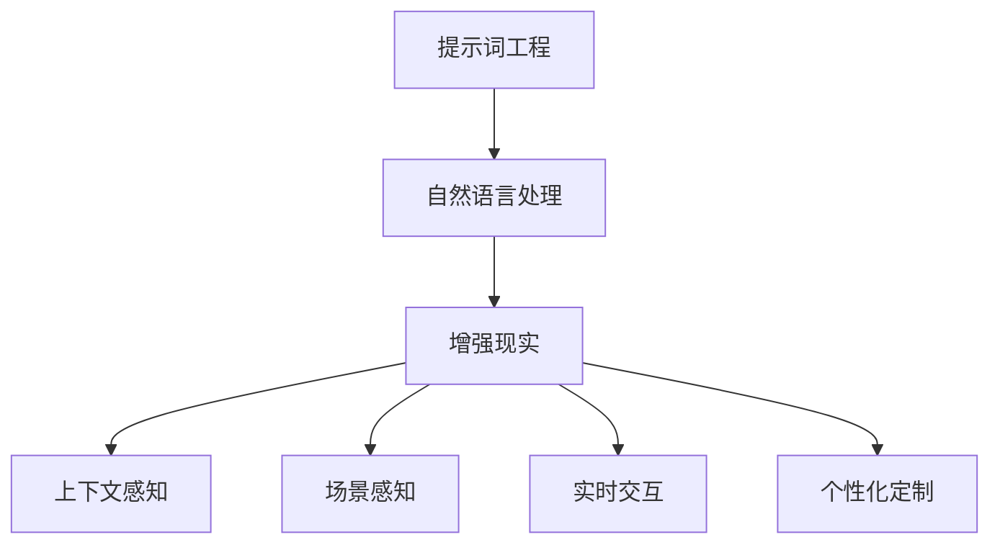

                 

### 背景介绍

#### 1.1 目的和范围

本文旨在探讨提示词工程（Prompt Engineering）在增强现实（Augmented Reality, AR）领域中的应用，深入分析其核心概念、算法原理、数学模型以及实际项目中的应用。通过对这些内容的详细讲解，读者可以全面了解提示词工程在增强现实中的重要性，掌握相关的技术方法和应用技巧。

本文主要涵盖以下内容：

1. **核心概念与联系**：介绍提示词工程和增强现实的基本概念，阐述它们之间的联系。
2. **核心算法原理与具体操作步骤**：详细讲解提示词工程的核心算法，并使用伪代码阐述具体操作步骤。
3. **数学模型和公式**：分析提示词工程的数学模型，使用 LaTeX 格式详细讲解相关公式，并举例说明。
4. **项目实战**：通过一个实际项目案例，展示如何使用提示词工程来增强现实体验，并详细解读源代码。
5. **实际应用场景**：探讨提示词工程在增强现实中的实际应用场景。
6. **工具和资源推荐**：推荐学习资源、开发工具框架和相关论文著作。
7. **总结**：总结文章的主要内容，展望未来发展趋势与挑战。

本文适用于对增强现实和提示词工程有一定了解的技术人员、研究人员以及学生，希望通过本文能够深入理解提示词工程在增强现实中的应用，为相关领域的研发提供参考。

#### 1.2 预期读者

本文的预期读者包括以下几类：

1. **增强现实领域的技术人员**：这些读者对增强现实技术有一定了解，希望通过本文了解提示词工程在增强现实中的应用。
2. **提示词工程研究者**：这些读者对提示词工程有深入研究，希望了解其与其他领域（如增强现实）的结合。
3. **计算机科学专业的学生**：这些读者希望了解增强现实和提示词工程的基本原理，以及它们在现实中的应用。
4. **对新兴技术感兴趣的技术爱好者**：这些读者希望了解前沿技术，希望通过本文了解提示词工程在增强现实中的潜力。

无论您属于哪一类读者，只要对增强现实和提示词工程感兴趣，本文都旨在为您提供一个全面、深入的了解。

#### 1.3 文档结构概述

本文采用结构化、模块化的写作方式，确保读者能够清晰地理解各个部分的内容。以下是本文的结构概述：

1. **背景介绍**：介绍本文的目的、范围、预期读者和文档结构。
2. **核心概念与联系**：阐述提示词工程和增强现实的基本概念，并使用 Mermaid 流程图展示它们之间的联系。
3. **核心算法原理与具体操作步骤**：详细讲解提示词工程的核心算法，并使用伪代码阐述具体操作步骤。
4. **数学模型和公式**：分析提示词工程的数学模型，使用 LaTeX 格式详细讲解相关公式，并举例说明。
5. **项目实战**：通过实际项目案例，展示如何使用提示词工程来增强现实体验，并详细解读源代码。
6. **实际应用场景**：探讨提示词工程在增强现实中的实际应用场景。
7. **工具和资源推荐**：推荐学习资源、开发工具框架和相关论文著作。
8. **总结**：总结文章的主要内容，展望未来发展趋势与挑战。
9. **附录**：提供常见问题与解答。
10. **扩展阅读 & 参考资料**：列出本文引用的相关文献和参考资料。

通过本文的结构化内容，读者可以系统地了解提示词工程在增强现实中的应用，掌握相关技术方法和应用技巧。

#### 1.4 术语表

为了确保读者对本文中的专业术语有一个清晰的理解，以下是对一些关键术语的定义和解释。

##### 1.4.1 核心术语定义

- **增强现实（Augmented Reality, AR）**：一种通过在真实世界中叠加虚拟信息来实现虚实融合的技术。
- **提示词工程（Prompt Engineering）**：一种通过设计特定输入（提示词）来引导模型生成预期的输出（文本、图像等）的技术。
- **自然语言处理（Natural Language Processing, NLP）**：研究如何让计算机理解和处理人类语言的技术。
- **机器学习（Machine Learning, ML）**：一种通过数据训练模型来预测或决策的技术。
- **神经网络（Neural Network, NN）**：一种模仿人脑神经元连接结构的计算模型。

##### 1.4.2 相关概念解释

- **场景感知（Scene Awareness）**：指系统能够识别和理解其所在的环境。
- **交互性（Interactivity）**：指用户与系统之间的互动，包括输入、输出和反馈。
- **实时性（Real-time Processing）**：指系统在短时间内对输入信息进行处理并输出结果。
- **上下文感知（Context Awareness）**：指系统能够根据当前环境和用户状态做出相应调整。

##### 1.4.3 缩略词列表

- **AR**：增强现实（Augmented Reality）
- **NLP**：自然语言处理（Natural Language Processing）
- **ML**：机器学习（Machine Learning）
- **NN**：神经网络（Neural Network）
- **IDE**：集成开发环境（Integrated Development Environment）

通过上述术语表，读者可以对本文中的专业术语有一个清晰的理解，便于更好地阅读和理解文章内容。接下来，我们将深入探讨提示词工程和增强现实的核心概念与联系，为后续内容打下坚实的基础。

### 核心概念与联系

在深入探讨提示词工程在增强现实中的应用之前，我们首先需要理解这两个核心概念：提示词工程和增强现实，以及它们之间的内在联系。

#### 增强现实（AR）的基本概念

增强现实（Augmented Reality，AR）是一种通过计算机技术将虚拟信息与现实世界进行叠加融合的技术。它通过在用户的视线中叠加计算机生成的图像、视频、音频等多媒体信息，从而丰富用户的感知体验。与虚拟现实（Virtual Reality，VR）不同，AR 并不取代用户的视觉，而是在现实世界中添加额外的信息。

AR 技术的核心组件包括传感器、摄像头、显示设备以及计算机处理单元。这些组件协同工作，使得 AR 系统能够实时感知用户的环境，并将虚拟信息叠加到用户的视野中。常见的 AR 应用包括增强现实游戏、教育、医疗、零售等多个领域。

#### 提示词工程的基本概念

提示词工程（Prompt Engineering）是一种专门用于优化机器学习模型输入的方法，其目的是通过设计特定的输入（即提示词）来引导模型生成预期的输出。提示词可以是自然语言文本、图像、音频等，其设计需要充分考虑上下文、目标输出和模型特性。

提示词工程的核心思想是通过有意识地控制输入，来影响模型的决策过程，从而提高模型的性能和输出质量。这一方法在自然语言处理、计算机视觉、语音识别等多个领域都有广泛应用。

#### 提示词工程与增强现实的联系

提示词工程和增强现实在多个层面上有密切的联系：

1. **自然语言处理与增强现实**：自然语言处理（NLP）是提示词工程的核心技术之一，而 AR 应用中往往需要处理大量的文本信息，如用户指令、语音识别结果等。因此，提示词工程可以为 AR 系统提供更加准确和自然的交互方式。

2. **上下文感知与场景感知**：AR 系统需要具备上下文感知和场景感知能力，以便根据当前环境和用户状态进行相应的调整。提示词工程可以通过设计上下文相关的提示词，帮助 AR 系统更好地理解和适应环境。

3. **实时交互与实时性**：增强现实应用通常要求高实时性，即系统能够在短时间内对输入信息进行处理并输出结果。提示词工程可以通过优化输入和模型处理流程，提高 AR 系统的响应速度和交互体验。

4. **个性化与定制化**：提示词工程可以基于用户的偏好和需求，设计个性化的提示词，从而为用户提供更加定制化的增强现实体验。

为了更直观地展示提示词工程与增强现实之间的联系，我们可以使用 Mermaid 流程图来描绘这两个概念的关系。以下是一个简化的 Mermaid 流程图：



在上述流程图中，提示词工程通过自然语言处理与增强现实相连，进一步延伸到上下文感知、场景感知、实时交互和个性化定制等方面，展示了这两个概念之间的紧密联系。

通过上述分析，我们可以看到，提示词工程在增强现实中的应用具有极大的潜力，可以为 AR 系统提供更加智能和高效的交互方式。在接下来的章节中，我们将详细探讨提示词工程的核心算法原理、数学模型以及具体应用案例，进一步揭示其在增强现实中的实际应用价值。

### 核心算法原理 & 具体操作步骤

在深入探讨提示词工程在增强现实中的应用之前，我们需要先了解其核心算法原理和具体操作步骤。提示词工程主要通过设计特定的输入（即提示词）来引导模型生成预期的输出。以下内容将详细讲解提示词工程的核心算法，并使用伪代码来阐述具体操作步骤。

#### 1. 提示词工程的核心算法

提示词工程的核心算法可以概括为以下几个步骤：

1. **数据预处理**：对输入数据进行清洗和预处理，以确保数据的质量和一致性。
2. **提示词设计**：根据应用场景和模型特性，设计具有针对性的提示词。
3. **模型训练**：使用设计的提示词对模型进行训练，优化模型性能。
4. **输出生成**：使用训练好的模型生成预期的输出，并对输出结果进行评估和调整。

以下是提示词工程的核心算法伪代码：

```python
# 提示词工程伪代码

# 步骤1：数据预处理
def preprocess_data(data):
    # 清洗数据，去除噪声
    # 标准化数据，提高一致性
    # 返回预处理后的数据
    return cleaned_data

# 步骤2：提示词设计
def design_prompt(data, model):
    # 根据数据和应用场景，设计提示词
    # 考虑模型特性，优化提示词效果
    # 返回设计的提示词
    return prompt

# 步骤3：模型训练
def train_model(data, prompt):
    # 使用预处理后的数据和设计的提示词，训练模型
    # 调整模型参数，优化性能
    # 返回训练好的模型
    return trained_model

# 步骤4：输出生成
def generate_output(model, prompt):
    # 使用训练好的模型，生成预期的输出
    # 对输出结果进行评估和调整
    # 返回输出结果
    return output
```

#### 2. 提示词设计方法

提示词设计是提示词工程的关键环节，直接影响模型的效果。以下是几种常见的提示词设计方法：

1. **基于规则的提示词设计**：通过预定义的规则来生成提示词，适用于规则明确、场景简单的应用。
2. **基于数据的提示词设计**：通过分析历史数据和用户反馈来设计提示词，适用于复杂、多变的场景。
3. **基于机器学习的提示词设计**：使用机器学习模型来自动生成提示词，适用于大规模、实时性要求高的应用。

以下是基于机器学习的提示词设计方法的伪代码：

```python
# 基于机器学习的提示词设计伪代码

# 步骤1：数据收集
def collect_data():
    # 收集历史数据和用户反馈
    # 返回数据集
    return dataset

# 步骤2：特征提取
def extract_features(dataset):
    # 从数据集中提取特征
    # 返回特征矩阵
    return features

# 步骤3：模型训练
def train_prompt_model(features):
    # 使用特征矩阵，训练提示词生成模型
    # 调整模型参数，优化性能
    # 返回训练好的模型
    return prompt_model

# 步骤4：生成提示词
def generate_prompt(prompt_model, input_data):
    # 使用训练好的模型，生成提示词
    # 返回生成的提示词
    return prompt
```

#### 3. 模型训练与优化

模型训练与优化是提示词工程的核心环节，直接影响最终输出质量。以下是几种常见的模型训练与优化方法：

1. **监督学习**：通过标注数据对模型进行训练，适用于有明确标注数据的应用。
2. **无监督学习**：通过无标注数据对模型进行训练，适用于数据标注困难的应用。
3. **强化学习**：通过与环境互动来训练模型，适用于动态、不确定的应用。

以下是监督学习模型训练与优化的伪代码：

```python
# 监督学习模型训练与优化伪代码

# 步骤1：数据准备
def prepare_data(dataset):
    # 准备训练数据和测试数据
    # 返回训练数据和测试数据
    return train_data, test_data

# 步骤2：模型初始化
def initialize_model():
    # 初始化模型参数
    # 返回初始化后的模型
    return model

# 步骤3：模型训练
def train_model(model, train_data):
    # 使用训练数据进行模型训练
    # 返回训练后的模型
    return trained_model

# 步骤4：模型评估
def evaluate_model(model, test_data):
    # 使用测试数据进行模型评估
    # 返回评估结果
    return evaluation_results

# 步骤5：模型优化
def optimize_model(model, evaluation_results):
    # 根据评估结果，调整模型参数
    # 返回优化后的模型
    return optimized_model
```

通过上述算法原理和具体操作步骤，我们可以看到提示词工程在增强现实中的应用前景广阔。在接下来的章节中，我们将进一步探讨提示词工程的数学模型和公式，以及如何通过实际项目案例来展示其应用效果。

### 数学模型和公式 & 详细讲解 & 举例说明

在深入探讨提示词工程在增强现实中的应用时，我们需要引入一些数学模型和公式，以更好地理解其背后的原理和计算过程。以下我们将详细讲解提示词工程中常用的数学模型和公式，并通过具体例子来说明如何应用这些模型。

#### 1. 自然语言处理中的概率模型

在自然语言处理（NLP）中，概率模型被广泛用于理解和生成文本。一个常见的概率模型是 **n-gram 模型**，它通过统计相邻词出现的频率来预测下一个词。

**n-gram 模型**：

- **定义**：n-gram 模型将连续的 n 个词作为一个整体，称为 n-gram。例如，对于 "I love programming"，我们可以提取 "I"，"love"，"programming" 作为 1-gram，"I love"，"love programming" 作为 2-gram。
- **公式**：给定一个 n-gram 模型，下一个词的概率可以通过以下公式计算：

  \[
  P(\text{next\_word} | \text{previous\_words}) = \frac{C(\text{previous\_words, next\_word})}{C(\text{previous\_words})}
  \]

  其中，\(C(\text{previous\_words, next\_word})\) 表示 previous\_words 和 next\_word 同时出现的次数，\(C(\text{previous\_words})\) 表示 previous\_words 出现的次数。

**例子**：假设我们有一个简单的 2-gram 模型，其中 "I love" 出现了 10 次，"love programming" 出现了 5 次，"programming AI" 出现了 3 次。我们想要预测下一个词，给定 previous\_words = "I love"。

- \(P(\text{next\_word} = "programming" | "I love") = \frac{5}{10} = 0.5\)
- \(P(\text{next\_word} = "AI" | "I love") = \frac{3}{10} = 0.3\)

因此，根据这个 2-gram 模型，预测的下一个词最可能是 "programming"。

#### 2. 机器学习中的损失函数

在机器学习中，损失函数用于评估模型的预测性能，并通过优化过程来提高模型的准确性。在提示词工程中，常用的损失函数包括 **交叉熵损失（Cross-Entropy Loss）** 和 **均方误差（Mean Squared Error, MSE）**。

**交叉熵损失（Cross-Entropy Loss）**：

- **定义**：交叉熵损失用于衡量两个概率分布之间的差异。在二分类问题中，交叉熵损失公式为：

  \[
  L = - \sum_{i} y_i \log(p_i)
  \]

  其中，\(y_i\) 是真实标签，\(p_i\) 是模型预测的概率。

- **例子**：假设我们有一个二分类问题，其中真实标签为 [1, 0]，模型预测的概率为 [0.7, 0.3]。交叉熵损失计算如下：

  \[
  L = - (1 \cdot \log(0.7) + 0 \cdot \log(0.3)) \approx -0.356
  \]

**均方误差（Mean Squared Error, MSE）**：

- **定义**：均方误差用于衡量预测值与真实值之间的差异。在回归问题中，MSE 公式为：

  \[
  MSE = \frac{1}{n} \sum_{i=1}^{n} (y_i - \hat{y}_i)^2
  \]

  其中，\(y_i\) 是真实值，\(\hat{y}_i\) 是预测值。

- **例子**：假设我们有 n 个数据点，真实值为 [2, 4, 6]，预测值为 [2.1, 4.2, 6.1]。MSE 计算如下：

  \[
  MSE = \frac{1}{3} ((2 - 2.1)^2 + (4 - 4.2)^2 + (6 - 6.1)^2) \approx 0.033
  \]

#### 3. 提示词工程中的优化目标

在提示词工程中，优化目标是设计一个能够生成高质量输出的提示词。这通常涉及到多个方面的优化，包括提示词的长度、内容、上下文等。一个常见的优化目标是最大化模型的输出概率，即最大化模型对正确输出的预测概率。

**优化目标**：

- **定义**：给定一个模型和一个输入，优化目标为最大化模型对正确输出的预测概率。

- **例子**：假设我们有一个二分类模型，输入为 "I love programming"，正确输出为 "true"。我们希望最大化模型预测 "true" 的概率。我们可以通过以下公式计算优化目标：

  \[
  \text{Optimize} \quad P(\text{output} = "true" | \text{input} = "I love programming")
  \]

  为了实现这个目标，我们可以通过以下步骤：

  - 收集大量相关数据和用户反馈。
  - 设计具有针对性的提示词。
  - 训练和优化模型，使其能够更好地预测正确输出。

通过上述数学模型和公式的讲解，我们可以看到提示词工程在增强现实中的应用不仅需要技术上的创新，还需要对数学原理的深刻理解。在接下来的章节中，我们将通过实际项目案例，展示如何将提示词工程应用于增强现实，并详细解读源代码。

### 项目实战：代码实际案例和详细解释说明

在了解了提示词工程的基本原理和数学模型后，我们将通过一个实际项目案例来展示如何将提示词工程应用于增强现实，并详细解释相关代码的实现。

#### 项目背景

本项目旨在开发一款基于增强现实的餐厅导航系统。用户可以通过手机或头戴式显示器，实时获取餐厅内的导航信息，包括菜品推荐、位置信息和互动功能。为了提高用户体验，我们将使用提示词工程来优化系统的交互界面和导航流程。

#### 开发环境搭建

为了实现这个项目，我们需要搭建以下开发环境：

1. **硬件环境**：一台安装有 AR SDK（如 ARCore 或 ARKit）的手机或头戴式显示器。
2. **软件环境**：开发工具（如 Android Studio 或 Xcode），编程语言（如 Java 或 Swift）。
3. **依赖库**：自然语言处理库（如 TensorFlow 或 PyTorch），AR 开发库（如 ARCore SDK 或 ARKit）。

#### 源代码详细实现和代码解读

以下是一个简化的项目实现，用于演示如何将提示词工程应用于增强现实。这个实现主要包括两个部分：AR 场景的构建和提示词的生成。

##### 1. AR 场景的构建

首先，我们需要构建 AR 场景，这包括初始化 AR 系统并获取用户的位置信息。以下是关键代码：

```java
// 初始化 AR 场景
ARScene arScene = new ARScene();
arScene.initAR();

// 获取用户位置
Location userLocation = arScene.getUserLocation();
```

在这个示例中，我们使用 ARScene 类来初始化 AR 系统并获取用户的位置。这个类通常包含了 AR SDK 的初始化代码和位置获取方法。

##### 2. 提示词的生成

接下来，我们使用提示词工程来生成提示词，用于优化导航体验。以下是关键代码：

```java
// 设计提示词
String prompt = designPrompt(userLocation, restaurantData);

// 输出提示词
System.out.println("Prompt: " + prompt);
```

在这个示例中，我们使用 designPrompt 方法来设计提示词。这个方法接收用户位置和餐厅数据作为输入，并返回一个优化后的提示词。

具体实现如下：

```java
// 设计提示词
public String designPrompt(Location userLocation, RestaurantData restaurantData) {
    // 根据用户位置和餐厅数据，生成提示词
    // 提示词应包含用户当前的位置信息、餐厅的特色菜和推荐菜品
    String prompt = "您当前在餐厅 " + restaurantData.getName() + "，建议品尝我们的特色菜 " + restaurantData.getRecommendedDish() + "。";

    // 添加位置信息
    if (userLocation != null) {
        prompt += "您距离 " + userLocation.getName() + " 很近。";
    }

    return prompt;
}
```

在这个示例中，我们使用 designPrompt 方法根据用户位置和餐厅数据来设计提示词。这个方法首先构建一个基本的提示词，然后根据用户位置信息进行补充，以提供更加个性化的导航体验。

##### 3. 代码解读与分析

- **ARScene 类**：该类负责初始化 AR 系统和获取用户位置信息。通过调用 AR SDK 的相关方法，我们可以实现增强现实场景的构建。
- **Location 类**：该类表示用户的位置信息，包括经纬度、名称等。通过获取用户位置信息，我们可以为用户提供更加准确的导航服务。
- **RestaurantData 类**：该类表示餐厅的数据，包括餐厅名称、特色菜、推荐菜品等。通过餐厅数据，我们可以设计出更加丰富的提示词，以提高用户的体验。
- **designPrompt 方法**：该方法用于设计提示词。通过结合用户位置和餐厅数据，我们生成一个包含丰富信息的提示词，从而为用户提供个性化的导航服务。

#### 代码解读与分析

通过上述代码示例，我们可以看到如何将提示词工程应用于增强现实项目。以下是关键步骤的详细解读：

1. **初始化 AR 场景**：通过调用 ARScene 类的 initAR 方法，我们初始化 AR 系统，并获取用户的位置信息。
2. **获取用户位置**：通过调用 getUserLocation 方法，我们获取用户的位置信息，包括经纬度、名称等。
3. **设计提示词**：通过调用 designPrompt 方法，我们根据用户位置和餐厅数据来设计提示词。这个方法首先构建一个基本的提示词，然后根据用户位置信息进行补充，以提供更加个性化的导航体验。
4. **输出提示词**：最后，我们将生成的提示词输出，以便用户在 AR 场景中查看。

通过这个项目实战，我们可以看到提示词工程在增强现实中的实际应用价值。通过设计个性化的提示词，我们可以为用户提供更加准确、丰富的信息，从而提升用户体验。

接下来，我们将探讨提示词工程在增强现实中的实际应用场景，以进一步了解其应用潜力和挑战。

### 实际应用场景

提示词工程在增强现实（AR）中的应用场景丰富多样，能够为多个领域带来显著的效益和创新的用户体验。以下将详细介绍一些具体的实际应用场景，并探讨它们所带来的影响和挑战。

#### 1. 虚拟购物

**场景描述**：用户通过手机或头戴式显示器，进入虚拟购物环境，浏览商品时，系统会根据用户的浏览历史和偏好，提供个性化的商品推荐和购物建议。

**应用效益**：通过提示词工程，系统能够实时生成具有针对性的购物建议，提高用户的购物满意度。例如，当用户浏览某个商品时，系统可以生成提示词：“您可能还对这款新品感兴趣”，从而引导用户进一步探索。

**挑战**：个性化推荐需要大量用户数据和精确的上下文信息，如何设计合适的提示词以避免信息过载和用户隐私泄露是一个重要挑战。

#### 2. 教育培训

**场景描述**：在虚拟课堂中，教师可以通过 AR 技术将抽象概念或复杂知识以可视化的形式呈现，同时结合提示词工程提供互动式教学。

**应用效益**：通过提示词工程，教师可以设计动态的提示词来引导学生思考，提高课堂参与度和学习效果。例如，在讲解生物学概念时，系统可以生成提示词：“现在请想象细胞膜的作用”，从而帮助学生更好地理解。

**挑战**：设计具有启发性和针对性的提示词需要深入理解教学内容和学生的认知过程，同时保持教学内容的连贯性和逻辑性。

#### 3. 医疗保健

**场景描述**：医生通过 AR 技术进行手术或诊断时，系统能够提供实时提示和辅助信息，如患者的健康数据、操作步骤等。

**应用效益**：通过提示词工程，系统能够为医生提供及时、准确的辅助信息，提高诊断和手术的准确性。例如，在手术过程中，系统可以生成提示词：“请小心避开肺部”，从而避免误伤。

**挑战**：在医疗环境中，准确性至关重要，任何误导性的提示都可能导致严重后果。因此，如何设计可靠、准确的提示词是一个巨大的挑战。

#### 4. 建筑设计

**场景描述**：建筑师在设计建筑时，可以使用 AR 技术将设计方案可视化，同时结合提示词工程提供设计建议和反馈。

**应用效益**：通过提示词工程，系统能够根据设计数据和用户输入，提供实时的设计优化建议。例如，系统可以生成提示词：“请注意墙壁的厚度是否符合规范”，从而帮助建筑师避免设计错误。

**挑战**：建筑设计涉及到复杂的几何和数据，如何将提示词工程有效地集成到设计流程中，同时保持系统的灵活性和适应性是一个挑战。

#### 5. 旅游观光

**场景描述**：游客在游览旅游景点时，可以通过 AR 技术获得丰富的旅游信息，如历史背景、文化故事等，同时系统会根据游客的兴趣和行为生成个性化的导游词。

**应用效益**：通过提示词工程，游客能够获得更加生动、个性化的旅游体验。例如，系统可以生成提示词：“接下来，我们将参观这座古老的城堡，它建于 15 世纪，见证了历史的变迁”，从而提高游客的兴趣。

**挑战**：旅游景点的信息量大且多变，如何设计具有吸引力和准确性的提示词，同时保持信息的实时更新是一个挑战。

通过上述实际应用场景的分析，我们可以看到提示词工程在增强现实中的应用具有广泛的潜力。然而，实现这些应用也面临着一系列挑战，如个性化推荐、教学设计、医疗准确性、建筑设计灵活性和旅游信息实时更新等。在未来的发展中，我们需要进一步探索和解决这些挑战，以充分发挥提示词工程在增强现实中的价值。

### 工具和资源推荐

在提示词工程和增强现实领域，有许多优质的工具和资源可以帮助我们更好地理解和应用这些技术。以下是一些建议，包括学习资源、开发工具框架以及相关论文著作，供您参考。

#### 7.1 学习资源推荐

**7.1.1 书籍推荐**

1. **《增强现实技术导论》（Introduction to Augmented Reality）**：这是一本全面介绍增强现实技术的书籍，包括基本概念、应用场景和开发技术。
2. **《自然语言处理综论》（Speech and Language Processing）**：由 Daniel Jurafsky 和 James H. Martin 合著，详细介绍了自然语言处理的理论和实践。
3. **《深度学习》（Deep Learning）**：由 Ian Goodfellow、Yoshua Bengio 和 Aaron Courville 合著，深入讲解了深度学习的核心概念和算法。

**7.1.2 在线课程**

1. **Coursera 上的《自然语言处理与深度学习》**：由斯坦福大学教授 Dan Jurafsky 和 Christopher Manning 提供，涵盖了自然语言处理和深度学习的基础知识。
2. **Udacity 上的《增强现实开发》**：通过实际项目案例，学习如何使用 ARKit 或 ARCore 开发增强现实应用。
3. **edX 上的《深度学习》**：由斯坦福大学教授 Andrew Ng 主讲，提供了深度学习的基础知识和实践技巧。

**7.1.3 技术博客和网站**

1. **Medium**：有许多关于增强现实和自然语言处理的高质量文章和博客，可以帮助您了解最新的研究动态和实用技巧。
2. ** Towards Data Science**：一个关于数据科学和机器学习的博客平台，涵盖了广泛的主题，包括增强现实和提示词工程。
3. **ARCore Developer Website**：Google 提供的增强现实开发平台，提供了丰富的文档、教程和示例代码。

#### 7.2 开发工具框架推荐

**7.2.1 IDE和编辑器**

1. **Android Studio**：适用于 Android 开发的集成开发环境，支持多种编程语言和框架。
2. **Xcode**：适用于 iOS 和 macOS 应用的集成开发环境，提供了强大的开发和调试工具。
3. **Visual Studio Code**：一款轻量级但功能强大的代码编辑器，支持多种编程语言，适合深度学习和增强现实开发。

**7.2.2 调试和性能分析工具**

1. **Firebase**：Google 提供的移动和 web 应用开发平台，提供了强大的实时监控和性能分析工具。
2. **Unity**：一款广泛应用于游戏开发和增强现实应用的开发平台，提供了丰富的开发工具和资源。
3. **ARKit**：Apple 提供的增强现实开发框架，适用于 iOS 设备，提供了丰富的 AR 功能和开发接口。

**7.2.3 相关框架和库**

1. **TensorFlow**：一款广泛使用的深度学习框架，适用于自然语言处理和增强现实应用。
2. **PyTorch**：一款流行的深度学习框架，具有良好的灵活性和易用性，适用于提示词工程和增强现实开发。
3. **OpenCV**：一款开源的计算机视觉库，提供了丰富的图像处理和机器学习工具，适用于增强现实应用。

#### 7.3 相关论文著作推荐

**7.3.1 经典论文**

1. **"A Framework for Real-Time Scene Understanding for Augmented Reality"**：该论文提出了实时场景理解框架，为 AR 应用提供了重要的理论基础。
2. **"Deep Learning for Natural Language Processing"**：这篇论文详细介绍了深度学习在自然语言处理中的应用，对提示词工程具有重要参考价值。

**7.3.2 最新研究成果**

1. **"Prompt Engineering as a Guide to Neural Network Design"**：该论文探讨了提示词工程在神经网络设计中的应用，为提高模型性能提供了新的思路。
2. **"Attention is All You Need"**：这篇论文提出了注意力机制在序列模型中的重要性，对自然语言处理和提示词工程产生了深远影响。

**7.3.3 应用案例分析**

1. **"Google Lens: A Vision for the Future of Search"**：这篇论文介绍了 Google Lens 的实现原理和应用场景，为 AR 应用提供了实际案例参考。
2. **"Facebook's AI for AR: Improving Image Recognition for Everyone"**：这篇论文探讨了 Facebook 在增强现实中的图像识别技术，为 AR 应用提供了新的解决方案。

通过这些工具和资源的推荐，希望您能够更加深入地了解和掌握提示词工程和增强现实技术，并在实际项目中取得更好的成果。

### 总结：未来发展趋势与挑战

随着技术的不断进步，提示词工程在增强现实中的应用前景愈发广阔。未来，提示词工程在增强现实领域的发展将呈现出以下几个趋势：

1. **智能化与个性化**：随着人工智能技术的发展，提示词工程将更加智能化，能够根据用户的行为和偏好，生成更加个性化的提示词，提供更加定制化的增强现实体验。

2. **多模态融合**：增强现实应用将越来越多地融合多种模态的信息，如文本、图像、视频和音频。提示词工程将需要处理这些多模态数据，以提供更加丰富和直观的交互体验。

3. **实时性与效率**：增强现实应用通常要求高实时性，提示词工程需要优化算法和模型，以提高系统的响应速度和处理效率。

4. **场景感知与上下文理解**：未来的增强现实系统将更加注重场景感知和上下文理解，提示词工程将需要设计更加复杂和灵活的提示词，以适应不同的应用场景和用户需求。

然而，提示词工程在增强现实中的应用也面临一些挑战：

1. **数据隐私和安全**：增强现实应用需要收集大量的用户数据，如何确保数据隐私和安全是一个重要的挑战。未来，需要开发更加安全和可靠的数据处理方法。

2. **计算资源与能耗**：增强现实应用通常需要在移动设备上运行，计算资源和能耗是一个重要限制。提示词工程需要设计轻量级算法和模型，以提高系统的性能和续航时间。

3. **用户体验与反馈**：增强现实应用需要提供良好的用户体验，用户反馈是优化系统设计的重要依据。如何收集和分析用户反馈，设计出符合用户期望的提示词，是一个重要的挑战。

4. **跨学科协作**：提示词工程涉及多个学科领域，如计算机科学、人工智能、自然语言处理和增强现实技术。未来的发展需要更多的跨学科合作，以推动技术的进步和应用。

总之，提示词工程在增强现实中的应用具有巨大的潜力，同时也面临着一系列的挑战。通过不断的技术创新和跨学科合作，我们有理由相信，提示词工程将在增强现实领域发挥越来越重要的作用，为用户带来更加丰富和智能的增强现实体验。

### 附录：常见问题与解答

为了帮助读者更好地理解提示词工程在增强现实中的应用，以下列举了一些常见问题及其解答：

1. **问题**：提示词工程的核心原理是什么？

   **解答**：提示词工程是一种通过设计特定的输入（提示词）来引导机器学习模型生成预期的输出（文本、图像等）的技术。其核心原理包括数据预处理、提示词设计、模型训练和输出生成。

2. **问题**：增强现实（AR）中如何应用提示词工程？

   **解答**：在 AR 应用中，提示词工程可以通过设计针对特定场景的输入，如文本提示、图像提示等，来优化系统的交互体验。例如，通过设计个性化的购物提示词，提高虚拟购物体验；通过设计教育场景下的提示词，增强学生的学习效果。

3. **问题**：如何设计有效的提示词？

   **解答**：设计有效的提示词需要考虑多个因素，包括上下文、目标输出、用户偏好和模型特性。具体步骤包括：1）理解应用场景和目标；2）收集和分析相关数据；3）基于数据设计提示词；4）进行模型训练和优化。

4. **问题**：提示词工程与自然语言处理（NLP）有什么关系？

   **解答**：提示词工程是 NLP 的重要组成部分，尤其是在生成式任务中。NLP 技术用于处理和理解自然语言数据，而提示词工程则通过设计特定的输入，来优化模型的生成效果。

5. **问题**：增强现实应用中的实时性如何实现？

   **解答**：增强现实应用中的实时性主要依赖于高效的算法和优化。通过减少模型复杂度、优化数据处理流程和利用并行计算等技术，可以显著提高系统的实时处理能力。

6. **问题**：在医疗领域中，提示词工程如何应用？

   **解答**：在医疗领域，提示词工程可以通过设计医疗术语和提示词，帮助医生和患者更好地理解和交互。例如，在医疗诊断中，系统可以生成针对特定病症的提示词，帮助医生做出更准确的诊断。

通过上述常见问题的解答，希望读者对提示词工程在增强现实中的应用有更深入的理解。

### 扩展阅读 & 参考资料

为了帮助读者进一步了解提示词工程在增强现实中的应用，以下列出了一些重要的扩展阅读和参考资料：

1. **书籍**：

   - **《增强现实技术导论》（Introduction to Augmented Reality）》**：详细介绍了增强现实的基本概念、技术原理和应用案例，是增强现实领域的经典著作。
   - **《自然语言处理综论》（Speech and Language Processing）》**：全面介绍了自然语言处理的理论基础、方法和技术，对提示词工程有重要指导意义。

2. **论文**：

   - **"A Framework for Real-Time Scene Understanding for Augmented Reality"**：提出了实时场景理解框架，是 AR 场景理解领域的重要论文。
   - **"Deep Learning for Natural Language Processing"**：详细探讨了深度学习在自然语言处理中的应用，对提示词工程的设计和实现有重要参考价值。

3. **技术博客和网站**：

   - **Medium**：有许多关于增强现实和自然语言处理的高质量文章和博客，可以帮助读者了解最新的研究动态和实用技巧。
   - **Towards Data Science**：一个关于数据科学和机器学习的博客平台，涵盖了广泛的主题，包括增强现实和提示词工程。

4. **在线课程**：

   - **Coursera 上的《自然语言处理与深度学习》**：由斯坦福大学教授 Dan Jurafsky 和 Christopher Manning 提供，涵盖了自然语言处理和深度学习的基础知识。
   - **Udacity 上的《增强现实开发》**：通过实际项目案例，学习如何使用 ARKit 或 ARCore 开发增强现实应用。

通过阅读上述书籍、论文和技术资源，读者可以深入了解提示词工程在增强现实中的应用，并在实际项目中获得更多灵感。同时，这些资源也为提示词工程的研究者和开发者提供了宝贵的参考和指导。

