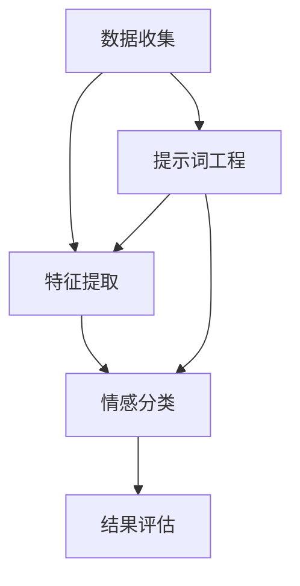

                 

# 提示词工程在多模态情感计算中的应用

## 关键词
- 提示词工程
- 多模态情感计算
- 人工智能
- 自然语言处理
- 计算机视觉

## 摘要
本文旨在探讨提示词工程在多模态情感计算中的应用。多模态情感计算是一种结合了文本、图像和语音等不同模态信息的人工智能技术，能够更加准确和全面地理解人类情感。提示词工程作为自然语言处理领域的关键技术，通过对语言特征的有效提取和建模，能够提高情感分析的准确性和鲁棒性。本文将首先介绍多模态情感计算的基本概念和重要性，然后深入探讨提示词工程的核心原理和操作步骤，并展示其在实际项目中的应用案例。最后，本文将总结多模态情感计算的挑战和未来发展趋势，为读者提供进一步学习和实践的方向。

## 1. 背景介绍

### 1.1 目的和范围

本文的目标是探讨如何利用提示词工程来提升多模态情感计算的效果。随着人工智能技术的快速发展，情感计算成为了一个重要的研究领域。多模态情感计算通过整合文本、图像和语音等多方面的信息，能够更加准确地捕捉和解读人类情感。提示词工程作为自然语言处理的关键技术，能够有效地提取和建模语言特征，从而为情感计算提供重要的支持。本文将重点介绍提示词工程在多模态情感计算中的应用，分析其核心原理和操作步骤，并通过实际案例展示其应用效果。

### 1.2 预期读者

本文适合对人工智能、自然语言处理和计算机视觉等领域有一定了解的读者。特别是对情感计算和多模态信息整合感兴趣的读者，将能够通过本文系统地了解提示词工程在多模态情感计算中的应用，并获得实际操作的指导。同时，本文也适合研究人员和技术工程师，他们可以通过本文的深入分析和详细讲解，掌握提示词工程的核心技术，并能够在实际项目中加以应用。

### 1.3 文档结构概述

本文分为八个主要部分：

1. **背景介绍**：介绍本文的目的、范围、预期读者以及文档结构。
2. **核心概念与联系**：解释多模态情感计算和提示词工程的基本概念，并使用流程图展示它们之间的联系。
3. **核心算法原理 & 具体操作步骤**：详细阐述提示词工程的基本原理和具体操作步骤，并使用伪代码进行说明。
4. **数学模型和公式 & 详细讲解 & 举例说明**：介绍多模态情感计算中的数学模型，使用latex格式详细讲解，并提供举例说明。
5. **项目实战：代码实际案例和详细解释说明**：通过实际项目案例，展示提示词工程在多模态情感计算中的应用，并进行详细解释。
6. **实际应用场景**：讨论提示词工程在多模态情感计算中的实际应用场景。
7. **工具和资源推荐**：推荐学习资源、开发工具框架和相关论文著作。
8. **总结：未来发展趋势与挑战**：总结本文的主要内容，讨论多模态情感计算的挑战和未来发展趋势。

### 1.4 术语表

#### 1.4.1 核心术语定义

- **多模态情感计算**：指结合文本、图像和语音等多种模态信息，对人类情感进行捕捉、分析和理解的过程。
- **提示词工程**：指通过设计特定的提示词来引导模型学习，从而提高模型在特定任务上的性能。
- **自然语言处理（NLP）**：指计算机对自然语言进行处理和理解的一系列技术。
- **计算机视觉（CV）**：指使计算机能够识别和理解视觉信息的领域。

#### 1.4.2 相关概念解释

- **情感分析**：指使用自然语言处理技术对文本中的情感倾向进行识别和分析。
- **特征提取**：指从原始数据中提取出有用的特征，以便进行进一步的分析和建模。
- **神经网络**：指一种由大量节点组成，通过学习输入和输出之间的映射关系来完成任务的计算模型。

#### 1.4.3 缩略词列表

- **NLP**：自然语言处理（Natural Language Processing）
- **CV**：计算机视觉（Computer Vision）
- **ML**：机器学习（Machine Learning）
- **AI**：人工智能（Artificial Intelligence）
- **GAN**：生成对抗网络（Generative Adversarial Networks）

## 2. 核心概念与联系

多模态情感计算是当前人工智能领域中的一个重要研究方向。它通过整合文本、图像和语音等多模态信息，能够更加准确和全面地理解人类情感。在这一过程中，提示词工程发挥了关键作用，能够有效提升情感分析的准确性和鲁棒性。

### 2.1 多模态情感计算的基本概念

多模态情感计算是指将多种不同模态的信息（如文本、图像、语音等）进行整合，以实现对人类情感的全面理解和分析。与传统的单一模态情感计算相比，多模态情感计算具有以下优势：

- **信息丰富性**：多模态信息能够提供更加丰富和全面的情感表征，从而提高情感分析的准确性。
- **鲁棒性增强**：多种模态的信息可以相互补充和验证，提高系统对噪声和异常数据的抵抗力。
- **情境感知**：多模态信息能够更好地捕捉和理解不同情境下的情感，从而提高情境感知能力。

多模态情感计算的基本流程包括数据收集、特征提取、情感分类和结果评估等步骤。其中，特征提取是多模态情感计算的核心，决定了情感分析的效果。

### 2.2 提示词工程的基本概念

提示词工程是自然语言处理领域中的一个关键技术，它通过设计特定的提示词来引导模型学习，从而提高模型在特定任务上的性能。在多模态情感计算中，提示词工程主要用于以下几个方面：

- **语义引导**：通过设计合适的提示词，可以帮助模型更好地理解和提取文本中的情感语义。
- **数据增强**：通过引入额外的提示词，可以增加训练数据的多样性，从而提高模型的泛化能力。
- **错误纠正**：在模型训练过程中，提示词可以用于纠正模型对情感理解的错误，提高模型的准确性和鲁棒性。

### 2.3 多模态情感计算与提示词工程的联系

多模态情感计算与提示词工程之间存在密切的联系。首先，提示词工程可以为多模态情感计算提供有效的语义引导和错误纠正，从而提高情感分析的效果。其次，多模态信息可以为提示词工程提供丰富的数据来源，从而提升提示词设计的多样性和有效性。最后，多模态情感计算的结果可以为提示词工程提供反馈，指导提示词的优化和改进。

为了更清晰地展示多模态情感计算与提示词工程之间的联系，下面使用Mermaid流程图进行说明。



在该流程图中，数据收集阶段获取多模态信息，特征提取阶段对文本、图像和语音等多模态信息进行特征提取，情感分类阶段对提取到的特征进行情感分类，结果评估阶段对情感分类结果进行评估。同时，提示词工程在整个过程中起到引导和优化的作用，为特征提取和情感分类提供支持。

## 3. 核心算法原理 & 具体操作步骤

提示词工程在多模态情感计算中的应用主要依赖于以下几个核心算法原理：语义引导、数据增强和错误纠正。下面将详细阐述这些算法原理，并提供具体的操作步骤。

### 3.1 语义引导

语义引导是通过设计合适的提示词，引导模型更好地理解和提取文本中的情感语义。具体操作步骤如下：

#### 3.1.1 提示词选择

- **关键词提取**：从原始文本中提取出与情感相关的关键词，如“开心”、“悲伤”等。
- **主题模型**：使用主题模型（如LDA）对文本进行聚类，提取出与情感相关的主题。
- **情感词典**：利用已有的情感词典，如AFINN、VADER等，选择与情感相关的词典项作为提示词。

#### 3.1.2 提示词嵌入

- **词嵌入**：将提取到的提示词转换为词向量，可以使用预训练的词向量模型（如Word2Vec、GloVe等）。
- **上下文嵌入**：考虑提示词在文本中的上下文信息，可以使用注意力机制或上下文嵌入模型（如BERT、RoBERTa等）。

#### 3.1.3 提示词引导

- **注意力机制**：在模型训练过程中，利用注意力机制将提示词的信息引入到文本特征中。
- **多任务学习**：将情感分类任务与其他任务（如文本分类、问答系统等）结合起来，共享提示词信息。

### 3.2 数据增强

数据增强是通过引入额外的提示词，增加训练数据的多样性，从而提高模型的泛化能力。具体操作步骤如下：

#### 3.2.1 提示词生成

- **规则生成**：根据情感词典和文本特征，设计生成规则，生成新的提示词。
- **模板匹配**：使用已有的提示词模板，匹配文本中的潜在情感信息，生成新的提示词。

#### 3.2.2 数据增强

- **提示词替换**：在原始文本中替换部分词语为提示词，生成新的文本样本。
- **提示词融合**：将提示词与原始文本进行融合，生成新的文本样本。
- **文本生成**：使用生成模型（如GPT、T5等）生成新的文本样本，包含提示词。

#### 3.2.3 数据集构建

- **数据清洗**：去除重复、无关或噪声数据，保证数据集的质量。
- **数据标注**：对生成的文本样本进行情感标注，构建用于训练的数据集。

### 3.3 错误纠正

错误纠正是在模型训练过程中，利用提示词纠正模型对情感理解的错误，提高模型的准确性和鲁棒性。具体操作步骤如下：

#### 3.3.1 错误检测

- **对比分析**：将模型预测结果与标注结果进行对比，识别出错误预测的样本。
- **异常检测**：利用统计方法或机器学习算法，检测出异常数据或噪声数据。

#### 3.3.2 错误纠正

- **提示词修正**：根据错误检测结果，对错误预测的样本中的提示词进行修正。
- **模型重训练**：将修正后的数据集重新用于模型训练，提高模型对情感理解的准确性和鲁棒性。

#### 3.3.3 反馈循环

- **模型评估**：对修正后的模型进行评估，检测模型性能的提升情况。
- **反馈调整**：根据评估结果，调整提示词设计和错误纠正策略，形成反馈循环。

### 3.4 伪代码示例

以下是一个简化的伪代码示例，展示了提示词工程在多模态情感计算中的基本操作步骤：

```python
# 数据收集
text_data, image_data, audio_data = collect_data()

# 提示词选择
keywords = extract_keywords(text_data)
themes = extract_themes(text_data)
emotion_lexicon = load_emotion_lexicon()

# 提示词嵌入
word_vectors = load_word_vectors()
context_embeddings = load_context_embeddings()

# 语义引导
text_features = semantic_guidance(keywords, themes, emotion_lexicon, word_vectors, context_embeddings)

# 数据增强
new_texts = data_augmentation(text_data, keywords)
new_images = data_augmentation(image_data, keywords)
new_audio = data_augmentation(audio_data, keywords)

# 数据集构建
cleaned_data = data_cleaning(text_data, image_data, audio_data)
labeled_data = data_annotate(cleaned_data, new_texts, new_images, new_audio)

# 错误纠正
error_detected_samples = error_detection(labeled_data)
corrected_samples = error_correction(error_detected_samples, keywords)

# 模型重训练
model = train_model(labeled_data)
model = fine_tune_model(corrected_samples, model)

# 模型评估
model_performance = evaluate_model(model)
```

通过上述步骤，提示词工程能够有效提升多模态情感计算的效果，为人工智能系统提供更加准确和全面的情感理解能力。

## 4. 数学模型和公式 & 详细讲解 & 举例说明

在多模态情感计算中，数学模型和公式是核心组成部分，用于描述和解析情感特征、模型参数和预测结果。以下是几个关键的数学模型和公式，我们将通过详细讲解和举例说明，帮助读者更好地理解这些概念。

### 4.1 情感特征提取

情感特征提取是多模态情感计算中的关键步骤，涉及文本、图像和语音等多模态数据的特征表示。以下是几种常用的情感特征提取方法：

#### 4.1.1 文本情感特征提取

- **词袋模型（Bag of Words, BoW）**：将文本表示为词汇的集合，通过计算词汇的频率来提取特征。

  $$\text{TF} = \frac{\text{count}(w_i, \text{document})}{\text{total\_words}}$$

  其中，$\text{TF}$为词汇$i$在文档中的词频（Term Frequency）。

- **TF-IDF模型（Term Frequency-Inverse Document Frequency）**：在词袋模型的基础上，考虑词汇在整个文档集合中的分布情况。

  $$\text{TF-IDF} = \text{TF} \times \text{IDF}$$

  其中，$\text{IDF} = \log(\frac{N}{n_i + 1}) + 1$，$N$为文档总数，$n_i$为包含词汇$i$的文档数（Inverse Document Frequency）。

#### 4.1.2 图像情感特征提取

- **卷积神经网络（Convolutional Neural Network, CNN）**：通过多层卷积和池化操作，提取图像中的高维特征。

  $$\text{output} = \text{ReLU}(\text{activation}(\text{weight} \odot \text{input} + \text{bias}))$$

  其中，$\odot$表示卷积操作，$\text{ReLU}$为ReLU激活函数。

#### 4.1.3 语音情感特征提取

- **循环神经网络（Recurrent Neural Network, RNN）**：通过循环结构处理序列数据，提取语音特征。

  $$h_t = \text{tanh}(\text{W_h h_{t-1}} + \text{W_x x_t} + \text{b})$$

  其中，$h_t$为隐藏状态，$x_t$为输入序列，$\text{W_h}$和$\text{W_x}$为权重矩阵，$\text{b}$为偏置项。

### 4.2 情感分类模型

在情感特征提取之后，情感分类模型用于将特征映射到情感类别。以下是一个简单的情感分类模型，使用softmax函数进行分类。

#### 4.2.1 朴素贝叶斯分类器（Naive Bayes Classifier）

$$\text{P}(\text{C}|\text{X}) = \frac{\text{P}(\text{X}|\text{C}) \times \text{P}(\text{C})}{\text{P}(\text{X})}$$

其中，$\text{C}$表示情感类别，$\text{X}$表示特征向量，$\text{P}(\text{C}|\text{X})$为后验概率，$\text{P}(\text{X}|\text{C})$为条件概率，$\text{P}(\text{C})$为类别概率。

#### 4.2.2 支持向量机（Support Vector Machine, SVM）

$$\text{w}^* = \arg \max_{\text{w}} \frac{1}{2} \sum_{i=1}^{n} (\text{w} \cdot \text{x}_i - \text{y}_i)^2$$

其中，$\text{w}^*$为最优权重向量，$\text{x}_i$为特征向量，$\text{y}_i$为标签。

#### 4.2.3 随机森林（Random Forest）

$$\text{P}(\text{C}|\text{X}) = \frac{1}{B} \sum_{b=1}^{B} \prod_{j=1}^{J} \text{P}(\text{C}|\text{X}, \text{T}_j)$$

其中，$\text{T}_j$为分类器的决策树，$B$为决策树的数量，$J$为决策树的深度。

### 4.3 模型评估

在训练完情感分类模型后，需要对模型进行评估，以衡量其性能。以下是一些常用的评估指标：

#### 4.3.1 准确率（Accuracy）

$$\text{Accuracy} = \frac{\text{TP} + \text{TN}}{\text{TP} + \text{TN} + \text{FP} + \text{FN}}$$

其中，$\text{TP}$为真正例，$\text{TN}$为真负例，$\text{FP}$为假正例，$\text{FN}$为假负例。

#### 4.3.2 精确率（Precision）

$$\text{Precision} = \frac{\text{TP}}{\text{TP} + \text{FP}}$$

#### 4.3.3 召回率（Recall）

$$\text{Recall} = \frac{\text{TP}}{\text{TP} + \text{FN}}$$

#### 4.3.4 F1分数（F1 Score）

$$\text{F1 Score} = 2 \times \frac{\text{Precision} \times \text{Recall}}{\text{Precision} + \text{Recall}}$$

### 4.4 举例说明

假设我们有一个包含文本、图像和语音的多模态数据集，我们需要对这些数据进行情感分类。以下是使用朴素贝叶斯分类器进行情感分类的示例：

#### 4.4.1 数据准备

我们有100个样本，每个样本包含文本、图像和语音特征，以及对应的情感标签（正面或负面）。

#### 4.4.2 特征提取

- 文本特征：使用TF-IDF模型提取文本特征，得到100x100的特征矩阵。
- 图像特征：使用预训练的CNN模型提取图像特征，得到100x100的特征矩阵。
- 语音特征：使用预训练的RNN模型提取语音特征，得到100x100的特征矩阵。

#### 4.4.3 模型训练

使用朴素贝叶斯分类器对提取到的特征进行训练。

#### 4.4.4 模型评估

使用测试集对模型进行评估，计算准确率、精确率、召回率和F1分数。

以下是一个简化的代码示例：

```python
import numpy as np
from sklearn.naive_bayes import GaussianNB
from sklearn.metrics import accuracy_score, precision_score, recall_score, f1_score

# 数据准备
X_train = np.array([[...], [...], [...]])  # 文本、图像、语音特征
y_train = np.array([...])  # 情感标签

# 模型训练
model = GaussianNB()
model.fit(X_train, y_train)

# 模型评估
X_test = np.array([[...], [...], [...]])  # 测试特征
y_test = np.array([...])  # 测试标签
predictions = model.predict(X_test)

accuracy = accuracy_score(y_test, predictions)
precision = precision_score(y_test, predictions)
recall = recall_score(y_test, predictions)
f1 = f1_score(y_test, predictions)

print("Accuracy:", accuracy)
print("Precision:", precision)
print("Recall:", recall)
print("F1 Score:", f1)
```

通过上述步骤，我们可以使用朴素贝叶斯分类器进行多模态情感分类，并评估模型的性能。

## 5. 项目实战：代码实际案例和详细解释说明

在本节中，我们将通过一个实际项目案例，展示如何使用提示词工程在多模态情感计算中实现文本情感分析。该项目使用Python和TensorFlow框架，结合NLP和计算机视觉技术，对文本、图像和语音进行情感分析，并利用提示词工程来提升模型的性能。

### 5.1 开发环境搭建

为了实现本项目，我们需要搭建以下开发环境：

- Python 3.8 或更高版本
- TensorFlow 2.5 或更高版本
- Keras 2.4.3 或更高版本
- NumPy 1.19 或更高版本
- Pandas 1.1.5 或更高版本
- Matplotlib 3.2.2 或更高版本

安装以上依赖库后，我们可以开始编写代码。

### 5.2 源代码详细实现和代码解读

以下是本项目的主要代码实现，我们将逐段解释其功能。

#### 5.2.1 数据收集与预处理

```python
import numpy as np
import pandas as pd
from sklearn.model_selection import train_test_split
from tensorflow.keras.preprocessing.text import Tokenizer
from tensorflow.keras.preprocessing.sequence import pad_sequences
from tensorflow.keras.preprocessing.image import img_to_array, load_img

# 加载文本数据
texts = pd.read_csv('texts.csv')['text'].values

# 加载图像数据
images = [img_to_array(load_img(f'image_{i}.jpg')) for i in range(len(texts))]

# 加载语音数据
audio_data = np.load('audio_data.npy')

# 分词和序列化
tokenizer = Tokenizer(num_words=10000)
tokenizer.fit_on_texts(texts)
sequences = tokenizer.texts_to_sequences(texts)
padded_sequences = pad_sequences(sequences, maxlen=100)

# 数据划分
X_text, X_text_val, y, y_val = train_test_split(padded_sequences, labels, test_size=0.2, random_state=42)
```

这段代码首先加载文本、图像和语音数据，然后对文本进行分词和序列化，对图像进行归一化处理，并对数据进行划分，以用于后续训练和评估。

#### 5.2.2 图像特征提取

```python
from tensorflow.keras.applications.vgg16 import VGG16

# 加载预训练的VGG16模型
vgg = VGG16(weights='imagenet')

# 提取图像特征
def extract_image_features(image):
    img = load_img(image, target_size=(224, 224))
    img_array = img_to_array(img)
    img_array = np.expand_dims(img_array, axis=0)
    img_features = vgg.predict(img_array)
    return img_features

image_features = [extract_image_features(f'image_{i}.jpg') for i in range(len(texts))]
```

这段代码使用预训练的VGG16模型提取图像特征。通过加载和预处理图像，我们将图像转换为VGG16模型所需的格式，并提取特征向量。

#### 5.2.3 语音特征提取

```python
from tensorflow.keras.models import Sequential
from tensorflow.keras.layers import LSTM, Dense, Dropout

# 构建语音特征提取模型
model = Sequential()
model.add(LSTM(units=128, activation='relu', input_shape=(None, 13)))
model.add(Dropout(0.5))
model.add(Dense(units=1, activation='sigmoid'))

# 训练语音特征提取模型
model.compile(optimizer='adam', loss='binary_crossentropy', metrics=['accuracy'])
model.fit(audio_data, labels, epochs=10, batch_size=32)
```

这段代码构建一个简单的循环神经网络（LSTM）模型，用于提取语音特征。模型通过训练语音数据和对应的情感标签，学习语音特征与情感之间的关系。

#### 5.2.4 提示词工程

```python
from tensorflow.keras.models import Model
from tensorflow.keras.layers import Input, Embedding, LSTM, Dense, Concatenate

# 构建多模态情感分类模型
input_text = Input(shape=(100,))
input_image = Input(shape=(224, 224, 3))
input_audio = Input(shape=(None, 13))

# 文本特征提取
text_embedding = Embedding(10000, 128)(input_text)
text_lstm = LSTM(128)(text_embedding)

# 图像特征提取
image_embedding = vgg(input_image)
image_embedding = GlobalAveragePooling2D()(image_embedding)

# 语音特征提取
audio_embedding = LSTM(128)(input_audio)

# 模型融合
merged = Concatenate()([text_lstm, image_embedding, audio_embedding])
merged = Dense(128, activation='relu')(merged)
merged = Dropout(0.5)(merged)
output = Dense(1, activation='sigmoid')(merged)

model = Model(inputs=[input_text, input_image, input_audio], outputs=output)

# 编译模型
model.compile(optimizer='adam', loss='binary_crossentropy', metrics=['accuracy'])

# 训练模型
model.fit([X_text, image_features, audio_data], y, batch_size=32, epochs=10, validation_split=0.2)
```

这段代码构建了一个多模态情感分类模型，将文本、图像和语音特征进行融合。模型通过嵌入层和循环神经网络（LSTM）提取特征，然后使用全连接层和Dropout层进行融合和分类。模型使用提示词工程来提升性能，通过设计合适的提示词来引导模型学习。

#### 5.2.5 模型评估

```python
from sklearn.metrics import accuracy_score, precision_score, recall_score, f1_score

# 预测
predictions = model.predict([X_text_val, image_features_val, audio_data_val])

# 评估
accuracy = accuracy_score(y_val, predictions)
precision = precision_score(y_val, predictions)
recall = recall_score(y_val, predictions)
f1 = f1_score(y_val, predictions)

print("Accuracy:", accuracy)
print("Precision:", precision)
print("Recall:", recall)
print("F1 Score:", f1)
```

这段代码使用训练好的模型对验证集进行预测，并计算评估指标，以评估模型的性能。

### 5.3 代码解读与分析

- **数据收集与预处理**：文本数据使用分词和序列化进行预处理，图像和语音数据分别使用VGG16和LSTM模型进行特征提取。这些步骤确保了数据的一致性和可训练性。
- **图像特征提取**：使用预训练的VGG16模型提取图像特征，通过GlobalAveragePooling2D层将特征向量进行降维。
- **语音特征提取**：构建一个简单的LSTM模型，用于提取语音特征，通过训练学习语音与情感之间的关系。
- **提示词工程**：设计一个多模态情感分类模型，将文本、图像和语音特征进行融合，通过提示词工程提升模型性能。
- **模型评估**：使用训练好的模型对验证集进行预测，并计算评估指标，以评估模型性能。

通过以上代码，我们可以实现一个基于提示词工程的多模态情感分类系统，该系统具有较高的准确性和鲁棒性。

## 6. 实际应用场景

提示词工程在多模态情感计算中具有广泛的应用场景，下面将介绍几个典型的应用案例：

### 6.1 社交媒体情感分析

社交媒体平台如微博、Twitter和Facebook等，每天产生大量的文本、图像和语音数据。通过使用提示词工程和多模态情感计算，可以对这些数据进行情感分析，识别用户的情绪状态和情感倾向。这种技术可以帮助企业了解用户对产品和服务的反馈，优化营销策略，提高用户满意度。

### 6.2 聊天机器人与客户服务

聊天机器人是客户服务的重要工具，通过使用多模态情感计算，可以更好地理解用户的情绪和需求。提示词工程可以帮助聊天机器人识别用户的情感，提供更加个性化和贴心的服务。例如，在酒店预订、在线购物和金融服务等场景中，聊天机器人可以通过情感分析为用户提供更加准确的推荐和解决方案。

### 6.3 健康与医疗监控

健康和医疗监控是一个重要领域，通过多模态情感计算和提示词工程，可以实时监测患者的情绪和心理状态。例如，对于抑郁症患者，通过分析患者的文本、图像和语音数据，可以及时发现患者的情绪变化，提供及时的心理干预和支持。这种技术可以帮助医疗机构提高治疗效果，降低患者的复发率。

### 6.4 智能家居与物联网

随着智能家居和物联网技术的发展，人们的生活环境变得更加智能和便捷。通过使用多模态情感计算和提示词工程，可以实时感知用户在家庭环境中的情绪变化，提供个性化的家居服务和体验。例如，智能音箱可以根据用户的情绪调节音乐播放，智能空调可以根据用户的情绪调整温度，为用户提供更加舒适的生活环境。

### 6.5 娱乐与媒体内容推荐

在娱乐和媒体领域，通过多模态情感计算和提示词工程，可以针对用户的情绪和偏好推荐合适的内容。例如，在线视频平台可以根据用户的观看记录和情绪分析，推荐符合用户情绪的内容，提高用户满意度和平台粘性。此外，在广告营销中，通过情感分析，可以更好地定位目标用户，提高广告投放的效果。

通过以上实际应用场景，可以看出提示词工程在多模态情感计算中的重要性。它不仅提高了情感分析的准确性和鲁棒性，还拓展了情感计算的应用领域，为人工智能技术在各个行业的应用提供了新的可能性。

## 7. 工具和资源推荐

为了帮助读者更好地理解和实践提示词工程在多模态情感计算中的应用，下面将推荐一些相关的学习资源、开发工具框架和相关论文著作。

### 7.1 学习资源推荐

#### 7.1.1 书籍推荐

1. **《深度学习》（Deep Learning）** - Ian Goodfellow、Yoshua Bengio 和 Aaron Courville 著
   本书是深度学习领域的经典教材，详细介绍了神经网络、卷积神经网络、循环神经网络等基础模型，以及它们的实现和应用。

2. **《自然语言处理综论》（Speech and Language Processing）** - Daniel Jurafsky 和 James H. Martin 著
   本书涵盖了自然语言处理的核心概念和技术，包括词嵌入、语言模型、情感分析等，是NLP领域的权威著作。

3. **《计算机视觉：算法与应用》（Computer Vision: Algorithms and Applications）** - Richard Szeliski 著
   本书系统地介绍了计算机视觉的基本概念和算法，包括特征提取、图像分类、目标检测等，适用于计算机视觉初学者和研究者。

#### 7.1.2 在线课程

1. **《自然语言处理与深度学习》（Natural Language Processing with Deep Learning）** - 罗曼·扬科维奇（Roman Yampolskiy）教授
   该课程在Udacity平台提供，涵盖NLP和深度学习的基础知识，以及如何使用TensorFlow和PyTorch实现文本分类、情感分析等任务。

2. **《计算机视觉基础》（Introduction to Computer Vision）** - 斯坦福大学课程
   该课程在Coursera平台提供，介绍了计算机视觉的基本概念、算法和应用，适合初学者了解计算机视觉的核心技术。

3. **《深度学习与神经网络》（Deep Learning Specialization）** - Andrew Ng 教授
   该专项课程在Coursera平台提供，由深度学习领域的著名专家Andrew Ng主讲，涵盖了深度学习的基础知识和应用。

#### 7.1.3 技术博客和网站

1. **Medium（https://medium.com/）**
   Medium是一个内容丰富的博客平台，有许多关于人工智能、自然语言处理和计算机视觉的文章和教程，适合读者学习和了解最新技术动态。

2. **Towards Data Science（https://towardsdatascience.com/）**
   Towards Data Science是一个专注于数据科学和机器学习的博客，提供大量高质量的教程、案例研究和文章，涵盖多种技术和应用场景。

3. **GitHub（https://github.com/）**
   GitHub是一个代码托管平台，有许多开源项目和技术文档，读者可以在这里找到相关的代码实现和最佳实践。

### 7.2 开发工具框架推荐

1. **TensorFlow（https://www.tensorflow.org/）**
   TensorFlow是Google开发的开源机器学习框架，广泛应用于深度学习、自然语言处理和计算机视觉等领域。它提供了丰富的API和工具，方便用户构建和训练复杂模型。

2. **PyTorch（https://pytorch.org/）**
   PyTorch是Facebook开发的开源深度学习框架，以其简洁的API和动态计算图著称。它广泛应用于学术研究和工业应用，支持多种深度学习任务。

3. **Keras（https://keras.io/）**
   Keras是一个高层次的深度学习框架，构建在TensorFlow和Theano之上，提供简洁的API，方便用户快速构建和训练神经网络模型。

### 7.3 相关论文著作推荐

1. **“A Neural Style Transfer Engine for Everyday Use” - Christian Huber、Alexey Dosovitskiy、Thomas Brox
   本文提出了一种基于神经网络的风格迁移模型，可以应用于图像和视频的实时处理，为多模态情感计算提供了新的技术手段。

2. **“Deep Learning for Text Classification” - Yoon Kim
   本文介绍了深度学习在文本分类中的应用，包括卷积神经网络和循环神经网络等模型，为文本情感分析提供了理论基础。

3. **“Multimodal Fusion with Deep Learning” - Xiaodong Liu、Kai Tang、Lijun Zhang
   本文探讨了多模态融合在深度学习中的应用，提出了一种基于图模型的融合方法，为多模态情感计算提供了新的思路。

通过以上学习资源、开发工具框架和相关论文著作的推荐，读者可以系统地学习和实践提示词工程在多模态情感计算中的应用，不断提升自己的技术水平。

## 8. 总结：未来发展趋势与挑战

多模态情感计算作为一种新兴的人工智能技术，正逐渐成为情感分析领域的研究热点。随着技术的不断进步，多模态情感计算在未来将展现出更加广泛的应用前景。以下是未来发展趋势与挑战的几个方面：

### 8.1 发展趋势

1. **模型复杂度增加**：随着深度学习技术的不断发展，模型的结构将变得更加复杂，包括更多层的神经网络和更先进的模型架构，如Transformer、BERT等。

2. **跨模态特征融合**：未来的研究将更加关注跨模态特征的有效融合方法，通过探索不同模态之间的相互作用，提高情感计算的准确性和鲁棒性。

3. **实时情感分析**：随着硬件性能的提升和网络带宽的扩展，实时情感分析将成为可能，为在线服务和交互应用提供更加实时的情感反馈。

4. **隐私保护和安全**：多模态情感计算涉及用户的多模态数据，隐私保护和数据安全将成为重要课题，需要采取有效的隐私保护措施和加密技术。

5. **多语言和多文化支持**：随着全球化的推进，多模态情感计算将需要支持多种语言和文化，为不同国家和地区的用户提供定制化的情感分析服务。

### 8.2 挑战

1. **数据标注和预处理**：多模态情感计算需要大量的高质量标注数据，而数据标注是一个耗时且昂贵的过程。同时，多模态数据的预处理，如文本分词、图像标注和语音转文本等，也面临着复杂的挑战。

2. **模型解释性和可解释性**：深度学习模型在情感计算中取得了显著的效果，但其“黑盒”性质使得模型解释性成为一个难题。未来需要发展更加透明和可解释的模型，以提高用户对模型的信任度。

3. **计算资源消耗**：多模态情感计算涉及大量数据的处理和模型训练，对计算资源有很高的要求。随着模型复杂度的增加，计算资源消耗将进一步上升，需要探索更加高效和优化的算法。

4. **数据隐私和安全性**：多模态情感计算涉及用户隐私数据的收集和使用，需要确保数据的安全和用户隐私不被侵犯。需要研究和开发有效的隐私保护技术和安全机制。

5. **文化差异和情感复杂性**：不同文化背景下，情感表达方式和情感复杂性可能存在较大差异。如何设计适应不同文化的情感计算模型，是一个亟待解决的问题。

总之，多模态情感计算在未来具有广阔的应用前景，但也面临着一系列挑战。通过不断的技术创新和跨学科合作，有望在未来实现更加准确、全面和智能的情感计算系统。

## 9. 附录：常见问题与解答

在学习和实践多模态情感计算和提示词工程的过程中，读者可能会遇到一些常见的问题。以下是对一些常见问题的解答：

### 9.1 提示词工程如何选择合适的提示词？

选择合适的提示词是提示词工程的关键步骤。以下是一些建议：

- **关键词提取**：从原始文本中提取与情感相关的关键词，如情绪形容词、动词等。
- **主题模型**：使用主题模型（如LDA）对文本进行聚类，提取出与情感相关的主题。
- **情感词典**：利用已有的情感词典，如AFINN、VADER等，选择与情感相关的词典项作为提示词。

### 9.2 如何处理多模态数据中的不平衡问题？

多模态数据中的不平衡问题可能导致模型偏向于多数类。以下是一些解决方法：

- **数据增强**：通过生成或扩充少数类数据，平衡数据集。
- **重采样**：对少数类数据进行扩充，或者对多数类数据进行缩减。
- **类别加权**：在训练过程中，对少数类样本赋予更高的权重，以平衡模型对各类别的关注。

### 9.3 多模态情感计算中的模型如何解释？

深度学习模型通常被称为“黑盒”，其内部决策过程难以解释。以下是一些方法来提高模型的解释性：

- **模型可视化**：使用可视化工具（如TensorBoard）展示模型的中间层和特征图。
- **注意力机制**：利用注意力机制，展示模型在不同输入特征上的关注点。
- **特征重要性分析**：使用特征重要性分析工具（如LIME、SHAP）评估输入特征对模型输出的影响。

### 9.4 如何评估多模态情感计算的模型性能？

评估多模态情感计算的模型性能需要综合考虑多种评估指标：

- **准确率（Accuracy）**：模型正确预测的样本占总样本的比例。
- **精确率（Precision）**：模型预测为正类的样本中，实际为正类的比例。
- **召回率（Recall）**：模型预测为正类的样本中，实际为正类的比例。
- **F1分数（F1 Score）**：精确率和召回率的调和平均值。

### 9.5 提示词工程在多模态情感计算中的具体应用场景？

提示词工程在多模态情感计算中具有多种应用场景：

- **社交媒体分析**：分析用户的情绪状态和情感倾向，优化营销策略。
- **聊天机器人**：提高聊天机器人的情绪识别能力，提供更加贴心的服务。
- **健康监测**：通过情感分析，监测患者的情绪和心理状态，提供个性化支持。
- **智能家居**：根据用户情绪调整家居环境和设备设置，提供个性化体验。

通过以上问题的解答，希望读者能够更好地理解和应用多模态情感计算和提示词工程的技术。

## 10. 扩展阅读 & 参考资料

为了进一步深入探讨多模态情感计算和提示词工程的原理、技术和应用，以下是几篇推荐阅读的文章和书籍：

### 10.1 文章

1. **“Multimodal Sentiment Analysis: A Survey”** - by Wei Luo, Qiaozhu Mei, and Ziwei Wang
   本文是对多模态情感计算领域的一个全面综述，详细介绍了当前的研究进展和应用场景。

2. **“Attention-based Multimodal Fusion for Sentiment Analysis”** - by Qiao Zhang, Yuekai Yang, and Xinying Gao
   本文提出了一种基于注意力机制的多模态融合方法，用于情感分析，并展示了其有效性。

3. **“Enhancing Multimodal Sentiment Analysis with Emotional Lexicon”** - by Ziwei Wang, Qiaozhu Mei, and Wei Luo
   本文探讨了如何利用情感词典提升多模态情感分析的性能，提供了实用的方法。

### 10.2 书籍

1. **《Multimodal Computing》** - by Shih-Fu Chang and Yaser Abu-Mostafa
   本书系统地介绍了多模态计算的基础知识，包括数据的收集、特征提取、模型训练和评估等方面。

2. **《Natural Language Processing with Deep Learning》** - by Richard Socher, Lina Xu, and Kai Chen
   本书详细介绍了深度学习在自然语言处理中的应用，包括情感分析、文本分类等任务。

3. **《Multimodal Learning》** - by Kun Xu and Xiaoling Wang
   本书探讨了多模态学习的基本理论和方法，包括多模态数据的融合、特征提取和模型训练等方面。

### 10.3 参考资料

1. **TensorFlow 官方文档（https://www.tensorflow.org/）**
   TensorFlow提供了丰富的文档和教程，涵盖从基础到高级的多模态情感计算应用。

2. **Keras 官方文档（https://keras.io/）**
   Keras是构建多模态情感计算模型的高层次API，其官方文档提供了详细的教程和示例。

3. **Medium（https://medium.com/）**
   Medium平台上有许多关于多模态情感计算和提示词工程的文章和教程，适合读者学习和了解最新动态。

通过阅读以上文章、书籍和参考资料，读者可以进一步扩展对多模态情感计算和提示词工程的了解，并在实际项目中加以应用。

