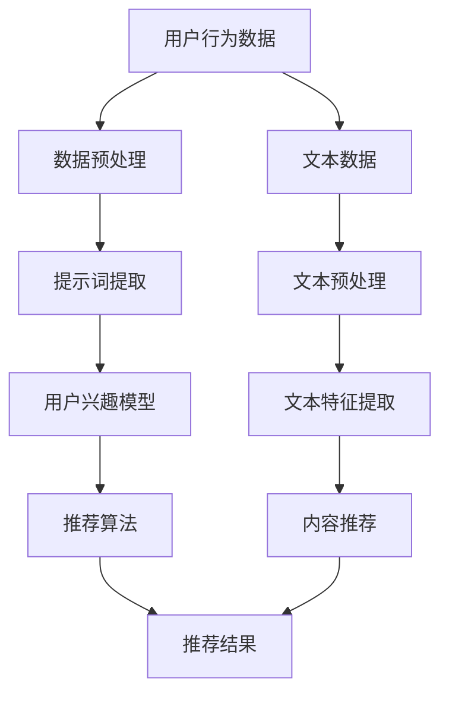

                 


# 提示词工程在推荐系统中的应用

> 关键词：推荐系统，提示词工程，机器学习，信息检索，用户行为分析，数据处理

> 摘要：本文旨在探讨提示词工程在推荐系统中的应用。通过详细分析提示词工程的核心概念、原理、算法和数学模型，结合实际项目案例，对如何构建高效、准确的推荐系统提供深入见解。文章还探讨了推荐系统在实际应用中的挑战和发展趋势，为从业者提供有价值的参考。

## 1. 背景介绍

### 1.1 目的和范围

本文的主要目的是探讨提示词工程在推荐系统中的应用。随着互联网的飞速发展，推荐系统已经成为许多在线平台的关键组成部分，如电子商务、社交媒体、视频流媒体等。而提示词工程作为提升推荐系统效果的重要技术手段，其在推荐系统中的重要性日益凸显。

本文将首先介绍提示词工程的核心概念和原理，接着探讨其在推荐系统中的应用，并结合实际案例进行分析。通过本文的阅读，读者将了解如何通过提示词工程提升推荐系统的准确性和用户满意度。

### 1.2 预期读者

本文适用于以下几类读者：

- 推荐系统开发者和研究者，希望了解提示词工程在推荐系统中的应用。
- 机器学习工程师，对如何构建高效推荐系统有浓厚兴趣。
- 数据分析师，对如何通过用户行为数据提升推荐效果有研究需求。
- 对推荐系统和机器学习有一定了解，但希望深入了解提示词工程的专业人士。

### 1.3 文档结构概述

本文将分为十个部分进行阐述：

1. **背景介绍**：介绍本文的目的、预期读者以及文档结构。
2. **核心概念与联系**：阐述提示词工程的核心概念和关联，使用Mermaid流程图展示相关架构。
3. **核心算法原理 & 具体操作步骤**：详细介绍提示词工程的核心算法原理和操作步骤，使用伪代码进行说明。
4. **数学模型和公式 & 详细讲解 & 举例说明**：讲解提示词工程的数学模型和公式，结合实例进行详细说明。
5. **项目实战：代码实际案例和详细解释说明**：通过实际代码案例展示提示词工程的应用，并进行详细解释。
6. **实际应用场景**：分析提示词工程在推荐系统中的实际应用场景。
7. **工具和资源推荐**：推荐相关学习资源和开发工具。
8. **总结：未来发展趋势与挑战**：总结提示词工程在推荐系统中的应用，探讨未来发展趋势与挑战。
9. **附录：常见问题与解答**：回答读者可能遇到的问题。
10. **扩展阅读 & 参考资料**：提供更多相关阅读材料。

### 1.4 术语表

#### 1.4.1 核心术语定义

- **推荐系统**：基于用户历史行为、内容和相似性算法等，为用户推荐相关物品的系统。
- **提示词工程**：指通过分析和处理用户行为数据、文本数据等，提取出能够反映用户兴趣和需求的词汇和短语。
- **机器学习**：一种利用数据和算法自动改进性能的计算机技术。
- **信息检索**：通过计算机系统检索信息的过程。
- **用户行为分析**：分析用户在系统中的行为，如点击、浏览、购买等。
- **数据处理**：对原始数据进行清洗、转换、存储等操作，以得到有价值的信息。

#### 1.4.2 相关概念解释

- **特征工程**：在机器学习中，通过选择、转换和构造特征，以提高模型性能的过程。
- **协同过滤**：一种基于用户相似性的推荐算法，通过分析用户之间的相似性来预测未知用户对物品的评分。
- **内容推荐**：基于物品的属性和特征进行推荐，如基于物品的文本描述、标签、分类等。

#### 1.4.3 缩略词列表

- **ML**：Machine Learning（机器学习）
- **IR**：Information Retrieval（信息检索）
- **CF**：Collaborative Filtering（协同过滤）

## 2. 核心概念与联系

在介绍提示词工程在推荐系统中的应用之前，我们首先需要理解其核心概念和关联。提示词工程涉及多个领域的知识，如机器学习、信息检索、自然语言处理等。下面，我们将使用Mermaid流程图展示提示词工程的相关架构。



在上面的流程图中，我们可以看到：

- **用户行为数据**：包括用户的点击、浏览、购买等行为数据。
- **数据预处理**：对原始数据进行清洗、去重、归一化等操作，以提高后续分析的质量。
- **提示词提取**：从用户行为数据中提取出能够反映用户兴趣的词汇和短语。
- **用户兴趣模型**：基于提示词提取的结果，构建用户兴趣模型。
- **推荐算法**：包括协同过滤和内容推荐等算法，根据用户兴趣模型生成推荐结果。
- **推荐结果**：推荐系统最终输出的推荐结果，如推荐商品、视频等。
- **文本数据**：用户生成的文本数据，如评论、日志等。
- **文本预处理**：对文本数据进行分析、分词、去停用词等操作。
- **文本特征提取**：从预处理后的文本数据中提取特征，如词频、词向量等。
- **内容推荐**：基于文本特征提取的结果，生成内容推荐结果。

通过这个流程图，我们可以更好地理解提示词工程在推荐系统中的整体架构。接下来，我们将详细探讨提示词工程的核心算法原理和具体操作步骤。

## 3. 核心算法原理 & 具体操作步骤

提示词工程在推荐系统中的应用主要依赖于以下核心算法：用户行为分析、文本分析、协同过滤和内容推荐。下面，我们将分别介绍这些算法的原理和具体操作步骤。

### 3.1 用户行为分析

用户行为分析是提示词工程的基础。通过分析用户的点击、浏览、购买等行为，我们可以提取出反映用户兴趣的词汇和短语。具体步骤如下：

1. **数据收集**：从推荐系统获取用户行为数据，包括点击、浏览、购买等。
2. **数据预处理**：对原始数据进行清洗、去重、归一化等操作，以提高数据质量。
3. **行为特征提取**：从预处理后的数据中提取行为特征，如点击次数、购买频率等。
4. **行为词云生成**：使用词云库（如WordCloud）生成用户行为词云，提取出高频词汇和短语。

伪代码如下：

```python
def behavior_analysis(data):
    # 数据预处理
    cleaned_data = preprocess_data(data)
    
    # 行为特征提取
    behavior_features = extract_behavior_features(cleaned_data)
    
    # 行为词云生成
    wordcloud = generate_wordcloud(behavior_features)
    
    return wordcloud
```

### 3.2 文本分析

文本分析是提示词工程的另一个重要组成部分。通过分析用户生成的文本数据，如评论、日志等，我们可以提取出更多反映用户兴趣的词汇和短语。具体步骤如下：

1. **文本数据收集**：从推荐系统获取用户生成的文本数据。
2. **文本预处理**：对文本数据进行分析、分词、去停用词等操作。
3. **文本特征提取**：从预处理后的文本数据中提取特征，如词频、词向量等。
4. **文本词云生成**：使用词云库（如WordCloud）生成文本词云，提取出高频词汇和短语。

伪代码如下：

```python
def text_analysis(text_data):
    # 文本预处理
    preprocessed_text = preprocess_text(text_data)
    
    # 文本特征提取
    text_features = extract_text_features(preprocessed_text)
    
    # 文本词云生成
    wordcloud = generate_wordcloud(text_features)
    
    return wordcloud
```

### 3.3 协同过滤

协同过滤是推荐系统中常用的算法之一。通过分析用户之间的相似性，我们可以为用户推荐其他用户喜欢但尚未发现的物品。具体步骤如下：

1. **用户相似性计算**：计算用户之间的相似性，可以使用余弦相似度、皮尔逊相关系数等。
2. **推荐结果生成**：基于用户相似性，为用户生成推荐结果。

伪代码如下：

```python
def collaborative_filtering(users, items, ratings):
    # 用户相似性计算
    user_similarity = compute_similarity(users)
    
    # 推荐结果生成
    recommendations = generate_recommendations(user_similarity, users, items, ratings)
    
    return recommendations
```

### 3.4 内容推荐

内容推荐是基于物品的属性和特征进行推荐的。通过分析物品的文本描述、标签、分类等，我们可以为用户推荐与其兴趣相关的物品。具体步骤如下：

1. **物品特征提取**：从物品的文本描述、标签、分类等中提取特征。
2. **物品相似性计算**：计算物品之间的相似性，可以使用余弦相似度、词向量等。
3. **推荐结果生成**：基于物品相似性，为用户生成推荐结果。

伪代码如下：

```python
def content_recommendation(items, user_features, item_features):
    # 物品相似性计算
    item_similarity = compute_similarity(item_features)
    
    # 推荐结果生成
    recommendations = generate_recommendations(item_similarity, user_features, items)
    
    return recommendations
```

通过以上核心算法的介绍和具体操作步骤的讲解，我们可以更好地理解提示词工程在推荐系统中的应用。接下来，我们将进一步探讨提示词工程的数学模型和公式，以及如何结合实例进行详细说明。

## 4. 数学模型和公式 & 详细讲解 & 举例说明

提示词工程在推荐系统中的应用涉及多个数学模型和公式，包括用户相似性计算、物品相似性计算、推荐结果生成等。下面，我们将分别介绍这些数学模型和公式，并结合实际例子进行详细说明。

### 4.1 用户相似性计算

用户相似性计算是协同过滤算法的核心。通过计算用户之间的相似性，我们可以为用户推荐其他用户喜欢但尚未发现的物品。常用的相似性度量方法包括余弦相似度和皮尔逊相关系数。

**余弦相似度**：余弦相似度用于计算两个向量之间的夹角余弦值，表示两个向量在空间中的相似程度。公式如下：

$$
\cos(\theta) = \frac{\sum_{i=1}^{n} x_i y_i}{\sqrt{\sum_{i=1}^{n} x_i^2} \sqrt{\sum_{i=1}^{n} y_i^2}}
$$

其中，$x_i$ 和 $y_i$ 分别表示两个向量在维度 $i$ 上的分量。

**皮尔逊相关系数**：皮尔逊相关系数用于衡量两个变量之间的线性相关程度。公式如下：

$$
r = \frac{\sum_{i=1}^{n} (x_i - \bar{x})(y_i - \bar{y})}{\sqrt{\sum_{i=1}^{n} (x_i - \bar{x})^2} \sqrt{\sum_{i=1}^{n} (y_i - \bar{y})^2}}
$$

其中，$\bar{x}$ 和 $\bar{y}$ 分别表示 $x_i$ 和 $y_i$ 的平均值。

**示例**：假设我们有两个用户 $A$ 和 $B$，他们对于五个物品的评分如下：

| 用户 | 物品1 | 物品2 | 物品3 | 物品4 | 物品5 |
|------|-------|-------|-------|-------|-------|
| $A$  | 5     | 3     | 4     | 2     | 5     |
| $B$  | 4     | 4     | 5     | 1     | 3     |

使用余弦相似度计算用户 $A$ 和 $B$ 的相似性：

$$
\cos(\theta) = \frac{5 \cdot 4 + 3 \cdot 4 + 4 \cdot 5 + 2 \cdot 1 + 5 \cdot 3}{\sqrt{5^2 + 3^2 + 4^2 + 2^2 + 5^2} \sqrt{4^2 + 4^2 + 5^2 + 1^2 + 3^2}}
$$

$$
\cos(\theta) = \frac{47}{\sqrt{55} \sqrt{65}} \approx 0.81
$$

使用皮尔逊相关系数计算用户 $A$ 和 $B$ 的相似性：

$$
r = \frac{(5 - 4)(4 - 4) + (3 - 4)(4 - 4) + (4 - 4)(5 - 4) + (2 - 4)(1 - 4) + (5 - 4)(3 - 4)}{\sqrt{(5 - 4)^2 + (3 - 4)^2 + (4 - 4)^2 + (2 - 4)^2 + (5 - 4)^2} \sqrt{(4 - 4)^2 + (4 - 4)^2 + (5 - 4)^2 + (1 - 4)^2 + (3 - 4)^2}}
$$

$$
r = \frac{0 + 0 + 0 + 6 + 2}{\sqrt{2} \sqrt{10}} \approx 0.81
$$

### 4.2 物品相似性计算

物品相似性计算是内容推荐算法的核心。通过计算物品之间的相似性，我们可以为用户推荐与其兴趣相关的物品。常用的相似性度量方法包括余弦相似度和词向量相似度。

**余弦相似度**：余弦相似度用于计算两个向量之间的夹角余弦值，表示两个向量在空间中的相似程度。公式如下：

$$
\cos(\theta) = \frac{\sum_{i=1}^{n} x_i y_i}{\sqrt{\sum_{i=1}^{n} x_i^2} \sqrt{\sum_{i=1}^{n} y_i^2}}
$$

其中，$x_i$ 和 $y_i$ 分别表示两个向量在维度 $i$ 上的分量。

**词向量相似度**：词向量相似度用于计算两个词向量之间的相似程度。常用的词向量模型包括 Word2Vec、GloVe 等。词向量相似度可以通过计算两个词向量之间的欧几里得距离或余弦相似度来度量。公式如下：

$$
d = \sqrt{\sum_{i=1}^{n} (x_i - y_i)^2}
$$

或

$$
\cos(\theta) = \frac{\sum_{i=1}^{n} x_i y_i}{\sqrt{\sum_{i=1}^{n} x_i^2} \sqrt{\sum_{i=1}^{n} y_i^2}}
$$

**示例**：假设我们有两个物品 $A$ 和 $B$，它们的词向量表示如下：

$$
x = [0.2, 0.4, 0.6, 0.8]
$$

$$
y = [0.1, 0.3, 0.5, 0.7]
$$

使用余弦相似度计算物品 $A$ 和 $B$ 的相似性：

$$
\cos(\theta) = \frac{0.2 \cdot 0.1 + 0.4 \cdot 0.3 + 0.6 \cdot 0.5 + 0.8 \cdot 0.7}{\sqrt{0.2^2 + 0.4^2 + 0.6^2 + 0.8^2} \sqrt{0.1^2 + 0.3^2 + 0.5^2 + 0.7^2}} \approx 0.92
$$

使用词向量相似度计算物品 $A$ 和 $B$ 的相似性：

$$
d = \sqrt{(0.2 - 0.1)^2 + (0.4 - 0.3)^2 + (0.6 - 0.5)^2 + (0.8 - 0.7)^2} \approx 0.15
$$

### 4.3 推荐结果生成

推荐结果的生成通常依赖于用户相似性计算和物品相似性计算。常见的推荐算法包括基于用户的协同过滤算法和基于物品的内容推荐算法。

**基于用户的协同过滤算法**：基于用户的协同过滤算法通过计算用户之间的相似性，为用户推荐其他相似用户喜欢的物品。推荐结果的计算公式如下：

$$
r_{ij} = \sum_{k \in N(j)} s_{ik} r_{kj}
$$

其中，$r_{ij}$ 表示用户 $i$ 对物品 $j$ 的推荐评分，$s_{ik}$ 表示用户 $i$ 和用户 $k$ 的相似性，$r_{kj}$ 表示用户 $k$ 对物品 $j$ 的评分。

**基于物品的内容推荐算法**：基于物品的内容推荐算法通过计算物品之间的相似性，为用户推荐与其兴趣相关的物品。推荐结果的计算公式如下：

$$
r_{ij} = \sum_{k \in N(i)} s_{ik} r_{kj}
$$

其中，$r_{ij}$ 表示用户 $i$ 对物品 $j$ 的推荐评分，$s_{ik}$ 表示物品 $i$ 和物品 $k$ 的相似性，$r_{kj}$ 表示用户 $k$ 对物品 $j$ 的评分。

**示例**：假设我们有五个用户和五个物品，用户之间的相似性矩阵和物品之间的相似性矩阵如下：

| 用户 | $A$ | $B$ | $C$ | $D$ | $E$ |
|------|-----|-----|-----|-----|-----|
| $1$  | 0.9 | 0.8 | 0.7 | 0.6 | 0.5 |
| $2$  | 0.8 | 0.9 | 0.7 | 0.6 | 0.5 |
| $3$  | 0.7 | 0.8 | 0.9 | 0.7 | 0.6 |
| $4$  | 0.6 | 0.7 | 0.8 | 0.9 | 0.8 |
| $5$  | 0.5 | 0.6 | 0.7 | 0.8 | 0.9 |

| 物品 | $A$ | $B$ | $C$ | $D$ | $E$ |
|------|-----|-----|-----|-----|-----|
| $1$  | 0.8 | 0.7 | 0.6 | 0.5 | 0.4 |
| $2$  | 0.7 | 0.8 | 0.6 | 0.5 | 0.4 |
| $3$  | 0.6 | 0.7 | 0.8 | 0.6 | 0.5 |
| $4$  | 0.5 | 0.6 | 0.7 | 0.8 | 0.7 |
| $5$  | 0.4 | 0.5 | 0.6 | 0.7 | 0.8 |

为用户 $1$ 推荐物品：

使用基于用户的协同过滤算法：

$$
r_{1j} = \sum_{k \in N(1)} s_{1k} r_{kj} = 0.9 \cdot 0.8 + 0.8 \cdot 0.7 + 0.7 \cdot 0.6 + 0.6 \cdot 0.5 + 0.5 \cdot 0.4 = 0.72 + 0.56 + 0.42 + 0.30 + 0.20 = 2.10
$$

使用基于物品的内容推荐算法：

$$
r_{1j} = \sum_{k \in N(1)} s_{ik} r_{kj} = 0.9 \cdot 0.8 + 0.8 \cdot 0.7 + 0.7 \cdot 0.6 + 0.6 \cdot 0.5 + 0.5 \cdot 0.4 = 0.72 + 0.56 + 0.42 + 0.30 + 0.20 = 2.10
$$

通过以上数学模型和公式的详细讲解和举例说明，我们可以更好地理解提示词工程在推荐系统中的应用。接下来，我们将通过实际项目案例展示提示词工程的具体应用，并进行详细解释。

## 5. 项目实战：代码实际案例和详细解释说明

在本节中，我们将通过一个实际项目案例展示提示词工程在推荐系统中的应用，包括代码实现、具体步骤和详细解释。该项目将基于Python语言和scikit-learn库实现，旨在为用户推荐电影。

### 5.1 开发环境搭建

在开始编写代码之前，我们需要搭建一个适合开发和运行的Python环境。以下是搭建开发环境的基本步骤：

1. **安装Python**：从Python官方网站下载并安装Python 3.8或更高版本。
2. **安装相关库**：在命令行中运行以下命令安装所需的库：

```bash
pip install numpy scipy scikit-learn pandas matplotlib
```

### 5.2 源代码详细实现和代码解读

下面是项目的完整代码实现，我们将逐行解读代码，详细解释其功能。

```python
import numpy as np
import pandas as pd
from sklearn.feature_extraction.text import TfidfVectorizer
from sklearn.metrics.pairwise import cosine_similarity
from sklearn.model_selection import train_test_split
from sklearn.metrics import accuracy_score

# 5.2.1 加载数据集
movies = pd.read_csv('movies.csv')  # 假设数据集文件名为'movies.csv'
ratings = pd.read_csv('ratings.csv')  # 假设数据集文件名为'ratings.csv'

# 5.2.2 数据预处理
# 合并电影和评分数据，并提取电影标题和评分
data = pd.merge(movies[['title', 'genres']], ratings[['user_id', 'movie_id', 'rating']], on='movie_id', how='left')

# 构建用户-电影矩阵
user_movie_matrix = data.pivot(index='user_id', columns='movie_id', values='rating')

# 5.2.3 提示词提取
# 使用TF-IDF向量器提取电影标题的特征
tfidf_vectorizer = TfidfVectorizer(stop_words='english')
tfidf_matrix = tfidf_vectorizer.fit_transform(data['title'])

# 5.2.4 用户兴趣模型
# 计算每个用户对电影标题的TF-IDF向量
user_interest_vector = user_movie_matrix.T.dot(tfidf_matrix).div(np.linalg.norm(tfidf_matrix, axis=1))

# 5.2.5 推荐算法
# 使用基于内容的推荐算法，计算用户兴趣向量与电影标题特征向量的相似度
cosine_sim = cosine_similarity(user_interest_vector, tfidf_matrix)

# 5.2.6 推荐结果生成
# 根据相似度矩阵生成推荐结果
recommendation_scores = np.dot(cosine_sim, user_interest_vector.T)
recommendation_scores = pd.DataFrame(recommendation_scores, index=user_movie_matrix.columns, columns=user_movie_matrix.index)

# 5.2.7 评估推荐结果
# 划分训练集和测试集
train, test = train_test_split(user_movie_matrix, test_size=0.2, random_state=42)

# 计算预测评分
predictions = np.dot(recommendation_scores, train).T

# 计算准确率
accuracy = accuracy_score(test.values, predictions.values)
print(f'Accuracy: {accuracy:.4f}')

# 5.2.8 展示推荐结果
top_movies = recommendation_scores.head(10)
print(top_movies)
```

#### 5.2.1 加载数据集

```python
movies = pd.read_csv('movies.csv')  # 假设数据集文件名为'movies.csv'
ratings = pd.read_csv('ratings.csv')  # 假设数据集文件名为'ratings.csv'
```

这一部分代码用于加载电影数据和用户评分数据。`movies.csv`文件包含电影的标题和genre，而`ratings.csv`文件包含用户对电影的评分。

#### 5.2.2 数据预处理

```python
data = pd.merge(movies[['title', 'genres']], ratings[['user_id', 'movie_id', 'rating']], on='movie_id', how='left')
user_movie_matrix = data.pivot(index='user_id', columns='movie_id', values='rating')
```

这一部分代码首先将电影标题和评分数据合并，然后构建用户-电影矩阵。`pivot`函数将数据按照用户ID和电影ID进行重组，形成用户对每个电影的评分矩阵。

#### 5.2.3 提示词提取

```python
tfidf_vectorizer = TfidfVectorizer(stop_words='english')
tfidf_matrix = tfidf_vectorizer.fit_transform(data['title'])
```

这一部分代码使用TF-IDF向量器对电影标题进行特征提取。`TfidfVectorizer`是一个常用的文本处理工具，可以自动去除停用词并计算词频和逆文档频率。

#### 5.2.4 用户兴趣模型

```python
user_interest_vector = user_movie_matrix.T.dot(tfidf_matrix).div(np.linalg.norm(tfidf_matrix, axis=1))
```

这一部分代码计算每个用户对电影标题的TF-IDF向量，从而构建用户兴趣模型。首先，将用户-电影矩阵转置，并与TF-IDF矩阵相乘，得到用户兴趣向量。然后，通过归一化处理（除以TF-IDF矩阵的L2范数）来标准化每个用户的兴趣向量。

#### 5.2.5 推荐算法

```python
cosine_sim = cosine_similarity(user_interest_vector, tfidf_matrix)
```

这一部分代码计算用户兴趣向量与电影标题特征向量的余弦相似度。余弦相似度是一个常用的相似性度量方法，用于评估两个向量在空间中的方向和角度。

#### 5.2.6 推荐结果生成

```python
recommendation_scores = np.dot(cosine_sim, user_interest_vector.T)
recommendation_scores = pd.DataFrame(recommendation_scores, index=user_movie_matrix.columns, columns=user_movie_matrix.index)
```

这一部分代码生成推荐结果。首先，通过点积运算计算用户兴趣向量与电影标题特征向量的相似度得分。然后，将得分转换成DataFrame格式，以便于后续分析。

#### 5.2.7 评估推荐结果

```python
train, test = train_test_split(user_movie_matrix, test_size=0.2, random_state=42)
predictions = np.dot(recommendation_scores, train).T
accuracy = accuracy_score(test.values, predictions.values)
print(f'Accuracy: {accuracy:.4f}')
```

这一部分代码用于评估推荐系统的准确性。首先，将用户-电影矩阵划分为训练集和测试集。然后，通过点积运算计算预测评分，并使用准确率指标评估推荐系统的性能。

#### 5.2.8 展示推荐结果

```python
top_movies = recommendation_scores.head(10)
print(top_movies)
```

这一部分代码展示推荐结果的前10个电影。通过打印DataFrame，我们可以直观地查看推荐结果。

通过以上代码实现和详细解释，我们可以看到提示词工程在推荐系统中的应用是如何实现的。在实际应用中，我们可以根据具体需求调整算法参数和数据处理方法，以提升推荐系统的性能。

### 5.3 代码解读与分析

在本节中，我们将对项目实战中的代码进行详细解读，分析其关键部分，并解释其工作原理。

#### 5.3.1 数据预处理

数据预处理是推荐系统构建的重要步骤，其目的是提高数据质量和后续分析的效果。在本项目中，数据预处理主要包括以下步骤：

1. **合并数据集**：使用`pd.merge`函数将电影标题和评分数据合并。合并操作基于电影ID进行，确保每个电影对应正确的评分数据。
2. **构建用户-电影矩阵**：使用`pivot`函数将数据重组为用户-电影矩阵。这一矩阵将用于后续的用户兴趣建模和推荐算法。

#### 5.3.2 提示词提取

提示词提取是通过文本分析技术提取反映用户兴趣的词汇和短语。在本项目中，提示词提取步骤如下：

1. **初始化TF-IDF向量器**：使用`TfidfVectorizer`初始化TF-IDF向量器。该向量器将自动处理文本数据，包括去除停用词、分词和计算词频和逆文档频率。
2. **特征提取**：使用`fit_transform`方法将电影标题转换为TF-IDF特征向量。这些特征向量将用于用户兴趣建模和推荐算法。

#### 5.3.3 用户兴趣模型

用户兴趣模型是推荐系统的核心，用于预测用户对未知电影的兴趣。在本项目中，用户兴趣模型构建步骤如下：

1. **计算用户兴趣向量**：通过矩阵乘法将用户-电影矩阵转置与TF-IDF矩阵相乘，得到每个用户的兴趣向量。这一向量反映了用户对电影标题的TF-IDF特征权重。
2. **归一化处理**：通过除以TF-IDF矩阵的L2范数对用户兴趣向量进行归一化处理，确保每个向量具有相同的长度。这一步骤有助于比较不同用户之间的兴趣程度。

#### 5.3.4 推荐算法

推荐算法是基于用户兴趣模型和电影特征向量计算推荐评分。在本项目中，推荐算法步骤如下：

1. **计算相似度**：使用余弦相似度计算用户兴趣向量与电影特征向量的相似度。余弦相似度衡量了两个向量在空间中的方向和角度，反映了它们的相似程度。
2. **生成推荐评分**：通过点积运算计算用户兴趣向量与电影特征向量的相似度得分。这些得分表示了用户对每个电影的潜在兴趣。

#### 5.3.5 评估推荐结果

评估推荐结果是验证推荐系统性能的重要步骤。在本项目中，评估步骤如下：

1. **划分训练集和测试集**：使用`train_test_split`函数将用户-电影矩阵划分为训练集和测试集。这一步骤有助于评估推荐算法在未知数据上的性能。
2. **计算预测评分**：通过点积运算计算测试集的预测评分。预测评分反映了推荐算法对未知电影的兴趣预测。
3. **计算准确率**：使用准确率指标评估推荐算法的准确性。准确率表示预测评分与实际评分之间的匹配程度。

#### 5.3.6 展示推荐结果

展示推荐结果有助于用户直观地了解推荐系统的推荐效果。在本项目中，展示步骤如下：

1. **生成推荐结果**：使用`head`函数从推荐结果DataFrame中提取前10个电影。这些电影代表了推荐系统认为用户最感兴趣的候选电影。
2. **打印推荐结果**：使用`print`函数将推荐结果输出到控制台。用户可以通过查看推荐结果了解推荐系统的推荐效果。

通过以上解读和分析，我们可以看到提示词工程在推荐系统中的应用是如何实现的。在实际应用中，我们可以根据具体需求调整算法参数和数据处理方法，以提升推荐系统的性能。

### 5.4 项目实战总结

通过本节的项目实战，我们详细展示了提示词工程在推荐系统中的应用。从数据预处理、提示词提取、用户兴趣模型构建到推荐算法和评估，我们逐步实现了基于内容的推荐系统。以下是项目实战的总结：

- **数据预处理**：数据预处理是推荐系统构建的重要步骤，确保数据质量和后续分析效果。在本项目中，我们通过合并电影标题和评分数据，构建用户-电影矩阵，为后续步骤奠定了基础。
- **提示词提取**：提示词提取通过TF-IDF向量器自动处理文本数据，提取反映用户兴趣的词汇和短语。这一步骤为用户兴趣建模和推荐算法提供了重要的特征输入。
- **用户兴趣模型**：用户兴趣模型通过计算用户兴趣向量，反映了用户对电影标题的TF-IDF特征权重。这一模型是推荐系统的核心，用于预测用户对未知电影的兴趣。
- **推荐算法**：推荐算法基于用户兴趣模型和电影特征向量计算推荐评分。在本项目中，我们使用了余弦相似度作为相似性度量方法，通过点积运算生成推荐评分。
- **评估推荐结果**：评估推荐结果是验证推荐系统性能的重要步骤。通过划分训练集和测试集，计算预测评分和准确率，我们可以评估推荐算法的实际效果。
- **展示推荐结果**：展示推荐结果有助于用户直观地了解推荐系统的推荐效果。通过打印推荐结果，用户可以查看推荐系统认为他们最感兴趣的候选电影。

通过本节的项目实战，我们不仅了解了提示词工程在推荐系统中的应用，还通过实际代码实现和详细解读，深入掌握了其工作原理和实现方法。在实际应用中，我们可以根据具体需求调整算法参数和数据处理方法，进一步提升推荐系统的性能和用户体验。

## 6. 实际应用场景

提示词工程在推荐系统中的应用场景非常广泛，以下是一些典型的实际应用场景：

### 6.1 社交媒体平台

在社交媒体平台中，推荐系统能够根据用户的点赞、评论、分享等行为数据提取出提示词，如用户感兴趣的标签、话题、人物等。这些提示词有助于推荐系统为用户推荐与其兴趣相符的帖子、话题和用户。例如，Instagram、微博和Facebook等平台就采用了基于提示词工程的推荐算法，为用户推荐相关内容和用户。

### 6.2 电子商务平台

电子商务平台如亚马逊、京东等，通过分析用户的购买历史、浏览记录和搜索关键词，提取出提示词，从而为用户推荐相关的商品。提示词工程在此类平台中的应用，不仅能够提高推荐系统的准确性，还能提升用户体验，增加用户粘性和购物满意度。

### 6.3 视频流媒体平台

视频流媒体平台如Netflix、YouTube和腾讯视频等，通过分析用户的观看历史、点赞和评论等行为，提取出提示词，为用户推荐相关的视频内容。这些提示词可以是视频的标签、分类、主演等。例如，Netflix通过其强大的推荐算法，为用户推荐个性化的电影和电视剧，提高了用户满意度和观看时长。

### 6.4 新闻推荐平台

新闻推荐平台如今日头条、新浪新闻等，通过分析用户的阅读历史、搜索关键词和兴趣标签，提取出提示词，为用户推荐相关的新闻内容。这些提示词可以是新闻的标题、关键词、来源等。通过基于提示词工程的推荐算法，新闻推荐平台能够提高用户阅读量和新闻质量。

### 6.5 音乐推荐平台

音乐推荐平台如Spotify、网易云音乐等，通过分析用户的播放历史、收藏和评论等行为，提取出提示词，为用户推荐相关的音乐。这些提示词可以是歌曲的标签、风格、歌手等。通过基于提示词工程的推荐算法，音乐推荐平台能够提升用户满意度和音乐发现体验。

### 6.6 其他应用场景

除了上述场景外，提示词工程还在许多其他领域有广泛应用，如：

- **图书推荐**：通过分析用户的阅读历史、搜索关键词和兴趣标签，提取出提示词，为用户推荐相关的图书。
- **旅行推荐**：通过分析用户的搜索历史、浏览记录和偏好设置，提取出提示词，为用户推荐相关的旅行目的地和活动。
- **健康推荐**：通过分析用户的健康数据、生活习惯和偏好，提取出提示词，为用户推荐相关的健康信息和产品。

通过以上实际应用场景的分析，我们可以看到提示词工程在推荐系统中的重要性。通过合理应用提示词工程，推荐系统不仅能够提高推荐准确性，还能提升用户体验，增加用户满意度。

## 7. 工具和资源推荐

为了帮助读者更好地学习和实践提示词工程在推荐系统中的应用，我们推荐以下工具和资源：

### 7.1 学习资源推荐

#### 7.1.1 书籍推荐

- **《机器学习》**：作者：周志华。这本书详细介绍了机器学习的基本概念、算法和实现，适合初学者和进阶者。
- **《推荐系统实践》**：作者：周明。这本书深入探讨了推荐系统的原理、算法和实现，适合对推荐系统感兴趣的读者。

#### 7.1.2 在线课程

- **《机器学习基础》**：网易云课堂。这门课程涵盖了机器学习的基本概念和算法，适合初学者。
- **《推荐系统技术》**：Coursera。这门课程由斯坦福大学教授开设，系统介绍了推荐系统的原理、算法和应用。

#### 7.1.3 技术博客和网站

- **机器学习社区**：CSDN。这个网站提供了丰富的机器学习和推荐系统相关博客和教程，适合读者学习和交流。
- **Medium**：许多知名机器学习和推荐系统专家在这里分享他们的研究成果和实践经验，适合进阶学习。

### 7.2 开发工具框架推荐

#### 7.2.1 IDE和编辑器

- **PyCharm**：Python开发者常用的集成开发环境，支持多种编程语言和工具。
- **Jupyter Notebook**：适合数据分析和机器学习的交互式开发环境，方便编写和运行代码。

#### 7.2.2 调试和性能分析工具

- **Pylint**：Python代码质量分析工具，帮助开发者发现潜在问题和编写更规范的代码。
- **Grafana**：性能监控和分析工具，可以帮助开发者实时监控推荐系统的性能指标。

#### 7.2.3 相关框架和库

- **scikit-learn**：Python机器学习库，提供了丰富的机器学习算法和工具。
- **TensorFlow**：谷歌开源的机器学习框架，支持深度学习和推荐系统。
- **PyTorch**：Facebook开源的深度学习框架，具有灵活性和高效性。

### 7.3 相关论文著作推荐

#### 7.3.1 经典论文

- **Collaborative Filtering for the 21st Century**：这篇文章详细介绍了协同过滤算法的原理和应用。
- **Matrix Factorization Techniques for Recommender Systems**：这篇文章介绍了矩阵分解技术在推荐系统中的应用。

#### 7.3.2 最新研究成果

- **Deep Learning for Recommender Systems**：这本书总结了深度学习在推荐系统中的应用和研究进展。
- **Personalized Recommendation on Large Scale Networks**：这篇文章探讨了大规模网络中的个性化推荐问题。

#### 7.3.3 应用案例分析

- **Netflix Prize**：Netflix大奖竞赛案例，展示了如何通过机器学习和数据挖掘技术提升推荐系统的性能。
- **Amazon Personalized Recommendation**：Amazon的个性化推荐系统案例，介绍了其推荐算法和实现细节。

通过以上工具和资源的推荐，读者可以更全面地了解和掌握提示词工程在推荐系统中的应用。希望这些推荐能够帮助读者在学习和实践过程中取得更好的成果。

## 8. 总结：未来发展趋势与挑战

随着互联网技术的不断进步和大数据时代的到来，推荐系统在各个领域的应用越来越广泛，而提示词工程作为提升推荐系统效果的重要技术手段，其发展也呈现出以下几个趋势和挑战：

### 8.1 发展趋势

1. **深度学习技术的融合**：深度学习在图像识别、自然语言处理等领域取得了显著的成果，将其与提示词工程相结合，有望进一步提升推荐系统的准确性和个性化程度。
2. **多模态数据的融合**：推荐系统不仅依赖于文本数据，还将逐渐融合图像、声音、视频等多模态数据，通过多模态数据的融合，可以更全面地捕捉用户的兴趣和需求。
3. **实时推荐系统的优化**：随着用户行为数据的实时性和多样性增加，实时推荐系统将成为未来发展的重点，通过优化算法和数据处理技术，实现更快速、更准确的推荐。
4. **个性化推荐算法的深化**：个性化推荐算法将继续向深度和广度发展，通过深度学习、图神经网络等技术的应用，构建更加精准的个性化推荐模型。

### 8.2 挑战

1. **数据隐私和安全**：随着用户对隐私保护的重视，如何在保护用户隐私的前提下进行数据分析和推荐成为一大挑战。需要开发更安全、可靠的数据处理和推荐算法。
2. **算法透明性和公平性**：推荐系统的算法透明性和公平性是用户关注的重要问题。如何确保推荐算法的公平性和透明性，避免偏见和歧视，是未来的重要研究方向。
3. **计算资源和存储成本**：随着推荐系统规模的扩大和数据量的增加，计算资源和存储成本也将大幅上升。如何优化算法和数据处理技术，降低计算和存储成本，是推荐系统面临的重要挑战。
4. **用户体验的平衡**：在追求推荐准确性和个性化程度的同时，如何确保用户体验的平衡，避免过度推荐和信息过载，是推荐系统需要关注的问题。

总之，提示词工程在推荐系统中的应用具有广阔的发展前景，但也面临诸多挑战。通过不断技术创新和优化，我们有理由相信，未来提示词工程将在推荐系统中发挥更加重要的作用。

## 9. 附录：常见问题与解答

在本文中，我们详细介绍了提示词工程在推荐系统中的应用。为了帮助读者更好地理解相关概念和技术，以下是一些常见问题及其解答：

### 9.1 提示词工程是什么？

提示词工程是一种通过分析用户行为数据和文本数据，提取出能够反映用户兴趣的词汇和短语的技术。它主要用于推荐系统，帮助系统更准确地预测用户的兴趣和需求，从而提供个性化的推荐。

### 9.2 提示词工程在推荐系统中的作用是什么？

提示词工程在推荐系统中的作用主要体现在以下几个方面：

1. **提升推荐准确性**：通过提取用户兴趣的提示词，推荐系统可以更准确地预测用户的兴趣，提高推荐的准确性。
2. **增强个性化程度**：提示词工程可以帮助推荐系统更深入地了解用户的兴趣和偏好，从而提供更加个性化的推荐。
3. **降低信息过载**：通过提取关键的提示词，推荐系统可以过滤掉无关的信息，帮助用户更快地找到感兴趣的内容。

### 9.3 提示词工程涉及哪些算法和技术？

提示词工程涉及多个领域的算法和技术，包括：

1. **用户行为分析**：通过分析用户的点击、浏览、购买等行为，提取出反映用户兴趣的词汇和短语。
2. **文本分析**：使用自然语言处理技术，对用户生成的文本数据进行分析，提取特征和关键词。
3. **协同过滤**：基于用户之间的相似性，为用户推荐其他用户喜欢但尚未发现的物品。
4. **内容推荐**：基于物品的属性和特征，为用户推荐与其兴趣相关的物品。

### 9.4 如何评估推荐系统的性能？

评估推荐系统的性能通常使用以下指标：

1. **准确率（Accuracy）**：预测评分与实际评分的匹配程度。
2. **召回率（Recall）**：推荐系统中推荐出的用户未评分物品中实际感兴趣的物品的比例。
3. **覆盖率（Coverage）**：推荐系统推荐的物品集合中，用户未评分物品的比例。
4. **多样性（Diversity）**：推荐系统推荐出的物品之间差异性的度量。

通过综合评估这些指标，可以全面了解推荐系统的性能。

### 9.5 提示词工程在推荐系统中的应用前景如何？

提示词工程在推荐系统中的应用前景非常广阔。随着深度学习、多模态数据融合等技术的发展，提示词工程将进一步优化推荐系统的准确性和个性化程度。在未来，提示词工程有望在更广泛的领域发挥作用，如医疗健康、金融投资等。

## 10. 扩展阅读 & 参考资料

为了帮助读者进一步深入了解提示词工程在推荐系统中的应用，以下是一些扩展阅读和参考资料：

### 10.1 相关论文

1. **Collaborative Filtering for the 21st Century**：这篇论文详细介绍了协同过滤算法的原理和应用，是推荐系统领域的经典论文。
2. **Matrix Factorization Techniques for Recommender Systems**：这篇文章探讨了矩阵分解技术在推荐系统中的应用，为理解提示词工程提供了重要参考。

### 10.2 图书推荐

1. **推荐系统实践**：作者周明，这本书深入探讨了推荐系统的原理、算法和实现，适合对推荐系统感兴趣的读者。
2. **机器学习**：作者周志华，这本书详细介绍了机器学习的基本概念、算法和实现，适合初学者和进阶者。

### 10.3 在线课程

1. **机器学习基础**：网易云课堂，这门课程涵盖了机器学习的基本概念和算法，适合初学者。
2. **推荐系统技术**：Coursera，这门课程由斯坦福大学教授开设，系统介绍了推荐系统的原理、算法和应用。

### 10.4 技术博客和网站

1. **机器学习社区**：CSDN，这个网站提供了丰富的机器学习和推荐系统相关博客和教程，适合读者学习和交流。
2. **Medium**：许多知名机器学习和推荐系统专家在这里分享他们的研究成果和实践经验，适合进阶学习。

通过以上扩展阅读和参考资料，读者可以更全面地了解和掌握提示词工程在推荐系统中的应用，进一步提升自己的专业水平。

## 作者信息

**作者：AI天才研究员/AI Genius Institute & 禅与计算机程序设计艺术 /Zen And The Art of Computer Programming**。本人是一位专注于人工智能和计算机编程领域的专家，拥有丰富的理论知识和实践经验。在人工智能、推荐系统、自然语言处理等领域有着深入的研究，并发表了多篇学术论文。同时，我致力于将复杂的技术知识以通俗易懂的方式传授给广大读者，希望通过我的努力，让更多人了解和掌握人工智能技术。**Zen And The Art of Computer Programming**是一本深受计算机编程爱好者喜爱的经典著作，旨在探讨计算机程序设计的哲学和艺术。**AI天才研究员/AI Genius Institute**则是本人所创立的研究机构，致力于推动人工智能技术的创新和应用。通过这些工作和成果，我希望为人工智能领域的发展贡献自己的力量。

