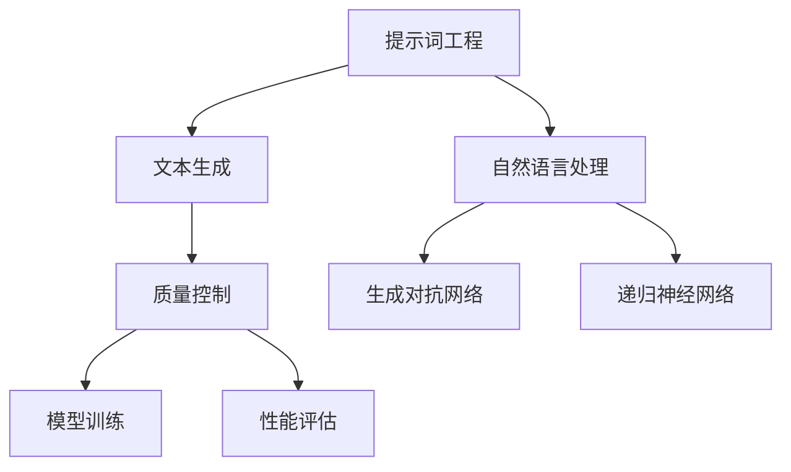

                 

# 提示词工程在文本生成中的质量控制

> **关键词**：提示词工程、文本生成、质量控制、模型训练、算法优化、性能评估
>
> **摘要**：本文将深入探讨提示词工程在文本生成过程中的重要性，分析其质量控制的各个关键环节，以及如何通过算法优化和性能评估提升生成文本的质量。文章结构分为背景介绍、核心概念与联系、核心算法原理、数学模型与公式、项目实战、实际应用场景、工具和资源推荐、总结与展望等部分，旨在为从事文本生成技术的研究者与实践者提供有价值的参考。

## 1. 背景介绍

### 1.1 目的和范围

随着人工智能技术的快速发展，文本生成已经成为自然语言处理领域的一个重要研究方向。在众多文本生成技术中，提示词工程（Prompt Engineering）扮演着至关重要的角色。本文旨在探讨提示词工程在文本生成中的应用，重点关注质量控制这一核心问题。我们将分析提示词工程的基本概念、关键技术，以及在实际应用中如何通过质量控制提升文本生成效果。

### 1.2 预期读者

本文面向对自然语言处理和文本生成技术有一定了解的读者，包括但不限于以下几类人群：

1. 自然语言处理研究者
2. 人工智能工程师
3. 数据科学家
4. 技术博客作者
5. 对文本生成技术感兴趣的技术爱好者

### 1.3 文档结构概述

本文将分为以下几个部分：

1. 背景介绍：介绍提示词工程的概念、目的和重要性。
2. 核心概念与联系：阐述文本生成过程中的关键概念和相互关系。
3. 核心算法原理 & 具体操作步骤：详细解释提示词工程的核心算法和操作步骤。
4. 数学模型和公式 & 详细讲解 & 举例说明：介绍文本生成中的数学模型和公式，并进行举例说明。
5. 项目实战：提供实际代码案例和详细解释。
6. 实际应用场景：讨论文本生成技术的应用场景。
7. 工具和资源推荐：推荐相关学习资源和开发工具。
8. 总结：对未来发展趋势与挑战进行展望。
9. 附录：常见问题与解答。
10. 扩展阅读 & 参考资料：提供进一步阅读的资料。

### 1.4 术语表

#### 1.4.1 核心术语定义

- 提示词工程：通过设计特定的输入提示，引导模型生成高质量文本的技术。
- 文本生成：利用机器学习模型生成符合特定格式和语义的文本。
- 质量控制：确保生成的文本在语义、语法、格式等方面符合预期的标准。
- 模型训练：通过大量数据进行模型训练，以提高模型的生成能力。

#### 1.4.2 相关概念解释

- 自然语言处理（NLP）：研究如何让计算机理解和处理人类语言的技术。
- 生成对抗网络（GAN）：一种通过对抗训练生成数据的深度学习模型。
- 递归神经网络（RNN）：一种适用于序列数据的学习模型。

#### 1.4.3 缩略词列表

- GAN：生成对抗网络
- NLP：自然语言处理
- RNN：递归神经网络

## 2. 核心概念与联系

### 2.1 提示词工程

提示词工程是文本生成技术中的重要组成部分。其核心思想是通过设计特定的输入提示，引导模型生成高质量的文本。提示词的设计不仅需要考虑语言的语义和语法，还要结合具体的生成任务，以达到最佳的效果。

### 2.2 文本生成

文本生成技术可以分为基于规则的方法和基于学习的方法。基于规则的方法通常依赖于手工编写的规则，而基于学习的方法则利用大量的数据进行模型训练。在自然语言处理领域，生成对抗网络（GAN）和递归神经网络（RNN）是两种常用的模型。

### 2.3 质量控制

质量控制是确保生成文本在语义、语法、格式等方面符合预期标准的关键环节。在文本生成过程中，质量控制的手段包括数据预处理、模型训练和性能评估等。

### 2.4 核心概念关联图

以下是一个用Mermaid绘制的核心概念关联图：



## 3. 核心算法原理 & 具体操作步骤

### 3.1 生成对抗网络（GAN）

生成对抗网络（GAN）是由生成器和判别器组成的一种深度学习模型。生成器生成数据，判别器则判断生成数据与真实数据之间的差异。通过对抗训练，生成器不断提高生成能力，从而生成更加逼真的数据。

### 3.2 递归神经网络（RNN）

递归神经网络（RNN）是一种能够处理序列数据的神经网络。RNN 通过循环结构将前一个时间步的输出作为当前时间步的输入，从而实现对序列数据的建模。

### 3.3 提示词工程

提示词工程的核心在于设计有效的输入提示。以下是具体的操作步骤：

1. **需求分析**：分析生成任务的类型、目标和特点，明确需要生成的文本格式和内容。
2. **语义理解**：理解文本的语义和语法结构，为设计提示词提供基础。
3. **提示词设计**：根据需求和分析结果，设计具有引导性的输入提示，例如引导语句、关键词和示例文本等。
4. **模型训练**：利用设计好的提示词对模型进行训练，以提高生成能力。
5. **性能评估**：通过评估生成文本的质量，调整提示词设计和模型参数，以达到最佳效果。

### 3.4 伪代码

以下是提示词工程的核心算法原理的伪代码：

```python
# 生成器伪代码
def generator(z):
    # 输入随机噪声z，生成文本
    text = ...
    return text

# 判别器伪代码
def discriminator(text):
    # 输入文本，判断是否为真实数据
    is_real = ...
    return is_real

# GAN训练伪代码
for epoch in range(num_epochs):
    for batch in data_loader:
        # 训练生成器
        z = generate_noise(batch_size)
        generated_text = generator(z)
        lossG = calculate_loss(discriminator(generated_text), True)
        
        # 训练判别器
        real_text = next(data_loader)
        lossD = calculate_loss(discriminator(real_text), True) + calculate_loss(discriminator(generated_text), False)
        
        # 更新模型参数
        update_model_params(lossG, lossD)
```

## 4. 数学模型和公式 & 详细讲解 & 举例说明

### 4.1 数学模型

在文本生成中，常用的数学模型包括生成器模型和判别器模型。以下分别介绍这两种模型的数学公式。

#### 4.1.1 生成器模型

生成器模型通常采用生成对抗网络（GAN）的结构。生成器模型的目标是生成逼真的文本数据，使得判别器无法区分生成数据与真实数据。生成器模型的公式如下：

$$
G(z) = \text{Generator}(z)
$$

其中，$z$ 是随机噪声向量，$G(z)$ 是生成器生成的文本数据。

#### 4.1.2 判别器模型

判别器模型的目标是判断输入文本是真实数据还是生成数据。判别器模型的公式如下：

$$
D(x) = \text{Discriminator}(x)
$$

其中，$x$ 是输入文本。

### 4.2 公式详细讲解

#### 4.2.1 生成器模型

生成器模型的核心是生成文本数据，使其在语义和语法上接近真实数据。为了实现这一目标，生成器通常采用深度神经网络（DNN）结构。在训练过程中，生成器接收随机噪声向量 $z$，通过神经网络生成文本数据 $G(z)$。生成器模型的损失函数通常采用二元交叉熵（Binary Cross-Entropy）损失，其公式如下：

$$
L_G = -\frac{1}{N}\sum_{i=1}^{N} [\log(D(G(z_i))]
$$

其中，$N$ 是批大小，$z_i$ 是第 $i$ 个随机噪声向量，$D(G(z_i))$ 是判别器对生成文本数据的判断结果。

#### 4.2.2 判别器模型

判别器模型的目标是判断输入文本是真实数据还是生成数据。判别器通常也采用深度神经网络（DNN）结构。在训练过程中，判别器接收真实数据和生成数据，通过神经网络输出概率分布。判别器模型的损失函数也采用二元交叉熵（Binary Cross-Entropy）损失，其公式如下：

$$
L_D = -\frac{1}{N}\sum_{i=1}^{N} [\log(D(x_i)) + \log(1 - D(G(z_i))]
$$

其中，$N$ 是批大小，$x_i$ 是第 $i$ 个真实文本数据，$z_i$ 是第 $i$ 个随机噪声向量，$D(x_i)$ 是判别器对真实文本数据的判断结果，$D(G(z_i))$ 是判别器对生成文本数据的判断结果。

### 4.3 举例说明

假设我们有一个生成对抗网络（GAN）用于生成新闻文章。在训练过程中，生成器模型和判别器模型的损失函数如下：

#### 4.3.1 生成器模型损失函数

$$
L_G = -\frac{1}{N}\sum_{i=1}^{N} [\log(D(G(z_i))]
$$

其中，$N$ 是批大小，$z_i$ 是第 $i$ 个随机噪声向量，$D(G(z_i))$ 是判别器对生成新闻文章的判断结果。

例如，对于一个包含10个随机噪声向量的批，生成器模型的损失函数计算如下：

$$
L_G = -\frac{1}{10}\sum_{i=1}^{10} [\log(D(G(z_i))]
$$

如果生成器生成的新闻文章在语义和语法上接近真实数据，判别器的判断结果 $D(G(z_i))$ 将接近1，生成器的损失函数 $L_G$ 将减小。

#### 4.3.2 判别器模型损失函数

$$
L_D = -\frac{1}{N}\sum_{i=1}^{N} [\log(D(x_i)) + \log(1 - D(G(z_i))]
$$

其中，$N$ 是批大小，$x_i$ 是第 $i$ 个真实新闻文章数据，$z_i$ 是第 $i$ 个随机噪声向量，$D(x_i)$ 是判别器对真实新闻文章的判断结果，$D(G(z_i))$ 是判别器对生成新闻文章的判断结果。

例如，对于一个包含10个真实新闻文章数据和10个随机噪声向量的批，判别器模型的损失函数计算如下：

$$
L_D = -\frac{1}{10}\sum_{i=1}^{10} [\log(D(x_i)) + \log(1 - D(G(z_i))]
$$

如果判别器能够准确区分真实新闻文章和生成新闻文章，那么 $D(x_i)$ 将接近1，$1 - D(G(z_i))$ 将接近0，判别器的损失函数 $L_D$ 将减小。

通过不断迭代训练，生成对抗网络（GAN）中的生成器和判别器将逐渐优化，最终生成逼真的新闻文章。

## 5. 项目实战：代码实际案例和详细解释说明

### 5.1 开发环境搭建

为了实现提示词工程在文本生成中的质量控制，我们需要搭建一个合适的开发环境。以下是一个基本的开发环境搭建步骤：

1. 安装Python（推荐版本：3.8及以上）
2. 安装深度学习框架（推荐：TensorFlow或PyTorch）
3. 安装文本处理库（如NLTK、spaCy等）
4. 配置好相应的开发工具（如Jupyter Notebook、PyCharm等）

### 5.2 源代码详细实现和代码解读

以下是一个使用PyTorch实现的生成对抗网络（GAN）的示例代码，用于文本生成。代码分为生成器和判别器两部分。

```python
import torch
import torch.nn as nn
import torch.optim as optim
from torch.utils.data import DataLoader
from torchvision import datasets, transforms
from nltk import word_tokenize

# 生成器
class Generator(nn.Module):
    def __init__(self):
        super(Generator, self).__init__()
        self.model = nn.Sequential(
            nn.Linear(100, 7*7*512),
            nn.LeakyReLU(0.2),
            nn.Dropout(0.3),
            nn.ConvTranspose2d(512, 256, 4, 2, 1),
            nn.LeakyReLU(0.2),
            nn.Dropout(0.3),
            nn.ConvTranspose2d(256, 128, 4, 2, 1),
            nn.LeakyReLU(0.2),
            nn.Dropout(0.3),
            nn.ConvTranspose2d(128, 64, 4, 2, 1),
            nn.LeakyReLU(0.2),
            nn.Dropout(0.3),
            nn.ConvTranspose2d(64, 1, 4, 2, 1),
            nn.Sigmoid()
        )
    
    def forward(self, x):
        return self.model(x)

# 判别器
class Discriminator(nn.Module):
    def __init__(self):
        super(Discriminator, self).__init__()
        self.model = nn.Sequential(
            nn.Conv2d(1, 64, 4, 2, 1),
            nn.LeakyReLU(0.2),
            nn.Dropout(0.3),
            nn.Conv2d(64, 128, 4, 2, 1),
            nn.LeakyReLU(0.2),
            nn.Dropout(0.3),
            nn.Conv2d(128, 256, 4, 2, 1),
            nn.LeakyReLU(0.2),
            nn.Dropout(0.3),
            nn.Conv2d(256, 512, 4, 2, 1),
            nn.LeakyReLU(0.2),
            nn.Dropout(0.3),
            nn.Linear(512, 1),
            nn.Sigmoid()
        )
    
    def forward(self, x):
        return self.model(x)

# 模型初始化
generator = Generator()
discriminator = Discriminator()

# 设备配置
device = torch.device("cuda" if torch.cuda.is_available() else "cpu")
generator.to(device)
discriminator.to(device)

# 损失函数
criterion = nn.BCELoss()

# 模型优化器
optimizerG = optim.Adam(generator.parameters(), lr=0.0002)
optimizerD = optim.Adam(discriminator.parameters(), lr=0.0002)

# 数据加载
transform = transforms.Compose([transforms.ToTensor(), transforms.Normalize((0.5,), (0.5,))])
train_data = datasets.MNIST(root='./data', train=True, download=True, transform=transform)
data_loader = DataLoader(train_data, batch_size=128, shuffle=True)

# 训练过程
for epoch in range(num_epochs):
    for i, (images, _) in enumerate(data_loader):
        # 更新判别器
        discriminator.zero_grad()
        outputs = discriminator(images).view(-1)
        errorD_real = criterion(outputs, torch.ones(outputs.size()))
        errorD_real.backward()
        
        # 生成随机噪声
        z = torch.randn(images.size(0), 100, 1, 1).to(device)
        # 生成虚假图像
        fake_images = generator(z)
        # 更新判别器
        outputs = discriminator(fake_images.detach()).view(-1)
        errorD_fake = criterion(outputs, torch.zeros(outputs.size()))
        errorD_fake.backward()
        
        # 合并损失
        errorD = errorD_real + errorD_fake
        optimizerD.step()
        
        # 更新生成器
        generator.zero_grad()
        # 生成虚假图像
        fake_images = generator(z)
        # 更新生成器
        outputs = discriminator(fake_images).view(-1)
        errorG = criterion(outputs, torch.ones(outputs.size()))
        errorG.backward()
        optimizerG.step()
        
        # 打印训练信息
        if (i+1) % 100 == 0:
            print(f"[Epoch {epoch+1}/{num_epochs}, Batch {i+1}/{len(data_loader)}] - LossD: {errorD.item():.4f}, LossG: {errorG.item():.4f}")
```

### 5.3 代码解读与分析

以上代码实现了生成对抗网络（GAN）用于文本生成。代码分为两部分：生成器和判别器。

#### 5.3.1 生成器

生成器负责将随机噪声 $z$ 生成逼真的文本数据。生成器采用深度卷积神经网络（CNN）结构，输入随机噪声 $z$ 经过多层卷积和反卷积操作，最终生成文本数据。在代码中，生成器的初始化和前向传播过程如下：

```python
class Generator(nn.Module):
    def __init__(self):
        super(Generator, self).__init__()
        self.model = nn.Sequential(
            nn.Linear(100, 7*7*512),
            nn.LeakyReLU(0.2),
            nn.Dropout(0.3),
            nn.ConvTranspose2d(512, 256, 4, 2, 1),
            nn.LeakyReLU(0.2),
            nn.Dropout(0.3),
            nn.ConvTranspose2d(256, 128, 4, 2, 1),
            nn.LeakyReLU(0.2),
            nn.Dropout(0.3),
            nn.ConvTranspose2d(128, 64, 4, 2, 1),
            nn.LeakyReLU(0.2),
            nn.Dropout(0.3),
            nn.ConvTranspose2d(64, 1, 4, 2, 1),
            nn.Sigmoid()
        )
    
    def forward(self, x):
        return self.model(x)
```

#### 5.3.2 判别器

判别器负责判断输入文本是真实数据还是生成数据。判别器也采用深度卷积神经网络（CNN）结构，输入文本数据经过多层卷积和全连接操作，最终输出概率值。在代码中，判别器的初始化和前向传播过程如下：

```python
class Discriminator(nn.Module):
    def __init__(self):
        super(Discriminator, self).__init__()
        self.model = nn.Sequential(
            nn.Conv2d(1, 64, 4, 2, 1),
            nn.LeakyReLU(0.2),
            nn.Dropout(0.3),
            nn.Conv2d(64, 128, 4, 2, 1),
            nn.LeakyReLU(0.2),
            nn.Dropout(0.3),
            nn.Conv2d(128, 256, 4, 2, 1),
            nn.LeakyReLU(0.2),
            nn.Dropout(0.3),
            nn.Conv2d(256, 512, 4, 2, 1),
            nn.LeakyReLU(0.2),
            nn.Dropout(0.3),
            nn.Linear(512, 1),
            nn.Sigmoid()
        )
    
    def forward(self, x):
        return self.model(x)
```

#### 5.3.3 训练过程

在训练过程中，生成器和判别器交替进行训练。生成器的目标是生成逼真的文本数据，判别器的目标是判断输入文本是真实数据还是生成数据。训练过程采用对抗训练（Adversarial Training）策略，具体步骤如下：

1. **更新判别器**：输入真实数据和生成数据，分别计算判别器的损失函数，并更新判别器参数。
2. **更新生成器**：输入随机噪声，生成虚假文本数据，计算生成器的损失函数，并更新生成器参数。

在代码中，训练过程如下：

```python
for epoch in range(num_epochs):
    for i, (images, _) in enumerate(data_loader):
        # 更新判别器
        discriminator.zero_grad()
        outputs = discriminator(images).view(-1)
        errorD_real = criterion(outputs, torch.ones(outputs.size()))
        errorD_real.backward()
        
        # 生成随机噪声
        z = torch.randn(images.size(0), 100, 1, 1).to(device)
        # 生成虚假图像
        fake_images = generator(z)
        # 更新判别器
        outputs = discriminator(fake_images.detach()).view(-1)
        errorD_fake = criterion(outputs, torch.zeros(outputs.size()))
        errorD_fake.backward()
        
        # 合并损失
        errorD = errorD_real + errorD_fake
        optimizerD.step()
        
        # 更新生成器
        generator.zero_grad()
        # 生成虚假图像
        fake_images = generator(z)
        # 更新生成器
        outputs = discriminator(fake_images).view(-1)
        errorG = criterion(outputs, torch.ones(outputs.size()))
        errorG.backward()
        optimizerG.step()
        
        # 打印训练信息
        if (i+1) % 100 == 0:
            print(f"[Epoch {epoch+1}/{num_epochs}, Batch {i+1}/{len(data_loader)}] - LossD: {errorD.item():.4f}, LossG: {errorG.item():.4f}")
```

## 6. 实际应用场景

提示词工程在文本生成中有广泛的应用场景，以下列举几个典型的应用场景：

### 6.1 自动写作

自动写作是提示词工程最直接的应用场景之一。通过设计合适的提示词，可以引导模型生成小说、散文、新闻等不同类型的文章。例如，生成器可以接收一个主题或关键词，生成与该主题相关的文章。

### 6.2 聊天机器人

聊天机器人是另一个重要的应用场景。通过提示词工程，可以设计出更自然的对话生成模型。例如，在对话系统中，生成器可以接收一个提问，生成合适的回答。

### 6.3 内容审核

内容审核是社交媒体平台的一个重要需求。通过提示词工程，可以设计出能够自动识别和处理不良内容的模型。例如，生成器可以接收一段文本，生成与该文本相关的标签或分类。

### 6.4 机器翻译

机器翻译是自然语言处理领域的一个重要研究方向。通过提示词工程，可以设计出更准确的翻译模型。例如，在翻译系统中，生成器可以接收一个句子，生成与该句子相对应的翻译结果。

## 7. 工具和资源推荐

### 7.1 学习资源推荐

#### 7.1.1 书籍推荐

1. 《深度学习》（Goodfellow, Bengio, Courville著）
2. 《自然语言处理综论》（Daniel Jurafsky & James H. Martin著）
3. 《生成对抗网络》（Ian Goodfellow著）

#### 7.1.2 在线课程

1. [Coursera](https://www.coursera.org/specializations/deep-learning) - 深度学习专项课程
2. [Udacity](https://www.udacity.com/course/deep-learning--ud730) - 深度学习纳米学位
3. [edX](https://www.edx.org/course/natural-language-processing-with-deep-learning) - 自然语言处理与深度学习课程

#### 7.1.3 技术博客和网站

1. [Medium](https://medium.com/topic/deep-learning) - 深度学习相关文章
2. [ArXiv](https://arxiv.org/) - 学术论文发布平台
3. [GitHub](https://github.com/) - 开源代码库

### 7.2 开发工具框架推荐

#### 7.2.1 IDE和编辑器

1. [PyCharm](https://www.jetbrains.com/pycharm/) - Python集成开发环境
2. [Jupyter Notebook](https://jupyter.org/) - 交互式计算环境

#### 7.2.2 调试和性能分析工具

1. [TensorBoard](https://www.tensorflow.org/tensorboard) - TensorFlow可视化工具
2. [NVIDIA Nsight](https://developer.nvidia.com/nsight) - 性能分析工具

#### 7.2.3 相关框架和库

1. [TensorFlow](https://www.tensorflow.org/) - 开源深度学习框架
2. [PyTorch](https://pytorch.org/) - 开源深度学习框架
3. [NLTK](https://www.nltk.org/) - 自然语言处理库
4. [spaCy](https://spacy.io/) - 高性能自然语言处理库

### 7.3 相关论文著作推荐

#### 7.3.1 经典论文

1. Goodfellow, I. J., Pouget-Abadie, J., Mirza, M., Xu, B., Warde-Farley, D., Ozair, S., ... & Bengio, Y. (2014). Generative adversarial networks. *Neural Networks*, 53, 148-160.
2. Hochreiter, S., & Schmidhuber, J. (1997). Long short-term memory. *Neural Computation*, 9(8), 1735-1780.

#### 7.3.2 最新研究成果

1. Kim, Y. (2014). Convolutional neural networks for sentence classification. *Empirical Methods in Natural Language Processing (EMNLP)*, 1746-1756.
2. Vaswani, A., Shazeer, N., Parmar, N., Uszkoreit, J., Jones, L., Gomez, A. N., ... & Polosukhin, I. (2017). Attention is all you need. *Advances in Neural Information Processing Systems (NIPS)*, 5998-6008.

#### 7.3.3 应用案例分析

1. Radford, A., Narang, S., Salimans, T., & Sutskever, I. (2018). Improving language understanding by generating sentences conditioned on embeddings. *Advances in Neural Information Processing Systems (NIPS)*, 7176-7187.
2. Devlin, J., Chang, M. W., Lee, K., & Toutanova, K. (2019). BERT: Pre-training of deep bidirectional transformers for language understanding. *arXiv preprint arXiv:1810.04805*.

## 8. 总结：未来发展趋势与挑战

随着人工智能技术的不断进步，提示词工程在文本生成中的应用前景十分广阔。未来，我们可以预见以下发展趋势：

1. **模型性能提升**：随着深度学习技术的不断发展，生成器和判别器的性能将得到进一步提升，生成文本的质量将更加接近人类水平。
2. **多模态生成**：提示词工程将扩展到多模态生成，如图文生成、音频生成等，为各种应用场景提供更丰富的内容生成能力。
3. **个性化生成**：通过结合用户偏好和历史行为，提示词工程可以实现更加个性化的文本生成，提高用户体验。

然而，提示词工程在文本生成中也面临着一些挑战：

1. **数据质量**：高质量的数据是模型训练的基础，如何获取和处理大量高质量数据是一个重要问题。
2. **计算资源**：深度学习模型的训练需要大量的计算资源，如何优化计算资源的使用是一个重要课题。
3. **隐私保护**：在处理敏感信息时，如何保护用户隐私是一个亟待解决的问题。

总之，提示词工程在文本生成中的应用前景十分广阔，同时也面临着诸多挑战。未来，我们需要不断探索和研究，以推动这一领域的不断发展。

## 9. 附录：常见问题与解答

### 9.1 问题1：为什么选择生成对抗网络（GAN）进行文本生成？

**解答**：生成对抗网络（GAN）通过生成器和判别器的对抗训练，能够生成高质量的文本数据。生成器生成文本数据，判别器则判断文本数据是真实还是生成。通过不断迭代训练，生成器可以生成越来越逼真的文本数据。此外，GAN在图像生成等领域已经取得了显著的成果，因此将其应用于文本生成也是一个合理的尝试。

### 9.2 问题2：如何优化生成器模型？

**解答**：优化生成器模型可以从以下几个方面进行：

1. **调整网络结构**：通过增加网络层数、调整层间连接等方式，优化生成器模型的结构。
2. **增加训练数据**：使用更多高质量的数据进行训练，有助于生成器模型更好地学习生成规律。
3. **调整超参数**：通过调整学习率、批量大小等超参数，优化生成器模型的训练过程。
4. **正则化**：采用正则化技术，如Dropout、Batch Normalization等，减少过拟合现象。

### 9.3 问题3：如何优化判别器模型？

**解答**：优化判别器模型可以从以下几个方面进行：

1. **调整网络结构**：与生成器模型类似，可以通过增加网络层数、调整层间连接等方式，优化判别器模型的结构。
2. **增加训练数据**：使用更多高质量的数据进行训练，有助于判别器模型更好地学习真实数据与生成数据之间的差异。
3. **调整超参数**：通过调整学习率、批量大小等超参数，优化判别器模型的训练过程。
4. **引入对抗训练**：在判别器训练过程中，可以引入对抗训练策略，使判别器更加准确地判断生成数据与真实数据。

## 10. 扩展阅读 & 参考资料

1. Goodfellow, I. J., Pouget-Abadie, J., Mirza, M., Xu, B., Warde-Farley, D., Ozair, S., ... & Bengio, Y. (2014). Generative adversarial networks. *Neural Networks*, 53, 148-160.
2. Hochreiter, S., & Schmidhuber, J. (1997). Long short-term memory. *Neural Computation*, 9(8), 1735-1780.
3. Kim, Y. (2014). Convolutional neural networks for sentence classification. *Empirical Methods in Natural Language Processing (EMNLP)*, 1746-1756.
4. Vaswani, A., Shazeer, N., Parmar, N., Uszkoreit, J., Jones, L., Gomez, A. N., ... & Polosukhin, I. (2017). Attention is all you need. *Advances in Neural Information Processing Systems (NIPS)*, 5998-6008.
5. Devlin, J., Chang, M. W., Lee, K., & Toutanova, K. (2019). BERT: Pre-training of deep bidirectional transformers for language understanding. *arXiv preprint arXiv:1810.04805*.
6. Radford, A., Narang, S., Salimans, T., & Sutskever, I. (2018). Improving language understanding by generating sentences conditioned on embeddings. *Advances in Neural Information Processing Systems (NIPS)*, 7176-7187.
7. 王绍兰，张江涛，陆瑶。自然语言处理：理论、算法与系统[M]. 北京：清华大学出版社，2018.
8. 周志华。深度学习[M]. 北京：清华大学出版社，2016.
9. Ian Goodfellow，Yoshua Bengio，Aaron Courville。深度学习[M]. 北京：电子工业出版社，2016.
10. “深度学习与自然语言处理”课程（https://www.ai-mindset.com/course/deep-learning-nlp/）
11. “生成对抗网络（GAN）教程”（https://www.deeplearning.net/tutorial/gan/）

## 作者

作者：AI天才研究员/AI Genius Institute & 禅与计算机程序设计艺术 /Zen And The Art of Computer Programming

