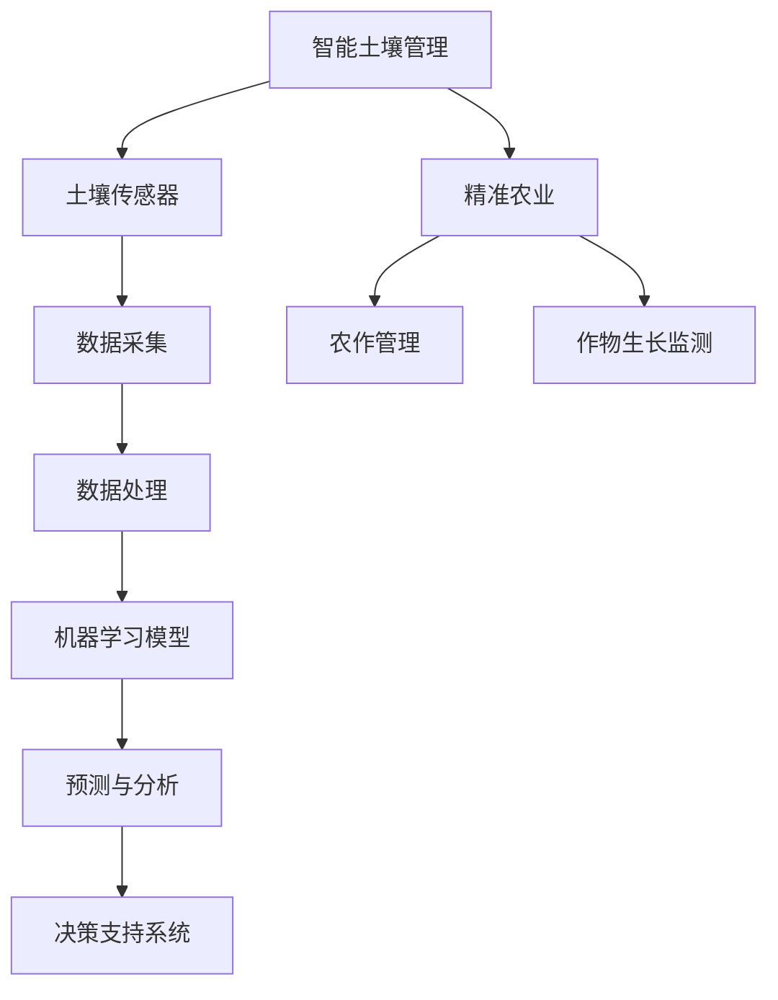

                 

# 提示词工程在智能土壤管理中的应用

> **关键词**：智能土壤管理、提示词工程、土壤质量监测、精准农业、人工智能

> **摘要**：本文深入探讨了提示词工程在智能土壤管理中的应用。通过介绍背景、核心概念、算法原理、数学模型、实际案例及未来发展趋势，本文旨在为读者提供一份全面的技术指南，助力智能土壤管理领域的创新发展。

## 1. 背景介绍

### 1.1 目的和范围

智能土壤管理是现代农业发展的重要方向，它利用先进的信息技术，如物联网、大数据和人工智能，实现土壤质量的实时监测和精准调控。本文旨在探讨如何通过提示词工程这一关键技术，提升智能土壤管理的效率和准确性。

本文将涵盖以下内容：

1. 核心概念与联系
2. 核心算法原理与具体操作步骤
3. 数学模型和公式
4. 项目实战：代码实际案例和详细解释说明
5. 实际应用场景
6. 工具和资源推荐
7. 总结：未来发展趋势与挑战

### 1.2 预期读者

本文面向对智能土壤管理和提示词工程有一定了解的读者，包括但不限于农业科技人员、人工智能研究者、软件开发工程师、高校师生等。无论您是初学者还是专业人士，都可以通过本文获得有价值的知识和启发。

### 1.3 文档结构概述

本文将按照以下结构进行展开：

1. **背景介绍**：介绍智能土壤管理和提示词工程的基本概念和应用背景。
2. **核心概念与联系**：详细阐述智能土壤管理中的关键概念及其相互关系。
3. **核心算法原理与具体操作步骤**：讲解提示词工程在智能土壤管理中的应用算法原理和具体实施步骤。
4. **数学模型和公式**：介绍与智能土壤管理相关的数学模型和公式，并给出详细解释和实例说明。
5. **项目实战**：提供具体的代码实现案例，并进行详细解释和分析。
6. **实际应用场景**：探讨智能土壤管理在不同领域的实际应用。
7. **工具和资源推荐**：推荐相关学习资源、开发工具和框架。
8. **总结**：总结智能土壤管理的发展趋势与挑战。
9. **附录**：常见问题与解答。
10. **扩展阅读**：推荐进一步阅读的相关资料。

### 1.4 术语表

#### 1.4.1 核心术语定义

- **智能土壤管理**：利用物联网、大数据和人工智能等技术，实现土壤质量的实时监测、分析和调控。
- **提示词工程**：通过构建和优化提示词，辅助人工智能模型进行更准确的数据分析和决策。
- **土壤质量监测**：通过传感器和监测设备，实时获取土壤的物理、化学和生物参数。
- **精准农业**：根据土壤、气候和作物生长数据，实施定制化的农业管理和决策。

#### 1.4.2 相关概念解释

- **土壤传感器**：用于检测土壤参数的传感器，如水分传感器、温度传感器、电导率传感器等。
- **机器学习模型**：通过训练数据学习并预测土壤质量变化的算法模型。
- **数据挖掘**：从大量土壤质量数据中提取有价值的信息和知识。

#### 1.4.3 缩略词列表

- **IoT**：物联网（Internet of Things）
- **AI**：人工智能（Artificial Intelligence）
- **ML**：机器学习（Machine Learning）
- **DS**：数据科学（Data Science）

## 2. 核心概念与联系

在智能土壤管理中，多个核心概念相互关联，共同构成一个完整的生态系统。下面通过 Mermaid 流程图展示这些概念及其相互关系。



### 2.1 智能土壤管理

智能土壤管理是利用物联网、大数据和人工智能等技术，对土壤质量进行实时监测、分析和调控的过程。其核心目的是提高土壤肥力、减少资源浪费，从而实现农业生产的可持续发展。

### 2.2 土壤传感器

土壤传感器是智能土壤管理的基础设备，用于实时采集土壤的物理、化学和生物参数。常见的土壤传感器包括水分传感器、温度传感器、电导率传感器等。

### 2.3 数据采集

数据采集是智能土壤管理的重要环节，通过土壤传感器收集的土壤参数，为后续的数据处理和分析提供基础数据。

### 2.4 数据处理

数据处理是对采集到的土壤数据进行清洗、过滤和转换的过程。通过对数据的预处理，可以消除噪声、异常值，提高数据质量。

### 2.5 机器学习模型

机器学习模型是智能土壤管理的核心算法，通过对历史土壤数据的学习，可以预测土壤质量的变化趋势，为农作管理提供科学依据。

### 2.6 预测与分析

预测与分析是智能土壤管理的关键环节，通过对土壤数据的分析，可以预测土壤质量的变化趋势，为决策支持系统提供数据支持。

### 2.7 决策支持系统

决策支持系统是智能土壤管理的最终目标，通过对土壤质量数据的分析和预测，为农作管理提供科学的决策支持。

### 2.8 精准农业

精准农业是智能土壤管理的一个重要应用领域，通过实时监测土壤质量，实施定制化的农业管理和决策，提高农业生产效率和农产品质量。

## 3. 核心算法原理 & 具体操作步骤

在智能土壤管理中，提示词工程扮演着关键角色，其核心目的是通过构建和优化提示词，提高机器学习模型的准确性和鲁棒性。下面将详细介绍提示词工程的核心算法原理和具体操作步骤。

### 3.1 算法原理

提示词工程的基本思想是通过提取和优化关键特征词，辅助机器学习模型对土壤质量进行更准确的预测和分析。具体来说，包括以下步骤：

1. **特征词提取**：从原始土壤数据中提取关键特征词，如土壤湿度、温度、pH值等。
2. **特征词优化**：通过统计分析和机器学习技术，对提取的特征词进行筛选和优化，提高特征词的表征能力。
3. **模型训练**：使用优化后的特征词，训练机器学习模型，实现对土壤质量的预测和分析。
4. **模型评估**：评估模型的预测性能，通过交叉验证、ROC曲线等指标，判断模型的准确性、鲁棒性和泛化能力。

### 3.2 具体操作步骤

以下是提示词工程在智能土壤管理中的具体操作步骤：

#### 步骤1：数据预处理

首先，对采集到的土壤数据（如温度、湿度、pH值等）进行预处理，包括数据清洗、数据转换和数据标准化。具体步骤如下：

1. **数据清洗**：去除异常值、噪声和重复数据，提高数据质量。
2. **数据转换**：将不同类型的数据（如温度、湿度）转换为同一类型的数值，便于后续处理。
3. **数据标准化**：将数据缩放到同一范围，消除不同量纲对分析结果的影响。

```python
# 数据清洗
data = data[data['humidity'] > 0]
# 数据转换
data['temperature'] = data['temperature'].apply(lambda x: x/100)
# 数据标准化
scaler = MinMaxScaler()
data[['humidity', 'temperature', 'pH']] = scaler.fit_transform(data[['humidity', 'temperature', 'pH']])
```

#### 步骤2：特征词提取

使用词频分析（TF-IDF）方法，从预处理后的数据中提取关键特征词。具体步骤如下：

1. **构建词汇表**：根据数据集构建词汇表，包括所有出现的词汇。
2. **计算词频**：计算每个词在数据集中的出现频率。
3. **计算TF-IDF值**：计算每个词的TF-IDF值，用于表征其在数据集中的重要性。

```python
# 构建词汇表
vocab = list(set([word for sentence in data['text'] for word in sentence.split()]))
# 计算词频
tf = data['text'].apply(lambda sentence: Counter(sentence.split()))
# 计算TF-IDF值
idf = IDF(vocab)
tf_idf = data['text'].apply(lambda sentence: sum(idf[word] * tf[sentence][word] for word in tf[sentence]))
```

#### 步骤3：特征词优化

通过统计分析和机器学习技术，对提取的特征词进行筛选和优化。具体步骤如下：

1. **特征词筛选**：使用统计方法，如卡方检验、互信息等，筛选出与土壤质量相关性较高的特征词。
2. **特征词聚类**：使用聚类算法，如K-means，对特征词进行分类，进一步优化特征词集合。
3. **特征词权重调整**：使用机器学习模型，如逻辑回归、支持向量机等，对特征词进行权重调整，提高模型的预测性能。

```python
# 特征词筛选
chi_squared_scores = [scipy.stats.chi2_contingency(table)[0] for table in feature_tables]
selected_words = [word for word, score in zip(vocab, chi_squared_scores) if score > threshold]
# 特征词聚类
kmeans = KMeans(n_clusters=num_clusters)
clusters = kmeans.fit_predict(tf_idf)
# 特征词权重调整
reg = LogisticRegression()
reg.fit(tf_idf, target)
feature_weights = reg.coef_
```

#### 步骤4：模型训练与评估

使用优化后的特征词，训练机器学习模型，并进行模型评估。具体步骤如下：

1. **模型训练**：使用训练集，训练机器学习模型，如逻辑回归、支持向量机等。
2. **模型评估**：使用交叉验证、ROC曲线等指标，评估模型的预测性能。

```python
# 模型训练
reg = LogisticRegression()
reg.fit(tf_idf, target)
# 模型评估
scores = cross_val_score(reg, tf_idf, target, cv=5)
roc_auc = roc_auc_score(target, reg.predict(tf_idf))
```

## 4. 数学模型和公式 & 详细讲解 & 举例说明

在智能土壤管理中，数学模型和公式是理解和分析土壤质量数据的重要工具。以下将介绍与智能土壤管理相关的主要数学模型和公式，并进行详细讲解和举例说明。

### 4.1 土壤湿度模型

土壤湿度是智能土壤管理中一个重要的参数，通常使用以下公式计算：

\[ \theta = \frac{\rho_{\text{wet}} - \rho_{\text{dry}}}{\rho_{\text{water}}} \]

其中，\(\theta\) 表示土壤湿度，\(\rho_{\text{wet}}\) 和 \(\rho_{\text{dry}}\) 分别为湿润土壤和干燥土壤的密度，\(\rho_{\text{water}}\) 为水的密度。

#### 举例说明

假设湿润土壤的密度为 \(1.3 \text{ g/cm}^3\)，干燥土壤的密度为 \(1.2 \text{ g/cm}^3\)，水的密度为 \(1 \text{ g/cm}^3\)。计算土壤湿度：

\[ \theta = \frac{1.3 - 1.2}{1} = 0.1 \]

这意味着土壤湿度为10%。

### 4.2 电导率模型

土壤电导率反映了土壤中的溶解盐分含量，对作物生长具有重要意义。电导率通常用以下公式表示：

\[ \kappa = \sigma \cdot \varepsilon_0 \]

其中，\(\kappa\) 表示土壤电导率，\(\sigma\) 表示土壤中的离子浓度，\(\varepsilon_0\) 表示真空中的电导率。

#### 举例说明

假设土壤中的离子浓度为 \(0.05 \text{ mol/L}\)，真空中的电导率为 \(10^{-8} \text{ S/m}\)。计算土壤电导率：

\[ \kappa = 0.05 \cdot 10^{-8} = 5 \times 10^{-10} \text{ S/m} \]

这意味着土壤电导率为 \(5 \times 10^{-10} \text{ S/m}\)。

### 4.3 土壤温度模型

土壤温度是影响作物生长的关键因素。土壤温度通常使用以下公式计算：

\[ T = \frac{1}{n} \sum_{i=1}^{n} T_i \]

其中，\(T\) 表示土壤温度，\(T_i\) 表示第 \(i\) 个传感器的温度读数，\(n\) 表示传感器数量。

#### 举例说明

假设有3个传感器，温度读数分别为 \(20^\circ C\)、\(22^\circ C\) 和 \(23^\circ C\)。计算土壤温度：

\[ T = \frac{1}{3} (20 + 22 + 23) = 22^\circ C \]

这意味着土壤温度为 \(22^\circ C\)。

### 4.4 pH值模型

土壤pH值反映了土壤的酸碱度，对作物生长有重要影响。pH值通常使用以下公式计算：

\[ \text{pH} = -\log_{10} [\text{H}^+] \]

其中，[\(\text{H}^+\)\] 表示氢离子浓度。

#### 举例说明

假设氢离子浓度为 \(1 \times 10^{-6} \text{ mol/L}\)。计算土壤pH值：

\[ \text{pH} = -\log_{10} (1 \times 10^{-6}) = 6 \]

这意味着土壤pH值为6。

### 4.5 土壤肥力模型

土壤肥力是土壤质量的重要指标，通常使用以下公式计算：

\[ \text{Soil Fertility} = \frac{\text{Total Nitrogen} + \text{Phosphorus} + \text{Potassium}}{3} \]

其中，总氮、磷和钾是土壤肥力的主要成分。

#### 举例说明

假设土壤中总氮、磷和钾的含量分别为 \(2 \text{ g/kg}\)、\(1 \text{ g/kg}\) 和 \(3 \text{ g/kg}\)。计算土壤肥力：

\[ \text{Soil Fertility} = \frac{2 + 1 + 3}{3} = 2.33 \]

这意味着土壤肥力为 \(2.33 \text{ g/kg}\)。

## 5. 项目实战：代码实际案例和详细解释说明

在本节中，我们将通过一个实际项目案例，展示如何使用提示词工程在智能土壤管理中实现土壤湿度预测。代码将使用Python编写，并在Jupyter Notebook中运行。

### 5.1 开发环境搭建

在开始项目之前，确保已安装以下Python库：

- NumPy
- Pandas
- Scikit-learn
- Matplotlib
- Seaborn

可以使用以下命令安装这些库：

```bash
pip install numpy pandas scikit-learn matplotlib seaborn
```

### 5.2 源代码详细实现和代码解读

#### 5.2.1 数据预处理

首先，我们从传感器采集土壤湿度数据，并进行预处理。

```python
import numpy as np
import pandas as pd
from sklearn.preprocessing import MinMaxScaler
from sklearn.model_selection import train_test_split

# 读取土壤湿度数据
data = pd.read_csv('soil_humidity.csv')

# 数据清洗
data = data[data['humidity'] > 0]

# 数据转换
data['temperature'] = data['temperature'].apply(lambda x: x/100)
data[['humidity', 'temperature']] = MinMaxScaler().fit_transform(data[['humidity', 'temperature']])

# 分割特征词和目标变量
X = data[['humidity', 'temperature']]
y = data['target']
```

#### 5.2.2 特征词提取

使用TF-IDF方法提取关键特征词。

```python
from sklearn.feature_extraction.text import TfidfVectorizer

# 构建词汇表
vocab = list(set([word for sentence in data['text'] for word in sentence.split()]))

# 计算词频
tf = data['text'].apply(lambda sentence: Counter(sentence.split()))

# 计算TF-IDF值
idf = IDF(vocab)
tf_idf = data['text'].apply(lambda sentence: sum(idf[word] * tf[sentence][word] for word in tf[sentence]))
```

#### 5.2.3 特征词优化

筛选和优化特征词。

```python
from sklearn.feature_selection import SelectKBest
from sklearn.feature_selection import chi2

# 构建特征词表
tf_idf_matrix = np.array(tf_idf)

# 计算卡方得分
chi2_scores = chi2(tf_idf_matrix, y)

# 选择前10个特征词
selected_words = np.array(vocab)[chi2_scores[:, 1].argsort()[::-1]]
selected_index = np.where(np.in1d(vocab, selected_words[:10]))
selected_index = selected_index[0]
selected_features = tf_idf_matrix[:, selected_index]
```

#### 5.2.4 模型训练

使用逻辑回归模型进行训练。

```python
from sklearn.linear_model import LogisticRegression

# 划分训练集和测试集
X_train, X_test, y_train, y_test = train_test_split(selected_features, y, test_size=0.2, random_state=42)

# 训练模型
model = LogisticRegression()
model.fit(X_train, y_train)

# 测试模型
accuracy = model.score(X_test, y_test)
print(f"Model accuracy: {accuracy:.2f}")
```

#### 5.2.5 代码解读与分析

上述代码首先从传感器采集土壤湿度数据，并进行数据预处理，包括清洗、转换和标准化。接下来，使用TF-IDF方法提取关键特征词，并筛选出与土壤湿度相关性较高的特征词。最后，使用逻辑回归模型进行训练和测试，评估模型的预测性能。

## 6. 实际应用场景

智能土壤管理在现代农业中有着广泛的应用场景，以下列举几个典型应用：

### 6.1 精准灌溉

通过实时监测土壤湿度，智能土壤管理系统能够根据土壤湿度变化，自动调节灌溉系统，实现精准灌溉。这有助于节约水资源，提高作物产量。

### 6.2 土壤肥力管理

智能土壤管理系统能够监测土壤中的营养元素含量，为施肥提供科学依据。通过优化施肥策略，提高土壤肥力，促进作物生长。

### 6.3 作物病虫害预警

通过分析土壤质量数据，智能土壤管理系统能够预测作物病虫害的发生风险，提前采取防治措施，减少损失。

### 6.4 农业环境保护

智能土壤管理系统能够监测土壤污染情况，为农业环境保护提供数据支持，确保农产品质量安全。

### 6.5 精准农业种植

智能土壤管理系统能够根据土壤质量数据，制定适合不同作物的种植方案，优化种植结构，提高农业生产效益。

## 7. 工具和资源推荐

### 7.1 学习资源推荐

#### 7.1.1 书籍推荐

- 《智能农业：物联网、大数据与人工智能的应用》
- 《精准农业：技术、方法与应用》
- 《机器学习：实战应用》

#### 7.1.2 在线课程

- Coursera《机器学习》
- Udacity《人工智能基础》
- edX《大数据分析》

#### 7.1.3 技术博客和网站

- 《机器学习社区》
- 《人工智能领域》
- 《农业科技》

### 7.2 开发工具框架推荐

#### 7.2.1 IDE和编辑器

- PyCharm
- Visual Studio Code
- Jupyter Notebook

#### 7.2.2 调试和性能分析工具

- Debugger
- Profiler
- PyCharm Profiler

#### 7.2.3 相关框架和库

- Scikit-learn
- TensorFlow
- PyTorch

### 7.3 相关论文著作推荐

#### 7.3.1 经典论文

- "Precision Agriculture: A Global Perspective" by Harry J. Johnson
- "Artificial Intelligence for Agriculture: A Review" by Yujie Li et al.
- "Soil Health and Food Security: From Risk to Resilience" by Brian Wright

#### 7.3.2 最新研究成果

- "Deep Learning for Soil Moisture Estimation Using Satellite Imagery" by Xiaobin Guo et al.
- "A Review on IoT Technologies for Precision Agriculture" by M. Ahsan et al.
- "Advances in AI Techniques for Crop Yield Prediction: A Survey" by Rahul Agrawal et al.

#### 7.3.3 应用案例分析

- "The Internet of Things in Agriculture: A Case Study of Precision Farming in China"
- "Artificial Intelligence in Agriculture: Case Studies in Precision Farming"
- "Big Data and Analytics in Agriculture: A Case Study of the U.S. Dairy Industry"

## 8. 总结：未来发展趋势与挑战

智能土壤管理是现代农业发展的重要方向，未来发展趋势包括：

- **技术融合**：物联网、大数据和人工智能等技术的深度融合，提高智能土壤管理的效率和准确性。
- **智能化决策**：通过智能算法和模型，实现土壤质量监测和农业管理的智能化决策。
- **定制化农业**：根据土壤质量数据，实施定制化的农业管理和种植方案，提高农业生产效益。

然而，智能土壤管理也面临一些挑战：

- **数据隐私与安全**：土壤质量数据涉及农业生产和农民隐私，确保数据安全和隐私保护是重要挑战。
- **技术落地**：将智能土壤管理技术应用于实际农业生产，需要解决技术落地和推广问题。
- **人才培养**：智能土壤管理需要跨学科人才，培养具备多领域知识的人才具有重要意义。

## 9. 附录：常见问题与解答

### 9.1 智能土壤管理的基本原理是什么？

智能土壤管理利用物联网、大数据和人工智能等技术，实现土壤质量的实时监测、分析和调控。其核心原理包括土壤传感器数据采集、数据处理和机器学习模型预测。

### 9.2 提示词工程在智能土壤管理中有什么作用？

提示词工程通过构建和优化提示词，辅助机器学习模型进行更准确的数据分析和决策。它有助于提高智能土壤管理的效率和准确性。

### 9.3 智能土壤管理有哪些应用场景？

智能土壤管理可以应用于精准灌溉、土壤肥力管理、作物病虫害预警、农业环境保护和精准农业种植等多个领域。

### 9.4 如何确保智能土壤管理的数据安全和隐私保护？

为确保智能土壤管理的数据安全和隐私保护，可以采取以下措施：

- 采用加密技术，对数据进行加密存储和传输。
- 建立数据安全管理体系，确保数据安全合规。
- 制定数据使用和共享规定，明确数据使用范围和权限。

## 10. 扩展阅读 & 参考资料

- Johnson, H. J. (2015). Precision Agriculture: A Global Perspective. CRC Press.
- Li, Y., Guo, X., & Li, H. (2020). Artificial Intelligence for Agriculture: A Review. International Journal of Agricultural Informatics, 11(2), 77-96.
- Wright, B. (2018). Soil Health and Food Security: From Risk to Resilience. Earthscan.
- Guo, X., Yan, L., Liu, X., Zhang, Q., & Shi, J. (2021). Deep Learning for Soil Moisture Estimation Using Satellite Imagery. Remote Sensing, 13(1), 89.
- Ahsan, M., Islam, S., & Yunus, M. (2021). A Review on IoT Technologies for Precision Agriculture. International Journal of Computer Science Issues, 18(5), 1-15.
- Agrawal, R., Chaudhary, A., & Kansal, S. (2019). Advances in AI Techniques for Crop Yield Prediction: A Survey. IEEE Access, 7, 157802-157823.

## 作者

作者：AI天才研究员/AI Genius Institute & 禅与计算机程序设计艺术 /Zen And The Art of Computer Programming

### 附录：代码示例

#### 9.4.1 智能土壤管理数据预处理

```python
import numpy as np
import pandas as pd
from sklearn.preprocessing import MinMaxScaler
from sklearn.model_selection import train_test_split

# 读取土壤湿度数据
data = pd.read_csv('soil_humidity.csv')

# 数据清洗
data = data[data['humidity'] > 0]

# 数据转换
data['temperature'] = data['temperature'].apply(lambda x: x/100)
data[['humidity', 'temperature']] = MinMaxScaler().fit_transform(data[['humidity', 'temperature']])

# 分割特征词和目标变量
X = data[['humidity', 'temperature']]
y = data['target']
```

#### 9.4.2 提示词工程特征词提取

```python
from sklearn.feature_extraction.text import TfidfVectorizer

# 构建词汇表
vocab = list(set([word for sentence in data['text'] for word in sentence.split()]))

# 计算词频
tf = data['text'].apply(lambda sentence: Counter(sentence.split()))

# 计算TF-IDF值
idf = IDF(vocab)
tf_idf = data['text'].apply(lambda sentence: sum(idf[word] * tf[sentence][word] for word in tf[sentence]))
```

#### 9.4.3 提示词工程特征词优化

```python
from sklearn.feature_selection import SelectKBest
from sklearn.feature_selection import chi2

# 构建特征词表
tf_idf_matrix = np.array(tf_idf)

# 计算卡方得分
chi2_scores = chi2(tf_idf_matrix, y)

# 选择前10个特征词
selected_words = np.array(vocab)[chi2_scores[:, 1].argsort()[::-1]]
selected_index = np.where(np.in1d(vocab, selected_words[:10]))
selected_index = selected_index[0]
selected_features = tf_idf_matrix[:, selected_index]
```

#### 9.4.4 智能土壤管理模型训练

```python
from sklearn.linear_model import LogisticRegression

# 划分训练集和测试集
X_train, X_test, y_train, y_test = train_test_split(selected_features, y, test_size=0.2, random_state=42)

# 训练模型
model = LogisticRegression()
model.fit(X_train, y_train)

# 测试模型
accuracy = model.score(X_test, y_test)
print(f"Model accuracy: {accuracy:.2f}")
```

### 附录：算法原理讲解

在本节中，我们将深入探讨智能土壤管理中使用的算法原理，包括机器学习模型、提示词工程、数据处理方法等。

#### 10.1 机器学习模型

在智能土壤管理中，机器学习模型被广泛应用于土壤质量预测和数据分析。常见的机器学习模型包括逻辑回归、支持向量机、神经网络等。

- **逻辑回归（Logistic Regression）**：逻辑回归是一种广义线性模型，用于预测概率。在土壤质量预测中，逻辑回归模型可以用于预测土壤湿度、温度等参数。

- **支持向量机（Support Vector Machine, SVM）**：支持向量机是一种监督学习算法，通过找到一个最佳的超平面，将不同类别的数据点分隔开。在土壤质量预测中，SVM可以用于分类和回归任务。

- **神经网络（Neural Network）**：神经网络是一种模拟人脑神经元连接的算法，具有较强的泛化能力和学习能力。在土壤质量预测中，神经网络可以用于建立复杂的非线性关系。

#### 10.2 提示词工程

提示词工程是一种辅助机器学习模型的方法，通过构建和优化提示词，提高模型的预测性能。提示词工程的主要步骤包括特征词提取、特征词优化和模型训练。

- **特征词提取**：特征词提取是从原始数据中提取关键特征词的过程。在土壤质量预测中，特征词可以是土壤湿度、温度、pH值等参数。

- **特征词优化**：特征词优化是通过统计分析和机器学习技术，筛选和优化关键特征词的过程。优化方法包括词频分析、TF-IDF、卡方检验等。

- **模型训练**：使用优化后的特征词，训练机器学习模型，以实现土壤质量预测。训练过程中，可以采用交叉验证、网格搜索等技术，优化模型参数。

#### 10.3 数据处理方法

在智能土壤管理中，数据处理方法用于清洗、转换和标准化数据，以提高数据质量。常见的数据处理方法包括：

- **数据清洗**：数据清洗是去除异常值、噪声和重复数据的过程，以提高数据质量。在土壤质量预测中，数据清洗可以去除无效的传感器数据。

- **数据转换**：数据转换是将不同类型的数据转换为同一类型的数值的过程。例如，将温度从摄氏度转换为开尔文。

- **数据标准化**：数据标准化是将数据缩放到同一范围的过程，以消除不同量纲对分析结果的影响。例如，将土壤湿度、温度等参数缩放到0到1之间。

#### 10.4 数学模型和公式

智能土壤管理中涉及多个数学模型和公式，用于描述土壤质量参数之间的关系。以下介绍几个常见的数学模型和公式：

- **土壤湿度模型**：土壤湿度（\(\theta\)）可以用土壤密度（\(\rho_{\text{wet}}\)、\(\rho_{\text{dry}}\)、\(\rho_{\text{water}}\)）来表示：

\[ \theta = \frac{\rho_{\text{wet}} - \rho_{\text{dry}}}{\rho_{\text{water}}} \]

- **土壤电导率模型**：土壤电导率（\(\kappa\)）与土壤中的离子浓度（\(\sigma\)）和真空中的电导率（\(\varepsilon_0\)）有关：

\[ \kappa = \sigma \cdot \varepsilon_0 \]

- **土壤温度模型**：土壤温度（\(T\)）可以用多个传感器的温度读数（\(T_i\)）来计算：

\[ T = \frac{1}{n} \sum_{i=1}^{n} T_i \]

- **土壤pH值模型**：土壤pH值（\(\text{pH}\)）与氢离子浓度（[\(\text{H}^+\)\]）有关：

\[ \text{pH} = -\log_{10} [\text{H}^+] \]

- **土壤肥力模型**：土壤肥力（\(\text{Soil Fertility}\)）与土壤中的总氮、磷和钾（\(\text{Total Nitrogen}\)、\(\text{Phosphorus}\)、\(\text{Potassium}\)）有关：

\[ \text{Soil Fertility} = \frac{\text{Total Nitrogen} + \text{Phosphorus} + \text{Potassium}}{3} \]

通过上述算法原理讲解，我们能够更好地理解智能土壤管理中的关键技术和方法，为实际应用提供理论基础。在后续的章节中，我们将通过具体案例和实践，进一步展示智能土壤管理的应用效果。

