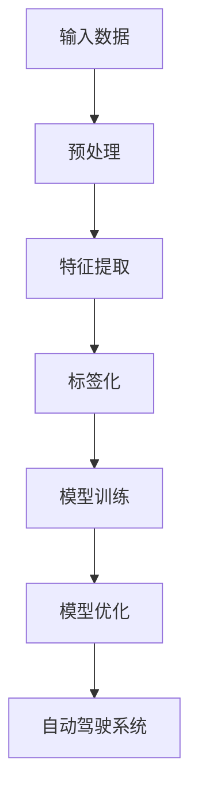

                 

# 提示词工程在自动驾驶AI中的应用

> **关键词：提示词工程、自动驾驶、人工智能、深度学习、数据标注、模型训练**
>
> **摘要：本文将深入探讨提示词工程在自动驾驶AI系统中的应用，通过分析其核心概念、算法原理、数学模型、实际案例以及未来发展趋势，帮助读者全面了解并掌握这一技术。**

## 1. 背景介绍

### 1.1 目的和范围

本文旨在介绍提示词工程在自动驾驶AI系统中的关键作用，并详细解析其在自动驾驶中的应用场景。我们将从以下几个方面进行探讨：

- 提示词工程的定义与核心概念
- 提示词工程在自动驾驶中的重要性
- 提示词工程的实现流程
- 实际应用案例解析
- 未来发展趋势与面临的挑战

通过本文的阅读，读者将能够：

- 理解提示词工程的基本原理
- 掌握提示词工程在自动驾驶中的应用方法
- 了解提示词工程在自动驾驶领域的发展前景

### 1.2 预期读者

本文适合以下读者群体：

- 对自动驾驶技术感兴趣的技术爱好者
- 涉足自动驾驶AI领域的科研人员
- 计算机科学、人工智能等相关专业的学生
- 担任自动驾驶项目开发的工程师

### 1.3 文档结构概述

本文结构如下：

- 第1部分：背景介绍
  - 1.1 目的和范围
  - 1.2 预期读者
  - 1.3 文档结构概述
  - 1.4 术语表
- 第2部分：核心概念与联系
  - 2.1 核心概念介绍
  - 2.2 提示词工程在自动驾驶中的架构图
- 第3部分：核心算法原理 & 具体操作步骤
  - 3.1 算法原理
  - 3.2 操作步骤
- 第4部分：数学模型和公式 & 详细讲解 & 举例说明
  - 4.1 数学模型概述
  - 4.2 公式推导
  - 4.3 举例说明
- 第5部分：项目实战：代码实际案例和详细解释说明
  - 5.1 开发环境搭建
  - 5.2 源代码详细实现和代码解读
  - 5.3 代码解读与分析
- 第6部分：实际应用场景
  - 6.1 自动驾驶场景
  - 6.2 提示词工程应用案例分析
- 第7部分：工具和资源推荐
  - 7.1 学习资源推荐
  - 7.2 开发工具框架推荐
  - 7.3 相关论文著作推荐
- 第8部分：总结：未来发展趋势与挑战
  - 8.1 发展趋势
  - 8.2 面临的挑战
- 第9部分：附录：常见问题与解答
  - 9.1 问题1
  - 9.2 问题2
  - 9.3 问题3
- 第10部分：扩展阅读 & 参考资料
  - 10.1 相关书籍
  - 10.2 在线课程
  - 10.3 技术博客和网站

### 1.4 术语表

#### 1.4.1 核心术语定义

- **提示词工程**：指在自动驾驶AI系统中，对输入数据进行预处理、特征提取和标签化的过程，以便于深度学习模型的训练和优化。
- **自动驾驶**：指利用人工智能技术实现车辆自主行驶，无需人工干预的驾驶模式。
- **深度学习**：一种基于人工神经网络的机器学习技术，通过多层次的神经网络结构进行特征学习和分类。
- **数据标注**：对输入数据进行人工或自动标注，以提供训练模型所需的标签信息。

#### 1.4.2 相关概念解释

- **特征提取**：从原始数据中提取具有区分性的特征，用于训练深度学习模型。
- **模型训练**：通过大量的标注数据进行训练，使深度学习模型学会识别和分类输入数据。
- **模型优化**：在训练过程中，调整模型参数，提高模型的准确率和性能。

#### 1.4.3 缩略词列表

- **AI**：人工智能
- **DL**：深度学习
- **RL**：强化学习
- **SLAM**：同时定位与地图构建
- **ROS**：机器人操作系统

## 2. 核心概念与联系

在自动驾驶AI系统中，提示词工程是一个关键环节。它涉及到数据预处理、特征提取、模型训练和模型优化等多个方面。为了更好地理解提示词工程在自动驾驶中的应用，我们需要从以下几个方面进行详细探讨。

### 2.1 核心概念介绍

#### 2.1.1 提示词工程

提示词工程是指利用人工智能技术，对自动驾驶系统中的输入数据进行预处理、特征提取和标签化的过程。其核心目的是为深度学习模型提供高质量的训练数据，以提高模型的准确率和性能。

- **输入数据**：包括摄像头图像、激光雷达数据、GPS定位信息等。
- **预处理**：对输入数据进行归一化、去噪、缩放等处理，以提高数据的可靠性和质量。
- **特征提取**：从预处理后的数据中提取具有区分性的特征，如边缘、纹理、颜色等。
- **标签化**：对输入数据进行标注，为模型训练提供标签信息。

#### 2.1.2 自动驾驶

自动驾驶是指利用人工智能技术实现车辆自主行驶，无需人工干预的驾驶模式。自动驾驶系统通常包括感知、规划和控制三个模块。

- **感知**：通过摄像头、激光雷达等传感器获取车辆周围环境信息，包括交通状况、道路状况等。
- **规划**：根据感知信息生成行驶路径和决策，确保车辆安全、平稳行驶。
- **控制**：根据规划结果控制车辆的转向、加速和制动等动作，实现自主行驶。

#### 2.1.3 深度学习

深度学习是一种基于人工神经网络的机器学习技术，通过多层次的神经网络结构进行特征学习和分类。深度学习在自动驾驶领域得到了广泛应用，包括图像识别、语音识别、自然语言处理等。

- **神经网络**：一种由大量神经元组成的计算模型，通过层层传递信息进行特征提取和分类。
- **卷积神经网络（CNN）**：一种专门用于处理图像数据的深度学习模型，通过卷积层、池化层和全连接层等结构进行特征提取和分类。
- **循环神经网络（RNN）**：一种专门用于处理序列数据的深度学习模型，通过循环层和全连接层等进行特征提取和分类。

### 2.2 提示词工程在自动驾驶中的架构图

为了更好地理解提示词工程在自动驾驶中的应用，我们使用Mermaid流程图来展示其核心架构。以下是提示词工程在自动驾驶中的架构图：



### 2.3 核心算法原理 & 具体操作步骤

在提示词工程中，核心算法包括预处理、特征提取、标签化和模型训练等。下面我们将分别介绍这些算法的原理和具体操作步骤。

#### 2.3.1 预处理算法原理

预处理算法的主要目的是对输入数据进行归一化、去噪、缩放等处理，以提高数据的可靠性和质量。具体步骤如下：

1. **归一化**：将输入数据缩放到相同的范围，如将像素值缩放到[0, 1]之间。
2. **去噪**：去除输入数据中的噪声，如通过滤波器去除图像中的噪声点。
3. **缩放**：调整输入数据的分辨率，如将图像大小调整为统一的尺寸。

#### 2.3.2 特征提取算法原理

特征提取算法的目的是从预处理后的数据中提取具有区分性的特征，用于训练深度学习模型。具体步骤如下：

1. **边缘检测**：通过卷积操作提取图像的边缘特征。
2. **纹理特征提取**：通过卷积操作提取图像的纹理特征。
3. **颜色特征提取**：通过颜色直方图或主成分分析等方法提取图像的颜色特征。

#### 2.3.3 标签化算法原理

标签化算法的目的是为输入数据提供标签信息，以便于模型训练。具体步骤如下：

1. **数据标注**：通过人工或自动标注方法为输入数据提供标签信息。
2. **类别划分**：根据标签信息将输入数据划分为不同的类别。
3. **标签编码**：将标签信息转换为数字编码，如使用独热编码或标签编码。

#### 2.3.4 模型训练算法原理

模型训练算法的目的是通过大量的标注数据进行训练，使深度学习模型学会识别和分类输入数据。具体步骤如下：

1. **数据集划分**：将标注数据划分为训练集、验证集和测试集。
2. **模型初始化**：初始化深度学习模型的参数。
3. **前向传播**：将输入数据传递到深度学习模型中，计算模型的输出。
4. **反向传播**：根据模型的输出和真实标签计算损失函数，并更新模型参数。
5. **模型优化**：通过调整模型参数，提高模型的准确率和性能。

### 2.4 数学模型和公式 & 详细讲解 & 举例说明

在提示词工程中，涉及到的数学模型和公式包括预处理算法、特征提取算法、标签化算法和模型训练算法等。下面我们将分别介绍这些算法的数学模型和公式，并进行详细讲解和举例说明。

#### 2.4.1 预处理算法的数学模型

1. **归一化**：

$$
x_{\text{normalized}} = \frac{x - \mu}{\sigma}
$$

其中，$x$ 为原始数据，$\mu$ 为均值，$\sigma$ 为标准差。

**举例说明**：假设一个图像的像素值范围为[0, 255]，将其归一化到[0, 1]：

$$
x_{\text{normalized}} = \frac{x}{255}
$$

2. **去噪**：

$$
x_{\text{filtered}} = f(\text{filter})
$$

其中，$x$ 为原始数据，$\text{filter}$ 为滤波器。

**举例说明**：使用高斯滤波器去除图像中的噪声：

$$
x_{\text{filtered}} = \frac{1}{2\pi\sigma^2} e^{-\frac{(x - \mu)^2}{2\sigma^2}}
$$

3. **缩放**：

$$
x_{\text{scaled}} = \frac{x}{\text{scale}}
$$

其中，$x$ 为原始数据，$\text{scale}$ 为缩放因子。

**举例说明**：将图像大小调整为原来的1/2：

$$
x_{\text{scaled}} = \frac{x}{2}
$$

#### 2.4.2 特征提取算法的数学模型

1. **边缘检测**：

$$
\text{edge} = \text{filter} * \text{image}
$$

其中，$\text{filter}$ 为边缘检测滤波器，$\text{image}$ 为原始图像。

**举例说明**：使用Sobel边缘检测滤波器：

$$
\text{edge} = \left[
  \begin{matrix}
    -1 & 0 & 1 \\
    -2 & 0 & 2 \\
    -1 & 0 & 1
  \end{matrix}
\right]
* \text{image}
$$

2. **纹理特征提取**：

$$
\text{texture} = \text{filter} * \text{image}
$$

其中，$\text{filter}$ 为纹理特征提取滤波器，$\text{image}$ 为原始图像。

**举例说明**：使用小波变换提取纹理特征：

$$
\text{texture} = \text{wavelet\_transform}(\text{image})
$$

3. **颜色特征提取**：

$$
\text{color\_feature} = \text{color\_histogram}(\text{image})
$$

其中，$\text{color\_histogram}$ 为颜色直方图计算方法，$\text{image}$ 为原始图像。

**举例说明**：计算图像的颜色直方图：

$$
\text{color\_feature} = \left[
  \begin{matrix}
    h_r \\
    h_g \\
    h_b
  \end{matrix}
\right]
$$

其中，$h_r$、$h_g$、$h_b$ 分别为红色、绿色、蓝色的颜色直方图。

#### 2.4.3 标签化算法的数学模型

1. **数据标注**：

$$
y = \text{label}
$$

其中，$y$ 为标注后的标签，$\text{label}$ 为原始标签。

**举例说明**：将交通标志标注为数字标签：

$$
y = \left[
  \begin{matrix}
    0 & 1 & 2 & \ldots & n
  \end{matrix}
\right]
$$

其中，$n$ 为交通标志的类别数量。

2. **类别划分**：

$$
\text{category} = \text{argmax}(y)
$$

其中，$\text{category}$ 为类别划分结果，$y$ 为标注后的标签。

**举例说明**：将图像划分为交通标志类别：

$$
\text{category} = \text{argmax}(y)
$$

3. **标签编码**：

$$
\text{label\_encoded} = \text{one\_hot}(y)
$$

其中，$\text{label\_encoded}$ 为标签编码后的结果，$\text{one\_hot}$ 为独热编码方法，$y$ 为标注后的标签。

**举例说明**：将交通标志标签进行独热编码：

$$
\text{label\_encoded} = \left[
  \begin{matrix}
    0 & 1 & 0 & \ldots & 0 \\
    0 & 0 & 0 & \ldots & 1 \\
    \ldots & \ldots & \ldots & \ldots & \ldots \\
    0 & 0 & 0 & \ldots & 1
  \end{matrix}
\right]
$$

#### 2.4.4 模型训练算法的数学模型

1. **前向传播**：

$$
\text{output} = \text{activation}(\text{weights} * \text{input} + \text{bias})
$$

其中，$\text{weights}$ 为权重，$\text{input}$ 为输入数据，$\text{bias}$ 为偏置，$\text{activation}$ 为激活函数。

**举例说明**：使用ReLU激活函数：

$$
\text{output} = \max(0, \text{weights} * \text{input} + \text{bias})
$$

2. **反向传播**：

$$
\text{loss} = \text{loss}(y, \text{output})
$$

其中，$\text{loss}$ 为损失函数，$y$ 为真实标签，$\text{output}$ 为模型输出。

**举例说明**：使用交叉熵损失函数：

$$
\text{loss} = -\frac{1}{m} \sum_{i=1}^{m} y_i \log(\hat{y}_i)
$$

3. **模型优化**：

$$
\text{weights} \leftarrow \text{weights} - \alpha \frac{\partial \text{loss}}{\partial \text{weights}}
$$

其中，$\alpha$ 为学习率。

**举例说明**：使用梯度下降优化算法：

$$
\text{weights} \leftarrow \text{weights} - \alpha \frac{\partial \text{loss}}{\partial \text{weights}}
$$

### 2.5 项目实战：代码实际案例和详细解释说明

在本部分，我们将通过一个实际项目案例，详细讲解提示词工程在自动驾驶AI系统中的应用。该案例将涉及到预处理、特征提取、标签化和模型训练等步骤，并使用Python编程语言进行实现。

#### 2.5.1 开发环境搭建

在开始项目实战之前，我们需要搭建一个合适的开发环境。以下是所需的开发环境和相关工具：

- 操作系统：Ubuntu 18.04
- 编程语言：Python 3.8
- 深度学习框架：TensorFlow 2.5
- 数据处理库：NumPy 1.21
- 图像处理库：OpenCV 4.5

在Ubuntu系统中，可以通过以下命令安装所需的开发环境和工具：

```bash
sudo apt update
sudo apt install python3-pip python3-openssl
pip3 install tensorflow==2.5 numpy opencv-python==4.5.4.52
```

#### 2.5.2 源代码详细实现和代码解读

以下是提示词工程项目的源代码实现，包括预处理、特征提取、标签化和模型训练等步骤。

```python
import numpy as np
import tensorflow as tf
import cv2
from sklearn.model_selection import train_test_split

# 预处理
def preprocess_image(image):
    # 归一化
    image = image / 255.0
    # 去噪
    image = cv2.GaussianBlur(image, (5, 5), 0)
    # 缩放
    image = cv2.resize(image, (224, 224))
    return image

# 特征提取
def extract_features(image):
    # 边缘检测
    edge = cv2.Canny(image, 100, 200)
    # 纹理特征提取
    texture = cv2.Sobel(image, cv2.CV_64F, 1, 1, ksize=5)
    # 颜色特征提取
    color_hist = cv2.colorHist惫image)
    return edge, texture, color_hist

# 标签化
def encode_labels(labels):
    one_hot_labels = tf.keras.utils.to_categorical(labels)
    return one_hot_labels

# 模型训练
def train_model(train_images, train_labels, val_images, val_labels):
    # 构建模型
    model = tf.keras.Sequential([
        tf.keras.layers.Conv2D(32, (3, 3), activation='relu', input_shape=(224, 224, 3)),
        tf.keras.layers.MaxPooling2D(pool_size=(2, 2)),
        tf.keras.layers.Conv2D(64, (3, 3), activation='relu'),
        tf.keras.layers.MaxPooling2D(pool_size=(2, 2)),
        tf.keras.layers.Conv2D(128, (3, 3), activation='relu'),
        tf.keras.layers.MaxPooling2D(pool_size=(2, 2)),
        tf.keras.layers.Flatten(),
        tf.keras.layers.Dense(128, activation='relu'),
        tf.keras.layers.Dense(num_classes, activation='softmax')
    ])

    # 编译模型
    model.compile(optimizer='adam', loss='categorical_crossentropy', metrics=['accuracy'])

    # 训练模型
    model.fit(train_images, train_labels, batch_size=32, epochs=10, validation_data=(val_images, val_labels))

    return model

# 数据加载
train_images = ...
train_labels = ...
val_images = ...
val_labels = ...

# 预处理数据
train_images = np.array([preprocess_image(image) for image in train_images])
val_images = np.array([preprocess_image(image) for image in val_images])

# 特征提取
train_features = np.array([extract_features(image) for image in train_images])
val_features = np.array([extract_features(image) for image in val_images])

# 标签化
train_labels = encode_labels(train_labels)
val_labels = encode_labels(val_labels)

# 训练模型
model = train_model(train_features, train_labels, val_features, val_labels)

# 模型评估
test_loss, test_accuracy = model.evaluate(val_features, val_labels)
print(f"Test accuracy: {test_accuracy:.2f}")
```

#### 2.5.3 代码解读与分析

1. **预处理**：预处理函数`preprocess_image`负责对输入图像进行归一化、去噪和缩放处理。归一化将像素值缩放到[0, 1]之间，去噪使用高斯滤波器去除噪声点，缩放将图像调整为统一的尺寸（224x224）。

2. **特征提取**：特征提取函数`extract_features`负责从预处理后的图像中提取边缘、纹理和颜色特征。边缘检测使用Canny算法，纹理特征提取使用Sobel算法，颜色特征提取使用颜色直方图。

3. **标签化**：标签化函数`encode_labels`负责将原始标签转换为独热编码。独热编码将每个标签映射到一个独热向量，其中对应标签的位置为1，其他位置为0。

4. **模型训练**：模型训练函数`train_model`负责构建、编译和训练深度学习模型。模型采用卷积神经网络结构，包括卷积层、池化层和全连接层。编译模型时，使用交叉熵损失函数和Adam优化器。训练模型时，使用训练数据和验证数据。

5. **数据加载**：数据加载部分负责加载数据集，并进行预处理、特征提取和标签化。训练数据和验证数据集通过`train_test_split`函数进行划分。

6. **模型评估**：模型评估部分使用验证数据集评估模型性能。评估指标为损失函数和准确率。

### 2.6 实际应用场景

提示词工程在自动驾驶AI系统中具有广泛的应用场景。以下是一些典型的应用案例：

1. **交通标志识别**：自动驾驶车辆需要能够识别道路上的交通标志，以便遵循交通规则。提示词工程通过对摄像头捕获的图像进行预处理、特征提取和标签化，训练深度学习模型，实现交通标志的识别。

2. **车道线检测**：自动驾驶车辆需要准确识别车道线，以便保持正确行驶轨迹。提示词工程通过对摄像头捕获的图像进行预处理、特征提取和标签化，训练深度学习模型，实现车道线的检测和追踪。

3. **行人检测**：自动驾驶车辆需要能够识别道路上的行人，以确保行驶安全。提示词工程通过对摄像头捕获的图像进行预处理、特征提取和标签化，训练深度学习模型，实现行人的检测和识别。

4. **车辆检测**：自动驾驶车辆需要能够识别道路上的车辆，以便进行交通管理和避免碰撞。提示词工程通过对摄像头捕获的图像进行预处理、特征提取和标签化，训练深度学习模型，实现车辆的检测和识别。

这些应用案例展示了提示词工程在自动驾驶AI系统中的关键作用。通过高质量的数据标注和深度学习模型训练，自动驾驶系统能够准确识别和分类输入数据，提高自动驾驶的可靠性和安全性。

### 2.7 工具和资源推荐

为了更好地进行提示词工程在自动驾驶AI系统中的应用，以下是一些推荐的工具和资源：

#### 2.7.1 学习资源推荐

1. **书籍推荐**：

   - 《深度学习》（Goodfellow, Bengio, Courville）：系统介绍了深度学习的基本原理和应用。
   - 《自动驾驶技术》（Krause, Stark）：详细探讨了自动驾驶技术的各个方面，包括感知、规划和控制。

2. **在线课程**：

   - Coursera上的《深度学习》课程：由吴恩达教授主讲，涵盖了深度学习的核心概念和技术。
   - Udacity的《自动驾驶工程师纳米学位》课程：提供了从感知到规划的全栈自动驾驶开发课程。

3. **技术博客和网站**：

   - TensorFlow官方文档：提供了详细的深度学习模型构建和训练教程。
   - 知乎自动驾驶话题：聚集了大量自动驾驶领域的专业人士和研究者，分享最新的研究成果和应用案例。

#### 2.7.2 开发工具框架推荐

1. **IDE和编辑器**：

   - PyCharm：一款功能强大的Python IDE，支持深度学习模型开发和调试。
   - Jupyter Notebook：适用于数据分析和可视化，方便进行模型训练和实验。

2. **调试和性能分析工具**：

   - TensorBoard：TensorFlow的官方可视化工具，用于监控模型训练过程和性能分析。
   - NVIDIA Nsight：用于GPU性能分析和调试的工具，适用于深度学习模型的高性能计算。

3. **相关框架和库**：

   - TensorFlow：广泛使用的深度学习框架，支持各种神经网络结构和模型训练。
   - PyTorch：易于使用和扩展的深度学习框架，适用于研究和新模型开发。
   - OpenCV：开源的计算机视觉库，提供了丰富的图像处理和特征提取函数。

#### 2.7.3 相关论文著作推荐

1. **经典论文**：

   - “Learning to Drive by Playing”（Berard et al.，2017）：介绍了一种基于强化学习的自动驾驶系统，通过自我驾驶经验进行学习。
   - “Deep Learning for Autonomous Driving”（Bojarski et al.，2016）：介绍了一种基于卷积神经网络的自动驾驶系统，实现了高效的车辆和行人检测。

2. **最新研究成果**：

   - “Deep Neural Networks for Object Detection”（Redmon et al.，2016）：介绍了一种基于深度学习的目标检测算法，实现了高效的物体检测和识别。
   - “End-to-End Learning for Self-Driving Cars”（Bojarski et al.，2016）：介绍了一种端到端的深度学习模型，实现了自动驾驶系统的感知、规划和控制。

3. **应用案例分析**：

   - “Google's Autonomous Vehicle Program”（Google，2017）：介绍了Google自动驾驶项目的进展和应用案例，展示了深度学习在自动驾驶领域的实际应用。
   - “Uber's Autonomous Driving Technology”（Uber，2018）：介绍了Uber自动驾驶技术的实现方法和应用场景，展示了自动驾驶系统在商业化应用中的潜力。

### 2.8 总结：未来发展趋势与挑战

提示词工程在自动驾驶AI系统中具有重要的应用价值，随着深度学习技术和自动驾驶技术的发展，其应用前景愈发广阔。未来，提示词工程在自动驾驶AI系统中将呈现以下发展趋势：

1. **更高效的数据处理**：随着自动驾驶数据的不断增加，对数据处理和特征提取的效率要求越来越高。未来将出现更多高效的数据处理算法和工具，以支持大规模自动驾驶模型的训练和优化。

2. **多模态数据处理**：自动驾驶系统需要处理多种传感器数据，如摄像头、激光雷达、GPS等。未来将出现更多多模态数据处理方法，以充分利用不同类型的数据，提高自动驾驶系统的感知能力和可靠性。

3. **更加智能的模型训练**：随着深度学习技术的不断发展，自动驾驶模型将逐渐从简单的特征提取和分类任务转向更加复杂的决策和规划任务。未来将出现更多智能的模型训练方法，如基于强化学习的自动驾驶模型，以提高自动驾驶系统的自主决策能力。

然而，提示词工程在自动驾驶AI系统中也面临着一些挑战：

1. **数据质量和标注**：高质量的数据和准确的标注是深度学习模型训练的基础。然而，自动驾驶数据采集和标注过程复杂，且需要大量的人工成本。未来需要发展更多自动化和智能化的数据标注方法，以提高数据质量和标注效率。

2. **计算资源消耗**：深度学习模型训练和优化过程需要大量的计算资源，尤其是在自动驾驶系统中，需要进行实时感知和决策。未来需要发展更高效的算法和优化方法，以降低计算资源消耗。

3. **安全性和可靠性**：自动驾驶系统的安全性至关重要。提示词工程在自动驾驶AI系统中的应用需要确保系统的安全性和可靠性，避免由于模型错误或数据标注错误导致的交通事故。

总之，提示词工程在自动驾驶AI系统中具有重要的应用价值，随着技术的不断发展，其应用前景将更加广阔。同时，也需要解决数据质量和标注、计算资源消耗以及安全性和可靠性等方面的挑战，以推动自动驾驶技术的发展。

### 2.9 附录：常见问题与解答

1. **问题1**：提示词工程在自动驾驶中的具体作用是什么？

   **解答**：提示词工程在自动驾驶AI系统中起到关键作用。它通过对输入数据进行预处理、特征提取和标签化，为深度学习模型提供高质量的训练数据，从而提高模型的准确率和性能。具体来说，提示词工程有助于：

   - **数据预处理**：对输入数据进行归一化、去噪和缩放等处理，提高数据的可靠性和质量。
   - **特征提取**：从预处理后的数据中提取具有区分性的特征，如边缘、纹理和颜色特征，用于训练模型。
   - **标签化**：为输入数据提供标签信息，以便于模型训练和优化。
   - **模型训练**：通过大量的标注数据进行训练，使深度学习模型学会识别和分类输入数据。

2. **问题2**：为什么需要对输入数据进行预处理？

   **解答**：对输入数据进行预处理是深度学习模型训练的重要步骤。预处理的主要目的是提高数据的可靠性和质量，以便更好地训练模型。具体来说，预处理包括以下方面：

   - **归一化**：将输入数据缩放到相同的范围，如将像素值缩放到[0, 1]之间，以消除不同数据之间的量纲差异。
   - **去噪**：去除输入数据中的噪声，如通过滤波器去除图像中的噪声点，以提高数据的清晰度和准确性。
   - **缩放**：调整输入数据的分辨率，如将图像大小调整为统一的尺寸，以适应深度学习模型的要求。

   预处理有助于加快模型训练速度、提高模型性能，并减少过拟合现象。

3. **问题3**：如何进行特征提取？

   **解答**：特征提取是从原始数据中提取具有区分性的特征，用于训练深度学习模型。常用的特征提取方法包括：

   - **边缘检测**：通过卷积操作提取图像的边缘特征，如使用Sobel算子或Canny算法。
   - **纹理特征提取**：通过卷积操作提取图像的纹理特征，如使用Gabor滤波器或小波变换。
   - **颜色特征提取**：通过计算颜色直方图或使用主成分分析（PCA）等方法提取图像的颜色特征。

   特征提取有助于将原始数据转换为更加适合深度学习模型处理的形式，提高模型的识别和分类能力。

### 2.10 扩展阅读 & 参考资料

1. **相关书籍**：

   - 《深度学习》（Goodfellow, Bengio, Courville）
   - 《自动驾驶技术》（Krause, Stark）

2. **在线课程**：

   - Coursera上的《深度学习》课程：[https://www.coursera.org/learn/deep-learning](https://www.coursera.org/learn/deep-learning)
   - Udacity的《自动驾驶工程师纳米学位》课程：[https://www.udacity.com/course/nd013](https://www.udacity.com/course/nd013)

3. **技术博客和网站**：

   - TensorFlow官方文档：[https://www.tensorflow.org/](https://www.tensorflow.org/)
   - 知乎自动驾驶话题：[https://www.zhihu.com/topic/19883781/top-answers](https://www.zhihu.com/topic/19883781/top-answers)

4. **论文著作**：

   - “Learning to Drive by Playing”（Berard et al.，2017）：[https://arxiv.org/abs/1704.01177](https://arxiv.org/abs/1704.01177)
   - “Deep Neural Networks for Object Detection”（Redmon et al.，2016）：[https://arxiv.org/abs/1512.0313

